# Geospatial System Design

Modern applications frequently deal with **location-based data**:

- Ride-sharing apps
- Food delivery services
- Navigation systems
- Location-based search
- Social check-ins
- Logistics tracking

Companies like:

- :contentReference[oaicite:0]{index=0}  
- :contentReference[oaicite:1]{index=1}  
- :contentReference[oaicite:2]{index=2}  

process **millions of geospatial queries every second**.

Examples of such queries include:

- Find drivers **within 3 km**
- Show restaurants **near the user**
- Track vehicles **moving across regions**
- Detect **objects inside a geographic boundary**

Efficiently answering these queries requires **specialized spatial indexing techniques**.

This article explores three key methods used in distributed systems:

1. **Quadtrees**
2. **Geohashing**
3. **Google S2 Geometry**

---

# The Challenge of Geospatial Queries

Location data is typically represented as:

```text
(latitude, longitude)
````

Example:

| Location | Latitude | Longitude |
| -------- | -------- | --------- |
| New York | 40.7128  | -74.0060  |
| London   | 51.5072  | -0.1276   |
| Tokyo    | 35.6762  | 139.6503  |

A naive database query might look like:

```sql
SELECT * FROM drivers
WHERE distance(driver_location, user_location) < 5km;
```

This becomes inefficient at scale because:

* Distance calculations are expensive
* Millions of points must be scanned
* Databases cannot easily index spherical coordinates

Thus we need **spatial partitioning techniques**.

---

# Spatial Partitioning

The core idea:

> Divide the Earth's surface into smaller regions so queries only search relevant areas.

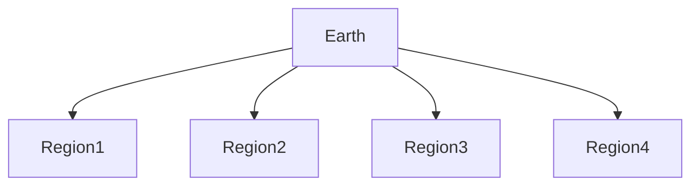

Benefits:

* Faster queries
* Efficient indexing
* Scalable distributed systems

---

# Quadtree

## Concept

A **Quadtree** recursively divides a 2D space into **four equal quadrants**.

Each node represents a geographic area.

If too many points exist in a region, it is subdivided further.

---

## Quadtree Structure

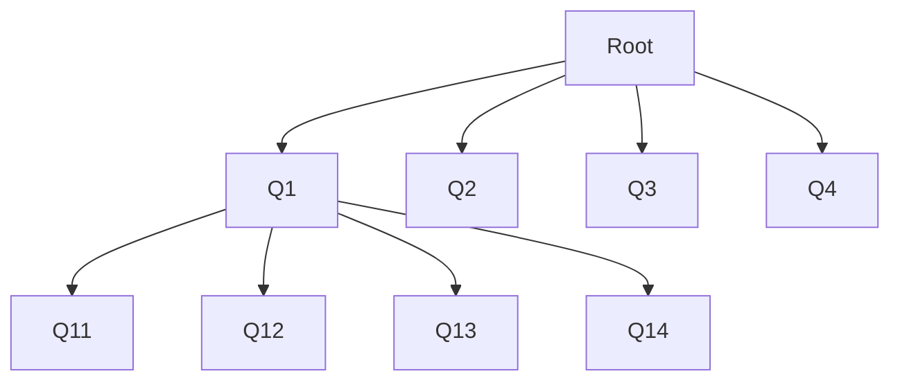

Each subdivision increases **spatial resolution**.

---

## Example

Imagine storing drivers across a city.

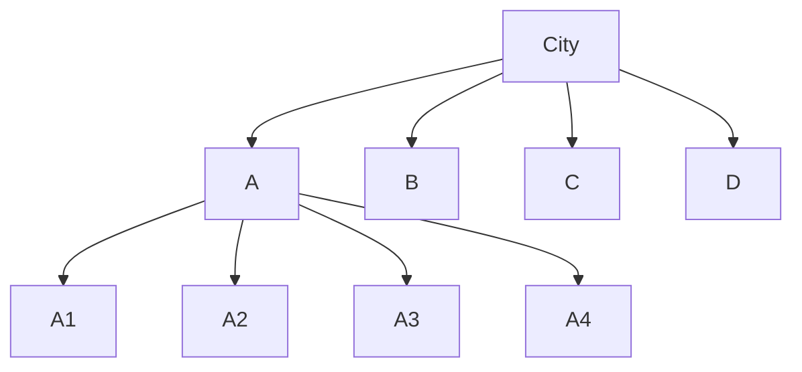

If region **A** contains many drivers, it is subdivided further.

---

## Quadtree Node Structure

Example structure:

```javascript
class QuadTreeNode {
  constructor(boundary, capacity) {
    this.boundary = boundary
    this.capacity = capacity
    this.points = []
    this.divided = false
  }
}
```

---

## Querying with Quadtrees

To find nearby objects:

1. Identify the quadrant containing the query location
2. Search that node
3. Search adjacent nodes if needed

---

## Quadtree Query Flow

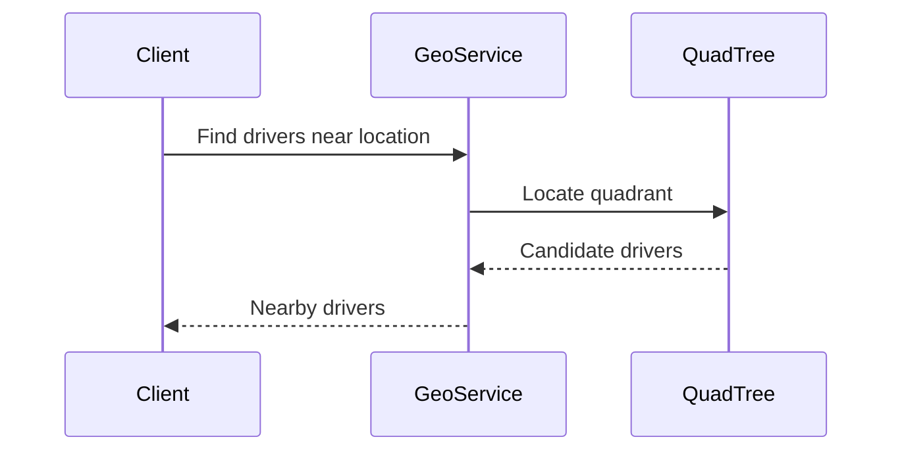

---

## Advantages

| Benefit                 | Explanation                  |
| ----------------------- | ---------------------------- |
| Efficient range queries | Search limited area          |
| Simple structure        | Easy to implement            |
| Dynamic                 | Handles uneven distributions |

---

## Limitations

| Problem              | Explanation                    |
| -------------------- | ------------------------------ |
| Uneven density       | Urban areas cause deep trees   |
| Memory overhead      | Many nodes                     |
| Poor global indexing | Harder for distributed systems |

---

# Geohashing

## Concept

**Geohashing** converts geographic coordinates into **string-based grid identifiers**.

Example:

```
Latitude: 37.7749
Longitude: -122.4194
Geohash: 9q8yy
```

Nearby locations share **similar prefixes**.

---

## Geohash Grid

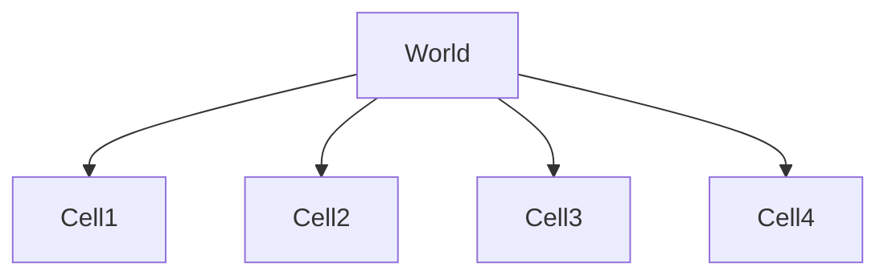

Each cell represents a **rectangular region**.

Longer geohashes = **higher precision**.

---

## Precision Levels

| Geohash Length | Area Size |
| -------------- | --------- |
| 3              | ~150 km   |
| 5              | ~5 km     |
| 7              | ~150 m    |
| 9              | ~5 m      |

---

## Geohash Example

Nearby locations:

```
Location A → 9q8yy
Location B → 9q8yz
Location C → 9q8yv
```

Shared prefix:

```
9q8y
```

This indicates they are geographically close.

---

## Geohash Indexing in Databases

Location data can be indexed as strings.

Example schema:

```sql
CREATE TABLE drivers (
  id INT,
  geohash VARCHAR(12),
  latitude FLOAT,
  longitude FLOAT
);
```

Query:

```sql
SELECT * FROM drivers
WHERE geohash LIKE '9q8y%';
```

---

## Geohash Architecture

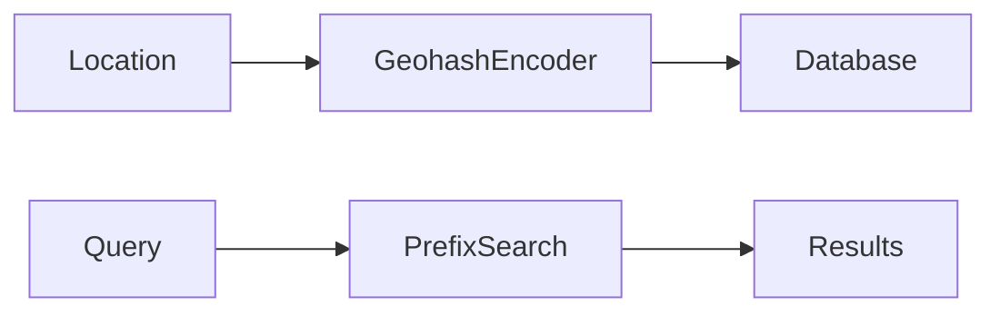

---

## Advantages

| Benefit             | Explanation                    |
| ------------------- | ------------------------------ |
| Simple indexing     | Works with standard DB indexes |
| Fast prefix queries | Efficient for nearby searches  |
| Compact             | Small representation           |

---

## Limitations

| Problem             | Explanation                               |
| ------------------- | ----------------------------------------- |
| Edge issues         | Nearby points may fall in different cells |
| Rectangular grid    | Not ideal for spherical Earth             |
| Precision tradeoffs | Smaller cells increase complexity         |

---

# Google S2 Geometry

## Concept

The **S2 geometry system** represents Earth as a **hierarchical grid of cells mapped onto a sphere**.

It was developed by:

* Google

and is used in:

* Google Maps
* Uber

---

## Why Not Use Flat Grids?

Earth is spherical.

Flat grid systems introduce distortions.

S2 solves this by mapping the sphere onto a **cube projection**.

---

## S2 Projection Model

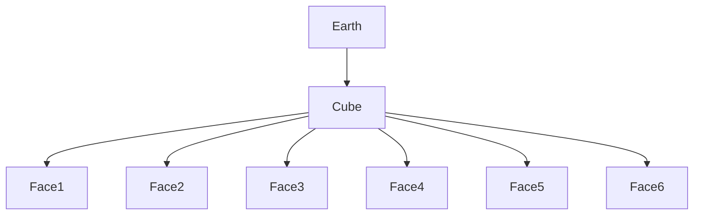

Each cube face is then subdivided into smaller cells.

---

## S2 Hierarchical Cells

Each cell has a **unique identifier**.

Cells can be subdivided recursively.

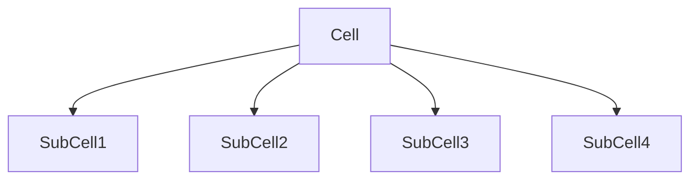

This creates a **multi-resolution spatial index**.

---

## Example Cell Levels

| Level    | Cell Size |
| -------- | --------- |
| Level 5  | ~250 km   |
| Level 10 | ~10 km    |
| Level 15 | ~300 m    |
| Level 20 | ~10 m     |

---

## S2 Cell ID

Each cell is encoded as a **64-bit integer**.

Example:

```
Cell ID: 9260949627242122337
```

This allows efficient database indexing.

---

## Spatial Query with S2

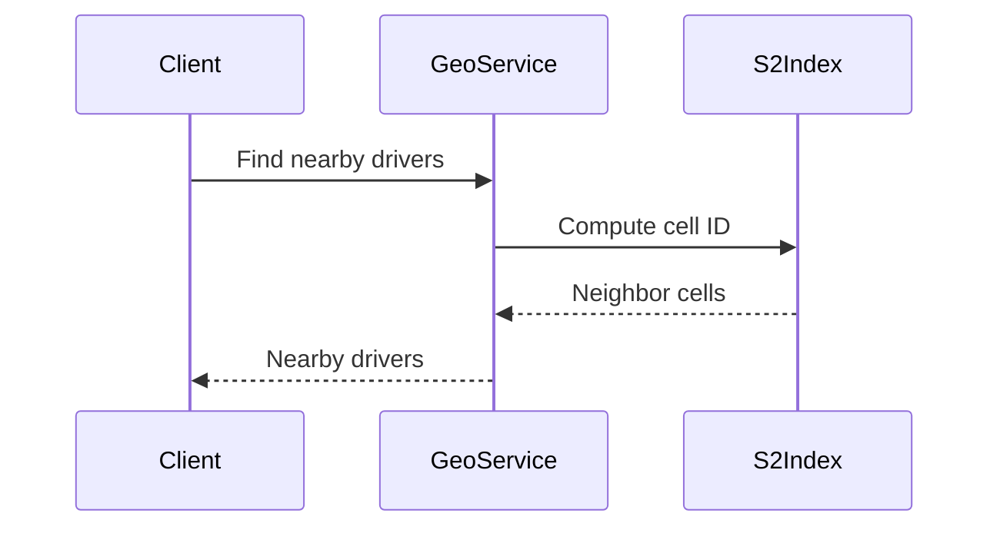

---

# Comparing the Approaches

| Feature              | Quadtree | Geohash          | S2                |
| -------------------- | -------- | ---------------- | ----------------- |
| Space representation | 2D grid  | Rectangular grid | Spherical cells   |
| Index type           | Tree     | String prefix    | Integer hierarchy |
| Query performance    | Good     | Good             | Excellent         |
| Distributed systems  | Moderate | Good             | Excellent         |
| Global accuracy      | Moderate | Moderate         | High              |

---

# Large Scale Geospatial Architecture

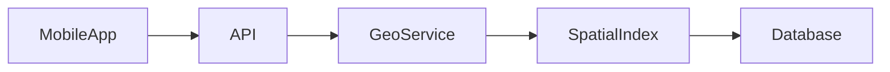

Components:

| Component     | Role                      |
| ------------- | ------------------------- |
| Mobile app    | Sends location queries    |
| API           | Receives requests         |
| Geo service   | Handles spatial logic     |
| Spatial index | Efficient location lookup |
| Database      | Stores entities           |

---

# Example: Ride Matching System

Used by ride-sharing services.

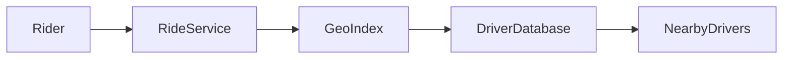

Steps:

1. Rider requests ride
2. System computes geospatial cell
3. Nearby drivers retrieved
4. Matching algorithm selects driver

---

# Geospatial Scaling Challenges

Large systems must handle:

| Challenge             | Explanation                   |
| --------------------- | ----------------------------- |
| Billions of locations | Vehicles, users               |
| Real-time updates     | GPS updates every few seconds |
| Low latency           | Query must return quickly     |
| Global coverage       | Entire Earth indexed          |

---

# Optimization Techniques

## Region-Based Sharding

Split data by geographic regions.

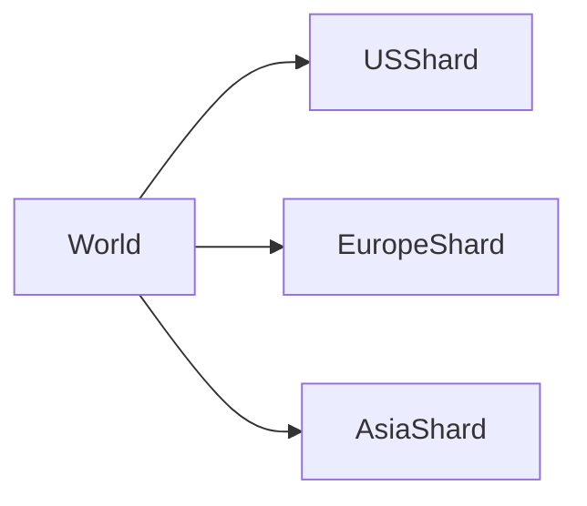

---

## Caching Hot Regions

Cities with heavy traffic are cached.

Example:

| City     | Cache      |
| -------- | ---------- |
| New York | Hot region |
| London   | Hot region |
| Tokyo    | Hot region |

---

## Streaming Location Updates

Vehicle positions are streamed through messaging systems.

Example architecture:

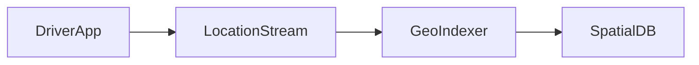

---

# Best Practices

### Use Hierarchical Spatial Indexes

Hierarchical systems support efficient range queries.

---

### Combine Spatial Index with Database

Use geospatial indexes with distributed databases.

---

### Cache Hot Locations

Urban areas produce the majority of queries.

---

### Batch Location Updates

Frequent updates can overwhelm systems.

---

# Summary

Geospatial system design is essential for location-based applications.

Three common spatial indexing approaches are:

| Technique   | Use Case                      |
| ----------- | ----------------------------- |
| Quadtrees   | Simple spatial partitioning   |
| Geohashing  | Database-friendly indexing    |
| S2 Geometry | High precision global systems |

Large-scale platforms like:

* Uber
* Google Maps

rely on these techniques to efficiently process **millions of geospatial queries every second**.

Understanding these spatial indexing methods is crucial for designing **scalable location-aware distributed systems**.