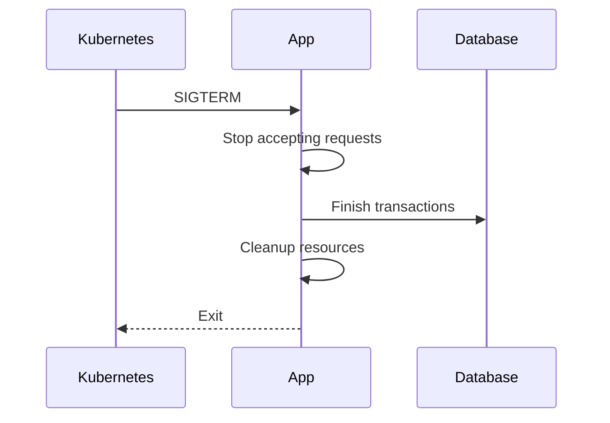
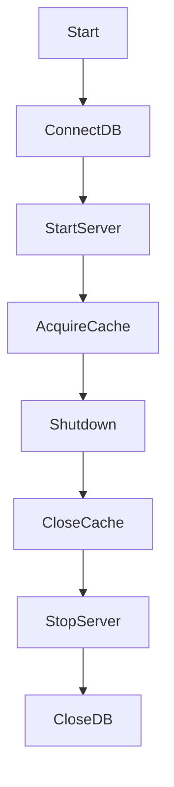
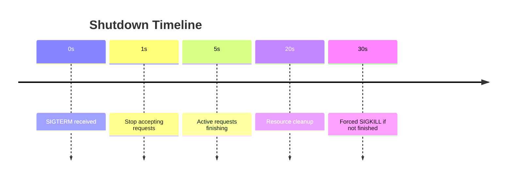
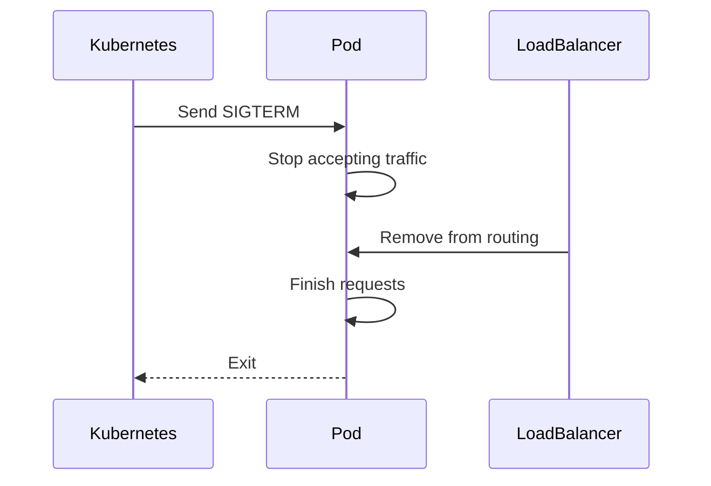

# Graceful Shutdown

Graceful shutdown is the process of **safely stopping a server without interrupting active operations or corrupting data**.

Instead of immediately terminating a running application, the server:

1. **Stops accepting new requests**
2. **Allows ongoing requests to complete**
3. **Cleans up resources**
4. **Exits safely**

This concept is extremely important in **modern backend systems**, especially during:

- Deployments
- Container restarts
- Scaling events
- Server crashes
- Infrastructure upgrades

Without graceful shutdown, applications can cause:

- Partial database writes
- Lost transactions
- Corrupted data
- Broken user sessions
- Duplicate payments

Graceful shutdown ensures the system behaves **predictably and safely** even when servers are restarted.

---

# Why Graceful Shutdown Matters

Imagine a user placing an order online.

```mermaid
sequenceDiagram
User->>Server: Submit payment
Server->>Database: Create transaction
Note over Server: Server restarts here ❌
Database-->>Server: Transaction incomplete
Server-->>User: Request failed
````

If the server shuts down **abruptly**, the payment may:

* get processed but response lost
* get partially written
* get duplicated

Now imagine the server performing **graceful shutdown**.

```mermaid
sequenceDiagram
User->>Server: Submit payment
Server->>Database: Create transaction
Server->>Server: Shutdown signal received
Note over Server: Finish request first
Database-->>Server: Transaction committed
Server-->>User: Payment successful
Server->>Server: Shutdown safely
```

The server **finishes the operation first**, then shuts down.

---

# The Server Lifecycle

Every backend application goes through a lifecycle.


Graceful shutdown handles the **last stage of this lifecycle properly**.

---

# Shutdown Isn't a Command — It's a Conversation

In Unix-like systems (Linux, macOS), applications communicate with the operating system using **signals**.

A signal is essentially a **message sent to a process**.

Common shutdown signals:

| Signal    | Name      | Sent By            | Meaning                     |
| --------- | --------- | ------------------ | --------------------------- |
| `SIGTERM` | Terminate | OS / orchestrators | Politely request shutdown   |
| `SIGINT`  | Interrupt | User (`Ctrl + C`)  | Request to stop process     |
| `SIGKILL` | Kill      | OS                 | Force immediate termination |

---

## SIGTERM — The Polite Shutdown Request

`SIGTERM` is the **standard signal used to initiate graceful shutdown**.

It tells the application:

> "Please finish your work and exit cleanly."

This signal is commonly sent by:

* Docker
* Kubernetes
* PM2
* Systemd
* Deployment pipelines

Example flow:



---

## SIGINT — Manual Shutdown

`SIGINT` occurs when a developer presses:

```
Ctrl + C
```

This signal behaves similarly to `SIGTERM`.

Example:

```bash
node server.js
^C
```

This sends a `SIGINT` signal.

A well-designed server should handle **both SIGTERM and SIGINT**.

---

# The Dangerous Signal: SIGKILL

If the application **ignores SIGTERM**, the operating system eventually sends:

```
SIGKILL
```

`SIGKILL` is **forceful termination**.

Important characteristics:

| Property              | Behavior |
| --------------------- | -------- |
| Catchable             | ❌ No     |
| Ignorable             | ❌ No     |
| Cleanup possible      | ❌ No     |
| Immediate termination | ✅ Yes    |

When `SIGKILL` happens:

* active requests stop instantly
* database transactions may break
* files may remain open
* memory cleanup never happens

Analogy:

| Signal  | Real World Equivalent                 |
| ------- | ------------------------------------- |
| SIGTERM | Asking someone politely to leave      |
| SIGINT  | A person pressing the stop button     |
| SIGKILL | Pulling the power cable from the wall |

---

# The Restaurant Closing Protocol

Graceful shutdown follows a simple rule:

> **Stop new work before finishing existing work**

The best analogy is **a restaurant closing for the night**.

### Step 1 — Stop New Customers

When closing time arrives, the restaurant host stops seating new customers.

Servers do the same.

They **stop accepting new HTTP connections**.

Example:


---

### Step 2 — Let Existing Customers Finish

Customers already eating are **allowed to finish their meals**.

Similarly, servers allow **active requests to complete**.

Example of active requests:

* payment processing
* file upload
* database write
* API computation

This prevents:

* partial transactions
* corrupted writes
* failed responses

---

# Resource Cleanup

Once requests finish, the server begins **cleanup**.

During runtime, applications allocate many resources.

| Resource             | Why Cleanup Matters      |
| -------------------- | ------------------------ |
| Database connections | Prevent connection leaks |
| Network sockets      | Avoid port exhaustion    |
| File handles         | Prevent file locks       |
| Cache entries        | Prevent stale data       |
| Worker threads       | Prevent memory leaks     |

Typical cleanup tasks:

```javascript
async function shutdown() {
  console.log("Shutting down...");

  await server.close();
  await database.close();
  await cache.disconnect();

  process.exit(0);
}
```

---

# Reverse Order Cleanup Rule

Resources should be released in the **reverse order they were acquired**.

Example:



Why?

Because some resources **depend on others**.

Example mistake:

❌ Closing the database **before finishing requests**.

---

# The Shutdown Timeout

Graceful shutdown cannot wait forever.

Most systems implement a **shutdown timeout**.

Typical value:

```
30 seconds
```

During this window:

1. Server stops accepting requests
2. Active requests finish
3. Resources clean up

If the timeout expires:

```
OS sends SIGKILL
```

Example timeline:



---

# Implementing Graceful Shutdown in Node.js

A basic Node.js example.

```javascript
import http from "http";

const server = http.createServer((req, res) => {
  setTimeout(() => {
    res.end("Request completed");
  }, 2000);
});

server.listen(3000, () => {
  console.log("Server running on port 3000");
});

function gracefulShutdown(signal) {
  console.log(`Received ${signal}. Closing server...`);

  server.close(() => {
    console.log("All connections closed");
    process.exit(0);
  });

  setTimeout(() => {
    console.error("Forcing shutdown");
    process.exit(1);
  }, 30000);
}

process.on("SIGTERM", gracefulShutdown);
process.on("SIGINT", gracefulShutdown);
```

---

# Graceful Shutdown with Active Request Tracking

Production systems often track **active requests**.

```javascript
let activeRequests = 0;
let shuttingDown = false;

const server = http.createServer((req, res) => {

  if (shuttingDown) {
    res.statusCode = 503;
    return res.end("Server restarting");
  }

  activeRequests++;

  res.on("finish", () => {
    activeRequests--;
  });

  res.end("Hello");
});

function shutdown() {
  shuttingDown = true;

  server.close(() => {
    if (activeRequests === 0) {
      process.exit(0);
    }
  });
}
```

This ensures **all requests finish before exit**.

---

# Graceful Shutdown in Kubernetes

Kubernetes heavily relies on graceful shutdown.

Deployment flow:



Kubernetes typically provides:

```
terminationGracePeriodSeconds: 30
```

Example config:

```yaml
spec:
  terminationGracePeriodSeconds: 30
```

---

# Common Mistakes

### Ignoring SIGTERM

Many servers only respond to `Ctrl+C`.

Production systems rely on `SIGTERM`.

---

### Not Waiting for Requests

Closing server immediately:

```javascript
server.close();
process.exit();
```

This drops requests.

---

### No Shutdown Timeout

Infinite waiting can block deployments.

---

### Closing Database Too Early

Always finish operations **before closing resources**.

---

# Best Practices

| Practice                      | Why                             |
| ----------------------------- | ------------------------------- |
| Handle `SIGTERM` and `SIGINT` | Works in production and locally |
| Stop accepting new requests   | Prevent workload growth         |
| Track active requests         | Ensure safe completion          |
| Implement shutdown timeout    | Avoid stuck shutdown            |
| Cleanup resources             | Prevent leaks                   |
| Test shutdown behavior        | Avoid deployment surprises      |

---

# Real World Analogy

Graceful shutdown is like **closing a restaurant**.

| Restaurant             | Server                 |
| ---------------------- | ---------------------- |
| Stop seating customers | Stop new requests      |
| Let diners finish      | Finish active requests |
| Clean tables           | Release resources      |
| Turn off lights        | Exit process           |

If the power suddenly goes out:

* food unfinished
* payment incomplete
* chaos

Graceful shutdown avoids this chaos.

---

# Conclusion

Graceful shutdown is a **core reliability feature of backend systems**.

It ensures:

* active user requests finish safely
* data remains consistent
* deployments cause no disruption
* infrastructure can restart servers without damage

Modern systems **restart servers constantly** during:

* scaling
* deployments
* failovers
* updates

By implementing graceful shutdown, we transform shutdown from a **dangerous crash** into a **predictable lifecycle event**.

A professional backend system doesn't just start correctly.

It also **knows how to say goodbye politely**.