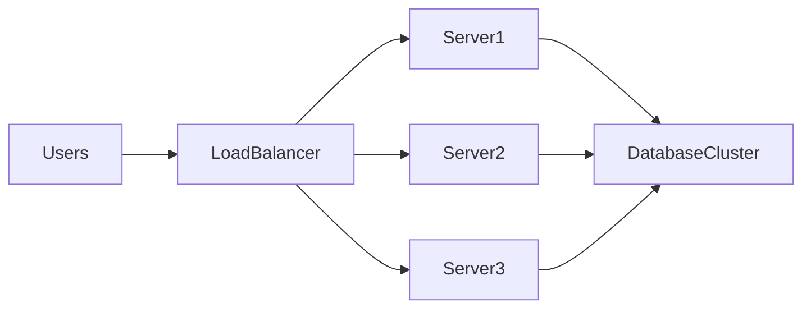
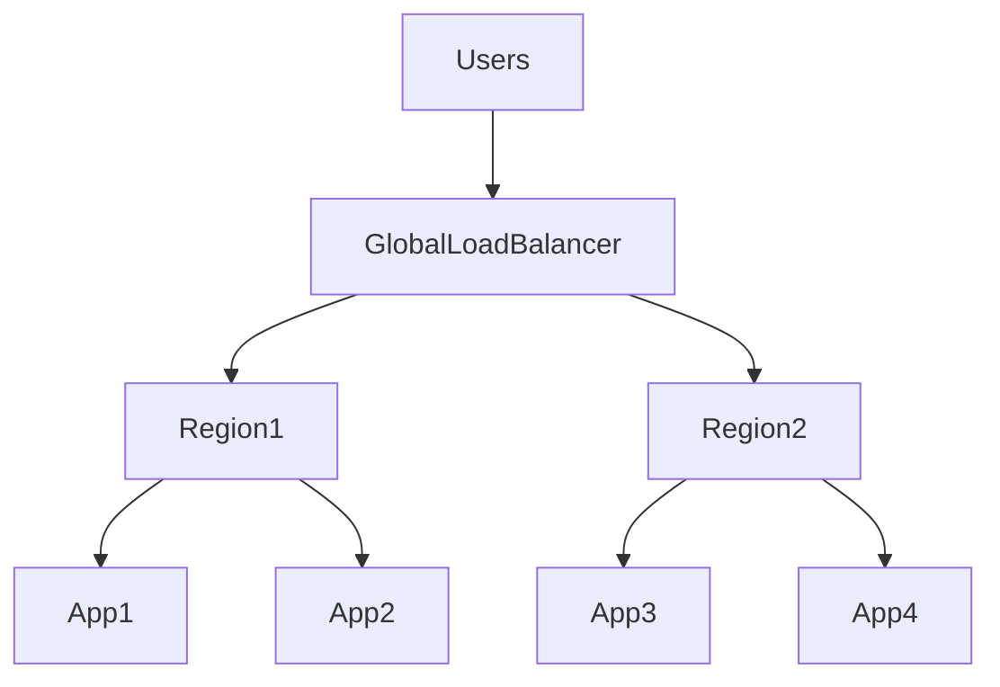
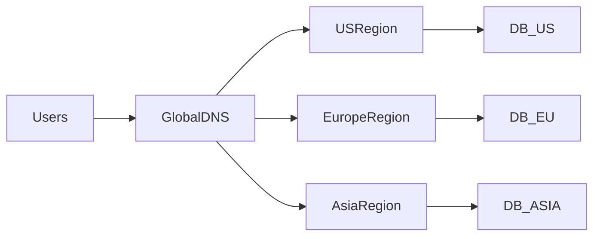
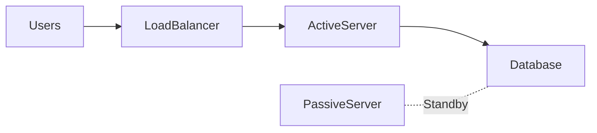
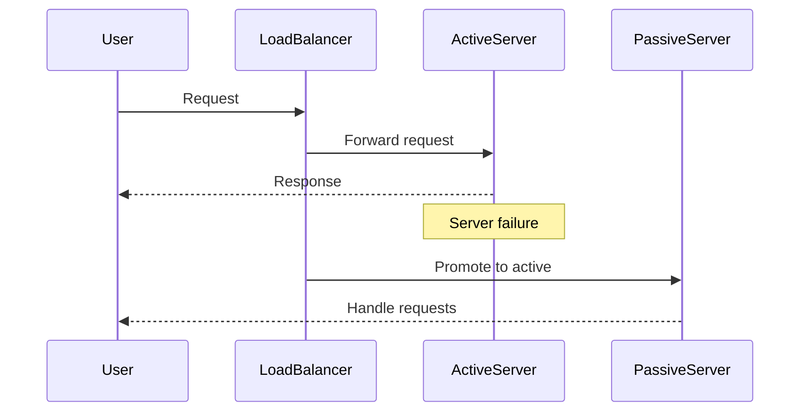
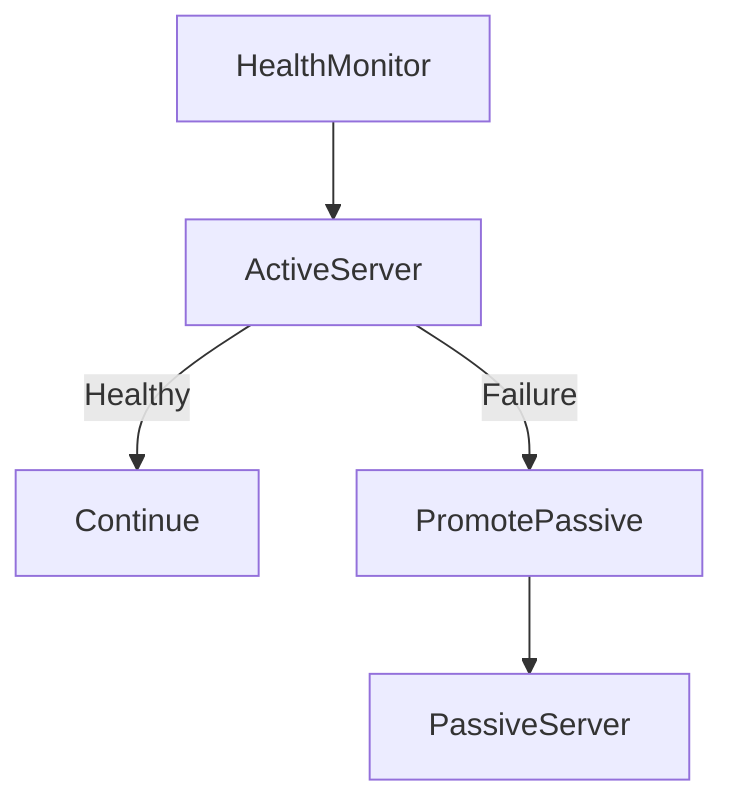
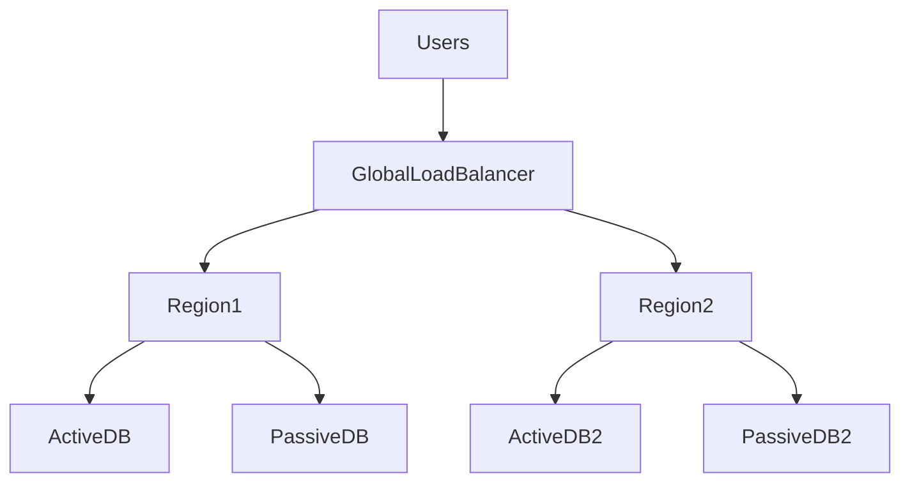
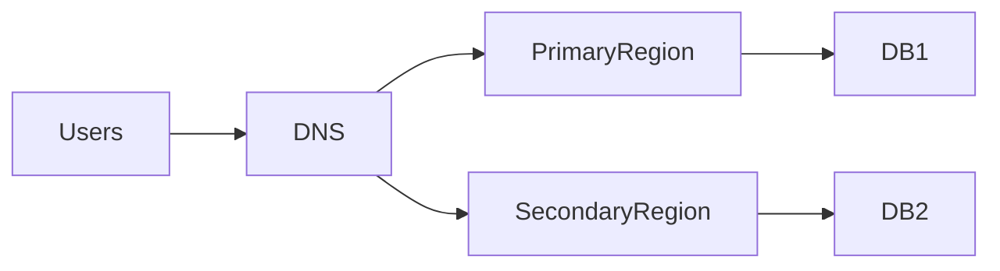
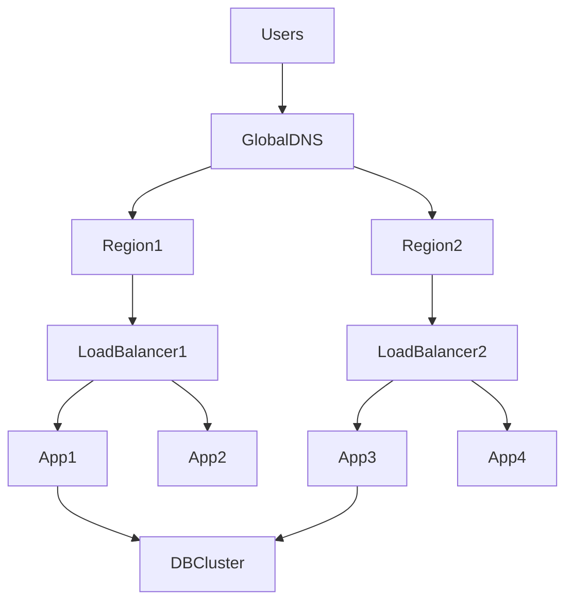

# High Availability Systems: Active-Active and Active-Passive

## Introduction

Modern digital platforms are expected to be **available almost all the time**.

When users interact with systems such as:

- :contentReference[oaicite:0]{index=0}  
- :contentReference[oaicite:1]{index=1}  
- :contentReference[oaicite:2]{index=2}  

they expect services to work **24/7 with minimal downtime**.

However, real systems face many failures:

| Failure Type | Example |
|---|---|
| Hardware failure | Server crash |
| Network failure | Data center network outage |
| Software bugs | Memory leaks |
| Infrastructure outage | Entire region down |
| Deployment issues | Faulty release |

To handle such failures, systems are designed with **High Availability (HA)**.

High availability ensures that:

> **A system continues operating even when components fail.**

One of the most important architectural techniques used to achieve HA is **redundancy**.

Two common redundancy patterns are:

| Pattern | Description |
|---|---|
| **Active-Active** | Multiple nodes actively serve traffic simultaneously |
| **Active-Passive** | One node serves traffic while another remains on standby |

---

# What is High Availability?

High availability is the ability of a system to remain **operational for long periods with minimal downtime**.

Availability is usually expressed as **uptime percentage**.

| Availability | Downtime per Year |
|---|---|
| 99% | ~3.65 days |
| 99.9% | ~8.76 hours |
| 99.99% | ~52 minutes |
| 99.999% (Five Nines) | ~5 minutes |

Large-scale systems aim for **four or five nines availability**.

---

# Why High Availability Matters

Without HA architecture:

```mermaid
flowchart LR
    Users --> AppServer
    AppServer --> Database
````

If **AppServer fails**, the entire system stops working.

Single points of failure are dangerous in distributed systems.

---

# High Availability Through Redundancy

High availability is achieved by **running multiple instances of critical components**.

```mermaid
flowchart LR
    Users --> LoadBalancer
    LoadBalancer --> Server1
    LoadBalancer --> Server2
    LoadBalancer --> Server3
```

If one server fails, others continue serving traffic.

This redundancy can be implemented using two primary patterns:

1. **Active-Active Architecture**
2. **Active-Passive Architecture**

---

# Active-Active Architecture

## Concept

In an **Active-Active system**, multiple servers **actively handle traffic at the same time**.

All nodes are **live and processing requests**.



If one server fails:

* the load balancer stops routing traffic to it
* other servers continue serving users

Users typically **do not notice any disruption**.

---

## Example Scenario

Consider a **video streaming platform** like Netflix.

Requests arrive globally.

Traffic is distributed across multiple active servers:



All application instances handle requests simultaneously.

---

# Characteristics of Active-Active Systems

| Characteristic              | Explanation                  |
| --------------------------- | ---------------------------- |
| All nodes serve traffic     | No idle resources            |
| High scalability            | Add more nodes to scale      |
| Automatic failover          | Traffic shifts automatically |
| Better resource utilization | Every node works             |

---

# Active-Active Data Replication

To maintain consistency, data must be **replicated across nodes**.

Two approaches:

| Method                   | Description                                    |
| ------------------------ | ---------------------------------------------- |
| Synchronous replication  | Writes happen on multiple nodes simultaneously |
| Asynchronous replication | Writes propagate later                         |

---

## Multi-Region Active-Active Example



Each region serves traffic.

Data is replicated across regions.

---

# Benefits of Active-Active Architecture

| Benefit           | Explanation                     |
| ----------------- | ------------------------------- |
| High availability | No single point of failure      |
| Scalability       | Nodes can scale horizontally    |
| Load distribution | Traffic shared across nodes     |
| Faster response   | Requests served closer to users |

---

# Challenges of Active-Active Systems

| Challenge                  | Explanation             |
| -------------------------- | ----------------------- |
| Data conflicts             | Simultaneous writes     |
| Replication complexity     | Maintaining consistency |
| Higher infrastructure cost | Multiple active nodes   |
| Debugging complexity       | Distributed failures    |

---

# Active-Passive Architecture

## Concept

In **Active-Passive architecture**, only **one node actively serves traffic**.

The other node remains **standby (passive)**.



If the active node fails:

1. Passive node becomes active
2. Traffic shifts to the new node

This process is called **failover**.

---

# Active-Passive Failover Process



---

# Example: Database Replication

Active-passive is commonly used for **databases**.

Primary database handles writes.

Replica database stays on standby.


If primary fails:


Replica becomes the new primary.

---

# Characteristics of Active-Passive Systems

| Characteristic        | Explanation         |
| --------------------- | ------------------- |
| One active node       | Handles all traffic |
| Passive standby       | Ready for failover  |
| Simpler architecture  | Easier to maintain  |
| Lower write conflicts | Only one writer     |

---

# Benefits of Active-Passive Architecture

| Benefit            | Explanation           |
| ------------------ | --------------------- |
| Simpler design     | Easier implementation |
| Easier consistency | Single writer model   |
| Reliable failover  | Predictable recovery  |

---

# Limitations of Active-Passive Systems

| Limitation        | Explanation                |
| ----------------- | -------------------------- |
| Idle resources    | Passive node unused        |
| Failover delay    | Detection + promotion time |
| Lower scalability | Single active node         |

---

# Failover Mechanisms

Failover detection usually relies on **health checks**.



Common detection methods:

| Method            | Description               |
| ----------------- | ------------------------- |
| Heartbeat checks  | Periodic ping             |
| Health endpoints  | `/health` API             |
| Monitoring alerts | Infrastructure monitoring |

---

# Active-Active vs Active-Passive Comparison

| Feature               | Active-Active | Active-Passive |
| --------------------- | ------------- | -------------- |
| Nodes serving traffic | Multiple      | One            |
| Resource utilization  | High          | Lower          |
| Complexity            | Higher        | Simpler        |
| Failover time         | Instant       | Slight delay   |
| Conflict handling     | Required      | Minimal        |

---

# When to Use Active-Active

Active-active works best when:

| Scenario             | Example               |
| -------------------- | --------------------- |
| High traffic systems | Streaming platforms   |
| Global applications  | Multi-region services |
| Horizontal scaling   | Microservices         |

Large-scale systems like Google often use **multi-region active-active architectures**.

---

# When to Use Active-Passive

Active-passive works best for:

| Scenario               | Example                 |
| ---------------------- | ----------------------- |
| Databases              | Primary-replica setup   |
| Stateful services      | Legacy systems          |
| Simpler infrastructure | Small to medium systems |

---

# Hybrid High Availability Architecture

Many real systems combine both patterns.

Example:



Applications run **active-active**, while databases use **active-passive replication**.

---

# Multi-Region Disaster Recovery

To survive **regional failures**, systems replicate across regions.

Example architecture:



If primary region fails:

* DNS redirects traffic to secondary region.

---

# Monitoring High Availability Systems

Important monitoring metrics:

| Metric          | Purpose            |
| --------------- | ------------------ |
| Node health     | Detect failures    |
| Replication lag | Data consistency   |
| Error rates     | System reliability |
| Latency         | Performance        |

Monitoring tools help detect failures early.

---

# Best Practices

### Remove Single Points of Failure

Always deploy redundant components.

---

### Use Load Balancers

Distribute traffic intelligently.

---

### Monitor System Health

Continuous monitoring ensures faster recovery.

---

### Test Failover Regularly

Chaos engineering helps validate HA systems.

Companies like Netflix use tools like **Chaos Monkey** to simulate failures.

---

# Final Architecture Overview



The system remains available even when **servers, nodes, or regions fail**.

---

# Key Takeaways

| Concept             | Insight                                            |
| ------------------- | -------------------------------------------------- |
| High Availability   | Ensures systems remain operational during failures |
| Active-Active       | Multiple nodes handle traffic simultaneously       |
| Active-Passive      | One active node with standby backup                |
| Failover            | Automatic switching to backup systems              |
| Hybrid architecture | Combines both models in real-world systems         |

High availability design is a **core principle of distributed system architecture**, enabling modern platforms to deliver reliable services at global scale.