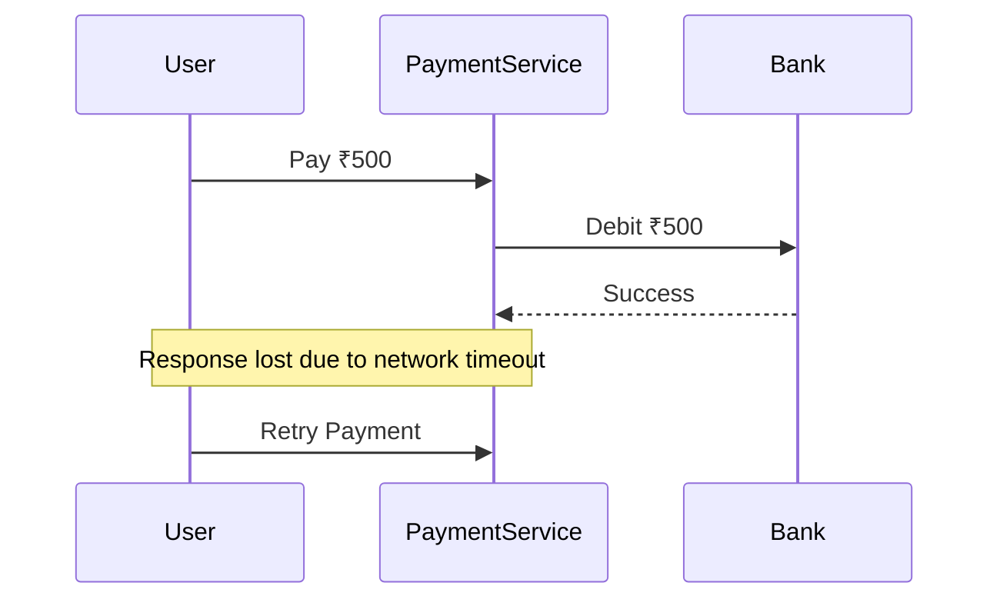
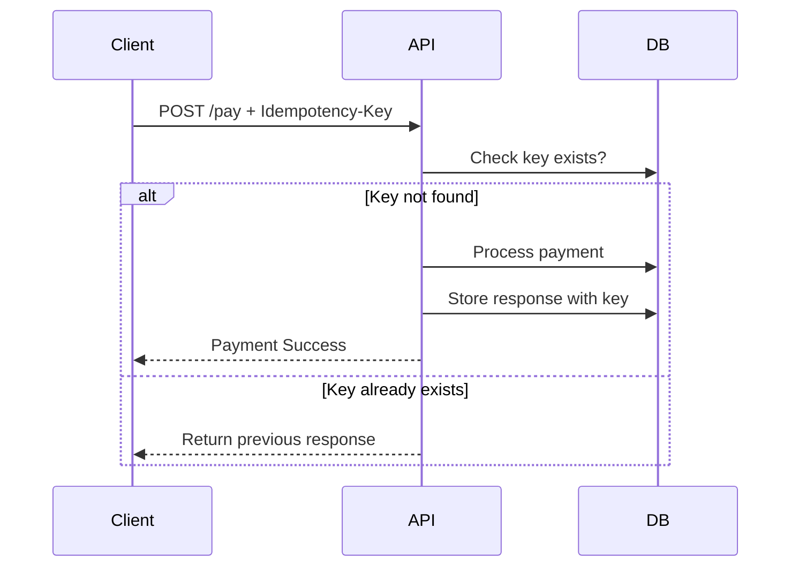
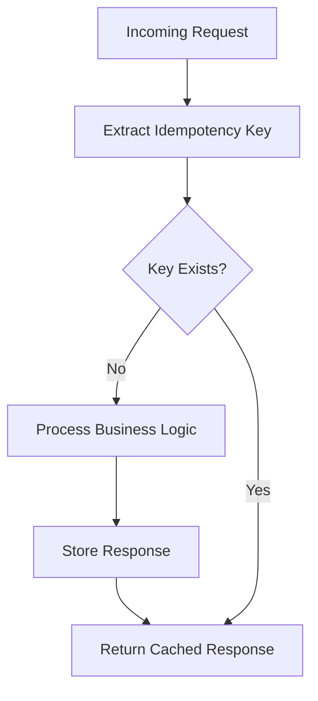
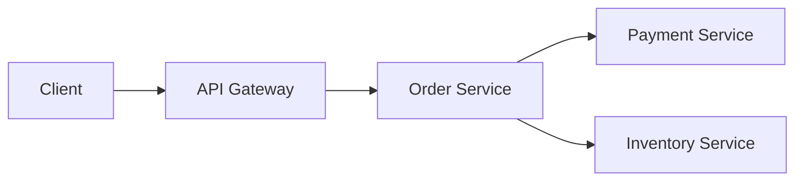
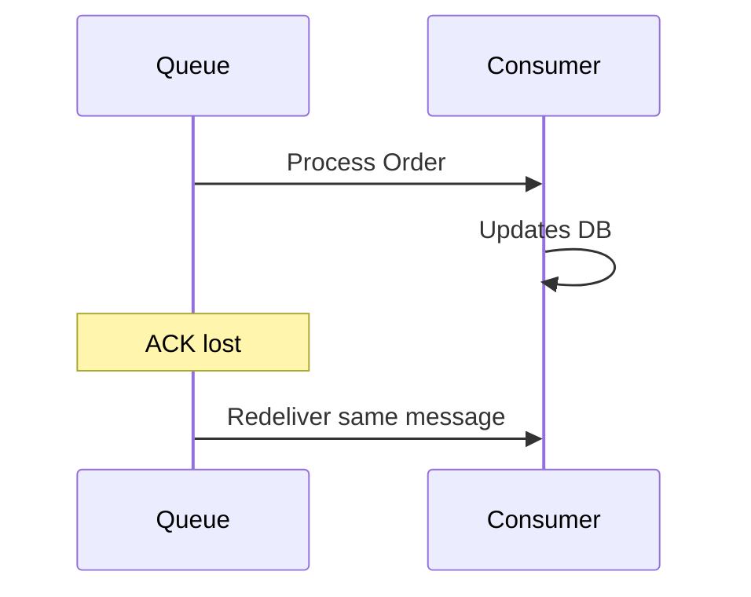
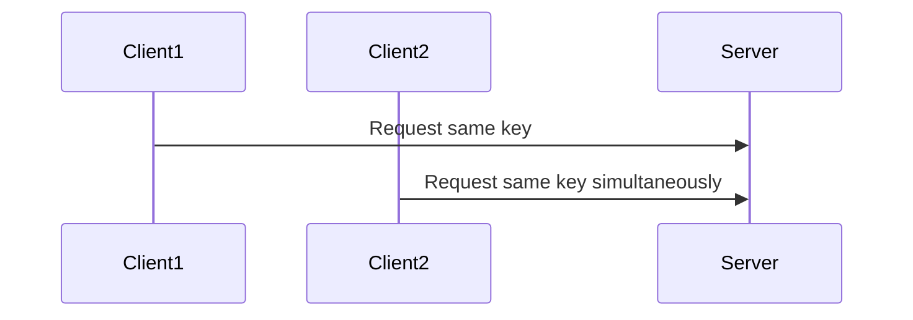
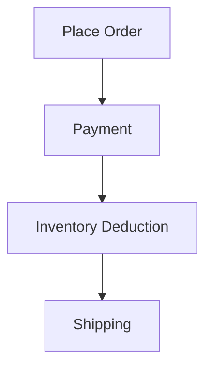
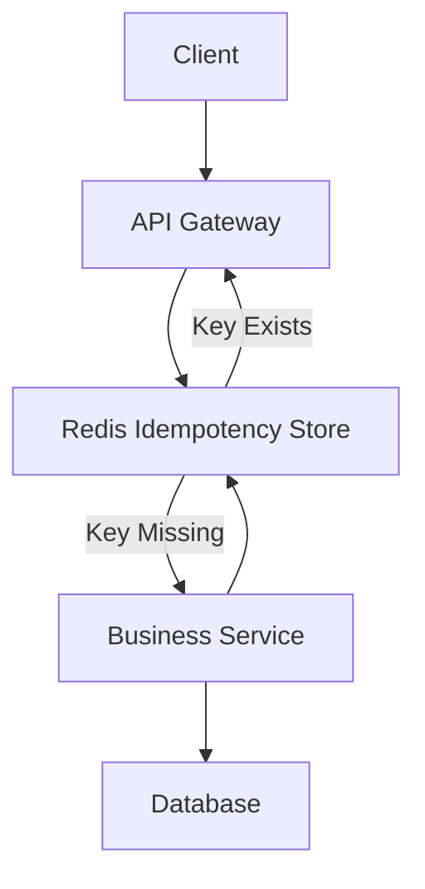
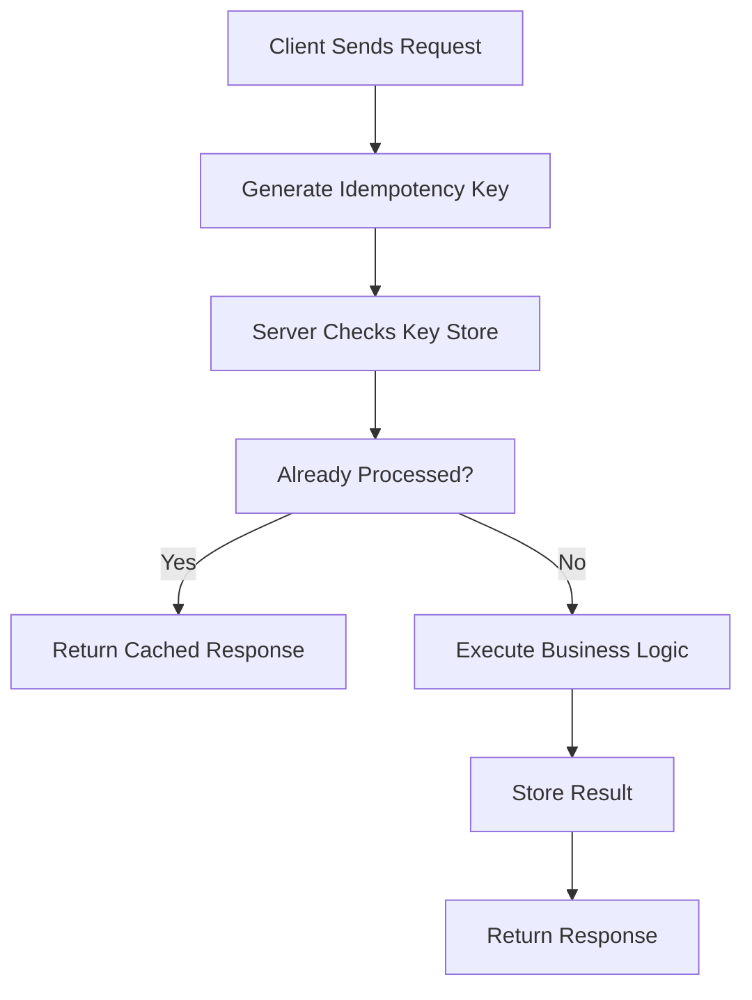

# Idempotent APIs

Modern distributed systems are unreliable by nature.

Networks fail.

Connections timeout.

Servers crash.

Retries happen automatically.

Messages get duplicated.

Users click buttons multiple times.

Without proper safeguards, these realities can create catastrophic problems:

* Duplicate payments
* Double orders
* Multiple ticket bookings
* Repeated bank transfers
* Inventory corruption

This is exactly the problem solved by **Idempotent APIs**.

Idempotency is one of the most important concepts in backend engineering, distributed systems, payment systems, microservices, and fault-tolerant architecture.

---

# Introduction: The Elevator Button Analogy

Imagine pressing the elevator button.

You may press it:

* Once
* Twice
* Ten times rapidly

But the elevator system understands:

> "This request has already been registered."

The elevator does NOT send 10 elevators.

The final effect remains the same.

This is the essence of idempotency.

---

# What is Idempotency?

An operation is called **idempotent** if:

> Performing it multiple times produces the same final result as performing it once.

Mathematically:

```text id="ov11mw"
F(x) = F(F(x))
```

Meaning:

Applying the same operation repeatedly does not change the outcome after the first successful execution.

---

# Simple Real-World Examples

| Operation             | Idempotent? | Why                          |
| --------------------- | ----------- | ---------------------------- |
| Turn light ON         | Yes         | Repeated ON keeps light ON   |
| Turn light OFF        | Yes         | Repeated OFF keeps light OFF |
| Add $100 repeatedly   | No          | Balance changes each time    |
| Delete file           | Usually Yes | File remains deleted         |
| Set username = "John" | Yes         | Same final state             |
| Increment counter     | No          | Value changes every call     |

---

# Why Distributed Systems Need Idempotency

In distributed systems:

* Requests may timeout
* Responses may get lost
* Retries may happen automatically
* Clients may not know if server processed request

This creates uncertainty.

---

# The Core Problem

Consider payment processing.



Now the server faces a dangerous question:

```text id="vdgpy2"
"Is this a new payment or a retry?"
```

Without idempotency:

* User may get charged twice

Catastrophic failure.

---

# The Goal of Idempotent APIs

Idempotent APIs ensure:

```text id="e6g0lw"
Retries are safe
```

No matter how many times the same request arrives:

* Final state remains correct
* Duplicate side effects prevented

---

# Why Duplicate Requests Happen

Duplicate requests are extremely common.

---

# 1. Network Timeouts


Client retries because response never arrived.

---

# 2. User Double Clicks

```text id="bh4m3l"
"Pay Now" clicked multiple times
```

Very common in real systems.

---

# 3. Automatic Retries

Load balancers, SDKs, proxies, and browsers retry automatically.

---

# 4. Message Queue Redelivery

Queues like:

* Kafka
* RabbitMQ
* SQS

may redeliver messages.

---

# 5. Service Failures

Microservices may crash after processing but before responding.

---

# Idempotency vs Duplicate Prevention

Important distinction:

| Concept             | Meaning                        |
| ------------------- | ------------------------------ |
| Duplicate Detection | Detect repeated request        |
| Idempotency         | Ensure repeated execution safe |

Idempotency focuses on correctness.

---

# HTTP Methods and Idempotency

HTTP itself defines idempotent semantics.

---

# Safe & Idempotent Methods

| Method | Idempotent? | Why                      |
| ------ | ----------- | ------------------------ |
| GET    | Yes         | Reads only               |
| PUT    | Yes         | Replaces resource        |
| DELETE | Yes         | Resource remains deleted |
| HEAD   | Yes         | Metadata only            |

---

# Non-Idempotent Methods

| Method | Idempotent? |
| ------ | ----------- |
| POST   | Usually No  |
| PATCH  | Usually No  |

---

# Why PUT is Idempotent

```http id="u5up93"
PUT /user/1
{
  "name": "John"
}
```

Repeated 100 times:

Final state remains:

```json
{
  "name": "John"
}
```

---

# Why POST is Usually NOT Idempotent

```http id="k5y4h3"
POST /orders
```

Repeated requests create:

* Order #101
* Order #102
* Order #103

Multiple resources created.

---

# Understanding the Real Problem

The dangerous operations are usually:

* Payments
* Orders
* Ticket bookings
* Inventory deductions
* Financial transactions

These require strict idempotency.

---

# Core Idea: Idempotency Key

The most common solution:

# Idempotency Keys

Client generates unique key:

```text id="5a2rt5"
X-Idempotency-Key: abc123
```

Server stores result associated with key.

---

# Idempotency Workflow



This guarantees:

```text id="8z00lh"
Same request = Same result
```

---

# Real Payment Example

---

# First Request

```http id="z2s1a6"
POST /payments
Idempotency-Key: txn-123
```

Server:

* Charges user
* Stores response

---

# Retry Request

```http id="u9jlwm"
POST /payments
Idempotency-Key: txn-123
```

Server detects duplicate:

* Does NOT charge again
* Returns previous response

---

# Internal Architecture



---

# Database Schema Example

```sql
CREATE TABLE idempotency_keys (
    idempotency_key VARCHAR(255) PRIMARY KEY,
    response_body TEXT,
    status_code INT,
    created_at TIMESTAMP
);
```

---

# Important Insight

Idempotency works because:

```text id="n7sujr"
Server remembers processed requests
```

---

# Stateless APIs vs Idempotency

Interesting contradiction:

REST APIs aim to be stateless.

But idempotency requires some state:

* Previously processed keys

This is unavoidable.

---

# Idempotency in Payment Systems

Payment systems heavily rely on idempotency.

Without it:

* Double charges
* Financial corruption
* Legal issues

could occur.

---

# Stripe Example

Payment APIs like Stripe require:

```http id="h1c2u4"
Idempotency-Key: unique-request-id
```

This makes retries safe even during network failures.

---

# Idempotency in Microservices

Microservices amplify retry problems.

Because requests pass through:

* API Gateway
* Load Balancer
* Service Mesh
* Queues
* Retry systems

Duplicate execution becomes common.

---

# Example Architecture



Every hop may retry.

Idempotency becomes critical.

---

# Idempotency in Message Queues

Message queues guarantee:

```text id="wh08vm"
At-least-once delivery
```

Meaning duplicates are possible.

Consumers MUST be idempotent.

---

# Queue Example



Without idempotency:

* Order processed twice

---

# Common Idempotency Strategies

---

# 1. Idempotency Keys

Most common.

Best for:

* APIs
* Payments
* Orders

---

# 2. Natural Idempotency

Sometimes operations inherently idempotent.

Example:

```http id="jlwm1h"
PUT /user/1/status
{
  "status": "ACTIVE"
}
```

Repeated requests safe naturally.

---

# 3. Database Constraints

Use unique constraints.

Example:

```sql id="t7h4px"
UNIQUE(transaction_id)
```

Prevents duplicates at DB level.

---

# 4. Distributed Locks

Prevent concurrent duplicate execution.

Useful for:

* Inventory systems
* Critical sections

---

# 5. Event Deduplication

Store processed event IDs.

Common in event-driven systems.

---

# Exactly Once vs Idempotency

Massive distributed systems misconception.

---

# Exactly Once Delivery

True exactly-once is extremely difficult.

Often impossible at scale.

---

# Industry Reality

Most systems instead use:

```text id="3fl8gb"
At-least-once delivery + Idempotent consumers
```

This is practical and scalable.

---

# Idempotency Window

Should keys live forever?

Usually no.

Servers maintain keys for limited duration.

Example:

| Use Case | Window           |
| -------- | ---------------- |
| Payments | 24–48 hours      |
| Orders   | Few hours        |
| APIs     | Minutes to hours |

---

# Race Conditions in Idempotency

Concurrent requests create challenges.

Example:



Without atomic handling:

* Both requests may process

---

# Solution: Atomic Operations

Use:

* DB transactions
* Unique constraints
* Redis SETNX
* Distributed locks

---

# Redis Example

```text id="9byhha"
SETNX idempotency_key value
```

Only one request succeeds.

---

# Idempotency in REST APIs

Best practices:

---

# Use PUT for Updates

Because PUT naturally idempotent.

---

# Use POST Carefully

POST usually creates resources.

Requires explicit idempotency handling.

---

# Return Same Response

Duplicate requests should return identical response.

---

# Include Original Status Code

Consistency important.

---

# Real-World Example: Food Delivery

Imagine ordering food.

Without idempotency:

```text id="a3vq1n"
Timeout → Retry → Duplicate Order
```

You may receive:

* Two pizzas
* Two charges

Bad user experience.

---

# E-Commerce Example



Retries at any step may duplicate actions.

Idempotency protects consistency.

---

# Idempotency and Retries

Retries are essential in distributed systems.

But retries are dangerous without idempotency.

---

# Retry + Idempotency = Reliability


This combination powers resilient systems.

---

# Idempotency in Event-Driven Systems

Event consumers must assume:

```text id="fgf1gz"
Same event may arrive multiple times
```

Consumers should safely ignore duplicates.

---

# Event Deduplication Example

```sql id="99m8vm"
processed_event_ids (
    event_id PRIMARY KEY
)
```

Before processing:

* Check event_id exists

---

# Common Mistakes

---

# 1. Using Timestamp as Key

Timestamps may collide.

---

# 2. Not Handling Concurrent Requests

Leads to race conditions.

---

# 3. Infinite Idempotency Storage

Causes storage bloat.

---

# 4. Weak Key Generation

Keys must be globally unique.

Use:

* UUIDs
* ULIDs

---

# 5. Returning Different Responses

Duplicate request should return same result.

---

# Idempotency vs Transactions

| Feature              | Transactions        | Idempotency          |
| -------------------- | ------------------- | -------------------- |
| Scope                | Database operations | Distributed requests |
| Goal                 | Atomicity           | Safe retries         |
| Prevents             | Partial writes      | Duplicate execution  |
| Distributed Friendly | Limited             | Excellent            |

Both often work together.

---

# Performance Considerations

Idempotency introduces overhead:

| Overhead           | Reason              |
| ------------------ | ------------------- |
| Storage            | Save processed keys |
| DB lookups         | Check duplicates    |
| Cache usage        | Key validation      |
| Expiration cleanup | Remove old keys     |

Tradeoff is worth it for correctness.

---

# Advanced Architecture



Redis often used for fast key lookup.

---

# Financial Systems and Idempotency

Banking systems absolutely depend on idempotency.

Examples:

* Wire transfers
* Card payments
* Wallet deductions
* UPI systems
* Trading systems

Even tiny duplication bugs become catastrophic.

---

# Mental Model

Think of idempotency like this:

```text id="vhq9g4"
"Did I already process this exact request?"
```

If yes:

```text id="zh33mv"
Return previous result safely
```

Do NOT execute again.

---

# When Idempotency is Essential

Absolutely critical in:

* Payments
* Orders
* Inventory systems
* Banking
* Messaging systems
* Distributed workflows
* Retry-heavy systems

---

# Final Architecture Summary



---

# Key Takeaways

| Concept          | Summary                                         |
| ---------------- | ----------------------------------------------- |
| Idempotency      | Multiple identical requests produce same result |
| Purpose          | Safe retries                                    |
| Common Solution  | Idempotency keys                                |
| Critical Domains | Payments, orders, distributed systems           |
| Main Challenge   | Duplicate execution                             |
| Typical Storage  | DB or Redis                                     |
| Related Concepts | Retries, transactions, message queues           |

---

# Conclusion

Idempotency is one of the foundational principles of reliable distributed systems.

Without idempotency:

* Retries become dangerous
* Duplicate requests corrupt state
* Financial systems become unreliable
* Distributed systems become fragile

With idempotency:

* Retries become safe
* Systems become fault tolerant
* APIs become resilient
* Microservices become reliable

The combination of:

```text id="jlwm5r"
Retries + Idempotency
```

is one of the core building blocks of modern scalable backend systems.

Whenever building:

* Payment APIs
* Order systems
* Event consumers
* Distributed workflows
* Microservices

you should always ask:

> "What happens if this request executes twice?"

That single question often separates fragile systems from production-grade architecture.
