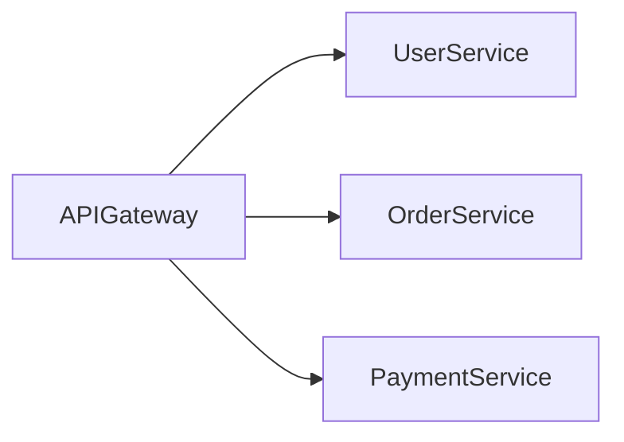
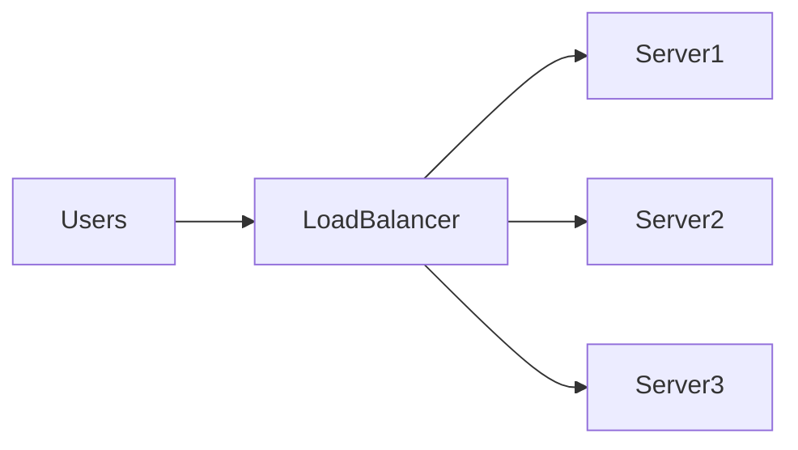
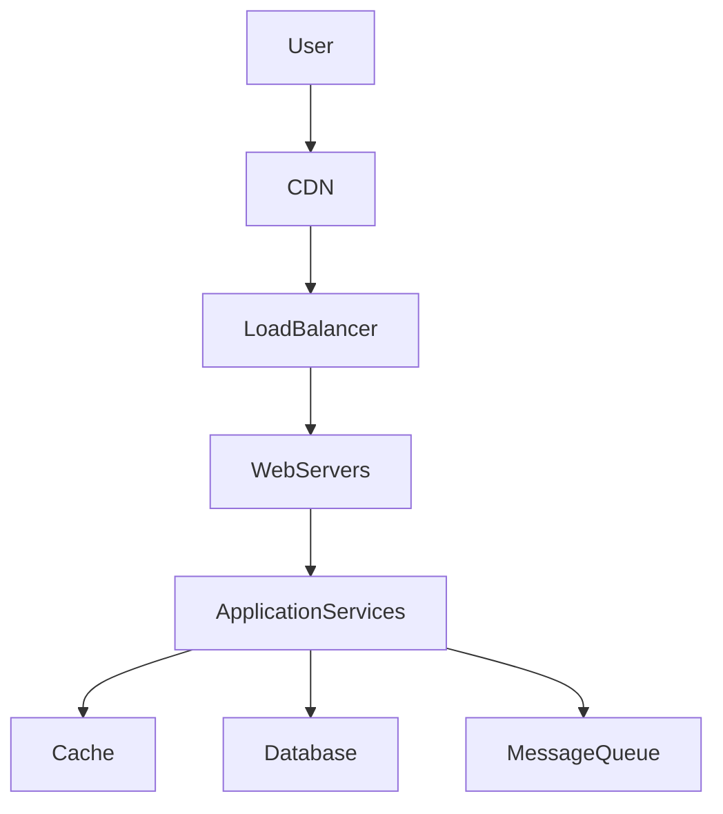
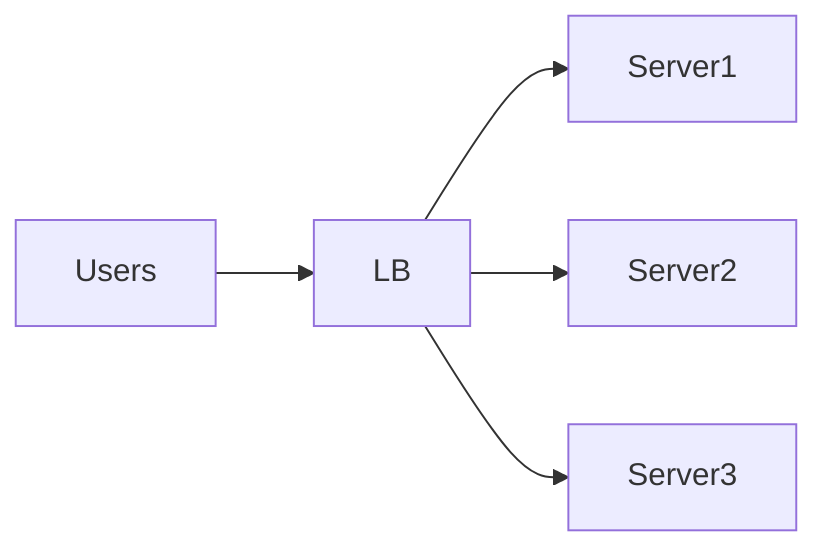
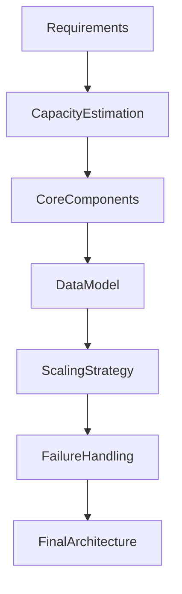
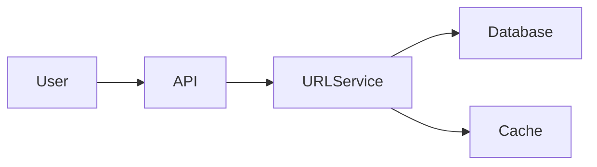
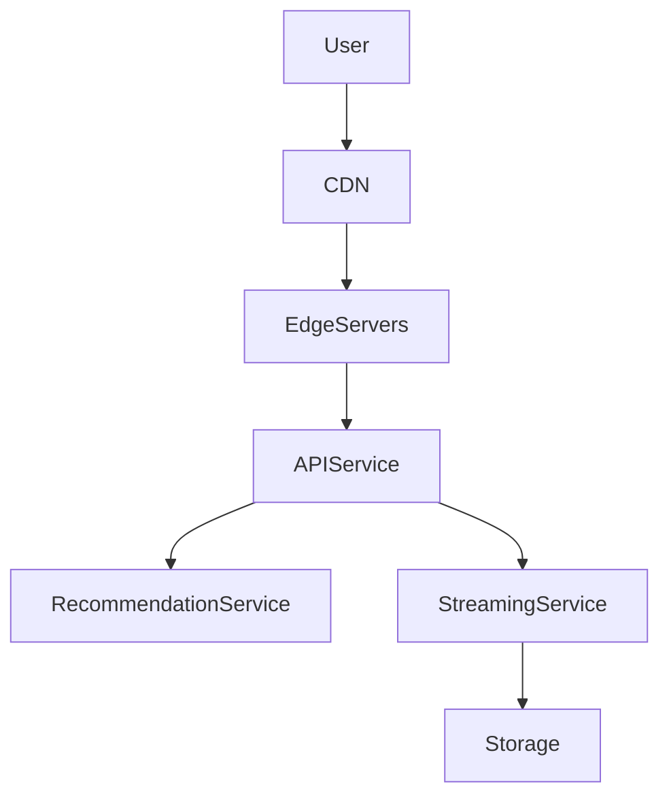

# Introduction to High Level Design (HLD)

High Level Design (HLD) is the phase of system design where we **define the overall architecture of a system**.

Instead of focusing on code-level details, HLD focuses on **how major components interact**, **how data flows through the system**, and **how the system scales, remains reliable, and handles failures**.

In simple terms:

> **High Level Design describes the blueprint of a system before it is built.**

It answers questions like:

- What components exist in the system?
- How do they communicate?
- How will the system scale to millions of users?
- How will failures be handled?
- How is data stored and retrieved?

Large-scale platforms built by companies such as **:contentReference[oaicite:0]{index=0}**, **:contentReference[oaicite:1]{index=1}**, and **:contentReference[oaicite:2]{index=2} rely heavily on well-designed high-level architectures to support millions of users.

---

# Why High Level Design Matters

Modern applications must handle:

- Millions of users
- Huge volumes of data
- Global availability
- Fault tolerance
- Low latency

Without proper architectural planning, systems quickly become:

| Problem | Explanation |
|-------|-------------|
| Hard to scale | Adding more users crashes the system |
| Difficult to maintain | Tight coupling between services |
| Unreliable | Failures cascade through the system |
| Slow | Poor data flow and bottlenecks |

High Level Design ensures the system is **scalable, reliable, maintainable, and performant**.

---

# Real World Analogy

Consider constructing a **large city hospital**.

Before building anything, architects design:

- Building layout
- Emergency routes
- Electricity systems
- Water pipelines
- Patient flow

They do **not start by deciding where each screw goes**.

Instead, they design **the structure first**.

High Level Design plays the same role in software systems.

```mermaid
flowchart LR
Idea --> Architecture
Architecture --> SystemComponents
SystemComponents --> Implementation
````

---

# High Level Design vs Low Level Design

Software design is typically divided into two major stages.

| Aspect     | High Level Design           | Low Level Design       |
| ---------- | --------------------------- | ---------------------- |
| Focus      | System architecture         | Code structure         |
| Components | Services, databases, queues | Classes, methods       |
| Scope      | Entire system               | Individual modules     |
| Concern    | Scalability and reliability | Implementation details |
| Output     | Architecture diagrams       | Class diagrams         |

### Example

If we are building a **video streaming platform**:

High Level Design answers:

* Use CDN for video delivery
* Use load balancers
* Store videos in object storage
* Use distributed databases

Low Level Design answers:

* Class structure for video player
* Encoding algorithms
* Cache implementation

---

# Core Elements of High Level Design

HLD describes **the major building blocks of a system**.

## 1. Clients

Clients are the systems that interact with the backend.

Examples:

* Web browsers
* Mobile apps
* IoT devices

```mermaid
flowchart LR
User --> WebApp
User --> MobileApp
```

---

## 2. API Layer

The API layer exposes services to clients.

This layer typically includes:

* API gateways
* Authentication systems
* Rate limiting
* Request validation


---

## 3. Application Services

Application services contain the **core business logic**.

Examples:

* User service
* Order service
* Payment service
* Notification service



---

## 4. Data Storage

Systems require different types of storage depending on use cases.

| Storage Type    | Use Case           |
| --------------- | ------------------ |
| SQL Databases   | Transactions       |
| NoSQL Databases | Massive scale data |
| Object Storage  | Media files        |
| Cache           | Fast reads         |

Example technologies include systems like **MySQL**, **PostgreSQL**, and **Redis**.

---

## 5. Message Queues

Message queues allow services to communicate asynchronously.

Common uses:

* Background jobs
* Event-driven processing
* Decoupling services

Examples include systems like **Apache Kafka** and **RabbitMQ**.


---

## 6. Load Balancers

Load balancers distribute traffic across multiple servers.

Benefits:

* Improved scalability
* Fault tolerance
* Reduced latency



---

# Example: High Level Architecture of a Web Application

Below is a simplified architecture for a large-scale web system.



### Flow Explanation

1. User sends request.
2. CDN serves cached static content.
3. Load balancer distributes traffic.
4. Application services process requests.
5. Data retrieved from cache or database.

---

# Key Concerns in High Level Design

When designing systems, architects must consider multiple factors.

---

## Scalability

Systems must handle increasing load.

Two scaling strategies exist.

| Type               | Description       |
| ------------------ | ----------------- |
| Vertical Scaling   | Add more CPU/RAM  |
| Horizontal Scaling | Add more machines |

Horizontal scaling is preferred for large systems.



---

## Reliability

Reliable systems continue working even when components fail.

Techniques include:

* Replication
* Failover systems
* Circuit breakers
* Health checks

---

## Availability

Availability refers to how often the system is operational.

Example availability levels:

| Availability | Downtime per year |
| ------------ | ----------------- |
| 99%          | ~3.6 days         |
| 99.9%        | ~8.7 hours        |
| 99.99%       | ~52 minutes       |

---

## Performance

Performance focuses on reducing latency.

Techniques include:

* Caching
* CDNs
* Database indexing
* Load balancing

---

## Consistency

Distributed systems must manage data consistency.

Some systems prefer **strong consistency**, while others accept **eventual consistency**.

---

# Typical High Level Design Workflow

Designing a system usually follows these steps.



### Step Breakdown

| Step             | Description                 |
| ---------------- | --------------------------- |
| Requirements     | Understand system needs     |
| Estimation       | Traffic, storage, bandwidth |
| Architecture     | Choose components           |
| Data model       | Design storage structure    |
| Scaling          | Handle large traffic        |
| Failure handling | Ensure resilience           |

---

# Example: Designing a URL Shortener

High level architecture for a URL shortener.



### Request Flow

1. User sends long URL.
2. API generates short code.
3. Short code stored in database.
4. Future requests fetch original URL.

---

# Principles of Good High Level Design

Good architecture follows key principles.

| Principle       | Meaning                                |
| --------------- | -------------------------------------- |
| Loose coupling  | Services operate independently         |
| High cohesion   | Components have clear responsibilities |
| Scalability     | Easy to add more servers               |
| Observability   | Easy to monitor and debug              |
| Fault tolerance | System survives failures               |

---

# Common Architectural Patterns

Many distributed systems rely on common architectural patterns.

Examples include:

| Pattern                   | Purpose                      |
| ------------------------- | ---------------------------- |
| Microservices             | Independent services         |
| Event Driven Architecture | Async communication          |
| CQRS                      | Separate reads and writes    |
| API Gateway               | Single entry point           |
| Service Mesh              | Manage service communication |

---

# Challenges in High Level Design

Designing large-scale systems introduces challenges.

| Challenge            | Explanation                 |
| -------------------- | --------------------------- |
| Distributed failures | Nodes fail unpredictably    |
| Network latency      | Cross-region delays         |
| Data consistency     | Hard to synchronize data    |
| Debugging            | Complex distributed systems |

These challenges make architecture design **one of the most important skills in backend engineering**.

---

# Real World Example: Video Streaming Platform

A simplified architecture of a video streaming platform like **Netflix.



The architecture allows:

* millions of concurrent viewers
* global content delivery
* low latency streaming

---

# Summary

High Level Design defines the **architecture of a system before implementation begins**.

It focuses on:

* system components
* communication patterns
* scalability
* reliability
* data flow

By designing systems at a high level, engineers can ensure that applications are **scalable, resilient, and capable of supporting massive workloads**.

Modern distributed systems used by companies like **Amazon**, **Netflix**, and **Uber** rely on strong high-level architecture to handle billions of operations every day.