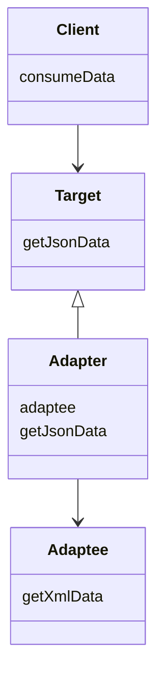
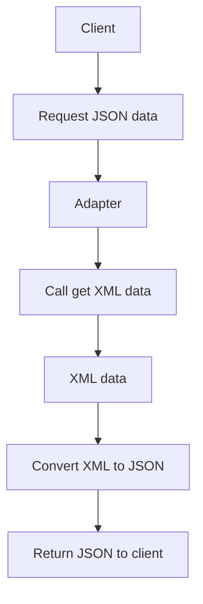
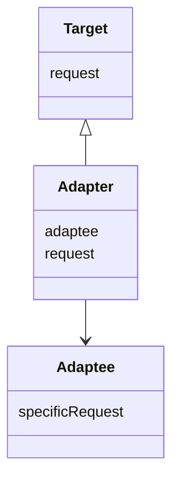
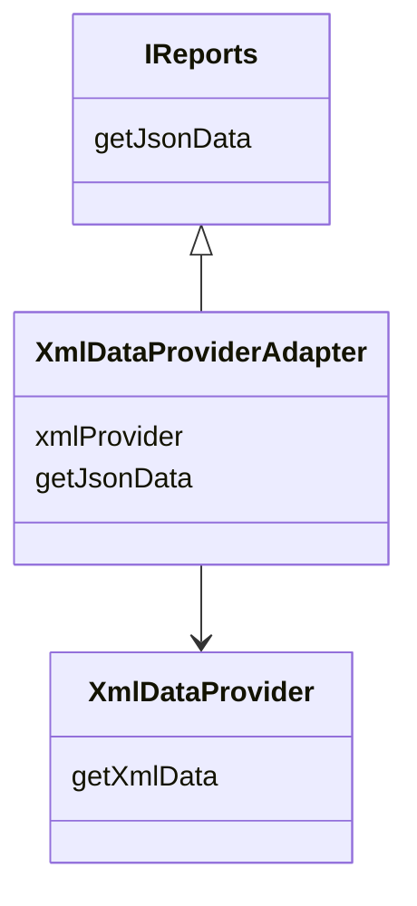
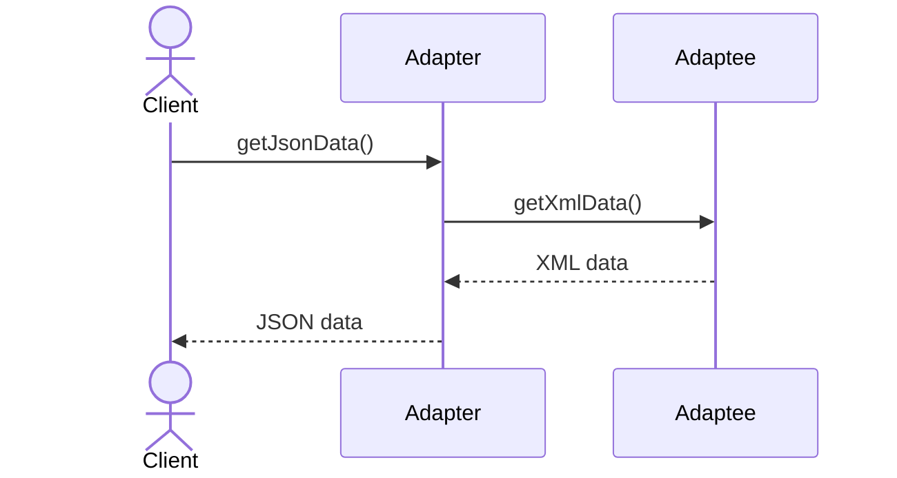

# Adapter Design Pattern

Imagine you travel from India to the United States with your phone charger.

Your charger works perfectly in India, but the socket shape in the US is different. The two parts are incompatible. Instead of buying a new charger or changing the hotel wiring, you use a **power adapter**.

That adapter acts as a middle layer:
- one side fits your charger
- the other side fits the US socket

It translates compatibility.

The **Adapter Design Pattern** does exactly that in software.

---

# Introduction: The Power Plug Problem

In software systems, two components often need to work together even though their interfaces do not match.

For example:
- your application may expect one interface
- a third-party library may provide a different interface
- legacy code may use an old structure
- a new component may not follow your system’s conventions

If you connect them directly, your code becomes messy, rigid, and tightly coupled.

The Adapter Pattern solves this by creating a **translator** between incompatible interfaces.

---

## Core idea

> Adapter converts the interface of a class into another interface that clients expect.

It allows classes to work together that otherwise could not because of incompatible interfaces.

---

# Why Adapter Pattern matters

Adapter is important because it helps software remain flexible when integrating external or legacy components.

It helps with:

- third-party library integration
- old system compatibility
- interface migration
- code reuse
- dependency isolation
- cleaner architecture

---

# The main problem it solves

Suppose your application expects this method:

```text
getJsonData()
````

But a third-party library provides only:

```text
getXmlData()
```

These two do not match.

Your application does not want XML directly.
It wants JSON.

Instead of changing the whole application or rewriting the third-party library, you create an adapter that:

* calls `getXmlData()`
* converts XML to JSON
* returns JSON to your app

That is the Adapter Pattern.

---

# Real-world analogy

Adapter is like a universal translator.

* one person speaks one language
* another person speaks a different language
* the translator listens to one side and speaks the other side’s language

The translator does not change either person.
It simply bridges the gap.

---

# When Adapter is useful

Adapter is especially useful when:

* integrating third-party APIs
* using legacy systems
* changing old interfaces without rewriting them
* standardizing different modules
* building reusable integration layers

---

# The key insight

The Adapter Pattern is not just about making objects work together.

It is about **protecting your application from external incompatibilities**.

Instead of letting the entire system depend on an unstable external interface, you isolate the dependency inside an adapter.

---

# Adapter and tight coupling

If your app directly calls a third-party library, your code becomes tightly coupled to that library.

That means:

* changing providers becomes hard
* interface changes break your code
* testing becomes harder
* migration becomes expensive

The adapter solves this by creating a stable boundary.


The client knows only the adapter.
The third-party library is hidden behind it.

---

# Adapter as a puzzle piece

Think of your application as one puzzle piece and the external library as another.

They do not fit directly.

The adapter is the middle piece that connects them.


---

# Formal definition

The Adapter pattern converts the interface of a class into another interface that clients expect.

It allows classes to work together that could not otherwise because of incompatible interfaces.

---

# Main participants in Adapter Pattern

| Role    | Meaning                                          | Example                  |
| ------- | ------------------------------------------------ | ------------------------ |
| Client  | Uses the expected interface                      | Your application         |
| Target  | The interface the client expects                 | `IReports`               |
| Adaptee | Existing incompatible class                      | `XmlDataProvider`        |
| Adapter | Converts adaptee interface into target interface | `XmlDataProviderAdapter` |

---

## UML view


---

# How Adapter works

The adapter usually performs two jobs:

1. It calls the adaptee’s method.
2. It translates the returned result into the format expected by the client.

For example:

* get XML from old provider
* convert XML to JSON
* return JSON to client

---

# Example: XML to JSON conversion

Suppose:

* the client expects `getJsonData()`
* the adaptee provides `getXmlData()`

The adapter sits in between.


---

# Why Adapter protects your code

The biggest advantage is that the application no longer depends directly on the external class.

That means:

* you can replace the external library later
* you can keep your app interface stable
* you can support multiple providers with different adapters
* your business code stays clean

---

# Adapter vs direct dependency

## Direct dependency

Your app calls the third-party library directly.

Problems:

* hard to replace
* hard to test
* hard to migrate

## With Adapter

Your app calls a stable interface.

Benefits:

* easy to swap libraries
* easy to isolate changes
* fewer ripple effects

---

# Adapter and legacy systems

Adapter is very useful when modern code must talk to old code.

Examples:

* modern Java service integrating with older Java modules
* new UI calling old backend APIs
* old payment gateway integration
* legacy file format conversion

The adapter becomes a bridge.

---

# Adapter pattern types

There are two main ways to implement the Adapter Pattern:

1. Object Adapter
2. Class Adapter

---

## 1. Object Adapter

The Object Adapter uses **composition**.

That means:

* the adapter has a reference to the adaptee
* it delegates work to the adaptee
* it translates the result

This is the most common approach.

### Why it is preferred

* flexible
* cleaner
* easy to replace adaptee
* works in languages without multiple inheritance


---

## 2. Class Adapter

The Class Adapter uses **inheritance**.

That means:

* adapter inherits from the target interface
* adapter also inherits from the adaptee class

This requires multiple inheritance in languages that support it.

### Why it is less common

* more rigid
* less flexible
* not available in Java for classes
* composition is usually better

---

# Composition vs Inheritance

Adapter is a great example of why composition is often better than inheritance.

| Approach    | Meaning                            | Flexibility |
| ----------- | ---------------------------------- | ----------- |
| Composition | Adapter has a reference to adaptee | High        |
| Inheritance | Adapter is a subtype of adaptee    | Lower       |

Composition makes adapters easier to maintain and extend.

---

# Example structure for the XML-to-JSON adapter


---

# A complete example in C++

```cpp
#include <iostream>
#include <string>
using namespace std;

class IReports {
public:
    virtual string getJsonData() = 0;
    virtual ~IReports() = default;
};

class XmlDataProvider {
public:
    string getXmlData() {
        return "<report><name>Sales</name><value>100</value></report>";
    }
};

class XmlDataProviderAdapter : public IReports {
private:
    XmlDataProvider* xmlProvider;

    string convertXmlToJson(const string& xmlData) {
        return "{ \"report\": { \"name\": \"Sales\", \"value\": 100 } }";
    }

public:
    XmlDataProviderAdapter(XmlDataProvider* provider) : xmlProvider(provider) {}

    string getJsonData() override {
        string xmlData = xmlProvider->getXmlData();
        return convertXmlToJson(xmlData);
    }
};

int main() {
    XmlDataProvider provider;
    XmlDataProviderAdapter adapter(&provider);

    cout << adapter.getJsonData() << endl;
    return 0;
}
```
```java
interface IReports {
    String getJsonData();
}

class XmlDataProvider {
    String getXmlData() {
        return "<report><name>Sales</name><value>100</value></report>";
    }
}

class XmlDataProviderAdapter implements IReports {
    private XmlDataProvider xmlProvider;

    XmlDataProviderAdapter(XmlDataProvider xmlProvider) {
        this.xmlProvider = xmlProvider;
    }

    private String convertXmlToJson(String xmlData) {
        return "{ \"report\": { \"name\": \"Sales\", \"value\": 100 } }";
    }

    public String getJsonData() {
        String xmlData = xmlProvider.getXmlData();
        return convertXmlToJson(xmlData);
    }
}

public class Main {
    public static void main(String[] args) {
        XmlDataProvider provider = new XmlDataProvider();
        IReports adapter = new XmlDataProviderAdapter(provider);

        System.out.println(adapter.getJsonData());
    }
}
```
```python
from abc import ABC, abstractmethod

class IReports(ABC):
    @abstractmethod
    def get_json_data(self):
        pass

class XmlDataProvider:
    def get_xml_data(self):
        return "<report><name>Sales</name><value>100</value></report>"

class XmlDataProviderAdapter(IReports):
    def __init__(self, xml_provider):
        self.xml_provider = xml_provider

    def _convert_xml_to_json(self, xml_data):
        return '{ "report": { "name": "Sales", "value": 100 } }'

    def get_json_data(self):
        xml_data = self.xml_provider.get_xml_data()
        return self._convert_xml_to_json(xml_data)

provider = XmlDataProvider()
adapter = XmlDataProviderAdapter(provider)

print(adapter.get_json_data())
```


---

## C++ explanation

* `IReports` is the target interface
* `XmlDataProvider` is the adaptee
* `XmlDataProviderAdapter` bridges them
* the adapter converts XML to JSON format expected by the client

---

## Java explanation

* the client depends on `IReports`
* the adapter implements `IReports`
* the adapter internally uses `XmlDataProvider`
* the client gets JSON while the adaptee continues producing XML

---

## Python explanation

* `IReports` is the expected interface
* `XmlDataProvider` is the incompatible existing class
* `XmlDataProviderAdapter` translates between them
* the client stays unaware of the XML-based implementation

---

# How the Adapter interacts with the client

The client does not talk to the adaptee directly.

Instead:

* client calls adapter
* adapter calls adaptee
* adapter converts output
* client receives the format it expects



---

# Adapter in real systems

## 1. Third-party payment libraries

If your app expects one payment interface but the provider exposes another, use an adapter.

## 2. Notification systems

If one provider sends SMS through one API and another uses a different API, adapters normalize the interface.

## 3. Legacy databases

An adapter can convert old database calls into modern repository-style calls.

## 4. File format converters

Example:

* XML to JSON
* CSV to object model
* old binary format to new format

## 5. Hardware integration

A software adapter may translate commands for different device drivers or protocols.

---

# Why Adapter is different from Factory

| Pattern | Main focus                               |
| ------- | ---------------------------------------- |
| Factory | Creates objects                          |
| Adapter | Makes incompatible objects work together |

Factory chooses which object to create.
Adapter makes an existing object fit a different interface.

---

# Why Adapter is different from Decorator

| Pattern   | Main focus                              |
| --------- | --------------------------------------- |
| Adapter   | Interface translation                   |
| Decorator | Add behavior without changing interface |

An adapter changes how you access something.
A decorator enhances something you already use.

---

# Why Adapter is different from Proxy

| Pattern | Main focus     |
| ------- | -------------- |
| Adapter | Compatibility  |
| Proxy   | Control access |

A proxy stands in front of an object to manage access.
An adapter stands in front of an object to make interfaces compatible.

---

# Benefits of Adapter Pattern

| Benefit        | Description                                     |
| -------------- | ----------------------------------------------- |
| Compatibility  | Lets incompatible interfaces work together      |
| Reuse          | Reuses existing classes without rewriting them  |
| Decoupling     | Client depends on target interface, not adaptee |
| Flexibility    | Easy to replace or wrap external systems        |
| Legacy support | Connects modern code with older systems         |
| Cleaner code   | Avoids scattered translation logic              |

---

# Drawbacks of Adapter Pattern

| Drawback         | Description                                       |
| ---------------- | ------------------------------------------------- |
| Extra layer      | Adds another class in between                     |
| More indirection | Debugging may require tracing through adapter     |
| More code        | Each incompatible system may need its own adapter |

---

# Common mistakes

| Mistake                                 | Problem                                               |
| --------------------------------------- | ----------------------------------------------------- |
| Putting business logic in the adapter   | Adapter should only translate, not own business rules |
| Overusing adapters                      | Too many layers can make design complex               |
| Confusing adapter with decorator        | They solve different problems                         |
| Making adapter too generic              | Can reduce clarity                                    |
| Directly exposing adaptee to the client | Breaks decoupling                                     |

---

# When to use Adapter Pattern

Use it when:

* you must work with an existing class whose interface does not match your code
* you want to reuse legacy or third-party code
* you want to isolate compatibility logic
* you want to convert one data format to another
* you want to standardize inconsistent interfaces

---

# When not to use Adapter Pattern

Avoid it when:

* interfaces already match
* the conversion is trivial and isolated
* the extra abstraction would not provide value
* you are creating complexity without a real compatibility problem

---

# Adapter pattern summary

The Adapter Pattern is a bridge between incompatible components.

It:

* translates one interface into another
* protects client code from external changes
* supports legacy systems and third-party libraries
* keeps your application flexible and maintainable

---

# Final takeaway

The Adapter Pattern is like a universal power plug converter for software.

It does not change the charger.
It does not change the wall socket.
It simply makes them work together.

That is the power of the pattern:

> Connect incompatible pieces without forcing either side to change.

It is one of the most practical patterns for integration, migration, and long-term maintainability.