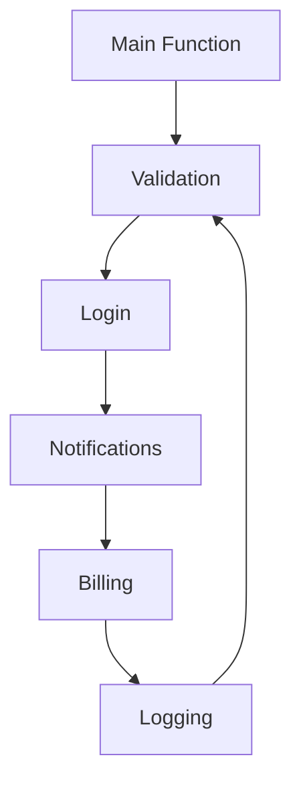
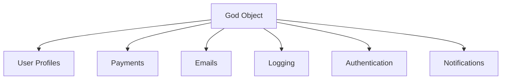
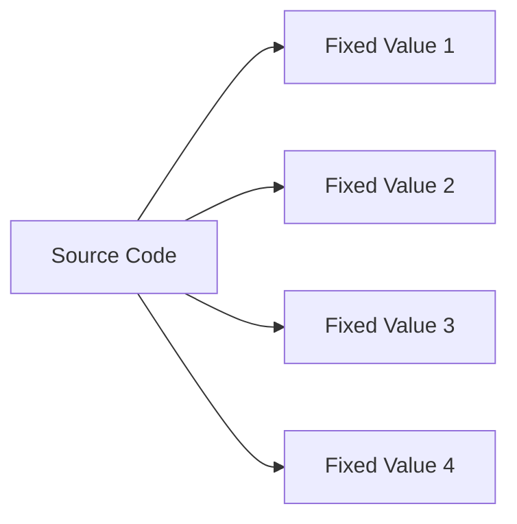
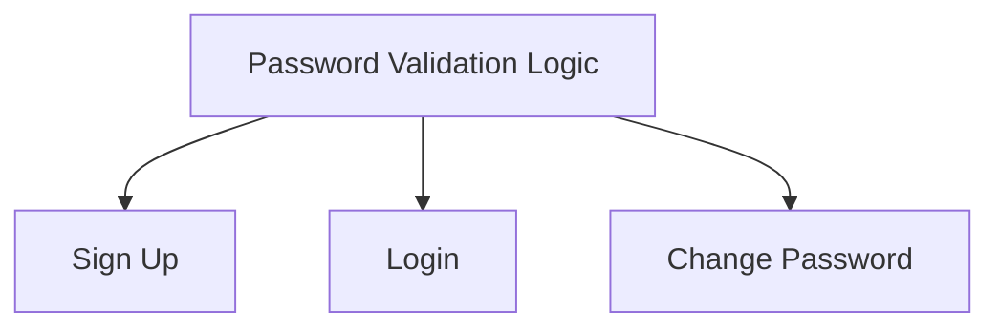
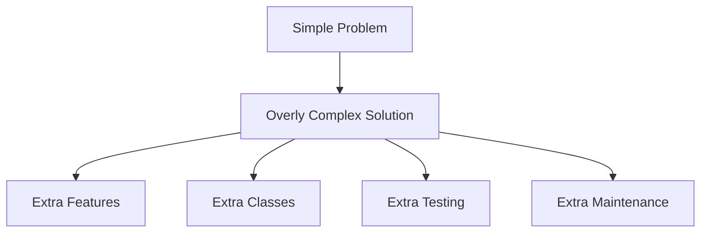
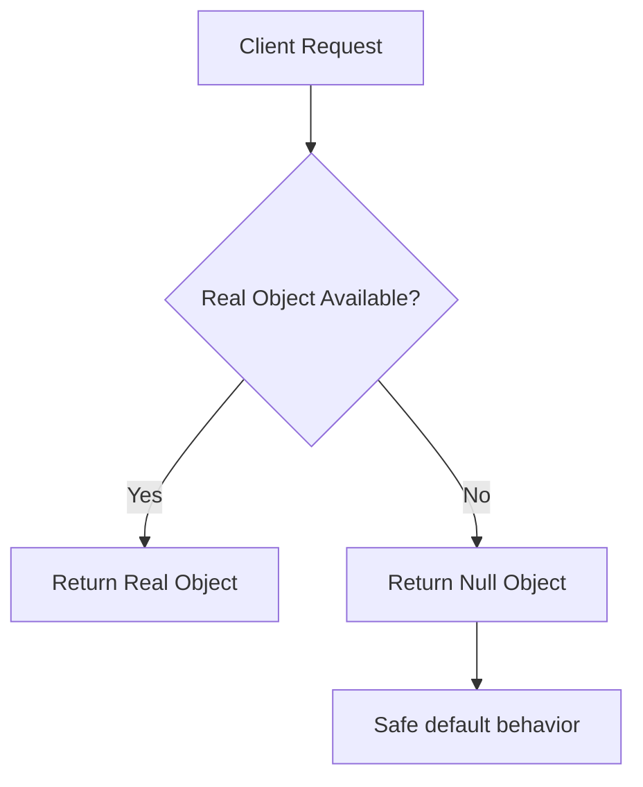
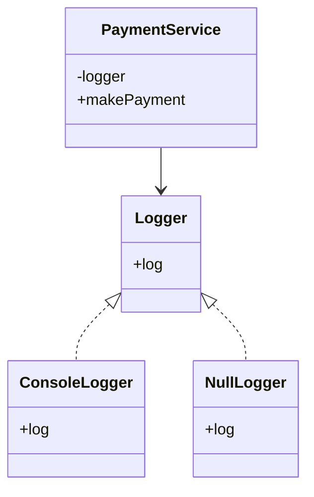

# Anti-Patterns and the Null Object Pattern

Software design is not only about choosing the right patterns.  
It is also about recognizing the wrong habits that slowly make code harder to understand, harder to test, and harder to maintain.

These harmful habits are often called **anti-patterns**.

At the same time, one common source of messy code is repeated `null` checks.  
The **Null Object Pattern** offers a clean way to avoid them by using polymorphism instead of conditionals.

This document covers both:
- common anti-patterns
- the Null Object Pattern as a better alternative to repetitive null handling

---

# Introduction: What is an Anti-Pattern?

An anti-pattern is a commonly used solution that seems helpful in the short term, but usually creates bigger problems later.

It is not just “bad code.”

It is code or design that:
- looks acceptable at first
- solves the immediate issue
- creates maintainability, readability, or scalability problems later

---

## Why anti-patterns matter

Anti-patterns often lead to:
- tight coupling
- duplicated logic
- fragile code
- poor maintainability
- difficult debugging
- high testing effort

The most dangerous part is that they often appear gradually.

A developer may not notice the damage until the codebase has already grown large.

---

# Common Categories of Anti-Patterns

Anti-patterns often fall into several categories:

| Category | Meaning |
|----------|---------|
| Organizational | Problems caused by bad team/process decisions |
| Developmental | Problems caused by coding habits or implementation choices |
| Architectural | Problems caused by poor structure and design |

This guide focuses on developmental and architectural issues.

---

# Overview of the Anti-Patterns Covered

| Anti-Pattern | Problem |
|--------------|---------|
| Spaghetti Code | Logic is tangled and hard to follow |
| God Object | One class does too much |
| Hard Coding | Values are fixed directly in code |
| Violating DRY | The same logic is repeated everywhere |
| Gold Plating | Over-engineering beyond actual needs |

---

# 1. Spaghetti Code

Spaghetti Code is code that is tangled, confusing, and difficult to understand.

It usually has:

* unclear structure
* too many dependencies
* nested conditionals
* poor separation of concerns
* hidden side effects

It is called “spaghetti” because the logic looks like a bowl of tangled noodles.

---

## Why it is dangerous

When code becomes spaghetti code:

* one change can break many unrelated parts
* debugging becomes painful
* adding features becomes risky
* new developers struggle to understand the flow

---

## Example of the problem

Imagine validation logic, login logic, notification logic, and billing logic all mixed together in the same method.

That makes the code extremely hard to manage.

---

## Spaghetti Code diagram



The arrows loop and cross each other, showing tangled control flow.

---

## How to avoid it

| Good Practice              | Benefit                 |
| -------------------------- | ----------------------- |
| Use small functions        | Easier to read          |
| Use clear class boundaries | Better organization     |
| Separate concerns          | Less coupling           |
| Use meaningful names       | Easier maintenance      |
| Refactor early             | Prevents long-term mess |

---

# 2. God Object

A God Object is a single class that knows too much and does too much.

It tries to:

* store data
* process business logic
* manage UI
* handle network calls
* send emails
* log actions
* coordinate everything

This class becomes a central “super object” holding too much power.

---

## Why it is dangerous

A God Object creates:

* high coupling
* low modularity
* difficult testing
* weak maintainability
* single point of failure

If this class breaks, many parts of the system may fail.

---

## Example

A `UserManager` class that:

* stores user profile
* processes payments
* sends emails
* logs actions
* manages authentication

This is a classic God Object smell.

---

## God Object diagram



One object is acting like a giant central hub.

---

## How to avoid it

| Good Practice         | Benefit                         |
| --------------------- | ------------------------------- |
| Apply SRP             | One class, one reason to change |
| Break big classes     | Easier to manage                |
| Use service layers    | Clear responsibilities          |
| Separate domain logic | Better testability              |
| Use composition       | Less coupling                   |

---

# 3. Hard Coding

Hard coding means putting fixed values directly into source code.

Examples:

* file paths
* usernames
* tax rates
* port numbers
* greeting messages
* magic constants

---

## Why it is dangerous

Hard coding makes software:

* hard to change
* hard to reuse
* hard to configure
* brittle in production

If a value changes, you may need to update many places.

---

## Example

Imagine the tax rate is written as `0.07` in many files.

If the tax changes to `0.075`, every occurrence must be updated carefully.

If even one place is missed, the system becomes inconsistent.

---

## Hard Coding diagram



The same value is scattered in many places.

---

## How to avoid it

| Good Practice             | Benefit                  |
| ------------------------- | ------------------------ |
| Use constants             | Centralized values       |
| Use config files          | Easy environment changes |
| Pass values as parameters | Flexible behavior        |
| Use environment variables | Deployment friendly      |
| Use dependency injection  | More testable code       |

---

# 4. Violating DRY

DRY stands for **Don’t Repeat Yourself**.

This anti-pattern happens when the same logic is copied into multiple places.

---

## Why it is dangerous

When logic is duplicated:

* updates become expensive
* bugs are repeated
* behavior becomes inconsistent
* maintenance becomes harder

If one copy is changed and another is forgotten, the system behaves differently in different places.

---

## Example

Suppose the same password validation logic is copied into:

* sign up
* login
* change password

Now every password policy change requires editing three locations.

---

## DRY violation diagram



The same logic is duplicated in multiple places.

---

## How to avoid it

| Good Practice              | Benefit                       |
| -------------------------- | ----------------------------- |
| Extract functions          | Reuse logic                   |
| Create helper classes      | Cleaner design                |
| Use shared utilities       | Single source of truth        |
| Refactor duplication early | Prevents growth of repetition |

---

# 5. Gold Plating

Gold plating is the habit of adding unnecessary complexity to a solution.

It usually comes from:

* trying to make everything perfect
* over-engineering
* planning for imaginary future problems
* adding features nobody asked for

---

## Why it is dangerous

Gold plating wastes:

* time
* effort
* testing cost
* maintenance effort

The result is often a huge system that solves a tiny problem.

---

## Example

Instead of a simple username save function, a developer builds:

* internationalization
* history tracking
* profanity filtering
* audit logging
* rollback support

for a feature that only needs a simple internal admin edit.

That is too much.

---

## Gold plating diagram



---

## How to avoid it

| Good Practice                 | Benefit                |
| ----------------------------- | ---------------------- |
| Solve the actual problem      | Keeps focus            |
| Start simple                  | Less waste             |
| Add features only when needed | Better agility         |
| Prefer practical design       | Lower maintenance cost |
| Refactor later if necessary   | Controlled evolution   |

---

# Anti-Patterns Summary Table

| Anti-Pattern   | Core Problem              | Main Risk                     |
| -------------- | ------------------------- | ----------------------------- |
| Spaghetti Code | Tangled structure         | Hard to understand and change |
| God Object     | Too many responsibilities | Single point of failure       |
| Hard Coding    | Fixed values in source    | Poor flexibility              |
| Violating DRY  | Duplicate logic           | Inconsistent updates          |
| Gold Plating   | Unnecessary complexity    | Over-engineering              |

---

# Why anti-patterns usually happen

Anti-patterns often appear because of:

* short-term fixes
* rushing deadlines
* lack of architectural thinking
* copying existing mistakes
* failure to refactor early

They are often not malicious.
They are usually the result of pressure and habit.

---

# How to recognize anti-patterns early

Look for these warning signs:

| Warning Sign                     | Possible Problem |
| -------------------------------- | ---------------- |
| Very large class                 | God Object       |
| Long nested conditions           | Spaghetti Code   |
| Same logic in many files         | DRY violation    |
| Fixed values repeated            | Hard coding      |
| Complex solution for a tiny task | Gold plating     |

---

# How to avoid anti-patterns

| Principle                      | What it helps with                   |
| ------------------------------ | ------------------------------------ |
| SRP                            | Prevents God Objects                 |
| DRY                            | Prevents duplication                 |
| OCP                            | Supports extension without rewriting |
| Composition over inheritance   | Reduces tangled designs              |
| Configuration over hard coding | Improves flexibility                 |
| Refactoring regularly          | Stops code decay                     |

---

# Pro Tip: The Null Object Pattern

A very common coding annoyance is repetitive `null` checks.

For example:

```text id="null_check_01"
if (obj != null) {
    obj.doSomething();
}
```

This appears everywhere in many codebases.

The Null Object Pattern removes the need for such checks.

---

# What problem does it solve?

Sometimes a method may return `null` to indicate “nothing here.”

That forces the client to write:

* null checks
* fallback logic
* special cases

If one null check is forgotten, the program may crash.

---

# Why null is troublesome

Calling a method on `null` causes errors such as:

* `NullPointerException` in Java
* segmentation issues in lower-level languages
* runtime crashes in general

---

# The Null Object Pattern Idea

Instead of returning `null`, return a special object that:

* implements the same interface
* does nothing
* returns sensible default values

This lets the client treat real and null objects the same way.

---

## Null Object Pattern concept



---

# Why this is elegant

The client code no longer needs to check:

* is object null?
* should I do fallback?
* should I skip this operation?

The object itself handles the “do nothing” behavior.

---

# Null Object Pattern benefits

| Benefit             | Description                                      |
| ------------------- | ------------------------------------------------ |
| Removes null checks | Cleaner client code                              |
| Prevents crashes    | Less chance of null reference errors             |
| Uses polymorphism   | Real object and null object share same interface |
| Keeps client simple | No special-case code everywhere                  |
| Follows LSP         | Null object can replace real object safely       |

---

# Important design idea

The Null Object Pattern follows the principle:

> Replace conditionals with polymorphism.

Instead of asking:

* “Is this object null?”

We simply call the method and let the object handle it.

---

# Null Object in real patterns

Null Object is often used as:

* `NoFlyBehavior`
* `NoCommand`
* `NoDiscount`
* `EmptyLogger`
* `NullCustomer`
* `NullPaymentProcessor`

---

# Example: Strategy Pattern with NoFlyBehavior

A robot may use:

* `FlyWithWings`
* `FlyWithJets`
* `NoFlyBehavior`

Instead of checking for `null`, the robot always has a fly behavior.

If it cannot fly, the behavior simply does nothing.

---

# Example: Command Pattern with NoCommand

A button may have:

* a real command
* or a `NoCommand`

Instead of checking whether the button is assigned, the system always calls `execute()`.

If there is no command, `NoCommand.execute()` simply does nothing.

---

# Null Object vs null reference

| Feature              | `null` reference | Null Object |
| -------------------- | ---------------- | ----------- |
| Needs null checks    | Yes              | No          |
| Safe to call methods | No               | Yes         |
| Follows polymorphism | No               | Yes         |
| Cleaner client code  | No               | Yes         |

---

# Example
```cpp
#include <iostream>
#include <memory>
using namespace std;

class Logger {
public:
    virtual void log(const string& message) = 0;
    virtual ~Logger() = default;
};

class ConsoleLogger : public Logger {
public:
    void log(const string& message) override {
        cout << "LOG: " << message << endl;
    }
};

class NullLogger : public Logger {
public:
    void log(const string& message) override {
    }
};

class PaymentService {
private:
    shared_ptr<Logger> logger;

public:
    PaymentService(shared_ptr<Logger> logger) : logger(logger) {}

    void makePayment(int amount) {
        logger->log("Starting payment");
        cout << "Processing payment of " << amount << endl;
        logger->log("Payment completed");
    }
};

int main() {
    shared_ptr<Logger> realLogger = make_shared<ConsoleLogger>();
    shared_ptr<Logger> nullLogger = make_shared<NullLogger>();

    PaymentService service1(realLogger);
    PaymentService service2(nullLogger);

    service1.makePayment(500);
    service2.makePayment(1000);

    return 0;
}
```
```java
interface Logger {
    void log(String message);
}

class ConsoleLogger implements Logger {
    public void log(String message) {
        System.out.println("LOG: " + message);
    }
}

class NullLogger implements Logger {
    public void log(String message) {
    }
}

class PaymentService {
    private Logger logger;

    PaymentService(Logger logger) {
        this.logger = logger;
    }

    public void makePayment(int amount) {
        logger.log("Starting payment");
        System.out.println("Processing payment of " + amount);
        logger.log("Payment completed");
    }
}

public class Main {
    public static void main(String[] args) {
        Logger realLogger = new ConsoleLogger();
        Logger nullLogger = new NullLogger();

        PaymentService service1 = new PaymentService(realLogger);
        PaymentService service2 = new PaymentService(nullLogger);

        service1.makePayment(500);
        service2.makePayment(1000);
    }
}
```
```python
from abc import ABC, abstractmethod

class Logger(ABC):
    @abstractmethod
    def log(self, message):
        pass

class ConsoleLogger(Logger):
    def log(self, message):
        print("LOG:", message)

class NullLogger(Logger):
    def log(self, message):
        pass

class PaymentService:
    def __init__(self, logger):
        self.logger = logger

    def make_payment(self, amount):
        self.logger.log("Starting payment")
        print(f"Processing payment of {amount}")
        self.logger.log("Payment completed")

real_logger = ConsoleLogger()
null_logger = NullLogger()

service1 = PaymentService(real_logger)
service2 = PaymentService(null_logger)

service1.make_payment(500)
service2.make_payment(1000)
```

---

## C++ explanation

* `Logger` is the common interface
* `ConsoleLogger` is the real object
* `NullLogger` is the null object
* client code calls `log()` without checking for null
* the null logger safely does nothing

---

## Java explanation

* `NullLogger` implements the same interface
* it safely performs no action
* no null checks are needed in `PaymentService`
* client code is simpler and cleaner

---

## Python explanation

* `NullLogger` implements the same interface
* method does nothing
* client code remains simple
* no `if logger is not None` checks are needed

---

# Null Object in UML



---

# How Null Object helps with anti-patterns

Null Object can reduce:

* repetitive null checks
* messy conditional logic
* error-prone fallback code

This improves readability and lowers the risk of runtime errors.

---

# Anti-Patterns vs Good Practices

| Bad Habit            | Better Alternative          |
| -------------------- | --------------------------- |
| Spaghetti Code       | Small focused modules       |
| God Object           | Separate responsibilities   |
| Hard Coding          | Config/constants/parameters |
| DRY violation        | Extract reusable logic      |
| Gold Plating         | Build only what is needed   |
| Repeated null checks | Null Object Pattern         |

---

# Practical refactoring advice

When you notice one of these anti-patterns:

1. identify the repeated smell
2. isolate the responsibility
3. extract a smaller unit
4. remove duplication
5. simplify the design
6. test the refactor carefully

---

# Summary

Anti-patterns are common bad habits that create long-term pain in codebases.

The major ones covered here are:

* Spaghetti Code
* God Object
* Hard Coding
* Violating DRY
* Gold Plating

A major source of messy code is repetitive `null` handling.
The Null Object Pattern solves that elegantly by replacing null checks with polymorphism.

---

# Final takeaway

Good software design is often about avoiding the wrong habits before they grow.

Remember:

> A quick shortcut today can become a maintenance nightmare tomorrow.

Watch for anti-patterns early, refactor regularly, and use patterns like the Null Object Pattern to keep your code clean, safe, and easy to evolve.