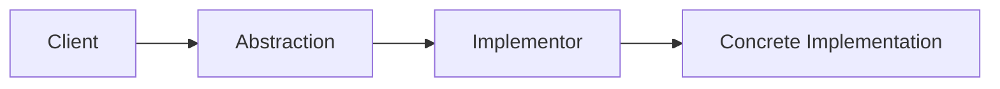
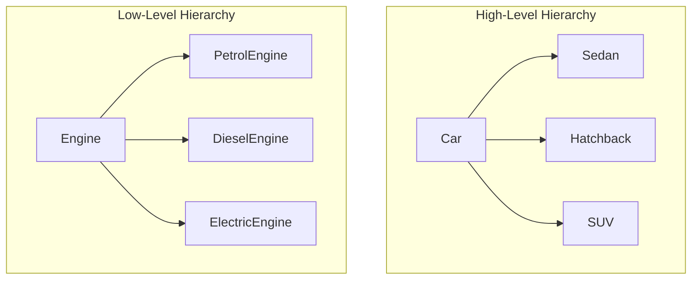
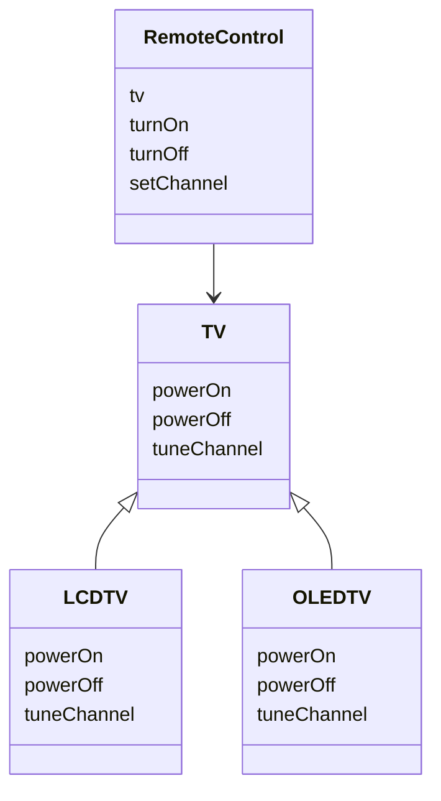
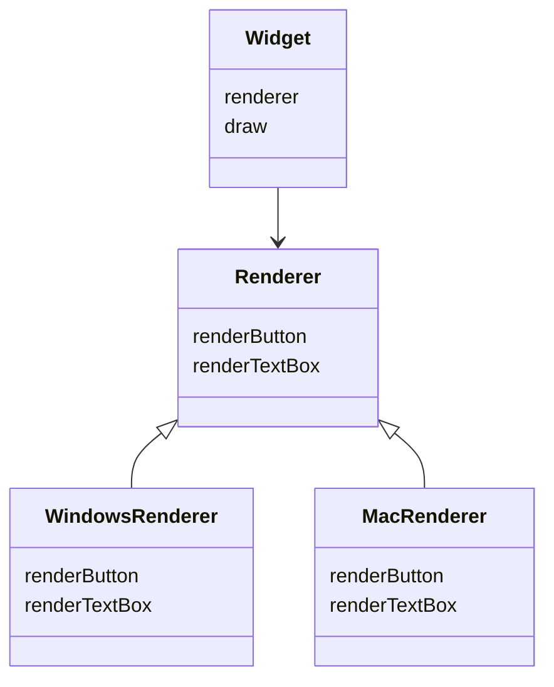
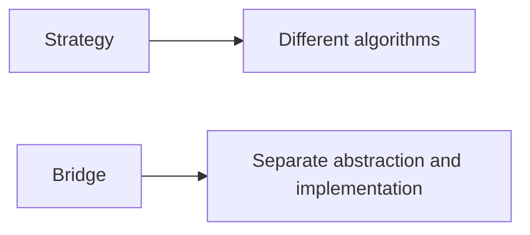
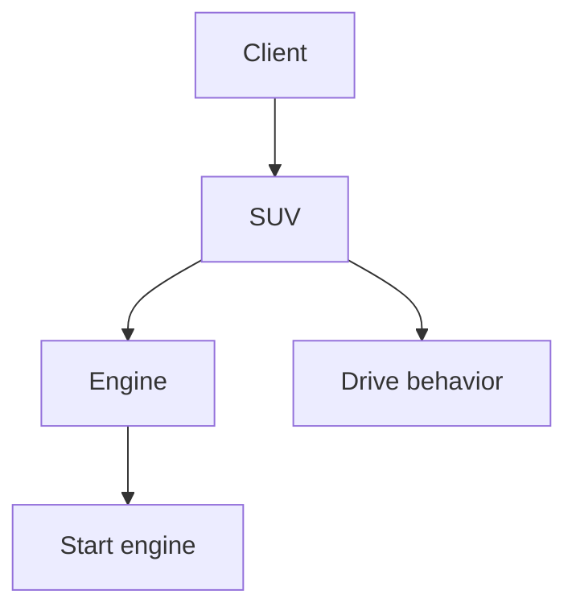
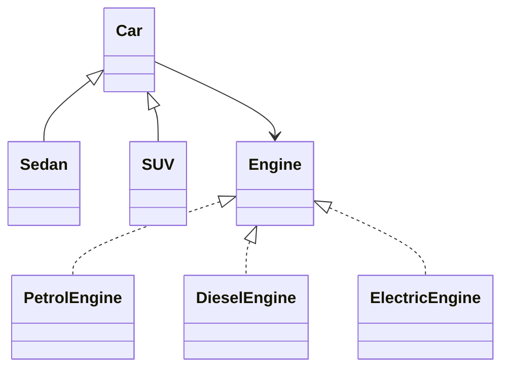
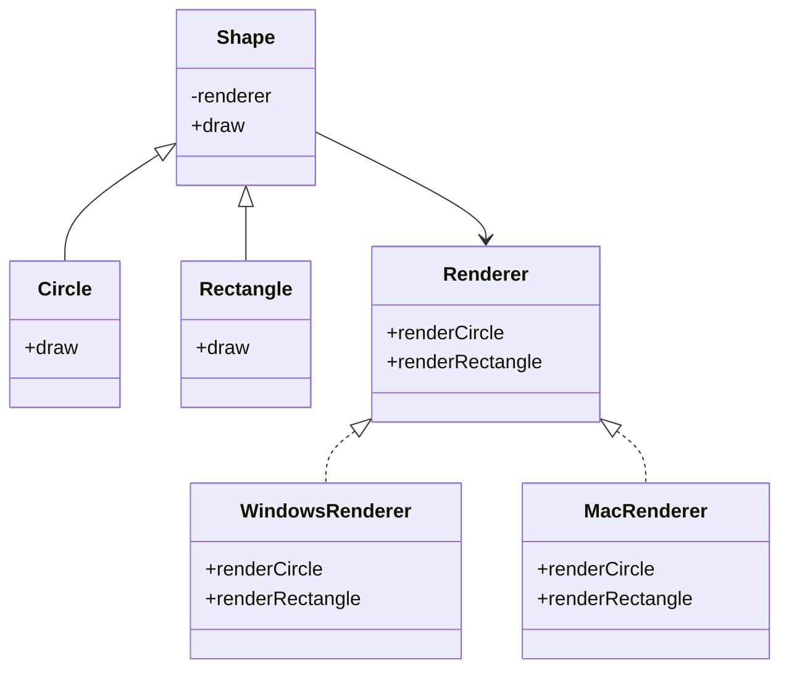

# Bridge Design Pattern

The **Bridge Design Pattern** is a structural design pattern that helps us **decouple an abstraction from its implementation so that both can vary independently**.

It is especially useful when we have:

- two independent dimensions of variation
- too many class combinations
- inheritance causing class explosion
- a need for flexible composition instead of rigid inheritance

---

# Introduction: The Problem of Class Explosion

Imagine we are building a car system.

We want to support:

- different car body types
- different engine types

For example:

### Car types
- Sedan
- Hatchback
- SUV

### Engine types
- Petrol
- Diesel
- Electric

If we use simple inheritance, we might create a separate class for every combination:

- SedanWithPetrol
- SedanWithDiesel
- SedanWithElectric
- HatchbackWithPetrol
- HatchbackWithDiesel
- HatchbackWithElectric
- SUVWithPetrol
- SUVWithDiesel
- SUVWithElectric

That is already **9 classes**.

If we add:
- a new car type
- a new engine type

the number of classes grows rapidly.

This problem is called **class explosion**.

---

## Why class explosion is bad

| Problem | Explanation |
|--------|-------------|
| Too many classes | The codebase becomes hard to manage |
| Duplicate logic | The same engine behavior may be repeated in many car classes |
| Poor scalability | Adding one new feature multiplies the number of classes |
| Hard maintenance | Changes must be made in many places |
| Tight coupling | Car type and engine type become unnecessarily bound together |

---

## Example of class explosion

```mermaid
flowchart TD
    A[Car Types] --> B[Sedan]
    A --> C[Hatchback]
    A --> D[SUV]

    E[Engine Types] --> F[Petrol]
    E --> G[Diesel]
    E --> H[Electric]

    B --> B1[SedanPetrol]
    B --> B2[SedanDiesel]
    B --> B3[SedanElectric]

    C --> C1[HatchbackPetrol]
    C --> C2[HatchbackDiesel]
    C --> C3[HatchbackElectric]

    D --> D1[SUVPetrol]
    D --> D2[SUVDiesel]
    D --> D3[SUVElectric]
````

---

# Core Idea of Bridge

The Bridge pattern splits a large concept into two independent parts:

1. **Abstraction** → the high-level concept
2. **Implementation** → the low-level detail

For the car example:

* **Abstraction** = Car
* **Implementation** = Engine

This separation allows both to evolve independently.

---

## Formal definition

Bridge decouples an abstraction from its implementation so that both can vary independently.

---

# What the pattern really means

Bridge does **not** mean “bridge two unrelated objects randomly.”

It means:

* one hierarchy represents the **what**
* the other hierarchy represents the **how**
* a bridge connects them using composition

This gives us flexibility without creating a huge number of classes.

---

# Bridge pattern solves two dimensions of variation

In the car system, the two independent dimensions are:

* **car type**
* **engine type**

These can change independently.

For example:

* a Sedan can use a Petrol engine
* a Sedan can also use an Electric engine
* an SUV can use a Diesel engine

The car type should not have to know the full details of each engine type.

---

# Why composition matters

Bridge uses **composition**, not inheritance, to connect the abstraction to the implementation.

This means:

* the `Car` class has an `Engine`
* the car does not inherit from engine
* the car delegates engine-specific behavior to the engine object

This is what makes the design flexible.

```mermaid
classDiagram
class Car {
    engine
    drive
}

class Engine {
    start
}

class PetrolEngine {
    start
}

class DieselEngine {
    start
}

class ElectricEngine {
    start
}

Car --> Engine
Engine <|-- PetrolEngine
Engine <|-- DieselEngine
Engine <|-- ElectricEngine
```

---

# Main participants in Bridge

| Role                 | Meaning                      | Car Example                                |
| -------------------- | ---------------------------- | ------------------------------------------ |
| Abstraction          | High-level concept           | Car                                        |
| Refined Abstraction  | Specialized abstraction      | Sedan, SUV, Hatchback                      |
| Implementor          | Interface for implementation | Engine                                     |
| Concrete Implementor | Actual implementation        | PetrolEngine, DieselEngine, ElectricEngine |

---

# How Bridge works

The abstraction contains a reference to the implementor.

When the abstraction receives a request, it delegates the low-level work to the implementor.



---

# Two independent hierarchies

Bridge creates two separate class hierarchies.

## 1. High-level hierarchy

This represents the abstraction.

Example:

* Car
* Sedan
* SUV
* Hatchback

## 2. Low-level hierarchy

This represents the implementation.

Example:

* Engine
* PetrolEngine
* DieselEngine
* ElectricEngine

These hierarchies are connected by composition.

---

## Visual representation



---

# Why Bridge is powerful

Without Bridge:

* combinations multiply
* inheritance becomes messy
* adding a new variation becomes expensive

With Bridge:

* car types and engine types are separated
* new engines can be added without changing car logic
* new car types can be added without changing engine logic

---

# Class Explosion vs Bridge

| Aspect            | Class Explosion   | Bridge            |
| ----------------- | ----------------- | ----------------- |
| Number of classes | m × n             | m + n             |
| Scalability       | Poor              | Good              |
| Reuse             | Low               | High              |
| Flexibility       | Low               | High              |
| Design style      | Inheritance-heavy | Composition-based |

---

# Real-world analogy: Remote controls and televisions

A remote control can work with multiple television models.

### High-level abstraction

* RemoteControl

### Low-level implementation

* TV

Examples:

* StandardRemote
* TouchRemote
* SmartRemote

TV types:

* LCD TV
* OLED TV
* LED TV

A remote should not need separate code for every TV model.

---

## Remote and TV hierarchy



---

# Another real-world analogy: GUI widgets and operating systems

GUI widgets need to render differently on different operating systems.

### High-level abstraction

* TextBox
* Button
* Dropdown

### Low-level implementation

* WindowsRenderer
* MacRenderer
* LinuxRenderer

A button should not contain OS-specific drawing logic directly.

Bridge lets the widget remain generic while the renderer handles platform-specific behavior.

---

## GUI bridge diagram



---

# Bridge vs Strategy

These two patterns often look similar because both use composition and delegation.

But their **intent** is different.

| Pattern  | Intent                                   | Focus                      |
| -------- | ---------------------------------------- | -------------------------- |
| Strategy | Change behavior/algorithm at runtime     | Selecting one algorithm    |
| Bridge   | Decouple abstraction from implementation | Separating two hierarchies |

---

## Simple difference

### Strategy

The client may choose different algorithms dynamically.

### Bridge

The abstraction and implementation are separated from the beginning to avoid class explosion.

---

## Bridge vs Strategy diagram



---

# How Bridge works internally

The abstraction holds a reference to the implementor.

The abstraction does not perform all work itself.

Instead, it delegates some tasks to the implementor.

This allows the two sides to vary independently.

---

## Chain of command



---

# Why this is better than inheritance

If we use inheritance directly, the engine and car type become permanently linked.

For example:

* `Sedan` might inherit from `PetrolSedan`
* `SUV` might inherit from `DieselSUV`

That is rigid and hard to extend.

With Bridge:

* `Sedan` can use any engine
* `SUV` can use any engine
* new engine types can be added later

This is a much cleaner design.

---

# Bridge example: Car system

We will implement:

* `Car` as abstraction
* `Engine` as implementation
* concrete car types: `Sedan`, `SUV`
* concrete engine types: `PetrolEngine`, `DieselEngine`, `ElectricEngine`

---

# Example

```cpp
#include <iostream>
#include <memory>
using namespace std;

class Engine {
public:
    virtual void start() = 0;
    virtual string type() = 0;
    virtual ~Engine() = default;
};

class PetrolEngine : public Engine {
public:
    void start() override {
        cout << "Petrol engine starts with ignition" << endl;
    }

    string type() override {
        return "Petrol";
    }
};

class DieselEngine : public Engine {
public:
    void start() override {
        cout << "Diesel engine starts with compression" << endl;
    }

    string type() override {
        return "Diesel";
    }
};

class ElectricEngine : public Engine {
public:
    void start() override {
        cout << "Electric engine starts silently" << endl;
    }

    string type() override {
        return "Electric";
    }
};

class Car {
protected:
    unique_ptr<Engine> engine;

public:
    Car(unique_ptr<Engine> engine) : engine(move(engine)) {}

    virtual void drive() = 0;
    virtual ~Car() = default;
};

class Sedan : public Car {
public:
    Sedan(unique_ptr<Engine> engine) : Car(move(engine)) {}

    void drive() override {
        cout << "Sedan with " << engine->type() << " engine is driving" << endl;
        engine->start();
    }
};

class SUV : public Car {
public:
    SUV(unique_ptr<Engine> engine) : Car(move(engine)) {}

    void drive() override {
        cout << "SUV with " << engine->type() << " engine is driving" << endl;
        engine->start();
    }
};

int main() {
    unique_ptr<Car> car1 = make_unique<Sedan>(make_unique<PetrolEngine>());
    unique_ptr<Car> car2 = make_unique<SUV>(make_unique<ElectricEngine>());

    car1->drive();
    cout << endl;
    car2->drive();

    return 0;
}
```
```java
interface Engine {
    void start();
    String type();
}

class PetrolEngine implements Engine {
    public void start() {
        System.out.println("Petrol engine starts with ignition");
    }

    public String type() {
        return "Petrol";
    }
}

class DieselEngine implements Engine {
    public void start() {
        System.out.println("Diesel engine starts with compression");
    }

    public String type() {
        return "Diesel";
    }
}

class ElectricEngine implements Engine {
    public void start() {
        System.out.println("Electric engine starts silently");
    }

    public String type() {
        return "Electric";
    }
}

abstract class Car {
    protected Engine engine;

    Car(Engine engine) {
        this.engine = engine;
    }

    abstract void drive();
}

class Sedan extends Car {
    Sedan(Engine engine) {
        super(engine);
    }

    void drive() {
        System.out.println("Sedan with " + engine.type() + " engine is driving");
        engine.start();
    }
}

class SUV extends Car {
    SUV(Engine engine) {
        super(engine);
    }

    void drive() {
        System.out.println("SUV with " + engine.type() + " engine is driving");
        engine.start();
    }
}

public class Main {
    public static void main(String[] args) {
        Car car1 = new Sedan(new PetrolEngine());
        Car car2 = new SUV(new ElectricEngine());

        car1.drive();
        System.out.println();
        car2.drive();
    }
}
```
```python
from abc import ABC, abstractmethod

class Engine(ABC):
    @abstractmethod
    def start(self):
        pass

    @abstractmethod
    def type(self):
        pass

class PetrolEngine(Engine):
    def start(self):
        print("Petrol engine starts with ignition")

    def type(self):
        return "Petrol"

class DieselEngine(Engine):
    def start(self):
        print("Diesel engine starts with compression")

    def type(self):
        return "Diesel"

class ElectricEngine(Engine):
    def start(self):
        print("Electric engine starts silently")

    def type(self):
        return "Electric"

class Car(ABC):
    def __init__(self, engine):
        self.engine = engine

    @abstractmethod
    def drive(self):
        pass

class Sedan(Car):
    def drive(self):
        print(f"Sedan with {self.engine.type()} engine is driving")
        self.engine.start()

class SUV(Car):
    def drive(self):
        print(f"SUV with {self.engine.type()} engine is driving")
        self.engine.start()

car1 = Sedan(PetrolEngine())
car2 = SUV(ElectricEngine())

car1.drive()
print()
car2.drive()
```

---

## C++ explanation

* `Car` is the abstraction
* `Engine` is the implementor
* `Sedan` and `SUV` are refined abstractions
* `PetrolEngine`, `DieselEngine`, and `ElectricEngine` are concrete implementors
* the car delegates engine-specific work to the engine object

---

## Java explanation

* `Engine` is the implementation hierarchy
* `Car` is the abstraction hierarchy
* `Sedan` and `SUV` extend the abstract car
* the car stores an `Engine` reference
* both hierarchies can change independently

---

## Python explanation

* `Car` is the abstraction
* `Engine` is the implementor
* each concrete car can work with any engine
* new combinations do not require new combined subclasses

---

# Bridge structure in one view



---

# Why Bridge reduces class count

Without Bridge:

* car types = `m`
* engine types = `n`
* total classes = `m × n`

With Bridge:

* car hierarchy = `m`
* engine hierarchy = `n`
* total classes = `m + n`

This is a major improvement when variation grows.

---

# Why Bridge is scalable

Bridge is scalable because it allows:

* new abstraction types without touching implementation classes
* new implementation types without touching abstraction classes

For example:

* new car type: `Truck`
* new engine type: `HybridEngine`

You do not need to create every possible combination manually.

---

# When Bridge is useful

Use Bridge when:

* you have multiple independent dimensions of variation
* inheritance leads to class explosion
* you want to separate abstraction from implementation
* you want both sides to evolve independently
* you want to favor composition over inheritance

---

# When Bridge is not needed

Avoid Bridge when:

* there is only one dimension of variation
* the problem is simple
* extra abstraction would make code harder to understand
* the abstraction and implementation are not meaningfully independent

---

# Benefits of Bridge

| Benefit                | Description                                              |
| ---------------------- | -------------------------------------------------------- |
| Avoids class explosion | Prevents combinatorial subclass growth                   |
| Independent evolution  | Abstraction and implementation can change separately     |
| Better reuse           | Implementation classes can be reused across abstractions |
| Cleaner design         | More maintainable than many combined subclasses          |
| Composition-based      | More flexible than rigid inheritance                     |
| Open for extension     | New features can be added without rewriting old ones     |

---

# Drawbacks of Bridge

| Drawback            | Description                        |
| ------------------- | ---------------------------------- |
| More abstraction    | Adds extra classes and layers      |
| More upfront design | Needs planning for two hierarchies |
| Can be overused     | Not necessary for simple cases     |

---

# Common mistakes

| Mistake                                        | Problem                     |
| ---------------------------------------------- | --------------------------- |
| Using Bridge when only one dimension changes   | Unnecessary complexity      |
| Confusing Bridge with Strategy                 | They have different intent  |
| Making implementation too aware of abstraction | Breaks decoupling           |
| Using inheritance instead of composition       | Reintroduces rigidity       |
| Adding too many layers                         | Makes code harder to follow |

---

# Bridge vs Strategy

| Aspect         | Bridge                                  | Strategy                     |
| -------------- | --------------------------------------- | ---------------------------- |
| Main intent    | Decouple abstraction and implementation | Change algorithms at runtime |
| Focus          | Structure                               | Behavior                     |
| Relationship   | Abstraction has an implementation       | Context uses a strategy      |
| Typical reason | Avoid class explosion                   | Swap behavior dynamically    |

---

## Simple difference

### Bridge

Used to design two independent hierarchies.

### Strategy

Used to choose one behavior from many behaviors.

---

# Bridge vs Adapter

| Aspect     | Bridge                                  | Adapter                                     |
| ---------- | --------------------------------------- | ------------------------------------------- |
| Purpose    | Separate abstraction and implementation | Make incompatible interfaces work together  |
| Timing     | Designed from the start                 | Often introduced to integrate existing code |
| Main focus | Scalability and independent variation   | Compatibility                               |

---

# Bridge in real-world systems

## 1. Remote controls and televisions

* Remote control = abstraction
* TV models = implementation

## 2. GUI widgets and renderers

* Widget = abstraction
* OS renderer = implementation

## 3. Shapes and drawing APIs

* Shape = abstraction
* Drawing API = implementation

## 4. Messaging systems

* Message types = abstraction
* Transport mechanisms = implementation

---

# Example: Shape and renderer



---

# Summary

The Bridge Pattern helps us solve the class explosion problem by separating:

* **what** something is
* **how** it works internally

It does this using:

* two independent hierarchies
* composition instead of inheritance
* delegation from abstraction to implementation

It is ideal when we need to combine many variations without creating a huge number of classes.

---

# Final takeaway

The Bridge Pattern is about this simple idea:

> Separate the high-level abstraction from the low-level implementation, and connect them with composition.

That gives you:

* cleaner design
* less class explosion
* independent evolution
* better scalability

It is one of the best patterns for systems with multiple dimensions of variation.
