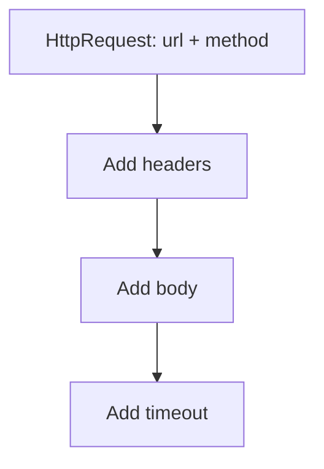
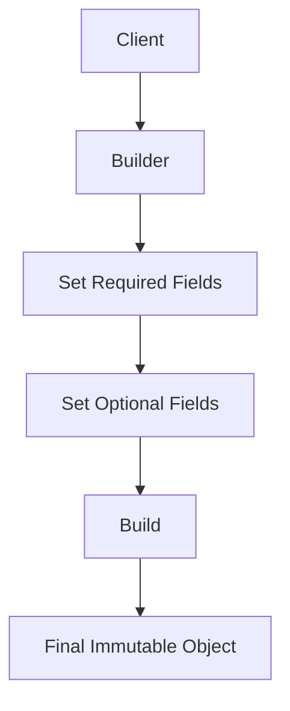
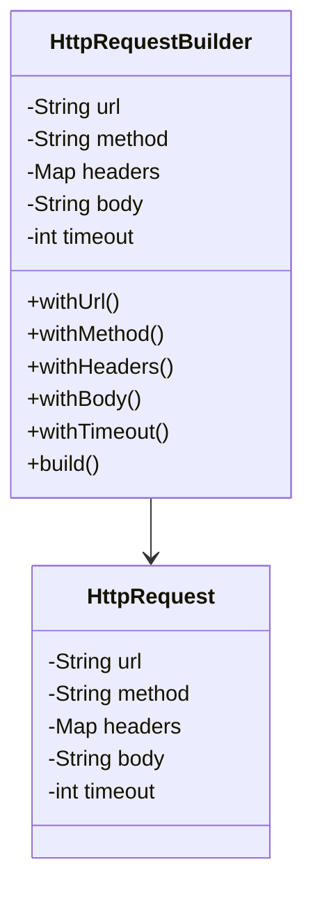
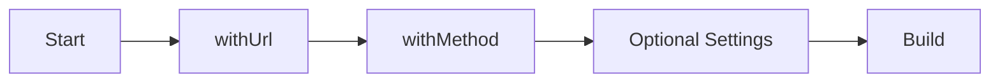
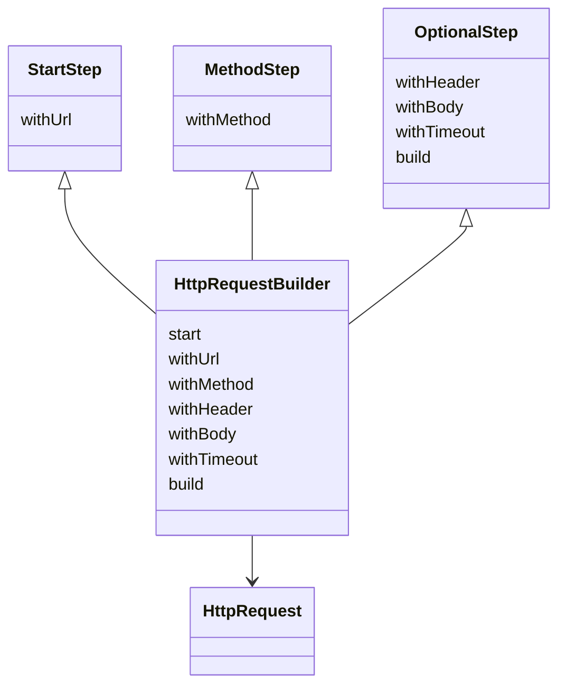

# Builder Design Pattern

The **Builder Pattern** is a creational design pattern that helps us construct complex objects **step by step**.

Its main purpose is to separate:

- **how an object is built**
- from **what the object finally is**

This is especially useful when an object has:

- many optional parameters
- multiple valid construction combinations
- complex setup logic
- a need for immutability
- a risk of inconsistent state during creation

---

# Introduction: The Hidden Complexity of “Simple” Objects

At first, creating an object feels simple.

For example:

```text
new HttpRequest(url, method)
````

This looks clean.
But soon, requirements grow:

* headers
* body
* timeout
* authentication
* query parameters
* retry settings
* caching rules

Suddenly, object creation becomes messy and error-prone.

The Builder Pattern solves this by making object construction intentional, readable, and safe.

---

# Why object creation becomes a problem

A complex object often has:

* required fields
* optional fields
* different valid combinations
* initialization rules
* validation rules

If we do not design object creation carefully, the code becomes hard to maintain.

---

# Problem 1: Telescoping Constructors

A common approach to optional parameters is to create many overloaded constructors.

This is called the **Telescoping Constructor Anti-Pattern**.

---

## Example of the problem

Suppose `HttpRequest` has:

* required: `url`, `method`
* optional: `headers`, `body`, `timeout`

You may end up writing:

* constructor(url, method)
* constructor(url, method, headers)
* constructor(url, method, headers, body)
* constructor(url, method, headers, body, timeout)

And so on.

This creates a long chain of constructors that becomes painful to maintain.

---

## Why telescoping constructors are bad

| Problem               | Explanation                                        |
| --------------------- | -------------------------------------------------- |
| Too many constructors | Every combination needs a new overload             |
| Hard to read          | The intent of each constructor becomes unclear     |
| Hard to extend        | Adding one more optional field adds more overloads |
| Error-prone           | It is easy to pass values in the wrong order       |
| Poor maintainability  | The class becomes bloated                          |

---

## Visualizing telescoping constructors



---

# Problem 2: Inconsistent State with Setters

A different approach is:

* create a minimal constructor
* then use public setters to set optional fields

Example:

* `setHeaders()`
* `setBody()`
* `setTimeout()`

This seems cleaner, but it creates another problem.

---

## The hidden danger

A developer may forget to call one of the required setter methods before using the object.

That means the object can exist in an incomplete or invalid state.

For example:

* `url` is set
* `method` is not set
* `body` is missing
* `timeout` is invalid

The compiler will not stop this.
The bug appears later at runtime.

---

## Why this is dangerous

| Problem                   | Explanation                                          |
| ------------------------- | ---------------------------------------------------- |
| Invalid objects can exist | The object may be used before it is fully configured |
| Runtime crashes           | Errors appear only when the object is used           |
| Defensive code everywhere | Methods need many null checks                        |
| Poor encapsulation        | External code can keep changing object state         |
| Harder debugging          | Failures appear far from the source of the bug       |

---

# Problem 3: Mutability

If an object exposes public setters, then its state can be changed after construction.

This can lead to bugs such as:

* the object becoming invalid later
* multithreading issues
* unpredictable behavior
* accidental modification by other parts of the code

Builder encourages returning an **immutable final object**.

That means:

* the object is built once
* its state is fixed
* no public setters are needed

---

# Solution: Builder Pattern

The Builder Pattern solves these problems by separating object creation from the final object representation.

Instead of constructing the object directly, we create a **Builder** object that gradually collects all required values.

Then we call `build()` to produce the final object.

---

## Core idea

* the builder gathers data step by step
* the `build()` method validates everything
* the final object is created only when the state is complete
* the final object is typically immutable



---

# Formal definition

The Builder Pattern is a creational pattern used to construct complex objects step by step, separating the construction process from the final representation.

---

# Why Builder is useful

Builder is useful when:

* a class has many optional parameters
* object creation involves multiple steps
* the order of creation matters
* we want readable construction code
* we want immutability
* we want centralized validation

---

# Main benefits of Builder

| Benefit         | Description                                          |
| --------------- | ---------------------------------------------------- |
| Readability     | Construction code becomes self-explanatory           |
| Flexibility     | Different combinations of values are easy to support |
| Validation      | Required fields can be checked in one place          |
| Immutability    | Final object can be made unchangeable                |
| Cleaner APIs    | Client code is easier to understand                  |
| Maintainability | Adding new optional fields becomes simpler           |

---

# Builder structure

The Builder Pattern usually has:

* a product class
* a builder class
* a `build()` method
* optional fluent methods such as `withX()`

---

## UML structure



---

# Fluent Interface and Method Chaining

One of the best features of Builder is **method chaining**.

Each builder method returns the builder itself, so calls can be chained neatly.

Example:

```text
builder.withUrl(...).withMethod(...).withBody(...).build()
```

This is called a **fluent interface**.

---

## Why method chaining helps

| Benefit  | Description                                   |
| -------- | --------------------------------------------- |
| Readable | It reads like a sentence                      |
| Compact  | Fewer lines of code                           |
| Natural  | The order of configuration is easy to follow  |
| Flexible | Optional values can be added only when needed |

---

# Example scenario: HttpRequest

Suppose we need to build an HTTP request with:

* `url` → required
* `method` → required
* `headers` → optional
* `body` → optional
* `timeout` → optional

This is an ideal use case for Builder.

---

# Step-by-step process

1. Create the builder
2. Set required fields
3. Set optional fields
4. Validate in `build()`
5. Return an immutable request object

---

# Centralized validation

One of the biggest advantages of Builder is that validation is centralized in the `build()` method.

This means:

* required fields can be checked once
* values can be normalized
* invalid combinations can be rejected before the object is created

---

# Immutability

The final object is usually immutable.

That means:

* no public setters
* state cannot change after construction
* safer in concurrent systems
* fewer accidental bugs

---

# A complete example

```cpp
#include <iostream>
#include <string>
#include <map>
#include <memory>
using namespace std;

class HttpRequest {
private:
    string url;
    string method;
    map<string, string> headers;
    string body;
    int timeout;

    HttpRequest(const string& url,
                const string& method,
                const map<string, string>& headers,
                const string& body,
                int timeout)
        : url(url), method(method), headers(headers), body(body), timeout(timeout) {}

public:
    void print() const {
        cout << "URL: " << url << endl;
        cout << "Method: " << method << endl;
        cout << "Timeout: " << timeout << endl;
        cout << "Headers:" << endl;
        for (const auto& h : headers) {
            cout << "  " << h.first << ": " << h.second << endl;
        }
        cout << "Body: " << body << endl;
    }

    friend class HttpRequestBuilder;
};

class HttpRequestBuilder {
private:
    string url;
    string method;
    map<string, string> headers;
    string body;
    int timeout = 0;

public:
    HttpRequestBuilder& withUrl(const string& u) {
        url = u;
        return *this;
    }

    HttpRequestBuilder& withMethod(const string& m) {
        method = m;
        return *this;
    }

    HttpRequestBuilder& withHeader(const string& key, const string& value) {
        headers[key] = value;
        return *this;
    }

    HttpRequestBuilder& withBody(const string& b) {
        body = b;
        return *this;
    }

    HttpRequestBuilder& withTimeout(int t) {
        timeout = t;
        return *this;
    }

    shared_ptr<HttpRequest> build() {
        if (url.empty()) {
            throw runtime_error("URL is required");
        }
        if (method.empty()) {
            throw runtime_error("Method is required");
        }
        return make_shared<HttpRequest>(url, method, headers, body, timeout);
    }
};

int main() {
    auto request = HttpRequestBuilder()
        .withUrl("https://api.example.com/users")
        .withMethod("POST")
        .withHeader("Content-Type", "application/json")
        .withBody("{\"name\":\"Alice\"}")
        .withTimeout(30)
        .build();

    request->print();
    return 0;
}
```
```java
import java.util.LinkedHashMap;
import java.util.Map;

final class HttpRequest {
    private final String url;
    private final String method;
    private final Map<String, String> headers;
    private final String body;
    private final int timeout;

    HttpRequest(String url, String method, Map<String, String> headers, String body, int timeout) {
        this.url = url;
        this.method = method;
        this.headers = new LinkedHashMap<>(headers);
        this.body = body;
        this.timeout = timeout;
    }

    public void print() {
        System.out.println("URL: " + url);
        System.out.println("Method: " + method);
        System.out.println("Timeout: " + timeout);
        System.out.println("Headers:");
        for (Map.Entry<String, String> entry : headers.entrySet()) {
            System.out.println("  " + entry.getKey() + ": " + entry.getValue());
        }
        System.out.println("Body: " + body);
    }
}

class HttpRequestBuilder {
    private String url;
    private String method;
    private Map<String, String> headers = new LinkedHashMap<>();
    private String body = "";
    private int timeout = 0;

    public HttpRequestBuilder withUrl(String url) {
        this.url = url;
        return this;
    }

    public HttpRequestBuilder withMethod(String method) {
        this.method = method;
        return this;
    }

    public HttpRequestBuilder withHeader(String key, String value) {
        this.headers.put(key, value);
        return this;
    }

    public HttpRequestBuilder withBody(String body) {
        this.body = body;
        return this;
    }

    public HttpRequestBuilder withTimeout(int timeout) {
        this.timeout = timeout;
        return this;
    }

    public HttpRequest build() {
        if (url == null || url.isBlank()) {
            throw new IllegalStateException("URL is required");
        }
        if (method == null || method.isBlank()) {
            throw new IllegalStateException("Method is required");
        }
        return new HttpRequest(url, method, headers, body, timeout);
    }
}

public class Main {
    public static void main(String[] args) {
        HttpRequest request = new HttpRequestBuilder()
                .withUrl("https://api.example.com/users")
                .withMethod("POST")
                .withHeader("Content-Type", "application/json")
                .withBody("{\"name\":\"Alice\"}")
                .withTimeout(30)
                .build();

        request.print();
    }
}
```
```python
class HttpRequest:
    def __init__(self, url, method, headers, body, timeout):
        self._url = url
        self._method = method
        self._headers = dict(headers)
        self._body = body
        self._timeout = timeout

    def print(self):
        print("URL:", self._url)
        print("Method:", self._method)
        print("Timeout:", self._timeout)
        print("Headers:")
        for k, v in self._headers.items():
            print(f"  {k}: {v}")
        print("Body:", self._body)

class HttpRequestBuilder:
    def __init__(self):
        self._url = None
        self._method = None
        self._headers = {}
        self._body = ""
        self._timeout = 0

    def with_url(self, url):
        self._url = url
        return self

    def with_method(self, method):
        self._method = method
        return self

    def with_header(self, key, value):
        self._headers[key] = value
        return self

    def with_body(self, body):
        self._body = body
        return self

    def with_timeout(self, timeout):
        self._timeout = timeout
        return self

    def build(self):
        if not self._url:
            raise ValueError("URL is required")
        if not self._method:
            raise ValueError("Method is required")
        return HttpRequest(self._url, self._method, self._headers, self._body, self._timeout)

request = (
    HttpRequestBuilder()
    .with_url("https://api.example.com/users")
    .with_method("POST")
    .with_header("Content-Type", "application/json")
    .with_body('{"name":"Alice"}')
    .with_timeout(30)
    .build()
)

request.print()
```

---

## C++ explanation

* `HttpRequest` is the final product
* its constructor is private
* `HttpRequestBuilder` creates it step by step
* `build()` validates required data
* the final object is safely constructed

---

## Java explanation

* `HttpRequest` is immutable
* all fields are `final`
* builder methods return `this`
* validation happens in `build()`
* object creation is controlled and readable

---

## Python explanation

* builder stores intermediate state
* methods return `self` for chaining
* build validates required fields
* final object is created only when ready

---

# Why Builder is better than setters

| Approach          | Problem                            |
| ----------------- | ---------------------------------- |
| Constructors only | Too many overloads                 |
| Setters only      | Object may be incomplete           |
| Builder           | Clean construction with validation |

---

# Step Builder Pattern

The classic builder improves readability and safety, but it does not always enforce the order of steps.

A developer may still call methods in the wrong order.

The **Step Builder** is an advanced variation that enforces a sequence of required steps through interfaces.

---

## Why step builder is needed

Sometimes the order matters.

For example:

* set URL first
* then set method
* then set body
* then build

The Step Builder guides the developer through this sequence.

---

## Step builder concept

Each step returns a different interface.

That means the IDE only shows the valid next methods.

This prevents incorrect order at compile time.

---

## Step builder flow



---

## Step Builder UML


---

# Step Builder example in Java

```java
import java.util.LinkedHashMap;
import java.util.Map;

final class HttpRequest {
    private final String url;
    private final String method;
    private final Map<String, String> headers;
    private final String body;
    private final int timeout;

    HttpRequest(String url, String method, Map<String, String> headers, String body, int timeout) {
        this.url = url;
        this.method = method;
        this.headers = new LinkedHashMap<>(headers);
        this.body = body;
        this.timeout = timeout;
    }

    public void print() {
        System.out.println("URL: " + url);
        System.out.println("Method: " + method);
        System.out.println("Timeout: " + timeout);
        System.out.println("Headers: " + headers);
        System.out.println("Body: " + body);
    }
}

class HttpRequestStepBuilder {
    public static UrlStep start() {
        return new Builder();
    }

    public interface UrlStep {
        MethodStep withUrl(String url);
    }

    public interface MethodStep {
        OptionalStep withMethod(String method);
    }

    public interface OptionalStep {
        OptionalStep withHeader(String key, String value);
        OptionalStep withBody(String body);
        OptionalStep withTimeout(int timeout);
        HttpRequest build();
    }

    private static class Builder implements UrlStep, MethodStep, OptionalStep {
        private String url;
        private String method;
        private Map<String, String> headers = new LinkedHashMap<>();
        private String body = "";
        private int timeout = 0;

        public MethodStep withUrl(String url) {
            this.url = url;
            return this;
        }

        public OptionalStep withMethod(String method) {
            this.method = method;
            return this;
        }

        public OptionalStep withHeader(String key, String value) {
            this.headers.put(key, value);
            return this;
        }

        public OptionalStep withBody(String body) {
            this.body = body;
            return this;
        }

        public OptionalStep withTimeout(int timeout) {
            this.timeout = timeout;
            return this;
        }

        public HttpRequest build() {
            if (url == null || url.isBlank()) {
                throw new IllegalStateException("URL is required");
            }
            if (method == null || method.isBlank()) {
                throw new IllegalStateException("Method is required");
            }
            return new HttpRequest(url, method, headers, body, timeout);
        }
    }
}

public class Main {
    public static void main(String[] args) {
        HttpRequest request = HttpRequestStepBuilder.start()
                .withUrl("https://api.example.com/users")
                .withMethod("POST")
                .withHeader("Content-Type", "application/json")
                .withBody("{\"name\":\"Alice\"}")
                .withTimeout(30)
                .build();

        request.print();
    }
}
```

---

## Step builder explanation

* `start()` returns the first required step
* `withUrl()` returns the next interface
* `withMethod()` returns the next interface
* optional methods can be called afterward
* `build()` is only available at the right time

This helps enforce logical construction order.

---

# Builder vs Step Builder

| Feature             | Builder  | Step Builder |
| ------------------- | -------- | ------------ |
| Readability         | High     | Higher       |
| Order enforcement   | No       | Yes          |
| Flexibility         | High     | High         |
| Compile-time safety | Moderate | Strong       |
| Complexity          | Lower    | Higher       |

---

# Builder vs Constructor vs Setter

| Approach    | Good for        | Weakness                             |
| ----------- | --------------- | ------------------------------------ |
| Constructor | Small objects   | Too many overloads for large objects |
| Setter      | Mutable objects | Inconsistent state                   |
| Builder     | Complex objects | Slightly more code                   |

---

# Builder vs Factory

These patterns are often confused.

| Pattern | Main idea                                             |
| ------- | ----------------------------------------------------- |
| Factory | Creates objects without exposing exact creation logic |
| Builder | Constructs complex objects step by step               |

### Simple distinction

* Factory chooses **which object**
* Builder controls **how the object is assembled**

---

# Builder use cases

Builder is common in:

* HTTP request creation
* document generation
* query builders
* configuration objects
* UI components
* test data setup
* complex domain objects

---

# Benefits of Builder

| Benefit                   | Description                            |
| ------------------------- | -------------------------------------- |
| Step-by-step construction | Complex objects become manageable      |
| Fluent syntax             | Code becomes readable                  |
| Centralized validation    | Required fields checked in one place   |
| Immutability              | Final object is stable                 |
| Better maintainability    | Easier to add more options later       |
| Safer APIs                | Less chance of invalid object creation |

---

# Drawbacks of Builder

| Drawback                    | Description                                 |
| --------------------------- | ------------------------------------------- |
| More classes                | Adds builder class and sometimes interfaces |
| More code                   | Heavier than a simple constructor           |
| Overkill for simple objects | Not needed for trivial objects              |

---

# Common mistakes

| Mistake                               | Problem                              |
| ------------------------------------- | ------------------------------------ |
| Using Builder for tiny objects        | Unnecessary complexity               |
| Forgetting validation in build()      | Invalid objects may still be created |
| Making the builder mutable and shared | Can cause side effects               |
| Returning mutable final objects       | Loses immutability benefits          |
| Exposing setters in final object      | Breaks the design goal               |

---

# When to use Builder

Use Builder when:

* an object has many optional parameters
* the construction process is complex
* object creation should be readable
* you want immutability
* you want to validate before creation
* the order of setting fields matters

---

# When not to use Builder

Avoid Builder when:

* the object is very simple
* there are only one or two parameters
* a constructor is already clear enough
* the extra abstraction is not justified

---

# Summary

The Builder Pattern solves the pain of complex object creation.

It avoids:

* telescoping constructors
* invalid intermediate states
* excessive setters
* unclear initialization logic

It gives us:

* step-by-step construction
* readable code
* validation in one place
* immutable final objects

The Step Builder takes it further by enforcing the order of construction.

---

# Final takeaway

The Builder Pattern is about this simple idea:

> Build complex objects intentionally, step by step, instead of forcing everything into constructors and setters.

That makes your code:

* safer
* clearer
* easier to maintain
* easier to extend

It is one of the best patterns for designing clean APIs for complex object creation.