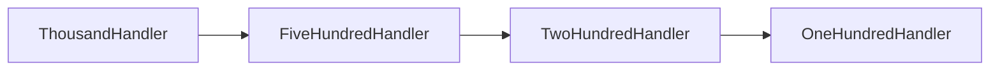
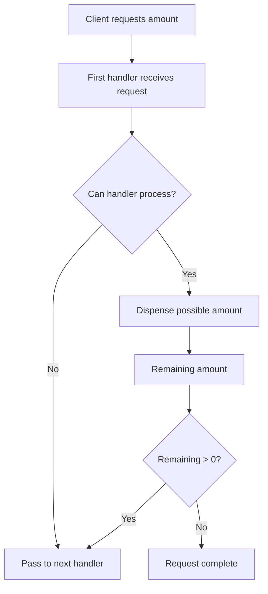
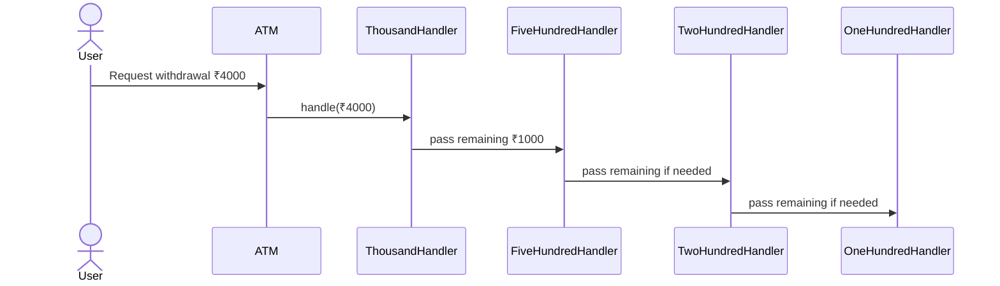
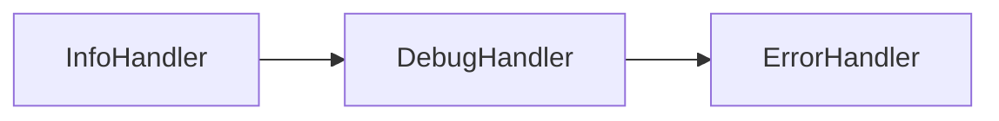
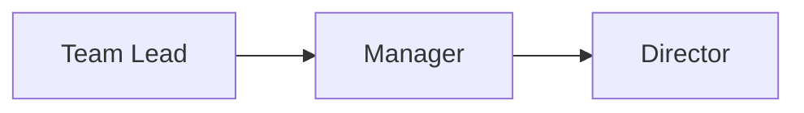
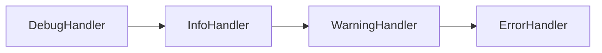

# Chain of Responsibility Design Pattern

The **Chain of Responsibility Pattern** is a behavioral design pattern that lets you pass a request through a chain of handlers until one of them processes it.

Instead of the sender deciding exactly who should handle the request, the request moves through a series of objects.

Each object in the chain either:

- handles the request, or
- forwards it to the next handler

This gives us a flexible way to process requests without tightly coupling the sender to the receiver.

---

# Introduction: The Problem of the Unknown Handler

Imagine you have a request, but you do not know which object should process it.

For example:
- a leave request
- a log message
- an ATM withdrawal
- a support ticket
- an approval workflow

If we hard-code the handler, the system becomes rigid.

If we use many `if/else` conditions, the code becomes messy and difficult to maintain.

The Chain of Responsibility solves this by building a chain of handlers.

```mermaid
flowchart LR
    A[Client] --> B[Handler 1]
    B --> C[Handler 2]
    C --> D[Handler 3]
    D --> E[Handler 4]
````

---

# Core Idea

The request is passed from one handler to the next.

Each handler decides:

* Can I handle this request?
* If yes, process it.
* If no, pass it to the next handler.

This creates a line of responsibility, where the request is gradually examined by multiple potential handlers.

---

# Formal Definition

The Chain of Responsibility pattern avoids coupling the sender of a request to its receiver by giving more than one object a chance to handle the request.

It chains the receiving objects and passes the request along the chain until an object handles it.

---

# Why this pattern matters

The pattern helps us build systems that are:

* loosely coupled
* easier to extend
* easier to maintain
* more modular
* easier to test
* cleaner than large `if/else` blocks

---

# Main Participants

| Role    | Meaning                           | ATM Example            |
| ------- | --------------------------------- | ---------------------- |
| Client  | Makes the request                 | Customer               |
| Handler | Processes or forwards the request | Note dispenser         |
| Request | The task to be fulfilled          | Cash withdrawal amount |

---

## Chain structure

```mermaid
classDiagram
class Handler {
    setNext
    handle
}

class ThousandHandler {
    handle
}

class FiveHundredHandler {
    handle
}

class TwoHundredHandler {
    handle
}

class OneHundredHandler {
    handle
}

Handler <|-- ThousandHandler
Handler <|-- FiveHundredHandler
Handler <|-- TwoHundredHandler
Handler <|-- OneHundredHandler

ThousandHandler --> Handler
FiveHundredHandler --> Handler
TwoHundredHandler --> Handler
OneHundredHandler --> Handler
```
---

# Chain of Responsibility vs Linked List

The pattern is often compared to a linked list because each handler points to the next one.

But they are not the same.

| Aspect    | Linked List       | Chain of Responsibility               |
| --------- | ----------------- | ------------------------------------- |
| Purpose   | Store data        | Process requests                      |
| Node type | Usually same type | Different concrete handlers can exist |
| Operation | Traverse data     | Pass request along chain              |
| Goal      | Data organization | Responsibility delegation             |

The key difference is that the chain is designed to **process** requests, not merely store items.

---

# ATM Example

The ATM cash dispenser is one of the best examples of Chain of Responsibility.

Suppose the ATM has notes in this order:

* ₹1000
* ₹500
* ₹200
* ₹100

Each note dispenser acts like a handler.

The request is passed from largest denomination to smallest denomination.

---

## ATM handler chain



---

# Why ATM is a good example

ATM withdrawal has natural conditions:

* some note types may not have enough quantity
* the chain should try the largest possible notes first
* the request may or may not be fully satisfied
* the chain should stop when done

This makes it a perfect fit for the pattern.

---

# How the chain works

For a request like ₹4000:

1. The first handler checks whether it can process the request.
2. If possible, it dispenses as much as it can.
3. It passes the remaining amount to the next handler.
4. This continues until the full request is handled or the chain ends.

---

# Step-by-step flow



---

# Walkthrough 1: ₹4000 withdrawal

Suppose the ATM has:

* 3 notes of ₹1000
* 5 notes of ₹500
* 10 notes of ₹200
* 20 notes of ₹100

---

## Process

### Step 1

The client requests ₹4000.

### Step 2

`ThousandHandler` receives the request first.

It can dispense only 3 notes of ₹1000.

So it dispenses:

* ₹3000 total

Remaining amount:

* ₹1000

### Step 3

The remaining ₹1000 goes to `FiveHundredHandler`.

It can dispense:

* 2 notes of ₹500

Remaining amount:

* ₹0

### Step 4

The request is fully handled.

---

## Result

The user gets:

* 3 × ₹1000
* 2 × ₹500

Total = ₹4000

---

# Walkthrough 2: ₹150 withdrawal

Now suppose the client requests ₹150.

The chain tries to handle it.

### Step 1

`ThousandHandler` cannot help.

### Step 2

It passes the request to `FiveHundredHandler`.

### Step 3

`FiveHundredHandler` also cannot fully help.

### Step 4

It passes the request to `TwoHundredHandler`.

### Step 5

`TwoHundredHandler` cannot help.

### Step 6

It passes to `OneHundredHandler`.

`OneHundredHandler` can dispense ₹100, but there is still ₹50 remaining.

If there is no `FiftyHandler`, the request cannot be fully satisfied.

---

## Possible behaviors

The system may:

* reject the request entirely
* dispense only partial amount
* ask the user for a different amount

The exact behavior depends on business rules.

---

# ATM sequence diagram



---

# Why the pattern is useful

The Chain of Responsibility gives us a clean way to distribute responsibility across multiple objects.

Instead of a single huge function like:

```text
if request is type A
else if request is type B
else if request is type C
```

we let each handler decide for itself.

That gives us:

* cleaner code
* better separation
* easier extension
* lower coupling

---

# Benefits

| Benefit               | Description                                              |
| --------------------- | -------------------------------------------------------- |
| Single Responsibility | Each handler has one job                                 |
| Open/Closed Principle | New handlers can be added without changing existing ones |
| Loose coupling        | Sender does not know the final receiver                  |
| Cleaner design        | Replaces large conditional blocks                        |
| Flexible processing   | Requests can move through multiple handlers              |

---

# How this supports SOLID

## SRP

Each handler is responsible for one specific condition or denomination.

## OCP

New handler types can be added without modifying existing ones.

---

# Common use cases

| Domain            | Example                                   |
| ----------------- | ----------------------------------------- |
| ATM               | Cash dispenser chain                      |
| Logging           | Info, Debug, Error handlers               |
| Leave approval    | Team Lead → Manager → Director            |
| Tech support      | L1 → L2 → L3 support                      |
| Request filtering | Validation, authentication, authorization |
| Event processing  | Multiple event processors                 |

---

# Logging example

Suppose we have log levels:

* INFO
* DEBUG
* ERROR

A logging request can move through a chain of handlers.



Each handler decides whether it should handle the log message.

---

# Leave approval example

A leave request can move through a chain of authority.

* 1 or 2 days → Team Lead
* 3 to 5 days → Manager
* more than 5 days → Director



Each manager decides whether the request falls within their authority.

---

# Structure of a chain handler

A handler usually has:

* a reference to the next handler
* a method to process the request
* logic to either handle or forward

---

## Pseudocode

```text id="cor_pseudocode_01"
handle(request):
    if canHandle(request):
        process(request)
    else if nextHandler exists:
        nextHandler.handle(request)
    else:
        request cannot be handled
```

---

# ATM handler design

For the ATM example, each handler can:

* check how many notes it has
* calculate how many notes it can dispense
* pass the remaining amount to the next handler

This makes the logic recursive and clean.

---

```cpp
#include <iostream>
using namespace std;

class Handler {
protected:
    Handler* nextHandler;

public:
    Handler() : nextHandler(nullptr) {}

    void setNext(Handler* next) {
        nextHandler = next;
    }

    virtual void handle(int amount) = 0;
    virtual ~Handler() = default;
};

class ThousandHandler : public Handler {
private:
    int notes;

public:
    ThousandHandler(int count) : notes(count) {}

    void handle(int amount) override {
        int canDispense = min(amount / 1000, notes);
        if (canDispense > 0) {
            cout << "₹1000 notes: " << canDispense << endl;
            amount -= canDispense * 1000;
        }

        if (amount > 0 && nextHandler != nullptr) {
            nextHandler->handle(amount);
        } else if (amount > 0) {
            cout << "Remaining amount cannot be dispensed: ₹" << amount << endl;
        }
    }
};

class FiveHundredHandler : public Handler {
private:
    int notes;

public:
    FiveHundredHandler(int count) : notes(count) {}

    void handle(int amount) override {
        int canDispense = min(amount / 500, notes);
        if (canDispense > 0) {
            cout << "₹500 notes: " << canDispense << endl;
            amount -= canDispense * 500;
        }

        if (amount > 0 && nextHandler != nullptr) {
            nextHandler->handle(amount);
        } else if (amount > 0) {
            cout << "Remaining amount cannot be dispensed: ₹" << amount << endl;
        }
    }
};

class TwoHundredHandler : public Handler {
private:
    int notes;

public:
    TwoHundredHandler(int count) : notes(count) {}

    void handle(int amount) override {
        int canDispense = min(amount / 200, notes);
        if (canDispense > 0) {
            cout << "₹200 notes: " << canDispense << endl;
            amount -= canDispense * 200;
        }

        if (amount > 0 && nextHandler != nullptr) {
            nextHandler->handle(amount);
        } else if (amount > 0) {
            cout << "Remaining amount cannot be dispensed: ₹" << amount << endl;
        }
    }
};

class OneHundredHandler : public Handler {
private:
    int notes;

public:
    OneHundredHandler(int count) : notes(count) {}

    void handle(int amount) override {
        int canDispense = min(amount / 100, notes);
        if (canDispense > 0) {
            cout << "₹100 notes: " << canDispense << endl;
            amount -= canDispense * 100;
        }

        if (amount > 0 && nextHandler != nullptr) {
            nextHandler->handle(amount);
        } else if (amount > 0) {
            cout << "Remaining amount cannot be dispensed: ₹" << amount << endl;
        }
    }
};

int main() {
    ThousandHandler h1000(3);
    FiveHundredHandler h500(5);
    TwoHundredHandler h200(10);
    OneHundredHandler h100(20);

    h1000.setNext(&h500);
    h500.setNext(&h200);
    h200.setNext(&h100);

    cout << "Withdrawal ₹4000" << endl;
    h1000.handle(4000);

    cout << endl << "Withdrawal ₹150" << endl;
    h1000.handle(150);

    return 0;
}
```
```java
abstract class Handler {
    protected Handler nextHandler;

    public void setNext(Handler nextHandler) {
        this.nextHandler = nextHandler;
    }

    public abstract void handle(int amount);
}

class ThousandHandler extends Handler {
    private int notes;

    ThousandHandler(int notes) {
        this.notes = notes;
    }

    public void handle(int amount) {
        int canDispense = Math.min(amount / 1000, notes);
        if (canDispense > 0) {
            System.out.println("₹1000 notes: " + canDispense);
            amount -= canDispense * 1000;
        }

        if (amount > 0 && nextHandler != null) {
            nextHandler.handle(amount);
        } else if (amount > 0) {
            System.out.println("Remaining amount cannot be dispensed: ₹" + amount);
        }
    }
}

class FiveHundredHandler extends Handler {
    private int notes;

    FiveHundredHandler(int notes) {
        this.notes = notes;
    }

    public void handle(int amount) {
        int canDispense = Math.min(amount / 500, notes);
        if (canDispense > 0) {
            System.out.println("₹500 notes: " + canDispense);
            amount -= canDispense * 500;
        }

        if (amount > 0 && nextHandler != null) {
            nextHandler.handle(amount);
        } else if (amount > 0) {
            System.out.println("Remaining amount cannot be dispensed: ₹" + amount);
        }
    }
}

class TwoHundredHandler extends Handler {
    private int notes;

    TwoHundredHandler(int notes) {
        this.notes = notes;
    }

    public void handle(int amount) {
        int canDispense = Math.min(amount / 200, notes);
        if (canDispense > 0) {
            System.out.println("₹200 notes: " + canDispense);
            amount -= canDispense * 200;
        }

        if (amount > 0 && nextHandler != null) {
            nextHandler.handle(amount);
        } else if (amount > 0) {
            System.out.println("Remaining amount cannot be dispensed: ₹" + amount);
        }
    }
}

class OneHundredHandler extends Handler {
    private int notes;

    OneHundredHandler(int notes) {
        this.notes = notes;
    }

    public void handle(int amount) {
        int canDispense = Math.min(amount / 100, notes);
        if (canDispense > 0) {
            System.out.println("₹100 notes: " + canDispense);
            amount -= canDispense * 100;
        }

        if (amount > 0 && nextHandler != null) {
            nextHandler.handle(amount);
        } else if (amount > 0) {
            System.out.println("Remaining amount cannot be dispensed: ₹" + amount);
        }
    }
}

public class Main {
    public static void main(String[] args) {
        ThousandHandler h1000 = new ThousandHandler(3);
        FiveHundredHandler h500 = new FiveHundredHandler(5);
        TwoHundredHandler h200 = new TwoHundredHandler(10);
        OneHundredHandler h100 = new OneHundredHandler(20);

        h1000.setNext(h500);
        h500.setNext(h200);
        h200.setNext(h100);

        System.out.println("Withdrawal ₹4000");
        h1000.handle(4000);

        System.out.println();
        System.out.println("Withdrawal ₹150");
        h1000.handle(150);
    }
}
```
```python
from abc import ABC, abstractmethod

class Handler(ABC):
    def __init__(self):
        self.next_handler = None

    def set_next(self, next_handler):
        self.next_handler = next_handler

    @abstractmethod
    def handle(self, amount):
        pass

class ThousandHandler(Handler):
    def __init__(self, notes):
        super().__init__()
        self.notes = notes

    def handle(self, amount):
        can_dispense = min(amount // 1000, self.notes)
        if can_dispense > 0:
            print(f"₹1000 notes: {can_dispense}")
            amount -= can_dispense * 1000

        if amount > 0 and self.next_handler:
            self.next_handler.handle(amount)
        elif amount > 0:
            print(f"Remaining amount cannot be dispensed: ₹{amount}")

class FiveHundredHandler(Handler):
    def __init__(self, notes):
        super().__init__()
        self.notes = notes

    def handle(self, amount):
        can_dispense = min(amount // 500, self.notes)
        if can_dispense > 0:
            print(f"₹500 notes: {can_dispense}")
            amount -= can_dispense * 500

        if amount > 0 and self.next_handler:
            self.next_handler.handle(amount)
        elif amount > 0:
            print(f"Remaining amount cannot be dispensed: ₹{amount}")

class TwoHundredHandler(Handler):
    def __init__(self, notes):
        super().__init__()
        self.notes = notes

    def handle(self, amount):
        can_dispense = min(amount // 200, self.notes)
        if can_dispense > 0:
            print(f"₹200 notes: {can_dispense}")
            amount -= can_dispense * 200

        if amount > 0 and self.next_handler:
            self.next_handler.handle(amount)
        elif amount > 0:
            print(f"Remaining amount cannot be dispensed: ₹{amount}")

class OneHundredHandler(Handler):
    def __init__(self, notes):
        super().__init__()
        self.notes = notes

    def handle(self, amount):
        can_dispense = min(amount // 100, self.notes)
        if can_dispense > 0:
            print(f"₹100 notes: {can_dispense}")
            amount -= can_dispense * 100

        if amount > 0 and self.next_handler:
            self.next_handler.handle(amount)
        elif amount > 0:
            print(f"Remaining amount cannot be dispensed: ₹{amount}")

h1000 = ThousandHandler(3)
h500 = FiveHundredHandler(5)
h200 = TwoHundredHandler(10)
h100 = OneHundredHandler(20)

h1000.set_next(h500)
h500.set_next(h200)
h200.set_next(h100)

print("Withdrawal ₹4000")
h1000.handle(4000)

print()
print("Withdrawal ₹150")
h1000.handle(150)
```

---

## C++ explanation

* `Handler` is the common abstraction
* each concrete handler works on one denomination
* each handler either processes the request or forwards it
* the chain is built manually using `setNext()`

---

## Java explanation

* each denomination is one handler class
* the request is passed forward if not fully handled
* the chain is configured externally
* new handlers can be added with minimal change

---

## Python explanation

* the base `Handler` defines the chain structure
* each concrete class handles one denomination
* each handler delegates to the next if needed
* the chain is easy to extend

---

# Why this design is better than if/else

Without the pattern, the ATM logic might look like this:

```text id="cor_bad_01"
if amount >= 1000:
    ...
elif amount >= 500:
    ...
elif amount >= 200:
    ...
```

That becomes hard to maintain when:

* new denominations are added
* note counts change
* different branches need different processing rules

With Chain of Responsibility:

* each handler is separate
* the chain is easy to extend
* logic is easier to test

---

# Key advantages

| Advantage           | Meaning                                              |
| ------------------- | ---------------------------------------------------- |
| Loose coupling      | Sender does not know which handler processes request |
| Easy extension      | Add new handlers without changing old ones           |
| Better organization | Each handler has a clear responsibility              |
| Cleaner code        | Fewer large conditional blocks                       |
| Flexible flow       | Requests can stop or continue through the chain      |

---

# Common use cases

## 1. Logging systems

A log message may pass through handlers for:

* debug
* info
* warning
* error

## 2. Approval systems

A request may move through:

* team lead
* manager
* director

## 3. ATM systems

Different note dispensers process different denominations.

## 4. Customer support

A ticket may go through:

* L1 support
* L2 support
* L3 support

## 5. Middleware pipelines

A request may pass through:

* authentication
* validation
* authorization
* logging

---

# Logging example diagram



---

# Approval chain diagram


---

# Chain of Responsibility vs Linked List

| Aspect        | Linked List           | Chain of Responsibility        |
| ------------- | --------------------- | ------------------------------ |
| Purpose       | Store nodes           | Process requests               |
| Node behavior | Usually generic       | Each handler has its own logic |
| Output        | Traversal/data access | Request handling               |
| Structure     | Data structure        | Behavioral pattern             |

---

# Chain of Responsibility vs Command

| Pattern                 | Purpose                            |
| ----------------------- | ---------------------------------- |
| Chain of Responsibility | Pass request through handlers      |
| Command                 | Encapsulate a request as an object |

---

# Chain of Responsibility vs Decorator

| Pattern                 | Purpose                   |
| ----------------------- | ------------------------- |
| Chain of Responsibility | Find the right handler    |
| Decorator               | Add behavior to an object |

---

# Benefits of using this pattern

| Benefit               | Description                                      |
| --------------------- | ------------------------------------------------ |
| Single Responsibility | Each handler owns one job                        |
| Open/Closed Principle | Add new handlers without modifying existing ones |
| Flexibility           | Requests can be handled by different objects     |
| Reusability           | Handlers can be reused in other chains           |
| Maintainability       | Less code duplication and fewer conditionals     |

---

# Drawbacks

| Drawback                   | Description                                 |
| -------------------------- | ------------------------------------------- |
| Request may not be handled | If no handler can process it                |
| Harder to trace            | Debugging may be harder in long chains      |
| Order matters              | Wrong chain order can cause wrong results   |
| Overuse                    | Too many handlers may make the flow complex |

---

# Common mistakes

| Mistake                              | Problem                       |
| ------------------------------------ | ----------------------------- |
| Making handlers too large            | Reduces SRP                   |
| Forgetting to link the chain         | Request may stop early        |
| Putting business logic in the client | Breaks decoupling             |
| Making chain order unclear           | Hard to debug                 |
| Not handling the end of chain        | Requests may be lost silently |

---

# When to use Chain of Responsibility

Use it when:

* multiple objects can handle a request
* the exact handler is unknown beforehand
* you want to avoid hard-coded conditional logic
* you want to let handlers process or pass on requests
* you need a flexible and extendable processing pipeline

---

# When not to use it

Avoid it when:

* there is only one clear handler
* the flow is simple
* the extra abstraction adds unnecessary complexity
* the request should not be passed around

---

# Summary

The Chain of Responsibility pattern lets you pass a request through a chain of handlers until one of them processes it.

It is especially useful when:

* the handler is unknown
* multiple handlers may be eligible
* you want to reduce coupling
* you want to avoid large `if/else` blocks

The ATM cash dispenser is one of the most practical examples:

* ₹1000 handler
* ₹500 handler
* ₹200 handler
* ₹100 handler

Each handler has one job, and requests move through the chain until handled.

---

# Final takeaway

The Chain of Responsibility pattern is about this idea:

> Do not force the client to choose the handler.
> Let the request travel through a chain until the right object handles it.

That makes your system:

* cleaner
* more flexible
* more maintainable
* easier to extend