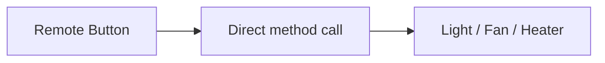
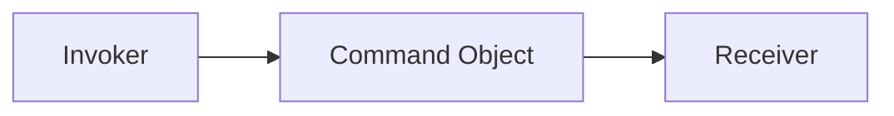
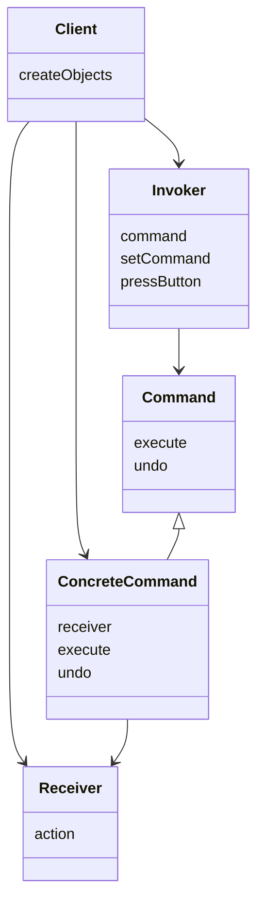
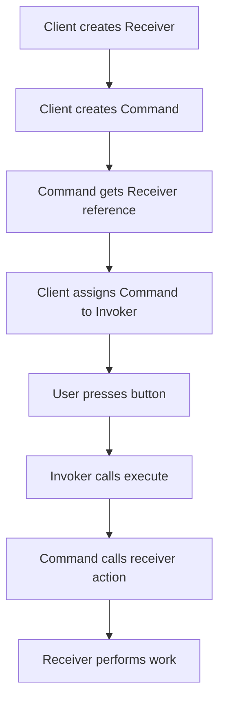
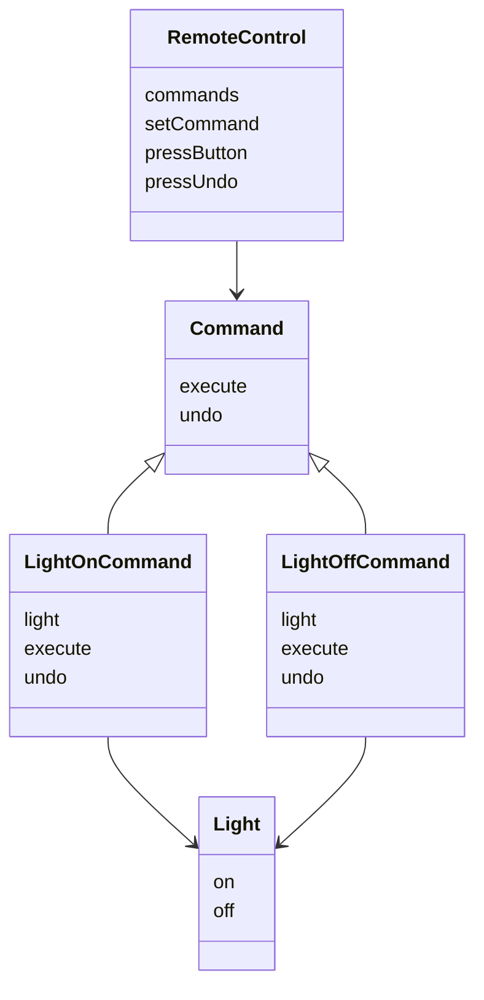
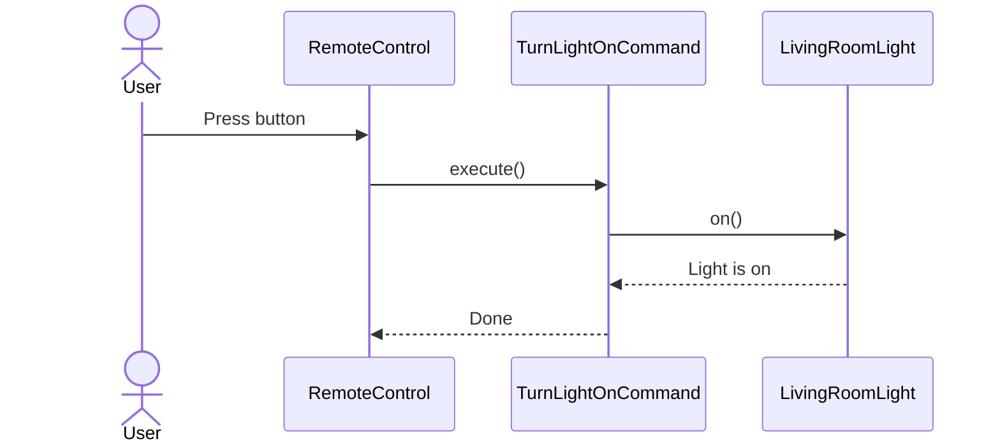
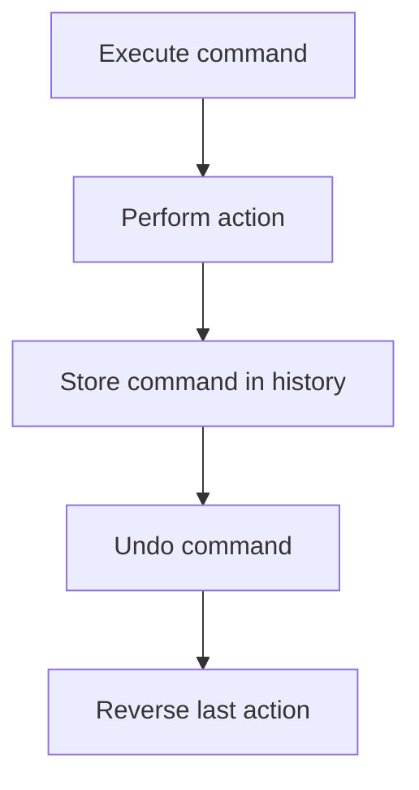
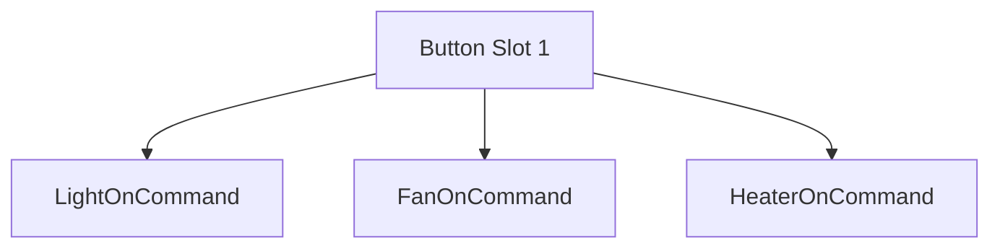
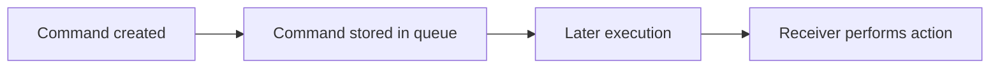
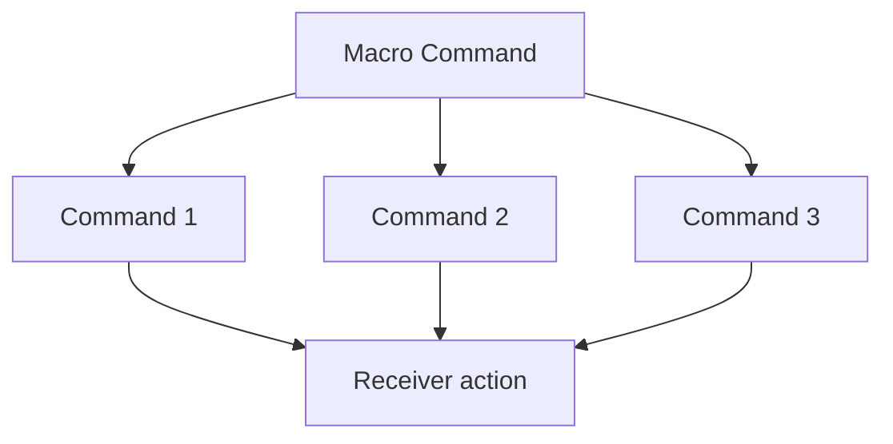

# Command Design Pattern

Imagine a smart home remote control.

When you press a button, the remote should not need to know whether it is turning on a light, starting a fan, or switching on a heater. It should simply trigger an action.

If the remote directly contains hard-coded logic for every device, the design quickly becomes messy:

- too many `if/else` statements
- too many `switch` cases
- tightly coupled classes
- difficult-to-change button mappings
- poor support for undo and task history

The **Command Design Pattern** solves this problem by turning a request into an object.

Instead of directly calling an action, the system wraps the action inside a command object and asks that object to execute the request.

---

# Introduction: The Problem with a "Dumb" Smart Remote

A simple remote may directly control a light like this:

```text
Button press -> light.on()
````

This works for one device, but it becomes rigid when requirements grow.

## Problems with direct control

| Problem                 | Why it hurts                                       |
| ----------------------- | -------------------------------------------------- |
| Hard-coded device logic | Changing the device means changing the remote code |
| Poor scalability        | Every new device requires new conditional logic    |
| Tight coupling          | The remote knows too much about each device        |
| No undo support         | Direct method calls are hard to reverse cleanly    |
| Hard to queue actions   | Requests are not treated as standalone objects     |

The pattern encourages a much better design:



The goal is to replace this with a decoupled structure.

---

# Core Idea

The Command Pattern encapsulates a request as an object.

That means:

* the request itself becomes a class
* the requester does not know the details of the action
* the request can be stored, queued, logged, replayed, or undone



---

# Formal Definition

The Command Pattern encapsulates a request as an object, thereby letting you parameterize clients with different requests, queue or log requests, and support undoable operations.

---

# Why Command Pattern is useful

The pattern is useful when you want to:

* decouple sender from receiver
* treat actions as objects
* support undo/redo
* queue requests
* log or replay requests
* configure behavior dynamically at runtime

---

# Main Roles in the Command Pattern

The pattern has four major participants:

| Role     | Meaning                  | Smart Remote Example |
| -------- | ------------------------ | -------------------- |
| Client   | Sets everything up       | You, the programmer  |
| Invoker  | Triggers the command     | Remote control       |
| Command  | Encapsulates the request | TurnLightOnCommand   |
| Receiver | Performs the real work   | Light bulb           |

---

## UML view of the roles



---

# Understanding the roles

## 1. Client

The client creates:

* the receiver
* the command
* the invoker

Then it wires them together.

The client knows the full setup but does not run the request itself.

---

## 2. Invoker

The invoker stores a command and triggers it when needed.

It does not care what the command does.

This is often a:

* remote control
* button
* menu item
* shortcut handler

---

## 3. Command

The command defines a standard interface for actions.

It usually contains:

* `execute()`
* `undo()` if reversal is needed

A concrete command holds a reference to the receiver.

---

## 4. Receiver

The receiver is the actual object that performs the work.

Examples:

* light
* fan
* text editor
* file system
* database handler

The receiver contains the real business action methods.

---

# Step-by-step flow

Here is how a command flow works in a smart remote:



---

# Real-world example: Smart Home Remote

Suppose we want to control:

* Light
* Fan
* Heater

Each device has its own behavior, but the remote should work uniformly.

Instead of hard-coding:

* `light.on()`
* `fan.start()`
* `heater.heat()`

we create commands for each action.

---

# Command Pattern structure


---

# Why Command Pattern improves design

## Before Command Pattern

The remote knows:

* what device it controls
* what method to call
* how each device works

That creates tight coupling.

## After Command Pattern

The remote knows only:

* how to store a command
* how to call `execute()`
* how to call `undo()`

That creates loose coupling.

---

# Benefits of Command Pattern

| Benefit           | Description                                     |
| ----------------- | ----------------------------------------------- |
| Loose coupling    | Sender and receiver are separated               |
| Dynamic behavior  | Commands can be changed at runtime              |
| Undo/redo support | Commands can reverse actions                    |
| Queuing           | Requests can be stored and processed later      |
| Logging           | Commands can be saved for auditing              |
| Reusability       | Same command can be reused in multiple contexts |

---

# Common use cases

| Use Case           | Example                           |
| ------------------ | --------------------------------- |
| Smart home remote  | Buttons trigger devices           |
| Text editor        | Undo, redo, copy, paste           |
| Keyboard shortcuts | Ctrl+S, Ctrl+Z, Ctrl+B            |
| Task queue         | Deferred jobs, background tasks   |
| Macro recording    | Replaying sequences of operations |
| Menu actions       | Menu items mapped to commands     |

---

# A detailed walkthrough

## 1. Setup

The client creates a receiver.

Example:

* a `LivingRoomLight`

## 2. Encapsulation

The client creates a concrete command and gives it the receiver.

Example:

* `TurnLightOnCommand(light)`

## 3. Assignment

The client gives the command to the invoker.

Example:

* remote button slot 1 gets `TurnLightOnCommand`

## 4. Action

The user presses the button.

## 5. Delegation

The invoker calls `execute()`.

## 6. Execution

The command calls the receiver’s method.

Example:

* `light.on()`

---

# Sequence diagram



---

# Undo feature

One of the strongest features of Command Pattern is undo support.

If `execute()` performs an action, `undo()` reverses it.

---

## Example

* `execute()` turns light on
* `undo()` turns light off

This is very useful in:

* editors
* drawing tools
* games
* automation systems



---

# Toggle behavior

Command Pattern also supports toggling.

For example:

* first press turns light on
* second press turns it off

This can be done using:

* command history
* state tracking
* toggle commands

---

# The Receiver should stay specific

One important design question is:

> Why not use one generic device interface for everything?

A generic interface like `Appliance` with only `on()` and `off()` may look convenient, but it can be too simplistic.

Devices often have different capabilities:

* fan has `setSpeed()`
* AC has `setTemperature()`
* light has `dim()`
* heater has `setMode()`

Forcing all of them into one small interface may violate the Liskov Substitution Principle if the contract becomes unrealistic.

That is why command objects are typically written for specific receivers.

---

# Command interface should stay generic

The `Command` interface should only define:

* how to execute
* how to undo if needed

It should not care what the receiver is.

That is the whole point of the pattern.

---

```cpp
#include <iostream>
#include <vector>
#include <memory>
using namespace std;

class Command {
public:
    virtual void execute() = 0;
    virtual void undo() = 0;
    virtual ~Command() = default;
};

class Light {
public:
    void on() {
        cout << "Light turned ON" << endl;
    }

    void off() {
        cout << "Light turned OFF" << endl;
    }
};

class LightOnCommand : public Command {
private:
    Light* light;

public:
    LightOnCommand(Light* l) : light(l) {}

    void execute() override {
        light->on();
    }

    void undo() override {
        light->off();
    }
};

class LightOffCommand : public Command {
private:
    Light* light;

public:
    LightOffCommand(Light* l) : light(l) {}

    void execute() override {
        light->off();
    }

    void undo() override {
        light->on();
    }
};

class RemoteControl {
private:
    vector<shared_ptr<Command>> commands;
    vector<bool> pushed;

public:
    RemoteControl(int slots) {
        commands.resize(slots);
        pushed.resize(slots, false);
    }

    void setCommand(int index, shared_ptr<Command> command) {
        if (index >= 0 && index < (int)commands.size()) {
            commands[index] = command;
        }
    }

    void pressButton(int index) {
        if (index >= 0 && index < (int)commands.size() && commands[index]) {
            commands[index]->execute();
            pushed[index] = true;
        }
    }

    void pressUndo(int index) {
        if (index >= 0 && index < (int)commands.size() && commands[index]) {
            commands[index]->undo();
            pushed[index] = false;
        }
    }
};

int main() {
    Light livingRoomLight;
    auto lightOn = make_shared<LightOnCommand>(&livingRoomLight);
    auto lightOff = make_shared<LightOffCommand>(&livingRoomLight);

    RemoteControl remote(2);
    remote.setCommand(0, lightOn);
    remote.setCommand(1, lightOff);

    remote.pressButton(0);
    remote.pressUndo(0);
    remote.pressButton(1);

    return 0;
}
```
```java
interface Command {
    void execute();
    void undo();
}

class Light {
    void on() {
        System.out.println("Light turned ON");
    }

    void off() {
        System.out.println("Light turned OFF");
    }
}

class LightOnCommand implements Command {
    private Light light;

    LightOnCommand(Light light) {
        this.light = light;
    }

    public void execute() {
        light.on();
    }

    public void undo() {
        light.off();
    }
}

class LightOffCommand implements Command {
    private Light light;

    LightOffCommand(Light light) {
        this.light = light;
    }

    public void execute() {
        light.off();
    }

    public void undo() {
        light.on();
    }
}

class RemoteControl {
    private Command[] commands;

    RemoteControl(int slots) {
        commands = new Command[slots];
    }

    void setCommand(int index, Command command) {
        commands[index] = command;
    }

    void pressButton(int index) {
        if (commands[index] != null) {
            commands[index].execute();
        }
    }

    void pressUndo(int index) {
        if (commands[index] != null) {
            commands[index].undo();
        }
    }
}

public class Main {
    public static void main(String[] args) {
        Light livingRoomLight = new Light();

        Command lightOn = new LightOnCommand(livingRoomLight);
        Command lightOff = new LightOffCommand(livingRoomLight);

        RemoteControl remote = new RemoteControl(2);
        remote.setCommand(0, lightOn);
        remote.setCommand(1, lightOff);

        remote.pressButton(0);
        remote.pressUndo(0);
        remote.pressButton(1);
    }
}
```
```python
from abc import ABC, abstractmethod

class Command(ABC):
    @abstractmethod
    def execute(self):
        pass

    @abstractmethod
    def undo(self):
        pass

class Light:
    def on(self):
        print("Light turned ON")

    def off(self):
        print("Light turned OFF")

class LightOnCommand(Command):
    def __init__(self, light):
        self.light = light

    def execute(self):
        self.light.on()

    def undo(self):
        self.light.off()

class LightOffCommand(Command):
    def __init__(self, light):
        self.light = light

    def execute(self):
        self.light.off()

    def undo(self):
        self.light.on()

class RemoteControl:
    def __init__(self, slots):
        self.commands = [None] * slots

    def set_command(self, index, command):
        self.commands[index] = command

    def press_button(self, index):
        if self.commands[index] is not None:
            self.commands[index].execute()

    def press_undo(self, index):
        if self.commands[index] is not None:
            self.commands[index].undo()

living_room_light = Light()

light_on = LightOnCommand(living_room_light)
light_off = LightOffCommand(living_room_light)

remote = RemoteControl(2)
remote.set_command(0, light_on)
remote.set_command(1, light_off)

remote.press_button(0)
remote.press_undo(0)
remote.press_button(1)
```

---

# Button mapping with dynamic reconfiguration

A big advantage of Command Pattern is that buttons can be remapped at runtime.



You do not change the remote class.

You only change the command assigned to a button.

---

# Example: swapping a device at runtime

Suppose button 1 controls a light today.

Tomorrow, the same button controls a fan.

The remote stays the same.
Only the assigned command changes.

That is flexibility without modification.

---

# Command Pattern and OCP

Command Pattern strongly supports the Open/Closed Principle.

* open for extension: add new commands
* closed for modification: existing invoker code stays unchanged

For example:

* add `FanOnCommand`
* add `HeaterOnCommand`
* add `DoorLockCommand`

No need to rewrite the remote.

---

# Command Pattern and SRP

The pattern also improves Single Responsibility.

| Class    | Responsibility            |
| -------- | ------------------------- |
| Invoker  | Triggers commands         |
| Command  | Encapsulates request      |
| Receiver | Performs actual work      |
| Client   | Wires everything together |

Each class has one clear role.

---

# Command Pattern and queues

Command objects can be stored and executed later.

This makes them useful for:

* job queues
* batch processing
* macro execution
* background task scheduling



---

# Command Pattern and logging

Since a command is an object, it can be:

* logged
* serialized
* replayed
* audited

That is useful in:

* transaction systems
* editors
* workflow engines

---

# Command Pattern and macros

A macro is a sequence of commands executed in order.

Example:

* bold text
* italicize text
* save file
* export document

Instead of hard-coding the sequence, you can store multiple command objects and execute them one by one.

---

# Macro diagram



---

# Benefits of Command Pattern

| Benefit         | Description                                 |
| --------------- | ------------------------------------------- |
| Decoupling      | Sender and receiver are separated           |
| Flexibility     | Commands can be swapped at runtime          |
| Undo support    | Actions can be reversed                     |
| Queue support   | Commands can be stored and executed later   |
| Logging support | Requests can be tracked                     |
| Cleaner code    | Fewer conditionals and less direct coupling |

---

# Drawbacks of Command Pattern

| Drawback         | Description                               |
| ---------------- | ----------------------------------------- |
| More classes     | Each command usually needs its own class  |
| More abstraction | Design can feel heavier for tiny problems |
| Extra wiring     | Objects must be connected properly        |

---

# Common mistakes

| Mistake                               | Problem                       |
| ------------------------------------- | ----------------------------- |
| Putting business logic in the invoker | Breaks separation of concerns |
| Making the command too generic        | Loses clarity                 |
| Forgetting undo state                 | Undo becomes incorrect        |
| Overusing the pattern for simple code | Unnecessary complexity        |
| Making receiver too broad             | Reduces design quality        |

---

# When to use Command Pattern

Use it when:

* you want to decouple request sender and receiver
* you want to support undo or redo
* you want to queue actions
* you want configurable buttons or menu actions
* you want to log and replay operations
* you have multiple operations that should be treated uniformly

---

# When not to use it

Avoid it when:

* the action is extremely simple
* there is no need for undo/queue/history
* the extra abstraction would be unnecessary

---

# Command Pattern vs Strategy Pattern

These two patterns are often confused.

| Pattern  | Main purpose               | Key focus            |
| -------- | -------------------------- | -------------------- |
| Command  | Turn requests into objects | Request execution    |
| Strategy | Encapsulate algorithms     | Behavioral variation |

### Simple distinction

* Command = “do this action”
* Strategy = “which algorithm should I use?”

---

# Command Pattern vs Observer Pattern

| Pattern  | Purpose                                |
| -------- | -------------------------------------- |
| Command  | Encapsulate an action request          |
| Observer | Notify many objects when state changes |

They solve different problems, even though both may involve decoupling.

---

# Real-world examples

| Domain       | Example                                 |
| ------------ | --------------------------------------- |
| Smart home   | Remote button mapped to device commands |
| GUI          | Button click handlers                   |
| Text editors | Undo/redo actions                       |
| Game engines | Player actions stored as commands       |
| Automation   | Task queues and macros                  |
| OS shortcuts | Key combinations mapped to actions      |

---

# Summary

The Command Pattern turns a request into an object.

That simple idea gives us:

* decoupling
* flexibility
* undo support
* queue support
* logging support
* runtime reconfiguration

The pattern separates:

* the **invoker** that triggers the action
* the **command** that stores the request
* the **receiver** that performs the work

---

# Final takeaway

The Command Pattern is about this idea:

> Do not let the button know the device details.
> Let the button trigger a command object instead.

That makes systems easier to:

* extend
* maintain
* undo
* queue
* reconfigure

It is one of the most practical design patterns for real-world software.