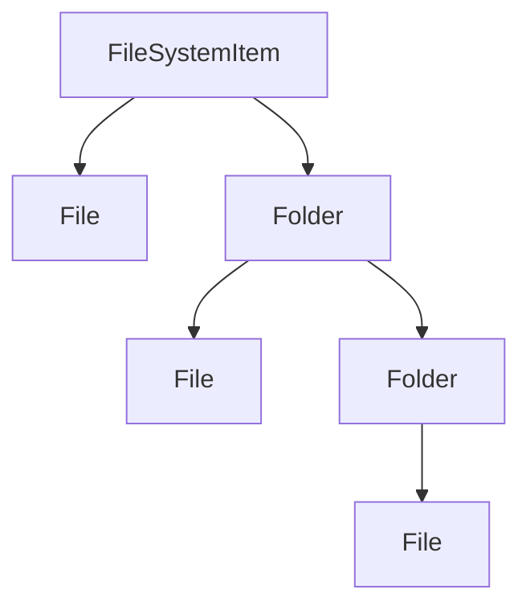
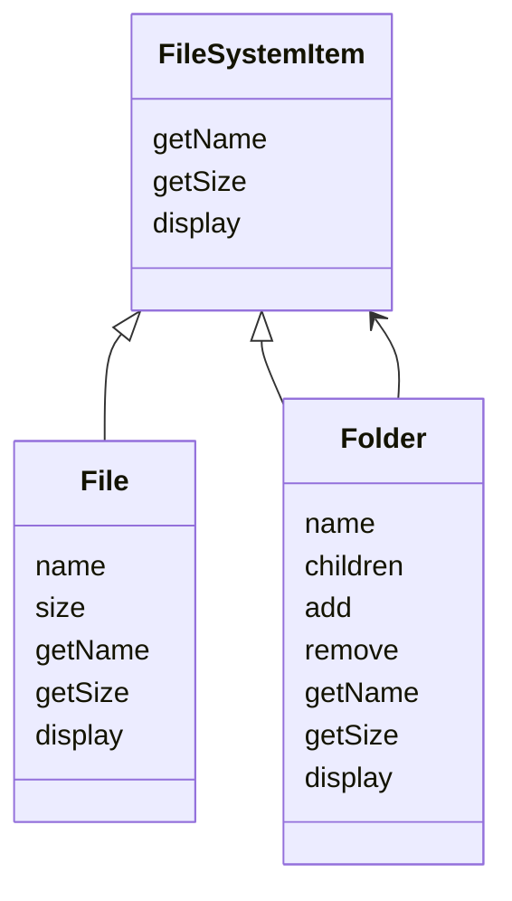
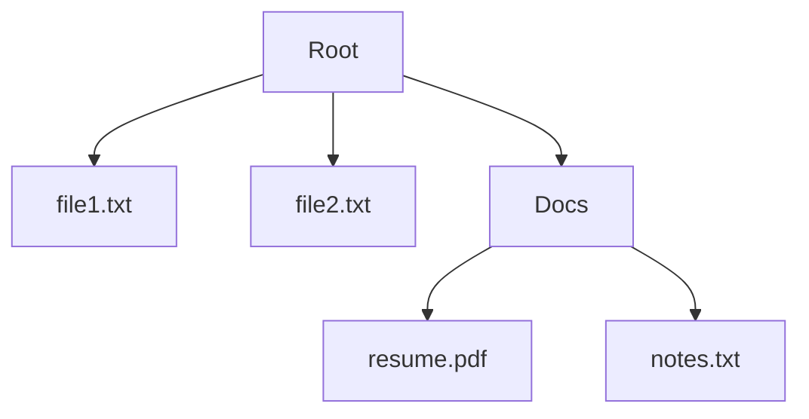
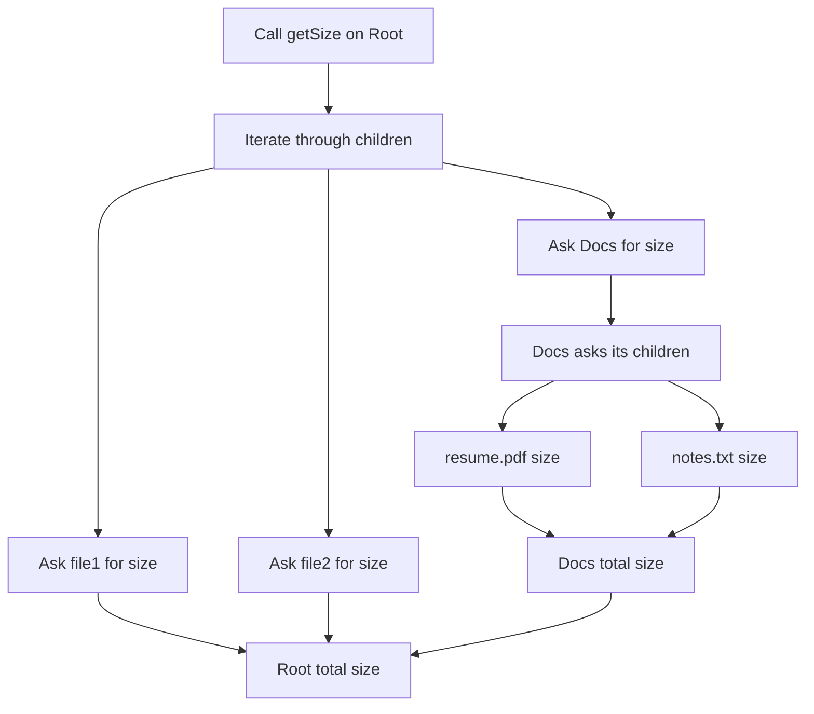
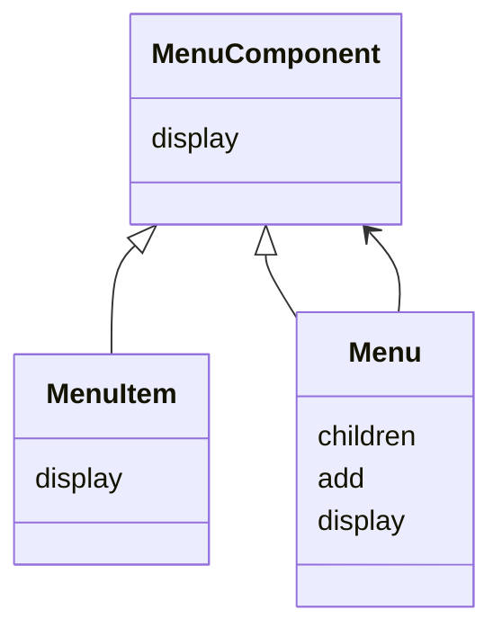
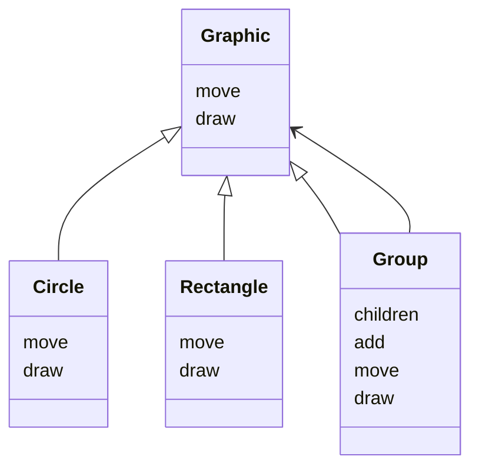

# Composite Design Pattern

The **Composite Design Pattern** is a structural design pattern that lets you compose objects into tree structures and then work with those structures in a uniform way.

It is especially useful when your system naturally contains:

- **individual objects**
- **groups of objects**
- **groups inside groups**
- **operations that should work on both the individual object and the group**

The key idea is simple:

> Treat a single object and a collection of objects in the same way.

---

# Introduction: A Familiar Problem in Your Computer

Think about your computer’s file system.

At the highest level, the file system contains two kinds of items:

- **Files** such as `notes.txt` or `photo.jpg`
- **Folders** that can contain files and even other folders

This creates a tree-like structure.

Now imagine you want to do something like:

- calculate the total size of a folder
- display everything inside a directory
- move a whole directory somewhere else
- delete an entire folder tree

This immediately raises a question:

> How do we perform the same operation on both files and folders in a clean and consistent way?

That is exactly the problem Composite solves.

---

# The Challenge: Treating Files and Folders Differently

If files and folders are treated as completely separate types, the client code becomes messy.

For example, a function that calculates size might need to ask:

- Is this a file?
- Is this a folder?
- If it is a folder, what is inside it?
- If it is a file, what is its size?

That usually leads to `if/else` or `switch` statements everywhere.

---

## Why this is a problem

| Problem | Why it hurts |
|--------|--------------|
| Client complexity | The caller must know the type of every object |
| Repeated type checks | Code becomes full of `if object is file else folder` logic |
| Hard to extend | Adding a new item type requires editing many places |
| Breaks uniformity | Files and folders are no longer treated the same way |
| Poor maintainability | Logic gets scattered and fragile |

---

## Example of the messy approach

```text
if item is File:
    size = item.size
else if item is Folder:
    size = sum(child.size for child in item.children)
````

This becomes harder as the system grows.

---

# The Solution: Composite Pattern

The Composite Pattern solves this by creating a common abstraction for both:

* single objects
* groups of objects

It builds a **part-whole hierarchy**.

This means:

* a file is a part
* a folder is a whole made of parts
* a folder can also be treated like a part itself because it implements the same interface



---

# Formal Definition

The Composite pattern composes objects into tree structures to represent part-whole hierarchies.

It allows clients to treat individual objects and compositions of objects uniformly.

---

# Core Idea

The most important idea in Composite is this:

> Both the leaf and the composite implement the same interface.

So from the client’s perspective:

* a file and a folder are both `FileSystemItem`
* the client does not need to know which one it is dealing with
* the object itself handles its own behavior

---

# Participants in the Composite Pattern

There are three main roles:

| Role      | Meaning                            | File System Example |
| --------- | ---------------------------------- | ------------------- |
| Component | Common interface for all items     | `FileSystemItem`    |
| Leaf      | Individual object with no children | `File`              |
| Composite | Object that contains children      | `Folder`            |

---

## UML structure



---

# The Component: Common Blueprint

The **Component** is the shared interface or abstract class.

It defines the operations that both files and folders must support.

Typical methods include:

* `getName()`
* `getSize()`
* `display()`

---

## Why the component matters

The component gives the client one common language to speak to all items.

This is what makes uniformity possible.

---

# The Leaf: Individual Item

A **Leaf** is a basic object that has no children.

In the file system example:

* a file is a leaf
* it cannot contain other files or folders

A leaf performs the operation directly.

For example:

* `getSize()` simply returns its own size
* `display()` prints its own name

---

# The Composite: Container Item

A **Composite** is an object that can contain other components.

In the file system example:

* a folder is a composite
* it can hold files
* it can also hold other folders

This is what creates the tree structure.

A composite:

* implements the same interface as a leaf
* stores children in a collection
* delegates work to those children when needed

---

# Why the pattern works so well

Composite works because of polymorphism.

A client can call the same method on any `FileSystemItem`.

That method may behave differently depending on whether the object is:

* a leaf
* a composite

But the client does not care.

---

# File System Example

Suppose we have this structure:

* `Root`

  * `file1.txt`
  * `file2.txt`
  * `Docs`

    * `resume.pdf`
    * `notes.txt`

The client should be able to call `getSize()` on `Root` and receive the total size without manually checking every item.

---

## Tree diagram



---

# How `getSize()` works recursively

When `getSize()` is called on a folder:

1. it visits each child
2. it asks each child for its size
3. if a child is a file, it returns its own size
4. if a child is a folder, it again asks its children
5. the sizes are summed recursively

This recursive behavior is one of the strongest features of Composite.

---

## Step-by-step flow



---

# Why recursion fits Composite perfectly

Composite naturally represents tree structures, and tree structures are recursive by nature.

A folder can contain folders, and those folders can contain more folders.

So the same operation can be applied repeatedly down the tree.

That is why Composite and recursion work so well together.

---

# Another important idea: uniform treatment

The client does not need to distinguish between file and folder.

It simply calls:

* `getSize()`
* `display()`
* `getName()`

on any `FileSystemItem`.

That is the power of uniformity.

---

# Client simplicity

Without Composite:

* the client must know the internal structure
* the client must handle each type separately
* the client must manage recursive traversal itself

With Composite:

* the object structure handles itself
* the client uses one interface
* the client code becomes much shorter and cleaner

---

```cpp
#include <iostream>
#include <vector>
#include <memory>
using namespace std;

class FileSystemItem {
public:
    virtual string getName() = 0;
    virtual int getSize() = 0;
    virtual void display(int indent = 0) = 0;
    virtual ~FileSystemItem() = default;
};

class File : public FileSystemItem {
private:
    string name;
    int size;

public:
    File(string name, int size) : name(name), size(size) {}

    string getName() override {
        return name;
    }

    int getSize() override {
        return size;
    }

    void display(int indent = 0) override {
        for (int i = 0; i < indent; i++) cout << "  ";
        cout << "- " << name << " (" << size << " KB)" << endl;
    }
};

class Folder : public FileSystemItem {
private:
    string name;
    vector<shared_ptr<FileSystemItem>> children;

public:
    Folder(string name) : name(name) {}

    string getName() override {
        return name;
    }

    void add(shared_ptr<FileSystemItem> item) {
        children.push_back(item);
    }

    void remove(string itemName) {
        children.erase(
            remove_if(children.begin(), children.end(),
                [&](shared_ptr<FileSystemItem> item) {
                    return item->getName() == itemName;
                }),
            children.end()
        );
    }

    int getSize() override {
        int total = 0;
        for (auto& child : children) {
            total += child->getSize();
        }
        return total;
    }

    void display(int indent = 0) override {
        for (int i = 0; i < indent; i++) cout << "  ";
        cout << "+ " << name << " [" << getSize() << " KB]" << endl;

        for (auto& child : children) {
            child->display(indent + 1);
        }
    }
};

int main() {
    auto root = make_shared<Folder>("Root");
    auto docs = make_shared<Folder>("Docs");

    root->add(make_shared<File>("file1.txt", 1));
    root->add(make_shared<File>("file2.txt", 1));

    docs->add(make_shared<File>("resume.pdf", 1));
    docs->add(make_shared<File>("notes.txt", 1));

    root->add(docs);

    root->display();
    cout << "Total size: " << root->getSize() << " KB" << endl;

    return 0;
}
```
```java
import java.util.ArrayList;
import java.util.Iterator;
import java.util.List;

interface FileSystemItem {
    String getName();
    int getSize();
    void display(int indent);
}

class File implements FileSystemItem {
    private String name;
    private int size;

    File(String name, int size) {
        this.name = name;
        this.size = size;
    }

    public String getName() {
        return name;
    }

    public int getSize() {
        return size;
    }

    public void display(int indent) {
        for (int i = 0; i < indent; i++) System.out.print("  ");
        System.out.println("- " + name + " (" + size + " KB)");
    }
}

class Folder implements FileSystemItem {
    private String name;
    private List<FileSystemItem> children = new ArrayList<>();

    Folder(String name) {
        this.name = name;
    }

    public String getName() {
        return name;
    }

    public void add(FileSystemItem item) {
        children.add(item);
    }

    public void remove(String itemName) {
        Iterator<FileSystemItem> iterator = children.iterator();
        while (iterator.hasNext()) {
            FileSystemItem item = iterator.next();
            if (item.getName().equals(itemName)) {
                iterator.remove();
            }
        }
    }

    public int getSize() {
        int total = 0;
        for (FileSystemItem child : children) {
            total += child.getSize();
        }
        return total;
    }

    public void display(int indent) {
        for (int i = 0; i < indent; i++) System.out.print("  ");
        System.out.println("+ " + name + " [" + getSize() + " KB]");

        for (FileSystemItem child : children) {
            child.display(indent + 1);
        }
    }
}

public class Main {
    public static void main(String[] args) {
        Folder root = new Folder("Root");
        Folder docs = new Folder("Docs");

        root.add(new File("file1.txt", 1));
        root.add(new File("file2.txt", 1));

        docs.add(new File("resume.pdf", 1));
        docs.add(new File("notes.txt", 1));

        root.add(docs);

        root.display(0);
        System.out.println("Total size: " + root.getSize() + " KB");
    }
}
```
```python
from abc import ABC, abstractmethod

class FileSystemItem(ABC):
    @abstractmethod
    def get_name(self):
        pass

    @abstractmethod
    def get_size(self):
        pass

    @abstractmethod
    def display(self, indent=0):
        pass

class File(FileSystemItem):
    def __init__(self, name, size):
        self.name = name
        self.size = size

    def get_name(self):
        return self.name

    def get_size(self):
        return self.size

    def display(self, indent=0):
        print("  " * indent + f"- {self.name} ({self.size} KB)")

class Folder(FileSystemItem):
    def __init__(self, name):
        self.name = name
        self.children = []

    def get_name(self):
        return self.name

    def add(self, item):
        self.children.append(item)

    def remove(self, item_name):
        self.children = [child for child in self.children if child.get_name() != item_name]

    def get_size(self):
        return sum(child.get_size() for child in self.children)

    def display(self, indent=0):
        print("  " * indent + f"+ {self.name} [{self.get_size()} KB]")
        for child in self.children:
            child.display(indent + 1)

root = Folder("Root")
docs = Folder("Docs")

root.add(File("file1.txt", 1))
root.add(File("file2.txt", 1))

docs.add(File("resume.pdf", 1))
docs.add(File("notes.txt", 1))

root.add(docs)

root.display()
print("Total size:", root.get_size(), "KB")
```

---

## C++ explanation

* `FileSystemItem` is the component
* `File` is the leaf
* `Folder` is the composite
* `Folder` stores a list of `FileSystemItem`
* `Folder` can contain both `File` and `Folder`
* `display()` is recursive

---

## Java explanation

* the interface ensures uniform behavior
* `File` and `Folder` both implement `FileSystemItem`
* `Folder` stores `List<FileSystemItem>`
* recursive size calculation becomes simple

---

## Python explanation

* `FileSystemItem` is the abstract component
* `File` is the leaf
* `Folder` is the composite
* `Folder` contains children of the same abstract type
* the same methods work on both leaves and composites

---

# Why Composite solves the problem

Composite removes the need for repeated type checking.

Instead of writing:

* `if this is file`
* `else if this is folder`

you simply call the same method on every object.

Each object knows how to handle itself.

---

# Uniform operations

Typical operations in Composite include:

| Operation   | On Leaf          | On Composite              |
| ----------- | ---------------- | ------------------------- |
| `getName()` | Returns own name | Returns own name          |
| `getSize()` | Returns own size | Sums child sizes          |
| `display()` | Shows itself     | Shows itself and children |
| `move()`    | Moves item       | Moves all children        |
| `delete()`  | Deletes item     | Deletes entire subtree    |

---

# How this supports extension

If you want to add a new item type such as:

* shortcut
* archived folder
* cloud sync folder
* compressed file

you just implement the same component interface.

The rest of the system stays unchanged.

That is a major benefit of Composite.

---

# Real-world examples of Composite

## 1. File systems

Files and folders form a tree.

## 2. Menus

A menu item can be:

* a simple action
* a submenu containing more items

## 3. Graphics editors

A shape can be:

* a simple shape
* a group of shapes

## 4. Organization charts

An employee may report to a manager, and a manager may have other employees under them.

## 5. UI components

A panel can contain buttons, text boxes, and other panels.

---

# Example: Menu system



A menu item is a leaf.
A submenu is a composite.

---

# Example: Graphic shapes



A single circle is a leaf.
A group of shapes is a composite.

---

# Composite and recursion

Composite is one of the cleanest examples of recursion in design.

A composite object:

* performs the operation on itself
* then delegates the same operation to its children

This pattern continues until leaves are reached.

---

# Composite vs Decorator

These two patterns can look similar because both may have:

* a common interface
* recursive structure
* objects wrapping or containing objects

But they solve different problems.

| Pattern   | Main purpose                     |
| --------- | -------------------------------- |
| Composite | Treat part and whole uniformly   |
| Decorator | Add responsibilities dynamically |

---

## Simple distinction

### Composite

Used to organize tree structures.

### Decorator

Used to enhance an object with extra behavior.

---

# Benefits of Composite Pattern

| Benefit            | Description                            |
| ------------------ | -------------------------------------- |
| Uniformity         | Same interface for files and folders   |
| Simplicity         | Client code becomes cleaner            |
| Extensibility      | New node types can be added easily     |
| Recursive power    | Perfect for tree structures            |
| Reusability        | Shared operations work across the tree |
| Less type checking | No need for scattered `if/else` logic  |

---

# Drawbacks of Composite Pattern

| Drawback                | Description                                      |
| ----------------------- | ------------------------------------------------ |
| Too much generality     | Can make leaf and composite look overly similar  |
| Harder to enforce rules | Some operations may not make sense for all nodes |
| Recursive complexity    | Large trees may require careful handling         |
| Can be overused         | Not every hierarchy needs Composite              |

---

# Common mistakes

| Mistake                                          | Problem                       |
| ------------------------------------------------ | ----------------------------- |
| Making leaf and composite behave too differently | Breaks uniformity             |
| Forgetting recursive traversal                   | Composite loses its power     |
| Using separate interfaces for leaf and composite | Client loses simplicity       |
| Overcomplicating child management                | Tree becomes difficult to use |
| Using Composite where a simple list is enough    | Adds unnecessary complexity   |

---

# When to use Composite Pattern

Use Composite when:

* the structure is tree-like
* objects can contain other objects of the same type
* client should not care whether it is handling a single object or a group
* you want recursive behavior
* you want to treat parts and wholes uniformly

---

# When not to use Composite Pattern

Avoid Composite when:

* the structure is not hierarchical
* the client never needs to treat single and grouped objects the same
* the problem is simple enough that a tree is unnecessary
* recursion would only add complexity

---

# Summary

The Composite Pattern allows you to build tree structures and work with individual objects and groups in the same way.

It is built around:

* a common component interface
* leaf nodes for individual items
* composite nodes for collections
* recursive operations

It is ideal for:

* file systems
* menus
* graphics
* organization trees
* nested UI structures

---

# Final takeaway

The Composite Pattern solves a simple but powerful problem:

> Let the client treat a single item and a collection of items the same way.

That removes type checking, simplifies client code, and makes tree-based systems elegant and scalable.

It is one of the most useful patterns whenever your domain naturally forms a part-whole hierarchy.