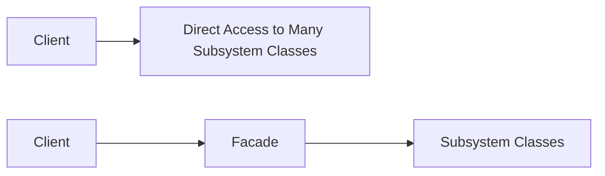
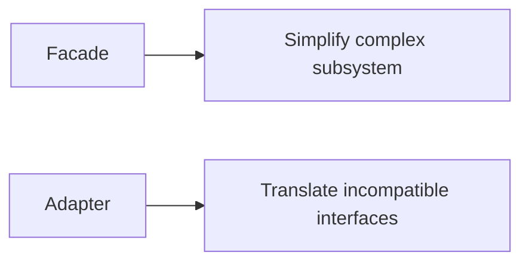
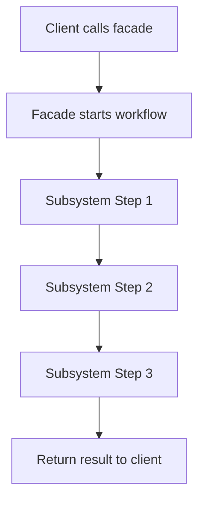
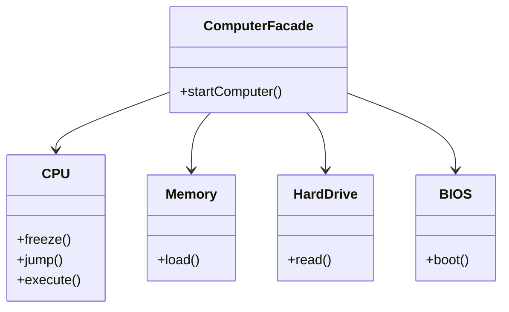
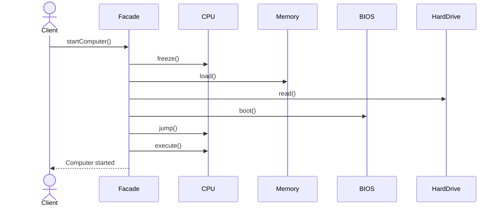
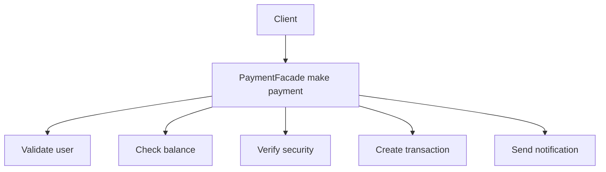

# Facade Design Pattern

In software development, we often build large systems made of many small classes and components.

A client that wants to do something simple may need to interact with:
- multiple objects
- in a specific order
- with several dependencies
- while understanding internal subsystem details

This creates complexity.

The **Facade Design Pattern** solves this by providing a **simple, unified interface** to a complex subsystem.

It acts like a **front door** to the system.

---

# Introduction: Taming the Chaos

Imagine opening a computer.

You press one button, and the machine starts.

From your perspective, the process is simple. But inside the computer, many things happen:
- power supply turns on
- CPU initializes
- memory is checked
- hard drive spins up
- BIOS starts
- operating system loads

You do not need to know every step to start the machine.

That single button is a great real-world example of a **Facade**.

```mermaid
flowchart TD
    A[User Presses Power Button] --> B[Power Supply]
    B --> C[CPU Initialization]
    B --> D[Memory Check]
    B --> E[Hard Drive Spin Up]
    B --> F[BIOS Boot]
    F --> G[Operating System Loads]
````

---

# What is Facade Pattern?

The Facade pattern provides a simplified, unified interface to a set of interfaces in a complex subsystem.

It does not remove the subsystem.
It hides the subsystem’s complexity behind a simpler API.

---

## Core idea

* the subsystem remains complex internally
* the facade gives the client a simple way to use it
* the client interacts with the facade instead of each subsystem class directly

---

# Why Facade is useful

The Facade pattern helps when a system becomes too difficult to use directly.

It provides:

* simpler APIs
* less coupling
* better readability
* easier maintenance
* cleaner integration points

---

# Main participants in Facade Pattern

| Role      | Meaning                     | Example                      |
| --------- | --------------------------- | ---------------------------- |
| Client    | The user of the system      | App code                     |
| Facade    | Simplified entry point      | `ComputerFacade`             |
| Subsystem | Complex internal components | CPU, Memory, BIOS, HardDrive |

---

## Facade structure

```mermaid
classDiagram
    class Client {
        +start()
    }

    class Facade {
        +startComputer()
    }

    class CPU {
        +freeze()
        +jump()
        +execute()
    }

    class Memory {
        +load()
    }

    class HardDrive {
        +read()
    }

    class BIOS {
        +boot()
    }

    Client --> Facade
    Facade --> CPU
    Facade --> Memory
    Facade --> HardDrive
    Facade --> BIOS
```

---

# Problem Facade solves

Without a facade, client code often has to:

* instantiate many subsystem objects
* call methods in the right order
* know internal dependencies
* repeat setup logic across the application

That leads to:

* messy code
* fragile usage
* duplication
* poor maintainability

---

# With Facade

The client talks to one simple object.

The facade internally orchestrates the subsystem.



---

# Formal definition

The Facade pattern provides a simplified interface to a complex subsystem.

It hides internal complexity and exposes only what is necessary to the client.

---

# Real-world analogy: Starting a computer

The power button hides a lot of internal complexity.

You do not:

* start the CPU manually
* load memory manually
* boot BIOS manually
* mount the hard drive manually

You just press a button.

That is exactly what a facade does.

---

# Another real-world example: Payment gateway

A payment flow may involve:

* balance verification
* PIN validation
* fraud detection
* transaction logging
* notification sending

Instead of exposing all of that to the client, a single method like `makePayment()` can act as the facade.

---

# Example use cases

| Domain           | Facade example     |
| ---------------- | ------------------ |
| Computer startup | Power button       |
| Gaming engine    | `startGame()`      |
| Payment system   | `makePayment()`    |
| Home automation  | `startMovieMode()` |
| Video processing | `convertToMp4()`   |
| E-commerce       | `placeOrder()`     |

---

# Key benefits of Facade Pattern

## 1. Hides complexity

The client does not need to know the details of the subsystem.

## 2. Decouples client from subsystem

The client only talks to the facade.

## 3. Reduces dependency spread

Internal classes can change without affecting the client, as long as the facade API remains stable.

## 4. Improves readability

Client code becomes much shorter and easier to understand.

## 5. Promotes good design

The facade supports the Principle of Least Knowledge.

---

# Principle of Least Knowledge

The Facade pattern strongly supports the **Principle of Least Knowledge**, also known as the **Law of Demeter**.

This principle says:

> An object should know as little as possible about other objects.

It should interact only with:

* itself
* its own fields
* objects passed as parameters
* objects it creates

---

## Why this matters

If objects know too much about each other:

* the system becomes tightly coupled
* small changes ripple across the application
* testing becomes harder
* debugging becomes harder

---

## Example of poor design

```text id="facade_bad_01"
client -> cpu -> memory -> bios -> hardDrive
```

The client is forced to know all internals.

---

## Example of good design

```text id="facade_good_01"
client -> facade -> subsystem
```

The client only knows the facade.

---

# Facade vs Adapter

These two patterns are often confused because both use an intermediary layer.

But their intent is different.

| Pattern | Intent                                     |
| ------- | ------------------------------------------ |
| Facade  | Simplify access to a complex subsystem     |
| Adapter | Make incompatible interfaces work together |

---

## Simple difference

### Facade

You already have compatible classes, but the system is too complex.

### Adapter

You have incompatible interfaces that do not match.

---

## Comparison diagram



---

## Facade vs Adapter table

| Aspect       | Facade                     | Adapter                         |
| ------------ | -------------------------- | ------------------------------- |
| Purpose      | Hide complexity            | Convert interface               |
| Main concern | Usability                  | Compatibility                   |
| Client sees  | Simple API                 | Expected API                    |
| Subsystem    | Complex and existing       | Incompatible and existing       |
| Typical use  | Orchestrating many classes | Bridging two mismatched classes |

---

# Facade design structure

A facade usually:

* creates subsystem objects
* calls them in the correct order
* exposes a few simple methods
* hides internal workflow from the client



---

# Real-world example: Computer startup

Suppose we have:

* `CPU`
* `Memory`
* `HardDrive`
* `BIOS`

The client should not interact with them directly.

Instead, it should call:

* `startComputer()`

---

## Facade diagram for computer startup



---

```cpp
#include <iostream>
using namespace std;

class CPU {
public:
    void freeze() {
        cout << "CPU: freeze" << endl;
    }

    void jump() {
        cout << "CPU: jump to boot location" << endl;
    }

    void execute() {
        cout << "CPU: execute instructions" << endl;
    }
};

class Memory {
public:
    void load() {
        cout << "Memory: load boot data" << endl;
    }
};

class HardDrive {
public:
    void read() {
        cout << "HardDrive: read boot sector" << endl;
    }
};

class BIOS {
public:
    void boot() {
        cout << "BIOS: booting system" << endl;
    }
};

class ComputerFacade {
private:
    CPU cpu;
    Memory memory;
    HardDrive hardDrive;
    BIOS bios;

public:
    void startComputer() {
        cpu.freeze();
        memory.load();
        hardDrive.read();
        bios.boot();
        cpu.jump();
        cpu.execute();
        cout << "Computer started successfully" << endl;
    }
};

int main() {
    ComputerFacade computer;
    computer.startComputer();
    return 0;
}
```
```java
class CPU {
    void freeze() {
        System.out.println("CPU: freeze");
    }

    void jump() {
        System.out.println("CPU: jump to boot location");
    }

    void execute() {
        System.out.println("CPU: execute instructions");
    }
}

class Memory {
    void load() {
        System.out.println("Memory: load boot data");
    }
}

class HardDrive {
    void read() {
        System.out.println("HardDrive: read boot sector");
    }
}

class BIOS {
    void boot() {
        System.out.println("BIOS: booting system");
    }
}

class ComputerFacade {
    private CPU cpu;
    private Memory memory;
    private HardDrive hardDrive;
    private BIOS bios;

    ComputerFacade() {
        this.cpu = new CPU();
        this.memory = new Memory();
        this.hardDrive = new HardDrive();
        this.bios = new BIOS();
    }

    void startComputer() {
        cpu.freeze();
        memory.load();
        hardDrive.read();
        bios.boot();
        cpu.jump();
        cpu.execute();
        System.out.println("Computer started successfully");
    }
}

public class Main {
    public static void main(String[] args) {
        ComputerFacade computer = new ComputerFacade();
        computer.startComputer();
    }
}
```
```python
class CPU:
    def freeze(self):
        print("CPU: freeze")

    def jump(self):
        print("CPU: jump to boot location")

    def execute(self):
        print("CPU: execute instructions")

class Memory:
    def load(self):
        print("Memory: load boot data")

class HardDrive:
    def read(self):
        print("HardDrive: read boot sector")

class BIOS:
    def boot(self):
        print("BIOS: booting system")

class ComputerFacade:
    def __init__(self):
        self.cpu = CPU()
        self.memory = Memory()
        self.hard_drive = HardDrive()
        self.bios = BIOS()

    def start_computer(self):
        self.cpu.freeze()
        self.memory.load()
        self.hard_drive.read()
        self.bios.boot()
        self.cpu.jump()
        self.cpu.execute()
        print("Computer started successfully")

computer = ComputerFacade()
computer.start_computer()
```

---

## C++ explanation

* `CPU`, `Memory`, `HardDrive`, and `BIOS` are subsystem classes
* `ComputerFacade` is the simplified interface
* the client only calls `startComputer()`
* internal order and dependencies are hidden inside the facade

---

## Java explanation

* the facade owns the workflow
* subsystem classes remain hidden from the client
* the client gets a single entry point
* this reduces complexity in the calling code

---

## Python explanation

* the client uses `ComputerFacade`
* the facade manages the subsystem objects
* the startup sequence is hidden from the caller
* the client only sees one simple method

---

# Facade in sequence form



---

# Another real-world example: Payment facade

A payment system may need to do many things:

* validate user
* check balance
* verify security
* create transaction
* send notification

Instead of exposing all those details to the client, we can wrap them in a facade method like `makePayment()`.



---

# Facade pattern structure summary

| Component         | Responsibility    |
| ----------------- | ----------------- |
| Client            | Uses the facade   |
| Facade            | Simplifies access |
| Subsystem classes | Do the real work  |

---

# Why Facade is not Adapter

| Question                     | Facade                  | Adapter                       |
| ---------------------------- | ----------------------- | ----------------------------- |
| Why does it exist?           | To simplify a subsystem | To make interfaces compatible |
| Does it translate interface? | Not necessarily         | Yes                           |
| Does it hide many classes?   | Yes                     | Sometimes                     |
| Main goal                    | Ease of use             | Compatibility                 |

---

# Why Facade is not Proxy

| Question        | Facade          | Proxy                    |
| --------------- | --------------- | ------------------------ |
| Purpose         | Simplify access | Control access           |
| Client talks to | A simple front  | A stand-in object        |
| Main idea       | Hide complexity | Add control / protection |

---

# Why Facade is not Decorator

| Question  | Facade             | Decorator             |
| --------- | ------------------ | --------------------- |
| Purpose   | Simplify           | Add behavior          |
| Structure | Single entry point | Wrapper chain         |
| Goal      | Reduce complexity  | Enhance functionality |

---

# Benefits of Facade Pattern

| Benefit            | Description                               |
| ------------------ | ----------------------------------------- |
| Simplicity         | One easy-to-use interface                 |
| Encapsulation      | Hides subsystem complexity                |
| Lower coupling     | Client depends on facade only             |
| Maintainability    | Internal subsystem can change more safely |
| Better readability | Client code becomes shorter               |
| Reusability        | Facade can be reused across clients       |

---

# Drawbacks of Facade Pattern

| Drawback                   | Description                             |
| -------------------------- | --------------------------------------- |
| Extra layer                | Adds one more abstraction               |
| Risk of oversimplification | Too much hiding may reduce flexibility  |
| Facade can grow too large  | A “god facade” becomes hard to maintain |

---

# Common mistakes

| Mistake                                        | Problem                          |
| ---------------------------------------------- | -------------------------------- |
| Putting too much logic into the facade         | Facade becomes a bloated class   |
| Letting the client bypass the facade too often | Reduces the value of the pattern |
| Confusing facade with adapter                  | Solves the wrong problem         |
| Hiding too much detail                         | Can make debugging harder        |
| Using facade when no complexity exists         | Adds unnecessary abstraction     |

---

# When to use Facade Pattern

Use it when:

* a subsystem is complex
* you want a single entry point
* you want to simplify client usage
* you want to reduce coupling
* you want to expose a small, stable API
* you want to organize complicated workflows

---

# When not to use Facade Pattern

Avoid it when:

* the system is already simple
* the client already has an easy API
* the facade would just duplicate methods without value
* there is no real complexity to hide

---

# Facade in system design interviews

Facade is useful in LLD interviews because it demonstrates:

* separation of concerns
* encapsulation of workflow
* clean system boundaries
* ability to hide complexity behind a simple interface

---

# Real-world examples

| Domain          | Facade example     |
| --------------- | ------------------ |
| Startup system  | Power button       |
| Game engine     | `startGame()`      |
| E-commerce      | `placeOrder()`     |
| Payment         | `makePayment()`    |
| Media system    | `playMovie()`      |
| Home automation | `startMovieMode()` |

---

# Summary

The Facade Pattern provides a simple front door to a complex system.

It does this by:

* hiding subsystem details
* exposing a clean interface
* reducing client complexity
* promoting loose coupling
* supporting better maintainability

---

# Final takeaway

The Facade Pattern is about this simple but powerful idea:

> Give the client one easy way to do something complicated.

Instead of forcing the client to understand the whole backend, the facade hides the chaos and offers a clean, stable interface.

It is one of the most practical patterns for building systems that are easier to use, easier to maintain, and easier to evolve.