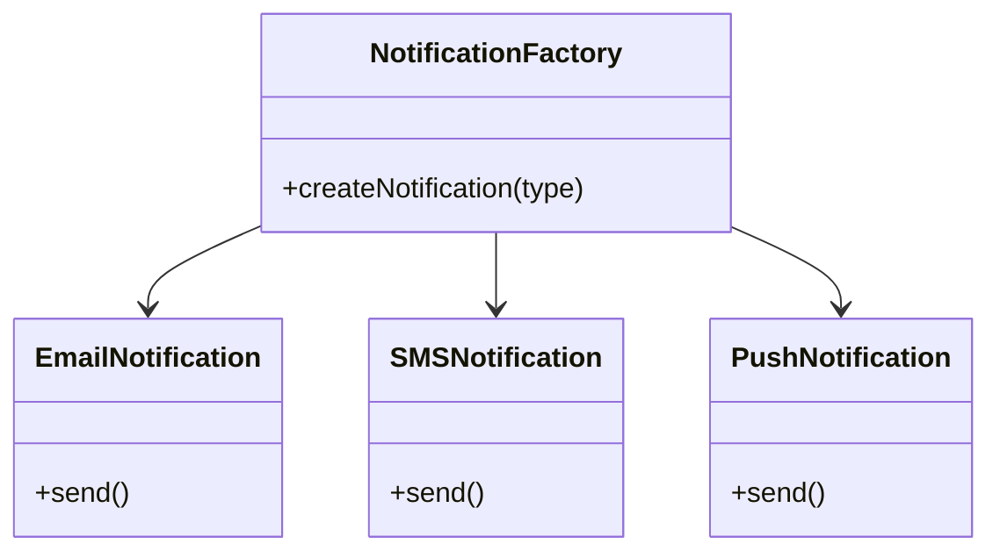
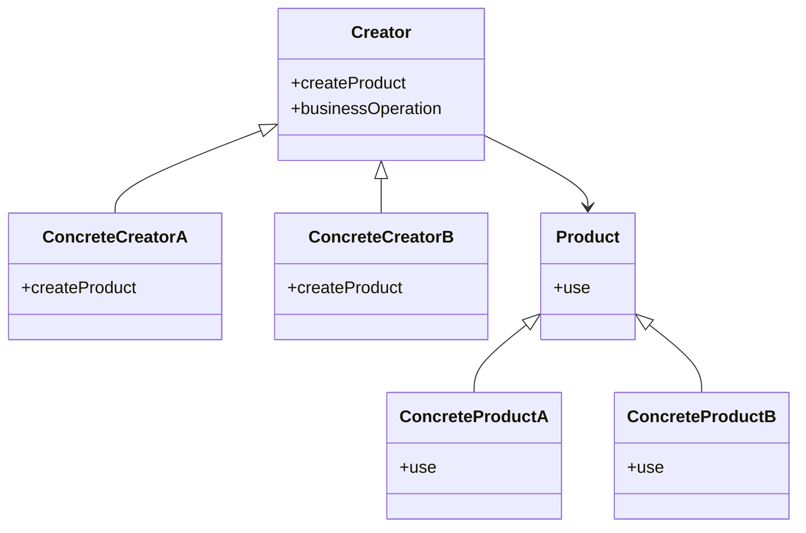
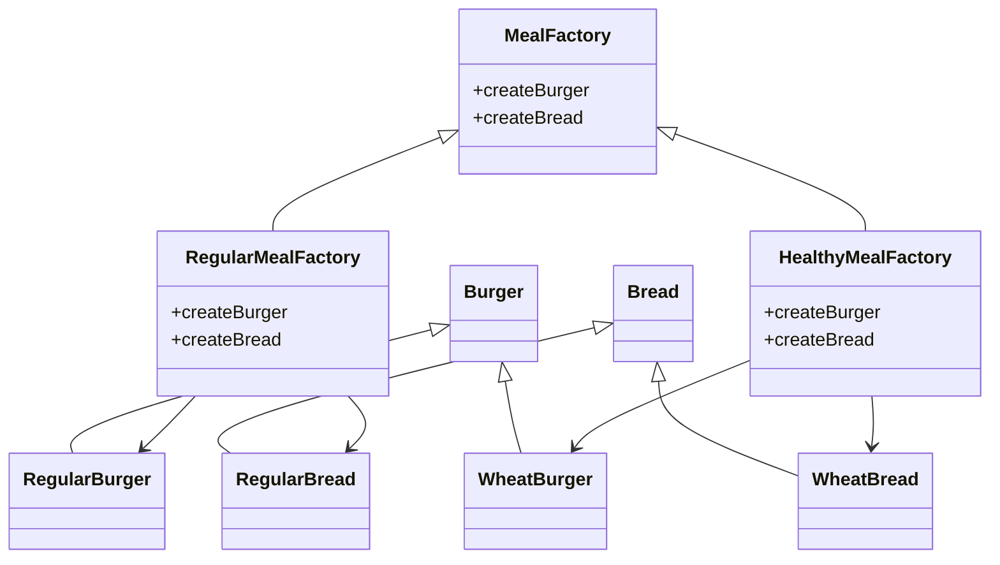
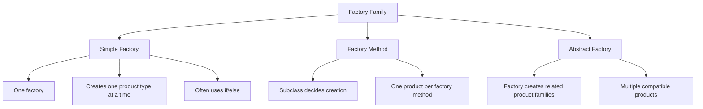
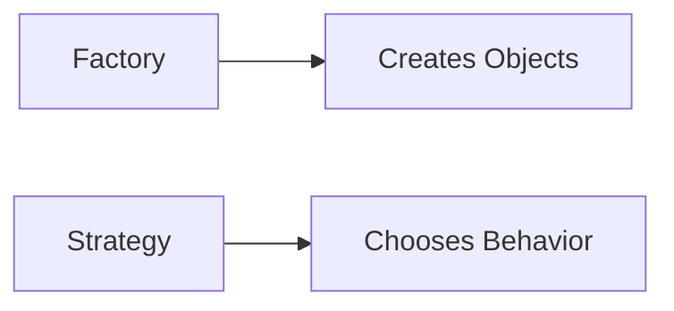
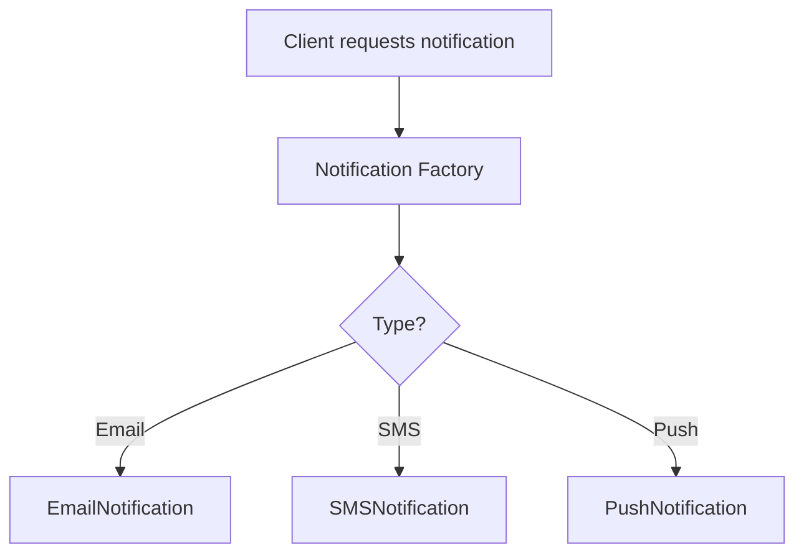

# Factory Design Pattern

If you have ever worked on a growing codebase, you have probably seen this problem:

- business logic mixed with object creation
- `if-else` chains deciding which object to create
- `switch` statements scattered across the code
- repeated `new` keyword usage inside core logic
- code that becomes rigid as soon as a new object type is added

At first, this looks harmless.

But as the application grows, object creation starts leaking into places where it does not belong. The result is code that is harder to maintain, harder to extend, and more fragile during change.

The **Factory Design Pattern** exists to solve exactly this problem.

Its deeper purpose is not just to create objects.

Its real purpose is to **separate the responsibility of object creation from business logic**.

---

## Introduction: The real problem

Every application has two kinds of logic:

### 1. Business logic
This tells the application **what to do**.

Example:
- send a notification
- calculate a payment
- process an order
- generate a report

### 2. Creation logic
This tells the application **which object to create** and **how to create it**.

Example:
- create `EmailNotification`
- create `SmsNotification`
- create `PushNotification`

When both are mixed together, the code becomes messy.

```mermaid
flowchart TD
    A[Business Logic] --> B[Object Creation Logic]
    B --> C[if/else or switch]
    C --> D[Concrete Objects]
````

The Factory Pattern keeps these responsibilities separate.

---

# Why Factory Pattern matters

The Factory Pattern helps build software that is:

* easier to read
* easier to extend
* easier to test
* less tightly coupled
* more aligned with SOLID principles
* safer to change over time

---

## What it solves

| Problem                                                | Factory Pattern solution                       |
| ------------------------------------------------------ | ---------------------------------------------- |
| Object creation scattered everywhere                   | Centralize creation                            |
| Too many `new` keywords in business logic              | Hide construction behind a factory             |
| Adding a new type requires code changes in many places | Add new concrete products with minimal impact  |
| High coupling to concrete classes                      | Depend on abstractions                         |
| Hard-to-read conditional creation logic                | Move creation decisions into a dedicated place |

---

# Core idea

The Factory family of patterns is about this simple idea:

> Separate the “what” from the “how”.

* The **client** asks for an object.
* The **factory** decides how to create it.
* The client uses the object without caring about its construction details.

---

# Types of Factory Patterns

The term “Factory Pattern” is often used broadly. In practice, it refers to a family of related patterns.

```mermaid
flowchart TD
    A[Factory Family] --> B[Simple Factory]
    A --> C[Factory Method]
    A --> D[Abstract Factory]
```

---

## 1. Simple Factory

### Definition

A simple factory is a class with a method that creates objects based on input.

It usually uses:

* `if-else`
* `switch`
* `case`

### Important note

The simple factory is widely used, but many authorities do **not** consider it a formal Gang of Four pattern. It is better described as a useful idiom or programming style.

---

### Why people use it

It is:

* easy to understand
* easy to write
* good for small projects
* good for centralizing creation logic

---

### Limitation

The downside is that if you add many new product types, the factory itself must change.

That makes it less open for extension.

---

## Simple Factory example: Notification system

Suppose we want to create different notification objects:

* email
* SMS
* push

### Bad approach: creation inside business logic

```python
class NotificationService:
    def send(self, channel, message):
        if channel == "email":
            notification = EmailNotification()
        elif channel == "sms":
            notification = SMSNotification()
        elif channel == "push":
            notification = PushNotification()
        else:
            raise ValueError("Unsupported channel")

        notification.send(message)
```

### Problem

The business logic knows too much about object creation.

If a new channel is added, this class must be modified.

---

## Simple Factory diagram



---

## Simple Factory example in three languages

```cpp
#include <iostream>
#include <memory>
using namespace std;

class Notification {
public:
    virtual void send(string message) = 0;
    virtual ~Notification() = default;
};

class EmailNotification : public Notification {
public:
    void send(string message) override {
        cout << "Email: " << message << endl;
    }
};

class SMSNotification : public Notification {
public:
    void send(string message) override {
        cout << "SMS: " << message << endl;
    }
};

class PushNotification : public Notification {
public:
    void send(string message) override {
        cout << "Push: " << message << endl;
    }
};

class NotificationFactory {
public:
    static unique_ptr<Notification> create(string type) {
        if (type == "email") return make_unique<EmailNotification>();
        if (type == "sms") return make_unique<SMSNotification>();
        if (type == "push") return make_unique<PushNotification>();
        throw runtime_error("Unsupported type");
    }
};
```
```java
interface Notification {
    void send(String message);
}

class EmailNotification implements Notification {
    public void send(String message) {
        System.out.println("Email: " + message);
    }
}

class SMSNotification implements Notification {
    public void send(String message) {
        System.out.println("SMS: " + message);
    }
}

class PushNotification implements Notification {
    public void send(String message) {
        System.out.println("Push: " + message);
    }
}

class NotificationFactory {
    public static Notification create(String type) {
        if (type.equals("email")) return new EmailNotification();
        if (type.equals("sms")) return new SMSNotification();
        if (type.equals("push")) return new PushNotification();
        throw new IllegalArgumentException("Unsupported type");
    }
}
```
```python
from abc import ABC, abstractmethod

class Notification(ABC):
    @abstractmethod
    def send(self, message):
        pass

class EmailNotification(Notification):
    def send(self, message):
        print(f"Email: {message}")

class SMSNotification(Notification):
    def send(self, message):
        print(f"SMS: {message}")

class PushNotification(Notification):
    def send(self, message):
        print(f"Push: {message}")

class NotificationFactory:
    @staticmethod
    def create(notification_type):
        if notification_type == "email":
            return EmailNotification()
        if notification_type == "sms":
            return SMSNotification()
        if notification_type == "push":
            return PushNotification()
        raise ValueError("Unsupported type")
```

---

## Why Simple Factory is limited

The simple factory is convenient, but it has a weakness:

* every new product type usually requires editing the factory
* the factory becomes large over time
* the code can violate the Open/Closed Principle

That is why the next level exists: **Factory Method**.

---

# 2. Factory Method

## Definition

The Factory Method pattern defines an interface for creating objects, but lets subclasses decide which class to instantiate.

This is a true GoF design pattern.

---

## Core idea

Instead of one factory class making every decision itself, we let subclasses customize creation.

This means:

* the creator defines a method
* subclasses override the method
* the actual object is created by the subclass

---

## Why this helps

* object creation is still abstracted
* creation logic can vary
* client code stays decoupled from concrete classes
* new product variations can be added with less modification

---

## Factory Method structure



---

## Real-world example: Burger shop

Imagine two burger franchises:

* `SingBurger` makes regular burgers
* `KingBurger` makes healthy wheat burgers

The business process is the same:

* take order
* prepare burger
* serve burger

But the exact burger type may differ.

---

## Factory Method example in three languages

```cpp
#include <iostream>
#include <memory>
using namespace std;

class Burger {
public:
    virtual void prepare() = 0;
    virtual ~Burger() = default;
};

class NormalBurger : public Burger {
public:
    void prepare() override {
        cout << "Preparing Normal Burger" << endl;
    }
};

class WheatBurger : public Burger {
public:
    void prepare() override {
        cout << "Preparing Wheat Burger" << endl;
    }
};

class BurgerFactory {
public:
    virtual unique_ptr<Burger> createBurger() = 0;
    virtual ~BurgerFactory() = default;

    void orderBurger() {
        auto burger = createBurger();
        burger->prepare();
    }
};

class SingBurgerFactory : public BurgerFactory {
public:
    unique_ptr<Burger> createBurger() override {
        return make_unique<NormalBurger>();
    }
};

class KingBurgerFactory : public BurgerFactory {
public:
    unique_ptr<Burger> createBurger() override {
        return make_unique<WheatBurger>();
    }
};
```
```java
interface Burger {
    void prepare();
}

class NormalBurger implements Burger {
    public void prepare() {
        System.out.println("Preparing Normal Burger");
    }
}

class WheatBurger implements Burger {
    public void prepare() {
        System.out.println("Preparing Wheat Burger");
    }
}

abstract class BurgerFactory {
    abstract Burger createBurger();

    void orderBurger() {
        Burger burger = createBurger();
        burger.prepare();
    }
}

class SingBurgerFactory extends BurgerFactory {
    Burger createBurger() {
        return new NormalBurger();
    }
}

class KingBurgerFactory extends BurgerFactory {
    Burger createBurger() {
        return new WheatBurger();
    }
}
```
```python
from abc import ABC, abstractmethod

class Burger(ABC):
    @abstractmethod
    def prepare(self):
        pass

class NormalBurger(Burger):
    def prepare(self):
        print("Preparing Normal Burger")

class WheatBurger(Burger):
    def prepare(self):
        print("Preparing Wheat Burger")

class BurgerFactory(ABC):
    @abstractmethod
    def create_burger(self):
        pass

    def order_burger(self):
        burger = self.create_burger()
        burger.prepare()

class SingBurgerFactory(BurgerFactory):
    def create_burger(self):
        return NormalBurger()

class KingBurgerFactory(BurgerFactory):
    def create_burger(self):
        return WheatBurger()
```

---

## Factory Method explanation

The client does not directly create `NormalBurger` or `WheatBurger`.

Instead:

* it depends on `BurgerFactory`
* a concrete factory decides the product
* the same business workflow works for all burger types

That is a clean separation between:

* product creation
* product usage

---

## Factory Method and OCP

This pattern supports the Open/Closed Principle because:

* you can add new products by adding new concrete creators
* the client code does not need to change

---

# 3. Abstract Factory

## Definition

Abstract Factory provides an interface for creating families of related or dependent objects without specifying their concrete classes.

This is like Factory Method, but on a larger scale.

---

## What “family of products” means

A family of products is a set of objects that are designed to work together.

For example:

* burger
* garlic bread
* drink

One restaurant may produce:

* regular burger
* regular garlic bread
* regular drink

Another restaurant may produce:

* wheat burger
* wheat garlic bread
* herbal drink

The products within a family should be compatible.

---

## Abstract Factory structure



---

## Why Abstract Factory is useful

It ensures that:

* products are compatible with each other
* the client does not know concrete classes
* entire families of objects can be swapped together
* consistency is maintained across related objects

---

## Real-world example: Restaurant meal system

Suppose a restaurant has two styles:

* regular meal
* healthy meal

Each style provides:

* burger
* bread

The meal style determines which family of products is created.

---

## Abstract Factory example in three languages

```cpp
#include <iostream>
#include <memory>
using namespace std;

class Burger {
public:
    virtual void eat() = 0;
    virtual ~Burger() = default;
};

class Bread {
public:
    virtual void serve() = 0;
    virtual ~Bread() = default;
};

class RegularBurger : public Burger {
public:
    void eat() override {
        cout << "Eating regular burger" << endl;
    }
};

class WheatBurger : public Burger {
public:
    void eat() override {
        cout << "Eating wheat burger" << endl;
    }
};

class RegularBread : public Bread {
public:
    void serve() override {
        cout << "Serving regular bread" << endl;
    }
};

class WheatBread : public Bread {
public:
    void serve() override {
        cout << "Serving wheat bread" << endl;
    }
};

class MealFactory {
public:
    virtual unique_ptr<Burger> createBurger() = 0;
    virtual unique_ptr<Bread> createBread() = 0;
    virtual ~MealFactory() = default;
};

class RegularMealFactory : public MealFactory {
public:
    unique_ptr<Burger> createBurger() override {
        return make_unique<RegularBurger>();
    }

    unique_ptr<Bread> createBread() override {
        return make_unique<RegularBread>();
    }
};

class HealthyMealFactory : public MealFactory {
public:
    unique_ptr<Burger> createBurger() override {
        return make_unique<WheatBurger>();
    }

    unique_ptr<Bread> createBread() override {
        return make_unique<WheatBread>();
    }
};
```
```java
interface Burger {
    void eat();
}

interface Bread {
    void serve();
}

class RegularBurger implements Burger {
    public void eat() {
        System.out.println("Eating regular burger");
    }
}

class WheatBurger implements Burger {
    public void eat() {
        System.out.println("Eating wheat burger");
    }
}

class RegularBread implements Bread {
    public void serve() {
        System.out.println("Serving regular bread");
    }
}

class WheatBread implements Bread {
    public void serve() {
        System.out.println("Serving wheat bread");
    }
}

interface MealFactory {
    Burger createBurger();
    Bread createBread();
}

class RegularMealFactory implements MealFactory {
    public Burger createBurger() {
        return new RegularBurger();
    }

    public Bread createBread() {
        return new RegularBread();
    }
}

class HealthyMealFactory implements MealFactory {
    public Burger createBurger() {
        return new WheatBurger();
    }

    public Bread createBread() {
        return new WheatBread();
    }
}
```
```python
from abc import ABC, abstractmethod

class Burger(ABC):
    @abstractmethod
    def eat(self):
        pass

class Bread(ABC):
    @abstractmethod
    def serve(self):
        pass

class RegularBurger(Burger):
    def eat(self):
        print("Eating regular burger")

class WheatBurger(Burger):
    def eat(self):
        print("Eating wheat burger")

class RegularBread(Bread):
    def serve(self):
        print("Serving regular bread")

class WheatBread(Bread):
    def serve(self):
        print("Serving wheat bread")

class MealFactory(ABC):
    @abstractmethod
    def create_burger(self):
        pass

    @abstractmethod
    def create_bread(self):
        pass

class RegularMealFactory(MealFactory):
    def create_burger(self):
        return RegularBurger()

    def create_bread(self):
        return RegularBread()

class HealthyMealFactory(MealFactory):
    def create_burger(self):
        return WheatBurger()

    def create_bread(self):
        return WheatBread()
```

---

## Abstract Factory explanation

The client chooses a factory:

* `RegularMealFactory`
* `HealthyMealFactory`

That factory creates a compatible set of products.

This ensures consistency.

---

# Simple Factory vs Factory Method vs Abstract Factory

| Pattern          | Main goal                          | Creation style                           | Extensibility | Complexity |
| ---------------- | ---------------------------------- | ---------------------------------------- | ------------- | ---------- |
| Simple Factory   | Centralize creation                | One class, conditional logic             | Moderate      | Low        |
| Factory Method   | Let subclasses decide creation     | Inheritance-based                        | High          | Medium     |
| Abstract Factory | Create families of related objects | Factory object creates multiple products | Very high     | High       |

---

## Visual comparison



---

# Factory Pattern vs Strategy Pattern

These two patterns can look similar at first, but their intent is different.

| Pattern  | Main purpose              | Focus           |
| -------- | ------------------------- | --------------- |
| Factory  | Create objects            | Object creation |
| Strategy | Choose algorithm/behavior | Object behavior |

---

## Key difference

### Factory

Used when the main problem is:

* which object should be created?

### Strategy

Used when the main problem is:

* which behavior or algorithm should be used?

---

## Example

### Factory

A notification factory creates:

* email notification
* SMS notification
* push notification

### Strategy

A payment strategy decides:

* UPI payment
* card payment
* wallet payment

---

## Intent diagram



---

# When to use Factory Pattern

Use Factory Pattern when:

* object creation logic is complex
* you want to hide concrete class names
* you want to centralize construction logic
* you want to reduce coupling to `new`
* you want to create different related objects based on runtime input
* you want to keep business logic clean

---

# When not to use Factory Pattern

Avoid adding factory abstraction when:

* the code is tiny
* only one object type exists
* object creation is trivial
* abstraction would make the design unnecessarily complicated

Patterns should solve real problems, not decorate simple code.

---

# Common signs you need a factory

You may need a factory if you see:

* repeated `new` object creation in many places
* `if-else` or `switch` choosing object types
* client code depending on concrete classes
* one class doing both business logic and creation logic
* difficulty adding a new object type without editing multiple files

---

# Benefits of Factory Pattern

| Benefit                | Description                                         |
| ---------------------- | --------------------------------------------------- |
| Separation of concerns | Creation logic is moved out of business logic       |
| Lower coupling         | Client depends on abstraction, not concrete classes |
| Easier testing         | Object creation can be mocked or swapped            |
| Better maintainability | New product types are easier to add                 |
| Cleaner code           | Less clutter from `new`, `if-else`, and `switch`    |
| Better architecture    | Encourages modular design                           |

---

# Drawbacks of Factory Pattern

| Drawback             | Description                            |
| -------------------- | -------------------------------------- |
| Extra classes        | More files and abstractions            |
| More indirection     | Can be harder to trace at first        |
| Overengineering risk | Not needed for trivial object creation |

---

# Real-world examples

Factory Pattern is used in many places:

* notification systems
* UI component creation
* database connectors
* payment processors
* report generators
* document parsers
* logging frameworks

---

## Example: Notification factory flow



---

# Factory Pattern summary

The Factory family of patterns does more than create objects.

It helps you:

* separate business logic from creation logic
* reduce tight coupling
* follow SOLID principles
* design more flexible systems
* support growth without chaos

---

# Final takeaway

The Factory Pattern is not just about hiding `new`.

It is about treating object creation as a first-class design concern.

* **Simple Factory** centralizes creation
* **Factory Method** lets subclasses decide creation
* **Abstract Factory** creates families of related objects

The real value is clean architecture.

> Do not let business logic worry about how objects are born.
> Let factories handle creation, so the core system stays focused on what it does best.