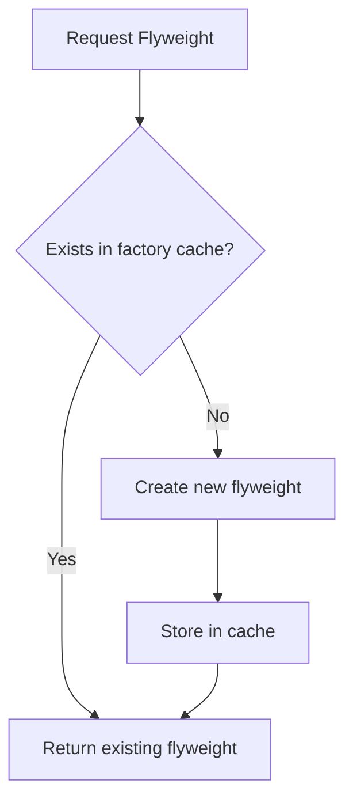
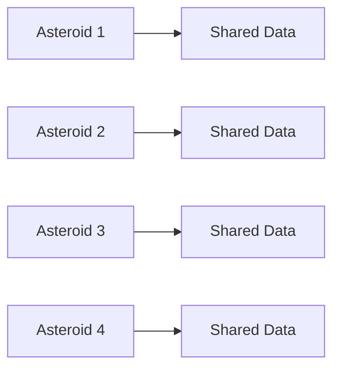
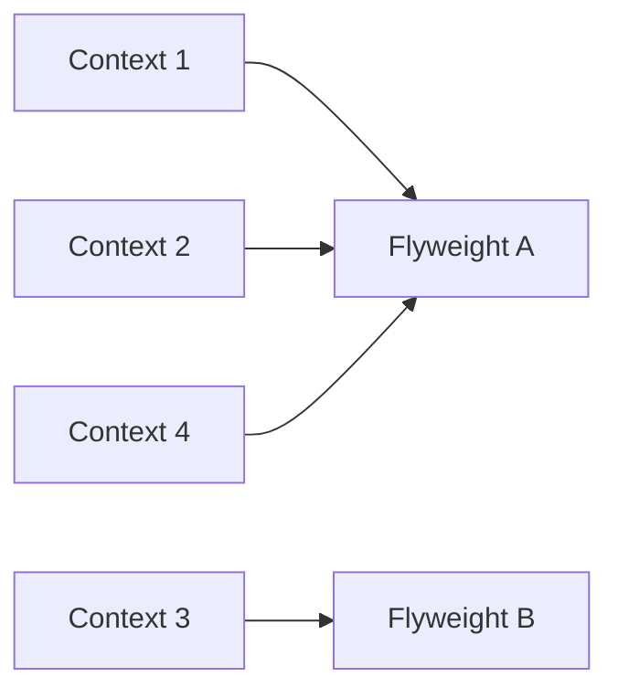
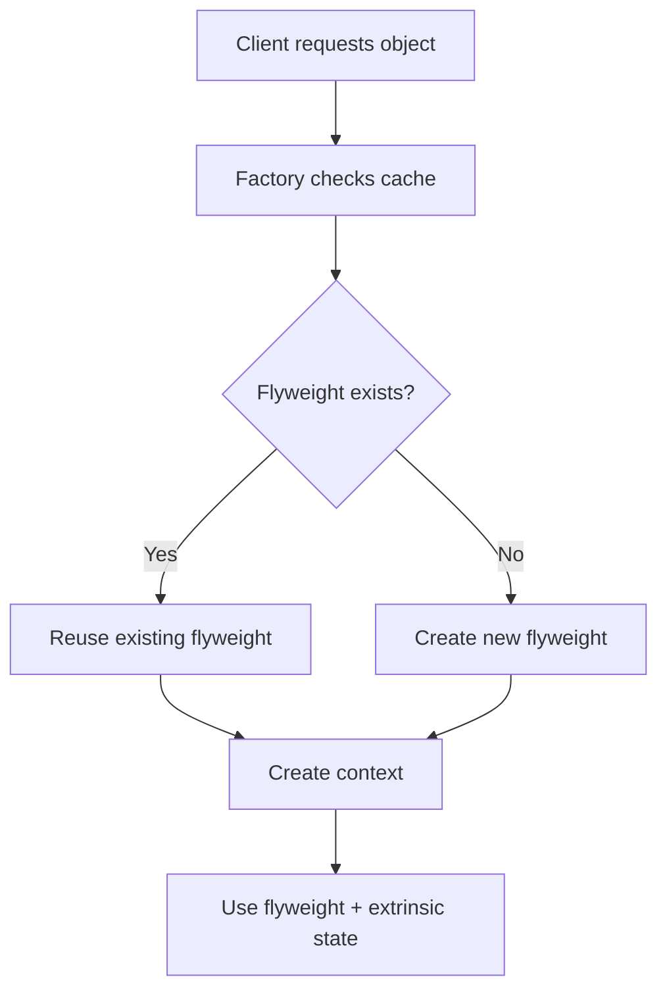
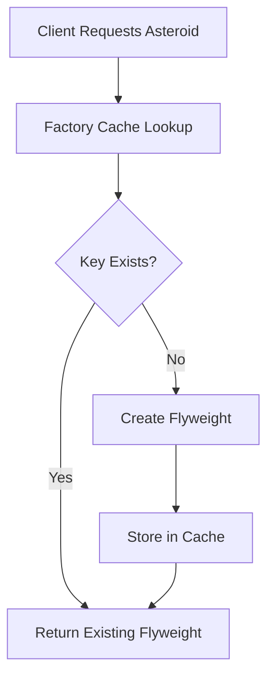
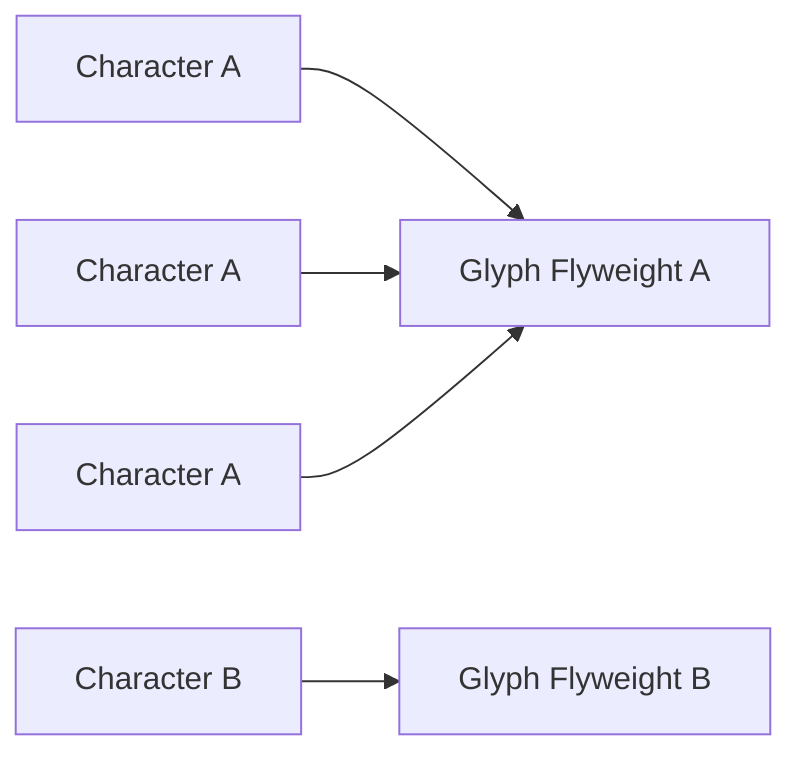

# Flyweight Design Pattern

The **Flyweight Design Pattern** is a structural design pattern used to reduce memory usage by sharing common data between many objects instead of duplicating it.

It is especially useful when:

- a program needs to create a huge number of objects
- many objects share the same data
- memory usage becomes too high
- the objects are small but numerous
- performance suffers because of excessive object creation

The Flyweight pattern helps us build systems that are memory-efficient and scalable.

---

# Introduction: The Core Idea

Imagine a video game with a screen full of asteroids.

You may need:
- thousands
- hundreds of thousands
- even millions of asteroid-like objects

If each asteroid stores all of its properties independently, memory usage becomes huge.

That is where Flyweight helps.

Instead of storing repeated data again and again, Flyweight shares the common parts and keeps only the unique parts separate.

---

## Why this matters

When many objects are similar, storing duplicate information wastes memory.

For example, if 1,000,000 objects all store the same:
- color
- texture
- shape
- material

then that same data is repeated 1,000,000 times.

Flyweight solves this by storing the shared data once and reusing it.

---

# The Problem in Detail: Too Many Similar Objects

Suppose we are building a game where many asteroids appear on screen.

Each asteroid may have:

- length
- width
- weight
- color
- texture
- material
- position
- velocity
- direction

Some of these values are the same for many asteroids, while others are unique.

---

## Example of repeated data

Many asteroids might share:
- red color
- rocky texture
- small size

But each asteroid has a different:
- x position
- y position
- velocity
- angle

If we store everything in every object, memory gets wasted.

---

## Why this is a problem

| Problem | Explanation |
|--------|-------------|
| Memory waste | Shared data is duplicated repeatedly |
| Slow performance | Too many large objects consume resources |
| Poor scalability | Large object counts become harder to manage |
| Possible crashes | Excessive memory usage may overwhelm RAM |
| Unnecessary duplication | Same values are stored in many places |

---

# Core Idea of Flyweight

Flyweight divides an object’s data into two categories:

1. **Intrinsic state**
2. **Extrinsic state**

This separation is the heart of the pattern.

---

# Intrinsic vs Extrinsic State

| State Type | Meaning | Shared? | Example |
|-----------|---------|---------|---------|
| Intrinsic | Internal data common to many objects | Yes | color, texture, size |
| Extrinsic | Context-specific data unique to each object | No | position, velocity, angle |

---

## What is intrinsic state?

Intrinsic state is:
- shared
- reusable
- usually immutable
- independent of the object’s current context

Example:
- asteroid shape
- asteroid color
- asteroid texture

This data can be reused across many objects.

---

## What is extrinsic state?

Extrinsic state is:
- unique for each object
- context-dependent
- usually passed from outside
- stored separately from the flyweight object

Example:
- position on screen
- speed
- rotation
- health
- current state in the game

---

# Why the separation works

If the intrinsic state is shared, then only a few flyweight objects are needed.

The extrinsic state is stored in a lightweight context object.

This dramatically reduces memory usage.

```mermaid
flowchart TD
    A[Object Data] --> B[Intrinsic State]
    A --> C[Extrinsic State]
    B --> D[Shared Flyweight]
    C --> E[Context Object]
````

---

# Formal Definition

The Flyweight pattern is a structural design pattern used to reduce memory usage by sharing common state between many objects instead of duplicating it.

---

# Main Participants

| Role              | Meaning                                  | Example           |
| ----------------- | ---------------------------------------- | ----------------- |
| Flyweight         | Shared object containing intrinsic state | asteroid model    |
| Context           | Object containing extrinsic state        | asteroid position |
| Flyweight Factory | Creates and reuses flyweights            | asteroid factory  |
| Client            | Requests objects                         | game engine       |

---

# UML Structure

```mermaid
classDiagram

class Flyweight {
    operation()
}

class ConcreteFlyweight {
    -intrinsicState
    operation()
}

class FlyweightFactory {
    -pool
    getFlyweight()
}

class Context {
    -extrinsicState
    -flyweight
    render()
}

Flyweight <|.. ConcreteFlyweight
FlyweightFactory --> Flyweight
Context --> Flyweight
```

---

# The Flyweight Factory

The Flyweight Factory is responsible for:

* creating flyweights
* storing them
* reusing existing ones
* preventing duplicate flyweights with the same intrinsic state

This is usually done using a map or dictionary.

---

## Factory behavior

When the client asks for a flyweight:

1. build a key from intrinsic properties
2. check if the key already exists
3. if yes, return the existing object
4. if no, create a new one and store it



---

# Why Flyweight saves memory

The important idea is that:

* repeated data is shared
* only unique data is stored separately

So instead of having millions of full objects, we may have:

* a few shared flyweights
* many lightweight context objects

That is where memory savings come from.

---

# Asteroid Example

Suppose we have three asteroid types:

* small rocky asteroid
* medium icy asteroid
* large metallic asteroid

These are the shared intrinsic types.

Then every asteroid on the screen has its own:

* x position
* y position
* velocity
* rotation

So one shared flyweight can represent all asteroids of the same type.

---

## Before Flyweight

Every asteroid stores everything.



This duplicates the same shared information many times.

---

## After Flyweight

Shared state is reused.



Now one flyweight object may be used by many contexts.

---

# The Structure of a Flyweight Object

A flyweight object usually contains:

* intrinsic data
* behavior based on both intrinsic and extrinsic data

It should **not** store mutable unique state.

---

# The Structure of a Context Object

A context object usually contains:

* extrinsic data
* reference to the flyweight

It is created many times.

It is lightweight compared to the full object.

---

# Why immutability matters

Flyweight objects should be immutable.

That means:

* shared data should not change after creation
* one change should not affect all users
* the object stays safe for reuse

If shared intrinsic data is modified, every context using that flyweight may be affected.

That can create serious bugs.

---

## Why mutable flyweights are dangerous

If one shared asteroid flyweight has its color changed:

* all asteroids using that flyweight may change color too

That defeats the purpose of safe sharing.

---

# Flyweight pattern flow



---

# Real-world analogy

Think of a text editor.

Instead of storing a full object for every letter:

* character identity is shared
* font style may be shared
* character position is stored separately

A million “A” characters do not need a million separate “A” models.

That is the Flyweight idea.

---

# Another real-world analogy: Trees in a game

A forest in a game may contain thousands of trees.

All pine trees may share:

* same texture
* same shape
* same model

But each tree has:

* different coordinates
* different rotation
* different scale

So one flyweight tree model can be reused across the forest.

---

# Benefits of Flyweight

| Benefit            | Description                                |
| ------------------ | ------------------------------------------ |
| Memory efficiency  | Reduces duplicate storage                  |
| Better scalability | Supports huge numbers of objects           |
| Faster creation    | Reusing shared objects is cheaper          |
| Cleaner data model | Shared and unique data are separated       |
| Better performance | Lower memory pressure improves performance |

---

# Drawbacks of Flyweight

| Drawback         | Description                                 |
| ---------------- | ------------------------------------------- |
| More complexity  | Must separate intrinsic and extrinsic state |
| Harder design    | Not every object is easy to split           |
| More indirection | Client may need to provide extrinsic state  |
| Factory overhead | A caching factory is usually required       |

---

# When to use Flyweight

Use Flyweight when:

* many objects are similar
* memory usage is a concern
* the same data repeats often
* objects can be split into shared and unique parts
* a large number of fine-grained objects is needed

---

# When not to use Flyweight

Avoid Flyweight when:

* there are only a few objects
* objects do not share much data
* the pattern would make code unnecessarily complicated
* sharing would not save meaningful memory

---

# Flyweight and Immutability

The shared flyweight should usually be immutable.

That means:

* no setters for intrinsic state
* state is set once during creation
* same object can be safely reused

This is one of the most important rules in the pattern.

---

# A complete example

```cpp
#include <iostream>
#include <unordered_map>
#include <memory>
#include <string>
using namespace std;

class AsteroidFlyweight {
private:
    int size;
    string color;
    string texture;
    string material;

public:
    AsteroidFlyweight(int size, string color, string texture, string material)
        : size(size), color(color), texture(texture), material(material) {}

    void display(int x, int y, int velocityX, int velocityY) {
        cout << "Asteroid[" << size << ", " << color << ", " << texture << ", " << material << "]"
             << " at (" << x << "," << y << ")"
             << " velocity (" << velocityX << "," << velocityY << ")" << endl;
    }
};

class AsteroidFactory {
private:
    unordered_map<string, shared_ptr<AsteroidFlyweight>> pool;

public:
    shared_ptr<AsteroidFlyweight> getAsteroid(int size, string color, string texture, string material) {
        string key = to_string(size) + "_" + color + "_" + texture + "_" + material;

        if (pool.find(key) == pool.end()) {
            pool[key] = make_shared<AsteroidFlyweight>(size, color, texture, material);
        }

        return pool[key];
    }
};

class AsteroidContext {
private:
    int x;
    int y;
    int velocityX;
    int velocityY;
    shared_ptr<AsteroidFlyweight> flyweight;

public:
    AsteroidContext(int x, int y, int vx, int vy, shared_ptr<AsteroidFlyweight> flyweight)
        : x(x), y(y), velocityX(vx), velocityY(vy), flyweight(flyweight) {}

    void draw() {
        flyweight->display(x, y, velocityX, velocityY);
    }
};

int main() {
    AsteroidFactory factory;

    auto smallRocky = factory.getAsteroid(10, "Red", "Rocky", "Hard");
    auto mediumIcy = factory.getAsteroid(20, "Blue", "Icy", "Medium");

    AsteroidContext a1(10, 20, 1, 2, smallRocky);
    AsteroidContext a2(30, 40, -1, 3, smallRocky);
    AsteroidContext a3(50, 60, 0, 1, mediumIcy);

    a1.draw();
    a2.draw();
    a3.draw();

    return 0;
}
```
```java
import java.util.HashMap;
import java.util.Map;

class AsteroidFlyweight {
    private final int size;
    private final String color;
    private final String texture;
    private final String material;

    AsteroidFlyweight(int size, String color, String texture, String material) {
        this.size = size;
        this.color = color;
        this.texture = texture;
        this.material = material;
    }

    public void display(int x, int y, int velocityX, int velocityY) {
        System.out.println("Asteroid[" + size + ", " + color + ", " + texture + ", " + material + "]"
                + " at (" + x + "," + y + ")"
                + " velocity (" + velocityX + "," + velocityY + ")");
    }
}

class AsteroidFactory {
    private Map<String, AsteroidFlyweight> pool = new HashMap<>();

    public AsteroidFlyweight getAsteroid(int size, String color, String texture, String material) {
        String key = size + "_" + color + "_" + texture + "_" + material;

        if (!pool.containsKey(key)) {
            pool.put(key, new AsteroidFlyweight(size, color, texture, material));
        }

        return pool.get(key);
    }
}

class AsteroidContext {
    private int x;
    private int y;
    private int velocityX;
    private int velocityY;
    private AsteroidFlyweight flyweight;

    AsteroidContext(int x, int y, int velocityX, int velocityY, AsteroidFlyweight flyweight) {
        this.x = x;
        this.y = y;
        this.velocityX = velocityX;
        this.velocityY = velocityY;
        this.flyweight = flyweight;
    }

    public void draw() {
        flyweight.display(x, y, velocityX, velocityY);
    }
}

public class Main {
    public static void main(String[] args) {
        AsteroidFactory factory = new AsteroidFactory();

        AsteroidFlyweight smallRocky = factory.getAsteroid(10, "Red", "Rocky", "Hard");
        AsteroidFlyweight mediumIcy = factory.getAsteroid(20, "Blue", "Icy", "Medium");

        AsteroidContext a1 = new AsteroidContext(10, 20, 1, 2, smallRocky);
        AsteroidContext a2 = new AsteroidContext(30, 40, -1, 3, smallRocky);
        AsteroidContext a3 = new AsteroidContext(50, 60, 0, 1, mediumIcy);

        a1.draw();
        a2.draw();
        a3.draw();
    }
}
```
```python
class AsteroidFlyweight:
    def __init__(self, size, color, texture, material):
        self._size = size
        self._color = color
        self._texture = texture
        self._material = material

    def display(self, x, y, velocity_x, velocity_y):
        print(
            f"Asteroid[{self._size}, {self._color}, {self._texture}, {self._material}] "
            f"at ({x},{y}) velocity ({velocity_x},{velocity_y})"
        )

class AsteroidFactory:
    def __init__(self):
        self._pool = {}

    def get_asteroid(self, size, color, texture, material):
        key = f"{size}_{color}_{texture}_{material}"
        if key not in self._pool:
            self._pool[key] = AsteroidFlyweight(size, color, texture, material)
        return self._pool[key]

class AsteroidContext:
    def __init__(self, x, y, velocity_x, velocity_y, flyweight):
        self.x = x
        self.y = y
        self.velocity_x = velocity_x
        self.velocity_y = velocity_y
        self.flyweight = flyweight

    def draw(self):
        self.flyweight.display(self.x, self.y, self.velocity_x, self.velocity_y)

factory = AsteroidFactory()

small_rocky = factory.get_asteroid(10, "Red", "Rocky", "Hard")
medium_icy = factory.get_asteroid(20, "Blue", "Icy", "Medium")

a1 = AsteroidContext(10, 20, 1, 2, small_rocky)
a2 = AsteroidContext(30, 40, -1, 3, small_rocky)
a3 = AsteroidContext(50, 60, 0, 1, medium_icy)

a1.draw()
a2.draw()
a3.draw()
```

---

## C++ explanation

* `AsteroidFlyweight` stores shared intrinsic state
* `AsteroidContext` stores unique extrinsic state
* `AsteroidFactory` reuses flyweights using a cache
* same flyweight can be used by many contexts

---

## Java explanation

* intrinsic data is stored in the flyweight
* extrinsic data is stored in the context
* the factory caches and reuses flyweights
* `final` fields help support immutability

---

## Python explanation

* the flyweight stores shared state
* the context stores unique state
* the factory reuses objects from a dictionary
* many contexts can share one flyweight

---

# Before vs After Flyweight

| Aspect       | Without Flyweight        | With Flyweight                       |
| ------------ | ------------------------ | ------------------------------------ |
| Shared data  | Repeated in every object | Stored once                          |
| Memory usage | High                     | Much lower                           |
| Object count | Very large full objects  | Few flyweights + many light contexts |
| Maintenance  | Harder                   | Better organized                     |
| Performance  | Memory pressure high     | Memory pressure reduced              |

---

# Factory cache diagram



---

# Real-world examples

## 1. Video games

A game may render:

* trees
* rocks
* bullets
* enemies
* terrain tiles

Many of these share model and texture data.

---

## 2. Text editors

A document may contain:

* repeated letters
* shared glyph shapes
* shared font information

Many characters can share the same character flyweight.

---

## 3. Graphics systems

Rendering engines often reuse:

* glyphs
* icons
* sprites
* texture assets

---

## 4. Map systems

Maps may share:

* road tiles
* building tiles
* terrain elements

---

# Example: Text editor flyweight idea



---

# Flyweight and performance

Flyweight improves performance mainly by:

* reducing memory usage
* reducing object allocation overhead
* improving cache efficiency
* lowering garbage collection pressure in managed languages

---

# Benefits of Flyweight

| Benefit                | Description                       |
| ---------------------- | --------------------------------- |
| Memory reduction       | Biggest advantage                 |
| Better scalability     | Supports very large object counts |
| Reduced duplication    | Shared data stored once           |
| Efficient object reuse | Factory reuses flyweights         |
| Lower GC pressure      | Fewer large objects in memory     |

---

# Drawbacks of Flyweight

| Drawback                 | Description                          |
| ------------------------ | ------------------------------------ |
| Increased complexity     | Needs separation of state            |
| Factory overhead         | Requires caching mechanism           |
| Harder client code       | Extrinsic data must be passed in     |
| Immutability requirement | Shared objects should not be changed |

---

# Common mistakes

| Mistake                                 | Problem                             |
| --------------------------------------- | ----------------------------------- |
| Putting extrinsic data inside flyweight | Breaks sharing                      |
| Making flyweights mutable               | Shared changes can affect all users |
| Using Flyweight for small systems       | Overengineering                     |
| Forgetting the factory cache            | Duplicate flyweights created        |
| Not separating state correctly          | Pattern loses its benefit           |

---

# When to use Flyweight

Use Flyweight when:

* you have a very large number of objects
* many objects share the same data
* memory is a major concern
* object state can be split into shared and unique parts
* reuse will save significant resources

---

# When not to use Flyweight

Avoid Flyweight when:

* object count is small
* data sharing is minimal
* complexity outweighs memory savings
* the system does not benefit from caching

---

# Flyweight vs Object Pool

| Pattern     | Purpose                           |
| ----------- | --------------------------------- |
| Flyweight   | Share common intrinsic state      |
| Object Pool | Reuse expensive-to-create objects |

Flyweight reduces memory by sharing state.
Object pool reduces creation cost by reusing instances.

---

# Flyweight vs Singleton

| Pattern   | Purpose             |
| --------- | ------------------- |
| Flyweight | Many shared objects |
| Singleton | Exactly one object  |

Flyweight creates multiple shared instances.
Singleton creates only one global instance.

---

# Flyweight vs Prototype

| Pattern   | Purpose               |
| --------- | --------------------- |
| Flyweight | Share common state    |
| Prototype | Clone existing object |

Prototype copies objects.
Flyweight reuses shared parts.

---

# Summary

The Flyweight Pattern is a memory optimization pattern designed to handle large numbers of similar objects efficiently.

It works by:

* splitting state into intrinsic and extrinsic parts
* sharing intrinsic state
* storing extrinsic state in lightweight context objects
* reusing objects through a factory cache

It is especially useful in:

* games
* editors
* rendering engines
* simulations
* map systems

---

# Final takeaway

The Flyweight Pattern is about this idea:

> Do not store the same data a million times.
> Store it once, share it, and pass only the unique details separately.

That makes software:

* more memory-efficient
* more scalable
* more performant

It is one of the most powerful structural patterns when object counts become huge.