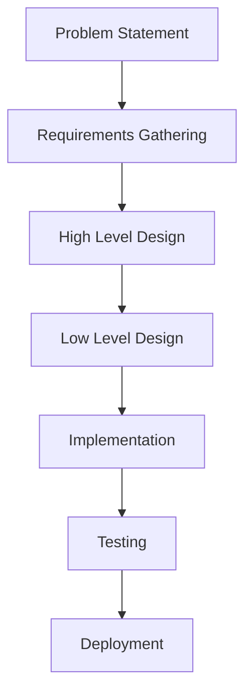
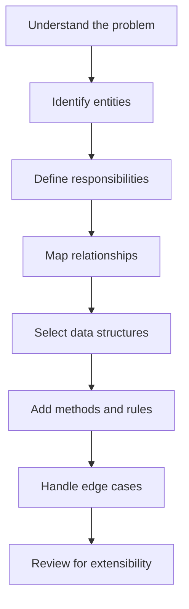

## What LLD means

At its core, LLD answers questions like:

* What are the entities in the system?
* What responsibility should each class own?
* How do objects communicate with each other?
* Which design patterns should be used?
* Which data structures best fit the problem?
* How can the code stay clean, modular, and reusable?

This makes LLD a very important part of software development because it turns an abstract idea into something that can be implemented directly.

---

## Scope of LLD

This section is only the **introduction** to LLD.
It is meant to set the foundation before we go into each topic separately.

### In scope

* meaning of LLD
* why LLD is important
* relationship between LLD, HLD, and DSA
* role of LLD in software development
* role of LLD in interviews
* basic mindset required for solving LLD problems

### Out of scope

* detailed explanation of design patterns
* deep dive into OOP principles
* UML diagrams in detail
* class diagram construction
* sequence diagram design
* full implementation of system design problems
* advanced scalability and architecture topics

---

## Why LLD matters

LLD is important because real software systems are made of many small parts, and those parts must work together in a clean and predictable way.

A good LLD helps in building systems that are:

| Quality      | Meaning                                          |
| ------------ | ------------------------------------------------ |
| Scalable     | The design can grow with new features            |
| Maintainable | The code is easy to update and debug             |
| Reusable     | Common logic can be used in multiple places      |
| Modular      | Each part has a clear responsibility             |
| Testable     | Individual pieces can be verified independently  |
| Flexible     | Changes can be made without rewriting everything |

Without proper LLD, software often becomes hard to understand, tightly coupled, and difficult to extend.

---

## Where LLD fits in software development

LLD comes after the high-level understanding of the problem and before detailed implementation.

### Simple interpretation

* **Problem Statement**: What needs to be built?
* **HLD**: What will the overall system look like?
* **LLD**: How will each module be designed?
* **Implementation**: How will the final code be written?

---

## LLD vs HLD vs DSA

These three terms are connected, but they are not the same.

| Aspect         | HLD                                   | LLD                           | DSA                            |
| -------------- | ------------------------------------- | ----------------------------- | ------------------------------ |
| Full form      | High Level Design                     | Low Level Design              | Data Structures and Algorithms |
| Focus          | Overall system architecture           | Detailed component design     | Efficient problem solving      |
| Level          | Broad                                 | Detailed                      | Technical and algorithmic      |
| Output         | System blueprint                      | Class/module blueprint        | Optimized logic                |
| Example        | Choosing services, databases, scaling | Designing classes and methods | Using hash maps, trees, or BFS |
| Interview type | System design                         | OOP / design interviews       | Coding interviews              |

### Relationship between them

* **HLD** decides the big picture.
* **LLD** breaks that picture into modules and classes.
* **DSA** helps implement those modules efficiently.

---

## What LLD focuses on

LLD mainly deals with the following implementation-level details:

### 1. Classes and objects

Identify real-world entities and represent them as classes and objects.

### 2. Methods and responsibilities

Decide what each class should do and which methods it should expose.

### 3. Relationships

Define how classes relate to each other through association, aggregation, composition, or inheritance.

### 4. Interfaces and abstractions

Use abstraction to reduce dependency on concrete implementations.

### 5. Data structures

Choose appropriate structures such as arrays, lists, maps, queues, heaps, or trees.

### 6. Internal logic

Define the business rules and algorithmic flow inside each module.

### 7. Extensibility

Make sure the design can support future changes without major rewrites.

---

## Why interviewers care about LLD

LLD is frequently asked in interviews because it tests more than just syntax or coding speed. It shows how well you can think like a software engineer.

Interviewers use LLD to check whether you can:

* break a problem into logical parts
* assign clear responsibilities to classes
* apply OOP principles correctly
* manage dependencies properly
* choose the right data structures
* write code that is easy to extend
* design systems that behave well under change

In many companies, LLD questions are used to judge how well a candidate can move from a problem statement to a working design.

---

## Real-world example of LLD thinking

Suppose we want to design a **food delivery application**.

At HLD level, we may think about:

* user service
* restaurant service
* order service
* payment service
* delivery service

At LLD level, we start asking:

* What does an `Order` class contain?
* How should `Payment` be represented?
* What methods should `DeliveryAgent` have?
* How does `Restaurant` manage menus?
* How should discounts be applied?
* What happens if payment fails?

This is the actual mindset of LLD: moving from **system blocks** to **designing the inside of each block**.

---

## LLD design mindset

A good LLD is not created by writing classes randomly. It comes from a structured thought process.

### Questions to ask during LLD

* What are the important objects in this problem?
* Which class should own this behavior?
* Which fields are necessary?
* Which methods should be public or private?
* What can change in the future?
* How can I avoid tight coupling?
* Which parts should be reusable?

---

## Core properties of good LLD

A strong LLD usually has these characteristics:

| Property             | Description                                        |
| -------------------- | -------------------------------------------------- |
| Clear responsibility | Every class has a single well-defined job          |
| Loose coupling       | Classes depend as little as possible on each other |
| High cohesion        | Related logic stays together                       |
| Easy extension       | New features can be added safely                   |
| Easy testing         | Each module can be tested separately               |
| Readability          | The design is simple to understand                 |

---

## Why this introduction is important

Before learning patterns, diagrams, and full system problems, it is important to understand what LLD actually means and where it fits.

This introduction builds the foundation for later topics such as:

* object-oriented principles
* SOLID principles
* design patterns
* UML diagrams
* class diagram design
* sequence flow design
* interview problem solving

Once this base is clear, the remaining topics become much easier to understand.

---

## Summary

LLD is the detailed design phase where abstract system requirements are converted into concrete code-level structures.

### In one line:

* **HLD** = what the system looks like
* **LLD** = how each part works
* **DSA** = how each part is made efficient

LLD is important because it helps build software that is:

* maintainable
* reusable
* scalable
* modular
* easy to test and extend

This is why LLD is a core topic in both real-world development and technical interviews.

---

## What comes next

After this introduction, the next sections can cover:

* OOP basics
* SOLID principles
* UML diagrams
* design patterns
* class diagram design
* sequence diagrams
* system design case studies
