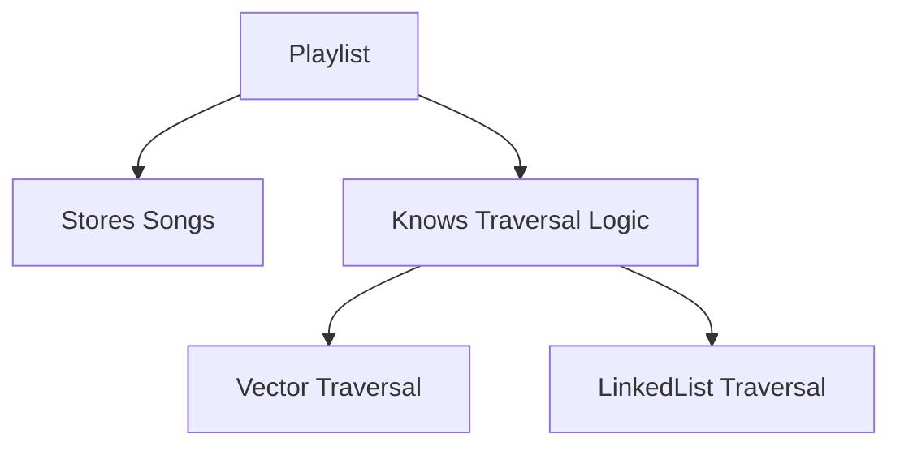
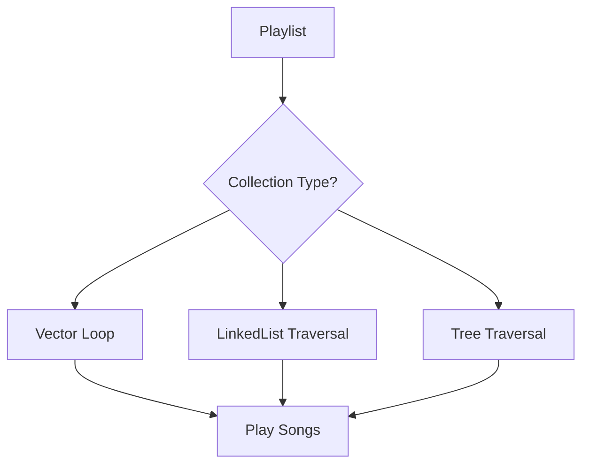
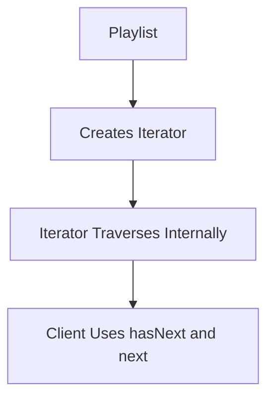
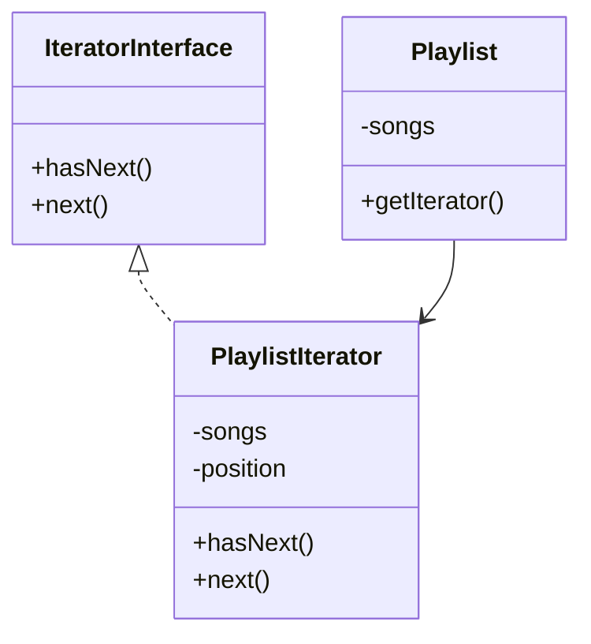
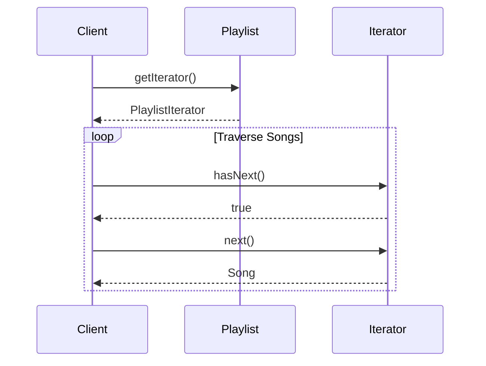
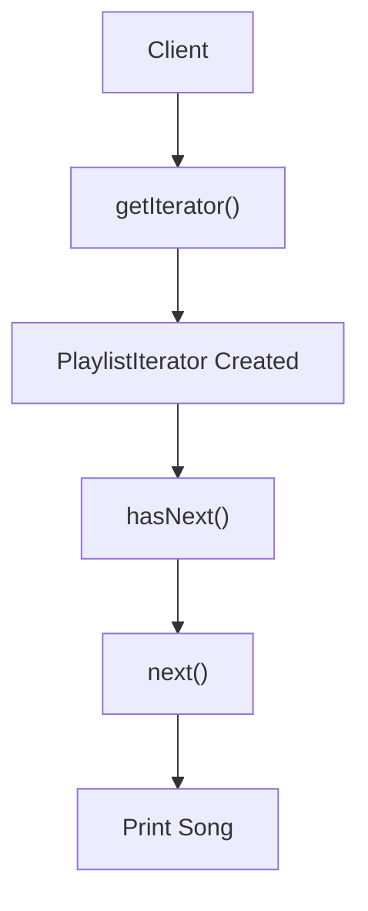
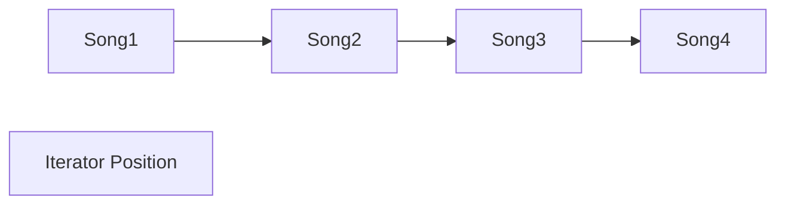

# Iterator Design Pattern

The **Iterator Design Pattern** is a **behavioral design pattern** that provides a way to access elements of a collection sequentially **without exposing the internal structure** of that collection.

In simple words:

> Iterator gives us a standard way to move through a collection one item at a time, without needing to know how the collection is actually stored internally.

---

# Introduction: Meet the Playlist

Imagine you are building a music player application.

At the center of the application is a `Playlist`.

The Playlist’s responsibilities are:

- storing songs
- adding songs
- removing songs
- playing songs

At first, this seems easy.

Suppose songs are stored inside a `Vector` or an `ArrayList`.

To play songs, the Playlist simply loops through them.

Everything works perfectly.

Until requirements change.

And in software engineering:

> Requirements ALWAYS change.

---

# 1. The Problem: Mixing Two Jobs in One

The initial design usually combines:

- collection management
- collection traversal

inside the same class.

This creates tightly coupled code.

---

# 1.1 The Simple All-in-One Playlist

Initially, the Playlist stores songs in a Vector.

The code may look conceptually like this:

```text id="9mbz9x"
for(i = 0; i < songs.length; i++) {
    play(songs[i]);
}
````

Seems fine.

But the design has a hidden flaw.

---

# 1.2 A Small Change Creates a Big Problem

Suppose the application becomes very popular.

Now users create:

* huge playlists
* frequent insertions
* frequent deletions

A `LinkedList` becomes better than a Vector for performance.

So developers replace the internal storage:

```text id="6dq6j6"
Vector  → LinkedList
```

This should have been an internal optimization.

But suddenly:

* loops break
* traversal logic changes
* methods fail

Why?

Because traversal logic depended on the storage structure.

---

# 1.3 Why the Old Traversal Breaks

A Vector supports:

```text id="0zjl2z"
songs[i]
```

because it allows direct index access.

But a LinkedList works differently.

Each node points to the next node.

Traversal requires:

```text id="7e3p2g"
current = current.next
```

instead of indexing.

This means:

* traversal logic changes completely
* Playlist code must be rewritten
* internal structure leaks everywhere

---

# 1.4 The Real Problem: Tight Coupling

The Playlist knows too much about:

* how songs are stored
* how songs are traversed

This violates a major design principle.

---

# Single Responsibility Principle (SRP)

A class should have only one reason to change.

But Playlist has TWO responsibilities:

| Responsibility   | Description        |
| ---------------- | ------------------ |
| Managing songs   | add/remove/update  |
| Traversing songs | looping/navigation |

These should be separated.

---

# The Core Design Flaw



Playlist becomes bloated and fragile.

---

# 2. The Solution: Iterator Pattern

The Iterator Pattern extracts traversal logic into a separate object.

Instead of Playlist knowing HOW to traverse:

* Playlist delegates traversal
* Iterator becomes the navigator

---

# Formal Definition

The Iterator Design Pattern is a behavioral pattern that provides a way to access elements of a collection sequentially without exposing its underlying structure.

---

# Core Idea

Separate:

| Concern    | Responsibility      |
| ---------- | ------------------- |
| Collection | storing elements    |
| Iterator   | traversing elements |

---

# Analogy: GPS Navigator

Think about driving.

You:

* choose destination
* control the car

GPS:

* knows the roads
* tells you next direction

Similarly:

| Object   | Role                 |
| -------- | -------------------- |
| Playlist | owns songs           |
| Iterator | knows traversal path |

Playlist no longer needs to know internal structure.

---

# 2.1 Delegation of Traversal

Instead of:

```text id="eqwv4k"
Playlist traverses songs itself
```

we do:

```text id="i9t9gw"
Playlist asks Iterator to traverse
```

---

# 2.2 The Iterator Contract

The iterator usually exposes two simple methods.

---

## hasNext()

Checks:

> “Is another element available?”

---

## next()

Returns:

> “Give me the next element.”

---

# Universal Traversal Interface

This is the beauty of Iterator.

No matter whether data is stored in:

* Array
* Vector
* LinkedList
* Tree
* Graph
* HashMap

the client always uses:

```text id="kkcvta"
hasNext()
next()
```

The traversal complexity is hidden.

---

# 3. Before Iterator vs After Iterator

---

# BEFORE: Coupled Design

```text id="6vwtqb"
if collection is Vector:
    use for loop

else if collection is LinkedList:
    use node traversal

else if collection is Tree:
    use recursion
```

Problems:

* huge if/else blocks
* tightly coupled code
* difficult maintenance

---

# BEFORE Flowchart



Playlist becomes responsible for everything.

---

# AFTER: Iterator-Based Design

```text id="hzwxj9"
iterator = playlist.getIterator()

while(iterator.hasNext()) {
    song = iterator.next()
    play(song)
}
```

Now Playlist doesn’t care about storage structure.

---

# AFTER Flowchart



Clean. Decoupled. Flexible.

---

# 4. Structure of Iterator Pattern

The pattern usually contains:

| Component            | Responsibility         |
| -------------------- | ---------------------- |
| Iterator Interface   | traversal operations   |
| Concrete Iterator    | actual traversal logic |
| Aggregate/Collection | stores items           |
| Concrete Collection  | returns iterator       |
| Client               | uses iterator          |

---

# UML Diagram



---

# 5. Step-by-Step Working

Let’s understand the complete flow.

---

# Step 1: Client asks for iterator

```text id="lu4i7n"
iterator = playlist.getIterator()
```

---

# Step 2: Playlist creates iterator

Iterator receives:

* collection reference
* starting position

---

# Step 3: Client loops

```text id="w4lzyh"
while(iterator.hasNext())
```

---

# Step 4: Iterator internally navigates

Iterator:

* checks next item
* maintains position
* hides traversal complexity

---

# Step 5: Client receives elements

```text id="t8w0b5"
song = iterator.next()
```

---

# Full Sequence Diagram



---

# 6. Java Example

---

# Step 1: Song class

```java
class Song {
    private String name;

    public Song(String name) {
        this.name = name;
    }

    public String getName() {
        return name;
    }
}
```

---

# Step 2: Iterator Interface

```java
interface Iterator {
    boolean hasNext();
    Song next();
}
```

---

# Step 3: Playlist Iterator

```java
import java.util.List;

class PlaylistIterator implements Iterator {
    private List<Song> songs;
    private int position = 0;

    public PlaylistIterator(List<Song> songs) {
        this.songs = songs;
    }

    public boolean hasNext() {
        return position < songs.size();
    }

    public Song next() {
        return songs.get(position++);
    }
}
```

---

# Step 4: Playlist

```java
import java.util.ArrayList;
import java.util.List;

class Playlist {
    private List<Song> songs = new ArrayList<>();

    public void addSong(Song song) {
        songs.add(song);
    }

    public Iterator getIterator() {
        return new PlaylistIterator(songs);
    }
}
```

---

# Step 5: Client

```java
public class Main {
    public static void main(String[] args) {

        Playlist playlist = new Playlist();

        playlist.addSong(new Song("Believer"));
        playlist.addSong(new Song("Shape of You"));
        playlist.addSong(new Song("Faded"));

        Iterator iterator = playlist.getIterator();

        while(iterator.hasNext()) {
            Song song = iterator.next();
            System.out.println(song.getName());
        }
    }
}
```

---

# Java Execution Flow



---

```cpp
#include <iostream>
#include <vector>
using namespace std;

class Iterator {
public:
    virtual bool hasNext() = 0;
    virtual int next() = 0;
};

class NumberIterator : public Iterator {
private:
    vector<int> numbers;
    int position = 0;

public:
    NumberIterator(vector<int> nums) {
        numbers = nums;
    }

    bool hasNext() {
        return position < numbers.size();
    }

    int next() {
        return numbers[position++];
    }
};

class NumberCollection {
private:
    vector<int> numbers;

public:
    void add(int num) {
        numbers.push_back(num);
    }

    Iterator* getIterator() {
        return new NumberIterator(numbers);
    }
};

int main() {

    NumberCollection collection;

    collection.add(10);
    collection.add(20);
    collection.add(30);

    Iterator* iterator = collection.getIterator();

    while(iterator->hasNext()) {
        cout << iterator->next() << endl;
    }

    return 0;
}
```
```python
class Iterator:
    def has_next(self):
        pass

    def next(self):
        pass


class PlaylistIterator(Iterator):

    def __init__(self, songs):
        self.songs = songs
        self.position = 0

    def has_next(self):
        return self.position < len(self.songs)

    def next(self):
        song = self.songs[self.position]
        self.position += 1
        return song


class Playlist:

    def __init__(self):
        self.songs = []

    def add_song(self, song):
        self.songs.append(song)

    def get_iterator(self):
        return PlaylistIterator(self.songs)


playlist = Playlist()

playlist.add_song("Believer")
playlist.add_song("Faded")
playlist.add_song("Shape of You")

iterator = playlist.get_iterator()

while iterator.has_next():
    print(iterator.next())
```

---

# 9. Internal State of Iterator

The iterator maintains:

| State                | Purpose           |
| -------------------- | ----------------- |
| Current position     | tracks traversal  |
| Collection reference | knows source      |
| Traversal rules      | controls movement |

---

# Example Internal Movement



Iterator moves step-by-step.

---

# 10. Types of Iterators

---

# Forward Iterator

Moves left → right.

Most common type.

---

# Reverse Iterator

Moves backward.

Useful in:

* undo systems
* reverse playlists

---

# Bidirectional Iterator

Can move:

* forward
* backward

---

# Recursive Iterator

Used for:

* trees
* nested structures

---

# External vs Internal Iterator

| Type              | Control                       |
| ----------------- | ----------------------------- |
| External Iterator | client controls traversal     |
| Internal Iterator | collection controls traversal |

---

# Example

External:

```text id="5m8k9r"
while(iterator.hasNext())
```

Internal:

```text id="l04ocq"
collection.forEach()
```

---

# 11. Benefits of Iterator Pattern

---

# 11.1 Decouples Traversal from Collection

Collection stores data.

Iterator traverses data.

Clear separation.

---

# 11.2 Supports Multiple Traversal Strategies

Same collection can provide:

* forward iterator
* reverse iterator
* filtered iterator

---

# 11.3 Encapsulation

Client never sees:

* nodes
* pointers
* indexes
* tree recursion

Internal structure stays hidden.

---

# 11.4 Open/Closed Principle

New iterators can be added without changing collection code.

---

# 11.5 Cleaner Code

Traversal becomes standardized:

```text id="d5h9nl"
hasNext()
next()
```

instead of custom loops everywhere.

---

# 12. Real-World Examples

---

# 12.1 Music Playlist

Iterator navigates songs.

---

# 12.2 Browser History

Forward/backward traversal.

---

# 12.3 Tree Traversal

* DFS iterator
* BFS iterator

---

# 12.4 Database ResultSet

Database rows are iterated one-by-one.

---

# 12.5 Social Media Feed

Iterator loads posts sequentially.

---

# 12.6 File System Traversal

Iterator navigates directories/files.

---

# 13. Iterator in Modern Languages

Many languages already use Iterator internally.

---

# Java

```java
Iterator<Integer> iterator = list.iterator();
```

---

# Python

```python
for item in collection:
```

Python internally uses iterators.

---

# C++

```cpp
vector<int>::iterator it
```

---

# JavaScript

```javascript id="t6f6kk"
for (const item of collection)
```

---

# Important Insight

Most loops in modern programming are powered by Iterator concepts internally.

---

# 14. Iterator vs Indexing

| Feature              | Indexing  | Iterator  |
| -------------------- | --------- | --------- |
| Depends on structure | Yes       | No        |
| Works with trees     | Difficult | Easy      |
| Encapsulation        | Weak      | Strong    |
| Flexible traversal   | Limited   | Excellent |

---

# 15. Iterator vs Visitor

These patterns are different.

| Pattern  | Goal                          |
| -------- | ----------------------------- |
| Iterator | Navigate collection           |
| Visitor  | Perform operations on objects |

---

# 16. Drawbacks of Iterator

| Drawback               | Explanation                                          |
| ---------------------- | ---------------------------------------------------- |
| Extra objects          | More classes introduced                              |
| Slight complexity      | Small collections may not need it                    |
| Synchronization issues | Collection changes during iteration can cause issues |

---

# 17. Common Mistakes

| Mistake                               | Problem                              |
| ------------------------------------- | ------------------------------------ |
| Exposing collection internals         | Breaks encapsulation                 |
| Modifying collection during iteration | Can corrupt traversal                |
| Using iterator unnecessarily          | Overengineering for tiny collections |

---

# 18. Advanced Iterators

---

# Lazy Iterator

Loads data only when needed.

Used in:

* streams
* generators
* pagination

---

# Filter Iterator

Only returns matching items.

Example:

* only favorite songs

---

# Infinite Iterator

Never ends.

Used in:

* game loops
* random generators

---

# Composite Iterator

Traverses nested structures recursively.

Used with:

* Composite Pattern
* file systems

---

# 19. Iterator and SOLID Principles

| Principle | How Iterator Helps                     |
| --------- | -------------------------------------- |
| SRP       | separates traversal responsibility     |
| OCP       | new iterators can be added             |
| DIP       | clients depend on iterator abstraction |

---

# 20. Before vs After Iterator

| Without Iterator           | With Iterator            |
| -------------------------- | ------------------------ |
| traversal logic everywhere | centralized traversal    |
| tightly coupled loops      | flexible iterators       |
| hard to change collection  | easy replacement         |
| duplicated traversal code  | reusable iteration logic |

---

# 21. Key Takeaway

The Iterator Pattern is fundamentally about one idea:

> Separate the collection from the logic used to traverse the collection.

Instead of every class reinventing loops:

* traversal becomes reusable
* collections become flexible
* internal structures remain hidden

---

# Final Mental Model

Think of Iterator as:

> A smart navigator that knows how to move through a collection step by step, while keeping the internal map hidden from everyone else.

That is the true power of the Iterator Design Pattern.