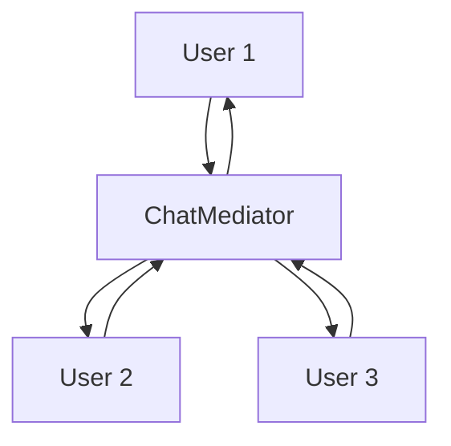
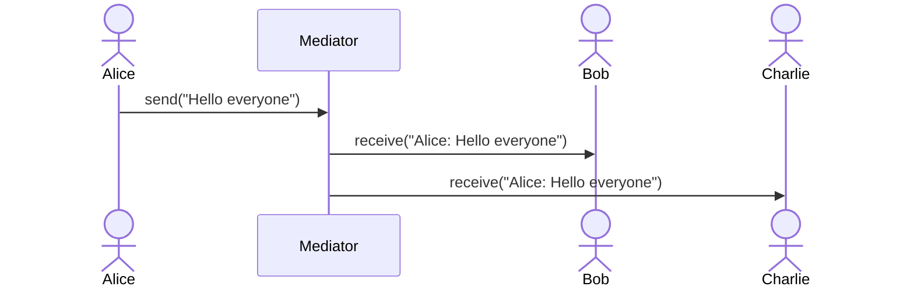
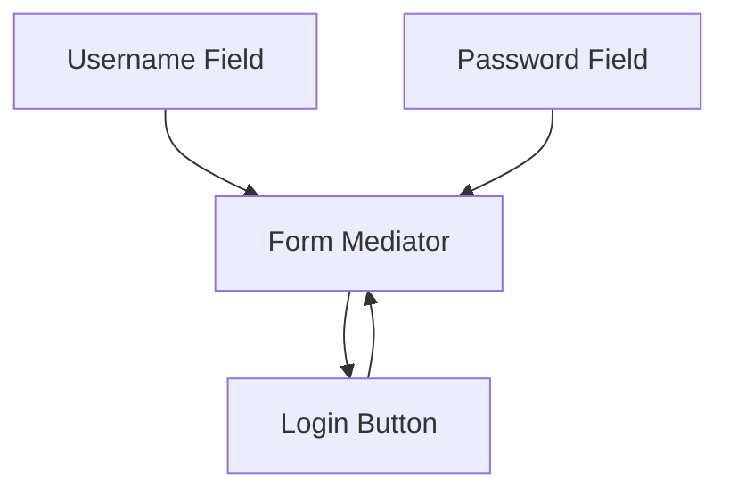
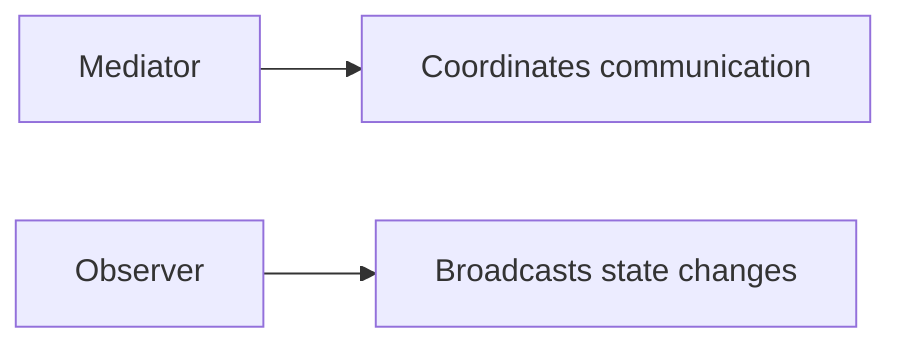
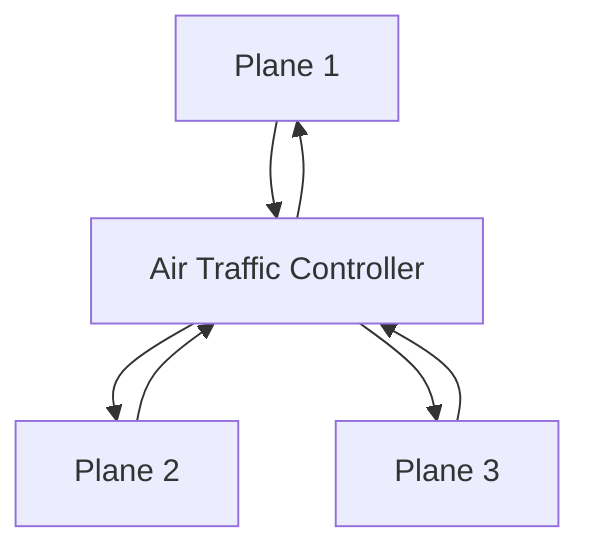

# Mediator Design Pattern

The **Mediator Design Pattern** is a behavioral design pattern that **encapsulates how a set of objects interact**.

Instead of letting objects communicate directly with each other, the pattern introduces a **mediator object** that coordinates all interactions.

This helps us:

- reduce chaotic dependencies
- avoid tight coupling
- centralize communication rules
- simplify object relationships
- make systems easier to maintain

---

# Introduction: From Chaos to Coordination

Imagine a busy intersection with no traffic lights.

Every car tries to move independently.  
Every driver makes their own decision.  
The result is chaos.

Now imagine a traffic controller standing in the middle and telling each car when to move.

That is the Mediator pattern.

It replaces a tangled web of direct connections with a central coordinator.

---

# The Problem: A Web of Tangled Connections

When objects communicate directly with each other, the number of relationships grows very fast.

If one object must talk to many others, it needs references to all of them.

If there are `n` objects, then each object may need up to `n - 1` references.

This creates a complicated, brittle design.

---

## Why direct communication becomes a problem

| Problem | Description |
|--------|-------------|
| Tight coupling | Objects depend heavily on each other |
| Hard maintenance | A change in one object affects many others |
| Poor scalability | Adding a new object increases complexity everywhere |
| Complex dependencies | Relationships become difficult to track |
| Hard testing | Each object is tied to many others |

---

## Direct communication diagram

```mermaid
flowchart TD
    A[Object 1] --> B[Object 2]
    A --> C[Object 3]
    A --> D[Object 4]
    B --> A
    B --> C
    B --> D
    C --> A
    C --> B
    C --> D
    D --> A
    D --> B
    D --> C
````

As more objects are added, the network becomes messy.

---

# Core Idea of Mediator

The Mediator pattern introduces a central object called the **Mediator**.

All other objects become **Colleagues**.

They no longer talk to each other directly.
They talk to the mediator, and the mediator decides how to route or coordinate the interaction.

---

## Formal definition

The Mediator pattern defines an object that encapsulates how a set of objects interact.

It promotes loose coupling by preventing objects from referring to each other directly, and lets them communicate through the mediator instead.

---

# Main participants

| Role               | Meaning                         | Chat Room Example |
| ------------------ | ------------------------------- | ----------------- |
| Mediator           | Central coordinator             | Chat room server  |
| Colleague          | Participating object            | User              |
| Concrete Mediator  | Real implementation of mediator | `ChatMediator`    |
| Concrete Colleague | Real participant object         | `User`            |

---

## UML structure

```mermaid
classDiagram

    class Mediator {
        +sendMessage
        +register
    }

    class ChatMediator {
        -users
        +sendMessage
        +register
    }

    class Colleague {
        +send
        +receive
    }

    class User {
        -name
        -mediator
        +send
        +receive
    }

    Mediator <|.. ChatMediator
    Colleague <|.. User
    ChatMediator --> User
    User --> Mediator
```
---

# Why Mediator is useful

The mediator centralizes communication logic.

Instead of each object knowing about every other object, each object only knows:

* the mediator
* how to send a request to the mediator
* how to receive a response from the mediator

This dramatically reduces complexity.

---

# Real-world analogy: Chat Room

A chat application is one of the best examples of the Mediator pattern.

Suppose there are many users in a chat room.

Without a mediator:

* every user must know every other user
* private messaging becomes messy
* mute logic becomes scattered
* group communication becomes hard to manage

With a mediator:

* each user sends messages to the chat room
* the chat room decides where to deliver them
* mute rules, broadcast rules, and routing rules stay in one place

---

## Chat room flow



---

# How Mediator simplifies the system

The object relationships become:

* many colleagues know one mediator
* mediator knows all colleagues
* colleagues do not know each other directly

That means:

* less coupling
* easier changes
* simpler object classes

---

# Direct communication vs Mediator communication

| Aspect            | Direct Communication            | Mediator                        |
| ----------------- | ------------------------------- | ------------------------------- |
| Object references | Many references between objects | Each object knows only mediator |
| Responsibility    | Spread across many classes      | Centralized in mediator         |
| Maintenance       | Harder                          | Easier                          |
| Scalability       | Poor                            | Better                          |
| Coupling          | Tight                           | Loose                           |

---

# Why this improves design

If a new colleague joins the system:

* direct communication requires changes in many classes
* mediator communication usually requires only registration with the mediator

If a new communication rule is added:

* direct communication spreads the logic everywhere
* mediator communication updates one central place

---

# Chat Room Example

A chat room mediator can manage:

* user registration
* public broadcasts
* private messages
* mute lists
* join/leave notifications

---

## Without Mediator

If users talk directly:

* each user needs references to every other user
* mute logic is duplicated
* message routing is scattered

This creates a tangled system.

---

## With Mediator

If users communicate through a mediator:

* users send message requests to mediator
* mediator decides delivery
* message rules are centralized

This is far cleaner.

---

# Example communication flow



---

# Why mediator is not just a broadcaster

Mediator is not only for broadcasting messages.

It can also:

* enforce rules
* coordinate workflows
* validate actions
* resolve conflicts
* route commands based on context

That makes it much broader than a simple notifier.

---

# Mediator and loose coupling

One of the biggest advantages of Mediator is loose coupling.

| Before                        | After                                 |
| ----------------------------- | ------------------------------------- |
| Each object knows many others | Each object knows only mediator       |
| Changes ripple through system | Changes stay centralized              |
| Hard to reuse objects         | Easier to reuse objects independently |

---

# Example features managed centrally

In a chat room, mediator may manage:

* who is online
* who muted whom
* who should receive a message
* whether a message is public or private

The user objects remain simple.

---

# Mediator Pattern structure

The mediator usually has:

* a method for registering colleagues
* a method for receiving requests from colleagues
* logic for routing or coordinating communication

The colleague usually has:

* a reference to the mediator
* a method to send messages
* a method to receive messages

---

# The role of colleagues

Colleagues should not depend on each other directly.

Instead:

* a colleague sends data or requests to the mediator
* the mediator handles the interaction

This is what keeps the code clean.

---

# Example: Chat mediator in action

Suppose:

* Alice sends a message
* Bob is muted
* Charlie is not muted

The mediator:

* receives Alice’s message
* checks delivery rules
* sends it to Charlie
* skips Bob

The logic stays in one place.

---

# Stateful coordination

Mediator is especially useful when interactions are stateful.

Examples:

* form field validation
* UI button enable/disable rules
* chat applications
* multiplayer games
* workflow engines

---

# Real-world examples

| Domain          | Mediator Example                              |
| --------------- | --------------------------------------------- |
| Chat app        | Chat room coordinates messages                |
| GUI             | Form mediator coordinates widget interactions |
| Air traffic     | Control tower coordinates aircraft            |
| Matchmaking     | Game server coordinates players               |
| Workflow engine | Central process manager routes tasks          |
| Dialog boxes    | Button states and input field interactions    |

---

# Example: GUI form

A login form may have:

* username field
* password field
* login button
* remember me checkbox

Without mediator:

* every field directly knows about every other field

With mediator:

* the form controller coordinates state changes

For example:

* login button becomes enabled only when username and password are valid

---

## GUI mediator diagram



---

# Mediator vs Observer

These two patterns are often confused.

They may both involve a central object and multiple participants.

But their intent is different.

| Aspect       | Mediator                                           | Observer                            |
| ------------ | -------------------------------------------------- | ----------------------------------- |
| Main goal    | Coordinate interactions                            | Notify observers of changes         |
| Relationship | Many-to-one-to-many communication through mediator | One subject notifies many observers |
| Focus        | Interaction control                                | Event notification                  |
| Example      | Chat room                                          | YouTube subscriber updates          |

---

## Simple distinction

### Observer

One object changes, and many observers are notified.

### Mediator

Many objects interact through a central coordinator.

---

## Mediator vs Observer diagram



---

# Mediator vs Facade

These patterns also look similar, but their goals differ.

| Aspect   | Mediator                         | Facade                              |
| -------- | -------------------------------- | ----------------------------------- |
| Purpose  | Coordinate object interactions   | Simplify access to a subsystem      |
| Focus    | Communication between colleagues | Easy entry point to subsystem       |
| Behavior | Colleagues interact via mediator | Client calls facade to perform work |

---

# Why Mediator improves SRP

Without mediator:

* objects handle their own behavior
* plus they manage communication with others
* plus they manage cross-object rules

That is too much responsibility.

With mediator:

* communication logic is moved out
* each colleague becomes focused
* mediator handles interaction rules

This is a strong SRP improvement.

---

# Benefits of Mediator Pattern

| Benefit            | Description                                   |
| ------------------ | --------------------------------------------- |
| Loose coupling     | Objects do not depend directly on each other  |
| Centralized logic  | Interaction rules live in one place           |
| Easier maintenance | Communication changes are easier to manage    |
| Better reuse       | Colleague objects become simpler and reusable |
| Reduced complexity | Eliminates tangled object references          |
| Easier extension   | New colleagues can be added with less impact  |

---

# Drawbacks of Mediator Pattern

| Drawback                  | Description                                       |
| ------------------------- | ------------------------------------------------- |
| Mediator can become large | A “god object” risk                               |
| More indirection          | Debugging may require following mediator flow     |
| Central bottleneck        | Too much logic in one place can be hard to manage |

---

# Common mistakes

| Mistake                                     | Problem                                    |
| ------------------------------------------- | ------------------------------------------ |
| Putting too much logic into mediator        | Mediator becomes huge and hard to maintain |
| Letting colleagues talk directly            | Breaks the pattern                         |
| Using mediator for simple communication     | Overengineering                            |
| Confusing mediator with observer            | Different intent                           |
| Failing to define clear communication rules | Leads to messy coordination                |

---

# When to use Mediator Pattern

Use it when:

* many objects interact in complex ways
* direct communication creates tangled dependencies
* you want to centralize coordination
* UI components need to coordinate
* chat or workflow rules should be managed in one place

---

# When not to use Mediator Pattern

Avoid it when:

* there are only a few objects
* communication is simple
* the mediator would become too large
* direct communication is already clean and manageable

---

# Example: Chat Room

```cpp
#include <iostream>
#include <vector>
#include <string>
using namespace std;

class Mediator {
public:
    virtual void sendMessage(const string& message, const string& sender) = 0;
    virtual void registerUser(class User* user) = 0;
    virtual ~Mediator() = default;
};

class User {
protected:
    Mediator* mediator;
    string name;

public:
    User(const string& name, Mediator* mediator) : name(name), mediator(mediator) {}

    virtual void send(const string& message) = 0;
    virtual void receive(const string& message) = 0;
    string getName() const { return name; }
};

class ChatMediator : public Mediator {
private:
    vector<User*> users;

public:
    void registerUser(User* user) override {
        users.push_back(user);
    }

    void sendMessage(const string& message, const string& sender) override {
        for (User* user : users) {
            if (user->getName() != sender) {
                user->receive(sender + ": " + message);
            }
        }
    }
};

class ChatUser : public User {
public:
    ChatUser(const string& name, Mediator* mediator) : User(name, mediator) {}

    void send(const string& message) override {
        mediator->sendMessage(message, name);
    }

    void receive(const string& message) override {
        cout << name << " received: " << message << endl;
    }
};

int main() {
    ChatMediator mediator;

    ChatUser alice("Alice", &mediator);
    ChatUser bob("Bob", &mediator);
    ChatUser charlie("Charlie", &mediator);

    mediator.registerUser(&alice);
    mediator.registerUser(&bob);
    mediator.registerUser(&charlie);

    alice.send("Hello everyone");
    bob.send("Hi Alice");

    return 0;
}
```
```java
import java.util.ArrayList;
import java.util.List;

interface Mediator {
    void sendMessage(String message, String sender);
    void registerUser(User user);
}

abstract class User {
    protected Mediator mediator;
    protected String name;

    public User(String name, Mediator mediator) {
        this.name = name;
        this.mediator = mediator;
    }

    public String getName() {
        return name;
    }

    public abstract void send(String message);
    public abstract void receive(String message);
}

class ChatMediator implements Mediator {
    private List<User> users = new ArrayList<>();

    public void registerUser(User user) {
        users.add(user);
    }

    public void sendMessage(String message, String sender) {
        for (User user : users) {
            if (!user.getName().equals(sender)) {
                user.receive(sender + ": " + message);
            }
        }
    }
}

class ChatUser extends User {
    public ChatUser(String name, Mediator mediator) {
        super(name, mediator);
    }

    public void send(String message) {
        mediator.sendMessage(message, name);
    }

    public void receive(String message) {
        System.out.println(name + " received: " + message);
    }
}

public class Main {
    public static void main(String[] args) {
        ChatMediator mediator = new ChatMediator();

        ChatUser alice = new ChatUser("Alice", mediator);
        ChatUser bob = new ChatUser("Bob", mediator);
        ChatUser charlie = new ChatUser("Charlie", mediator);

        mediator.registerUser(alice);
        mediator.registerUser(bob);
        mediator.registerUser(charlie);

        alice.send("Hello everyone");
        bob.send("Hi Alice");
    }
}
```
```python
from abc import ABC, abstractmethod

class Mediator(ABC):
    @abstractmethod
    def send_message(self, message, sender):
        pass

    @abstractmethod
    def register_user(self, user):
        pass

class User(ABC):
    def __init__(self, name, mediator):
        self.name = name
        self.mediator = mediator

    @abstractmethod
    def send(self, message):
        pass

    @abstractmethod
    def receive(self, message):
        pass

class ChatMediator(Mediator):
    def __init__(self):
        self.users = []

    def register_user(self, user):
        self.users.append(user)

    def send_message(self, message, sender):
        for user in self.users:
            if user.name != sender:
                user.receive(f"{sender}: {message}")

class ChatUser(User):
    def send(self, message):
        self.mediator.send_message(message, self.name)

    def receive(self, message):
        print(f"{self.name} received: {message}")

mediator = ChatMediator()

alice = ChatUser("Alice", mediator)
bob = ChatUser("Bob", mediator)
charlie = ChatUser("Charlie", mediator)

mediator.register_user(alice)
mediator.register_user(bob)
mediator.register_user(charlie)

alice.send("Hello everyone")
bob.send("Hi Alice")
```


---

## C++ explanation

* `Mediator` defines the communication contract
* `ChatMediator` controls message routing
* `User` is the colleague abstraction
* `ChatUser` sends and receives through mediator
* users do not communicate directly

---

## Java explanation

* the mediator stores the user list
* each user sends messages through the mediator
* message delivery stays centralized
* the colleague classes remain simple

---

## Python explanation

* `ChatMediator` coordinates the room
* users only know the mediator
* users are decoupled from each other
* the logic is centralized and easy to manage

---

# Sequence Diagram: Chat Room Message Flow


---

# Another real-world example: Air traffic control

An air traffic controller coordinates:

* takeoff
* landing
* runway allocation
* communication between planes

Planes do not coordinate directly with each other.
They use the controller.

That is the Mediator pattern.

---

## Air traffic control diagram



---

# Another real-world example: UI form controller

A form mediator can:

* enable or disable buttons
* validate fields
* trigger actions based on input
* coordinate related widgets

This is common in GUI systems.

---

# Benefits of Mediator

| Benefit                  | Description                                   |
| ------------------------ | --------------------------------------------- |
| Loose coupling           | Colleagues do not depend on each other        |
| Centralized coordination | Interaction logic is in one place             |
| Better maintainability   | Easier to change communication rules          |
| Simpler colleagues       | Objects focus on their own behavior           |
| Easier extension         | New colleagues can be plugged in more cleanly |

---

# Drawbacks of Mediator

| Drawback            | Description                               |
| ------------------- | ----------------------------------------- |
| Mediator complexity | Can become too large                      |
| Hard to trace       | Extra layer of indirection                |
| Central dependency  | The mediator becomes a critical component |

---

# Common mistakes

| Mistake                                          | Problem                        |
| ------------------------------------------------ | ------------------------------ |
| Letting colleagues directly reference each other | Breaks the pattern             |
| Putting all business logic in mediator           | Makes mediator a god object    |
| Using mediator for trivial communication         | Unnecessary complexity         |
| Confusing with Observer                          | Different purpose and behavior |
| Failing to keep mediator focused                 | Harder to maintain             |

---

# Mediator vs Observer

| Aspect        | Mediator                               | Observer                            |
| ------------- | -------------------------------------- | ----------------------------------- |
| Main purpose  | Coordinate complex interactions        | Notify dependents of state changes  |
| Communication | Many objects talk through one mediator | One subject notifies many observers |
| Intent        | Manage collaboration                   | Broadcast updates                   |

---

# Mediator vs Facade

| Aspect  | Mediator                             | Facade                            |
| ------- | ------------------------------------ | --------------------------------- |
| Purpose | Manage object interactions           | Simplify a subsystem              |
| Focus   | Collaboration logic                  | Simple access to complex backend  |
| Usage   | Objects communicate through mediator | Client calls simplified interface |

---

# Mediator and SOLID

| Principle | How Mediator helps                                 |
| --------- | -------------------------------------------------- |
| SRP       | Removes communication logic from colleagues        |
| OCP       | New colleagues can be added with less modification |
| DIP       | Colleagues depend on mediator abstraction          |

---

# Summary

The Mediator Pattern centralizes complex communication between objects.

It:

* reduces direct dependencies
* keeps objects from knowing too much about each other
* moves interaction logic into one place
* improves maintainability and flexibility

It is especially useful for:

* chat systems
* UI coordination
* workflow systems
* matchmaking systems
* control systems

---

# Final takeaway

The Mediator Pattern is about this simple idea:

> Do not let every object talk to every other object directly.
> Put a mediator in the middle and let it coordinate the interaction.

That gives you:

* less chaos
* less coupling
* cleaner code
* easier maintenance

It is one of the best patterns for systems with many interacting objects.