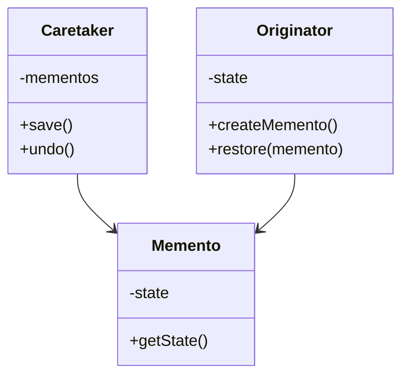
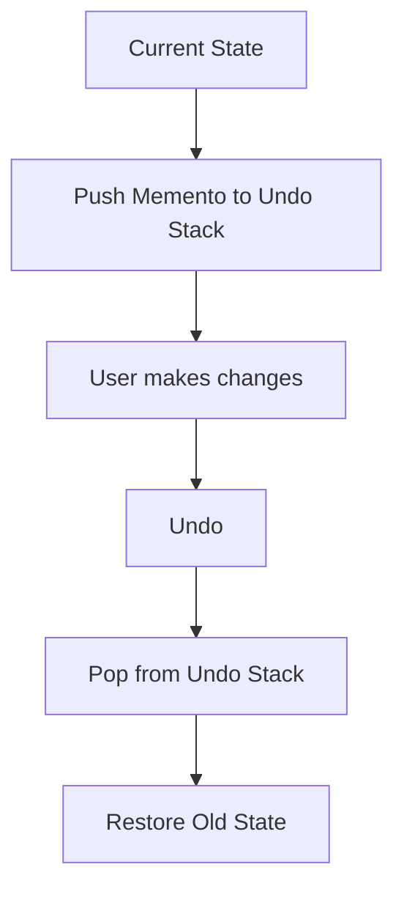
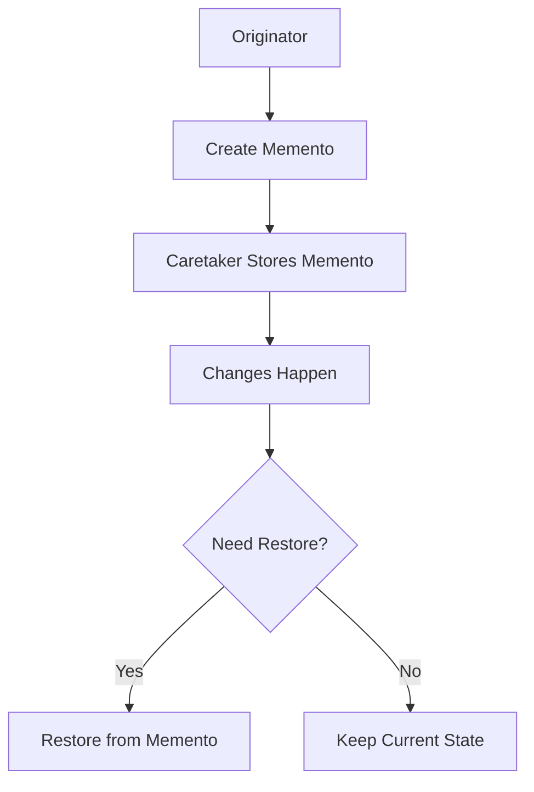
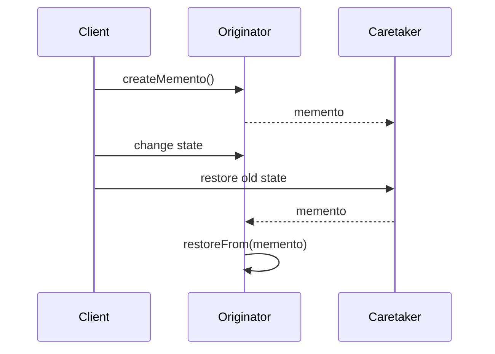

# Memento Design Pattern

The **Memento Design Pattern** is a behavioral design pattern that lets you save and restore an object’s previous state.

Its main purpose is to:

- capture an object's state
- store it safely outside the object
- restore it later if needed
- support undo/redo behavior
- create checkpoints in an application's lifecycle

---

# Introduction: The “Oops!” Moment in Software

We have all made changes and immediately wished we could go back.

That is exactly what the Memento pattern solves.

It acts like an **undo button** for objects.

You take a **snapshot** of an object at a specific point in time.  
If something goes wrong later, you can restore the object to that snapshot.

---

# Why this pattern matters

Many applications need the ability to:
- undo an edit
- rollback a transaction
- save versions
- recover from mistakes
- restore previous configuration

The Memento pattern gives us a clean way to do that without violating encapsulation.

---

# Core Idea

The Memento pattern saves an object’s internal state without exposing the details of that state.

This is important because the internal state should remain protected from outside code.

---

# Formal Definition

The Memento pattern captures and externalizes an object’s internal state without violating encapsulation, so that the object can later be restored to this state.

---

# Main Participants

The pattern has three important roles:

| Role | Responsibility | Analogy |
|------|----------------|---------|
| Originator | Object whose state is saved | The application/document being edited |
| Memento | Snapshot of the state | A screenshot |
| Caretaker | Stores and retrieves snapshots | A photo album / backup manager |

---

# The Three Key Players

---

## 1. Originator

The Originator is the object whose state we want to save.

It should know:
- how to create a memento
- how to restore itself from a memento

It should **not** expose its internal state to everyone.

---

## 2. Memento

The Memento is the snapshot.

It stores the saved state of the Originator.

It should be:
- opaque to the caretaker
- protected from modification
- used only for restoration

The caretaker should not “look inside” the memento.

---

## 3. Caretaker

The Caretaker stores mementos safely.

It may keep:
- one memento for rollback
- many mementos for undo/redo history

The caretaker:
- stores snapshots
- retrieves snapshots
- does not modify the snapshot contents

---

# Simple Analogy

Think about taking a screenshot.

| Role | Analogy |
|------|---------|
| Originator | The screen you capture |
| Memento | The screenshot file |
| Caretaker | The folder where screenshots are saved |

You can save the screenshot now and use it later to go back.

---

# Why Memento is useful

Memento is very useful when:
- changes must be reversible
- the object should not expose its internal data
- history tracking is needed
- rollback is required
- checkpoints are needed

---

# The Main Problem It Solves

Suppose we are updating a database record.

For example:
- roll number changes from 1001 to 1002
- name changes from Aditya to Abhay

What if the program crashes after updating only one field?

Now the object is in an inconsistent state.

Memento lets us restore the old state.

---

# Why this is important

Without Memento:
- partial updates may corrupt data
- undo becomes complicated
- rollback logic becomes messy
- internal state may leak into other parts of the system

With Memento:
- you can restore the old snapshot
- the originator stays encapsulated
- rollback becomes cleaner

---

# State Snapshot Concept

The central idea is simple:

> Save the state at one moment, and restore it later if needed.

```mermaid
flowchart TD
    A[Originator Current State] --> B[Create Memento]
    B --> C[Caretaker Stores Memento]
    C --> D[State Changes]
    D --> E{Need rollback?}
    E -->|Yes| F[Restore from Memento]
    E -->|No| G[Keep new state]
````

---

# Real-World Example: Database Transaction

Imagine a transaction that updates a user record.

Steps:

1. Save the current state.
2. Try to perform the update.
3. If anything fails, restore the previous state.
4. If everything succeeds, discard the snapshot.

This ensures atomicity:

* either everything succeeds
* or nothing changes

---

# Transaction Flow Diagram

```mermaid
flowchart TD
    A[Start Transaction] --> B[Take Snapshot]
    B --> C[Apply Changes]
    C --> D{Success?}
    D -->|Yes| E[Commit and discard snapshot]
    D -->|No| F[Rollback using snapshot]
```

---

# Memento and Encapsulation

One of the most important benefits of Memento is this:

> It saves state without breaking encapsulation.

That means:

* external code cannot directly access the internal details
* only the originator understands how to restore itself
* the caretaker just stores the snapshot

This is a major design advantage.

---

# Structure Diagram



---

# When to Use Memento

Use Memento when:

* you want undo/redo
* you need rollback support
* you want to preserve checkpoints
* you want to restore previous object states
* you want to avoid exposing object internals

---

# Common Use Cases

| Domain          | Use Case                              |
| --------------- | ------------------------------------- |
| Text editor     | Undo typing                           |
| Graphic editor  | Undo drawing changes                  |
| Database system | Rollback transaction                  |
| Game state      | Save/load checkpoints                 |
| IDE/editor      | Restore previous config or code state |
| Versioning      | Keep historical snapshots             |

---

# Relationship with Undo/Redo

Memento is one of the cleanest ways to implement undo/redo.

### Undo

Move backward in history and restore a previous state.

### Redo

Move forward in history and restore a later state.

The caretaker may keep:

* a stack for undo
* another stack for redo

---

# Undo/Redo Flow



---

# Memento Design Rules

There are a few important design rules:

| Rule                                                    | Meaning                     |
| ------------------------------------------------------- | --------------------------- |
| Only Originator should know how to create/restore state | Keeps logic encapsulated    |
| Caretaker should not inspect memento contents           | Protects internal data      |
| Memento should represent a snapshot                     | Not a live object           |
| Memento should usually be immutable                     | Prevents accidental changes |

---

# Why immutability helps

If the memento is immutable:

* its contents cannot be changed after creation
* snapshots remain trustworthy
* restore operations are safer

That is usually the best practice.

---

# Database Example: Step by Step

Suppose we have a user record:

* name = Aditya
* roll number = 1001

We want to update it safely.

---

## Step 1: Create snapshot

Before making changes, the originator creates a memento.

---

## Step 2: Modify state

We try to update:

* name → Abhay
* roll number → 1002

---

## Step 3: Check for failure

If one update fails, the state becomes inconsistent.

---

## Step 4: Restore snapshot

We give the memento back to the originator, and it restores its old values.

That way the system returns to a consistent state.

---

# Benefits of Memento

| Benefit                 | Description                    |
| ----------------------- | ------------------------------ |
| Undo support            | Great for reversible actions   |
| Rollback                | Restores earlier safe state    |
| Encapsulation preserved | Internal data stays hidden     |
| Checkpoints             | Useful in long workflows       |
| Simple restoration      | Restore from a stored snapshot |

---

# Drawbacks of Memento

| Drawback               | Description                                     |
| ---------------------- | ----------------------------------------------- |
| Memory usage           | Storing many snapshots can be expensive         |
| Extra classes          | Adds more design complexity                     |
| Snapshot management    | Caretaker must manage history carefully         |
| Deep state copy issues | Nested objects may be tricky to clone correctly |

---

# Memento vs Command

These patterns are often used together, but they are different.

| Pattern | Purpose                       |
| ------- | ----------------------------- |
| Memento | Save and restore state        |
| Command | Encapsulate an action/request |

Command often uses Memento internally to support undo.

---

# Memento vs Prototype

| Pattern   | Purpose                             |
| --------- | ----------------------------------- |
| Memento   | Save state for later restoration    |
| Prototype | Clone an object to create a new one |

Prototype creates a new object.
Memento restores an old state.

---

# Memento vs Snapshot

A snapshot is the general idea.
Memento is the design pattern that implements the snapshot idea cleanly with encapsulation.

---

# Common Mistakes

| Mistake                          | Problem                         |
| -------------------------------- | ------------------------------- |
| Letting caretaker read internals | Breaks encapsulation            |
| Storing too many snapshots       | High memory use                 |
| Using mutable mementos           | Snapshots may be corrupted      |
| Forgetting deep copy             | Shared nested state causes bugs |
| Using Memento for simple cases   | Adds unnecessary complexity     |

---

# Example: Text Editor

A text editor can save the document state after every change.

If the user presses undo:

* pop last memento
* restore previous text

This is a classic Memento use case.

---

# Example: Game Save System

A game can save:

* player position
* score
* inventory
* level
* health

If the player dies or wants to rewind, the game restores a prior save.

---

# Example: Config Editor

A settings panel can store checkpoints before major edits.

If the user makes a mistake, restore the previous configuration.

```cpp
#include <iostream>
#include <stack>
#include <string>
using namespace std;

class EditorMemento {
private:
    string content;

public:
    EditorMemento(const string& content) : content(content) {}

    string getContent() const {
        return content;
    }
};

class Editor {
private:
    string content;

public:
    Editor(const string& content) : content(content) {}

    void setContent(const string& content) {
        this->content = content;
    }

    string getContent() const {
        return content;
    }

    EditorMemento save() const {
        return EditorMemento(content);
    }

    void restore(const EditorMemento& memento) {
        content = memento.getContent();
    }

    void print() const {
        cout << "Content: " << content << endl;
    }
};

class History {
private:
    stack<EditorMemento> undoStack;

public:
    void save(const EditorMemento& memento) {
        undoStack.push(memento);
    }

    bool canUndo() const {
        return !undoStack.empty();
    }

    EditorMemento undo() {
        EditorMemento memento = undoStack.top();
        undoStack.pop();
        return memento;
    }
};

int main() {
    Editor editor("Hello");
    History history;

    history.save(editor.save());
    editor.setContent("Hello World");
    editor.print();

    if (history.canUndo()) {
        editor.restore(history.undo());
    }

    editor.print();
    return 0;
}
```
```java
import java.util.Stack;

class EditorMemento {
    private final String content;

    public EditorMemento(String content) {
        this.content = content;
    }

    public String getContent() {
        return content;
    }
}

class Editor {
    private String content;

    public Editor(String content) {
        this.content = content;
    }

    public void setContent(String content) {
        this.content = content;
    }

    public String getContent() {
        return content;
    }

    public EditorMemento save() {
        return new EditorMemento(content);
    }

    public void restore(EditorMemento memento) {
        this.content = memento.getContent();
    }

    public void print() {
        System.out.println("Content: " + content);
    }
}

class History {
    private Stack<EditorMemento> undoStack = new Stack<>();

    public void save(EditorMemento memento) {
        undoStack.push(memento);
    }

    public EditorMemento undo() {
        if (!undoStack.isEmpty()) {
            return undoStack.pop();
        }
        return null;
    }
}

public class Main {
    public static void main(String[] args) {
        Editor editor = new Editor("Hello");
        History history = new History();

        history.save(editor.save());
        editor.setContent("Hello World");
        editor.print();

        EditorMemento memento = history.undo();
        if (memento != null) {
            editor.restore(memento);
        }

        editor.print();
    }
}
```
```python
from copy import deepcopy

class EditorMemento:
    def __init__(self, content):
        self._content = content

    def get_content(self):
        return self._content

class Editor:
    def __init__(self, content):
        self.content = content

    def save(self):
        return EditorMemento(deepcopy(self.content))

    def restore(self, memento):
        self.content = memento.get_content()

    def print(self):
        print("Content:", self.content)

class History:
    def __init__(self):
        self.undo_stack = []

    def save(self, memento):
        self.undo_stack.append(memento)

    def undo(self):
        if self.undo_stack:
            return self.undo_stack.pop()
        return None

editor = Editor("Hello")
history = History()

history.save(editor.save())
editor.content = "Hello World"
editor.print()

memento = history.undo()
if memento:
    editor.restore(memento)

editor.print()
```

---

## Java explanation

* `Editor` is the originator
* `EditorMemento` is the snapshot
* `History` is the caretaker
* state is saved before changes
* restore uses the old snapshot


---

## C++ explanation

* `Editor` is the originator
* `EditorMemento` stores a snapshot
* `History` stores old snapshots
* restoration simply reloads the old content

---

## Python explanation

* `Editor` is the originator
* `EditorMemento` is the saved state
* `History` is the caretaker
* undo is implemented by popping the last saved memento

---

# Memento Flow Diagram



---

# Transaction Rollback Diagram



---

# Where Memento is useful

| Use Case     | Description                 |
| ------------ | --------------------------- |
| Undo/Redo    | Restore previous edits      |
| Transactions | Roll back failed operations |
| Versioning   | Keep previous versions      |
| Checkpoints  | Save progress in long flows |
| Recovery     | Recover from mistakes       |

---

# Memento in version control

A Git commit behaves like a memento:

* it preserves a snapshot
* it can be restored later
* it allows rollback to a known state

---

# Memento and encapsulation

This pattern is important because it lets you:

* save state
* restore state
* avoid exposing object internals

That is a very strong design benefit.

---

# Benefits Summary

| Benefit                 | Description                               |
| ----------------------- | ----------------------------------------- |
| Restores state safely   | Go back to previous versions              |
| Preserves encapsulation | Internal state stays hidden               |
| Supports undo/redo      | Great for editors and UI                  |
| Enables checkpoints     | Useful in complex workflows               |
| Clean design            | State saving is separated from main logic |

---

# Drawbacks Summary

| Drawback            | Description                          |
| ------------------- | ------------------------------------ |
| Memory overhead     | Many mementos can consume RAM        |
| More classes        | Adds originator, memento, caretaker  |
| Snapshot management | History must be maintained carefully |
| Deep copy issues    | Complex objects need careful cloning |

---

# When to Use Memento

Use Memento when:

* you need undo/redo
* you need rollback
* you want checkpoints
* you want to restore an old state
* you want to preserve encapsulation while storing state

---

# When Not to Use Memento

Avoid Memento when:

* state is too large to snapshot often
* saving history is unnecessary
* the object has no meaningful rollback need
* a simpler design is enough

---

# Summary

The Memento Pattern lets an object save and restore its previous state without exposing its internal details.

It is especially useful for:

* undo/redo
* transactions
* checkpoints
* recovery
* version history

The three main players are:

* **Originator** — the object being saved
* **Memento** — the snapshot
* **Caretaker** — the object that stores snapshots

---

# Final takeaway

The Memento Pattern is about this idea:

> Save a snapshot of an object’s state now, and restore it later when needed.

That gives your application:

* undo capability
* rollback support
* better state management
* encapsulation safety

It is one of the cleanest ways to give your software a reliable memory.