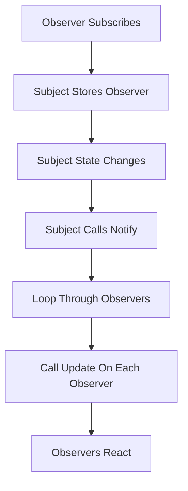
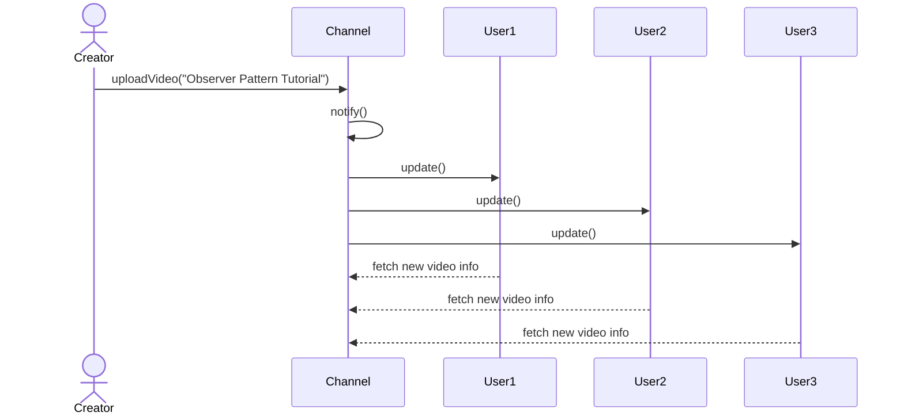
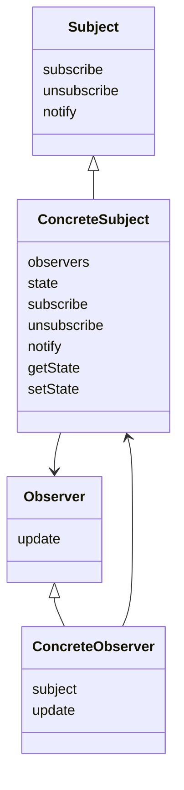
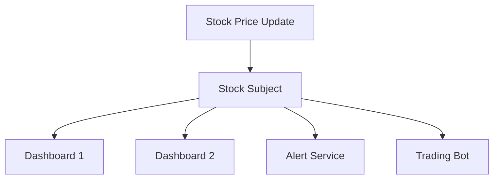
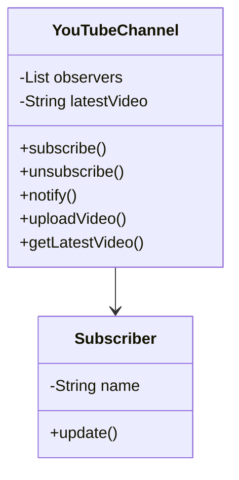

# Observer Design Pattern

Have you ever subscribed to a YouTube channel?

When the creator uploads a new video, you get a notification automatically. You do not need to keep checking the channel every few minutes. The update comes to you.

That everyday experience is a perfect real-world example of the **Observer Design Pattern**.

The Observer Pattern solves a fundamental software problem:

> How can one object efficiently notify many other dependent objects when something changes?

---

# Introduction: The Core Problem

In many systems, one object changes state and a group of other objects needs to react immediately.

Examples:

- a YouTube channel uploads a new video
- a stock price changes
- a button is clicked
- a weather station records a new temperature
- an order status changes from `Placed` to `Shipped`

Without a proper pattern, this often leads to repeated checking.

This is called **polling**.

---

## Polling vs Push

### Polling
The observer repeatedly checks whether something changed.

### Push
The subject sends a notification only when something changes.

```mermaid
flowchart LR
    A[Polling] --> B[Observer keeps asking]
    B --> C[Is there an update?]
    C --> B
    B --> D[Wasteful and repetitive]

    E[Push] --> F[Subject changes state]
    F --> G[Subject notifies observers]
    G --> H[Efficient and event-driven]
````

---

## Why polling is bad

Polling wastes time and resources.

| Problem            | Result                               |
| ------------------ | ------------------------------------ |
| Repeated requests  | Network and CPU waste                |
| No real update     | Same answer repeated again and again |
| Poor scalability   | Too many unnecessary checks          |
| Inefficient design | System works harder than needed      |

---

## Why push is better

Push-based systems notify only when needed.

| Benefit               | Result                                     |
| --------------------- | ------------------------------------------ |
| Less wasted work      | Communication happens only on change       |
| Better scalability    | Many observers can be notified efficiently |
| Cleaner design        | Responsibility is clearly separated        |
| Event-driven behavior | React when an event actually occurs        |

---

# What is the Observer Pattern?

The Observer Pattern defines a one-to-many relationship between objects so that when one object changes state, all of its dependents are notified and updated automatically.

---

## Main participants

There are two key roles:

| Role     | Meaning                         | Example         |
| -------- | ------------------------------- | --------------- |
| Subject  | The object being watched        | YouTube channel |
| Observer | The object watching the subject | Subscribers     |

```mermaid
classDiagram
    class Subject {
        +subscribe
        +unsubscribe
        +notify
    }

    class Observer {
        +update
    }

    class ConcreteSubject {
        +subscribe
        +unsubscribe
        +notify
        +getState
    }

    class ConcreteObserver {
        +update
    }

    Subject <|-- ConcreteSubject
    Observer <|-- ConcreteObserver
    ConcreteSubject --> Observer
```

---

# Key idea

The Subject does not need to know the exact details of every Observer.

It only needs to know:

* who is subscribed
* how to notify them
* when to notify them

This creates **loose coupling**.

---

# YouTube analogy

Imagine a YouTube channel.

* The channel is the **Subject**
* Subscribers are the **Observers**

When the channel uploads a new video:

1. subscribers are registered
2. a state change happens
3. the channel notifies everyone
4. each subscriber reacts

---

# Why this pattern is useful

The Observer Pattern is useful because it provides:

* automatic updates
* loose coupling
* easy extensibility
* event-driven design
* clean separation of concerns

---

# Core responsibilities

## Subject responsibilities

The Subject usually provides:

* `subscribe(observer)`
* `unsubscribe(observer)`
* `notify()`

### What these do

* `subscribe` adds an observer
* `unsubscribe` removes an observer
* `notify` informs all observers that something changed

---

## Observer responsibilities

The Observer usually provides:

* `update()`

### What this does

The observer reacts to the notification.

It may:

* fetch new data
* refresh UI
* log an event
* trigger another process

---

# Observer workflow



---

# A complete example: YouTube channel

Suppose a channel uploads a new video.

### Subject

* `YouTubeChannel`

### Observers

* `User1`
* `User2`
* `User3`

When a new video is published, each user is notified.

---

# Sequence diagram



---

# Push model with pull of details

A very important idea in Observer is this:

* the Subject **pushes** a notification
* the Observer may then **pull** the exact data it needs

This keeps the notification lightweight.

---

# Observer structure



---

# Real-world use cases

The Observer Pattern is everywhere.

| Use case              | Subject      | Observers              |
| --------------------- | ------------ | ---------------------- |
| YouTube notifications | Channel      | Subscribers            |
| Social media feeds    | User profile | Followers              |
| GUI events            | Button       | Event listeners        |
| Stock market apps     | Stock price  | Traders / dashboards   |
| Weather stations      | Sensor       | Displays / alerts      |
| Order tracking        | Order        | Customer notifications |

---

# Example 1: Stock market app

A stock price changes many times during the day.

The system may have:

* one stock feed
* many dashboards
* many alert services

When the price changes, all observers are notified.



---

# Example 2: GUI button

A button can have multiple listeners.

When the button is clicked:

* logger runs
* animation starts
* analytics event is recorded
* form submission occurs

The button does not need to know what each listener does.

---

# Why Observer supports loose coupling

Observer is powerful because the Subject and Observers are not tightly tied together.

| Design aspect                                     | Result                 |
| ------------------------------------------------- | ---------------------- |
| Subject does not know observer details            | Easier to extend       |
| Observers do not depend on internal subject logic | Cleaner design         |
| New observers can be added easily                 | More flexible system   |
| Observers can be removed anytime                  | Better runtime control |

---

# Observer and SRP

Sometimes the Subject also handles notification logic.

At first glance, that may seem like multiple responsibilities.

But in practice, this is often acceptable because:

* core business logic and notification logic are both stable
* notification handling is generic
* the pattern keeps the system practical and simple

Still, in larger systems, notification responsibility can be separated if needed.

---

```cpp
#include <iostream>
#include <vector>
#include <algorithm>
#include <string>
using namespace std;

class Observer {
public:
    virtual void update(const string& videoTitle) = 0;
    virtual ~Observer() = default;
};

class Subject {
public:
    virtual void subscribe(Observer* observer) = 0;
    virtual void unsubscribe(Observer* observer) = 0;
    virtual void notify() = 0;
    virtual ~Subject() = default;
};

class YouTubeChannel : public Subject {
private:
    vector<Observer*> observers;
    string latestVideo;

public:
    void subscribe(Observer* observer) override {
        observers.push_back(observer);
    }

    void unsubscribe(Observer* observer) override {
        observers.erase(remove(observers.begin(), observers.end(), observer), observers.end());
    }

    void notify() override {
        for (Observer* observer : observers) {
            observer->update(latestVideo);
        }
    }

    void uploadVideo(const string& title) {
        latestVideo = title;
        cout << "New video uploaded: " << title << endl;
        notify();
    }

    string getLatestVideo() const {
        return latestVideo;
    }
};

class Subscriber : public Observer {
private:
    string name;
    YouTubeChannel* channel;

public:
    Subscriber(const string& subscriberName, YouTubeChannel* ch)
        : name(subscriberName), channel(ch) {}

    void update(const string& videoTitle) override {
        cout << name << " received notification: " << videoTitle << endl;
    }
};

int main() {
    YouTubeChannel channel;

    Subscriber s1("Alice", &channel);
    Subscriber s2("Bob", &channel);

    channel.subscribe(&s1);
    channel.subscribe(&s2);

    channel.uploadVideo("Observer Pattern Tutorial");

    channel.unsubscribe(&s1);

    channel.uploadVideo("Factory Pattern Tutorial");

    return 0;
}
```
```java
import java.util.ArrayList;
import java.util.List;

interface Observer {
    void update(String videoTitle);
}

interface Subject {
    void subscribe(Observer observer);
    void unsubscribe(Observer observer);
    void notifyObservers();
}

class YouTubeChannel implements Subject {
    private List<Observer> observers = new ArrayList<>();
    private String latestVideo;

    public void subscribe(Observer observer) {
        observers.add(observer);
    }

    public void unsubscribe(Observer observer) {
        observers.remove(observer);
    }

    public void notifyObservers() {
        for (Observer observer : observers) {
            observer.update(latestVideo);
        }
    }

    public void uploadVideo(String title) {
        latestVideo = title;
        System.out.println("New video uploaded: " + title);
        notifyObservers();
    }

    public String getLatestVideo() {
        return latestVideo;
    }
}

class Subscriber implements Observer {
    private String name;

    public Subscriber(String name) {
        this.name = name;
    }

    public void update(String videoTitle) {
        System.out.println(name + " received notification: " + videoTitle);
    }
}

public class Main {
    public static void main(String[] args) {
        YouTubeChannel channel = new YouTubeChannel();

        Subscriber alice = new Subscriber("Alice");
        Subscriber bob = new Subscriber("Bob");

        channel.subscribe(alice);
        channel.subscribe(bob);

        channel.uploadVideo("Observer Pattern Tutorial");

        channel.unsubscribe(alice);

        channel.uploadVideo("Factory Pattern Tutorial");
    }
}
```
```python
from abc import ABC, abstractmethod

class Observer(ABC):
    @abstractmethod
    def update(self, video_title):
        pass

class Subject(ABC):
    @abstractmethod
    def subscribe(self, observer):
        pass

    @abstractmethod
    def unsubscribe(self, observer):
        pass

    @abstractmethod
    def notify(self):
        pass

class YouTubeChannel(Subject):
    def __init__(self):
        self._observers = []
        self._latest_video = None

    def subscribe(self, observer):
        self._observers.append(observer)

    def unsubscribe(self, observer):
        if observer in self._observers:
            self._observers.remove(observer)

    def notify(self):
        for observer in self._observers:
            observer.update(self._latest_video)

    def upload_video(self, title):
        self._latest_video = title
        print(f"New video uploaded: {title}")
        self.notify()

    def get_latest_video(self):
        return self._latest_video

class Subscriber(Observer):
    def __init__(self, name):
        self.name = name

    def update(self, video_title):
        print(f"{self.name} received notification: {video_title}")

channel = YouTubeChannel()

alice = Subscriber("Alice")
bob = Subscriber("Bob")

channel.subscribe(alice)
channel.subscribe(bob)

channel.upload_video("Observer Pattern Tutorial")

channel.unsubscribe(alice)

channel.upload_video("Factory Pattern Tutorial")
```

---

# How the implementation works

## Step 1: Observer subscribes

A subscriber joins the channel.

## Step 2: Subject stores observer

The channel keeps a list of observers.

## Step 3: State changes

The channel uploads a new video.

## Step 4: Subject notifies observers

The channel calls `notify()`.

## Step 5: Observers update themselves

Each observer reacts to the update.

---

# A more detailed Observer diagram



---

# Why Observer is powerful

## 1. Easy to extend

You can add a new observer without changing the subject.

Example:

* add a mobile app notification observer
* add an email notification observer
* add a logging observer

The subject does not need to know the details.

---

## 2. Easy to remove observers

Observers can unsubscribe at runtime.

This is useful in:

* live feeds
* event listeners
* notification systems

---

## 3. Supports dynamic systems

The subject can have:

* zero observers
* one observer
* many observers

The system adjusts dynamically.

---

# Observer and event-driven programming

Observer is one of the most important patterns behind event-driven systems.

It appears in:

* UI frameworks
* reactive systems
* message systems
* notification services

Whenever you see a “listener” or “subscriber,” there is often an Observer-style design behind it.

---

# Observer vs polling

| Feature        | Polling                    | Observer                        |
| -------------- | -------------------------- | ------------------------------- |
| Who checks?    | Observer checks repeatedly | Subject notifies automatically  |
| Efficiency     | Low                        | High                            |
| Resource usage | Wastes resources           | Uses resources only when needed |
| Design style   | Pull-based                 | Push-based                      |
| Scalability    | Poorer                     | Better                          |

---

# Observer vs Publish-Subscribe

These are closely related concepts.

| Concept           | Meaning                                                                     |
| ----------------- | --------------------------------------------------------------------------- |
| Observer          | One subject directly notifies observers                                     |
| Publish-Subscribe | Publishers send messages to a broker, which distributes them to subscribers |

Observer is often more direct, while publish-subscribe is more decoupled and often used in distributed systems.

---

# Benefits of Observer Pattern

| Benefit               | Description                                      |
| --------------------- | ------------------------------------------------ |
| Loose coupling        | Subject and observers remain independent         |
| Easy notification     | Updates are sent automatically                   |
| Scalable design       | Many observers can be supported                  |
| Flexible architecture | Observers can be added or removed dynamically    |
| Clean separation      | Subject handles state, observers handle reaction |

---

# Drawbacks of Observer Pattern

| Drawback              | Description                                            |
| --------------------- | ------------------------------------------------------ |
| Notification overhead | Too many observers can increase cost                   |
| Debugging difficulty  | Chains of updates may be hard to trace                 |
| Unexpected updates    | One change can trigger many reactions                  |
| Ordering complexity   | If many observers exist, notification order may matter |

---

# Common mistakes

| Mistake                                             | Problem                              |
| --------------------------------------------------- | ------------------------------------ |
| Forgetting to unsubscribe                           | Memory leaks or stale listeners      |
| Making observers too dependent on subject internals | Breaks loose coupling                |
| Triggering expensive logic inside `notify()`        | Slows the system                     |
| Using observer when only one response is needed     | Overengineering                      |
| Not handling observer errors                        | One bad observer may affect the flow |

---

# When to use Observer Pattern

Use it when:

* one object changes and many others need to react
* you want event-driven design
* the subject should not know observer details
* subscribers may join or leave dynamically
* you want loose coupling between state and reactions

---

# When not to use Observer Pattern

Avoid it when:

* there is only one dependent object
* updates are rare and simple
* the extra abstraction adds unnecessary complexity
* the communication is better handled directly

---

# Real-world examples

| Domain       | Subject      | Observer             |
| ------------ | ------------ | -------------------- |
| YouTube      | Channel      | Subscriber           |
| Social media | User post    | Followers            |
| GUI          | Button       | Event listeners      |
| Trading app  | Stock price  | Chart / alerts       |
| Weather app  | Sensor       | Display widgets      |
| Order system | Order status | Notification service |

---

# Summary

The Observer Pattern defines a one-to-many relationship where one object changes and many other objects are notified automatically.

It is a classic solution to the problem of keeping dependent objects updated without using inefficient polling.

The main ideas are:

* the **Subject** manages state and observers
* the **Observer** reacts through `update()`
* the system stays loosely coupled
* communication happens only when needed

---

# Final takeaway

The Observer Pattern is all about this simple idea:

> “When one object changes, let the interested objects know automatically.”

That makes it ideal for:

* notifications
* event systems
* UI listeners
* live data updates
* reactive architecture

It is one of the most practical and widely used design patterns in software development.