# Object Oriented Programming (OOP)

Object Oriented Programming, commonly called **OOP**, is a programming paradigm that organizes software around **objects** instead of only functions and logic.

An object represents a real-world entity and contains:

- **data** → called attributes, properties, or state
- **behavior** → called methods or functions

OOP is one of the most important programming paradigms because it helps developers build software that is:

- easy to understand
- reusable
- scalable
- maintainable
- closer to real-world thinking

---

## Why learn OOP?

OOP is used in almost every large software system because it solves a very common problem:

> As software grows, procedural code becomes harder to manage.

When the codebase becomes large, we need a design style that:

- organizes code into logical units
- keeps related data and behavior together
- allows safe extension
- reduces duplication
- supports teamwork and long-term maintenance

That is exactly what OOP gives us.

---

# History of Programming

Programming has evolved over time to make software development easier, faster, and more powerful.

```mermaid
flowchart LR
    A[Machine Language] --> B[Assembly Language]
    B --> C[Procedural Programming]
    C --> D[Object Oriented Programming]
````

---

## 1. Machine Language

Machine language is the most basic form of programming.

* It uses only **0s and 1s**
* It is directly understood by the CPU
* It is very fast for machines
* It is extremely difficult for humans to write and debug

### Example

```text
10110000 01100001
```

### Characteristics

| Feature            | Machine Language |
| ------------------ | ---------------- |
| Readability        | Very low         |
| Speed              | Very high        |
| Portability        | Very low         |
| Human friendliness | Very poor        |

---

## 2. Assembly Language

Assembly language was created to make programming easier than raw binary.

* It uses **mnemonics**
* Mnemonics are human-readable instruction names like `MOV`, `ADD`, `SUB`
* It still depends on the computer architecture

### Example

```text
MOV AX, 5
ADD AX, 10
```

### Characteristics

| Feature            | Assembly Language        |
| ------------------ | ------------------------ |
| Readability        | Better than machine code |
| Speed              | Very high                |
| Portability        | Low                      |
| Human friendliness | Limited                  |

---

## 3. Procedural Programming

Procedural programming organizes code using:

* functions
* loops
* conditions
* blocks
* step-by-step procedures

The program is written as a sequence of instructions.

### Simple idea

You tell the computer **what steps to perform**.

### Example

```text
1. Read input
2. Validate data
3. Process result
4. Print output
```

### Characteristics

| Feature       | Procedural Programming    |
| ------------- | ------------------------- |
| Focus         | Functions and procedures  |
| Data handling | Often separate from logic |
| Reuse         | Function reuse            |
| Best for      | Small to medium programs  |

### Limitations

As the codebase grows:

* code becomes repetitive
* data is harder to protect
* changes may affect many functions
* large systems become harder to manage

---

## 4. Object Oriented Programming

OOP evolved to solve the limitations of procedural programming.

It models software as a set of interacting objects.

Instead of focusing only on procedures, OOP focuses on:

* entities
* relationships
* responsibilities
* behavior
* data protection

---

# Why OOP?

OOP became popular because it matches the way humans naturally think about the world.

## 1. Real-world modeling

OOP allows us to represent real-world things as objects.

Examples:

* `Car`
* `Student`
* `BankAccount`
* `Order`
* `Employee`

Each object can have:

* data
* behavior
* identity

---

## 2. Data security

OOP helps protect data from being changed directly and incorrectly.

This is done using:

* encapsulation
* access modifiers
* controlled methods

For example, a bank account balance should not be changed directly from outside the class.

---

## 3. Highly scalable and reusable applications

OOP makes large systems easier to build because:

* classes can be reused
* logic can be separated into modules
* new features can be added with fewer changes
* bugs are easier to isolate

---

## 4. Easier maintenance

When code is grouped by object responsibility:

* it becomes easier to understand
* debugging becomes simpler
* changes become safer

---

## 5. Better teamwork

In large projects:

* different developers can work on different classes
* interfaces make collaboration easier
* modules can be tested independently

---

# Class and Object

## Class

A class is a blueprint or template for creating objects.

It defines:

* attributes
* methods
* structure
* behavior

### Simple meaning

A class is like a design of a car.

It tells us:

* what a car should contain
* what a car should do

---

## Object

An object is an instance of a class.

When a class is created, an object is built from it.

### Simple meaning

If a class is a blueprint, the object is the actual built thing.

For example:

* `Car` is the class
* `myCar` is an object
* `yourCar` is another object

---

## Class vs Object

| Aspect  | Class                          | Object                          |
| ------- | ------------------------------ | ------------------------------- |
| Meaning | Blueprint                      | Instance of blueprint           |
| Memory  | No actual entity by itself     | Occupies memory                 |
| Purpose | Defines structure and behavior | Represents a real usable entity |
| Example | `Car`                          | `car1`, `car2`                  |

---

## Characteristics and Behavior

In OOP, an object is a bundle of:

* **characteristics** → attributes / state
* **behavior** → methods / functions

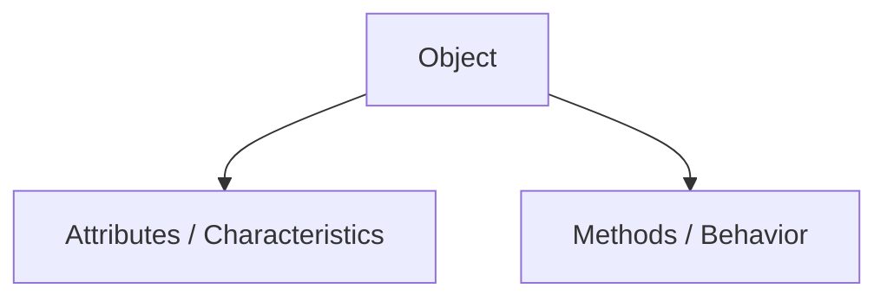

---

## Characteristics (Attributes)

Attributes represent the current data of an object.

They are like the **nouns** of the object.

### Example: Car attributes

* color = `"Red"`
* model = `"Sedan"`
* speed = `60`
* fuelLevel = `75`

These are stored as variables inside the object.

### Important idea

Two objects of the same class can have different values.

For example:

* one car may be red
* another car may be blue

Both are `Car` objects, but their attribute values differ.

---

## Behavior (Methods)

Methods represent actions that an object can perform.

They are like the **verbs** of the object.

### Example: Car methods

* `accelerate()`
* `brake()`
* `refuel()`
* `startEngine()`

These methods can:

* read object state
* update object state
* interact with other objects

---

## Simple Class and Object Example

```cpp
#include <iostream>
using namespace std;

class Car {
public:
    string color;
    string model;
    int speed;

    void accelerate() {
        speed += 10;
    }

    void brake() {
        speed -= 10;
    }
};

int main() {
    Car car1;
    car1.color = "Red";
    car1.model = "Sedan";
    car1.speed = 60;

    car1.accelerate();
    cout << car1.color << endl;
    cout << car1.model << endl;
    cout << car1.speed << endl;
    return 0;
}
```
```java
class Car {
    String color;
    String model;
    int speed;

    void accelerate() {
        speed += 10;
    }

    void brake() {
        speed -= 10;
    }
}

public class Main {
    public static void main(String[] args) {
        Car car1 = new Car();
        car1.color = "Red";
        car1.model = "Sedan";
        car1.speed = 60;

        car1.accelerate();
        System.out.println(car1.color);
        System.out.println(car1.model);
        System.out.println(car1.speed);
    }
}
```
```python
class Car:
    def __init__(self):
        self.color = ""
        self.model = ""
        self.speed = 0

    def accelerate(self):
        self.speed += 10

    def brake(self):
        self.speed -= 10

car1 = Car()
car1.color = "Red"
car1.model = "Sedan"
car1.speed = 60

car1.accelerate()
print(car1.color)
print(car1.model)
print(car1.speed)
```

---

# Pillars of OOP

OOP is based on four major pillars:

* Abstraction
* Encapsulation
* Inheritance
* Polymorphism

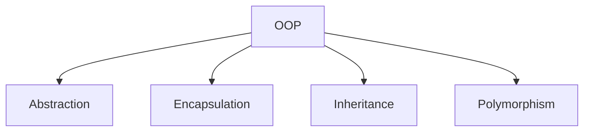

---

# 1. Abstraction

Abstraction means **hiding internal complexity and showing only essential features**.

It helps users focus on **what** an object does rather than **how** it does it.

---

## Real-world example

When you drive a car:

* you use the steering wheel
* you press the accelerator
* you press the brake

You do not need to know:

* how the engine works internally
* how fuel is converted to motion
* how the control system is implemented

That hidden complexity is abstraction.

---

## Why abstraction is useful

* reduces complexity
* makes code easier to use
* hides unnecessary details
* improves clarity
* creates clean interfaces

---

## Abstraction in programming

Abstraction is typically implemented using:

* abstract classes
* interfaces

---

## Abstract Class

An abstract class:

* cannot be instantiated directly
* may contain abstract methods
* may contain normal methods too

### Simple meaning

It is a partially defined blueprint.

---

## Interface

An interface is a contract.

It defines:

* what methods a class must have
* not how those methods work internally

### Simple meaning

It tells the class **what to do**, not **how to do it**.

---

## Abstraction Diagram

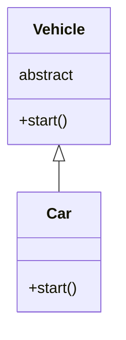

---

## Abstraction Example

```cpp
#include <iostream>
using namespace std;

class Vehicle {
public:
    virtual void start() = 0;
};

class Car : public Vehicle {
public:
    void start() override {
        cout << "Car starts with a key" << endl;
    }
};

int main() {
    Car car;
    car.start();
    return 0;
}
```
```java
abstract class Vehicle {
    abstract void start();
}

class Car extends Vehicle {
    void start() {
        System.out.println("Car starts with a key");
    }
}

public class Main {
    public static void main(String[] args) {
        Car car = new Car();
        car.start();
    }
}
```
```python
from abc import ABC, abstractmethod

class Vehicle(ABC):
    @abstractmethod
    def start(self):
        pass

class Car(Vehicle):
    def start(self):
        print("Car starts with a key")

car = Car()
car.start()
```

---

## Explanation of the example

Here:

* `Vehicle` is an abstract concept
* `Car` provides the actual implementation
* the user knows only that the vehicle can `start()`
* the internal mechanism is hidden

This is abstraction in action.

---

# 2. Encapsulation

Encapsulation means **bundling data and methods together into a single unit**, usually a class.

It also means **restricting direct access to internal data**.

---

## Core ideas of encapsulation

### 1. Data bundling

Data and behavior are placed together.

### 2. Information hiding

Internal data is protected from direct outside access.

---

## Why encapsulation is important

* protects data
* prevents accidental changes
* improves flexibility
* reduces complexity
* helps maintain data integrity

---

## Real-world example

A bank account balance should not be changed directly.

Instead of:

```text
account.balance = -1000
```

We use:

```text
deposit()
withdraw()
```

This ensures the class can control valid updates.

---

## Encapsulation Diagram

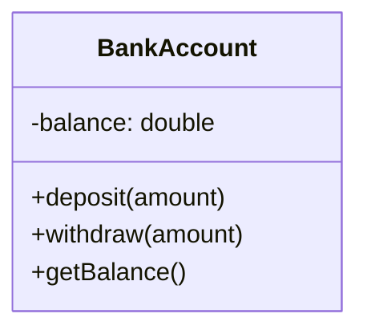

---

## Encapsulation Example

```cpp
#include <iostream>
using namespace std;

class BankAccount {
private:
    double balance;

public:
    BankAccount(double initialBalance) {
        balance = initialBalance;
    }

    void deposit(double amount) {
        if (amount > 0) balance += amount;
    }

    void withdraw(double amount) {
        if (amount > 0 && amount <= balance) balance -= amount;
    }

    double getBalance() {
        return balance;
    }
};

int main() {
    BankAccount account(1000);
    account.deposit(500);
    account.withdraw(200);
    cout << account.getBalance() << endl;
    return 0;
}
```
```java
class BankAccount {
    private double balance;

    BankAccount(double initialBalance) {
        balance = initialBalance;
    }

    void deposit(double amount) {
        if (amount > 0) balance += amount;
    }

    void withdraw(double amount) {
        if (amount > 0 && amount <= balance) balance -= amount;
    }

    double getBalance() {
        return balance;
    }
}

public class Main {
    public static void main(String[] args) {
        BankAccount account = new BankAccount(1000);
        account.deposit(500);
        account.withdraw(200);
        System.out.println(account.getBalance());
    }
}
```
```python
class BankAccount:
    def __init__(self, initial_balance):
        self.__balance = initial_balance

    def deposit(self, amount):
        if amount > 0:
            self.__balance += amount

    def withdraw(self, amount):
        if 0 < amount <= self.__balance:
            self.__balance -= amount

    def get_balance(self):
        return self.__balance

account = BankAccount(1000)
account.deposit(500)
account.withdraw(200)
print(account.get_balance())
```

---

## Encapsulation vs Abstraction

These two are related, but they are not the same.

| Aspect            | Abstraction               | Encapsulation              |
| ----------------- | ------------------------- | -------------------------- |
| Focus             | Hide complexity           | Protect data               |
| Purpose           | Show only what is needed  | Bundle and control access  |
| Level             | Design level              | Implementation level       |
| Question answered | What does this object do? | How is the data protected? |

---

# Access Modifiers

Access modifiers define how much access outside code has to classes, methods, and variables.

They support:

* encapsulation
* information hiding
* controlled access

---

## Types of access modifiers

| Modifier  | Access level                           |
| --------- | -------------------------------------- |
| Public    | Accessible from anywhere               |
| Protected | Accessible in the class and subclasses |
| Private   | Accessible only inside the same class  |

---

## 1. Public

Public members are accessible from anywhere.

### Usage

* methods meant for external use
* public APIs
* getters and setters

---

## 2. Protected

Protected members are accessible:

* within the class
* within child classes

---

## 3. Private

Private members are accessible only inside the same class.

This is the strongest form of hiding internal state.

---

## Access Modifier Example

```cpp
#include <iostream>
using namespace std;

class Demo {
public:
    int a = 10;

protected:
    int b = 20;

private:
    int c = 30;
};

int main() {
    Demo d;
    cout << d.a << endl;
    return 0;
}
```
```java
class Demo {
    public int a = 10;
    protected int b = 20;
    private int c = 30;
}

public class Main {
    public static void main(String[] args) {
        Demo d = new Demo();
        System.out.println(d.a);
    }
}
```

### Python

Python does not enforce access modifiers strictly, but follows naming conventions.

* `public` → normal name
* `_protected` → conventionally protected
* `__private` → name mangling for stronger hiding

```python
class Demo:
    def __init__(self):
        self.a = 10
        self._b = 20
        self.__c = 30

d = Demo()
print(d.a)
```

---

# 3. Inheritance

Inheritance is the process where one class acquires the properties and behaviors of another class.

* The existing class is called the **parent class**, **base class**, or **superclass**
* The new class is called the **child class**, **derived class**, or **subclass**

---

## Why inheritance is used

* code reuse
* reduced duplication
* easy extension
* better hierarchy modeling
* support for polymorphism

---

## Real-world example

* `Dog` is an `Animal`
* `Car` is a `Vehicle`
* `Manager` is an `Employee`

These are called **is-a** relationships.

---

## Inheritance Diagram

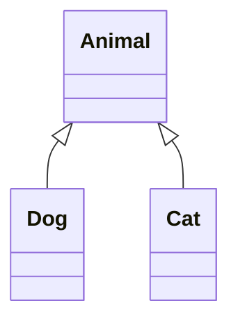

---

## Inheritance example

```cpp
#include <iostream>
using namespace std;

class Animal {
public:
    void eat() {
        cout << "Eating" << endl;
    }
};

class Dog : public Animal {
public:
    void bark() {
        cout << "Barking" << endl;
    }
};

int main() {
    Dog dog;
    dog.eat();
    dog.bark();
    return 0;
}
```
```java
class Animal {
    void eat() {
        System.out.println("Eating");
    }
}

class Dog extends Animal {
    void bark() {
        System.out.println("Barking");
    }
}

public class Main {
    public static void main(String[] args) {
        Dog dog = new Dog();
        dog.eat();
        dog.bark();
    }
}
```
```python
class Animal:
    def eat(self):
        print("Eating")

class Dog(Animal):
    def bark(self):
        print("Barking")

dog = Dog()
dog.eat()
dog.bark()
```

---

## Benefits of inheritance

| Benefit              | Description                                   |
| -------------------- | --------------------------------------------- |
| Code reusability     | Common code is written once in the base class |
| Extensibility        | New child classes can be added easily         |
| Abstraction          | Common behavior can be moved to the parent    |
| Polymorphism support | Subclasses can override methods               |

---

## Drawbacks of inheritance

| Drawback       | Description                                                 |
| -------------- | ----------------------------------------------------------- |
| Tight coupling | Child depends heavily on parent                             |
| Fragility      | Parent changes may break children                           |
| Complexity     | Deep hierarchies are harder to maintain                     |
| Misuse risk    | Inheritance should only be used for true is-a relationships |

---

# Types of Inheritance

There are several types of inheritance in OOP.

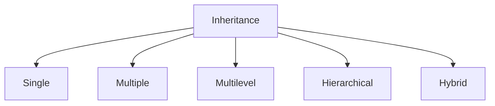

---

## 1. Single Inheritance

A child class inherits from one parent class.

### Example

* `Car` inherits from `Vehicle`

### Why it is useful

Single inheritance is simple and easy to understand. It is usually the first and safest form of inheritance to use.

### Advantages

* simple
* easy to understand
* less ambiguity

### Disadvantages

* limited reuse if features from many parents are needed

---

### Single Inheritance Diagram

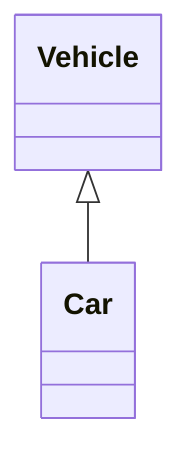

### Single Inheritance Example

```cpp
#include <iostream>
using namespace std;

class Vehicle {
public:
    void startEngine() {
        cout << "Engine started" << endl;
    }
};

class Car : public Vehicle {
public:
    void drive() {
        cout << "Car is driving" << endl;
    }
};

int main() {
    Car car;
    car.startEngine();
    car.drive();
    return 0;
}
```
```java
class Vehicle {
    void startEngine() {
        System.out.println("Engine started");
    }
}

class Car extends Vehicle {
    void drive() {
        System.out.println("Car is driving");
    }
}

public class Main {
    public static void main(String[] args) {
        Car car = new Car();
        car.startEngine();
        car.drive();
    }
}
```
```python
class Vehicle:
    def start_engine(self):
        print("Engine started")

class Car(Vehicle):
    def drive(self):
        print("Car is driving")

car = Car()
car.start_engine()
car.drive()
```

### Explanation

Here, `Car` gets the `startEngine()` behavior from `Vehicle`, and it also has its own `drive()` method.

This is a clean example of **code reuse**.

---

## 2. Multiple Inheritance

A child class inherits from more than one parent class.

### Example

* a `FlyingCar` may inherit from `Car` and `Airplane`

### Why it is useful

Sometimes one class needs behavior from multiple sources.

### Advantages

* combines behavior from many classes
* useful in advanced designs

### Disadvantages

* can create confusion
* may lead to the diamond problem
* harder to maintain

---

### Multiple Inheritance Diagram

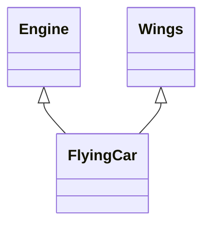

### Multiple Inheritance Example

```cpp
#include <iostream>
using namespace std;

class Engine {
public:
    void start() {
        cout << "Engine started" << endl;
    }
};

class Wings {
public:
    void fly() {
        cout << "Flying" << endl;
    }
};

class FlyingCar : public Engine, public Wings {
};

int main() {
    FlyingCar fc;
    fc.start();
    fc.fly();
    return 0;
}
```
```python
class Engine:
    def start(self):
        print("Engine started")

class Wings:
    def fly(self):
        print("Flying")

class FlyingCar(Engine, Wings):
    pass

fc = FlyingCar()
fc.start()
fc.fly()
```

#### Java

Java does not support multiple inheritance with classes, but it supports it through interfaces.

```java
interface Engine {
    void start();
}

interface Wings {
    void fly();
}

class FlyingCar implements Engine, Wings {
    public void start() {
        System.out.println("Engine started");
    }

    public void fly() {
        System.out.println("Flying");
    }
}

public class Main {
    public static void main(String[] args) {
        FlyingCar fc = new FlyingCar();
        fc.start();
        fc.fly();
    }
}
```

### Explanation

A `FlyingCar` gets both `start()` and `fly()` behavior. This is powerful, but the design can become confusing if the parent classes overlap in behavior.

---

## 3. Multilevel Inheritance

A class inherits from a class that itself inherits from another class.

### Example

* `Animal` → `Mammal` → `Dog`

### Why it is useful

This is used when a concept naturally grows in layers.

### Advantages

* good for layered specialization
* clear step-by-step extension

### Disadvantages

* can become deeply coupled
* changes at the top may affect lower classes

---

### Multilevel Inheritance Diagram

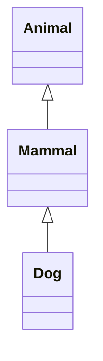

### Multilevel Inheritance Example

```cpp
#include <iostream>
using namespace std;

class Animal {
public:
    void eat() {
        cout << "Eating" << endl;
    }
};

class Mammal : public Animal {
public:
    void walk() {
        cout << "Walking" << endl;
    }
};

class Dog : public Mammal {
public:
    void bark() {
        cout << "Barking" << endl;
    }
};

int main() {
    Dog dog;
    dog.eat();
    dog.walk();
    dog.bark();
    return 0;
}
```
```java
class Animal {
    void eat() {
        System.out.println("Eating");
    }
}

class Mammal extends Animal {
    void walk() {
        System.out.println("Walking");
    }
}

class Dog extends Mammal {
    void bark() {
        System.out.println("Barking");
    }
}

public class Main {
    public static void main(String[] args) {
        Dog dog = new Dog();
        dog.eat();
        dog.walk();
        dog.bark();
    }
}
```
```python
class Animal:
    def eat(self):
        print("Eating")

class Mammal(Animal):
    def walk(self):
        print("Walking")

class Dog(Mammal):
    def bark(self):
        print("Barking")

dog = Dog()
dog.eat()
dog.walk()
dog.bark()
```

### Explanation

Here:

* `Dog` inherits from `Mammal`
* `Mammal` inherits from `Animal`
* so `Dog` gets access to the features of both

This is useful when each level adds meaningful specialization.

---

## 4. Hierarchical Inheritance

Multiple child classes inherit from a single parent class.

### Example

* `Circle`, `Square`, and `Triangle` all inherit from `Shape`

### Why it is useful

It is helpful when several classes share a common base but have different specializations.

### Advantages

* common code can be reused
* supports polymorphism well

### Disadvantages

* parent class changes may affect all children

---

### Hierarchical Inheritance Diagram

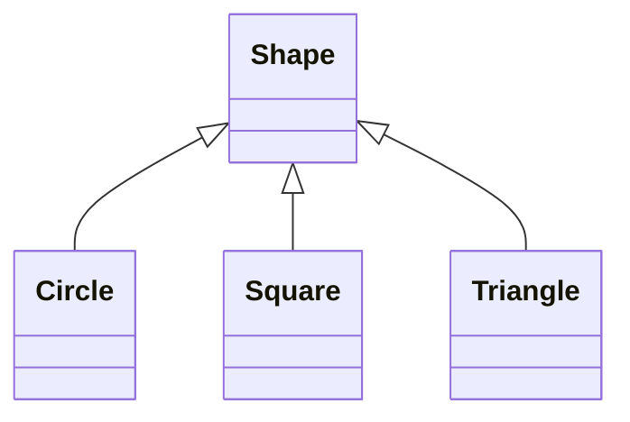

### Hierarchical Inheritance Example

```cpp
#include <iostream>
using namespace std;

class Shape {
public:
    void display() {
        cout << "This is a shape" << endl;
    }
};

class Circle : public Shape {
public:
    void area() {
        cout << "Area of Circle" << endl;
    }
};

class Square : public Shape {
public:
    void area() {
        cout << "Area of Square" << endl;
    }
};

int main() {
    Circle c;
    Square s;
    c.display();
    c.area();
    s.display();
    s.area();
    return 0;
}
```
```java
class Shape {
    void display() {
        System.out.println("This is a shape");
    }
}

class Circle extends Shape {
    void area() {
        System.out.println("Area of Circle");
    }
}

class Square extends Shape {
    void area() {
        System.out.println("Area of Square");
    }
}

public class Main {
    public static void main(String[] args) {
        Circle c = new Circle();
        Square s = new Square();
        c.display();
        c.area();
        s.display();
        s.area();
    }
}
```
```python
class Shape:
    def display(self):
        print("This is a shape")

class Circle(Shape):
    def area(self):
        print("Area of Circle")

class Square(Shape):
    def area(self):
        print("Area of Square")

c = Circle()
s = Square()
c.display()
c.area()
s.display()
s.area()
```

### Explanation

`Shape` is the common parent.
`Circle`, `Square`, and `Triangle` are siblings that share the same base behavior but implement their own special behavior.

---

## 5. Hybrid Inheritance

Hybrid inheritance is a combination of two or more types of inheritance.

It is not a pure type, but a mix.

### Example

* hierarchical + multiple
* multilevel + multiple

### Why it is useful

It appears in more complex systems where inheritance alone is used to model advanced relationships.

### Advantages

* flexible
* useful in advanced designs

### Disadvantages

* more complex
* can create ambiguity
* harder to debug

---

### Hybrid Inheritance Diagram

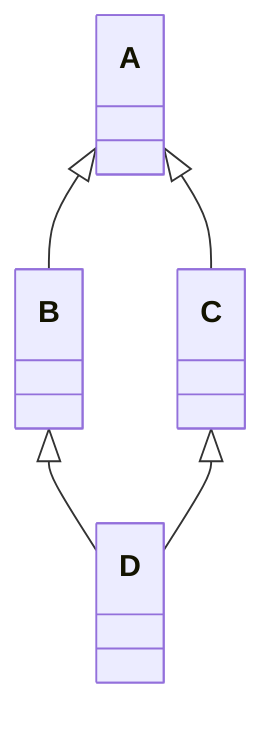

### Hybrid Inheritance Example

#### Python

```python
class A:
    def method_a(self):
        print("A")

class B(A):
    def method_b(self):
        print("B")

class C:
    def method_c(self):
        print("C")

class D(B, C):
    pass

d = D()
d.method_a()
d.method_b()
d.method_c()
```

#### Java

Java avoids direct hybrid inheritance with classes, but similar behavior can be achieved using interfaces.

```java
interface A {
    void methodA();
}

interface B extends A {
    void methodB();
}

interface C {
    void methodC();
}

class D implements B, C {
    public void methodA() {
        System.out.println("A");
    }

    public void methodB() {
        System.out.println("B");
    }

    public void methodC() {
        System.out.println("C");
    }
}

public class Main {
    public static void main(String[] args) {
        D d = new D();
        d.methodA();
        d.methodB();
        d.methodC();
    }
}
```

### Explanation

Hybrid inheritance is basically a combination of inheritance patterns.

It is useful in theory and in certain languages, but in practice, composition is often preferred because it is easier to manage.

---

# Polymorphism

Polymorphism means **many forms**.

It allows the same interface or method name to behave differently depending on the object.

---

## Simple meaning

The same action can behave differently for different objects.

For example:

* a `Dog` speaks differently
* a `Cat` speaks differently
* a `Cow` speaks differently

Yet all of them can respond to a common method like `speak()`.

---

## Why polymorphism is useful

* generic code
* easier extension
* better abstraction
* cleaner design
* supports interchangeable components

---

## Types of polymorphism

| Type                      | Description              | Example            |
| ------------------------- | ------------------------ | ------------------ |
| Compile-time polymorphism | Resolved at compile time | Method overloading |
| Runtime polymorphism      | Resolved at runtime      | Method overriding  |

---

## 1. Compile-time polymorphism

The decision of which method to call is made during compilation.

This is commonly seen in:

* method overloading
* operator overloading

---

### Method Overloading

Same method name, different parameter list.

```cpp
#include <iostream>
using namespace std;

class Calculator {
public:
    int add(int a, int b) {
        return a + b;
    }

    double add(double a, double b) {
        return a + b;
    }
};

int main() {
    Calculator calc;
    cout << calc.add(2, 3) << endl;
    cout << calc.add(2.5, 3.5) << endl;
    return 0;
}
```
```java
class Calculator {
    int add(int a, int b) {
        return a + b;
    }

    double add(double a, double b) {
        return a + b;
    }
}

public class Main {
    public static void main(String[] args) {
        Calculator calc = new Calculator();
        System.out.println(calc.add(2, 3));
        System.out.println(calc.add(2.5, 3.5));
    }
}
```

### Python Note

Python does not support method overloading in the same way as C++ or Java. It usually uses:

* default parameters
* `*args`
* different method names

---

## 2. Runtime polymorphism

The method that gets called is decided at runtime.

This is usually done using:

* method overriding
* inheritance
* interfaces

---

### Method Overriding

A child class provides its own version of a method defined in the parent class.

---

```cpp
#include <iostream>
using namespace std;

class Animal {
public:
    virtual void sound() {
        cout << "Animal sound" << endl;
    }
};

class Dog : public Animal {
public:
    void sound() override {
        cout << "Bark" << endl;
    }
};

int main() {
    Animal* a = new Dog();
    a->sound();
    delete a;
    return 0;
}
```
```java
class Animal {
    void sound() {
        System.out.println("Animal sound");
    }
}

class Dog extends Animal {
    @Override
    void sound() {
        System.out.println("Bark");
    }
}

public class Main {
    public static void main(String[] args) {
        Animal a = new Dog();
        a.sound();
    }
}
```
```python
class Animal:
    def sound(self):
        print("Animal sound")

class Dog(Animal):
    def sound(self):
        print("Bark")

a = Dog()
a.sound()
```

---

## Benefits of polymorphism

| Benefit         | Description                                         |
| --------------- | --------------------------------------------------- |
| Flexibility     | Same interface can handle many objects              |
| Extensibility   | New classes can be added without changing old code  |
| Maintainability | Code becomes cleaner and simpler                    |
| Abstraction     | Client code depends on behavior, not implementation |

---

## Drawbacks of polymorphism

| Drawback             | Description                                 |
| -------------------- | ------------------------------------------- |
| Runtime cost         | Dynamic dispatch may be slightly slower     |
| Debugging difficulty | Harder to trace which method is called      |
| Complexity           | Improper use can make code harder to follow |

---

# Relationship Between Inheritance and Polymorphism

Inheritance creates the hierarchy, and polymorphism uses that hierarchy to allow different behavior.

### Simple relation

* inheritance gives structure
* polymorphism gives flexibility

---

## Example

If `Dog`, `Cat`, and `Cow` all extend `Animal`, then a list of `Animal` can hold all of them, and each object can respond differently to the same method call.

### Java Example

```java
class Animal {
    void sound() {
        System.out.println("Animal sound");
    }
}

class Dog extends Animal {
    void sound() {
        System.out.println("Bark");
    }
}

class Cat extends Animal {
    void sound() {
        System.out.println("Meow");
    }
}

public class Main {
    public static void main(String[] args) {
        Animal[] animals = { new Dog(), new Cat() };
        for (Animal a : animals) {
            a.sound();
        }
    }
}
```

---

# The Diamond Problem in Multiple Inheritance

The diamond problem appears when one class inherits from two classes that both inherit from the same base class.

It creates an inheritance structure shaped like a diamond.

```text
       A
      / \
     B   C
      \ /
       D
```

---

## Why it is a problem

The issue is ambiguity.

If both `B` and `C` inherit from `A`, and `D` inherits from both `B` and `C`, then `D` may face confusion about:

* which `A` to use
* which method version to call
* which data members to keep

---

## Diamond Problem Example

### Python

```python
class A:
    def show(self):
        print("A")

class B(A):
    def show(self):
        print("B")

class C(A):
    def show(self):
        print("C")

class D(B, C):
    pass

d = D()
d.show()
```

In Python, this is resolved using **MRO**.

---

## How languages handle it

| Language | Multiple Inheritance for Classes | Diamond Problem Handling               |
| -------- | -------------------------------- | -------------------------------------- |
| Python   | Yes                              | Uses Method Resolution Order (MRO)     |
| C++      | Yes                              | Uses virtual inheritance               |
| Java     | No                               | Avoids it for classes, uses interfaces |
| C#       | No                               | Avoids it for classes, uses interfaces |

---

## Python MRO

Python uses **Method Resolution Order** to decide the order in which classes are searched.

You can inspect it using:

```python
print(D.__mro__)
```

This gives a linear order, so Python knows exactly which method to call.

---

## C++ Virtual Inheritance

C++ uses **virtual inheritance** to ensure only one shared copy of the base class exists.

### Example

```cpp
class A {
public:
    void show() {
        cout << "A" << endl;
    }
};

class B : virtual public A {};
class C : virtual public A {};
class D : public B, public C {};
```

---

## Best way to avoid the diamond problem

* prefer composition over inheritance
* use interfaces where possible
* keep inheritance trees shallow
* use inheritance only when there is a real `is-a` relationship

---

# Composition over Inheritance

Composition means building classes using other classes.

Instead of saying:

* `Car is an Engine`

we say:

* `Car has an Engine`

This is often safer and more flexible than inheritance.

---

## Example

### Python

```python
class Engine:
    def start(self):
        print("Engine started")

class Car:
    def __init__(self):
        self.engine = Engine()

    def start_car(self):
        self.engine.start()

car = Car()
car.start_car()
```

### Why composition is preferred sometimes

* lower coupling
* easier to test
* easier to change behavior
* avoids deep inheritance trees

---

# OOP Summary Table

| Concept       | Meaning                                | Simple Example           |
| ------------- | -------------------------------------- | ------------------------ |
| Class         | Blueprint for objects                  | `Car`                    |
| Object        | Instance of a class                    | `car1`                   |
| Abstraction   | Hide unnecessary details               | Driving a car            |
| Encapsulation | Protect data with controlled access    | Bank account             |
| Inheritance   | Child class acquires parent properties | `Dog` inherits `Animal`  |
| Polymorphism  | One interface, many forms              | `sound()` in Dog and Cat |

---

# Procedural Programming vs OOP

| Aspect        | Procedural Programming   | OOP                        |
| ------------- | ------------------------ | -------------------------- |
| Main focus    | Functions and steps      | Objects and relationships  |
| Data handling | Separate from logic      | Data and behavior together |
| Reusability   | Function reuse           | Class and object reuse     |
| Scalability   | Harder for large systems | Better for complex systems |

---

# Abstraction vs Encapsulation

| Aspect         | Abstraction               | Encapsulation                  |
| -------------- | ------------------------- | ------------------------------ |
| Goal           | Hide complexity           | Protect data                   |
| Focus          | What the object does      | How data is secured            |
| Implementation | Abstract class, interface | Access modifiers, private data |

---

# Inheritance vs Polymorphism

| Aspect       | Inheritance            | Polymorphism                        |
| ------------ | ---------------------- | ----------------------------------- |
| Purpose      | Reuse code             | Use one interface for many forms    |
| Relationship | Parent-child structure | Different behaviors via same method |
| Example      | `Dog extends Animal`   | `Animal a = new Dog()`              |

---

# Best Practices in OOP

* use classes for real-world entities
* keep each class focused on one responsibility
* use encapsulation to protect data
* use inheritance only when it truly fits
* prefer composition when inheritance creates complexity
* use abstraction to reduce unnecessary details
* design for flexibility and reusability
* keep method names meaningful and clear
* avoid deep and confusing inheritance chains

---

# Common Mistakes in OOP

| Mistake                          | Problem                                 |
| -------------------------------- | --------------------------------------- |
| Too much inheritance             | Makes design rigid and hard to maintain |
| Public data everywhere           | Breaks encapsulation                    |
| Large classes                    | Hard to read and test                   |
| Wrong abstraction                | Makes code confusing                    |
| Using inheritance for everything | Often composition is better             |
| Ignoring access control          | Weakens data protection                 |

---

# Final Summary

OOP is a powerful programming style that helps software behave like the real world.

It is built on four pillars:

* **Abstraction** → hide complexity
* **Encapsulation** → protect data
* **Inheritance** → reuse and extend
* **Polymorphism** → one interface, many behaviors

OOP became important because it enables:

* real-world modeling
* data security
* scalability
* reusability
* maintainability

Understanding OOP deeply creates a strong foundation for:

* LLD
* design patterns
* system design
* interview preparation
* large-scale application development

