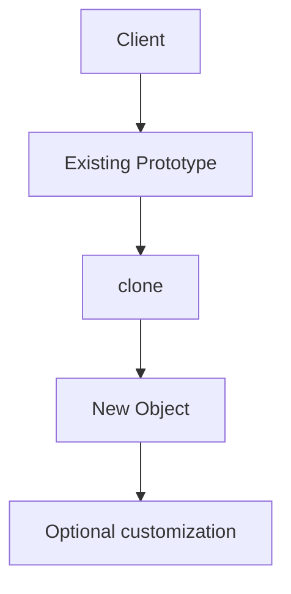
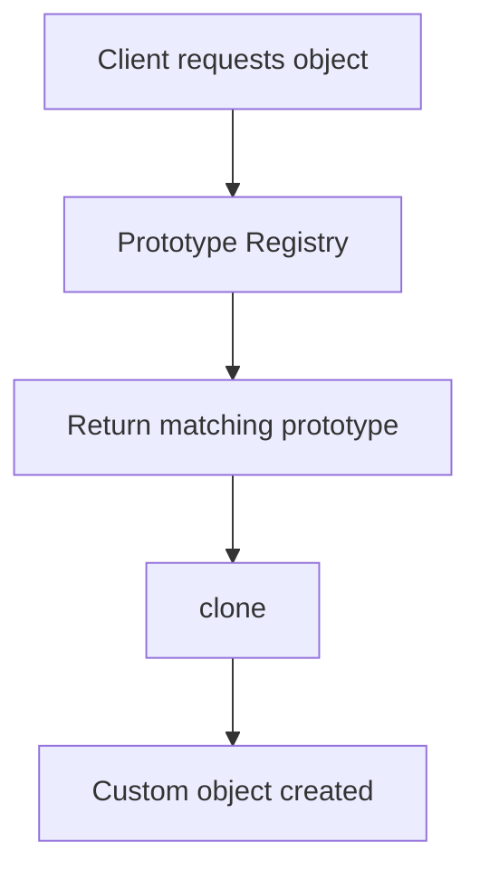
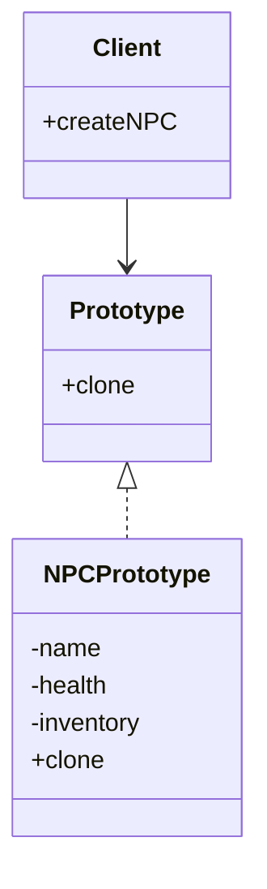
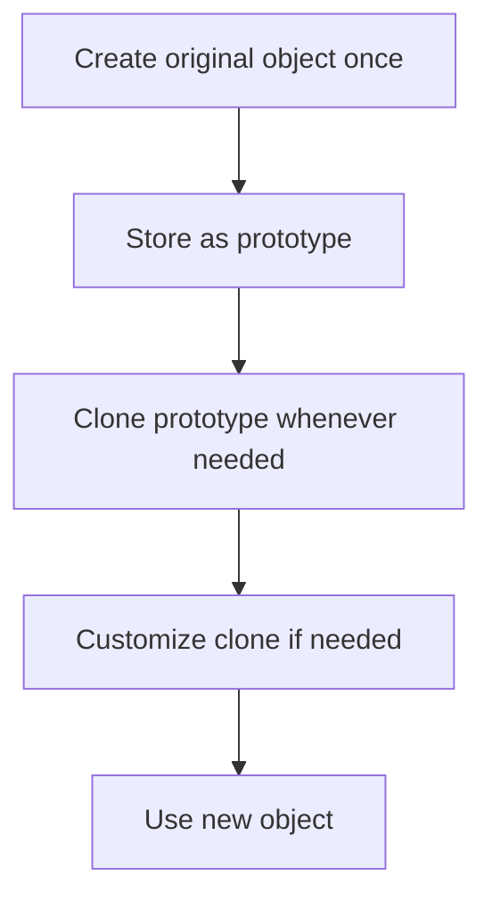
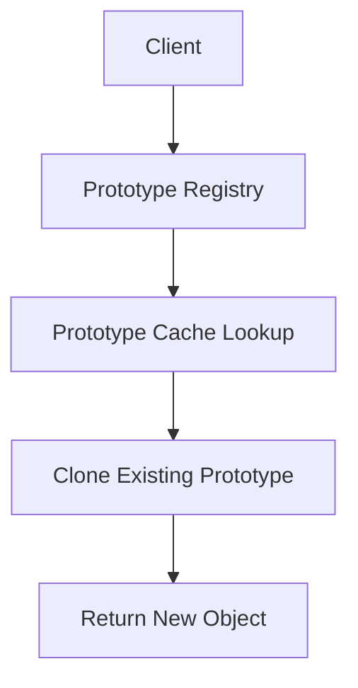

# Prototype Design Pattern

The **Prototype Design Pattern** is a creational pattern that creates new objects by **cloning an existing object** instead of constructing a new one from scratch.

In simple words:

> Create one object carefully, then reuse it as a template to make many similar objects quickly.

This pattern is especially useful when:

- object creation is expensive
- objects are mostly similar
- object setup requires heavy work
- you want to avoid repeating complex initialization logic
- you need many copies with minor changes

---

# Introduction: The Challenge of a Growing Army

Imagine building a video game.

You need to create:
- hundreds of NPCs
- many enemies
- similar weapons
- repeated game entities
- repeated map objects

Creating each object from scratch may be slow because object construction can involve:

- database lookups
- file loading
- parsing
- network requests
- complex calculations
- expensive initialization

If one object takes a long time to create, making many of them can become a serious bottleneck.

That is where Prototype helps.

---

# The Problem: The High Cost of `new`

Normally, we create objects using `new`.

That is fine for simple objects.

But some objects are expensive to create because construction may require:

| Expensive Operation | Example |
|---------------------|---------|
| Database access | loading player stats |
| File loading | loading textures/models |
| Network requests | fetching remote data |
| Complex calculations | computing initial values |
| Heavy setup logic | initializing large objects |

If one object takes seconds to create, creating hundreds of them can be too slow.

---

## Why this becomes a problem

| Problem | Explanation |
|--------|-------------|
| Slow startup | Many expensive objects delay application load |
| Repeated work | Same setup is performed again and again |
| Poor performance | Creation overhead becomes expensive |
| Less scalability | Object count grows faster than performance |
| Complex construction logic | Constructors become large and hard to manage |

---

# Core Idea of Prototype

Instead of building every object from scratch, we:

1. create one object carefully
2. use that object as a **prototype**
3. clone it whenever we need a similar object

---

## Formal definition

The Prototype pattern creates new objects by copying an existing object, rather than creating them from scratch.

---

# Main Idea in One Line

> **Clone, don’t recreate.**

---

# Before vs After

| Approach | What happens |
|----------|--------------|
| Traditional `new` | Every object is created from scratch |
| Prototype | First object is created once, then copied repeatedly |

---

## Visual comparison

```mermaid
flowchart LR
    A[Traditional: new] --> B[Expensive constructor every time]
    C[Prototype: clone] --> D[Create once]
    D --> E[Clone many times]
````

---

# Why Prototype matters

Prototype is useful because it:

* reduces object creation cost
* improves performance
* hides complex initialization
* supports object reuse
* simplifies creation of similar objects

---

# Main Participants

| Role               | Meaning                                     |
| ------------------ | ------------------------------------------- |
| Prototype          | Declares cloning capability                 |
| Concrete Prototype | Implements cloning                          |
| Client             | Requests new objects by cloning             |
| Prototype Registry | Optional place to store reusable prototypes |

---

## UML structure

```mermaid
classDiagram

    class Prototype {
        +clone
    }

    class ConcretePrototype {
        -fields
        +clone
    }

    class Client {
        +createObject
    }

    class PrototypeRegistry {
        -prototypes
        +getPrototype
    }

    Prototype <|.. ConcretePrototype
    Client --> Prototype
    PrototypeRegistry --> Prototype
```

---

# Why cloning is better than recreating

Suppose creating one NPC requires:

* loading model
* loading stats
* performing initialization

If we need 100 NPCs:

* `new` repeats the entire process 100 times
* cloning does the heavy work once, then copies the result

That is much more efficient.

---

# Example Scenario: Game NPCs

Imagine a game has:

* standard alien
* armored alien
* fast alien
* boss alien

They may share:

* body shape
* base model
* animation set

But differ slightly in:

* defense
* speed
* health
* weapon

Prototype is ideal here because:

* one expensive alien object can act as the base
* variants are made by cloning and customizing

---

# How it Works

Prototype usually involves three key ideas:

1. a cloning contract
2. a concrete implementation of cloning
3. a way to copy state into the new object

---

# Prototype Interface

The prototype interface declares a cloning method.

It tells the system:

> “Objects of this type know how to duplicate themselves.”

---

# Concrete Prototype

The concrete prototype:

* stores the actual data
* implements cloning
* copies its own state into the new object

---

# Client

The client:

* requests a clone from the prototype
* optionally customizes the result
* uses the new object

---

# Flow Diagram



---

# The Clone Method

The clone method is the heart of the pattern.

It usually:

* creates a new object
* copies the internal state
* returns the copy

In many languages, this is implemented using:

* copy constructor
* clone method
* custom duplication logic

---

# Copy Constructor

A copy constructor is a constructor that receives another object of the same type and copies its data.

Example idea:

```text
new Object(existingObject)
```

This is very common in C++.

---

# Why copy constructor is important

It helps you:

* centralize duplication logic
* control what gets copied
* choose shallow or deep copy
* avoid repeating construction work

---

# Prototype Registry

In real systems, we often keep a registry of reusable prototypes.

For example:

* standard enemy
* standard weapon
* standard UI component

Instead of creating them manually every time, the client asks the registry for a prototype and clones it.

---

## Registry flow



---

# Key Use Case: Many Similar Objects

Prototype is especially useful when:

* many objects are similar
* only small differences exist
* construction is expensive
* object setup is complicated

---

# Real-World Analogy

Think of a form template.

Instead of writing a new form from scratch each time:

* create one master form
* copy it
* fill in the few fields that change

That is exactly what Prototype does with objects.

---

# Shallow Copy vs Deep Copy

This is one of the most important parts of the pattern.

When cloning objects, we must decide whether the copy should be:

* **shallow**
* **deep**

---

## Shallow Copy

A shallow copy:

* copies primitive values directly
* copies references to inner objects

That means the original and clone may share internal objects.

### Risk

Changing a shared internal object in the clone may also change the original.

---

## Deep Copy

A deep copy:

* copies primitive values
* creates new copies of referenced objects too

That means the original and clone are completely independent.

### Benefit

Changing the clone does not affect the original.

---

## Comparison table

| Feature          | Shallow Copy                  | Deep Copy       |
| ---------------- | ----------------------------- | --------------- |
| Primitive values | Copied                        | Copied          |
| Nested objects   | Shared references             | New copies      |
| Independence     | Low                           | High            |
| Safety           | Risky for mutable nested data | Safer           |
| Performance      | Faster                        | Slightly slower |

---

# Why this matters

If the object contains:

* lists
* arrays
* nested objects
* maps
* other references

then cloning must be handled carefully.

If you do not do this properly, bugs appear where modifying one object unexpectedly affects another.

---

# Example of the Problem

Suppose an NPC has an inventory object.

If the clone and original share the same inventory:

* removing an item from one may remove it from the other

That is usually not what we want.

---

# Prototype Structure



---

# Prototype Pattern Benefits

| Benefit                        | Description                                          |
| ------------------------------ | ---------------------------------------------------- |
| Fast object creation           | Cloning is usually faster than constructing          |
| Avoids expensive setup         | Heavy initialization happens once                    |
| Good for similar objects       | Great when objects differ only slightly              |
| Flexible                       | New variants can be made by cloning and modifying    |
| Reduces constructor complexity | Constructors do not need to handle many combinations |

---

# Prototype Pattern Drawbacks

| Drawback                      | Description                                               |
| ----------------------------- | --------------------------------------------------------- |
| Deep copy complexity          | Nested objects can be tricky                              |
| Cloning logic must be correct | Mistakes create subtle bugs                               |
| Not ideal for unique objects  | If every object is very different, cloning is less useful |
| Can be hard to manage         | Many prototypes may require a registry                    |

---

# When to Use Prototype

Use Prototype when:

* creating objects is expensive
* many objects are very similar
* object initialization is complex
* you want to avoid repeated setup work
* you need to create variants of a base object quickly

---

# When Not to Use Prototype

Avoid Prototype when:

* object creation is already simple
* each object is completely unique
* cloning would be more complex than construction
* object state is hard to copy safely

---

# Example: Game NPCs

A game may create:

* soldiers
* zombies
* monsters
* enemies
* allies

Instead of building each one from scratch, the game can clone a prototype and customize:

* health
* speed
* weapon
* name

---

# Example

```cpp
#include <iostream>
#include <string>
#include <vector>
using namespace std;

class Inventory {
public:
    vector<string> items;

    Inventory() = default;

    Inventory(const Inventory& other) {
        items = other.items;
    }
};

class NPC {
private:
    string name;
    int health;
    Inventory inventory;

public:
    NPC(string name, int health, Inventory inventory)
        : name(name), health(health), inventory(inventory) {}

    NPC(const NPC& other) {
        name = other.name;
        health = other.health;
        inventory = Inventory(other.inventory);
    }

    NPC* clone() const {
        return new NPC(*this);
    }

    void setName(const string& newName) {
        name = newName;
    }

    void setHealth(int newHealth) {
        health = newHealth;
    }

    void addItem(const string& item) {
        inventory.items.push_back(item);
    }

    void show() const {
        cout << "Name: " << name << ", Health: " << health << ", Items: ";
        for (const auto& item : inventory.items) {
            cout << item << " ";
        }
        cout << endl;
    }
};

int main() {
    Inventory baseInventory;
    baseInventory.items.push_back("Sword");
    baseInventory.items.push_back("Shield");

    NPC original("Alien", 100, baseInventory);

    NPC* clone1 = original.clone();
    clone1->setName("Alien Warrior");
    clone1->setHealth(150);
    clone1->addItem("Laser Gun");

    original.show();
    clone1->show();

    delete clone1;
    return 0;
}
```
```java
import java.util.ArrayList;
import java.util.List;

class Inventory implements Cloneable {
    private List<String> items = new ArrayList<>();

    public Inventory() {}

    public Inventory(Inventory other) {
        this.items = new ArrayList<>(other.items);
    }

    public void addItem(String item) {
        items.add(item);
    }

    public List<String> getItems() {
        return items;
    }

    public Inventory cloneInventory() {
        return new Inventory(this);
    }
}

class NPC implements Cloneable {
    private String name;
    private int health;
    private Inventory inventory;

    public NPC(String name, int health, Inventory inventory) {
        this.name = name;
        this.health = health;
        this.inventory = inventory;
    }

    public NPC(NPC other) {
        this.name = other.name;
        this.health = other.health;
        this.inventory = other.inventory.cloneInventory();
    }

    public NPC cloneNPC() {
        return new NPC(this);
    }

    public void setName(String name) {
        this.name = name;
    }

    public void setHealth(int health) {
        this.health = health;
    }

    public void addItem(String item) {
        this.inventory.addItem(item);
    }

    public void show() {
        System.out.println("Name: " + name + ", Health: " + health + ", Items: " + inventory.getItems());
    }
}

public class Main {
    public static void main(String[] args) {
        Inventory baseInventory = new Inventory();
        baseInventory.addItem("Sword");
        baseInventory.addItem("Shield");

        NPC original = new NPC("Alien", 100, baseInventory);

        NPC clone = original.cloneNPC();
        clone.setName("Alien Warrior");
        clone.setHealth(150);
        clone.addItem("Laser Gun");

        original.show();
        clone.show();
    }
}
```
```python
import copy

class Inventory:
    def __init__(self, items=None):
        self.items = list(items) if items else []

class NPC:
    def __init__(self, name, health, inventory):
        self.name = name
        self.health = health
        self.inventory = inventory

    def clone(self):
        return copy.deepcopy(self)

    def show(self):
        print(f"Name: {self.name}, Health: {self.health}, Items: {self.inventory.items}")

base_inventory = Inventory(["Sword", "Shield"])

original = NPC("Alien", 100, base_inventory)

clone = original.clone()
clone.name = "Alien Warrior"
clone.health = 150
clone.inventory.items.append("Laser Gun")

original.show()
clone.show()
```

---

## C++ explanation

* `NPC` is the concrete prototype
* the copy constructor performs object duplication
* `clone()` returns a new copied object
* `Inventory` is also copied to avoid shared mutable data
* the clone can be customized after copying

---

## Java explanation

* `NPC` is the prototype
* copy constructor creates the clone
* nested `Inventory` is also copied
* cloned object can be modified independently
* this avoids creating the object from scratch repeatedly

---

## Python explanation

* `copy.deepcopy()` creates a deep copy
* the clone is fully independent
* nested objects like inventory are duplicated too
* modifying the clone does not affect the original

---

# Prototype Workflow



---

# Customizing Clones

A cloned object is often almost identical to the original.

After cloning, we may change:

* name
* health
* position
* color
* speed
* weapon

This gives us flexibility without expensive recreation.

---

# Example: NPC Variants

Suppose:

* base alien has 100 health
* cloned alien warrior has 150 health
* cloned alien scout has 80 health

We create one prototype and customize the clones.

---

# Prototype Registry Example

A registry stores reusable prototypes.

For example:

* standard goblin
* standard dragon
* standard soldier

When needed, the client asks the registry for the prototype and clones it.



---

# Real-World Examples

| Domain                | Example                    |
| --------------------- | -------------------------- |
| Games                 | NPCs, enemies, items       |
| Editors               | Template documents         |
| UI systems            | Reusable controls          |
| CAD tools             | Repeated shapes            |
| Simulation            | Similar agents or entities |
| Configuration objects | Preconfigured defaults     |

---

# Prototype vs Factory

| Aspect        | Prototype                      | Factory                           |
| ------------- | ------------------------------ | --------------------------------- |
| Main idea     | Clone an existing object       | Create an object via a factory    |
| Creation cost | Often lower after first object | Depends on factory implementation |
| Best for      | Similar objects                | Families or types of objects      |
| Customization | Clone then modify              | Factory may construct from input  |

---

# Prototype vs Builder

| Aspect     | Prototype                  | Builder                       |
| ---------- | -------------------------- | ----------------------------- |
| Main idea  | Copy existing object       | Build object step by step     |
| Best for   | Similar objects            | Complex object construction   |
| Efficiency | Very fast after first copy | Structured construction       |
| Variation  | Modify clone after copy    | Configure during construction |

---

# Benefits of Prototype

| Benefit             | Description                                         |
| ------------------- | --------------------------------------------------- |
| Faster creation     | Cloning is often cheaper than building from scratch |
| Reuse               | Existing objects act as templates                   |
| Less repeated setup | Expensive initialization happens once               |
| Good for variants   | Minor differences are easy to apply                 |
| Simple client usage | Client clones instead of constructing manually      |

---

# Drawbacks of Prototype

| Drawback            | Description                                         |
| ------------------- | --------------------------------------------------- |
| Copy complexity     | Deep copy logic can be tricky                       |
| Hidden bugs         | Shared references may cause unexpected side effects |
| Registry management | Prototype storage may add extra design work         |
| Not always useful   | If objects are unique, cloning helps less           |

---

# Common Mistakes

| Mistake                                    | Problem                                          |
| ------------------------------------------ | ------------------------------------------------ |
| Using shallow copy for mutable nested data | Original and clone may interfere with each other |
| Forgetting to clone nested objects         | Can create shared-state bugs                     |
| Cloning objects that are easy to construct | Unnecessary complexity                           |
| Not documenting cloning behavior           | Hard for developers to know what gets copied     |

---

# Important Note: Deep Copy Safety

If an object contains:

* lists
* maps
* nested custom objects

then a shallow copy may not be enough.

For safe cloning, deep copy is often required.

This is especially important when the prototype is mutable.

---

# When to Use Prototype

Use Prototype when:

* object creation is expensive
* many similar objects are needed
* cloning is cheaper than rebuilding
* you want to create template-based variants
* object structure is already known and reusable

---

# When Not to Use Prototype

Avoid Prototype when:

* objects are completely different
* cloning is more complex than construction
* state copying is risky
* creation logic is simple enough already

---

# Summary

The Prototype Pattern lets us create new objects by cloning an existing one.

It is useful when:

* object creation is expensive
* many similar objects are needed
* object setup should happen once
* variants can be created by copying and customizing

The most important technical detail is understanding:

* shallow copy
* deep copy

That difference decides whether clones are safely independent or accidentally share mutable state.

---

# Final Takeaway

The Prototype Pattern is about this simple idea:

> Create once. Clone many times.

That makes object creation:

* faster
* more efficient
* more reusable
* more flexible

It is one of the best patterns for systems that need many similar objects with minor differences.