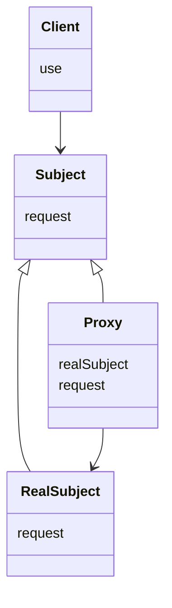
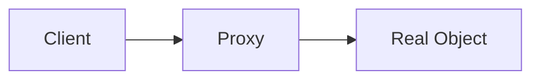
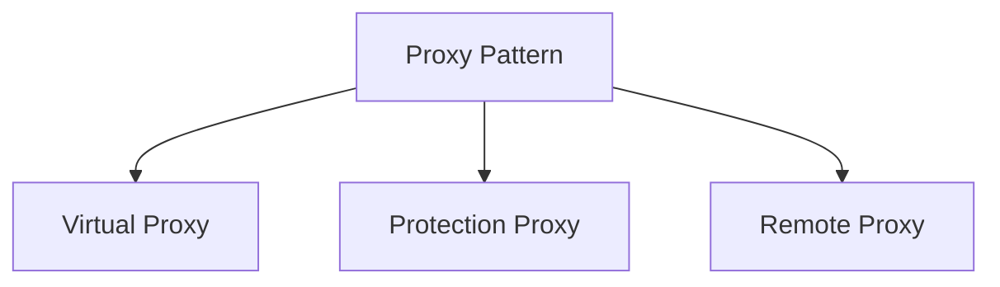
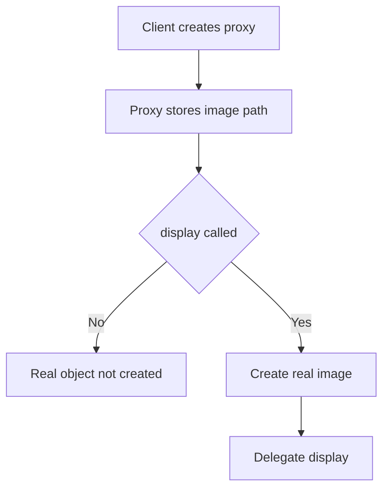
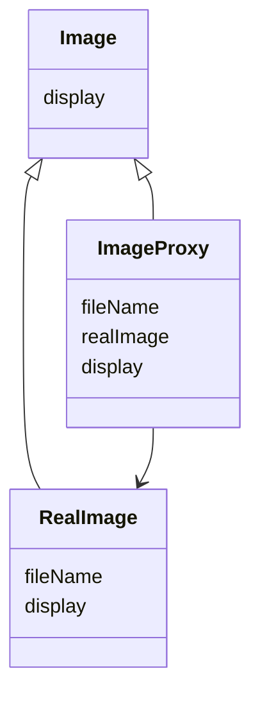
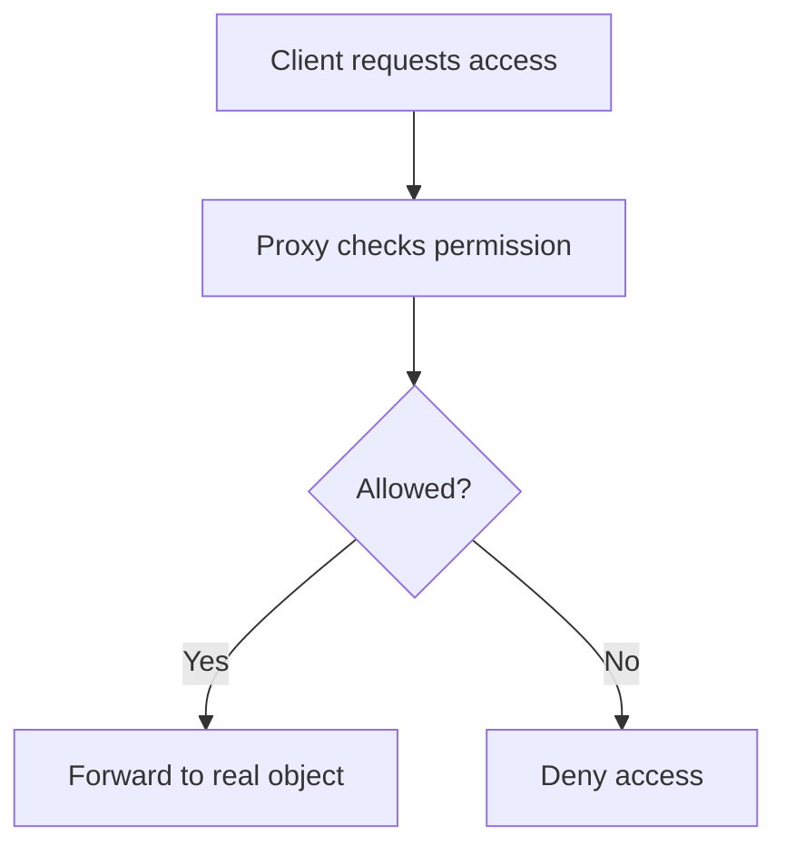
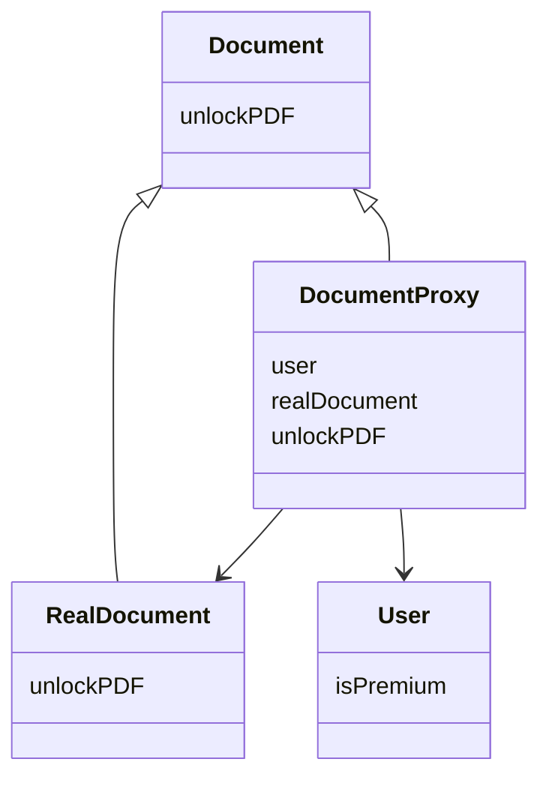
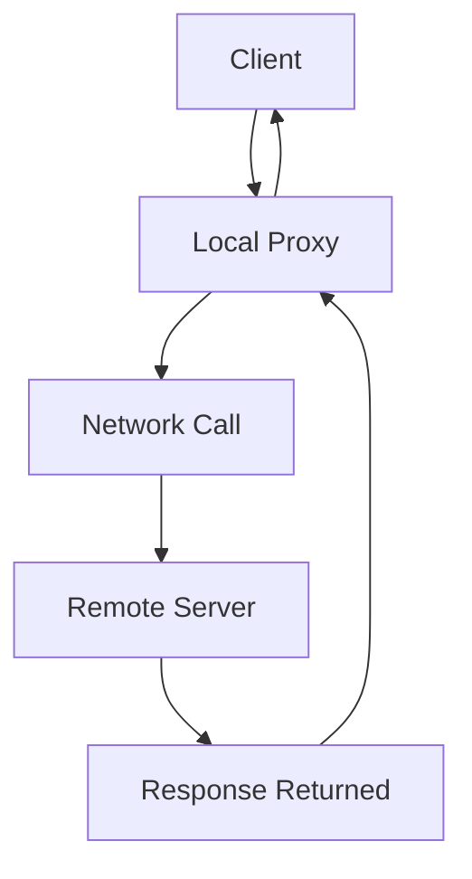
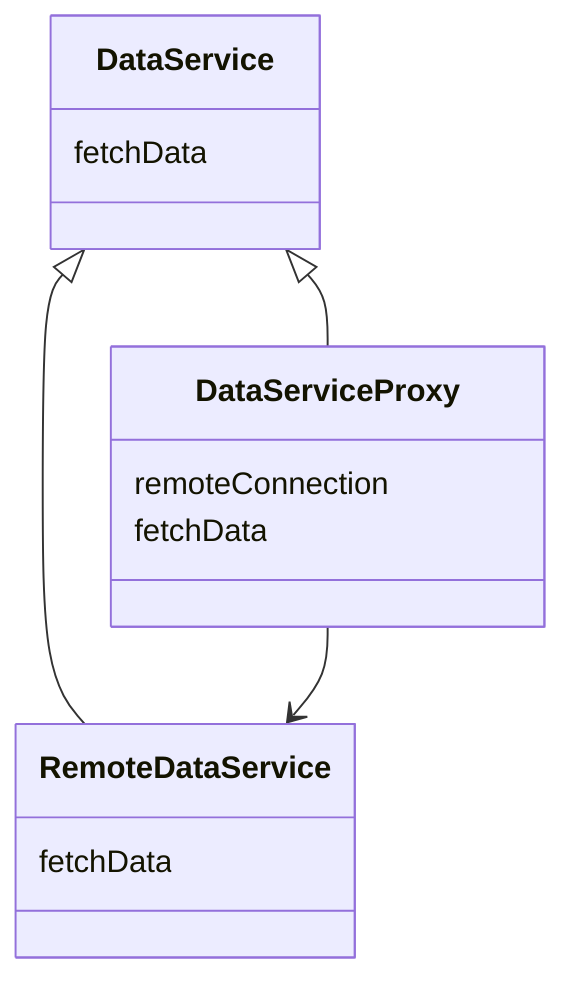
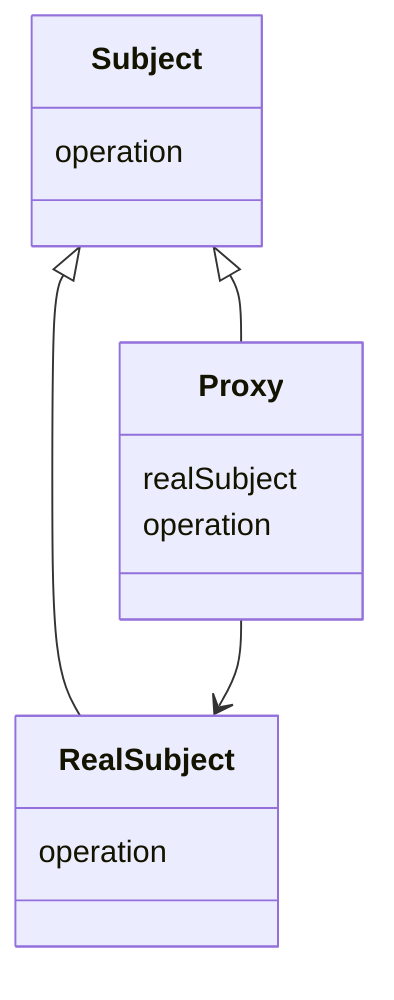

# Introduction: What is a Proxy?

Imagine a simple scenario where a user needs to access a resource.

Without a proxy:

```text
User → Resource
```

With a proxy:

```text
User → Proxy → Resource
```

The proxy acts as an intermediary.

It behaves like the real object from the client’s point of view, but internally it can add extra logic before or after forwarding the request.

---

## Why proxy is useful

A proxy helps when you want to:

* control access to an object
* delay expensive object creation
* represent a remote object locally
* validate requests before execution
* cache results
* monitor access

---

# Core idea

The main idea is very simple:

> The client should not always interact directly with the real object.

Instead, it should interact with a proxy that can:

* decide whether access is allowed
* create the real object when needed
* forward the request to the real object
* hide communication details

---

# Formal definition

The Proxy pattern provides a surrogate or placeholder for another object to control access to it.

---

# Main participants

| Role         | Meaning                          | Example                         |
| ------------ | -------------------------------- | ------------------------------- |
| Client       | The code that needs access       | User application                |
| Proxy        | The intermediary object          | Access controller / lazy loader |
| Real Subject | The actual object doing the work | File, service, document, image  |

---

## Proxy structure



---

# Why use Proxy?

A proxy gives you control over access to the real object.

That control can be used for different purposes:

| Purpose         | What proxy does                  |
| --------------- | -------------------------------- |
| Protection      | Checks permissions before access |
| Virtual loading | Creates object only when needed  |
| Remote access   | Hides network communication      |
| Caching         | Stores results for reuse         |
| Logging         | Records access activity          |
| Validation      | Checks data before forwarding    |

---

# The big idea

The client often cannot tell whether it is talking to the proxy or the real object.

That is because both usually implement the same interface.

This makes them interchangeable from the client’s perspective.

---

# Direct interaction vs proxy interaction

## Before proxy

```text
Client → Real Object
```

## With proxy

```text
Client → Proxy → Real Object
```



---

# Common characteristics of Proxy

A proxy usually has:

* the same interface as the real object
* a reference to the real object
* extra logic before or after delegating
* transparent usage from the client’s point of view

---

# Main types of Proxy

The most common proxy types are:

1. Virtual Proxy
2. Protection Proxy
3. Remote Proxy



---

# 1. Virtual Proxy

## What it does

A Virtual Proxy delays the creation of an expensive object until it is actually needed.

This is also called **lazy loading**.

---

## Why it matters

Sometimes creating an object is costly:

* loading a large image
* opening a huge file
* initializing a heavy model
* connecting to a complex resource

If the object is never used, creating it early is a waste.

A virtual proxy avoids that waste.

---

## Example idea

Suppose an image viewer loads a large image from disk.

Without proxy:

* the image is loaded immediately

With proxy:

* a lightweight proxy is created first
* the real image is loaded only when `display()` is called

---

## Virtual proxy flow



---

## Virtual proxy structure



---

```cpp
#include <iostream>
#include <string>
using namespace std;

class Image {
public:
    virtual void display() = 0;
    virtual ~Image() = default;
};

class RealImage : public Image {
private:
    string fileName;

public:
    RealImage(const string& name) : fileName(name) {
        cout << "Loading image from disk: " << fileName << endl;
    }

    void display() override {
        cout << "Displaying image: " << fileName << endl;
    }
};

class ImageProxy : public Image {
private:
    string fileName;
    RealImage* realImage;

public:
    ImageProxy(const string& name) : fileName(name), realImage(nullptr) {}

    void display() override {
        if (realImage == nullptr) {
            realImage = new RealImage(fileName);
        }
        realImage->display();
    }

    ~ImageProxy() {
        delete realImage;
    }
};

int main() {
    Image* image = new ImageProxy("photo.jpg");
    image->display();
    image->display();
    delete image;
    return 0;
}
```
```java
interface Image {
    void display();
}

class RealImage implements Image {
    private String fileName;

    RealImage(String fileName) {
        this.fileName = fileName;
        loadFromDisk();
    }

    private void loadFromDisk() {
        System.out.println("Loading image from disk: " + fileName);
    }

    public void display() {
        System.out.println("Displaying image: " + fileName);
    }
}

class ImageProxy implements Image {
    private String fileName;
    private RealImage realImage;

    ImageProxy(String fileName) {
        this.fileName = fileName;
    }

    public void display() {
        if (realImage == null) {
            realImage = new RealImage(fileName);
        }
        realImage.display();
    }
}

public class Main {
    public static void main(String[] args) {
        Image image = new ImageProxy("photo.jpg");
        image.display();
        image.display();
    }
}
```
```python
from abc import ABC, abstractmethod

class Image(ABC):
    @abstractmethod
    def display(self):
        pass

class RealImage(Image):
    def __init__(self, file_name):
        self.file_name = file_name
        self.load_from_disk()

    def load_from_disk(self):
        print(f"Loading image from disk: {self.file_name}")

    def display(self):
        print(f"Displaying image: {self.file_name}")

class ImageProxy(Image):
    def __init__(self, file_name):
        self.file_name = file_name
        self.real_image = None

    def display(self):
        if self.real_image is None:
            self.real_image = RealImage(self.file_name)
        self.real_image.display()

image = ImageProxy("photo.jpg")
image.display()
image.display()
```

## Virtual proxy explanation

* `Image` is the common interface
* `RealImage` does the heavy work
* `ImageProxy` delays creation
* the first call creates the real object
* later calls reuse it
---

# 2. Protection Proxy

## What it does

A Protection Proxy checks whether the client has permission to access the resource.

It acts like a gatekeeper.

---

## Why it matters

Sometimes an object is sensitive:

* premium document
* admin-only dashboard
* confidential file
* restricted API
* paid feature

We do not want everyone to access it.

The proxy can check authorization before forwarding the request.

---

## Protection proxy flow



---

## Protection proxy structure



---


```cpp
#include <iostream>
#include <string>
using namespace std;

class User {
public:
    bool isPremium;
    User(bool premium) : isPremium(premium) {}
};

class Document {
public:
    virtual void unlockPDF() = 0;
    virtual ~Document() = default;
};

class RealDocument : public Document {
public:
    void unlockPDF() override {
        cout << "PDF unlocked successfully" << endl;
    }
};

class DocumentProxy : public Document {
private:
    User* user;
    RealDocument realDocument;

public:
    DocumentProxy(User* u) : user(u) {}

    void unlockPDF() override {
        if (user->isPremium) {
            realDocument.unlockPDF();
        } else {
            cout << "Access denied: premium required" << endl;
        }
    }
};

int main() {
    User basicUser(false);
    User premiumUser(true);

    DocumentProxy proxy1(&basicUser);
    DocumentProxy proxy2(&premiumUser);

    proxy1.unlockPDF();
    proxy2.unlockPDF();

    return 0;
}
```
```java
interface Document {
    void unlockPDF();
}

class RealDocument implements Document {
    public void unlockPDF() {
        System.out.println("PDF unlocked successfully");
    }
}

class User {
    boolean isPremium;

    User(boolean isPremium) {
        this.isPremium = isPremium;
    }
}

class DocumentProxy implements Document {
    private User user;
    private RealDocument realDocument;

    DocumentProxy(User user) {
        this.user = user;
        this.realDocument = new RealDocument();
    }

    public void unlockPDF() {
        if (user.isPremium) {
            realDocument.unlockPDF();
        } else {
            System.out.println("Access denied: premium required");
        }
    }
}

public class Main {
    public static void main(String[] args) {
        User basicUser = new User(false);
        User premiumUser = new User(true);

        Document proxy1 = new DocumentProxy(basicUser);
        Document proxy2 = new DocumentProxy(premiumUser);

        proxy1.unlockPDF();
        proxy2.unlockPDF();
    }
}
```
```python
from abc import ABC, abstractmethod

class Document(ABC):
    @abstractmethod
    def unlock_pdf(self):
        pass

class RealDocument(Document):
    def unlock_pdf(self):
        print("PDF unlocked successfully")

class User:
    def __init__(self, is_premium):
        self.is_premium = is_premium

class DocumentProxy(Document):
    def __init__(self, user):
        self.user = user
        self.real_document = RealDocument()

    def unlock_pdf(self):
        if self.user.is_premium:
            self.real_document.unlock_pdf()
        else:
            print("Access denied: premium required")

basic_user = User(False)
premium_user = User(True)

proxy1 = DocumentProxy(basic_user)
proxy2 = DocumentProxy(premium_user)

proxy1.unlock_pdf()
proxy2.unlock_pdf()
```

---

# 3. Remote Proxy

## What it does

A Remote Proxy represents an object that lives on another machine or in another address space.

It hides the network complexity from the client.

---

## Why it matters

Without a remote proxy, the client would need to manage:

* IP addresses
* serialization
* socket calls
* connection setup
* retries
* remote communication details

A remote proxy makes the remote service feel local.

---

## Remote proxy flow



---

## Remote proxy structure



---

## Remote proxy example in C++

```cpp
#include <iostream>
#include <string>
using namespace std;

class DataService {
public:
    virtual string fetchData() = 0;
    virtual ~DataService() = default;
};

class RemoteDataService : public DataService {
public:
    string fetchData() override {
        return "Data from remote server";
    }
};

class DataServiceProxy : public DataService {
private:
    RemoteDataService* remoteService;

public:
    DataServiceProxy() : remoteService(nullptr) {}

    string fetchData() override {
        if (remoteService == nullptr) {
            cout << "Connecting to remote server..." << endl;
            remoteService = new RemoteDataService();
        }
        return remoteService->fetchData();
    }

    ~DataServiceProxy() {
        delete remoteService;
    }
};

int main() {
    DataService* service = new DataServiceProxy();
    cout << service->fetchData() << endl;
    cout << service->fetchData() << endl;
    delete service;
    return 0;
}
```
```java
interface DataService {
    String fetchData();
}

class RemoteDataService implements DataService {
    public String fetchData() {
        return "Data from remote server";
    }
}

class DataServiceProxy implements DataService {
    private RemoteDataService remoteService;

    public String fetchData() {
        if (remoteService == null) {
            System.out.println("Connecting to remote server...");
            remoteService = new RemoteDataService();
        }
        return remoteService.fetchData();
    }
}

public class Main {
    public static void main(String[] args) {
        DataService service = new DataServiceProxy();
        System.out.println(service.fetchData());
        System.out.println(service.fetchData());
    }
}
```
```python
from abc import ABC, abstractmethod

class DataService(ABC):
    @abstractmethod
    def fetch_data(self):
        pass

class RemoteDataService(DataService):
    def fetch_data(self):
        return "Data from remote server"

class DataServiceProxy(DataService):
    def __init__(self):
        self.remote_service = None

    def fetch_data(self):
        if self.remote_service is None:
            print("Connecting to remote server...")
            self.remote_service = RemoteDataService()
        return self.remote_service.fetch_data()

service = DataServiceProxy()
print(service.fetch_data())
print(service.fetch_data())
```

---

# Unifying structure

All proxy types share the same core design:

* proxy and real subject implement the same interface
* proxy holds a reference to the real subject
* client talks to the proxy as if it were the real object

This gives us:

* interchangeability
* control
* transparency
* separation of concerns



---

# Is-A and Has-A relationships

Proxy uses both:

## Is-A

The proxy is a type of the same interface as the real object.

## Has-A

The proxy has a reference to the real object.

This combination allows the proxy to act as a substitute while still delegating work.

---

# Benefits of Proxy Pattern

| Benefit        | Description                                |
| -------------- | ------------------------------------------ |
| Access control | Protects sensitive resources               |
| Lazy loading   | Delays expensive object creation           |
| Remote access  | Hides network communication                |
| Validation     | Checks input before forwarding             |
| Caching        | Improves performance by reusing results    |
| Logging        | Adds tracking without changing real object |

---

# Drawbacks of Proxy Pattern

| Drawback          | Description                               |
| ----------------- | ----------------------------------------- |
| Extra indirection | One more layer to trace                   |
| More classes      | Often requires additional wrapper classes |
| Slight overhead   | Proxy calls add a small cost              |
| Complexity        | Can be unnecessary for simple use cases   |

---

# Proxy vs Decorator

These two patterns can look similar because both wrap objects.

| Pattern   | Purpose                     |
| --------- | --------------------------- |
| Proxy     | Control access to an object |
| Decorator | Add behavior to an object   |

### Simple distinction

* Proxy answers: “Should I allow access?”
* Decorator answers: “How can I enhance behavior?”

---

# Proxy vs Adapter

| Pattern | Purpose                             |
| ------- | ----------------------------------- |
| Proxy   | Controls access                     |
| Adapter | Converts one interface into another |

Proxy keeps the same interface.
Adapter changes the interface shape.

---

# Proxy vs Facade

| Pattern | Purpose                              |
| ------- | ------------------------------------ |
| Proxy   | Stand-in for access control          |
| Facade  | Simplified front door to a subsystem |

Proxy represents a single object.
Facade simplifies many objects.

---

# Common real-world examples

| Use case                | Proxy role       |
| ----------------------- | ---------------- |
| Large image loading     | Virtual proxy    |
| Premium document access | Protection proxy |
| Remote API access       | Remote proxy     |
| Caching expensive data  | Caching proxy    |
| Request auditing        | Logging proxy    |

---

# When to use Proxy

Use Proxy when you want to:

* defer heavy object creation
* block unauthorized access
* wrap remote services
* add validation or caching
* isolate expensive or sensitive operations

---

# When not to use Proxy

Avoid using Proxy when:

* the object is simple to create
* there is no need for access control
* the added indirection would only make the design harder
* direct access is already clean and safe

---

# Summary

The Proxy Pattern provides a representative object that controls access to another object.

It is useful for:

* lazy loading
* access control
* remote communication
* validation
* caching
* logging

The proxy and real object share the same interface, so the client can use them interchangeably.

---

# Final takeaway

The Proxy Pattern is about one powerful idea:

> Put a controllable representative in front of a real object.

That representative can:

* delay creation
* protect access
* hide network complexity
* add logic without changing the real object

It is a very practical pattern for building systems that need control, flexibility, and clean separation of responsibilities.
