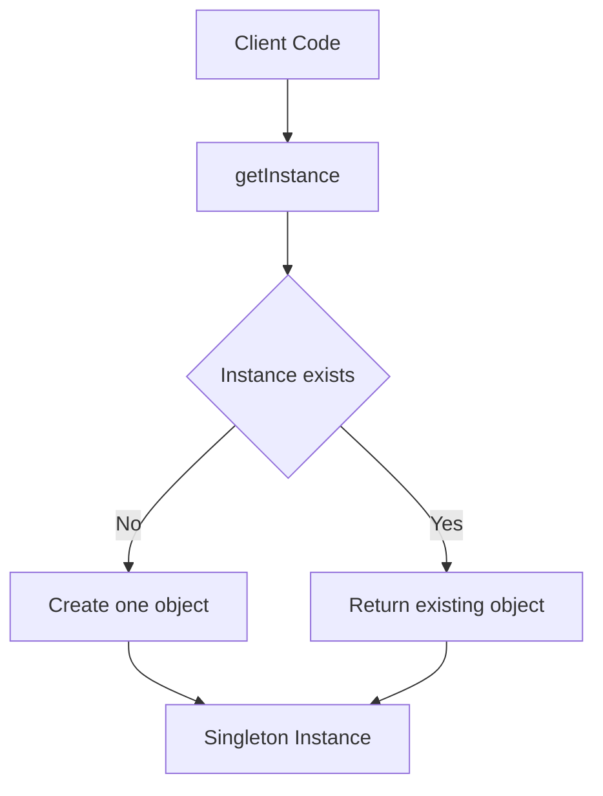
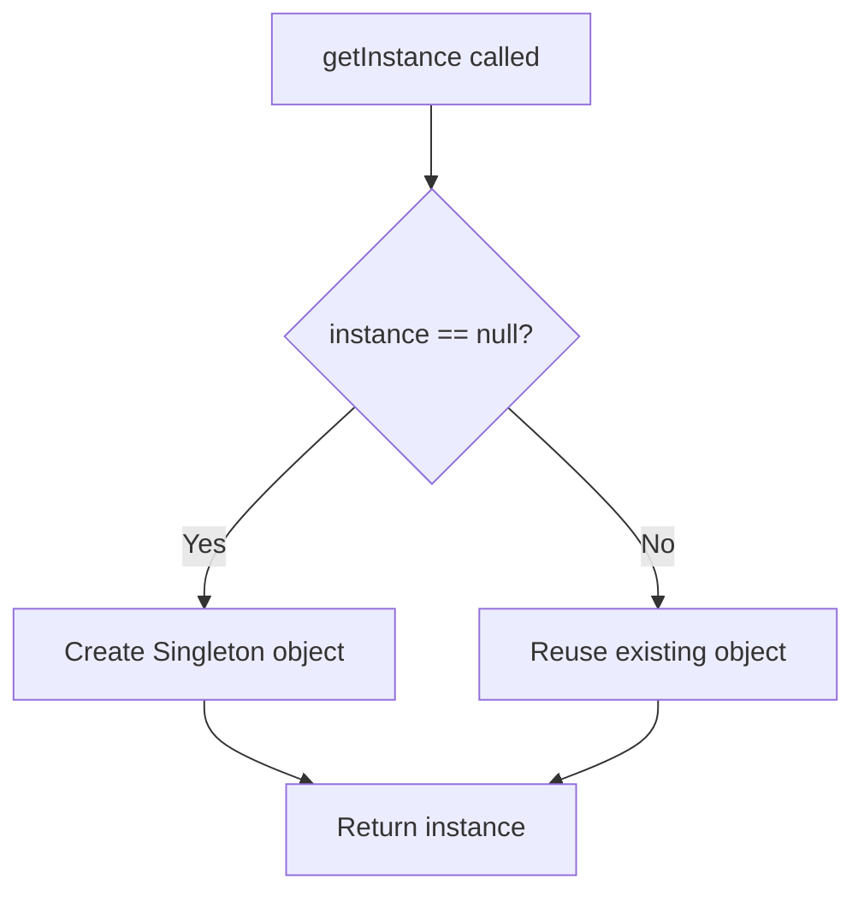
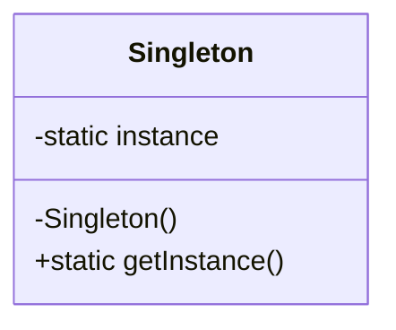
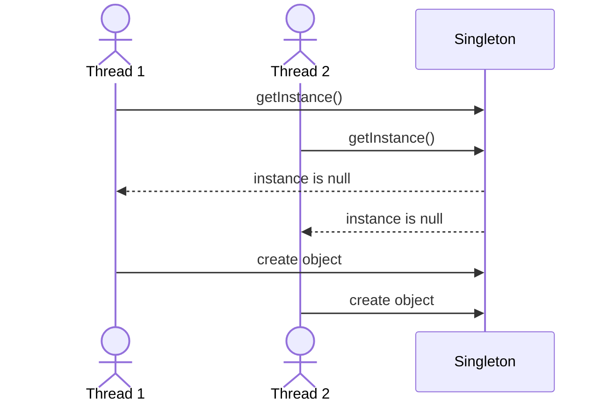
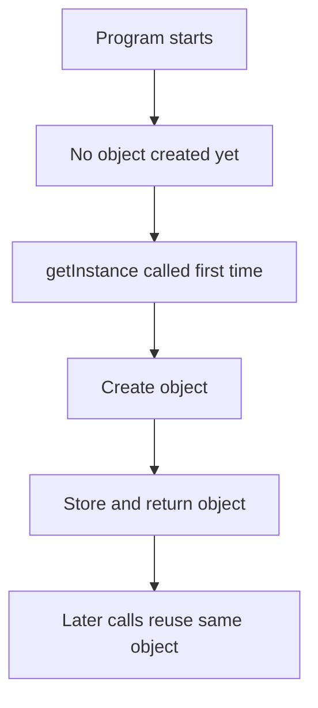
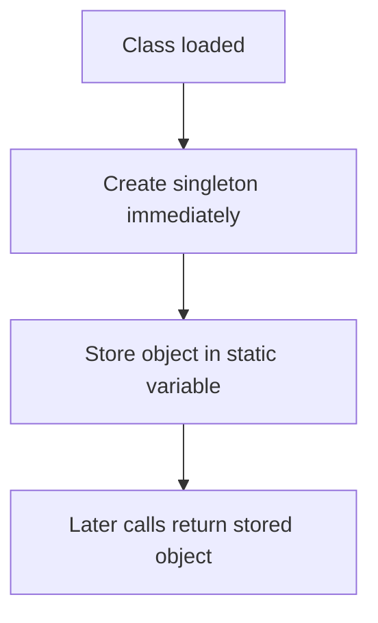
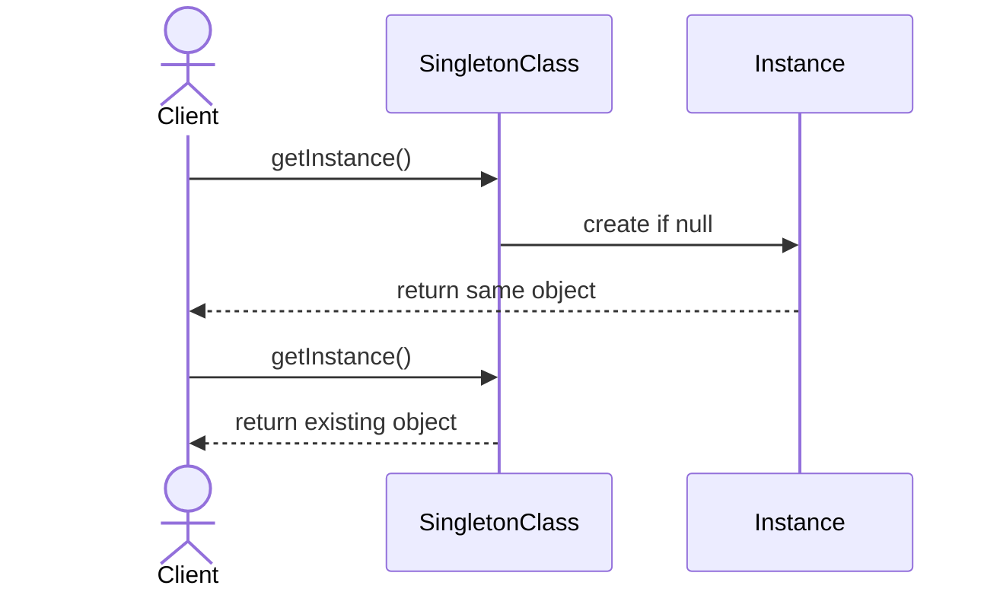

## Introduction: why Singleton exists

In a growing codebase, it is common to see the same object being created in many places. At first, this looks harmless. But later it creates problems such as:

* multiple conflicting instances
* wasted memory
* inconsistent configuration
* duplicated resources
* hard-to-track side effects
* race conditions in multithreaded code

The Singleton pattern solves this by controlling object creation at the class level.

It ensures that:

* only one object exists
* all callers access the same object
* object creation is centralized and controlled

---

# Core idea

The Singleton pattern ensures a class has only one instance and provides a single global point of access to it.



---

# Why uncontrolled object creation is a problem

Normally, classes can be instantiated many times.

For example:

```text id="singleton_problem_01"
db1 = new DatabaseConnection()
db2 = new DatabaseConnection()
db3 = new DatabaseConnection()
```

Each call creates a separate object.

That can be bad when the class represents something that should exist only once, such as:

* configuration manager
* logger
* scheduler
* cache controller
* task manager
* database connection coordinator

---

## Why multiple instances can hurt

| Problem                  | Effect                                               |
| ------------------------ | ---------------------------------------------------- |
| Too many objects         | Wastes memory                                        |
| Conflicting state        | Different parts of app may disagree                  |
| Duplicate resource usage | Expensive services may be recreated                  |
| Hard debugging           | Same service behaves differently in different places |
| Race conditions          | Multithreaded object creation can fail               |

---

# Building a Singleton step by step

A Singleton is usually created using four key ideas:

1. make the constructor private
2. create a static instance variable
3. expose a public static access method
4. initialize the object lazily or eagerly

---

## Step 1: Make constructor private

The constructor must be private so no external code can directly create objects.

That blocks this:

```text id="singleton_step_01"
new Singleton()
```

Only the class itself should be able to create its instance.

---

## Step 2: Create a public access method

Since the constructor is private, users need another way to get the object.

That method is usually named:

* `getInstance()`

It becomes the only entry point for object access.

---

## Step 3: Use static to avoid the chicken-and-egg problem

A normal method requires an object to be called.

But we do not have an object yet.

So the access method must be `static`, because static methods belong to the class itself.

This allows:

```text id="singleton_step_03"
Singleton.getInstance()
```

instead of:

```text id="singleton_bad_03"
myObject.getInstance()
```

---

## Step 4: Store the one instance in a static variable

The class needs a place to store its single object.

That is usually a private static field named something like:

* `instance`

Why static?

* because it belongs to the class
* it is shared across all calls
* it stores the one and only object

Why private?

* because outside code should not modify it directly

---

## Step 5: Create the object only when needed

This is called **lazy initialization**.

The logic is:

* if instance is null, create it
* otherwise, return the existing instance



---

# Singleton structure



---

# Real-world use cases

Singleton is useful when one object must coordinate system-wide behavior.

| Use case                        | Why Singleton helps                         |
| ------------------------------- | ------------------------------------------- |
| Logger                          | Centralizes logging into one object         |
| Configuration manager           | Provides a single source of truth           |
| Database connection coordinator | Avoids multiple expensive connections       |
| Cache manager                   | Controls shared cache state                 |
| Task scheduler                  | Keeps one scheduler coordinating tasks      |
| Metrics collector               | Aggregates application metrics in one place |

---

## Example: Logger

If many parts of the application create separate logger objects:

* log order may become confusing
* file writes may conflict
* output may be duplicated

A Singleton logger solves this by ensuring all modules write to the same logger instance.

---

## Example: Configuration manager

Many modules need:

* API keys
* file paths
* environment settings
* feature flags

If each module loads its own copy, the application may become inconsistent.

A Singleton configuration manager provides one shared configuration object.

---

# Lazy initialization vs eager initialization

There are two common Singleton initialization strategies.

---

## 1. Lazy initialization

The object is created only when needed for the first time.

### Advantages

* avoids unnecessary object creation
* useful when the object is expensive to create
* good when the object may never be used

### Disadvantages

* needs careful thread safety handling
* requires null checks

---

## 2. Eager initialization

The object is created immediately when the class is loaded.

### Advantages

* simple to implement
* naturally thread-safe in many cases
* no null checks needed

### Disadvantages

* object is created even if unused
* may waste memory or resources

---

## Comparison

| Feature        | Lazy Initialization           | Eager Initialization  |
| -------------- | ----------------------------- | --------------------- |
| Creation time  | On first request              | At class load time    |
| Resource usage | Efficient if unused           | May waste resources   |
| Complexity     | More logic                    | Simpler               |
| Thread safety  | Needs care                    | Usually simpler       |
| Best for       | Expensive or optional objects | Always-needed objects |

---

# Thread safety

Singleton becomes tricky in multithreaded applications.

If two threads call `getInstance()` at the same time, both may see `instance == null` and both may create new objects.

That breaks the Singleton rule.



---

## Why this happens

The `if (instance == null)` check is a critical section.

If two threads enter that section simultaneously, the code can create two objects.

---

## Ways to make Singleton thread-safe

Common approaches include:

* synchronized method
* synchronized block
* double-checked locking
* static initialization
* enum-based Singleton in Java

---

# Double-checked locking

Double-checked locking reduces locking overhead.

The logic is:

1. check if instance exists before locking
2. if not, lock
3. check again inside the lock
4. create the object only if still null

This avoids unnecessary synchronization after the instance has already been created.

---

# Singleton and access control

Singleton depends on strong encapsulation.

| Element                  | Purpose                        |
| ------------------------ | ------------------------------ |
| Private constructor      | Blocks direct instantiation    |
| Private static instance  | Prevents external interference |
| Public static method     | Controlled access point        |
| Optional synchronization | Thread-safe creation           |

---

# Singleton example in C++

```cpp
#include <iostream>
using namespace std;

class Singleton {
private:
    static Singleton* instance;
    Singleton() {}

public:
    Singleton(const Singleton&) = delete;
    Singleton& operator=(const Singleton&) = delete;

    static Singleton* getInstance() {
        if (instance == nullptr) {
            instance = new Singleton();
        }
        return instance;
    }

    void showMessage() {
        cout << "Singleton instance working" << endl;
    }
};

Singleton* Singleton::instance = nullptr;

int main() {
    Singleton* s1 = Singleton::getInstance();
    Singleton* s2 = Singleton::getInstance();

    s1->showMessage();

    if (s1 == s2) {
        cout << "Both references point to the same instance" << endl;
    }

    return 0;
}
```

---

## C++ explanation

### What this code does

* constructor is private
* instance is stored in a static pointer
* `getInstance()` returns the same object every time
* copy constructor and assignment are deleted to prevent duplication

### Important note

This version is not fully thread-safe.

---

# Singleton example in Java

```java
class Singleton {
    private static Singleton instance;

    private Singleton() {}

    public static Singleton getInstance() {
        if (instance == null) {
            instance = new Singleton();
        }
        return instance;
    }

    public void showMessage() {
        System.out.println("Singleton instance working");
    }
}

public class Main {
    public static void main(String[] args) {
        Singleton s1 = Singleton.getInstance();
        Singleton s2 = Singleton.getInstance();

        s1.showMessage();

        if (s1 == s2) {
            System.out.println("Both references point to the same instance");
        }
    }
}
```

---

## Java explanation

* private constructor prevents direct object creation
* static `instance` stores the one object
* `getInstance()` provides access
* both references point to the same object

---

# Singleton example in Python

Python does not have private constructors like Java or C++, so Singleton is usually implemented using class-level control.

```python
class Singleton:
    _instance = None

    def __new__(cls):
        if cls._instance is None:
            cls._instance = super().__new__(cls)
        return cls._instance

    def show_message(self):
        print("Singleton instance working")

s1 = Singleton()
s2 = Singleton()

s1.show_message()

if s1 is s2:
    print("Both references point to the same instance")
```

---

## Python explanation

* `__new__()` controls object creation
* only one object is created
* later calls return the same object
* `s1 is s2` confirms both variables refer to the same instance

---

# Singleton with lazy initialization

Lazy initialization creates the object only when needed.



---

# Singleton with eager initialization

Eager initialization creates the object early.



---

## Eager Singleton example in Java

```java
class Singleton {
    private static final Singleton instance = new Singleton();

    private Singleton() {}

    public static Singleton getInstance() {
        return instance;
    }
}
```

### Why this is useful

* very simple
* thread-safe in practice for class initialization
* no need for null checks

### Why this may be wasteful

* object is created even if never used

---

# Thread-safe Singleton in Java

A safer version uses synchronized access.

```java
class Singleton {
    private static Singleton instance;

    private Singleton() {}

    public static synchronized Singleton getInstance() {
        if (instance == null) {
            instance = new Singleton();
        }
        return instance;
    }
}
```

---

## Why synchronized helps

It allows only one thread at a time to execute `getInstance()`.

That prevents two threads from creating two objects.

---

# Double-checked locking in Java

```java
class Singleton {
    private static volatile Singleton instance;

    private Singleton() {}

    public static Singleton getInstance() {
        if (instance == null) {
            synchronized (Singleton.class) {
                if (instance == null) {
                    instance = new Singleton();
                }
            }
        }
        return instance;
    }
}
```

---

## Why volatile is used

`volatile` helps ensure that:

* the object reference is visible across threads
* instruction reordering does not break creation logic

This is a common thread-safe Singleton approach.

---

# Singleton through enum in Java

An enum-based Singleton is often considered one of the safest approaches in Java.

```java
enum Singleton {
    INSTANCE;

    public void showMessage() {
        System.out.println("Singleton instance working");
    }
}
```

### Why it is powerful

* simple
* thread-safe
* protects against serialization issues
* protects against reflection attacks better than many standard implementations

---

# Singleton and cloning / copying

A Singleton must not be duplicated accidentally.

That means:

* copy constructor should be blocked
* assignment should not create a new instance
* cloning should be prevented if supported by the language

---

# Singleton diagram



---

# Benefits of Singleton

| Benefit                   | Description                                |
| ------------------------- | ------------------------------------------ |
| Single global access      | One object is available everywhere         |
| Controlled resource usage | Prevents unnecessary duplicate objects     |
| Consistent state          | All parts of app share the same data       |
| Centralized coordination  | Useful for logging, config, caching        |
| Easy to access            | `getInstance()` gives a clean access point |

---

# Drawbacks of Singleton

| Drawback                 | Description                                        |
| ------------------------ | -------------------------------------------------- |
| Global state             | Can make debugging harder                          |
| Hidden dependencies      | Code may depend on Singleton without being obvious |
| Harder testing           | Mocking can be difficult                           |
| Thread safety complexity | Needs careful implementation                       |
| Tight coupling           | Overuse can reduce flexibility                     |

---

# Singleton as a global state holder

Singleton is often criticized because it behaves like global state.

That means:

* it can make testing harder
* it can hide dependencies
* it can create implicit coupling

So it should be used only when one instance is truly required.

---

# When to use Singleton

Use Singleton when:

* exactly one instance is needed
* the object coordinates shared access
* the object is expensive to create
* the object represents system-wide state
* the object must be globally accessible

---

# When not to use Singleton

Do not use Singleton just because it is convenient.

Avoid it when:

* multiple instances are fine
* the object should be replaceable
* testing becomes too hard
* the class does not truly represent a single shared resource

---

# Common examples

| Domain                | Example Singleton    |
| --------------------- | -------------------- |
| Logging               | Central logger       |
| Configuration         | App settings manager |
| Cache                 | Shared cache manager |
| Task management       | Scheduler            |
| Metrics               | Stats collector      |
| Hardware coordination | Printer spooler      |

---

# Singleton vs Factory

| Aspect       | Singleton             | Factory                            |
| ------------ | --------------------- | ---------------------------------- |
| Main purpose | One instance only     | Create objects                     |
| Focus        | Object uniqueness     | Object creation abstraction        |
| Access       | Global access point   | Encapsulated creation logic        |
| Typical use  | Logger, config, cache | Notification, payment, UI creation |

---

# Singleton vs static class

| Aspect                   | Singleton | Static class              |
| ------------------------ | --------- | ------------------------- |
| Object exists            | Yes       | No                        |
| Can hold state           | Yes       | Usually only static state |
| Can implement interfaces | Yes       | Depends on language       |
| Can be passed around     | Yes       | Not as an instance        |

Singleton is an object.
A static class is not.

---

# Best practices

* use Singleton only when one instance is truly needed
* keep the class focused on a single responsibility
* make construction access private
* protect against duplication
* consider thread safety early
* avoid putting too much logic into a Singleton
* prefer dependency injection when possible

---

# Common mistakes

| Mistake                          | Problem                            |
| -------------------------------- | ---------------------------------- |
| Making everything Singleton      | Creates hidden global state        |
| Forgetting thread safety         | Can create duplicate instances     |
| Allowing cloning or copying      | Breaks the one-instance rule       |
| Mixing too many responsibilities | Makes the Singleton a “god object” |
| Using Singleton when unnecessary | Adds complexity without benefit    |

---

# Summary

The Singleton pattern ensures:

* one class
* one instance
* one access point

It is built using:

* private constructor
* static instance variable
* public static access method

It is useful for:

* logging
* configuration
* shared coordination
* caching
* resource management

But it must be used carefully because it can introduce hidden coupling and testing difficulty.

---

# Final takeaway

The Singleton pattern is about **controlled uniqueness**.

It says:

> “This class should exist only once, and everyone should use the same object.”

That makes it powerful for system-wide coordination, but also risky if overused.

A good Singleton is:

* deliberate
* minimal
* controlled
* thread-safe when needed
* truly necessary for the problem at hand
