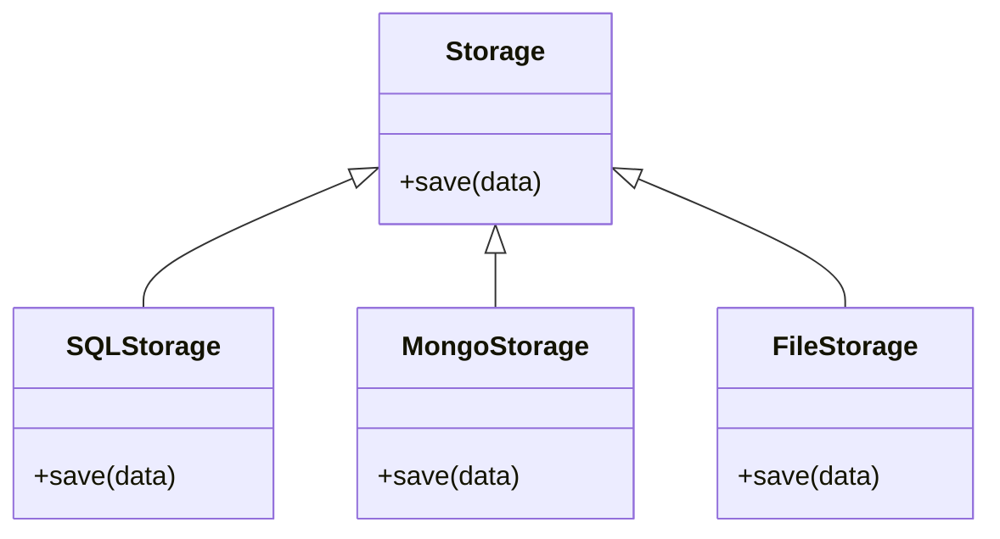
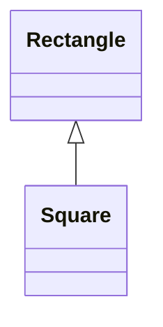
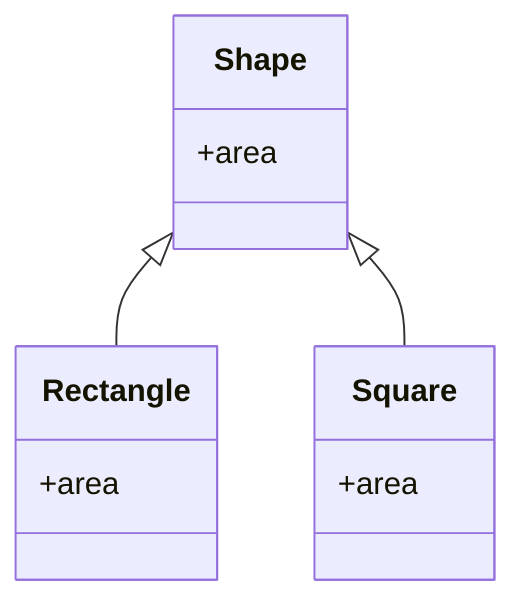
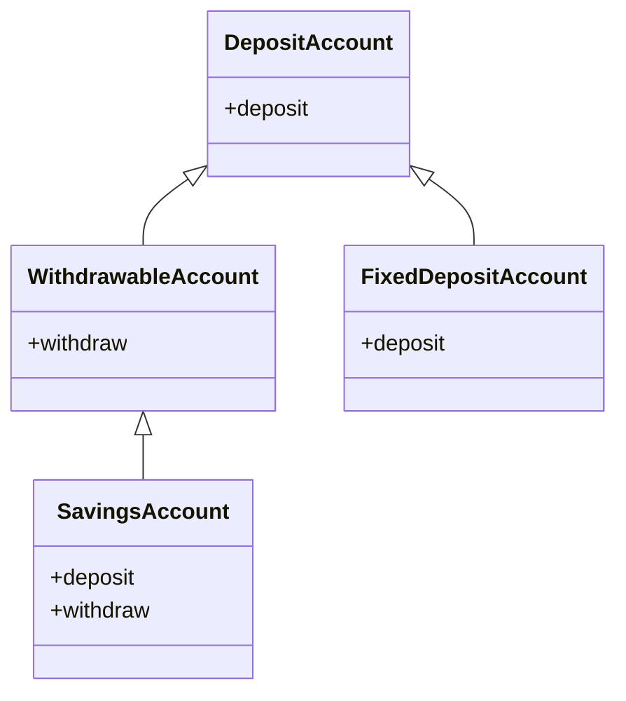
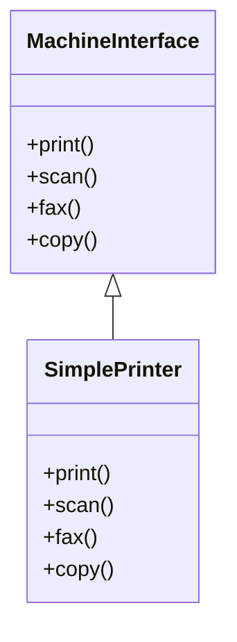
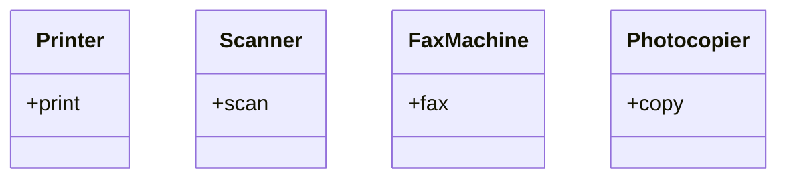
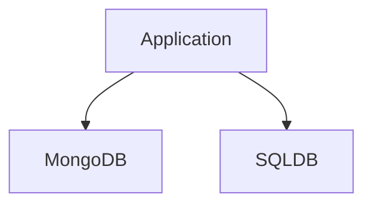
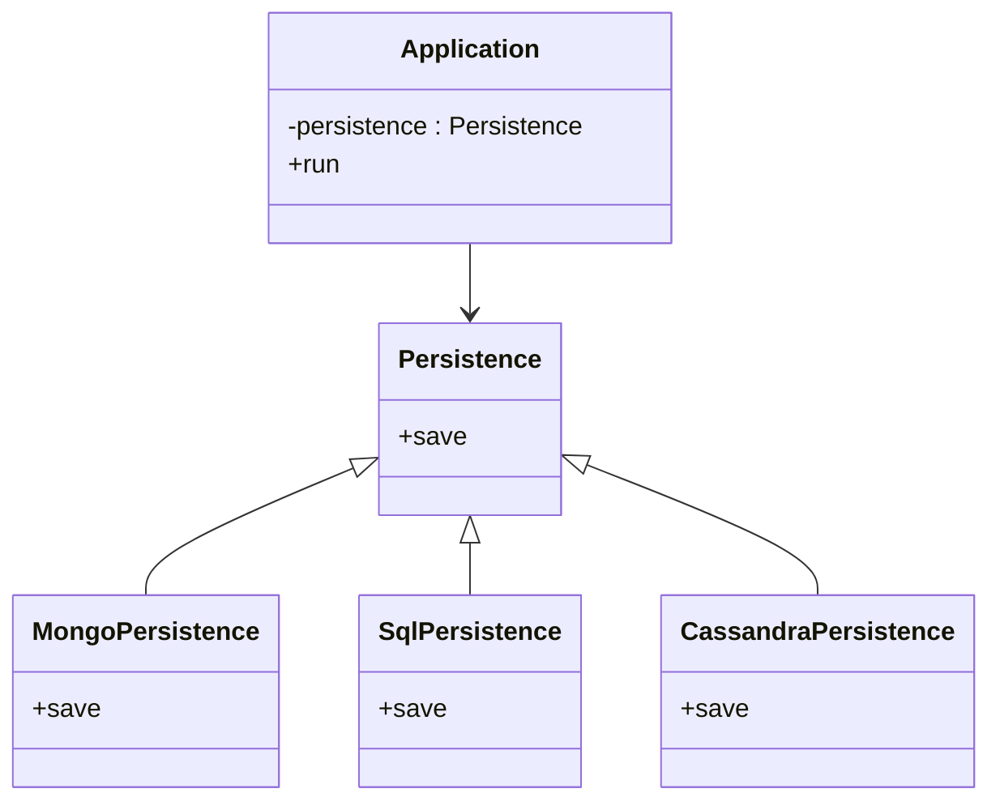

## Why SOLID matters

SOLID is important because it helps software systems become:

* easier to maintain
* easier to read
* easier to extend
* easier to test
* less buggy
* more reusable
* less tightly coupled

These principles are used heavily in:

* low level design
* object-oriented design
* backend application architecture
* interview problem solving
* scalable production code

---

# 1. Single Responsibility Principle

## Definition

A class should have only one reason to change.

In simple words:

> A class should do only one thing.

If a class is responsible for too many tasks, then any change in one task may force changes in unrelated parts of the same class.

---

## Why SRP is important

When a class has too many responsibilities:

* it becomes difficult to understand
* it becomes harder to test
* changes become risky
* bugs increase
* code becomes less reusable

---

## SRP Violation Example

Suppose a single class handles:

* user data
* email sending
* report generation
* database saving

This creates a large and messy class.

### Bad design

```python
class UserProfile:
    """
    VIOLATION: This class handles more than one responsibility.
    1. user data management
    2. sending email notifications
    """
    def __init__(self, username, email):
        self.username = username
        self.email = email

    def change_username(self, new_name):
        self.username = new_name
        print(f"Username changed to {new_name}")

    def send_welcome_email(self):
        print(f"Sending welcome email to {self.email}")
```

### Problem

If the email template changes, or if the username data structure changes, the same class must be edited for both reasons.

That means the class has multiple reasons to change, which violates SRP.

---

## SRP Adherence Example

Split the responsibilities into separate classes.

### Good design

* `User` handles user data
* `EmailService` handles email logic
* `ReportGenerator` handles report logic
* `UserRepository` handles persistence



---

## SRP explanation

Each class now has one responsibility:

| Class             | Responsibility               |
| ----------------- | ---------------------------- |
| `User`            | Stores and updates user data |
| `EmailService`    | Sends emails                 |
| `ReportGenerator` | Generates reports            |
| `UserRepository`  | Saves data                   |

This makes the system easier to maintain.

---

## SRP in three languages

```cpp
#include <iostream>
using namespace std;

class User {
public:
    string username;
    string email;

    User(string u, string e) : username(u), email(e) {}

    void changeUsername(string newName) {
        username = newName;
    }
};

class EmailService {
public:
    void sendWelcomeEmail(const User& user) {
        cout << "Sending welcome email to " << user.email << endl;
    }
};
```
```java
class User {
    String username;
    String email;

    User(String username, String email) {
        this.username = username;
        this.email = email;
    }

    void changeUsername(String newName) {
        username = newName;
    }
}

class EmailService {
    void sendWelcomeEmail(User user) {
        System.out.println("Sending welcome email to " + user.email);
    }
}
```
```python
class User:
    def __init__(self, username, email):
        self.username = username
        self.email = email

    def change_username(self, new_name):
        self.username = new_name

class EmailService:
    def send_welcome_email(self, user):
        print(f"Sending welcome email to {user.email}")
```

---

# 2. Open Closed Principle

## Definition

A class should be **open for extension** but **closed for modification**.

In simple words:

> Add new functionality without changing old working code.

This is one of the most practical principles in real-world software.

---

## Why OCP is important

If existing code is modified every time a new feature is added:

* bugs can be introduced into old logic
* testing becomes harder
* code becomes brittle
* the system becomes difficult to scale

OCP solves this by encouraging abstraction and extensibility.

---

## OCP Violation Example

Suppose a storage class contains methods like:

* `saveToSQL()`
* `saveToMongo()`

Now if a new database is introduced, you must modify the same class again.

That is a violation of OCP.

### Bad design

```python
class DBStorage:
    def save_to_sql(self, data):
        print(f"Saving {data} to SQL")

    def save_to_mongo(self, data):
        print(f"Saving {data} to MongoDB")
```

### Problem

If later you want:

* `saveToFile()`
* `saveToCassandra()`
* `saveToRedis()`

you would keep modifying the same class.

---

## OCP Adherence with abstraction

Instead, define a common abstraction and extend it by adding new classes.



---

## OCP explanation

Now the system works like this:

* the main logic depends on `Storage`
* new storage types are added by creating new classes
* old classes do not need modification

This is the correct way to follow OCP.

---

## Why abstraction helps OCP

Abstraction creates a stable contract.

That contract can be implemented in many ways.

In Java:

* interfaces
* abstract classes

In C++:

* abstract classes using pure virtual functions

In Python:

* abstract base classes using `abc`

---

## OCP example in three languages


```cpp
#include <iostream>
using namespace std;

class Storage {
public:
    virtual void save(string data) = 0;
};

class SQLStorage : public Storage {
public:
    void save(string data) override {
        cout << "Saving " << data << " to SQL" << endl;
    }
};

class MongoStorage : public Storage {
public:
    void save(string data) override {
        cout << "Saving " << data << " to MongoDB" << endl;
    }
};

class FileStorage : public Storage {
public:
    void save(string data) override {
        cout << "Saving " << data << " to file" << endl;
    }
};
```
```java
abstract class Storage {
    abstract void save(String data);
}

class SQLStorage extends Storage {
    void save(String data) {
        System.out.println("Saving " + data + " to SQL");
    }
}

class MongoStorage extends Storage {
    void save(String data) {
        System.out.println("Saving " + data + " to MongoDB");
    }
}

class FileStorage extends Storage {
    void save(String data) {
        System.out.println("Saving " + data + " to file");
    }
}
```
```python
from abc import ABC, abstractmethod

class Storage(ABC):
    @abstractmethod
    def save(self, data):
        pass

class SQLStorage(Storage):
    def save(self, data):
        print(f"Saving {data} to SQL")

class MongoStorage(Storage):
    def save(self, data):
        print(f"Saving {data} to MongoDB")

class FileStorage(Storage):
    def save(self, data):
        print(f"Saving {data} to file")
```

---

## OCP with area calculation example

### OCP violation approach

```python
import math

def calculate_area(shapes):
    total = 0
    for shape in shapes:
        if shape["type"] == "rectangle":
            total += shape["width"] * shape["height"]
        elif shape["type"] == "circle":
            total += math.pi * shape["radius"] ** 2
    return total
```

### Problem

If you add a triangle, you must modify the function.

That breaks OCP.

---

### OCP compliant approach

```python
from abc import ABC, abstractmethod
import math

class Shape(ABC):
    @abstractmethod
    def calculate_area(self):
        pass

class Rectangle(Shape):
    def __init__(self, width, height):
        self.width = width
        self.height = height

    def calculate_area(self):
        return self.width * self.height

class Circle(Shape):
    def __init__(self, radius):
        self.radius = radius

    def calculate_area(self):
        return math.pi * self.radius * self.radius

class Triangle(Shape):
    def __init__(self, base, height):
        self.base = base
        self.height = height

    def calculate_area(self):
        return 0.5 * self.base * self.height

class AreaCalculator:
    def total_area(self, shapes):
        return sum(shape.calculate_area() for shape in shapes)
```

### Why this works

You can add new shapes without changing `AreaCalculator`.

That is true extensibility.

---

# 3. Liskov Substitution Principle

## Definition

Subclasses should be substitutable for their base classes.

In simple words:

> If a program works with a base class, it should also work correctly with any subclass.

---

## Why LSP is important

If a subclass changes the expected behavior of the parent class:

* client code may break
* polymorphism becomes unsafe
* bugs appear in unexpected places
* inheritance becomes dangerous

---

## LSP core idea

A subclass must honor the contract of the base class.

It should not surprise the caller.

---

## LSP violation example: Rectangle and Square

A common example is `Rectangle` and `Square`.

A square is geometrically a rectangle, but in code the behavioral contract can break.

For example:

* rectangle allows width and height to change independently
* square forces both sides to remain equal

That means code written for a rectangle may behave incorrectly when given a square.

---

### Diagram



---

## Why this is a problem

Suppose client code does this:

1. set width to 10
2. expect height to remain unchanged

For a square, changing width may also change height.

That breaks the expectation of the base class.

---

## Better design

Instead of forcing `Square` to inherit from `Rectangle`, both can implement a common abstraction like `Shape`.



This avoids the incorrect inheritance relationship.

---

## LSP and bank accounts example

A fixed deposit account should not necessarily support withdrawal.

If a base account class has `withdraw()`, and a fixed deposit inherits it, then the child may throw exceptions or behave incorrectly.

That is an LSP issue.

---

### Better design

Split the contract into smaller abstractions.



---

## LSP explanation

Now:

* `FixedDepositAccount` only supports deposit
* `SavingsAccount` supports both deposit and withdraw

No class is forced to implement behavior it does not support.

---

## LSP in three languages


```cpp
#include <iostream>
using namespace std;

class Shape {
public:
    virtual double area() = 0;
};

class Rectangle : public Shape {
    double width, height;
public:
    Rectangle(double w, double h) : width(w), height(h) {}
    double area() override {
        return width * height;
    }
};

class Square : public Shape {
    double side;
public:
    Square(double s) : side(s) {}
    double area() override {
        return side * side;
    }
};
```
```java
abstract class Shape {
    abstract double area();
}

class Rectangle extends Shape {
    double width;
    double height;

    Rectangle(double width, double height) {
        this.width = width;
        this.height = height;
    }

    double area() {
        return width * height;
    }
}

class Square extends Shape {
    double side;

    Square(double side) {
        this.side = side;
    }

    double area() {
        return side * side;
    }
}
```
```python
from abc import ABC, abstractmethod

class Shape(ABC):
    @abstractmethod
    def area(self):
        pass

class Rectangle(Shape):
    def __init__(self, width, height):
        self.width = width
        self.height = height

    def area(self):
        return self.width * self.height

class Square(Shape):
    def __init__(self, side):
        self.side = side

    def area(self):
        return self.side * self.side
```

---

## LSP rules in simple form

| Rule                         | Meaning                                                         |
| ---------------------------- | --------------------------------------------------------------- |
| Input should not be stricter | A subclass should accept at least what the parent accepts       |
| Output should not be weaker  | A subclass should give results at least as useful as the parent |
| No surprise behavior         | A subclass should not break the client’s assumptions            |
| Preserve invariants          | The important rules of the base class must remain true          |

---

# 4. Interface Segregation Principle

## Definition

Clients should not be forced to depend on interfaces they do not use.

In simple words:

> Prefer many small interfaces over one large interface.

---

## Why ISP is important

A large interface often forces classes to implement methods they do not need.

This causes:

* unnecessary code
* dummy implementations
* exception throwing methods
* poor design
* tighter coupling

---

## ISP violation example

Suppose a printer interface has methods like:

* print
* scan
* fax
* copy

Now a simple printer that can only print is forced to implement scan and fax too.

That is bad design.



---

## Problem

The `SimplePrinter` must implement methods it does not support.

Usually it ends up with:

* empty methods
* exceptions
* fake logic

---

## ISP adherence

Split the interface into smaller interfaces.



---

## ISP explanation

Now classes only implement what they really need.

| Class           | Implements                                        |
| --------------- | ------------------------------------------------- |
| `SimplePrinter` | `Printer`                                         |
| `OfficeMachine` | `Printer`, `Scanner`, `FaxMachine`, `Photocopier` |

This gives better modularity and cleaner code.

---

## ISP in three languages


```cpp
#include <iostream>
using namespace std;

class Printer {
public:
    virtual void print() = 0;
};

class Scanner {
public:
    virtual void scan() = 0;
};

class SimplePrinter : public Printer {
public:
    void print() override {
        cout << "Printing" << endl;
    }
};
```
```java
interface Printer {
    void print();
}

interface Scanner {
    void scan();
}

class SimplePrinter implements Printer {
    public void print() {
        System.out.println("Printing");
    }
}
```
```python
from abc import ABC, abstractmethod

class Printer(ABC):
    @abstractmethod
    def print(self):
        pass

class Scanner(ABC):
    @abstractmethod
    def scan(self):
        pass

class SimplePrinter(Printer):
    def print(self):
        print("Printing")
```

---

# 5. Dependency Inversion Principle

## Definition

High-level modules should not depend on low-level modules.
Both should depend on abstractions.

Also:

> abstractions should not depend on details; details should depend on abstractions.

---

## Why DIP is important

Without DIP:

* high-level logic becomes tightly coupled to low-level classes
* replacing database or service implementations becomes difficult
* the system becomes rigid
* testing becomes harder

DIP helps create flexible architecture.

---

## Example problem

Suppose a high-level application directly depends on:

* MongoDB storage
* SQL storage

If you want to switch from MongoDB to Cassandra, you must change the application logic.

That is not good design.

---

## DIP violation



### Problem

The application depends directly on concrete implementations.

---

## DIP adherence

Instead, create an abstraction like `Persistence`.

```mermaid
classDiagram
    class Persistence {
        +save
    }

    class MongoPersistence {
        +save
    }

    class SqlPersistence {
        +save
    }

    class CassandraPersistence {
        +save
    }

    class Application {
        -persistence : Persistence
        +run
    }

    Persistence <|-- MongoPersistence
    Persistence <|-- SqlPersistence
    Persistence <|-- CassandraPersistence
    Application --> Persistence
```

---

## DIP explanation

Now:

* the application depends on `Persistence`
* MongoDB, SQL, Cassandra, and file storage all implement that abstraction
* you can replace one implementation with another without changing the high-level logic

That is the main power of DIP.

---

## DIP in three languages

```cpp
#include <iostream>
using namespace std;

class Persistence {
public:
    virtual void save() = 0;
};

class MongoPersistence : public Persistence {
public:
    void save() override {
        cout << "Saving to MongoDB" << endl;
    }
};

class SqlPersistence : public Persistence {
public:
    void save() override {
        cout << "Saving to SQL" << endl;
    }
};

class Application {
    Persistence* persistence;
public:
    Application(Persistence* p) : persistence(p) {}

    void run() {
        persistence->save();
    }
};
```
```java
interface Persistence {
    void save();
}

class MongoPersistence implements Persistence {
    public void save() {
        System.out.println("Saving to MongoDB");
    }
}

class SqlPersistence implements Persistence {
    public void save() {
        System.out.println("Saving to SQL");
    }
}

class Application {
    private Persistence persistence;

    Application(Persistence persistence) {
        this.persistence = persistence;
    }

    void run() {
        persistence.save();
    }
}
```
```python
from abc import ABC, abstractmethod

class Persistence(ABC):
    @abstractmethod
    def save(self):
        pass

class MongoPersistence(Persistence):
    def save(self):
        print("Saving to MongoDB")

class SqlPersistence(Persistence):
    def save(self):
        print("Saving to SQL")

class Application:
    def __init__(self, persistence):
        self.persistence = persistence

    def run(self):
        self.persistence.save()
```

---

# High-Level vs Low-Level Modules

| Module type       | Meaning                 | Example                                           |
| ----------------- | ----------------------- | ------------------------------------------------- |
| High-level module | Business logic / policy | Application, service layer                        |
| Low-level module  | Implementation details  | Database connector, file storage, payment gateway |

---

## DIP in simple terms

The high-level module should not know whether data is saved to:

* MongoDB
* MySQL
* file system
* Cassandra

It should only know that some persistence mechanism exists.

---

# SOLID Summary Table

| Principle | Main idea                        | Solves             |
| --------- | -------------------------------- | ------------------ |
| SRP       | One class, one responsibility    | Messy classes      |
| OCP       | Extend without modifying         | Risky edits        |
| LSP       | Subclasses must be substitutable | Broken inheritance |
| ISP       | Small focused interfaces         | Fat interfaces     |
| DIP       | Depend on abstractions           | Tight coupling     |

---

# Common real-world project problems solved by SOLID

| Problem                                          | SOLID principle |
| ------------------------------------------------ | --------------- |
| One class doing too many things                  | SRP             |
| New features breaking existing code              | OCP             |
| Child class behaving unexpectedly                | LSP             |
| Classes forced to implement useless methods      | ISP             |
| Code tightly coupled to concrete implementations | DIP             |

---

# How SOLID helps in interviews

When solving LLD or OOP interview questions, SOLID helps you:

* design better classes
* justify design decisions
* avoid tightly coupled code
* make the solution easier to extend
* show good software engineering thinking

---

# Final Summary

SOLID is a set of five object-oriented design principles that help software remain clean, flexible, and maintainable.

* **SRP** keeps classes focused
* **OCP** allows extension without modification
* **LSP** ensures safe inheritance
* **ISP** keeps interfaces small and useful
* **DIP** decouples high-level logic from low-level details

Together, these principles make code easier to understand, easier to test, and much easier to scale in real-world systems.
