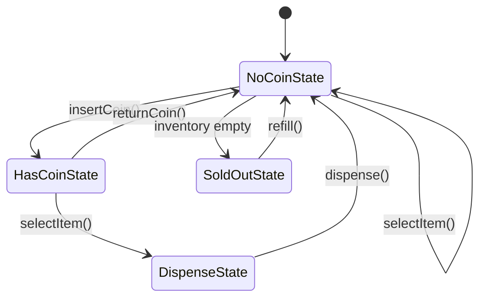
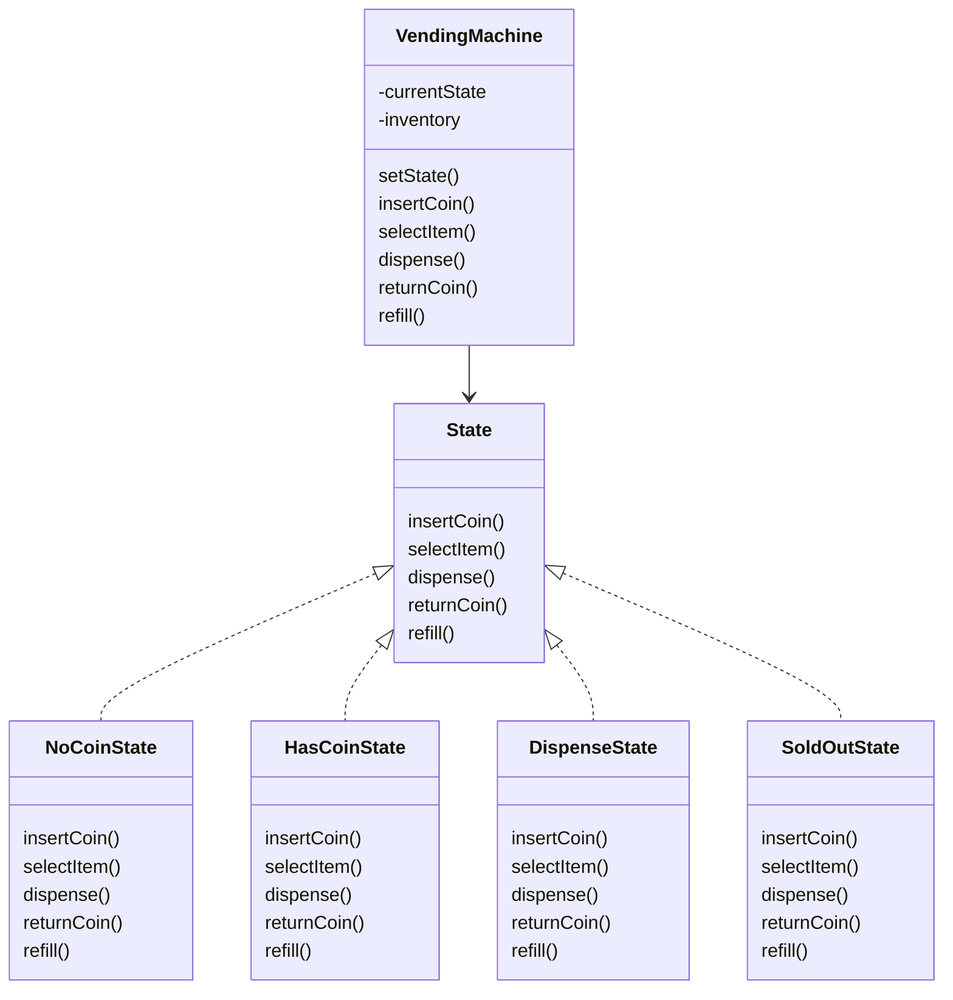
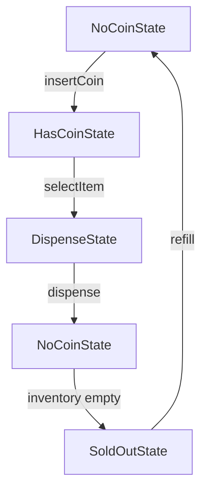
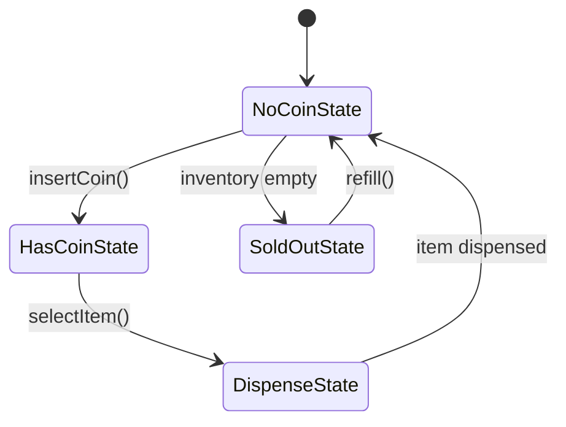
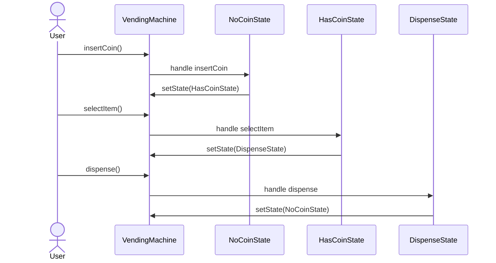
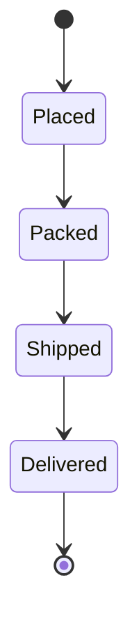
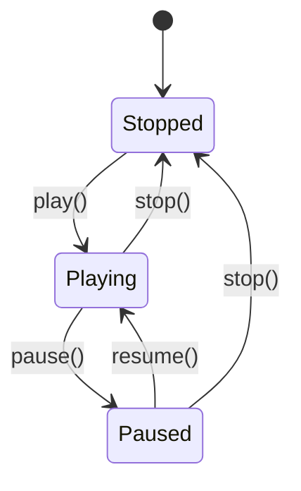

# State Design Pattern

The **State Design Pattern** is a behavioral design pattern that allows an object to change its behavior when its internal state changes.

From the outside, it may look like the object has changed its class.

That is the key idea:

> The object behaves differently depending on its current state.

The State pattern is especially useful when:

- an object has multiple states
- behavior depends on the current state
- the same method should do different things in different states
- large `if/else` or `switch` blocks are becoming messy
- you want to follow SRP and OCP

---

# Introduction: When an Object Changes Its Mind

Think about yourself.

You behave differently when:
- you are resting
- you are working
- you are eating
- you are sleeping

Your behavior depends on your current state.

Software objects can behave in a similar way.

The State Pattern is a clean way to model that behavior.

---

# Why this pattern matters

Without the State pattern, we often end up writing:

- huge conditional blocks
- repeated logic
- hard-to-maintain classes
- state checks in every method

With the State pattern:
- each state gets its own class
- behavior is grouped logically
- the main object becomes simpler
- transitions become easier to manage

---

# The Core Idea

The core idea is simple:

> An object’s behavior changes based on its internal state.

Instead of keeping all logic inside one big class, we move state-specific behavior into separate state classes.

---

# Formal Definition

The State Design Pattern allows an object to alter its behavior when its internal state changes. The object will appear to change its class.

---

# The Problem It Solves

Consider a vending machine.

Its behavior depends on whether it has:
- no coin
- a coin inserted
- an item selected
- no items left

If we put all logic in one class, we get ugly conditional code.

---

## Problem with `if/else`

```text id="state_bad_01"
if state == NO_COIN:
    do something
else if state == HAS_COIN:
    do something else
else if state == SOLD_OUT:
    reject action
````

As the number of states grows, this gets worse.

---

# Example: Vending Machine

A vending machine is one of the best examples of the State pattern.

It may be in one of these states:

* `NoCoinState`
* `HasCoinState`
* `DispenseState`
* `SoldOutState`

The same operation may behave differently depending on the current state.

---

# State Machine Diagram



---

# Main Participants

| Role           | Meaning                           | Vending Machine Example             |
| -------------- | --------------------------------- | ----------------------------------- |
| Context        | Main object holding current state | `VendingMachine`                    |
| State          | Interface for state behavior      | `State`                             |
| Concrete State | Specific behavior for a state     | `NoCoinState`, `HasCoinState`, etc. |

---

# UML Diagram


---

# Core Concept: Context and State

The State pattern is built around two main ideas:

## 1. Context

The context is the main object that:

* holds the current state
* delegates operations to that state
* updates state when transitions happen

In our example:

* `VendingMachine` is the context

---

## 2. State classes

These classes:

* define state-specific behavior
* know how to handle operations in that state
* decide which state comes next

Examples:

* `NoCoinState`
* `HasCoinState`
* `DispenseState`
* `SoldOutState`

---

# Why the Context should stay “dumb”

The context should not contain all the state logic.

Instead:

* it just forwards requests
* it stores the current state
* it lets the current state decide what to do

This keeps the context simple and focused.

---

# State Transition Logic

A state can:

* allow an operation
* reject an operation
* transition to another state
* stay in the same state

---

# Example Operations

The vending machine may support:

| Operation      | Meaning                     |
| -------------- | --------------------------- |
| `insertCoin()` | user inserts money          |
| `selectItem()` | user chooses an item        |
| `dispense()`   | machine dispenses item      |
| `returnCoin()` | user cancels                |
| `refill()`     | technician restocks machine |

---

# State Table

| Current State   | Operation      | Result                          |
| --------------- | -------------- | ------------------------------- |
| `NoCoinState`   | `insertCoin()` | `HasCoinState`                  |
| `NoCoinState`   | `selectItem()` | stay in `NoCoinState`           |
| `HasCoinState`  | `selectItem()` | `DispenseState`                 |
| `HasCoinState`  | `returnCoin()` | `NoCoinState`                   |
| `DispenseState` | `dispense()`   | `NoCoinState` or `SoldOutState` |
| `SoldOutState`  | `refill()`     | `NoCoinState`                   |

---

# Visual Flow



---

# Why State Pattern is needed

If you put everything in one class, you will likely write lots of conditions:

* check current state in every method
* duplicate transition logic
* make the class huge and unreadable

The State pattern removes that clutter.

---

# Before the State Pattern

```text id="state_before_01"
class VendingMachine:
    state = "NO_COIN"

    def insertCoin():
        if state == "NO_COIN":
            state = "HAS_COIN"
        elif state == "SOLD_OUT":
            reject
```

This becomes unmanageable as the number of states grows.

---

# After the State Pattern

Each state class handles its own behavior.

```text id="state_after_01"
VendingMachine -> CurrentState
CurrentState -> decides behavior
```

---

# State Diagram: Vending Machine



---

# Example of State-specific Behavior

## NoCoinState

* accept coin
* reject item selection
* reject dispense request

## HasCoinState

* accept item selection
* allow coin return
* reject duplicate coin insertion

## DispenseState

* perform dispensing
* decide next state

## SoldOutState

* reject most actions
* accept refill

---

# Real-world analogy

Think of a person at different points in the day.

| State    | Behavior        |
| -------- | --------------- |
| Resting  | relaxed, slow   |
| Working  | focused, active |
| Sleeping | unresponsive    |

The same person behaves differently depending on state.

That is exactly how objects behave in the State pattern.

---

# Another real-world example: ATM

ATM states may include:

* `Idle`
* `CardInserted`
* `PINValidated`
* `DispensingCash`
* `OutOfService`

An ATM changes behavior based on its current state.

---

# Another real-world example: Document editor

A document may go through states like:

* `Draft`
* `InReview`
* `Published`
* `Archived`

Actions may behave differently in each state.

---

# State pattern structure

The pattern usually contains:

| Component       | Purpose                           |
| --------------- | --------------------------------- |
| Context         | stores current state              |
| State interface | defines behavior contract         |
| Concrete states | implement state-specific behavior |

---

# How it works in code

1. Client calls a method on the context
2. Context forwards the call to the current state
3. State handles it
4. State may change the context’s state
5. Next behavior depends on new state

---

# Sequence Diagram



---

# Example

```cpp
#include <iostream>
#include <memory>
using namespace std;

class VendingMachine;

class State {
public:
    virtual void insertCoin() = 0;
    virtual void selectItem() = 0;
    virtual void dispense() = 0;
    virtual void returnCoin() = 0;
    virtual void refill(int count) = 0;
    virtual ~State() = default;
};

class VendingMachine {
private:
    shared_ptr<State> noCoinState;
    shared_ptr<State> hasCoinState;
    shared_ptr<State> dispenseState;
    shared_ptr<State> soldOutState;
    shared_ptr<State> currentState;
    int inventory;

public:
    VendingMachine(int inventory);
    void setState(shared_ptr<State> state) { currentState = state; }
    shared_ptr<State> getNoCoinState() { return noCoinState; }
    shared_ptr<State> getHasCoinState() { return hasCoinState; }
    shared_ptr<State> getDispenseState() { return dispenseState; }
    shared_ptr<State> getSoldOutState() { return soldOutState; }
    bool hasInventory() { return inventory > 0; }
    void decreaseInventory() { if (inventory > 0) inventory--; }

    void insertCoin() { currentState->insertCoin(); }
    void selectItem() { currentState->selectItem(); }
    void dispense() { currentState->dispense(); }
    void returnCoin() { currentState->returnCoin(); }
    void refill(int count) { currentState->refill(count); }
};

class NoCoinState : public State {
private:
    VendingMachine* machine;

public:
    NoCoinState(VendingMachine* machine) : machine(machine) {}

    void insertCoin() override {
        cout << "Coin inserted" << endl;
        machine->setState(machine->getHasCoinState());
    }

    void selectItem() override { cout << "Insert coin first" << endl; }
    void dispense() override { cout << "No coin inserted" << endl; }
    void returnCoin() override { cout << "No coin to return" << endl; }
    void refill(int count) override { cout << "Cannot refill in this state" << endl; }
};

class HasCoinState : public State {
private:
    VendingMachine* machine;

public:
    HasCoinState(VendingMachine* machine) : machine(machine) {}

    void insertCoin() override { cout << "Coin already inserted" << endl; }

    void selectItem() override {
        cout << "Item selected" << endl;
        machine->setState(machine->getDispenseState());
    }

    void dispense() override { cout << "Select item first" << endl; }

    void returnCoin() override {
        cout << "Coin returned" << endl;
        machine->setState(machine->getNoCoinState());
    }

    void refill(int count) override { cout << "Cannot refill in this state" << endl; }
};

class DispenseState : public State {
private:
    VendingMachine* machine;

public:
    DispenseState(VendingMachine* machine) : machine(machine) {}

    void insertCoin() override { cout << "Please wait, dispensing" << endl; }
    void selectItem() override { cout << "Already selected" << endl; }
    void returnCoin() override { cout << "Cannot return coin now" << endl; }
    void refill(int count) override { cout << "Cannot refill during dispensing" << endl; }

    void dispense() override {
        if (machine->hasInventory()) {
            machine->decreaseInventory();
            cout << "Item dispensed" << endl;
            if (machine->hasInventory()) {
                machine->setState(machine->getNoCoinState());
            } else {
                machine->setState(machine->getSoldOutState());
            }
        } else {
            cout << "Sold out" << endl;
            machine->setState(machine->getSoldOutState());
        }
    }
};

class SoldOutState : public State {
private:
    VendingMachine* machine;

public:
    SoldOutState(VendingMachine* machine) : machine(machine) {}

    void insertCoin() override { cout << "Machine sold out" << endl; }
    void selectItem() override { cout << "Machine sold out" << endl; }
    void dispense() override { cout << "Machine sold out" << endl; }
    void returnCoin() override { cout << "No coin to return" << endl; }

    void refill(int count) override {
        cout << "Machine refilled with " << count << " items" << endl;
        if (count > 0) {
            machine->setState(machine->getNoCoinState());
        }
    }
};

VendingMachine::VendingMachine(int inventory) : inventory(inventory) {
    noCoinState = make_shared<NoCoinState>(this);
    hasCoinState = make_shared<HasCoinState>(this);
    dispenseState = make_shared<DispenseState>(this);
    soldOutState = make_shared<SoldOutState>(this);

    if (inventory > 0) currentState = noCoinState;
    else currentState = soldOutState;
}

int main() {
    VendingMachine machine(2);

    machine.insertCoin();
    machine.selectItem();
    machine.dispense();

    machine.insertCoin();
    machine.selectItem();
    machine.dispense();

    return 0;
}
```
```java
interface State {
    void insertCoin();
    void selectItem();
    void dispense();
    void returnCoin();
    void refill(int count);
}

class VendingMachine {
    private State noCoinState;
    private State hasCoinState;
    private State dispenseState;
    private State soldOutState;

    private State currentState;
    private int inventory;

    public VendingMachine(int inventory) {
        this.inventory = inventory;

        noCoinState = new NoCoinState(this);
        hasCoinState = new HasCoinState(this);
        dispenseState = new DispenseState(this);
        soldOutState = new SoldOutState(this);

        if (inventory > 0) {
            currentState = noCoinState;
        } else {
            currentState = soldOutState;
        }
    }

    public void setState(State state) {
        currentState = state;
    }

    public State getNoCoinState() {
        return noCoinState;
    }

    public State getHasCoinState() {
        return hasCoinState;
    }

    public State getDispenseState() {
        return dispenseState;
    }

    public State getSoldOutState() {
        return soldOutState;
    }

    public boolean hasInventory() {
        return inventory > 0;
    }

    public void decreaseInventory() {
        if (inventory > 0) {
            inventory--;
        }
    }

    public void insertCoin() {
        currentState.insertCoin();
    }

    public void selectItem() {
        currentState.selectItem();
    }

    public void dispense() {
        currentState.dispense();
    }

    public void returnCoin() {
        currentState.returnCoin();
    }

    public void refill(int count) {
        currentState.refill(count);
    }
}

class NoCoinState implements State {
    private VendingMachine machine;

    NoCoinState(VendingMachine machine) {
        this.machine = machine;
    }

    public void insertCoin() {
        System.out.println("Coin inserted");
        machine.setState(machine.getHasCoinState());
    }

    public void selectItem() {
        System.out.println("Insert coin first");
    }

    public void dispense() {
        System.out.println("No coin inserted");
    }

    public void returnCoin() {
        System.out.println("No coin to return");
    }

    public void refill(int count) {
        System.out.println("Cannot refill in this state");
    }
}

class HasCoinState implements State {
    private VendingMachine machine;

    HasCoinState(VendingMachine machine) {
        this.machine = machine;
    }

    public void insertCoin() {
        System.out.println("Coin already inserted");
    }

    public void selectItem() {
        System.out.println("Item selected");
        machine.setState(machine.getDispenseState());
    }

    public void dispense() {
        System.out.println("Select item first");
    }

    public void returnCoin() {
        System.out.println("Coin returned");
        machine.setState(machine.getNoCoinState());
    }

    public void refill(int count) {
        System.out.println("Cannot refill in this state");
    }
}

class DispenseState implements State {
    private VendingMachine machine;

    DispenseState(VendingMachine machine) {
        this.machine = machine;
    }

    public void insertCoin() {
        System.out.println("Please wait, dispensing");
    }

    public void selectItem() {
        System.out.println("Already selected");
    }

    public void dispense() {
        if (machine.hasInventory()) {
            machine.decreaseInventory();
            System.out.println("Item dispensed");
            if (machine.hasInventory()) {
                machine.setState(machine.getNoCoinState());
            } else {
                machine.setState(machine.getSoldOutState());
            }
        } else {
            System.out.println("Sold out");
            machine.setState(machine.getSoldOutState());
        }
    }

    public void returnCoin() {
        System.out.println("Cannot return coin now");
    }

    public void refill(int count) {
        System.out.println("Cannot refill during dispensing");
    }
}

class SoldOutState implements State {
    private VendingMachine machine;

    SoldOutState(VendingMachine machine) {
        this.machine = machine;
    }

    public void insertCoin() {
        System.out.println("Machine sold out");
    }

    public void selectItem() {
        System.out.println("Machine sold out");
    }

    public void dispense() {
        System.out.println("Machine sold out");
    }

    public void returnCoin() {
        System.out.println("No coin to return");
    }

    public void refill(int count) {
        System.out.println("Machine refilled with " + count + " items");
        if (count > 0) {
            machine.setState(machine.getNoCoinState());
        }
    }
}

public class Main {
    public static void main(String[] args) {
        VendingMachine machine = new VendingMachine(2);

        machine.insertCoin();
        machine.selectItem();
        machine.dispense();

        machine.insertCoin();
        machine.selectItem();
        machine.dispense();
    }
}
```
```python
from abc import ABC, abstractmethod

class State(ABC):
    @abstractmethod
    def insert_coin(self):
        pass

    @abstractmethod
    def select_item(self):
        pass

    @abstractmethod
    def dispense(self):
        pass

    @abstractmethod
    def return_coin(self):
        pass

    @abstractmethod
    def refill(self, count):
        pass

class VendingMachine:
    def __init__(self, inventory):
        self.inventory = inventory
        self.no_coin_state = NoCoinState(self)
        self.has_coin_state = HasCoinState(self)
        self.dispense_state = DispenseState(self)
        self.sold_out_state = SoldOutState(self)
        self.current_state = self.no_coin_state if inventory > 0 else self.sold_out_state

    def set_state(self, state):
        self.current_state = state

    def has_inventory(self):
        return self.inventory > 0

    def decrease_inventory(self):
        if self.inventory > 0:
            self.inventory -= 1

    def insert_coin(self):
        self.current_state.insert_coin()

    def select_item(self):
        self.current_state.select_item()

    def dispense(self):
        self.current_state.dispense()

    def return_coin(self):
        self.current_state.return_coin()

    def refill(self, count):
        self.current_state.refill(count)

class NoCoinState(State):
    def __init__(self, machine):
        self.machine = machine

    def insert_coin(self):
        print("Coin inserted")
        self.machine.set_state(self.machine.has_coin_state)

    def select_item(self):
        print("Insert coin first")

    def dispense(self):
        print("No coin inserted")

    def return_coin(self):
        print("No coin to return")

    def refill(self, count):
        print("Cannot refill in this state")

class HasCoinState(State):
    def __init__(self, machine):
        self.machine = machine

    def insert_coin(self):
        print("Coin already inserted")

    def select_item(self):
        print("Item selected")
        self.machine.set_state(self.machine.dispense_state)

    def dispense(self):
        print("Select item first")

    def return_coin(self):
        print("Coin returned")
        self.machine.set_state(self.machine.no_coin_state)

    def refill(self, count):
        print("Cannot refill in this state")

class DispenseState(State):
    def __init__(self, machine):
        self.machine = machine

    def insert_coin(self):
        print("Please wait, dispensing")

    def select_item(self):
        print("Already selected")

    def dispense(self):
        if self.machine.has_inventory():
            self.machine.decrease_inventory()
            print("Item dispensed")
            if self.machine.has_inventory():
                self.machine.set_state(self.machine.no_coin_state)
            else:
                self.machine.set_state(self.machine.sold_out_state)
        else:
            print("Sold out")
            self.machine.set_state(self.machine.sold_out_state)

    def return_coin(self):
        print("Cannot return coin now")

    def refill(self, count):
        print("Cannot refill during dispensing")

class SoldOutState(State):
    def __init__(self, machine):
        self.machine = machine

    def insert_coin(self):
        print("Machine sold out")

    def select_item(self):
        print("Machine sold out")

    def dispense(self):
        print("Machine sold out")

    def return_coin(self):
        print("No coin to return")

    def refill(self, count):
        print(f"Machine refilled with {count} items")
        if count > 0:
            self.machine.set_state(self.machine.no_coin_state)

machine = VendingMachine(2)
machine.insert_coin()
machine.select_item()
machine.dispense()

machine.insert_coin()
machine.select_item()
machine.dispense()
```

---

# Java explanation

* `VendingMachine` is the context
* each state is a separate class
* each state handles only its own behavior
* the machine changes state by calling `setState()`
* the client only interacts with the context

---

# C++ explanation

* `State` is the interface
* each state class handles one behavior set
* `VendingMachine` delegates to `currentState`
* state transitions happen by changing the context state

---

# Python explanation

* the context is `VendingMachine`
* each state has its own class
* the current state determines behavior
* behavior changes cleanly as state changes

---

# Why this pattern is better than `if/else`

Without the State pattern:

* one class gets huge
* every method checks the state
* adding new states means editing many methods

With the State pattern:

* each state is isolated
* behavior is easier to understand
* new states can be added more cleanly

---

# Benefits of State Pattern

| Benefit                | Description                                    |
| ---------------------- | ---------------------------------------------- |
| Clean code             | State logic is separated                       |
| SRP                    | Each state class has one responsibility        |
| OCP                    | New states can be added with less modification |
| Less conditional logic | Avoids huge `if/else` blocks                   |
| Better maintainability | Easier to read and debug                       |
| Natural transitions    | State changes are explicit                     |

---

# Drawbacks of State Pattern

| Drawback             | Description                                       |
| -------------------- | ------------------------------------------------- |
| More classes         | Each state becomes a separate class               |
| More boilerplate     | Can feel heavy for small problems                 |
| Harder initial setup | Requires careful design of states and transitions |

---

# Common mistakes

| Mistake                             | Problem                                       |
| ----------------------------------- | --------------------------------------------- |
| Putting all logic back into Context | Defeats the pattern                           |
| Making state classes too large      | Reduces clarity                               |
| Forgetting transition rules         | Can create invalid behavior                   |
| Using State for simple objects      | Overengineering                               |
| Mixing State with Strategy          | They are related but solve different problems |

---

# State vs Strategy

These two patterns can look similar because both use composition.

But their intent is different.

| Pattern  | Purpose                                      |
| -------- | -------------------------------------------- |
| State    | Behavior changes based on internal state     |
| Strategy | Behavior is chosen and swapped intentionally |

---

## Simple distinction

### State

The object changes behavior because its internal state changes.

### Strategy

The client chooses a behavior algorithm.

---

# State vs Object State Fields

Storing just a string like `"NO_COIN"` is not enough.

Why?

Because behavior also needs to change.

The State pattern models both:

* state value
* state-specific behavior

---

# State and transitions

A state often decides:

* what action is valid
* what action is invalid
* what state comes next

This gives us a proper state machine.

---

# Real-world examples

| Domain           | States                                      |
| ---------------- | ------------------------------------------- |
| Vending machine  | NoCoin, HasCoin, Dispense, SoldOut          |
| ATM              | Idle, CardInserted, PINVerified, Dispensing |
| Document editor  | Draft, Review, Published, Archived          |
| Order processing | Placed, Packed, Shipped, Delivered          |
| Media player     | Playing, Paused, Stopped                    |

---

# Example: Order state machine



---

# Example: Media player states



---

# State pattern and SOLID

| Principle | How State helps                                      |
| --------- | ---------------------------------------------------- |
| SRP       | Each state class does one thing                      |
| OCP       | New states can be added without rewriting everything |
| DIP       | Context depends on state abstraction                 |

---

# State pattern summary

The State Pattern is used when:

* an object can be in multiple states
* behavior depends on the current state
* state transitions affect future behavior
* you want to replace large conditional blocks with state classes

---

# Final takeaway

The State Pattern is about this idea:

> Let an object change its behavior by changing its state, not by stuffing all logic into one giant class.

That makes your code:

* more organized
* easier to extend
* easier to debug
* easier to maintain

It is one of the best patterns for systems with clear state-driven behavior.