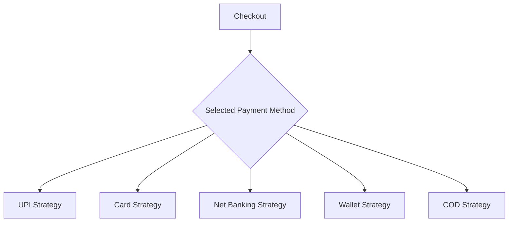
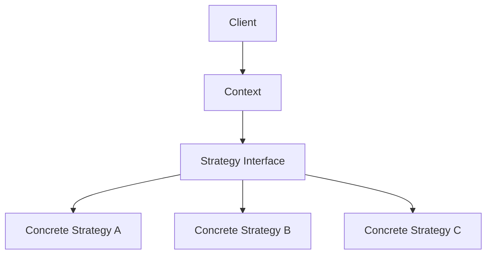

# Strategy Pattern

## Introduction: The Inevitable Mess

We often start software with a clean and elegant design. A class feels simple, the hierarchy is small, and the code is easy to follow.

Then reality happens.

A new feature is requested. Then another. Then another. Slowly, the codebase begins to grow tangled:

- too many `if/else` branches
- deeply nested inheritance trees
- repeated logic across classes
- classes that know too much
- code that becomes risky to change

At that point, even a small feature feels expensive.

This is one of the biggest lessons in software design:

> Applications must be flexible, because change is inevitable.

A good design does not fight change.  
A good design **isolates change**.

That is exactly where the **Strategy Pattern** becomes useful.

---

## Why this pattern matters

The Strategy Pattern teaches a powerful idea:

- identify what changes
- separate it from what stays stable
- make the changing behavior interchangeable

This reduces:
- duplication
- condition-heavy logic
- inheritance complexity
- tight coupling

And most importantly, it makes the system easier to extend without breaking what already works.

---

# The Problem With Inheritance

Inheritance is one of the pillars of OOP, but it is often overused.

Inheritance works well when behavior is truly stable and shared.  
It becomes a problem when behavior keeps changing.

---

## Example: Robots with different behaviors

Imagine a simple `Robot` class.

It can:
- walk
- talk
- display itself

This seems fine at first.

Then requirements change:
- one robot can fly
- another flies with wings
- another flies with jets
- one robot does not fly at all
- another cannot talk but can walk

Now the inheritance tree starts to explode.

```mermaid
classDiagram
    Robot <|-- SparrowRobot
    Robot <|-- CrowRobot
    Robot <|-- JetRobot
    Robot <|-- NoFlyRobot
    Robot <|-- TalkableFlyableRobot
    Robot <|-- NonTalkableWalkableRobot
````

---

## Why this becomes a problem

The issues start stacking up:

| Problem              | Explanation                                             |
| -------------------- | ------------------------------------------------------- |
| Duplicate code       | The same fly logic gets copied into multiple subclasses |
| Tight coupling       | Changes in one base class affect many children          |
| Rigidity             | New behavior often requires new subclasses              |
| Explosion of classes | One behavior combination creates many subclasses        |
| Hard maintenance     | The tree becomes hard to understand and debug           |

This is the slippery slope of inheritance.

The deeper the hierarchy grows, the more fragile it becomes.

---

## Why more inheritance is not the solution

The solution to inheritance is not more inheritance.

If behavior keeps changing, inheritance is usually the wrong tool.

Instead of forcing behavior into a class hierarchy, we should extract it out and make it interchangeable.

That is the Strategy Pattern.

---

# The Core Idea of Design Patterns

Most design patterns share one very simple goal:

> Separate the parts of the system that change from the parts that stay the same.

That is the heart of flexible design.

---

## Stable vs dynamic parts

In a robot system:

### Stable parts

These usually remain constant:

* object identity
* display logic
* structural data
* core coordination

### Dynamic parts

These often change:

* walking style
* flying style
* talking style
* payment method
* sorting algorithm

The Strategy Pattern isolates the dynamic parts into separate objects.

---

# What is the Strategy Pattern?

The Strategy Pattern is a **behavioral design pattern** that lets you define a family of algorithms, place each algorithm in its own class, and make them interchangeable at runtime.

In simpler words:

* the main class does not perform the varying behavior itself
* it delegates the behavior to a separate strategy object
* the strategy can be swapped whenever needed

---

## Core idea

| Part                | Meaning                                    |
| ------------------- | ------------------------------------------ |
| Context             | The main object that uses a strategy       |
| Strategy            | The interface for interchangeable behavior |
| Concrete Strategies | The actual algorithm implementations       |

---

## Strategy Pattern diagram

```mermaid
classDiagram
    class Robot {
        +setWalkBehavior
        +setTalkBehavior
        +setFlyBehavior
        +performWalk
        +performTalk
        +performFly
    }

    class WalkBehavior {
        +walk
    }

    class TalkBehavior {
        +talk
    }

    class FlyBehavior {
        +fly
    }

    class NormalWalk {
        +walk
    }

    class NoWalk {
        +walk
    }

    class NormalTalk {
        +talk
    }

    class NoTalk {
        +talk
    }

    class FlyWithWings {
        +fly
    }

    class FlyWithJets {
        +fly
    }

    class NoFly {
        +fly
    }

    Robot --> WalkBehavior
    Robot --> TalkBehavior
    Robot --> FlyBehavior

    WalkBehavior <|-- NormalWalk
    WalkBehavior <|-- NoWalk

    TalkBehavior <|-- NormalTalk
    TalkBehavior <|-- NoTalk

    FlyBehavior <|-- FlyWithWings
    FlyBehavior <|-- FlyWithJets
    FlyBehavior <|-- NoFly
```
---

# Why composition beats inheritance here

The Strategy Pattern is really about **composition over inheritance**.

Instead of saying:

* `Robot is a FlyWithJetsRobot`
* `Robot is a NoTalkRobot`

we say:

* `Robot has a flying behavior`
* `Robot has a walking behavior`
* `Robot has a talking behavior`

This is much cleaner.

---

## Comparison

| Inheritance                 | Composition                  |
| --------------------------- | ---------------------------- |
| behavior fixed in hierarchy | behavior assigned as objects |
| class tree gets deep        | class stays simple           |
| difficult to extend         | easy to swap behavior        |
| many subclasses             | fewer classes, better reuse  |

---

# “Main object should be dumb”

One of the most useful lessons from Strategy Pattern is this:

> The main object should not know how every behavior works.

The main object only coordinates.

It should:

* hold references to strategy objects
* call their methods
* remain stable

The logic that varies should live inside strategy classes.

This keeps the context object simple, and the behavior logic modular.

---

# Why this makes systems better

A “dumb” main object is actually a good thing.

It means:

* less logic in one place
* easier testing
* easier maintenance
* easier replacement of behavior
* fewer bugs when new features are added

The main class becomes predictable, while the strategies carry the complexity.

---

# The power of “not doing something”

This is one of the smartest ideas in the Strategy Pattern:

> A lack of behavior can also be represented as a valid behavior.

For example:

* `NoFly`
* `NoTalk`
* `NoWalk`

Instead of checking:

* does this robot fly?
* should I call this method?
* is this field null?

we give every object a default strategy.

That means every robot always has a valid behavior object, even if the behavior does nothing.

---

## Why this is useful

This avoids:

* null checks
* special-case logic
* `if/else` branches
* broken assumptions

It makes the code more uniform and predictable.

---

# Strategy Pattern in the real world

This pattern appears everywhere.

---

## 1. Payment systems

A checkout system may support:

* UPI
* credit card
* debit card
* net banking
* wallet
* cash on delivery

The checkout flow stays the same, but the payment algorithm changes.



---

## 2. Sorting systems

A sorting component may support:

* quicksort
* mergesort
* heapsort
* insertion sort

The container or service remains the same, but the sorting algorithm changes.

---

## 3. Routing systems

A navigation app may choose:

* shortest path
* fastest route
* avoiding tolls
* avoiding highways

The route computation is the strategy.

---

## 4. Compression systems

A file service may support:

* zip
* gzip
* lz4
* no compression

The storage pipeline remains stable, but compression behavior changes.

---

# Strategy Pattern structure

The pattern usually has three parts:

## 1. Context

The object that uses the behavior.

## 2. Strategy interface

Defines the common contract.

## 3. Concrete strategies

Implement the different versions of behavior.

---

## Simple flow



---

# Robot example

Let us model robots properly using Strategy Pattern.

Each robot can:

* walk
* talk
* fly

But different robots may behave differently.

---

## Strategy interfaces

* `WalkBehavior`
* `TalkBehavior`
* `FlyBehavior`

The `Robot` class will not implement the behaviors directly.

Instead, it will delegate.

---

# Example implementation

```cpp
#include <iostream>
#include <memory>
using namespace std;

class WalkBehavior {
public:
    virtual void walk() = 0;
    virtual ~WalkBehavior() = default;
};

class TalkBehavior {
public:
    virtual void talk() = 0;
    virtual ~TalkBehavior() = default;
};

class FlyBehavior {
public:
    virtual void fly() = 0;
    virtual ~FlyBehavior() = default;
};

class NormalWalk : public WalkBehavior {
public:
    void walk() override {
        cout << "Robot walks normally" << endl;
    }
};

class NoWalk : public WalkBehavior {
public:
    void walk() override {
        cout << "Robot does not walk" << endl;
    }
};

class NormalTalk : public TalkBehavior {
public:
    void talk() override {
        cout << "Robot talks normally" << endl;
    }
};

class NoTalk : public TalkBehavior {
public:
    void talk() override {
        cout << "Robot does not talk" << endl;
    }
};

class FlyWithWings : public FlyBehavior {
public:
    void fly() override {
        cout << "Robot flies with wings" << endl;
    }
};

class FlyWithJets : public FlyBehavior {
public:
    void fly() override {
        cout << "Robot flies with jets" << endl;
    }
};

class NoFly : public FlyBehavior {
public:
    void fly() override {
        cout << "Robot cannot fly" << endl;
    }
};

class Robot {
private:
    unique_ptr<WalkBehavior> walkBehavior;
    unique_ptr<TalkBehavior> talkBehavior;
    unique_ptr<FlyBehavior> flyBehavior;

public:
    Robot(unique_ptr<WalkBehavior> w, unique_ptr<TalkBehavior> t, unique_ptr<FlyBehavior> f)
        : walkBehavior(move(w)), talkBehavior(move(t)), flyBehavior(move(f)) {}

    void performWalk() {
        walkBehavior->walk();
    }

    void performTalk() {
        talkBehavior->talk();
    }

    void performFly() {
        flyBehavior->fly();
    }
};

int main() {
    Robot sparrowRobot(
        make_unique<NormalWalk>(),
        make_unique<NormalTalk>(),
        make_unique<FlyWithWings>()
    );

    sparrowRobot.performWalk();
    sparrowRobot.performTalk();
    sparrowRobot.performFly();

    return 0;
}
```
```java
interface WalkBehavior {
    void walk();
}

interface TalkBehavior {
    void talk();
}

interface FlyBehavior {
    void fly();
}

class NormalWalk implements WalkBehavior {
    public void walk() {
        System.out.println("Robot walks normally");
    }
}

class NoWalk implements WalkBehavior {
    public void walk() {
        System.out.println("Robot does not walk");
    }
}

class NormalTalk implements TalkBehavior {
    public void talk() {
        System.out.println("Robot talks normally");
    }
}

class NoTalk implements TalkBehavior {
    public void talk() {
        System.out.println("Robot does not talk");
    }
}

class FlyWithWings implements FlyBehavior {
    public void fly() {
        System.out.println("Robot flies with wings");
    }
}

class FlyWithJets implements FlyBehavior {
    public void fly() {
        System.out.println("Robot flies with jets");
    }
}

class NoFly implements FlyBehavior {
    public void fly() {
        System.out.println("Robot cannot fly");
    }
}

class Robot {
    private WalkBehavior walkBehavior;
    private TalkBehavior talkBehavior;
    private FlyBehavior flyBehavior;

    Robot(WalkBehavior walkBehavior, TalkBehavior talkBehavior, FlyBehavior flyBehavior) {
        this.walkBehavior = walkBehavior;
        this.talkBehavior = talkBehavior;
        this.flyBehavior = flyBehavior;
    }

    void performWalk() {
        walkBehavior.walk();
    }

    void performTalk() {
        talkBehavior.talk();
    }

    void performFly() {
        flyBehavior.fly();
    }
}

public class Main {
    public static void main(String[] args) {
        Robot crowRobot = new Robot(
            new NormalWalk(),
            new NormalTalk(),
            new FlyWithWings()
        );

        crowRobot.performWalk();
        crowRobot.performTalk();
        crowRobot.performFly();
    }
}
```
```python
from abc import ABC, abstractmethod

class WalkBehavior(ABC):
    @abstractmethod
    def walk(self):
        pass

class TalkBehavior(ABC):
    @abstractmethod
    def talk(self):
        pass

class FlyBehavior(ABC):
    @abstractmethod
    def fly(self):
        pass

class NormalWalk(WalkBehavior):
    def walk(self):
        print("Robot walks normally")

class NoWalk(WalkBehavior):
    def walk(self):
        print("Robot does not walk")

class NormalTalk(TalkBehavior):
    def talk(self):
        print("Robot talks normally")

class NoTalk(TalkBehavior):
    def talk(self):
        print("Robot does not talk")

class FlyWithWings(FlyBehavior):
    def fly(self):
        print("Robot flies with wings")

class FlyWithJets(FlyBehavior):
    def fly(self):
        print("Robot flies with jets")

class NoFly(FlyBehavior):
    def fly(self):
        print("Robot cannot fly")

class Robot:
    def __init__(self, walk_behavior, talk_behavior, fly_behavior):
        self.walk_behavior = walk_behavior
        self.talk_behavior = talk_behavior
        self.fly_behavior = fly_behavior

    def perform_walk(self):
        self.walk_behavior.walk()

    def perform_talk(self):
        self.talk_behavior.talk()

    def perform_fly(self):
        self.fly_behavior.fly()

sparrow_robot = Robot(NormalWalk(), NormalTalk(), FlyWithWings())
sparrow_robot.perform_walk()
sparrow_robot.perform_talk()
sparrow_robot.perform_fly()
```

---

# Why this design is better

The `Robot` class is now stable.

If you want to add a new flying method:

* you do not touch the `Robot` class
* you create a new strategy class

For example:

* `FlyWithJets`
* `FlyWithRocketBoosters`
* `FlyWithAntiGravity`

That is the key advantage.

---

# What changes and what stays the same?

| Stable part        | Changing part     |
| ------------------ | ----------------- |
| Robot identity     | Walking style     |
| Display logic      | Talking style     |
| Core orchestration | Flying style      |
| Basic object shape | Algorithm details |

This separation is the real power of the pattern.

---

# Strategy Pattern and OCP

The Strategy Pattern supports the Open/Closed Principle very naturally.

* open for extension: new strategies can be added
* closed for modification: existing context code does not need to change

That is why it is widely used in scalable systems.

---

# Strategy Pattern and LSP

Every strategy object should be substitutable for another strategy object of the same interface.

If `NoFly` is used instead of `FlyWithWings`, the system should still work correctly.

That makes the behavior interchangeable.

---

# Strategy Pattern and composition

This pattern is a strong example of composition over inheritance.

Instead of building a huge class tree, we combine small objects.

That gives:

* lower coupling
* better reuse
* easier testing
* cleaner architecture

---

# When to use Strategy Pattern

Use it when:

* multiple algorithms exist for the same task
* behavior needs to change at runtime
* you want to remove long `if/else` chains
* you want to avoid subclass explosion
* you want clean separation between stable and changing logic

---

# When not to use it

Avoid unnecessary Strategy Pattern complexity when:

* there is only one behavior
* behavior will never vary
* the system is tiny
* abstraction would make the code harder to follow

Like any pattern, it should solve a real problem, not create a new one.

---

# Common signs you need Strategy Pattern

You may need it if you see:

* repeated `if/else` based on type
* many subclasses differing only in one method
* multiple versions of the same algorithm
* behavior selected dynamically by user choice
* code that changes for every new feature request

---

# Benefits of Strategy Pattern

| Benefit         | Description                                        |
| --------------- | -------------------------------------------------- |
| Flexibility     | Behavior can be changed at runtime                 |
| Reusability     | Same strategy can be reused in many contexts       |
| Maintainability | Changing one algorithm does not affect others      |
| Testability     | Each strategy can be tested independently          |
| Extensibility   | New behaviors are added without breaking old ones  |
| Cleaner code    | Fewer conditionals and less inheritance complexity |

---

# Drawbacks of Strategy Pattern

| Drawback         | Description                                 |
| ---------------- | ------------------------------------------- |
| More classes     | Each strategy becomes a separate class      |
| More objects     | Composition introduces more object creation |
| More abstraction | Can feel verbose for very small problems    |

This is the usual tradeoff:
more structure, less rigidity.

---

# Real-world analogy

Think of a robot that can travel in different ways.

The robot is the same.

Only the travel strategy changes:

* walking
* rolling
* flying
* teleporting

Instead of creating a separate robot class for every travel mode, we attach the travel mode as a strategy.

That is a much more scalable mental model.

---

# Summary

The Strategy Pattern teaches one of the most important lessons in software design:

> Do not hardcode what may change.

Instead:

* identify changing behavior
* extract it into its own object
* make it interchangeable
* let the main object stay simple

That is why Strategy Pattern is so powerful.

It reduces inheritance mess, avoids duplication, and helps design systems that evolve gracefully.

---

# Final takeaway

The core message can be summarized in one line:

> Favor composition over inheritance.

And one more important idea:

> Separate stable logic from variable behavior.

That is how you build software that can survive change without becoming a tangled inheritance tree.