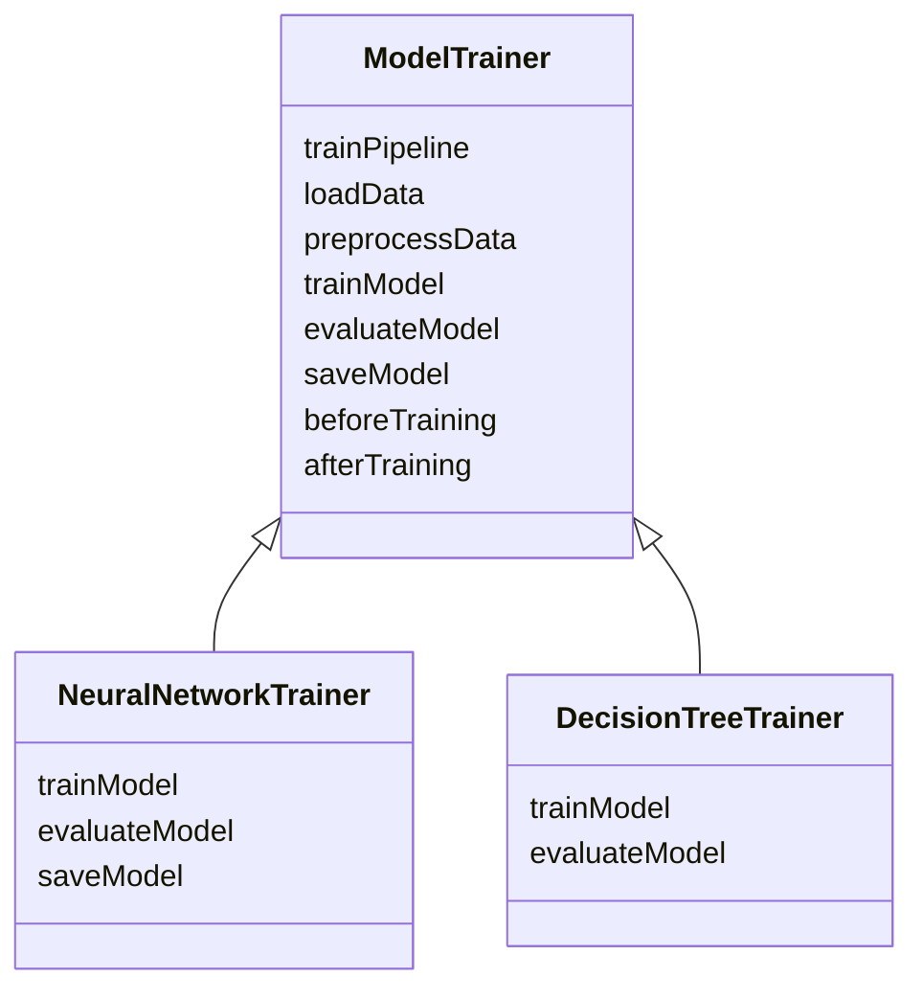
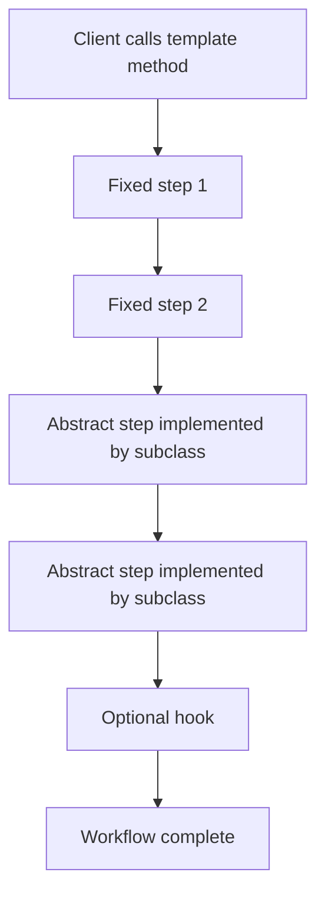
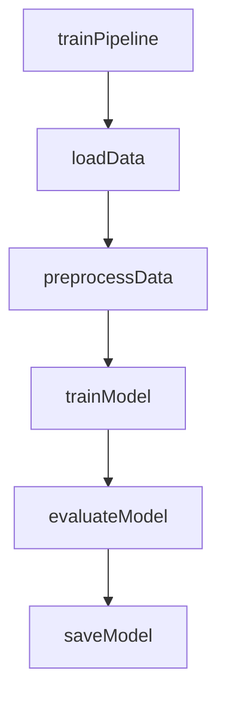
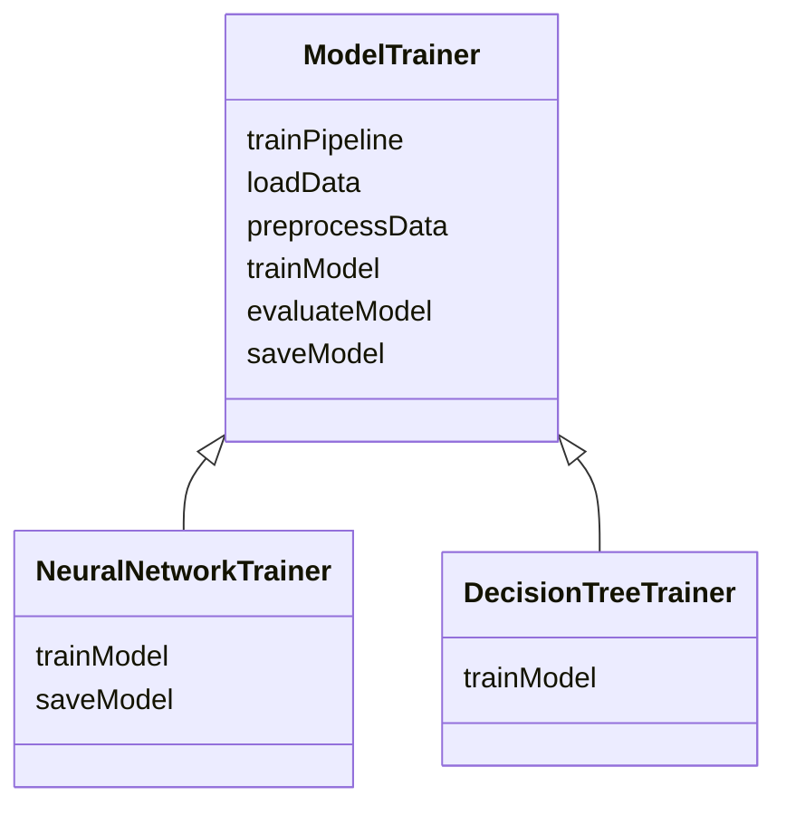
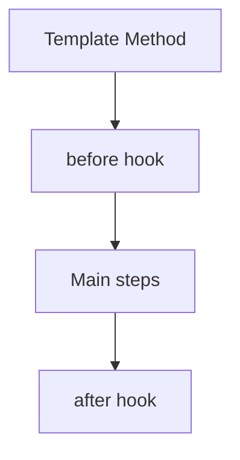

# Template Method Design Pattern

In programming, just like in cooking, the order of steps matters.

If ingredients are added in the wrong sequence, the result can be wrong.  
If code runs in the wrong order, the result can also be wrong.

The **Template Method Pattern** solves this by defining a **fixed algorithm skeleton** in a parent class while allowing subclasses to customize selected steps.

It is especially useful when:

- the overall process must stay the same
- some steps are common across all cases
- some steps vary from one subclass to another
- you want to avoid duplicate workflow logic
- you want to enforce a correct execution order

---

# Introduction: Your Fixed Recipe for Code

The Template Method Pattern works like a master recipe.

The recipe tells you:
- what steps to do
- in what order to do them

But the exact details of some steps may vary from one chef to another.

For example:
- one chef may prepare a sauce differently
- another may cook the same dish with different spices
- but the overall recipe structure stays the same

That is exactly what this pattern does in code.

---

# Why this pattern matters

In real software systems, many processes follow the same high-level sequence but differ in a few details.

Examples:

- machine learning training pipelines
- report generation
- document parsing
- data import/export
- game level loading
- payment processing workflows
- authentication flows

The Template Method pattern helps ensure that the flow stays correct.

---

# Core idea

The pattern defines:

- a **template method** in the parent class
- the **template method** calls steps in a fixed order
- some steps are abstract and must be implemented by subclasses
- some steps may have default implementations
- some steps may be optional hooks

---

## Formal definition

Template Method lets subclasses redefine certain steps of an algorithm without changing the algorithm’s structure.

---

# The problem it solves

Suppose we are training different machine learning models.

Each model may be different:
- neural network
- decision tree
- support vector machine
- random forest

But the training pipeline is often the same:

1. load data
2. preprocess data
3. train model
4. evaluate model
5. save model

Without a design pattern, a developer might accidentally:
- evaluate before training
- save before evaluation
- preprocess after training
- skip a necessary step

That can break the process.

---

# Why order matters

In many workflows, the sequence is not optional.

For example:
- you must load data before training
- you must preprocess before fitting the model
- you should evaluate before saving
- you may want logging before and after the core process

Template Method locks down that order.

---

# Main idea: structure over implementation

The key idea is:

> Keep the structure fixed, and vary only the steps that need customization.

This is why the Template Method Pattern is so useful for predictable workflows.

---

# Participants in Template Method Pattern

| Role | Meaning | ML Example |
|------|---------|------------|
| Abstract Class | Defines the algorithm skeleton | `ModelTrainer` |
| Template Method | Fixed method that defines order | `trainPipeline()` |
| Abstract Steps | Steps subclasses must implement | `trainModel()`, `evaluateModel()` |
| Default Steps | Steps with common behavior | `loadData()`, `preprocessData()`, `saveModel()` |
| Hooks | Optional extension points | `beforeTraining()`, `afterTraining()` |
| Concrete Subclass | Specialized implementation | `NeuralNetworkTrainer`, `DecisionTreeTrainer` |

---

# UML structure



---

# How Template Method works

The parent class defines the sequence of steps.

The child class fills in the variable parts.



---

# The template method

The template method is the most important method in the pattern.

It is usually:

* `final` in Java/C#
* non-overridable by subclasses
* responsible for enforcing the correct order

For our ML example, the template method might be:

```text
trainPipeline()
```

It calls the steps in order:

1. load data
2. preprocess data
3. train model
4. evaluate model
5. save model

---

# Why the template method should not be overridden

If subclasses could change the template method:

* the order could break
* logic might be skipped
* the pipeline could become inconsistent

So the parent controls the workflow.

The child controls only the customizable steps.

---

# Types of steps in Template Method

There are usually three kinds of steps.

---

## 1. Abstract steps

These are declared in the base class but not implemented there.

The subclass must provide an implementation.

Examples:

* `trainModel()`
* `evaluateModel()`

---

## 2. Concrete/default steps

These are implemented in the base class.

The subclass may use them as-is or override them if necessary.

Examples:

* `loadData()`
* `preprocessData()`
* `saveModel()`

---

## 3. Hooks

Hooks are optional methods that subclasses may override to influence behavior.

They often do nothing by default.

Examples:

* `beforeTraining()`
* `afterTraining()`

Hooks are useful when you want optional customization without forcing all subclasses to implement it.

---

# Machine learning training example

Suppose we are building a system where different models use the same training pipeline.

The process is:

1. load data
2. preprocess data
3. train model
4. evaluate model
5. save model

The only thing that changes is **how training is done** and sometimes **how saving or evaluation is done**.

---

# Workflow diagram



---

# Example: Model training hierarchy



---

# Why this design is good

This design gives us:

* a fixed and correct workflow
* flexibility inside the workflow
* consistency across subclasses
* less duplicated code
* easier maintenance

---

# Example

```cpp
#include <iostream>
using namespace std;

class ModelTrainer {
public:
    void trainPipeline() {
        beforeTraining();
        loadData();
        preprocessData();
        trainModel();
        evaluateModel();
        saveModel();
        afterTraining();
    }

protected:
    virtual void loadData() {
        cout << "Loading dataset" << endl;
    }

    virtual void preprocessData() {
        cout << "Preprocessing data" << endl;
    }

    virtual void trainModel() = 0;
    virtual void evaluateModel() {
        cout << "Evaluating model" << endl;
    }

    virtual void saveModel() {
        cout << "Saving model" << endl;
    }

    virtual void beforeTraining() {}
    virtual void afterTraining() {}
};

class NeuralNetworkTrainer : public ModelTrainer {
protected:
    void trainModel() override {
        cout << "Training neural network for 100 epochs" << endl;
    }

    void evaluateModel() override {
        cout << "Evaluating neural network accuracy" << endl;
    }

    void saveModel() override {
        cout << "Saving neural network in .nn format" << endl;
    }
};

class DecisionTreeTrainer : public ModelTrainer {
protected:
    void trainModel() override {
        cout << "Building decision tree from features" << endl;
    }
};

int main() {
    NeuralNetworkTrainer nn;
    nn.trainPipeline();

    cout << "----" << endl;

    DecisionTreeTrainer dt;
    dt.trainPipeline();

    return 0;
}
```
```java
abstract class ModelTrainer {
    public final void trainPipeline() {
        beforeTraining();
        loadData();
        preprocessData();
        trainModel();
        evaluateModel();
        saveModel();
        afterTraining();
    }

    protected void loadData() {
        System.out.println("Loading dataset");
    }

    protected void preprocessData() {
        System.out.println("Preprocessing data");
    }

    protected abstract void trainModel();

    protected void evaluateModel() {
        System.out.println("Evaluating model");
    }

    protected void saveModel() {
        System.out.println("Saving model");
    }

    protected void beforeTraining() {}

    protected void afterTraining() {}
}

class NeuralNetworkTrainer extends ModelTrainer {
    protected void trainModel() {
        System.out.println("Training neural network for 100 epochs");
    }

    protected void evaluateModel() {
        System.out.println("Evaluating neural network accuracy");
    }

    protected void saveModel() {
        System.out.println("Saving neural network in .nn format");
    }
}

class DecisionTreeTrainer extends ModelTrainer {
    protected void trainModel() {
        System.out.println("Building decision tree from features");
    }
}

public class Main {
    public static void main(String[] args) {
        ModelTrainer nn = new NeuralNetworkTrainer();
        nn.trainPipeline();

        System.out.println("----");

        ModelTrainer dt = new DecisionTreeTrainer();
        dt.trainPipeline();
    }
}
```
```python
from abc import ABC, abstractmethod

class ModelTrainer(ABC):
    def train_pipeline(self):
        self.before_training()
        self.load_data()
        self.preprocess_data()
        self.train_model()
        self.evaluate_model()
        self.save_model()
        self.after_training()

    def load_data(self):
        print("Loading dataset")

    def preprocess_data(self):
        print("Preprocessing data")

    @abstractmethod
    def train_model(self):
        pass

    def evaluate_model(self):
        print("Evaluating model")

    def save_model(self):
        print("Saving model")

    def before_training(self):
        pass

    def after_training(self):
        pass

class NeuralNetworkTrainer(ModelTrainer):
    def train_model(self):
        print("Training neural network for 100 epochs")

    def evaluate_model(self):
        print("Evaluating neural network accuracy")

    def save_model(self):
        print("Saving neural network in .nn format")

class DecisionTreeTrainer(ModelTrainer):
    def train_model(self):
        print("Building decision tree from features")

nn = NeuralNetworkTrainer()
nn.train_pipeline()

print("----")

dt = DecisionTreeTrainer()
dt.train_pipeline()
```

---

## C++ explanation

* `trainPipeline()` is the template method
* it defines the exact order
* subclasses cannot change the order
* subclasses only implement or override specific steps
* the core structure remains stable

---

## Java explanation

* `trainPipeline()` is `final`
* subclasses cannot override the overall process
* subclasses customize only the internal steps
* the workflow always stays consistent

---

## Python explanation

* `train_pipeline()` is the fixed skeleton
* the parent defines the order
* the child fills in the variable logic
* this creates a repeatable and safe workflow

---

# Understanding the steps in detail

## loadData()

This step reads the raw dataset.

It may:

* read from file
* read from database
* read from API
* read from cloud storage

Usually this step is the same across subclasses.

---

## preprocessData()

This step prepares the data.

It may:

* clean missing values
* normalize numeric values
* encode categorical values
* split train/test sets

Again, many projects can use a common default implementation here.

---

## trainModel()

This is the core algorithm-specific step.

This is usually different for each subclass.

Examples:

* neural network backpropagation
* decision tree splitting
* SVM optimization

This is often abstract.

---

## evaluateModel()

This step checks performance.

It may:

* compute accuracy
* compute precision/recall
* evaluate loss
* calculate F1 score

Sometimes the default is good enough, and sometimes subclasses need custom behavior.

---

## saveModel()

This step stores the trained model.

Different models may need different formats:

* `.pkl`
* `.onnx`
* `.h5`
* custom binary format

So subclasses may override it if needed.

---

# Hooks

Hooks are optional methods that subclasses may override.

They are useful when:

* you want optional behavior
* you do not want to force every subclass to implement something
* you want extension points before or after the main algorithm

---

## Example hooks

* `beforeTraining()`
* `afterTraining()`
* `shouldLogMetrics()`

Hooks often do nothing in the base class.

---

## Hook diagram



---

# Real-world examples

Template Method appears in many systems.

| Domain             | Fixed template    | Variable step             |
| ------------------ | ----------------- | ------------------------- |
| ML training        | Training pipeline | Training algorithm        |
| Document parsing   | Parse flow        | File-specific parsing     |
| Game levels        | Game loop         | Level-specific logic      |
| Report generation  | Report flow       | Report formatting         |
| Payment processing | Payment steps     | Gateway-specific handling |
| Web requests       | Request lifecycle | Handler customization     |

---

# Example: Report generation

A report generation process may always follow this order:

1. gather data
2. format data
3. add header/footer
4. export

But different report types may customize the data gathering or formatting.

That is a perfect Template Method use case.

---

# Template Method structure summary

| Part             | Role                                         |
| ---------------- | -------------------------------------------- |
| Template method  | Defines the algorithm skeleton               |
| Abstract methods | Force subclasses to implement required steps |
| Default methods  | Provide shared reusable behavior             |
| Hooks            | Optional customization points                |

---

# Why final matters in the template method

In languages like Java and C#, the template method is often made `final` or otherwise protected from being overridden.

That ensures:

* the order cannot be changed
* the workflow remains reliable
* subclasses cannot break the algorithm

---

# Template Method vs Strategy

These two patterns are often confused.

| Pattern         | Focus                                                        |
| --------------- | ------------------------------------------------------------ |
| Template Method | Fixes the algorithm structure and lets subclasses fill steps |
| Strategy        | Lets the algorithm itself be swapped at runtime              |

---

## Simple distinction

### Template Method

The parent says:

* “Do step 1, then step 2, then step 3.”

The child fills in the details.

### Strategy

The client chooses:

* which algorithm to use

---

# Template Method vs Factory

| Pattern         | Purpose                 |
| --------------- | ----------------------- |
| Template Method | Control algorithm flow  |
| Factory         | Control object creation |

---

# Benefits of Template Method Pattern

| Benefit                | Description                             |
| ---------------------- | --------------------------------------- |
| Consistent flow        | Steps always happen in the right order  |
| Code reuse             | Common behavior stays in the base class |
| Extensibility          | Subclasses customize only what differs  |
| Reduced duplication    | Shared workflow is not repeated         |
| Better maintainability | One central place defines the algorithm |
| Safety                 | Prevents out-of-order execution errors  |

---

# Drawbacks of Template Method Pattern

| Drawback                | Description                             |
| ----------------------- | --------------------------------------- |
| Inheritance-based       | Can become rigid if overused            |
| Hard to change skeleton | Fixed flow may be limiting              |
| More abstraction        | Can feel heavy for small tasks          |
| Subclass complexity     | Too many overrides can become confusing |

---

# Common mistakes

| Mistake                                            | Problem                      |
| -------------------------------------------------- | ---------------------------- |
| Letting subclasses override the template method    | Breaks the order             |
| Putting too much logic into the base class         | Makes the base class bloated |
| Overusing hooks                                    | Can make behavior unclear    |
| Using template method for unrelated workflows      | Bad abstraction              |
| Mixing too many responsibilities into one skeleton | Hard to maintain             |

---

# When to use Template Method Pattern

Use it when:

* multiple classes share the same process
* the sequence of steps must stay fixed
* only some steps vary
* you want to avoid duplicated workflow code
* you want to enforce a common algorithm structure

---

# When not to use Template Method Pattern

Avoid it when:

* the process has no stable skeleton
* the steps do not follow a predictable order
* runtime swapping of whole algorithms is needed
* inheritance would make the design too rigid

---

# Summary

The Template Method Pattern gives you a fixed algorithm skeleton and allows subclasses to customize specific steps.

It is ideal when:

* the order matters
* the flow should stay stable
* some steps are common
* some steps vary

It is often used in:

* training pipelines
* report generation
* file parsing
* game loops
* workflow engines

---

# Final takeaway

The Template Method Pattern is about this simple idea:

> Define the outline once, and let subclasses fill in the details.

That gives you:

* predictable execution
* reusable workflow logic
* controlled customization
* cleaner subclass design

It is one of the best patterns for building step-by-step processes that must stay reliable while still allowing flexibility.