# UML Diagrams

**UML (Unified Modeling Language)** is a standardized visual language used to represent the structure, behavior, and interactions of software systems.

UML diagrams help in:

- understanding a system clearly
- designing software before coding
- communicating ideas with team members
- documenting architecture and object relationships
- supporting Low Level Design (LLD) discussions in interviews

UML is especially useful when a system is large and complex, because diagrams make the design easier to visualize than plain text.

---

## Why UML is important

UML is used because it provides a common language for:

- developers
- architects
- testers
- analysts
- stakeholders

Instead of explaining a design only in words, UML shows the design visually. This reduces confusion and makes relationships easier to understand.

### UML helps in:
- requirement analysis
- class and object modeling
- workflow design
- interaction analysis
- system documentation
- interview problem solving

---

# Overview of UML Diagrams

UML diagrams are mainly divided into two categories:

1. **Structural UML diagrams**
2. **Behavioral UML diagrams**

```mermaid
flowchart TD
    A[UML Diagrams] --> B[Structural Diagrams]
    A --> C[Behavioral Diagrams]
````

---

# 1. Structural UML Diagrams

Structural diagrams describe the **static structure** of a system.
They show the components of the system and how they are related.

These diagrams answer questions like:

* What classes exist?
* What objects exist?
* What modules are there?
* How are components connected?
* How is software deployed?

---

## 1.1 Class Diagram

### Purpose

A class diagram shows the **static structure** of a system by representing:

* classes
* attributes
* methods
* relationships between classes

This is one of the most important UML diagrams in OOP and LLD.

---

### When to use

Class diagrams are useful when you want to model:

* object-oriented systems
* entity relationships
* inheritance hierarchies
* associations between classes
* system modules and responsibilities

---

### Main elements of a class diagram

| Element      | Meaning                          |
| ------------ | -------------------------------- |
| Class name   | The name of the entity           |
| Attributes   | Data stored by the class         |
| Methods      | Behavior performed by the class  |
| Association  | Relationship between two classes |
| Inheritance  | Parent-child relationship        |
| Aggregation  | Weak has-a relationship          |
| Composition  | Strong has-a relationship        |
| Multiplicity | How many objects participate     |

---

### Basic class notation

A class is usually shown as a rectangle with three sections:

1. class name
2. attributes
3. methods

```mermaid
classDiagram
    class Car {
        -String color
        -String model
        -int speed
        +accelerate()
        +brake()
    }
```

---

### Example: Library system class diagram

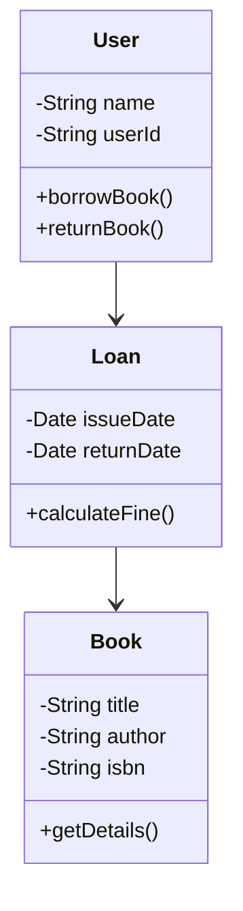

---

### Explanation

* `Book` stores book details
* `User` represents a library member
* `Loan` tracks borrowing activity
* users borrow books through loans

---

## 1.2 Object Diagram

### Purpose

An object diagram shows a **snapshot of real objects** at a specific point in time.

It is similar to a class diagram, but instead of showing the blueprint, it shows actual instances.

---

### When to use

Object diagrams are useful for:

* understanding runtime state
* debugging object relationships
* showing example instances of classes
* illustrating a specific scenario

---

### Object diagram example

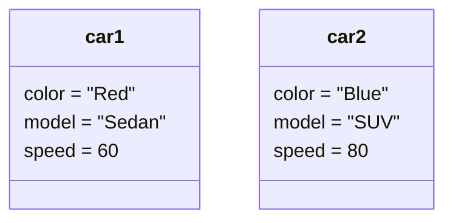

---

### Explanation

Here:

* `car1` and `car2` are objects
* both are instances of the `Car` class
* they have different values

---

## 1.3 Component Diagram

### Purpose

A component diagram shows the physical or logical components of a system and how they depend on each other.

---

### When to use

Use component diagrams when you want to show:

* application modules
* service boundaries
* backend/frontend separation
* library dependencies
* system architecture at a module level

---

### Example: Web app components

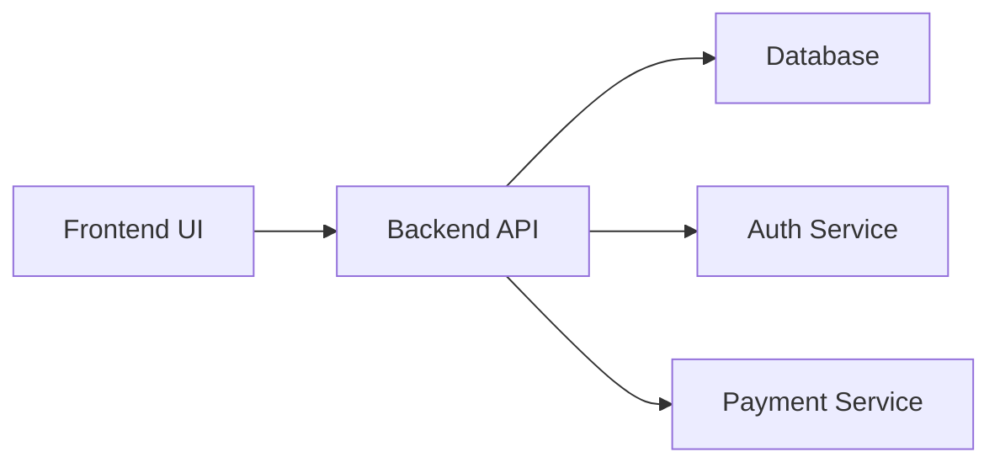

---

### Explanation

* frontend sends requests to backend
* backend communicates with database and services
* each component has a specific responsibility

---

## 1.4 Package Diagram

### Purpose

A package diagram groups related classes or components into packages.

It is useful for organizing large systems.

---

### When to use

Use package diagrams when you want to show:

* project structure
* module organization
* logical grouping
* package dependencies

---

### Example

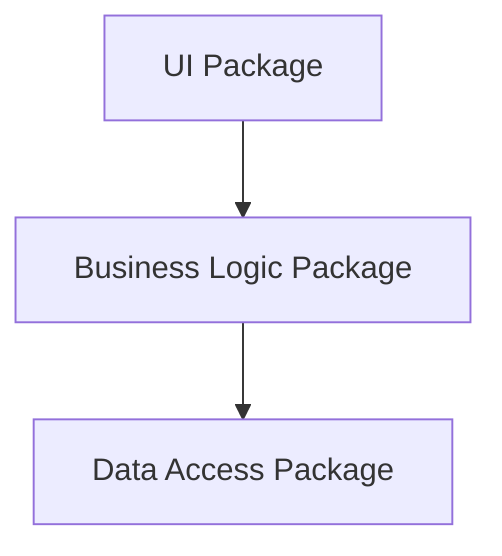

---

### Explanation

* UI handles user interaction
* Business Logic contains rules
* Data Access talks to database

---

## 1.5 Deployment Diagram

### Purpose

A deployment diagram shows how software artifacts are deployed on hardware nodes.

It answers:

* where does the software run?
* which server hosts which component?
* how do machines communicate?

---

### When to use

Use deployment diagrams for:

* server architecture
* cloud deployment
* distributed systems
* production environments

---

### Example

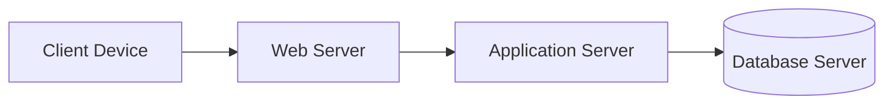

---

### Explanation

* client interacts with the web server
* application server handles logic
* database stores data

---

## 1.6 Composite Structure Diagram

### Purpose

A composite structure diagram shows the internal structure of a class or component.

It is useful for understanding how parts inside a larger object work together.

---

### Example: Car internal parts

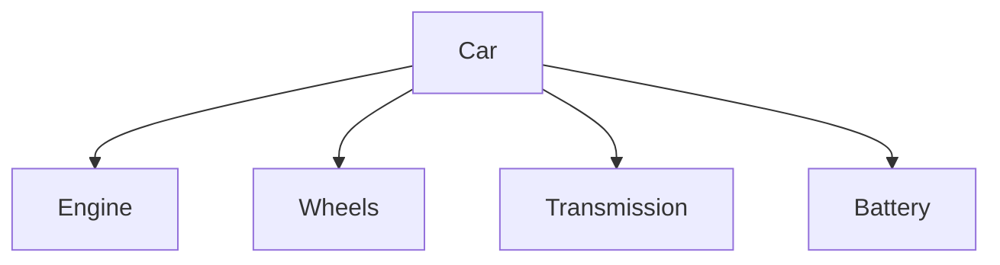

---

### Explanation

A car is not just one object. Internally it contains multiple parts that collaborate.

---

## 1.7 Profile Diagram

### Purpose

A profile diagram extends UML for a specific domain by creating custom stereotypes and rules.

It is useful when UML needs to be customized for a particular industry.

---

### Example use cases

* healthcare systems
* banking systems
* finance applications
* enterprise modeling

---

### Example notation

```text
<<entity>>
<<service>>
<<repository>>
<<controller>>
```

---

# 2. Behavioral UML Diagrams

Behavioral diagrams describe the **dynamic behavior** of a system.

They show how the system works over time, how objects interact, and how workflows progress.

These diagrams answer questions like:

* What happens first?
* What happens next?
* Which object sends which message?
* What are the possible states?
* What is the user flow?

---

## 2.1 Use Case Diagram

### Purpose

A use case diagram shows the system from the perspective of external users or actors.

It focuses on **what the system does**, not how it does it.

---

### Main elements

| Element         | Meaning                               |
| --------------- | ------------------------------------- |
| Actor           | External user or system               |
| Use case        | Functionality or feature              |
| System boundary | The scope of the system               |
| Association     | Connection between actor and use case |

---

### Example: Banking system

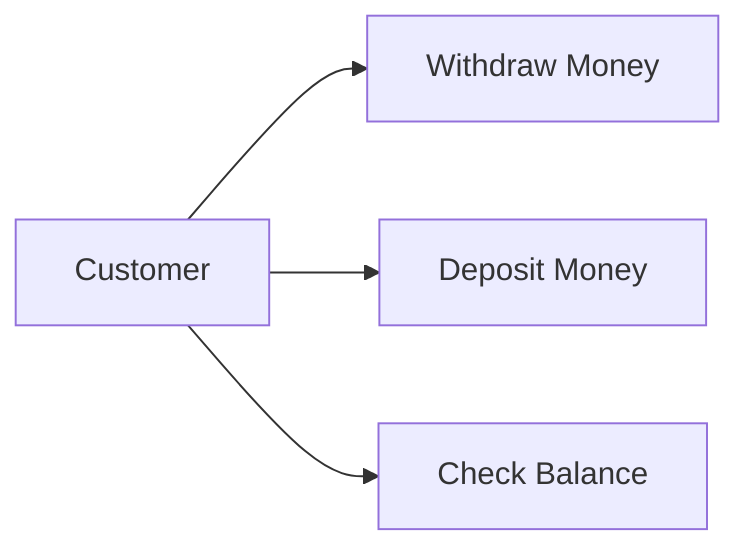

---

### Explanation

* `Customer` is the actor
* the system provides banking features
* each feature is a use case

---

## 2.2 Activity Diagram

### Purpose

An activity diagram models a workflow or business process.

It is similar to a flowchart but more structured and expressive.

---

### Main elements

| Element    | Meaning              |
| ---------- | -------------------- |
| Start node | Beginning of process |
| Action     | A task or step       |
| Decision   | Branching point      |
| Merge      | Combines branches    |
| End node   | End of process       |
| Fork/Join  | Parallel execution   |

---

### Example: Checkout workflow

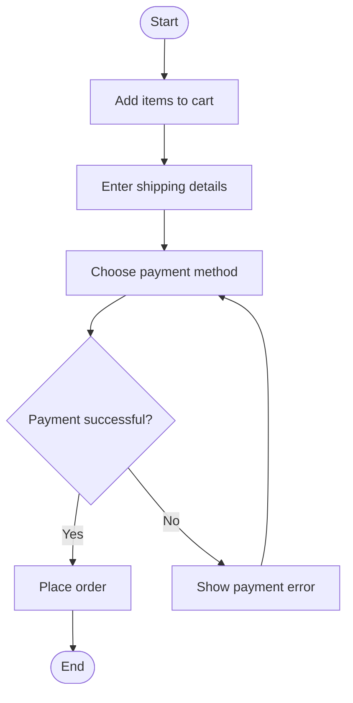

---

### Explanation

The user checks out step by step.
If payment fails, the flow goes back to payment selection.

---

## 2.3 Sequence Diagram

### Purpose

A sequence diagram shows how objects interact in a time-ordered sequence.

It is one of the most useful UML diagrams for LLD because it shows:

* object communication
* method calls
* order of execution
* response flow

---

### Main elements

| Element        | Meaning                          |
| -------------- | -------------------------------- |
| Actor/Object   | Participant in interaction       |
| Lifeline       | Existence of an object over time |
| Message        | Communication between objects    |
| Activation bar | Time spent processing            |
| Return message | Response back to caller          |

---

### Time flow

Sequence diagrams are read from **top to bottom**.

---

## Types of messages in sequence diagrams

| Message type | Meaning                             |
| ------------ | ----------------------------------- |
| Synchronous  | Caller waits for response           |
| Asynchronous | Caller does not wait                |
| Return       | Response from receiver              |
| Self message | Object calls itself                 |
| Create       | New object is created               |
| Destroy      | Object is destroyed                 |
| Lost         | Message does not reach destination  |
| Found        | Message appears from unknown source |

---

## Sequence Diagram notation

* **Synchronous message** → solid arrow
* **Asynchronous message** → open arrow
* **Return message** → dashed arrow
* **Destroy** → X mark at the end of lifeline

---

## Example: ATM cash withdrawal sequence

### Scenario

A user goes to an ATM, enters PIN and account information, requests cash, and the ATM verifies details before dispensing money.

### Objects

* User
* ATM
* Transaction
* Bank Server
* Cash Dispenser

---

### Sequence diagram

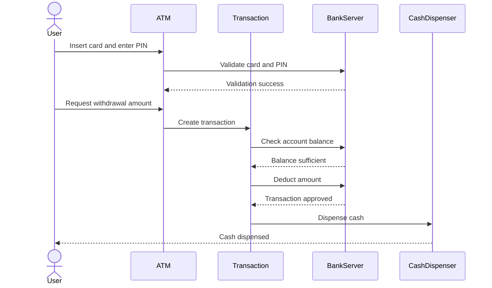

---

## Example with alt, opt, and loop

### Meaning of keywords

| Keyword | Meaning           |
| ------- | ----------------- |
| `alt`   | if-else condition |
| `opt`   | optional block    |
| `loop`  | repeated action   |

---

### ATM sequence with conditions

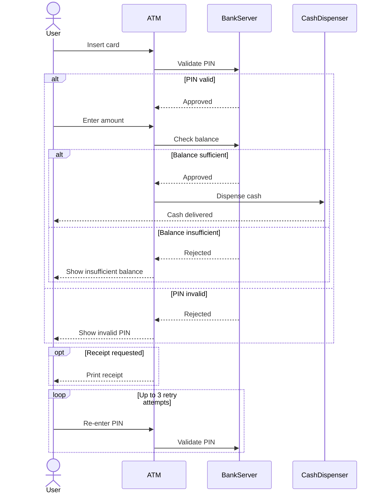

---

### Explanation

* `alt` handles valid and invalid conditions
* `opt` handles optional receipt printing
* `loop` handles repeated retries

---

## 2.4 State Machine Diagram

### Purpose

A state machine diagram shows the possible states of an object and how it moves from one state to another.

It is useful for objects whose behavior changes over time.

---

### Main elements

| Element       | Meaning                          |
| ------------- | -------------------------------- |
| State         | Condition of an object           |
| Transition    | Change from one state to another |
| Event         | Trigger for change               |
| Initial state | Starting point                   |
| Final state   | End point                        |

---

### Example: Order lifecycle

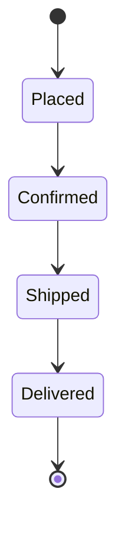

---

### Explanation

An order moves through different states as it progresses through the system.

---

## 2.5 Communication Diagram

### Purpose

A communication diagram shows object interactions with a focus on relationships and message flow.

It is similar to a sequence diagram, but the emphasis is more on object links than on time.

---

### Example

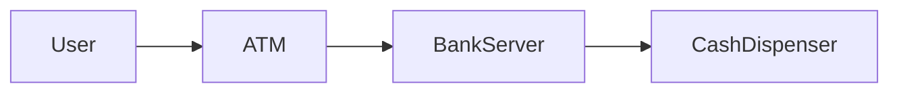

---

### Explanation

This diagram emphasizes who communicates with whom.

---

## 2.6 Interaction Overview Diagram

### Purpose

An interaction overview diagram combines activity-style control flow with interaction fragments.

It gives a high-level view of a complex interaction.

---

### Example idea

A user login system may involve:

* login request
* validation
* OTP verification
* session creation

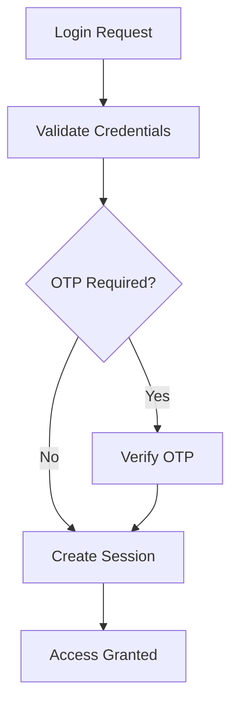

---

## 2.7 Timing Diagram

### Purpose

A timing diagram shows how states or values change over time.

It is especially useful for real-time systems.

---

### Example: Traffic light states

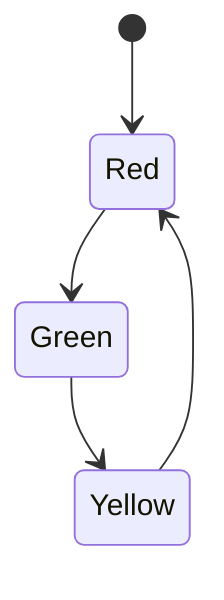

---

### Explanation

The state changes follow a fixed time-based sequence.

---

# UML Basic Notations

UML uses a set of standard notations for readability and consistency.

---

## 1. Class notation

A class is shown using a rectangle divided into sections:

* class name
* attributes
* methods

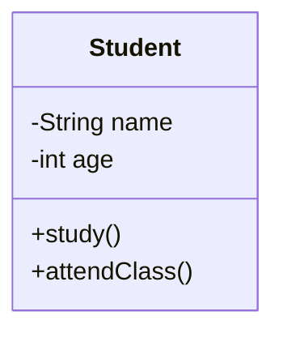

---

## 2. Visibility notation

| Symbol | Meaning           |
| ------ | ----------------- |
| `+`    | public            |
| `-`    | private           |
| `#`    | protected         |
| `~`    | package / default |

### Example

```text
+getName()
-validatePin()
#calculateFee()
~helperMethod()
```

---

## 3. Relationship notation

| Relationship | Meaning          | UML Symbol            |
| ------------ | ---------------- | --------------------- |
| Association  | Basic connection | Line                  |
| Inheritance  | is-a             | Hollow triangle arrow |
| Aggregation  | weak has-a       | Hollow diamond        |
| Composition  | strong has-a     | Filled diamond        |

---

# Association

Association is a relationship between two classes where one class knows or interacts with another.

It is one of the most common relationships in UML.

---

## Simple Association

### Definition

A basic relationship where objects of one class interact with objects of another class.

There is no strong ownership.

### Example

* Student enrolls in Course
* Doctor treats Patient

### Diagram

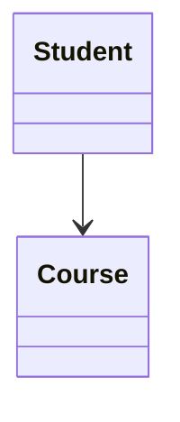

### Explanation

A student can enroll in a course, but neither owns the other.

---

## Aggregation

### Definition

Aggregation is a weak **has-a** relationship.

The contained object can exist independently of the container.

### Example

* Car has Wheel
* Team has Player

### Diagram

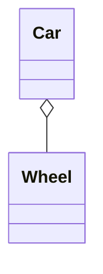

### Explanation

A wheel can exist without a car.
That is why aggregation is weak ownership.

---

## Composition

### Definition

Composition is a strong **part-of** relationship.

The contained object’s lifecycle depends on the container.

### Example

* House has Room
* Order has OrderItems

### Diagram

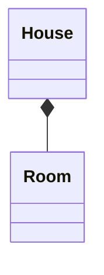

### Explanation

A room is part of a house.
If the house is destroyed, the room also stops existing in that context.

---

## Association vs Aggregation vs Composition

| Type        | Meaning              | Ownership                 | Lifecycle   |
| ----------- | -------------------- | ------------------------- | ----------- |
| Association | General relationship | No ownership              | Independent |
| Aggregation | Weak has-a           | Shared or loose ownership | Independent |
| Composition | Strong part-of       | Strong ownership          | Dependent   |

---

# Class Association and Object Association

---

## Class Association

Class association is a relationship between two class definitions.

It is used at design time to show how classes are connected.

### Example

* `Student` associated with `Course`

---

## Object Association

Object association shows a relationship between actual runtime objects.

It is used to show instance-level connections.

### Example

* `student1` is connected to `course1`

---

# Inheritance in UML

Inheritance represents an **is-a** relationship.

It is shown using a **solid line with a hollow triangle arrowhead** pointing toward the parent class.

### Example

* Dog is an Animal

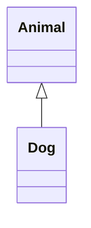

---

### Explanation

* `Animal` is the base class
* `Dog` is the derived class
* Dog inherits behavior and properties from Animal

---

# Composition vs Inheritance

| Relationship | Meaning | Example          |
| ------------ | ------- | ---------------- |
| Inheritance  | is-a    | Dog is an Animal |
| Composition  | has-a   | House has Rooms  |

---

## Why this matters

In LLD, choosing between inheritance and composition is important.

* use inheritance when the relationship is truly **is-a**
* use composition when one object **contains** another object

---

# Abstract Class vs Concrete Class

---

## Abstract Class

### Definition

A class that cannot be instantiated directly and is meant to serve as a base class.

It may contain:

* abstract methods
* implemented methods
* attributes
* constructors

### Purpose

It gives a common blueprint that child classes must follow.

---

## Concrete Class

### Definition

A class that can be instantiated directly.

It provides full implementation.

### Purpose

It represents a usable object in the system.

---

## Example

### Java

```java
abstract class Animal {
    abstract void sound();

    void sleep() {
        System.out.println("Sleeping");
    }
}

class Dog extends Animal {
    void sound() {
        System.out.println("Bark");
    }
}

class Cat extends Animal {
    void sound() {
        System.out.println("Meow");
    }
}
```

### Explanation

* `Animal` is abstract
* `Dog` and `Cat` are concrete
* each child provides its own `sound()`

---

# Sequence Diagram Deep Dive

Sequence diagrams are very important in LLD because they show the flow of interactions between objects.

---

## Main parts

### 1. Objects / Actors

Represent participants in the interaction.

### 2. Lifelines

Show how long an object exists during the interaction.

### 3. Messages

Show communication between objects.

### 4. Activation bars

Show when an object is actively processing.

---

## Message types

### Synchronous message

The sender waits for the receiver to complete the action.

### Asynchronous message

The sender does not wait.

### Return message

Shows the response or returned value.

### Self message

An object sends a message to itself.

### Create message

Creates a new object.

### Destroy message

Ends an object’s lifecycle.

---

## Example: User login flow

```mermaid
sequenceDiagram
    actor User
    participant UI
    participant AuthService
    participant Database

    User->>UI: Enter username and password
    UI->>AuthService: Login request
    AuthService->>Database: Fetch user record
    Database-->>AuthService: User data
    AuthService-->>UI: Login success
    UI-->>User: Show dashboard
```

---

## Example: failed login with alt

```mermaid
sequenceDiagram
    actor User
    participant UI
    participant AuthService
    participant Database

    User->>UI: Submit credentials
    UI->>AuthService: Authenticate
    AuthService->>Database: Check user

    alt Credentials valid
        Database-->>AuthService: Match found
        AuthService-->>UI: Success
        UI-->>User: Open dashboard
    else Credentials invalid
        Database-->>AuthService: No match
        AuthService-->>UI: Failure
        UI-->>User: Show error message
    end
```

---

# How to draw UML diagrams in LLD interviews

When solving LLD interview questions, UML diagrams help structure the answer.

---

## A good approach

1. understand the problem statement
2. identify key objects
3. define relationships
4. decide class responsibilities
5. draw class diagram
6. draw sequence diagram for main use case
7. add edge cases if needed

---

## Example flow for a parking lot problem

### Step 1

Identify classes:

* ParkingLot
* Floor
* Spot
* Vehicle
* Ticket
* Payment

### Step 2

Decide relationships:

* ParkingLot has Floors
* Floor has Spots
* ParkingLot generates Ticket
* Ticket references Vehicle

### Step 3

Draw class diagram and sequence diagram

---

# UML for a Parking Lot example

## Class diagram

```mermaid
classDiagram
    class ParkingLot {
        +enterVehicle()
        +exitVehicle()
    }

    class Floor {
        -floorNumber
    }

    class ParkingSpot {
        -spotNumber
        -isAvailable
    }

    class Vehicle {
        -licenseNumber
        -type
    }

    class Ticket {
        -ticketId
        -entryTime
    }

    ParkingLot *-- Floor
    Floor *-- ParkingSpot
    ParkingLot --> Ticket
    ParkingLot --> Vehicle
```

---

## Sequence diagram

```mermaid
sequenceDiagram
    actor Driver
    participant ParkingLot
    participant Floor
    participant Spot
    participant Ticket

    Driver->>ParkingLot: Enter vehicle
    ParkingLot->>Floor: Find available floor
    Floor->>Spot: Find available spot
    Spot-->>ParkingLot: Spot assigned
    ParkingLot->>Ticket: Create ticket
    Ticket-->>Driver: Return ticket
```

---

# Common UML mistakes

| Mistake                               | Problem                        |
| ------------------------------------- | ------------------------------ |
| Mixing class and object level details | Creates confusion              |
| Using inheritance too much            | Makes design rigid             |
| Ignoring multiplicity                 | Relationship becomes unclear   |
| Not showing responsibilities          | Diagram becomes incomplete     |
| Drawing too much detail               | Makes the diagram hard to read |

---

# Best practices for UML

* keep diagrams simple
* model only important entities
* show clear relationships
* use standard notations
* avoid clutter
* use diagrams as communication tools, not decoration
* pair diagrams with explanation

---

# Summary Table

| UML Diagram                  | Purpose                                 | Best Used For             |
| ---------------------------- | --------------------------------------- | ------------------------- |
| Class Diagram                | Static structure of classes             | OOP design                |
| Object Diagram               | Runtime snapshot                        | Instance-level view       |
| Component Diagram            | System modules                          | Architecture              |
| Package Diagram              | Grouping of elements                    | Large project structure   |
| Deployment Diagram           | Hardware deployment                     | Infrastructure view       |
| Composite Structure Diagram  | Internal structure of a class/component | Complex object modeling   |
| Profile Diagram              | Custom UML extensions                   | Domain-specific modeling  |
| Use Case Diagram             | System functionality from user view     | Requirement analysis      |
| Activity Diagram             | Workflow                                | Process flow              |
| Sequence Diagram             | Interaction over time                   | Method-call flow          |
| State Machine Diagram        | Object lifecycle                        | State transitions         |
| Communication Diagram        | Object collaboration                    | Message relationships     |
| Interaction Overview Diagram | High-level interaction flow             | Complex scenario overview |
| Timing Diagram               | State changes over time                 | Real-time systems         |

---

# Final Summary

UML diagrams are powerful visual tools for designing and understanding software systems.

They help in:

* structural modeling
* behavioral modeling
* class design
* object interaction
* workflow analysis
* interview preparation
* system documentation

In LLD, UML is especially useful because it turns abstract ideas into clear, understandable visual designs.

The most important diagrams to know well are:

* class diagram
* sequence diagram
* use case diagram
* activity diagram
* state machine diagram

Understanding UML gives you a strong advantage in both real-world software design and LLD interviews.