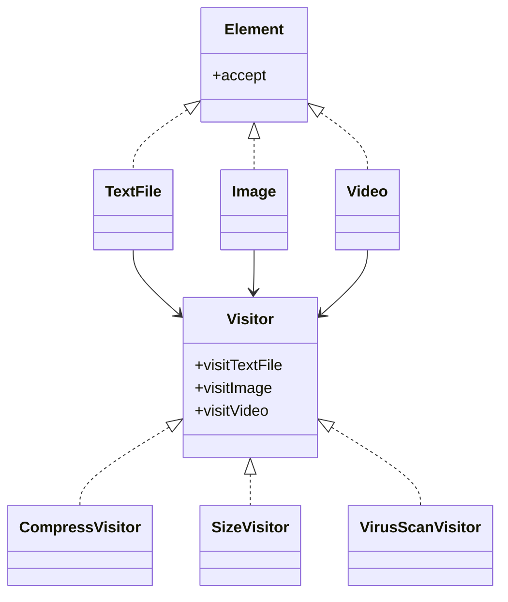
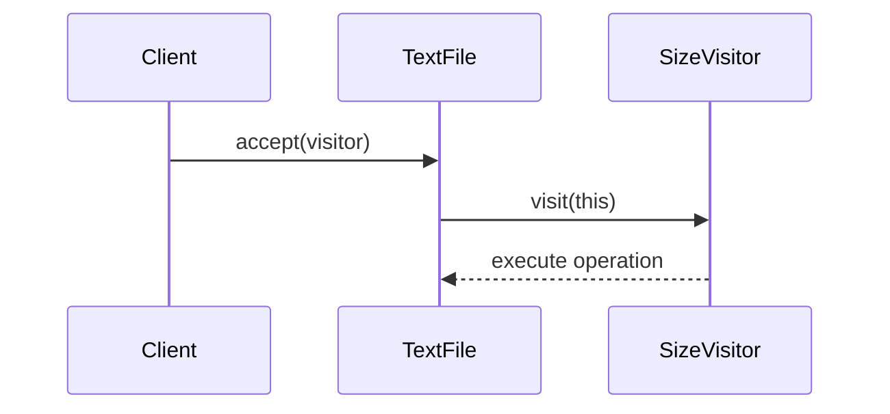
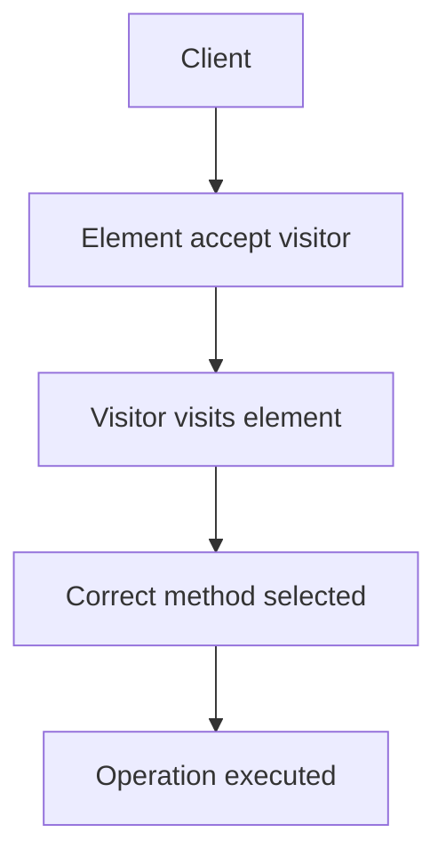
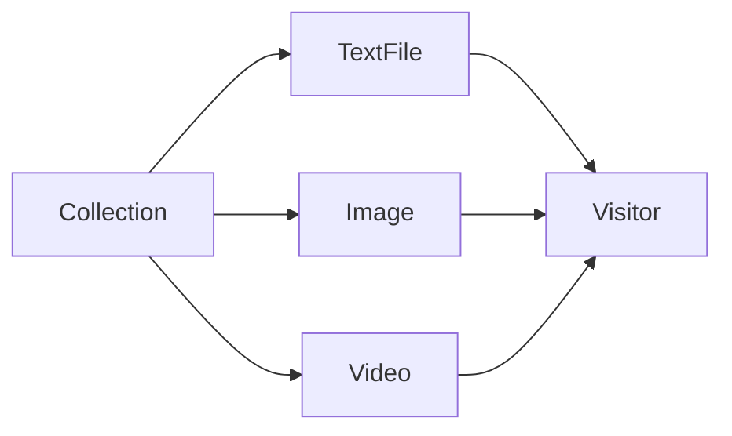

# Visitor Design Pattern

The **Visitor Design Pattern** is a **behavioral design pattern** that allows you to separate algorithms from the objects on which they operate.

Instead of continuously adding new methods to existing classes, the Visitor pattern lets you place new operations into separate visitor classes.

---

# Official Definition

The Visitor pattern allows you to add new operations to existing object structures without modifying those structures.

---

# Core Idea in One Line

> Keep the data structure stable, and move changing operations into separate visitor classes.

---

# Why the Visitor Pattern Exists

Imagine you have a set of stable classes:

- TextFile
- Image
- Video

Initially, these classes are small and clean.

But over time, new requirements arrive:

- calculateSize()
- compress()
- export()
- encrypt()
- scanVirus()
- generatePreview()
- upload()

Eventually, these classes become overloaded with unrelated operations.

This creates a major design problem.

---

# The Ever-Growing Class Problem

At first:

```text id="u6oqgj"
TextFile:
- open()
- save()
````

Later:

```text id="4h6ikm"
TextFile:
- open()
- save()
- compress()
- scanVirus()
- calculateSize()
- export()
- generateThumbnail()
- encrypt()
```

Now imagine this repeated across:

* Image
* Video
* Audio
* Spreadsheet
* Presentation

The system becomes difficult to maintain.

---

# Why This is a Problem

This violates important software principles.

---

# Problem 1: Violates Open/Closed Principle (OCP)

The Open/Closed Principle says:

> Classes should be open for extension but closed for modification.

But every time a new operation appears:

* we reopen existing classes
* modify stable code
* risk introducing bugs

---

# Problem 2: Violates Single Responsibility Principle (SRP)

A class should have only one responsibility.

But now a document class handles:

* storage
* compression
* virus scanning
* exporting
* analytics
* formatting

Too many responsibilities.

---

# Problem 3: Huge Maintenance Cost

As operations grow:

* classes become bloated
* testing becomes harder
* debugging becomes harder
* changes become risky

---

# The Visitor Solution

The Visitor pattern separates:

| Stable Part      | Changing Part         |
| ---------------- | --------------------- |
| Object structure | Operations/algorithms |

---

# Main Idea

Instead of:

```text id="jlwm6u"
Document class contains all operations
```

We do this:

```text id="lvdy7h"
Document classes contain data only
Operations move into Visitor classes
```

---

# Key Insight

The Visitor pattern works best when:

| Changes Often | Changes Rarely   |
| ------------- | ---------------- |
| Operations    | Object structure |

---

# Example Scenario

Suppose our application supports these stable document types:

* TextFile
* Image
* Video

But operations keep growing:

* compress
* scan virus
* export PDF
* calculate size
* generate report
* encrypt

Visitor allows us to add these operations without modifying the document classes.

---

# High-Level Structure

The Visitor pattern creates **two separate hierarchies**:

| Hierarchy         | Purpose               |
| ----------------- | --------------------- |
| Element hierarchy | Represents objects    |
| Visitor hierarchy | Represents operations |

---

# Architecture Diagram



---

# Two Main Parts

---

# Part 1: Element Hierarchy

These are the actual objects.

Examples:

* TextFile
* Image
* Video

Each object only needs one important method:

```text id="g3fzkz"
accept(visitor)
```

---

# Why `accept()` Exists

The accept method allows a visitor object to operate on the element.

The element says:

> “I don’t know what operation you want, but I’ll allow the visitor to perform it.”

---

# Part 2: Visitor Hierarchy

Visitors contain operations.

Examples:

| Operation      | Visitor Class    |
| -------------- | ---------------- |
| Compress files | CompressVisitor  |
| Calculate size | SizeVisitor      |
| Scan virus     | VirusScanVisitor |

Instead of placing operations inside document classes, we place them inside visitors.

---

# Before Visitor Pattern

```text id="k3ct1z"
TextFile:
- compress()
- scanVirus()
- calculateSize()

Image:
- compress()
- scanVirus()
- calculateSize()

Video:
- compress()
- scanVirus()
- calculateSize()
```

Huge duplication and growing complexity.

---

# After Visitor Pattern

```text id="jttv9v"
TextFile:
- accept()

Image:
- accept()

Video:
- accept()

CompressVisitor:
- visit(TextFile)
- visit(Image)
- visit(Video)

SizeVisitor:
- visit(TextFile)
- visit(Image)
- visit(Video)
```

Much cleaner.

---

# The Most Important Concept: Double Dispatch

Visitor relies on a mechanism called:

# Double Dispatch

This is the heart of the pattern.

---

# What is Double Dispatch?

Normally, method calls depend on:

* the object calling the method

But Visitor chooses behavior based on:

1. visitor type
2. element type

That is why it is called:

* double dispatch

---

# Normal Single Dispatch

```text id="s86r3v"
object.method()
```

The method chosen depends only on:

* object's runtime type

---

# Double Dispatch

```text id="9lupkx"
element.accept(visitor)
```

The final method depends on:

* concrete element type
* concrete visitor type

Two objects participate in deciding the operation.

---

# How Double Dispatch Works

Suppose:

```text id="8zvmq8"
TextFile.accept(SizeVisitor)
```

Flow:

---

## Step 1

Client calls:

```text id="9m42p8"
textFile.accept(sizeVisitor)
```

---

## Step 2

Inside TextFile:

```text id="wtm3iy"
visitor.visit(this)
```

---

## Step 3

`this` refers to:

* current TextFile object

So Java/C++ chooses:

```text id="5pbcrh"
visit(TextFile)
```

inside SizeVisitor.

---

# Full Interaction Diagram



---

# Why Double Dispatch is Powerful

Without double dispatch:

* selecting the correct operation across many object types becomes difficult

With Visitor:

* correct operation is chosen automatically

This is especially useful for:

* AST processing
* compilers
* rendering systems
* document systems
* game engines

---

# Real-World Analogy

Imagine a doctor visiting patients.

Patients:

* child
* adult
* senior citizen

Doctor behavior changes depending on:

* who the patient is

The doctor “visits” each patient differently.

That is Visitor.

---

# Another Analogy: Tax Inspection

Elements:

* House
* Factory
* Shop

Visitor:

* TaxInspector

The inspector performs different logic for each object type.

---

# Real-World Example: Compiler Design

Compilers use Visitor heavily.

An Abstract Syntax Tree (AST) contains nodes:

* IfStatement
* WhileLoop
* VariableDeclaration
* FunctionCall

Operations may include:

* type checking
* optimization
* code generation
* interpretation

Instead of stuffing all logic into AST nodes, compilers use visitors.

---

# Example: Game Rendering Engine

Game objects:

* Tree
* Enemy
* Player
* Bullet

Visitors:

* RenderVisitor
* PhysicsVisitor
* CollisionVisitor

Each visitor performs a different operation across the object structure.

---

# Detailed Workflow



---

# Why Visitor is Useful

Visitor solves the problem of:

* growing operations
* repeated modifications
* bloated classes

---

# Key Benefits

| Benefit                            | Explanation                                   |
| ---------------------------------- | --------------------------------------------- |
| Open/Closed Principle              | Add new operations without modifying elements |
| Better organization                | Operations grouped together                   |
| Cleaner classes                    | Elements stay simple                          |
| Easy extension                     | Add new visitor classes anytime               |
| Good for heterogeneous collections | Different object types handled uniformly      |

---

# The Biggest Strength

Adding a new operation becomes extremely easy.

Instead of modifying:

* TextFile
* Image
* Video

You simply add:

```text id="s31yl7"
ExportVisitor
```

Done.

---

# Example: Adding New Operation

Without Visitor:

```text id="s3ov6y"
Modify every document class
```

With Visitor:

```text id="e5rcz4"
Create one new visitor class
```

Huge improvement.

---

# But Visitor Has a Tradeoff

Visitor makes adding new operations easy.

BUT...

Adding new element types becomes harder.

---

# Why?

Suppose we add:

```text id="t8sr5h"
PDFDocument
```

Now every visitor must implement:

```text id="v9glce"
visit(PDFDocument)
```

So Visitor is best when:

* object structure is stable
* operations change frequently

---

# Best Use Cases

Visitor is ideal when:

| Stable           | Changing   |
| ---------------- | ---------- |
| Object hierarchy | Operations |

---

# Poor Use Cases

Visitor is NOT ideal when:

* element types change frequently
* hierarchy is unstable
* adding new object types is common

---

# Visitor Pattern in Collections

Visitor is excellent for heterogeneous collections.

Example:

```text id="9kll1e"
List<DocumentElement>
```

may contain:

* TextFile
* Image
* Video

Visitor automatically executes correct logic for each object.

---

# Example Traversal



---

# C++ Example

# Step 1: Visitor Interface

```cpp
class TextFile;
class Image;

class Visitor {
public:
    virtual void visit(TextFile* file) = 0;
    virtual void visit(Image* image) = 0;
};
```

---

# Step 2: Element Interface

```cpp
class Element {
public:
    virtual void accept(Visitor* visitor) = 0;
};
```

---

# Step 3: Concrete Elements

```cpp
class TextFile : public Element {
public:
    void accept(Visitor* visitor) override {
        visitor->visit(this);
    }
};

class Image : public Element {
public:
    void accept(Visitor* visitor) override {
        visitor->visit(this);
    }
};
```

---

# Step 4: Concrete Visitor

```cpp
class SizeVisitor : public Visitor {
public:
    void visit(TextFile* file) override {
        cout << "Calculating text file size\n";
    }

    void visit(Image* image) override {
        cout << "Calculating image size\n";
    }
};
```

---

# Step 5: Client

```cpp
int main() {
    Visitor* visitor = new SizeVisitor();

    Element* file = new TextFile();
    Element* image = new Image();

    file->accept(visitor);
    image->accept(visitor);
}
```
```java
interface Visitor {
    void visit(TextFile file);
    void visit(Image image);
}

interface Element {
    void accept(Visitor visitor);
}

class TextFile implements Element {
    public void accept(Visitor visitor) {
        visitor.visit(this);
    }
}

class Image implements Element {
    public void accept(Visitor visitor) {
        visitor.visit(this);
    }
}

class CompressVisitor implements Visitor {
    public void visit(TextFile file) {
        System.out.println("Compressing text file");
    }

    public void visit(Image image) {
        System.out.println("Compressing image");
    }
}

public class Main {
    public static void main(String[] args) {
        Visitor visitor = new CompressVisitor();

        Element text = new TextFile();
        Element image = new Image();

        text.accept(visitor);
        image.accept(visitor);
    }
}
```
```python
class TextFile:
    def accept(self, visitor):
        visitor.visit_text(self)

class Image:
    def accept(self, visitor):
        visitor.visit_image(self)

class CompressVisitor:
    def visit_text(self, text):
        print("Compressing text file")

    def visit_image(self, image):
        print("Compressing image")

documents = [TextFile(), Image()]
visitor = CompressVisitor()

for doc in documents:
    doc.accept(visitor)
```

---

# Visitor vs Strategy

These two patterns are commonly confused.

---

# Key Difference

| Pattern  | Focus                 |
| -------- | --------------------- |
| Strategy | Changing algorithms   |
| Visitor  | Adding new operations |

---

# Visitor vs Strategy Table

| Aspect           | Strategy                    | Visitor                                  |
| ---------------- | --------------------------- | ---------------------------------------- |
| Main goal        | Change behavior dynamically | Add operations without modifying classes |
| Changes often    | Algorithms                  | Operations                               |
| Object structure | Usually flexible            | Usually stable                           |
| Best for         | Runtime behavior swapping   | Growing operation sets                   |

---

# Visitor vs Command

| Visitor                                          | Command                |
| ------------------------------------------------ | ---------------------- |
| Encapsulates operations across many object types | Encapsulates a request |
| Good for object structures                       | Good for actions/undo  |
| Uses double dispatch                             | Uses command objects   |

---

# Common Use Cases

| Domain           | Example                 |
| ---------------- | ----------------------- |
| Compilers        | AST traversal           |
| Game engines     | Rendering operations    |
| File systems     | Compression, encryption |
| GUI frameworks   | Rendering widgets       |
| CAD systems      | Shape processing        |
| Document editors | Exporting formats       |

---

# Advantages

| Advantage                  | Explanation                        |
| -------------------------- | ---------------------------------- |
| Easy to add new operations | Add new visitor class only         |
| Clean separation           | Logic separated from data          |
| Better maintainability     | Operations grouped logically       |
| Supports OCP               | Existing classes remain unchanged  |
| Excellent for traversals   | Great for object trees/collections |

---

# Disadvantages

| Disadvantage                   | Explanation                           |
| ------------------------------ | ------------------------------------- |
| Hard to add new element types  | Every visitor must change             |
| More boilerplate               | Many visit methods required           |
| Complex at first               | Double dispatch can confuse beginners |
| Tight visitor-element coupling | Visitors know all element types       |

---

# When to Use Visitor

Use Visitor when:

* object structure is stable
* operations change frequently
* many unrelated operations exist
* you want clean separation of algorithms
* you need type-specific behavior

---

# When NOT to Use Visitor

Avoid Visitor when:

* element hierarchy changes frequently
* adding new element types is common
* the structure is unstable
* simple polymorphism is enough

---

# Mental Model

Think of Visitor as:

> “Bring operations TO the objects instead of stuffing operations INSIDE the objects.”

---

# Final Summary

The Visitor Pattern:

* separates algorithms from object structures
* allows new operations without modifying existing classes
* uses double dispatch
* works best with stable object hierarchies
* keeps classes clean and focused

It is one of the most powerful patterns for:

* compilers
* rendering systems
* document processing
* tree traversal systems

---

# Final Takeaway

The Visitor pattern solves this exact problem:

> “I have a stable set of object types, but I keep adding new operations.”

Instead of constantly modifying your existing classes:

* create visitors
* keep operations separate
* preserve clean architecture

That is the true power of the Visitor Design Pattern.

