# Load Balancers

## Introduction: The Restaurant With One Waiter Problem

Imagine a restaurant that suddenly becomes extremely popular.

Initially the restaurant had **one waiter** responsible for everything:

- Taking orders
- Delivering food
- Answering questions
- Handling payments

When the restaurant had only **10 customers**, everything worked perfectly.

But suddenly the restaurant becomes famous and **10,000 customers arrive**.

Now problems begin:

- The waiter cannot handle everyone
- Customers wait in long lines
- Orders get delayed
- People leave frustrated
- The restaurant loses revenue

The kitchen might be excellent, but **the bottleneck is the single waiter**.

The same situation occurs in software systems.

If **all users send requests to one server**, that server becomes overloaded.

Eventually:

- CPU becomes saturated
- Memory usage spikes
- Requests timeout
- The system crashes

The solution is to introduce a **traffic manager**.

That traffic manager is called a **Load Balancer**.

---

# What is a Load Balancer?

A **Load Balancer** is a system that distributes incoming requests across multiple backend servers.

Instead of all users hitting a single server, traffic is **balanced across a pool of servers**.

This ensures:

- High availability
- Better performance
- Fault tolerance
- Horizontal scalability

Without load balancing:

```

Users → One Server

```

With load balancing:

```

Users → Load Balancer → Multiple Servers

````

---

# High Level Architecture

```mermaid
flowchart LR

User1 --> LB
User2 --> LB
User3 --> LB
User4 --> LB

LB[Load Balancer]

LB --> Server1
LB --> Server2
LB --> Server3
````

The Load Balancer decides:

* Which server handles each request
* Which servers are healthy
* Which server has the least load
* Which server is geographically closest

---

# Why Load Balancers Are Essential

In large-scale systems, load balancers solve several critical problems.

| Problem          | Explanation                                    |
| ---------------- | ---------------------------------------------- |
| Server overload  | One machine cannot handle millions of requests |
| Downtime risk    | If one server crashes entire system fails      |
| Uneven traffic   | Some servers overloaded while others idle      |
| Poor scalability | Difficult to add more servers                  |

Load balancers introduce **horizontal scalability**.

Instead of upgrading one machine:

```
Vertical Scaling → Bigger server
Horizontal Scaling → More servers
```

Load balancers enable horizontal scaling.

---

# Real World Analogy

## Airport Runway Controller

Imagine an airport receiving hundreds of airplanes every hour.

Without an air traffic controller:

* Multiple planes try landing simultaneously
* Runways become congested
* Accidents occur

The **air traffic controller** assigns:

* Which runway a plane uses
* When it should land
* Which planes must wait

Similarly, a load balancer directs incoming **requests to appropriate servers**.

---

# Basic Working Flow

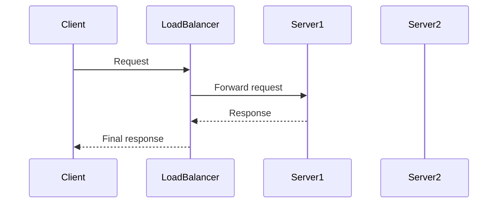

If Server1 becomes busy, the next request may go to Server2.

---

# Types of Load Balancers

Load balancers can be categorized based on implementation.

---

# Hardware Load Balancers

These are **dedicated physical devices** designed specifically for traffic management.

Examples:

* F5 BIG-IP
* Citrix ADC

Advantages:

| Advantage              | Explanation                       |
| ---------------------- | --------------------------------- |
| Extremely powerful     | Designed for networking workloads |
| High throughput        | Can handle millions of requests   |
| Enterprise reliability | Hardware optimized                |

Disadvantages:

| Disadvantage   | Explanation                |
| -------------- | -------------------------- |
| Expensive      | High hardware cost         |
| Hard to scale  | Requires physical upgrades |
| Vendor lock-in | Proprietary systems        |

---

# Software Load Balancers

Software running on standard servers.

Examples:

* NGINX
* HAProxy
* Envoy
* Traefik

Advantages:

| Advantage    | Explanation             |
| ------------ | ----------------------- |
| Cheap        | No specialized hardware |
| Flexible     | Configurable            |
| Cloud-native | Works with containers   |

Disadvantages:

| Disadvantage       | Explanation                  |
| ------------------ | ---------------------------- |
| Uses CPU resources | Competes with other services |

Most modern cloud systems prefer **software load balancers**.

---

# Layer 4 vs Layer 7 Load Balancing

Load balancers operate at different layers of the network stack.

---

# Layer 4 Load Balancer (Transport Layer)

Operates at **TCP/UDP level**.

It routes traffic based on:

* IP address
* Port numbers

It **does not inspect request content**.

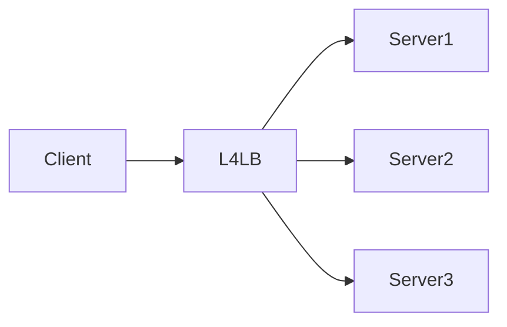

Advantages:

* Extremely fast
* Low latency
* Minimal processing

Disadvantages:

* Cannot inspect HTTP data
* Limited routing intelligence

---

# Layer 7 Load Balancer (Application Layer)

Understands **HTTP requests**.

It can route traffic based on:

* URL paths
* Headers
* Cookies
* Request type

Example routing:

```
/api → API servers
/images → Image servers
/videos → Video servers
```

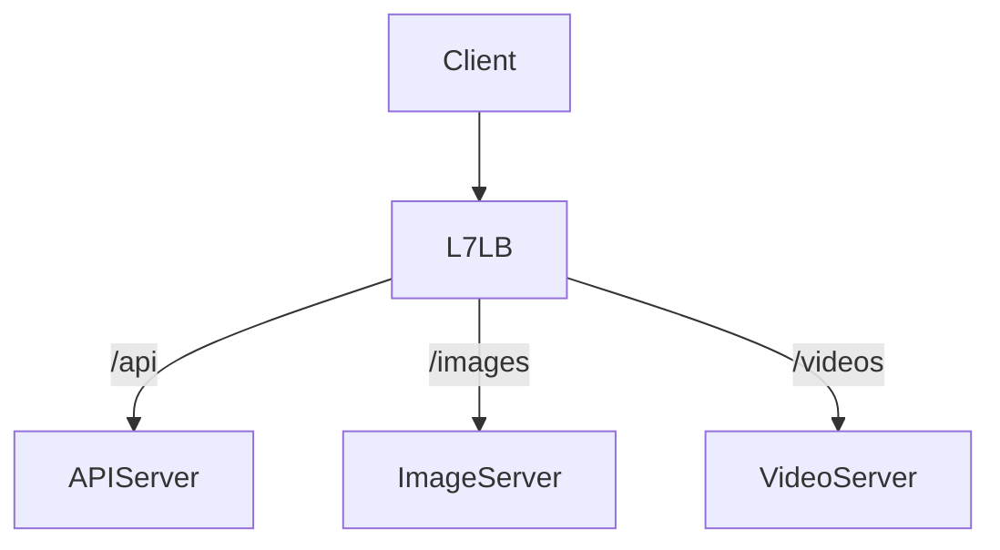

Advantages:

| Feature         | Supported |
| --------------- | --------- |
| URL routing     | Yes       |
| Header routing  | Yes       |
| Authentication  | Yes       |
| SSL termination | Yes       |

Disadvantages:

* More CPU overhead
* Slightly higher latency

---

# Load Balancing Algorithms

Load balancers use algorithms to decide where traffic goes.

---

# Round Robin

Requests distributed sequentially.

Example:

```
Req1 → Server1
Req2 → Server2
Req3 → Server3
Req4 → Server1
```

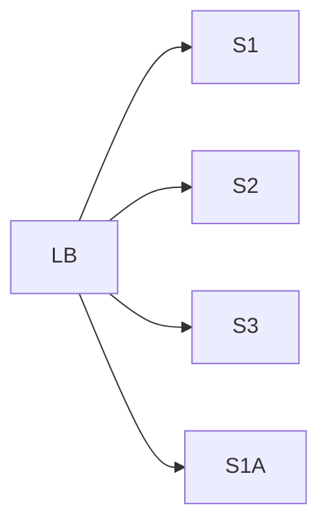

Advantages:

* Simple
* Even distribution

Disadvantages:

* Assumes all servers equal

---

# Weighted Round Robin

Servers assigned weights based on capacity.

Example:

| Server  | Weight |
| ------- | ------ |
| Server1 | 5      |
| Server2 | 2      |
| Server3 | 1      |

Server1 receives more traffic.

---

# Least Connections

Requests sent to server with **fewest active connections**.

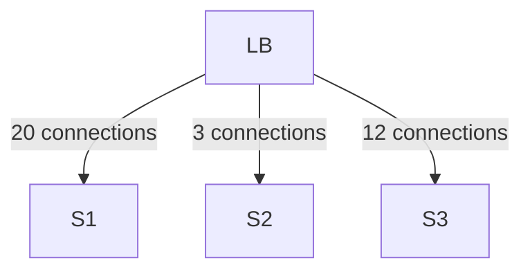

Next request goes to **S2**.

Useful for:

* Long-lived connections
* WebSocket services

---

# IP Hash

Server chosen based on client IP.

```
server = hash(client_ip) % server_count
```

This ensures the **same user always reaches same server**.

Useful for session persistence.

---

# Sticky Sessions (Session Persistence)

Some applications store session data in server memory.

Example:

* Login session
* Shopping cart

If requests jump across servers, the session is lost.

Sticky sessions ensure the same user always hits the same server.


Problem:

Uneven traffic distribution.

Better approach:

Store sessions in shared storage such as:

* Redis
* Distributed cache
* Database

---

# Health Checks

Load balancers continuously monitor backend servers.

Without health checks:

```
Traffic may go to dead servers
```

With health checks:

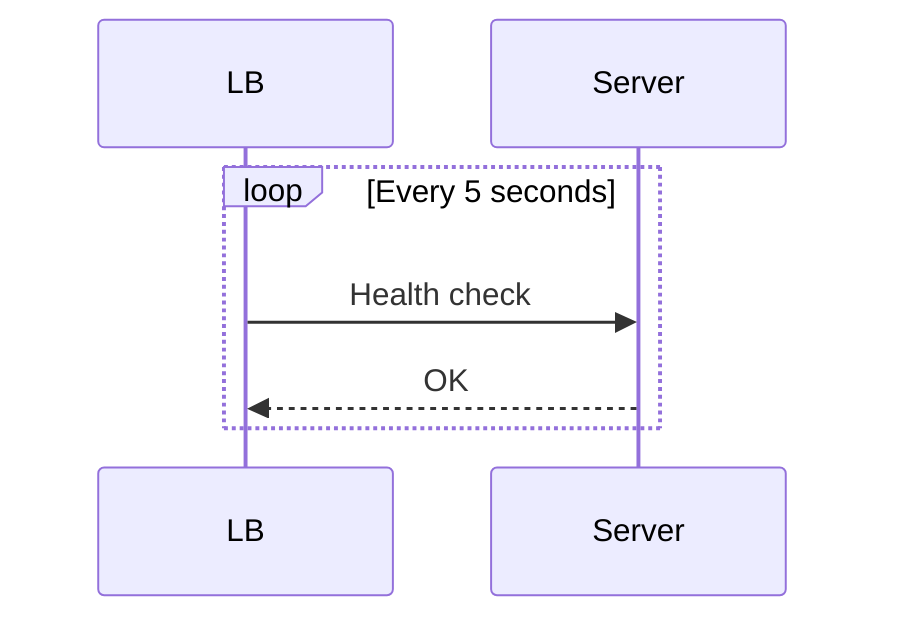

If server fails:

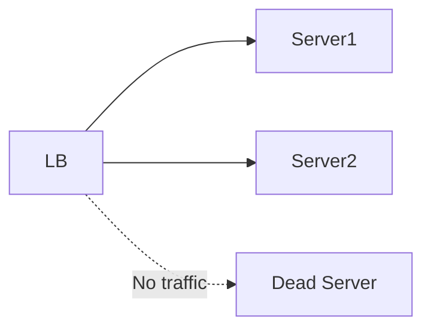

Types of checks:

| Type              | Description                 |
| ----------------- | --------------------------- |
| TCP check         | Port open                   |
| HTTP check        | Endpoint responding         |
| Deep health check | Database/cache connectivity |

---

# SSL Termination

HTTPS encryption consumes CPU.

Instead of every server handling SSL, the load balancer decrypts traffic.


Benefits:

| Benefit                            | Explanation           |
| ---------------------------------- | --------------------- |
| Lower server CPU usage             | Servers skip TLS work |
| Centralized certificate management | Easier security       |
| Simpler backend infrastructure     | HTTP communication    |

---

# Reverse Proxy vs Load Balancer

Reverse proxies and load balancers often overlap.

Reverse Proxy capabilities:

* Caching
* Compression
* Authentication
* Routing

Load balancer focus:

* Traffic distribution

In practice many tools do both.

Examples:

* NGINX
* Envoy
* HAProxy

---

# Global Load Balancing

Large systems operate across multiple regions.

Users should connect to the **closest data center**.

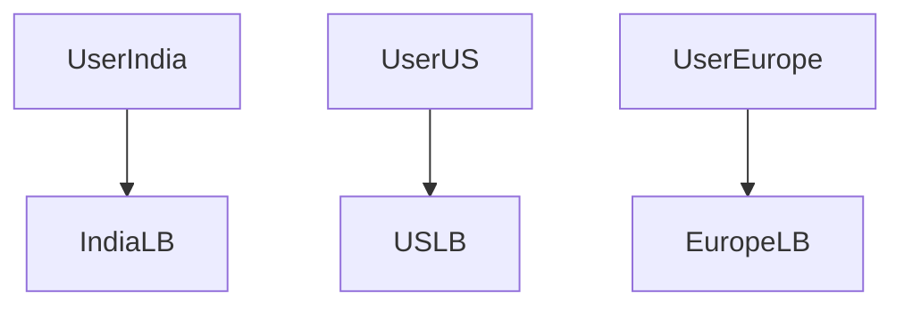

Benefits:

| Benefit            | Result                 |
| ------------------ | ---------------------- |
| Lower latency      | Faster user experience |
| Fault tolerance    | Region failover        |
| Global scalability | Traffic distribution   |

---

# DNS Load Balancing

DNS can distribute traffic geographically.

Example:

```
api.example.com
```

Users in different regions receive different IP addresses.

---

# CDN + Load Balancer

Modern architecture often includes a CDN.


CDN handles:

* Static content
* Edge caching
* Content delivery

Load balancer handles:

* Dynamic traffic routing

---

# Auto Scaling with Load Balancers

During traffic spikes:

```
10 servers → 100 servers
```

Auto scaling adds servers dynamically.

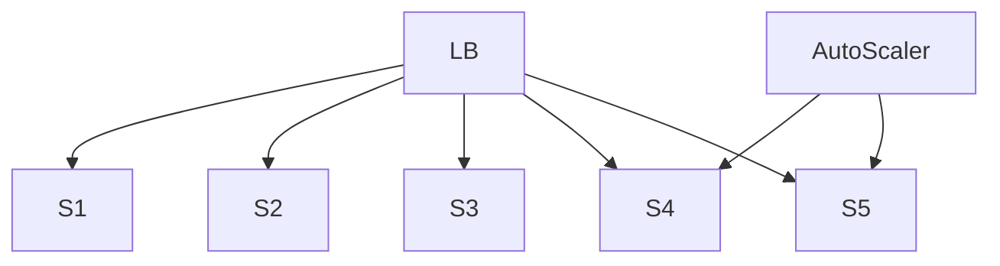

The load balancer automatically distributes traffic to new servers.

---

# Blue Green Deployment

Load balancers enable **zero downtime deployments**.

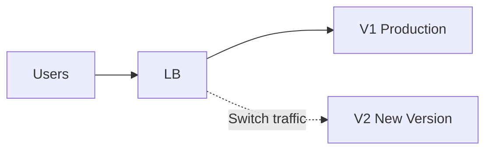

Traffic gradually shifts to the new version.

---

# Canary Deployment

Small percentage of users get new version.

| Version | Traffic |
| ------- | ------- |
| V1      | 95%     |
| V2      | 5%      |

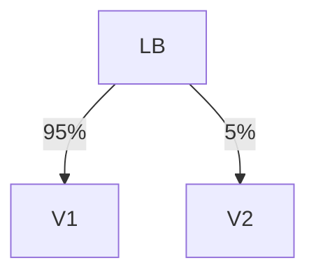

Helps detect bugs safely.

---

# High Availability for Load Balancers

Load balancers themselves must not become single points of failure.

Solution: **Multiple load balancers**

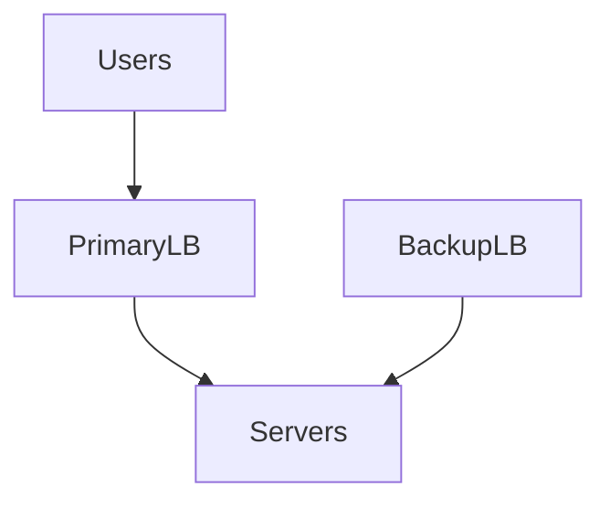

If PrimaryLB fails:

```
BackupLB takes over
```

---

# Popular Load Balancers

| Tool            | Description          |
| --------------- | -------------------- |
| NGINX           | Reverse proxy + LB   |
| HAProxy         | High performance LB  |
| Envoy           | Cloud native proxy   |
| Traefik         | Kubernetes-native LB |
| AWS ELB         | Managed LB           |
| Google Cloud LB | Global LB            |

---

# Real World Examples

## Netflix

Uses multiple load balancing layers:

* AWS ELB
* Zuul API gateway
* Envoy proxies

Handling **millions of requests per second**.

---

## Google

Google uses **global load balancing** across data centers worldwide.

Traffic routed to the nearest healthy region.

---

## Amazon

During events like Prime Day:

* Massive traffic spikes
* Millions of requests/sec

Load balancing ensures smooth operation.

---

# Common Problems in Load Balancing

| Problem              | Cause                 |
| -------------------- | --------------------- |
| Uneven traffic       | Bad algorithm         |
| Slow failover        | Delayed health checks |
| SSL bottleneck       | Encryption overhead   |
| Single point failure | Only one LB           |

---

# Best Practices

| Best Practice         | Reason                   |
| --------------------- | ------------------------ |
| Deploy multiple LBs   | Avoid single failure     |
| Enable health checks  | Remove unhealthy servers |
| Avoid sticky sessions | Improve scaling          |
| Use autoscaling       | Handle traffic spikes    |
| Monitor latency       | Optimize routing         |

---

# Key Takeaways

Load balancers are one of the **most fundamental building blocks of distributed systems**.

They provide:

* Scalability
* High availability
* Fault tolerance
* Efficient resource usage

Almost every large-scale system relies heavily on load balancing:

* Netflix
* Amazon
* Google
* Uber
* Facebook

As systems scale from **thousands to millions of users**, intelligent traffic distribution becomes essential.

Load balancers make that possible.