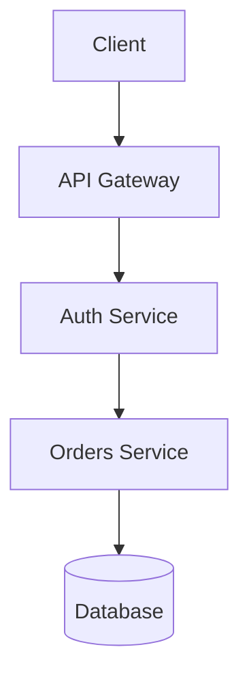

# 1. Introduction: Why We Need Visibility into Our Systems

Modern backend systems are complex distributed environments. A single user request may travel through multiple components before returning a response.

For example:

User Request
→ API Gateway
→ Authentication Service
→ Backend API
→ Database
→ Cache Layer
→ Payment Service
→ Notification System

If a request fails anywhere in this chain, the user might only see:

```
HTTP/1.1 500 Internal Server Error
```

Without observability infrastructure, engineers cannot easily answer critical questions:

* Which service failed?
* Why did it fail?
* When did the failure start?
* How many users are affected?
* Is the problem still happening?

Logging, monitoring, and observability provide the visibility needed to answer these questions.

These practices transform production systems from **black boxes** into **observable systems** where engineers can quickly diagnose and resolve issues.

---

# 2. Logging: The Event History of Your Application

Logging is the practice of recording events that occur during application execution.

Logs act as a chronological record of everything happening inside the system.

They answer the question:

**“What happened?”**

Logs are especially useful for debugging errors, auditing system activity, and understanding how requests are processed.

---

## Log Levels

Logs are categorized by severity levels so engineers can filter and analyze them efficiently.

| Log Level | Purpose                                                    |
| --------- | ---------------------------------------------------------- |
| DEBUG     | Detailed diagnostic information used during development    |
| INFO      | Normal application behavior and successful operations      |
| WARN      | Unexpected but non-critical situations                     |
| ERROR     | Failures that prevent a specific operation from completing |
| FATAL     | Critical errors causing the application to crash           |

---

## Example Log Entry (Structured Logging)

Modern production systems prefer structured logs in JSON format.

```javascript
{
  timestamp: "2026-05-07T12:10:23Z",
  level: "ERROR",
  service: "orders-service",
  requestId: "req_83fj29",
  userId: "user_2981",
  endpoint: "/api/orders",
  errorCode: "DB_QUERY_TIMEOUT",
  message: "Database query exceeded timeout threshold"
}
```

Structured logging allows monitoring systems to filter logs by fields such as:

* userId
* requestId
* service
* errorCode

This makes debugging significantly easier.

---

## Example Logging in JavaScript

```javascript
function processOrder(orderId) {
  console.info("Processing order", { orderId });

  try {
    // simulate database operation
    if (!orderId) {
      throw new Error("Invalid order id");
    }

    console.info("Order processed successfully", { orderId });
  } catch (error) {
    console.error("Order processing failed", {
      orderId,
      errorCode: "ORDER_PROCESSING_FAILED",
      message: error.message
    });
  }
}
```

---

# 3. Monitoring: Tracking System Health in Real Time

Monitoring focuses on tracking system performance through **metrics**.

Metrics are numerical measurements collected over time that describe the health of the system.

Monitoring answers the question:

**“Is something wrong?”**

Monitoring systems continuously collect metrics such as CPU usage, request latency, and error rates.

If these metrics cross predefined thresholds, alerts are triggered.

---

## Common Backend Metrics

### Infrastructure Metrics

| Metric          | Description                         |
| --------------- | ----------------------------------- |
| CPU Usage       | Percentage of processor utilization |
| Memory Usage    | Amount of RAM being used            |
| Disk I/O        | Disk read/write activity            |
| Network Latency | Network communication delays        |

---

### Application Metrics

| Metric               | Description                            |
| -------------------- | -------------------------------------- |
| Request Rate         | Number of incoming requests per second |
| Error Rate           | Percentage of failed requests          |
| Latency              | Average response time                  |
| Database Connections | Number of active database sessions     |

---

## Example Metric Data

```
requests_total = 15000
errors_total = 245
error_rate = 1.63%
avg_latency = 125ms
```

These metrics help engineers detect abnormal behavior.

---

## Example Monitoring Alert

```
ALERT: HIGH_API_ERROR_RATE
Condition: error_rate > 5% for 5 minutes
Severity: Critical
```

When this alert triggers, engineers know that something is wrong with the system.

However, the alert alone does not explain the root cause.

For that, engineers must examine logs and traces.

---

# 4. Observability: Understanding Complex System Behavior

Observability is a modern engineering practice that allows developers to understand the internal state of a system by analyzing its outputs.

Observability answers the question:

**“Why did the problem occur?”**

A system is considered observable when it provides sufficient telemetry data to diagnose failures without needing to reproduce them.

Observability relies on three types of telemetry data:

* Logs
* Metrics
* Traces

Together they provide a complete picture of system behavior.

---

# 5. Logs, Metrics, and Traces: The Three Pillars of Observability

## Logs

Logs capture detailed events and messages generated by applications.

Example:

```
ERROR: PAYMENT_FAILED
Transaction ID: txn_93219
```

Logs help engineers identify specific failures.

---

## Metrics

Metrics provide aggregated numerical data over time.

Example:

```
payment_failure_rate = 7%
```

Metrics help detect trends and anomalies.

---

## Traces

Traces show the complete lifecycle of a request as it travels through multiple services.

Example request flow:



Tracing records:

* execution time of each service
* errors
* request latency

---

## Example Distributed Trace

```
Trace ID: trace_8291

API Gateway → 15ms
Auth Service → 22ms
Orders Service → 110ms
Database Query → 720ms
```

In this example, the database query is responsible for most of the latency.

Tracing helps engineers quickly locate performance bottlenecks.

---

# 6. Error Codes, Status Codes, and Failure Signals

Production systems use standardized error codes to identify specific failures.

---

## HTTP Status Codes

| Status Code | Meaning               |
| ----------- | --------------------- |
| 200         | Successful request    |
| 201         | Resource created      |
| 400         | Bad request           |
| 401         | Unauthorized          |
| 403         | Forbidden             |
| 404         | Resource not found    |
| 429         | Too many requests     |
| 500         | Internal server error |
| 503         | Service unavailable   |

Example log entry:

```javascript
{
  status: 500,
  errorCode: "DB_CONN_FAILURE",
  message: "Unable to connect to database"
}
```

---

## Common Backend Error Codes

| Error Code            | Description                  |
| --------------------- | ---------------------------- |
| AUTH_INVALID_PASSWORD | Incorrect login credentials  |
| AUTH_TOKEN_EXPIRED    | Expired authentication token |
| DB_CONN_FAILURE       | Database connection failure  |
| DB_QUERY_TIMEOUT      | Slow database query          |
| CACHE_MISS            | Data missing in cache        |
| PAYMENT_FAILED        | Payment gateway rejection    |
| RATE_LIMIT_EXCEEDED   | API rate limit triggered     |
| SERVICE_UNAVAILABLE   | Downstream service offline   |

Standardized error codes allow engineers to quickly identify recurring problems.

---

# 7. How Logging, Monitoring, and Observability Work Together

In production incidents, these practices form a powerful debugging workflow.

---

### Step 1: Monitoring Detects the Problem

An alert is triggered:

```
ALERT: API_ERROR_RATE_HIGH
Error rate: 82%
```

---

### Step 2: Metrics Show the Scope

Engineers examine dashboards and observe:

```
Latency increased
Error rate spike
Database connections saturated
```

---

### Step 3: Logs Reveal Specific Errors

Logs show:

```
ERROR: DB_QUERY_TIMEOUT
Query execution exceeded 2 seconds
```

---

### Step 4: Traces Identify Root Cause

Tracing shows the problematic request path:

```
Orders Service
↓
Database Query (2.5 seconds)
↓
Timeout Error
```

Root cause:

Missing database index.

---

# 8. Best Practices for Production Systems

## Use Structured Logging

Always log structured data rather than plain text.

Bad example:

```
Something went wrong
```

Good example:

```javascript
{
  errorCode: "PAYMENT_FAILED",
  userId: "user_9123",
  transactionId: "txn_92381"
}
```

---

## Include Context in Every Log

Logs should include:

* timestamp
* service name
* request ID
* user ID
* error code

This information enables fast debugging.

---

## Avoid Logging Sensitive Data

Never log:

* passwords
* authentication tokens
* credit card numbers
* private user information

---

## Use Correlation IDs

Every request should have a unique identifier.

Example:

```
X-Request-ID: req_843912
```

This allows engineers to track a request across multiple services.

---

## Implement Alerting Carefully

Too many alerts cause **alert fatigue**.

Alerts should only trigger for meaningful failures such as:

* high error rate
* service downtime
* resource exhaustion

---

# 9. Common Observability Tools Used in Industry

Many platforms help implement logging, monitoring, and observability.

### Logging Tools

* ELK Stack (Elasticsearch, Logstash, Kibana)
* Fluentd
* Loki

---

### Monitoring Tools

* Prometheus
* Grafana
* Datadog
* New Relic

---

### Tracing Tools

* OpenTelemetry
* Jaeger
* Zipkin

---

These tools form the backbone of modern observability platforms.

---

# Conclusion

Logging, monitoring, and observability are essential practices for operating reliable backend systems.

Each practice answers a critical question:

| Practice      | Key Question               |
| ------------- | -------------------------- |
| Logging       | What happened?             |
| Monitoring    | Is there a problem?        |
| Observability | Why did the problem occur? |

By combining logs, metrics, and traces, engineers gain deep insight into system behavior and can quickly detect, diagnose, and resolve production issues.

In modern distributed systems, observability is not optional—it is a foundational requirement for building reliable, scalable software.
