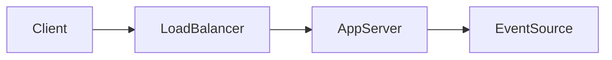
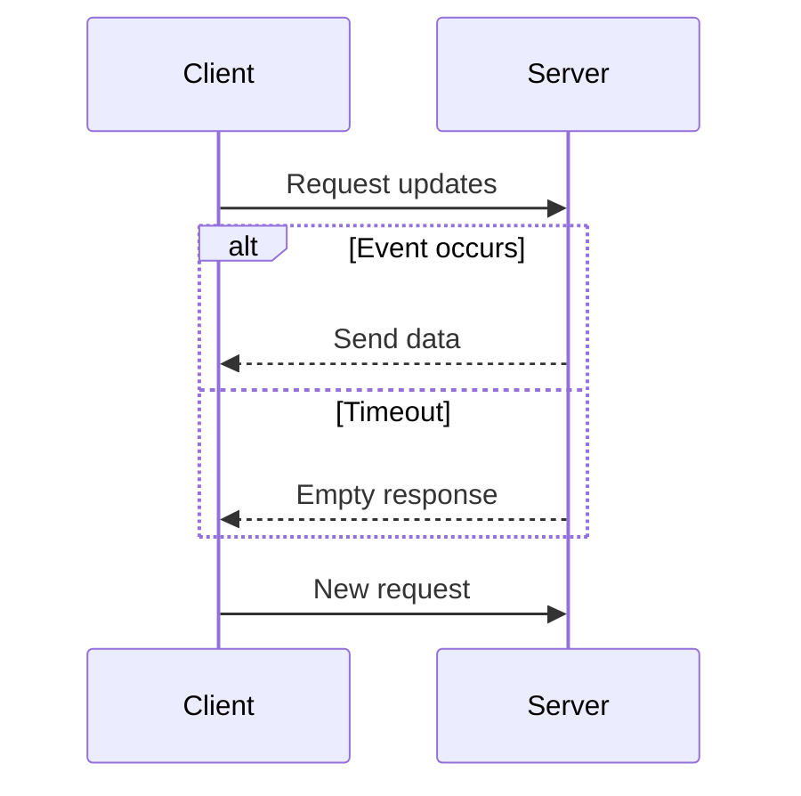
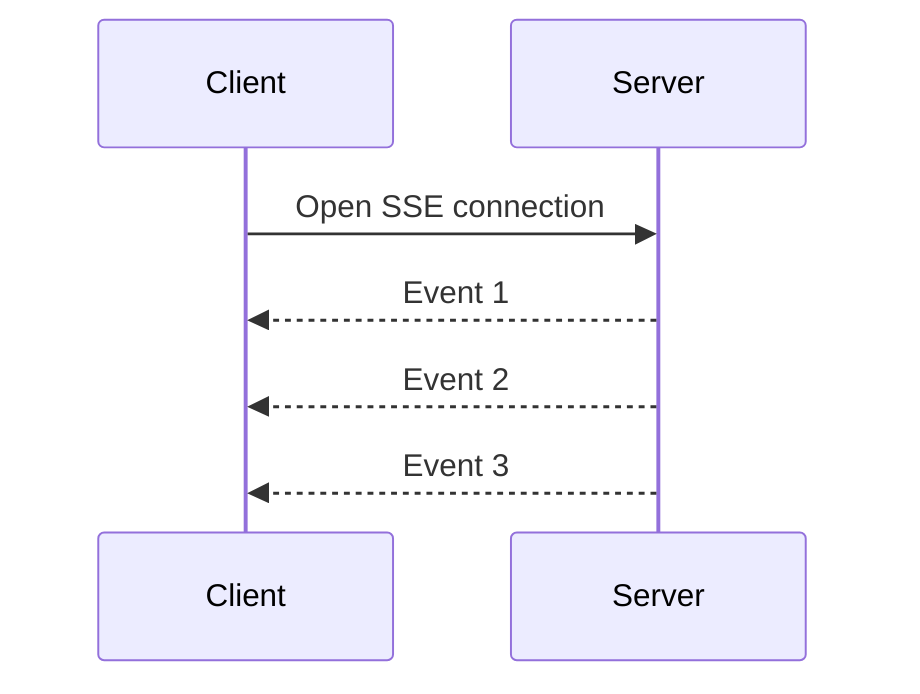
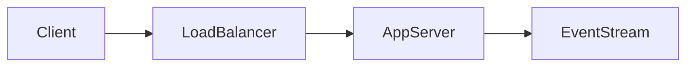
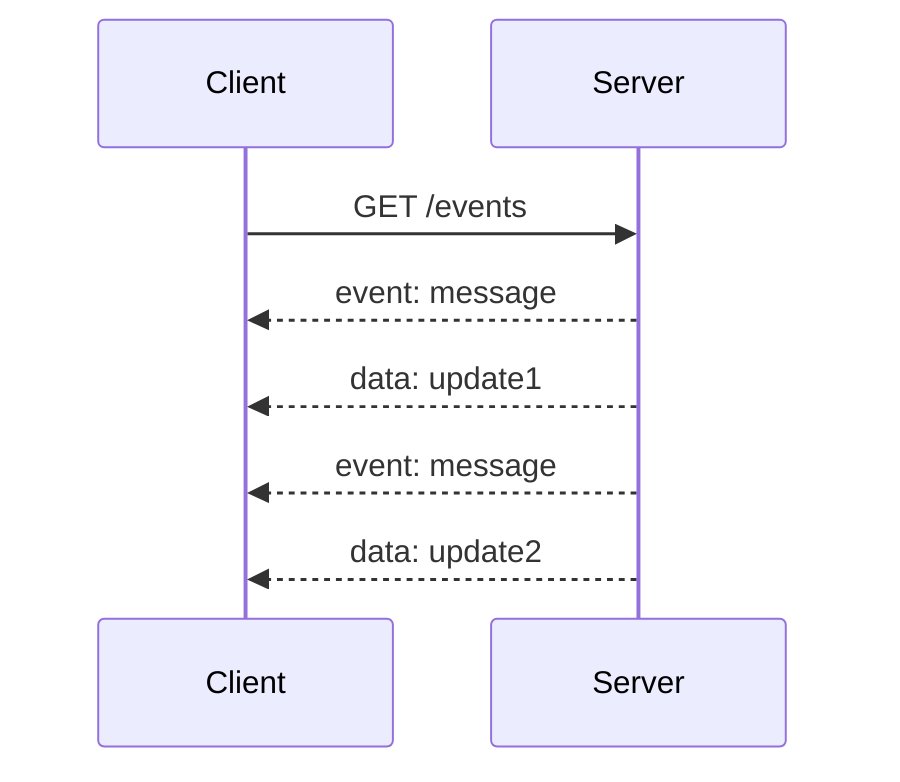
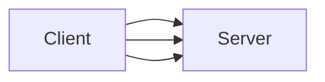
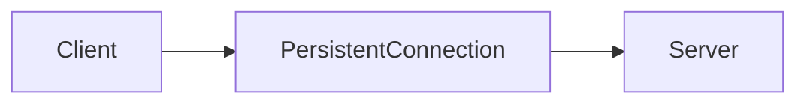
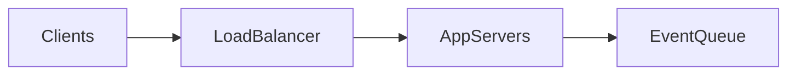
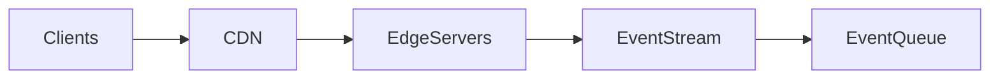

# Long Polling vs Server-Sent Events (SSE)

## Introduction

Many modern applications require **real-time communication** between clients and servers.

Examples include:

| Application | Real-Time Requirement |
|-------------|----------------------|
| Chat applications | Instant message delivery |
| Stock trading apps | Live price updates |
| Social media | Notifications |
| Online gaming | State updates |
| Monitoring dashboards | Real-time metrics |

The traditional **HTTP request-response model** was not designed for continuous real-time communication.

Standard HTTP works like this:

```

Client → Request → Server
Server → Response → Client
Connection closes

````

If the client wants updates, it must repeatedly send requests.

This leads to inefficient patterns like **polling**.

To solve this, several techniques evolved:

1. **Polling**
2. **Long Polling**
3. **Server-Sent Events (SSE)**
4. **WebSockets**

This article focuses on **Long Polling and SSE**, which are widely used alternatives to full-duplex WebSockets.

---

# The Problem with Traditional Polling

Traditional polling repeatedly checks the server for updates.

Example:

```mermaid
sequenceDiagram
    participant Client
    participant Server

    Client->>Server: Request updates
    Server-->>Client: No updates

    Client->>Server: Request updates
    Server-->>Client: No updates

    Client->>Server: Request updates
    Server-->>Client: New data
````

Problems with polling:

| Problem                    | Explanation                            |
| -------------------------- | -------------------------------------- |
| High network overhead      | Many useless requests                  |
| High server load           | Server handles unnecessary queries     |
| Increased latency          | Client waits for next polling interval |
| Inefficient resource usage | CPU and bandwidth wasted               |

Example:

If a client polls every **2 seconds**, most requests return **no data**.

This inefficiency led to **Long Polling**.

---

# Long Polling

## What is Long Polling?

Long Polling is a technique where the client sends a request and the **server keeps the connection open until new data becomes available**.

Instead of responding immediately, the server **waits for updates**.

Workflow:

```mermaid
sequenceDiagram
    participant Client
    participant Server

    Client->>Server: Request updates

    Note over Server: Wait for event

    Server-->>Client: Send new data

    Client->>Server: New request
```

This significantly reduces unnecessary requests.

---

# Long Polling Architecture



Components:

| Component          | Role                      |
| ------------------ | ------------------------- |
| Client             | Sends long-lived requests |
| Load balancer      | Routes requests           |
| Application server | Holds request until event |
| Event source       | Triggers response         |

---

# Long Polling Request Lifecycle

1. Client sends request to server
2. Server keeps request open
3. If event occurs → server responds
4. Client immediately sends a new request

Diagram:



---

# Advantages of Long Polling

| Advantage                  | Explanation                  |
| -------------------------- | ---------------------------- |
| Works with HTTP            | No special protocols         |
| Firewall friendly          | Uses normal HTTP             |
| Lower latency than polling | Server responds immediately  |
| Simple implementation      | Easy to add to existing apps |

---

# Limitations of Long Polling

| Limitation                          | Explanation                        |
| ----------------------------------- | ---------------------------------- |
| High connection churn               | New request after every response   |
| Server resource usage               | Many open connections              |
| Inefficient for massive scale       | Hard to handle millions of clients |
| Increased latency during reconnects | Small delays occur                 |

For large systems, this approach becomes expensive.

---

# Server-Sent Events (SSE)

## What is SSE?

Server-Sent Events allow the **server to push updates continuously to the client over a single HTTP connection**.

Unlike Long Polling:

* Connection remains open
* Server streams events
* Client receives updates continuously

Workflow:



The connection stays alive indefinitely.

---

# SSE Architecture



The server maintains a **persistent HTTP connection** with the client.

---

# SSE Communication Flow



The server sends **event streams**.

---

# SSE Message Format

SSE uses a simple text format.

Example:

```
event: message
data: Hello World

event: notification
data: New message received
```

Fields:

| Field | Purpose           |
| ----- | ----------------- |
| event | Event type        |
| data  | Message payload   |
| id    | Event ID          |
| retry | Reconnection time |

---

# SSE Client Example (JavaScript)

```javascript
const eventSource = new EventSource("/events");

eventSource.onmessage = function(event) {
    console.log("New data:", event.data);
};
```

The browser automatically maintains the connection.

---

# Advantages of SSE

| Advantage               | Explanation                  |
| ----------------------- | ---------------------------- |
| Persistent connection   | No repeated requests         |
| Lower overhead          | Single long-lived connection |
| Automatic reconnection  | Built into browser API       |
| Efficient streaming     | Continuous event delivery    |
| Simpler than WebSockets | Uses HTTP                    |

---

# Limitations of SSE

| Limitation                           | Explanation                      |
| ------------------------------------ | -------------------------------- |
| One-way communication                | Server → Client only             |
| Limited browser support historically | Older browsers lacked support    |
| Connection limits                    | Browsers limit open connections  |
| Not ideal for bidirectional apps     | Chat apps may require WebSockets |

---

# Long Polling vs SSE

Comparison:

| Feature                   | Long Polling      | SSE                   |
| ------------------------- | ----------------- | --------------------- |
| Connection model          | Repeated requests | Persistent connection |
| Direction                 | Server → Client   | Server → Client       |
| Latency                   | Medium            | Low                   |
| Network overhead          | Higher            | Lower                 |
| Implementation complexity | Medium            | Low                   |
| Scalability               | Moderate          | Better                |

---

# Architecture Comparison

Long Polling:



Repeated connections.

SSE:



Single connection.

---

# Scaling Long Polling

To scale long polling:

| Strategy           | Explanation                   |
| ------------------ | ----------------------------- |
| Load balancers     | Distribute connections        |
| Async servers      | Non-blocking request handling |
| Event queues       | Decouple event processing     |
| Horizontal scaling | Add more servers              |

Example architecture:



---

# Scaling SSE

SSE scaling strategies:

| Strategy                    | Explanation       |
| --------------------------- | ----------------- |
| Event streaming systems     | Publish updates   |
| Distributed message brokers | Deliver events    |
| Horizontal scaling          | More edge nodes   |
| Connection multiplexing     | Efficient streams |

Architecture:



---

# Real-World Use Cases

Long Polling:

| Application           | Example              |
| --------------------- | -------------------- |
| Legacy chat systems   | Early messaging apps |
| Notification systems  | Simple alerts        |
| Monitoring dashboards | Periodic updates     |

SSE:

| Application                    | Example            |
| ------------------------------ | ------------------ |
| Stock market feeds             | Live price updates |
| Real-time analytics dashboards | Metrics streaming  |
| Social media notifications     | Activity feeds     |
| Sports score updates           | Live match scores  |

---

# SSE vs WebSockets

Although SSE is powerful, WebSockets offer **full-duplex communication**.

| Feature    | SSE               | WebSockets       |
| ---------- | ----------------- | ---------------- |
| Direction  | Server → Client   | Bidirectional    |
| Protocol   | HTTP              | Custom protocol  |
| Complexity | Lower             | Higher           |
| Use case   | Streaming updates | Interactive apps |

---

# Choosing the Right Approach

Decision table:

| Use Case            | Recommended  |
| ------------------- | ------------ |
| Live dashboards     | SSE          |
| Notifications       | SSE          |
| Chat applications   | WebSockets   |
| Legacy HTTP systems | Long Polling |
| Event streaming     | SSE          |

---

# Summary

Real-time communication is essential for modern applications.

Long Polling and Server-Sent Events provide **efficient alternatives to traditional polling**.

Key takeaways:

| Concept      | Explanation                                           |
| ------------ | ----------------------------------------------------- |
| Long Polling | Client waits for server updates via held request      |
| SSE          | Server streams events over persistent HTTP connection |
| Polling      | Inefficient repeated requests                         |

Compared to polling, both approaches:

* Reduce latency
* Lower server load
* Enable real-time data delivery

SSE is generally preferred when **unidirectional streaming updates** are needed, while Long Polling remains useful for **legacy systems or environments without SSE support**.