# Microservices Design Patterns

Microservices architecture breaks a large application into **independent services** that communicate over a network.

However, building microservices introduces **new distributed system challenges**:

- Service communication
- Data consistency
- Failure handling
- Service discovery
- Observability
- Deployment complexity

To solve these challenges, engineers use **Microservices Design Patterns**.

These patterns provide **proven solutions** for designing scalable distributed systems.

---

# Monolith vs Microservices

Before understanding patterns, it's important to see why microservices exist.

## Monolithic Architecture

```mermaid
flowchart TB

Client --> Application

subgraph Application
Auth
Orders
Payments
Inventory
Notifications
end
````

Problems:

| Problem            | Explanation                   |
| ------------------ | ----------------------------- |
| Tight coupling     | All modules deployed together |
| Hard scaling       | Entire application must scale |
| Slower development | Large codebase                |
| Deployment risk    | One bug affects entire system |

---

## Microservices Architecture

```mermaid
flowchart TB

Client --> APIGateway

APIGateway --> AuthService
APIGateway --> OrderService
APIGateway --> PaymentService
APIGateway --> InventoryService
APIGateway --> NotificationService
```

Benefits:

| Benefit                | Explanation                                        |
| ---------------------- | -------------------------------------------------- |
| Independent deployment | Services release separately                        |
| Scalability            | Scale only required services                       |
| Technology flexibility | Each service can use different stack               |
| Fault isolation        | Failure in one service doesn't crash entire system |

---

# Categories of Microservices Patterns

Microservices patterns generally fall into five categories.

| Category                 | Purpose                       |
| ------------------------ | ----------------------------- |
| Architectural Patterns   | Structure of services         |
| Communication Patterns   | Service interaction           |
| Data Management Patterns | Database design               |
| Resilience Patterns      | Fault tolerance               |
| Deployment Patterns      | Service deployment strategies |

---

# 1 API Gateway Pattern

An **API Gateway** acts as the single entry point for clients.

Instead of clients calling multiple services directly, they interact with a gateway.

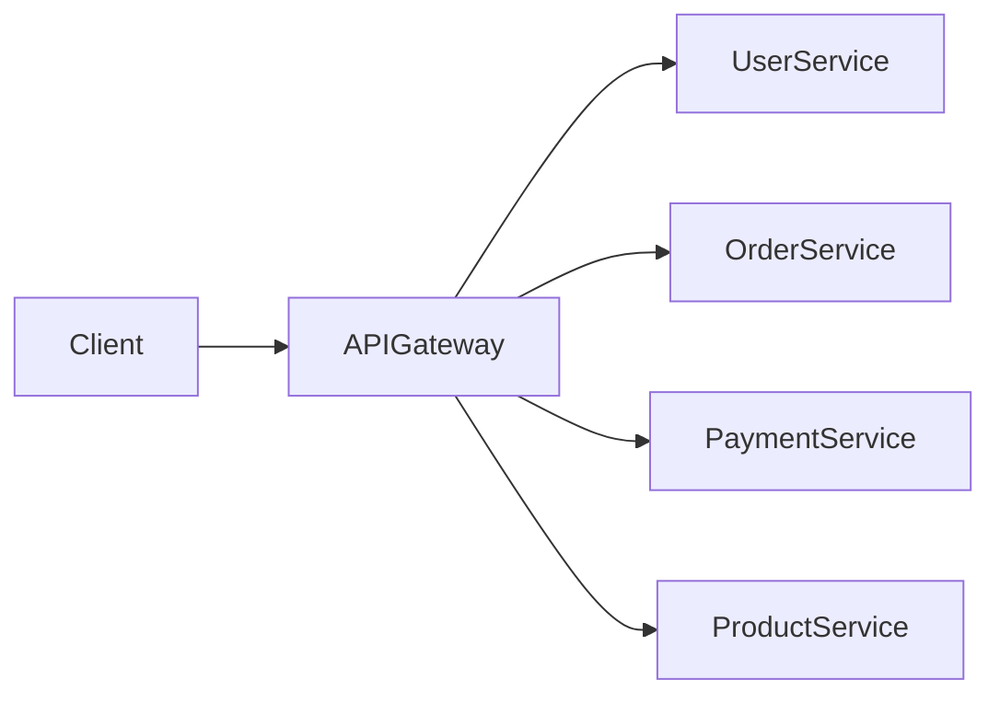

Responsibilities:

| Responsibility | Description                 |
| -------------- | --------------------------- |
| Routing        | Direct requests to services |
| Authentication | Validate tokens             |
| Rate limiting  | Prevent abuse               |
| Aggregation    | Combine multiple responses  |

Example:

```javascript
// API Gateway routing example

app.get("/orders/:id", async (req, res) => {

  const order = await fetch("http://order-service/orders/" + req.params.id);
  const payment = await fetch("http://payment-service/payment/" + req.params.id);

  const result = {
    order: await order.json(),
    payment: await payment.json()
  };

  res.json(result);
});
```

---

# 2 Service Discovery Pattern

In dynamic environments, service instances constantly change.

Service discovery allows services to **find each other automatically**.

Two approaches exist.

---

## Client-side discovery

Client asks **service registry** for service location.

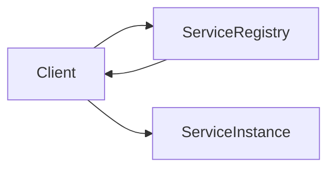

Examples:

* Netflix Eureka
* Consul

---

## Server-side discovery

Client calls **load balancer**, which queries registry.

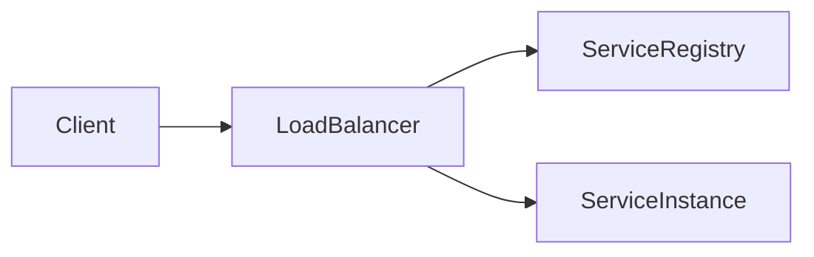

Examples:

* Kubernetes
* AWS ALB

---

# 3 Database per Service Pattern

Each microservice owns its **own database**.

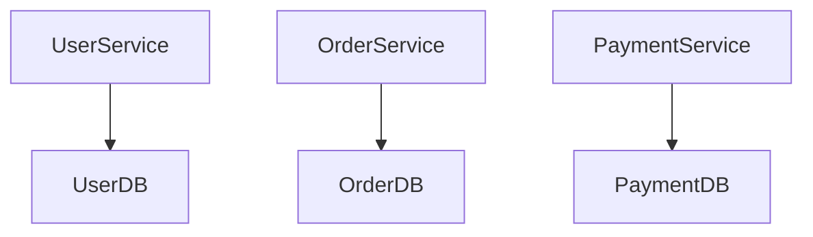

Benefits:

| Benefit             | Explanation                |
| ------------------- | -------------------------- |
| Loose coupling      | Services independent       |
| Independent scaling | Databases scale separately |
| Technology choice   | SQL, NoSQL etc             |

Challenges:

| Challenge                | Explanation       |
| ------------------------ | ----------------- |
| Cross-service queries    | Hard to join data |
| Distributed transactions | Complex           |

---

# 4 Saga Pattern

Maintains **data consistency across services**.

Instead of distributed transactions, Saga uses **local transactions with compensations**.

---

## Saga Example: Order Processing

Steps:

1. Create order
2. Reserve inventory
3. Process payment
4. Confirm order

If payment fails:

* Inventory reservation must be cancelled.

---

## Saga Architecture

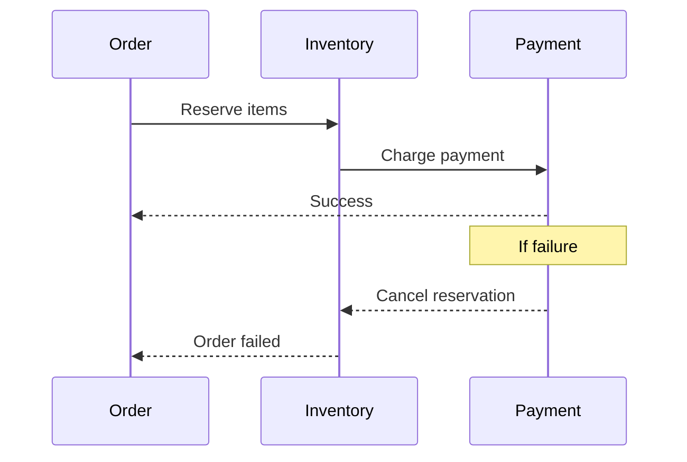

---

## Saga Types

| Type          | Description                     |
| ------------- | ------------------------------- |
| Choreography  | Services emit events            |
| Orchestration | Central controller manages flow |

---

# 5 Event Driven Architecture

Services communicate through **events instead of direct calls**.

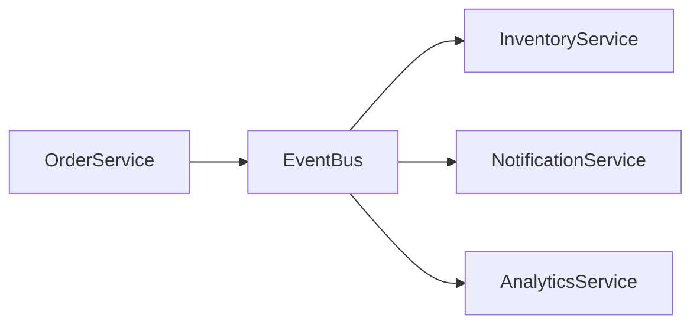

Example event:

```json
{
 "event": "OrderCreated",
 "orderId": "1234"
}
```

Benefits:

| Benefit        | Explanation                    |
| -------------- | ------------------------------ |
| Loose coupling | Services unaware of each other |
| Scalability    | Async processing               |
| Reliability    | Retry mechanisms               |

---

# 6 Circuit Breaker Pattern

Prevents cascading failures.

If a service fails repeatedly, circuit breaker **stops calls temporarily**.

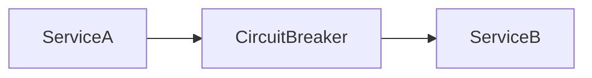

States:

| State     | Description               |
| --------- | ------------------------- |
| Closed    | Normal operation          |
| Open      | Requests blocked          |
| Half Open | Test if service recovered |

---

# 7 Bulkhead Pattern

Isolates resources so failure in one service **does not exhaust entire system**.

Analogy: Ships use **watertight compartments**.

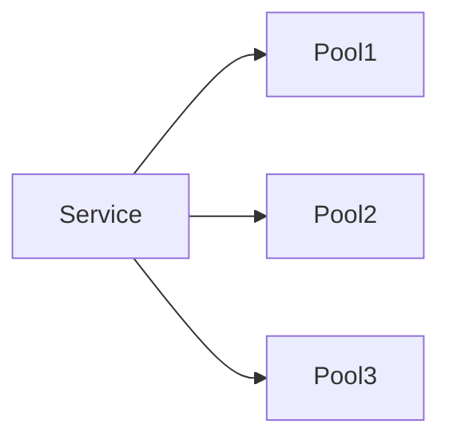

If one pool crashes → others continue.

---

# 8 CQRS (Command Query Responsibility Segregation)

Separates **read and write operations**.

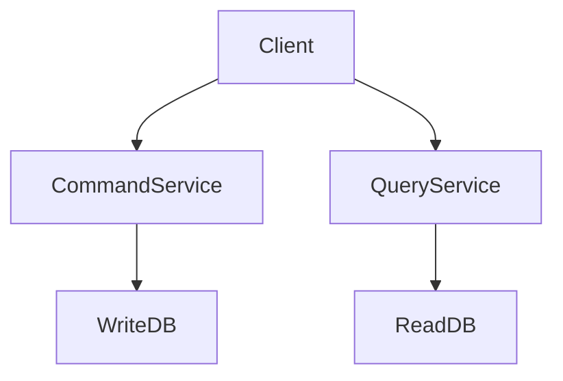

Benefits:

| Benefit      | Explanation             |
| ------------ | ----------------------- |
| Faster reads | Optimized read database |
| Scalability  | Independent scaling     |
| Flexibility  | Different models        |

---

# 9 Strangler Pattern

Used when **migrating monolith → microservices**.

Instead of rewriting entire system, gradually replace modules.

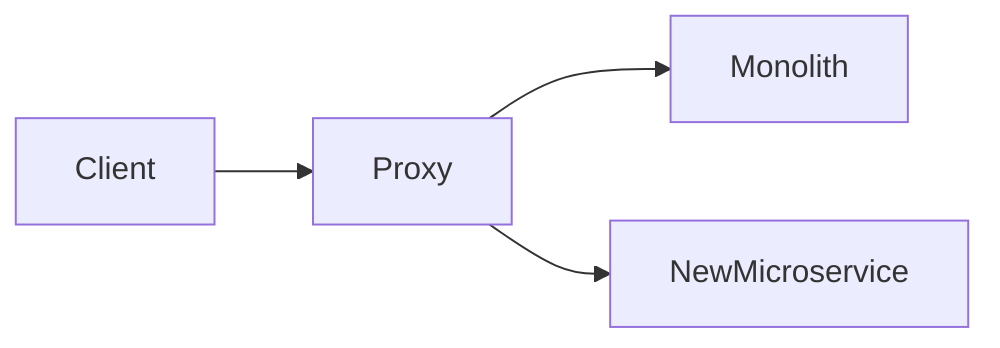

Over time:

* More traffic moves to microservices
* Monolith eventually removed

---

# 10 Sidecar Pattern

Used heavily in **service mesh architectures**.

Each service gets a **sidecar proxy**.

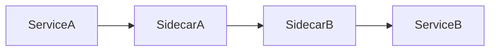

Sidecar responsibilities:

| Responsibility  | Description    |
| --------------- | -------------- |
| Security        | TLS            |
| Logging         | Metrics        |
| Traffic routing | Retry policies |
| Observability   | Tracing        |

---

# 11 Aggregator Pattern

Combines data from multiple services.

Example:

A **dashboard service** fetching:

* user profile
* orders
* recommendations

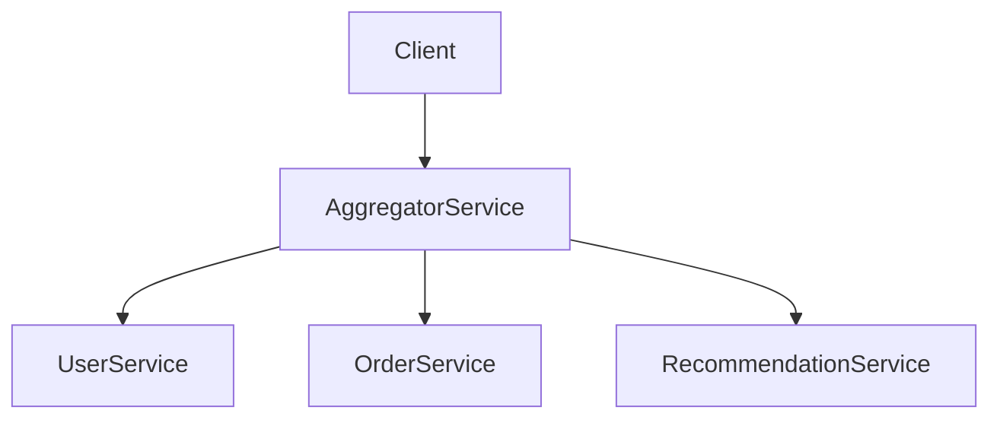

---

# Real World Microservices Architecture Example

Example: **E-commerce platform**

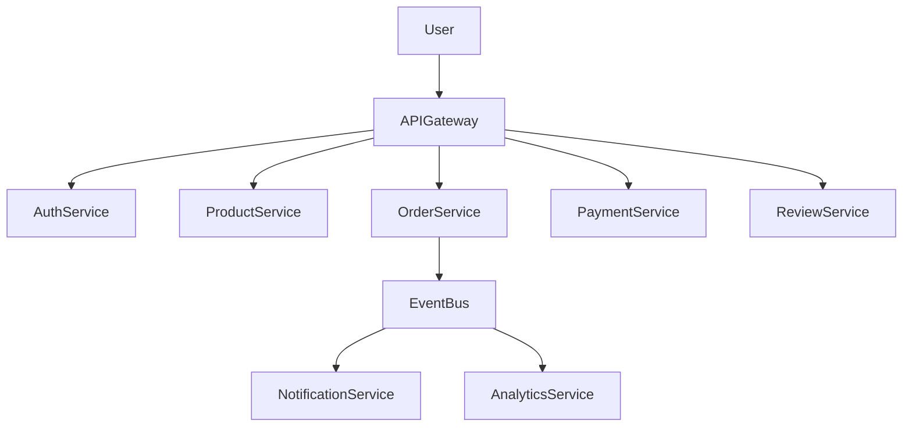

---

# Microservices Infrastructure Stack

A typical microservices system includes:

| Component          | Purpose             |
| ------------------ | ------------------- |
| API Gateway        | Entry point         |
| Service Registry   | Service discovery   |
| Message Broker     | Async communication |
| Monitoring         | Metrics and logs    |
| Container platform | Deployment          |
| CI/CD pipeline     | Automation          |

---

# Key Takeaways

* Microservices solve **scalability and maintainability problems** of monoliths
* They introduce **distributed system challenges**
* Design patterns help manage complexity
* Important patterns include:

  * API Gateway
  * Service Discovery
  * Saga
  * Event Driven Architecture
  * Circuit Breaker
  * CQRS
  * Sidecar

These patterns form the **foundation of modern large-scale distributed systems** used by companies like Netflix, Amazon, and Uber.