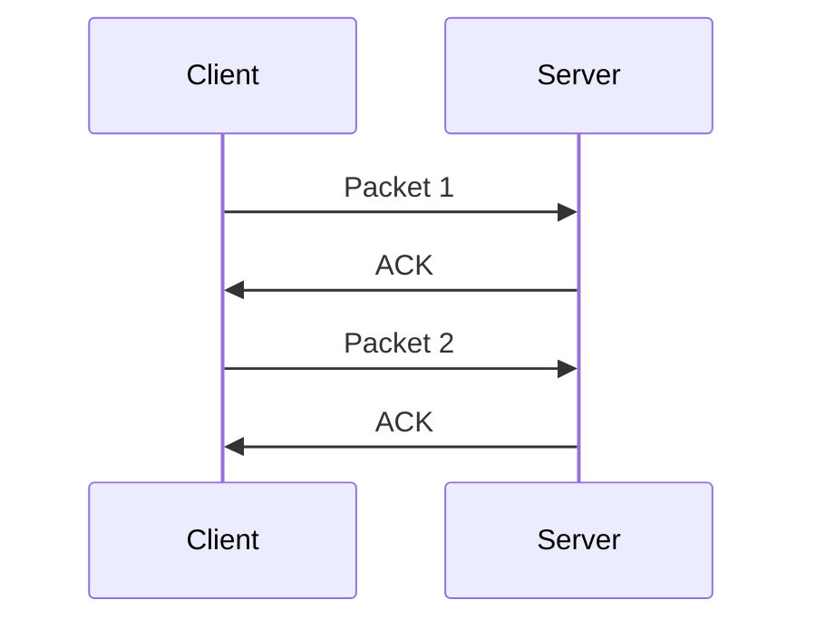
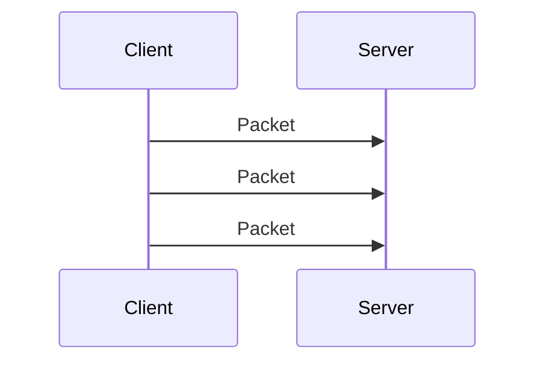
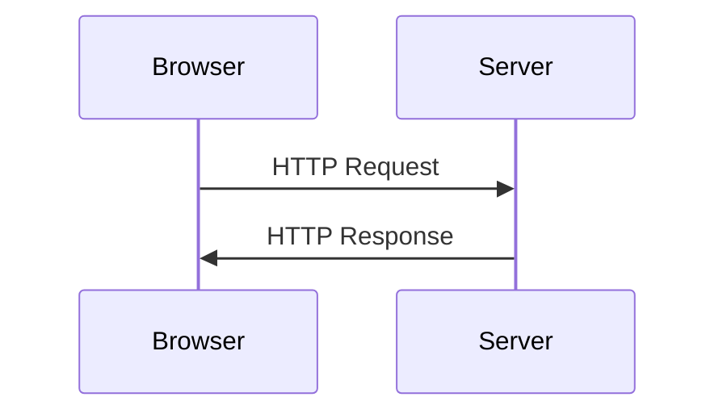
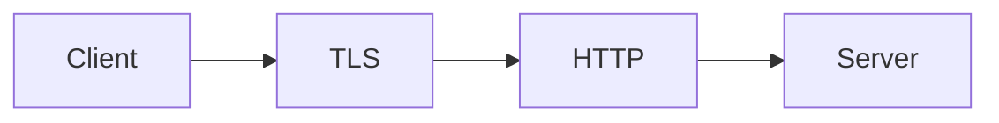
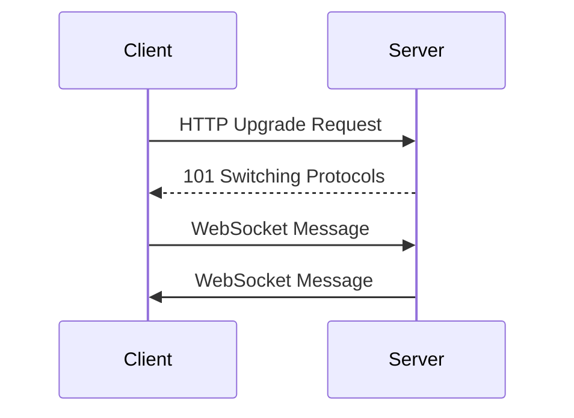
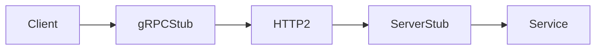
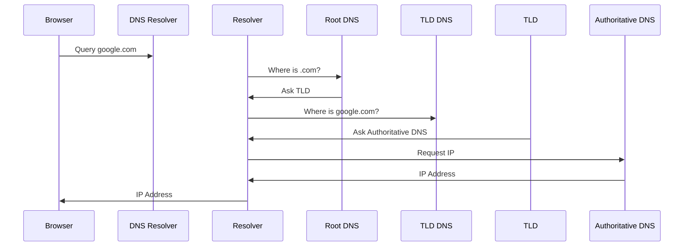
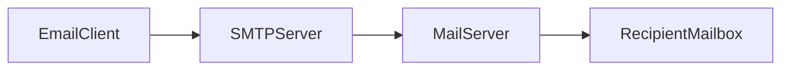
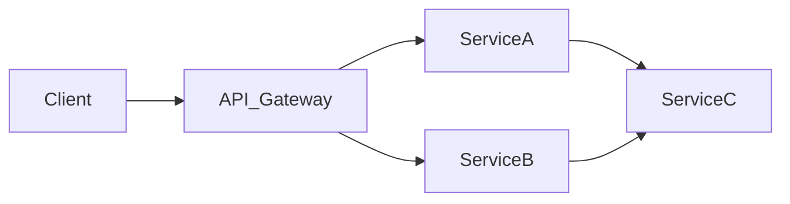
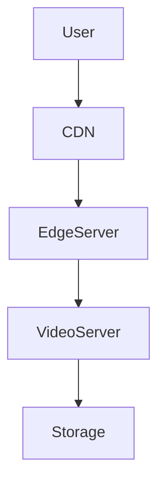

# Network Protocols in High Level Design (HLD)

In distributed systems, services do not exist in isolation. They **communicate across networks**.  
The rules governing how data is transmitted between systems are called **network protocols**.

A **network protocol** defines:

- How data is formatted
- How messages are transmitted
- How errors are handled
- How connections are established and terminated

In High Level Design, selecting the correct protocol directly affects:

| System Property | Impact |
|---|---|
| Latency | How fast services communicate |
| Reliability | Packet loss handling |
| Scalability | Connection handling |
| Security | Encryption and authentication |
| Performance | Bandwidth and CPU usage |

---

# Real World Analogy

Think of network protocols like **languages used by different departments in a company**.

| Protocol | Analogy |
|---|---|
| TCP | Registered courier delivery |
| UDP | Loudspeaker announcements |
| HTTP | Standard office communication |
| WebSockets | Phone call |
| gRPC | Structured API contract |
| DNS | Phonebook lookup |

Each protocol serves **a different communication need**.

---

# Network Protocol Stack

Protocols operate in layers. The most common model used in system design is the **TCP/IP model**.

```mermaid
flowchart TD

Application["Application Layer<br>(HTTP, WebSocket, gRPC, FTP, SMTP)"]
Transport["Transport Layer<br>(TCP, UDP)"]
Internet["Internet Layer<br>(IP)"]
Network["Network Access Layer<br>(Ethernet, WiFi)"]

Application --> Transport
Transport --> Internet
Internet --> Network
````

Each layer has a responsibility.

| Layer       | Responsibility                 |
| ----------- | ------------------------------ |
| Application | Defines communication rules    |
| Transport   | Ensures delivery               |
| Internet    | Handles addressing and routing |
| Network     | Physical data transmission     |

---

# 1 Transport Layer Protocols

Transport protocols determine **how data travels between services**.

The two primary transport protocols are:

| Protocol | Key Feature            |
| -------- | ---------------------- |
| TCP      | Reliable communication |
| UDP      | Fast but unreliable    |

---

# TCP (Transmission Control Protocol)

TCP is a **connection-oriented protocol** that guarantees delivery.

Features:

* Reliable delivery
* Ordered packets
* Retransmission
* Flow control
* Congestion control

---

## TCP Connection Lifecycle

TCP uses a **three-way handshake**.

```mermaid
sequenceDiagram

participant Client
participant Server

Client->>Server: SYN
Server->>Client: SYN-ACK
Client->>Server: ACK
```

Connection established.

---

## TCP Data Transfer



If packet is lost → TCP **retransmits**.

---

## When TCP Is Used

TCP is used when **data correctness is critical**.

Examples:

| System          | Reason                |
| --------------- | --------------------- |
| Web APIs        | Data must not be lost |
| Databases       | Strong consistency    |
| Payment systems | Reliability           |
| File transfer   | Complete delivery     |

---

# UDP (User Datagram Protocol)

UDP is **connectionless and faster** than TCP.

Characteristics:

* No connection setup
* No guaranteed delivery
* No ordering
* Minimal overhead

---

## UDP Data Flow



No acknowledgments.

Packets may:

* arrive out of order
* get lost
* be duplicated

---

## When UDP Is Used

UDP is ideal for **real-time communication**.

Examples:

| System          | Reason                  |
| --------------- | ----------------------- |
| Video streaming | Some loss acceptable    |
| Online gaming   | Ultra-low latency       |
| Voice calls     | Real-time communication |
| DNS queries     | Fast resolution         |

---

# Application Layer Protocols

Application layer protocols define **how applications communicate**.

Common protocols:

| Protocol  | Primary Use                            |
| --------- | -------------------------------------- |
| HTTP      | Web communication                      |
| HTTPS     | Secure HTTP                            |
| WebSocket | Real-time communication                |
| gRPC      | High-performance service communication |
| DNS       | Name resolution                        |
| SMTP      | Email sending                          |

---

# HTTP (HyperText Transfer Protocol)

HTTP is the **foundation of the web**.

It follows a **request-response model**.



Example request:

```http
GET /users HTTP/1.1
Host: api.example.com
```

Example response:

```http
HTTP/1.1 200 OK
Content-Type: application/json
```

---

## HTTP Characteristics

| Feature          | Description                    |
| ---------------- | ------------------------------ |
| Stateless        | Each request independent       |
| Text-based       | Human readable                 |
| Request/Response | Client initiates communication |

---

# HTTP Methods

| Method | Purpose          |
| ------ | ---------------- |
| GET    | Retrieve data    |
| POST   | Create resource  |
| PUT    | Replace resource |
| PATCH  | Update resource  |
| DELETE | Remove resource  |

Example:

```javascript
fetch("https://api.example.com/users")
```

---

# HTTPS (HTTP Secure)

HTTPS is **HTTP over TLS encryption**.

It ensures:

* Encryption
* Integrity
* Authentication

Architecture:



Benefits:

| Benefit        | Explanation              |
| -------------- | ------------------------ |
| Privacy        | Prevents eavesdropping   |
| Security       | Prevents tampering       |
| Authentication | Verifies server identity |

---

# WebSocket

WebSocket enables **persistent bidirectional communication**.

Unlike HTTP:

* Connection stays open
* Server can push data
* Real-time communication

---

## WebSocket Flow



---

## WebSocket Use Cases

| System            | Example           |
| ----------------- | ----------------- |
| Chat applications | WhatsApp Web      |
| Live dashboards   | Stock prices      |
| Multiplayer games | Real-time updates |
| Notifications     | Live alerts       |

---

## JavaScript WebSocket Example

```javascript
const socket = new WebSocket("wss://example.com/socket");

socket.onopen = () => {
  socket.send("Hello Server");
};

socket.onmessage = (event) => {
  console.log("Received:", event.data);
};
```

---

# gRPC

gRPC is a **high-performance RPC framework** developed by Google.

Uses:

* HTTP/2
* Protocol Buffers
* Binary serialization

---

## gRPC Architecture



---

## Why gRPC Is Fast

| Feature             | Benefit           |
| ------------------- | ----------------- |
| Binary protocol     | Smaller payload   |
| HTTP/2 multiplexing | Parallel requests |
| Streaming           | Continuous data   |

---

## gRPC vs REST

| Feature     | REST     | gRPC     |
| ----------- | -------- | -------- |
| Protocol    | HTTP/1.1 | HTTP/2   |
| Data format | JSON     | Protobuf |
| Performance | Moderate | High     |
| Streaming   | Limited  | Native   |

---

# DNS (Domain Name System)

DNS translates **domain names into IP addresses**.

Example:

```
google.com → 142.250.190.14
```

---

## DNS Resolution Flow



---

# SMTP (Email Protocol)

SMTP is used for **sending emails**.

Architecture:



---

# Protocol Selection in System Design

Choosing the right protocol depends on **system requirements**.

| Requirement         | Recommended Protocol |
| ------------------- | -------------------- |
| Reliable APIs       | HTTP/TCP             |
| Real-time messaging | WebSocket            |
| Microservices       | gRPC                 |
| Video streaming     | UDP                  |
| Domain resolution   | DNS                  |

---

# Protocols in Microservices Architecture



Protocols used:

| Communication      | Protocol  |
| ------------------ | --------- |
| Client → Gateway   | HTTPS     |
| Gateway → Services | HTTP/gRPC |
| Service → Service  | gRPC      |
| Internal discovery | DNS       |

---

# Protocol Performance Comparison

| Protocol  | Speed     | Reliability | Use Case      |
| --------- | --------- | ----------- | ------------- |
| TCP       | Medium    | High        | APIs          |
| UDP       | Very High | Low         | Streaming     |
| HTTP      | Medium    | High        | Web           |
| WebSocket | High      | High        | Real-time     |
| gRPC      | Very High | High        | Microservices |

---

# Real World Architecture Example

Example: **YouTube streaming system**



Protocols used:

| Layer                 | Protocol |
| --------------------- | -------- |
| Browser → CDN         | HTTPS    |
| CDN → Edge            | HTTP     |
| Streaming             | UDP      |
| Service communication | gRPC     |

---

# Key Takeaways

* Network protocols define **how services communicate across networks**
* TCP ensures **reliable delivery**, while UDP prioritizes **speed**
* HTTP/HTTPS power most web APIs
* WebSocket enables **real-time communication**
* gRPC is widely used in **microservices architectures**
* DNS resolves domain names to IP addresses
* Choosing the correct protocol is critical for **performance, scalability, and reliability**

Understanding network protocols is fundamental to designing **large-scale distributed systems**.