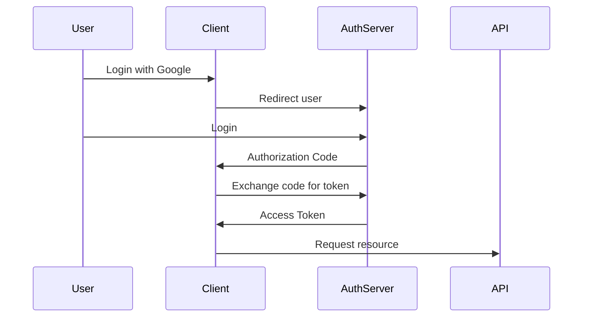
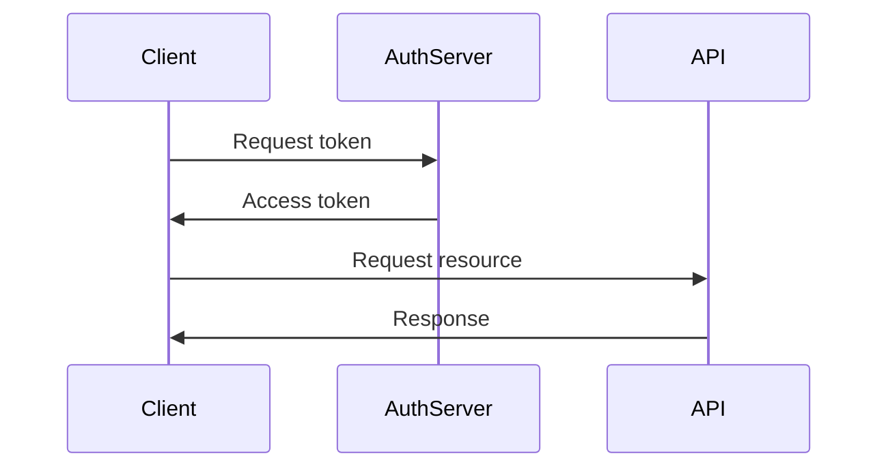
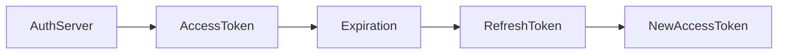
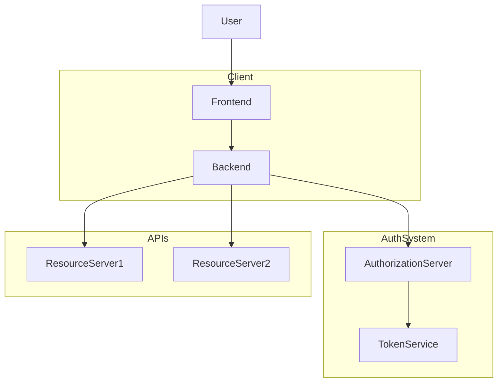
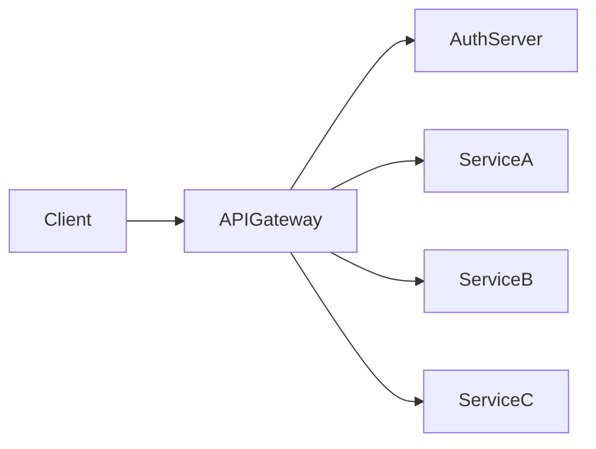
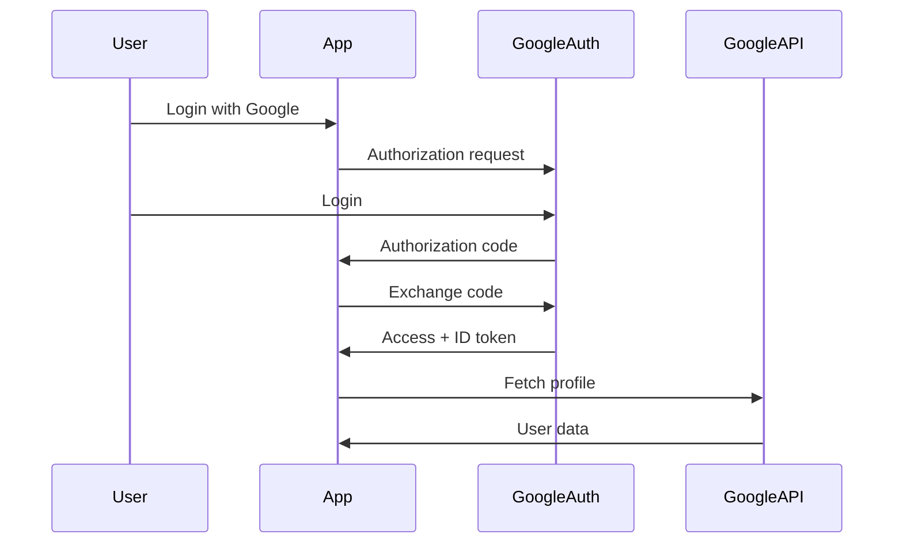

# OAuth (Open Authorization)

OAuth is an **authorization framework** that allows an application to access a user's resources **on another service without sharing the user's credentials**.

Instead of giving your password to a third-party application, OAuth allows the application to obtain **limited access tokens** that represent permission.

This approach is used almost everywhere on the internet today:

- "Login with Google"
- "Login with GitHub"
- "Connect your Spotify to Discord"
- "Allow a productivity app to access your Google Drive"

OAuth solves a major problem in distributed systems:

> **How can one application securely access resources from another application on behalf of a user?**

---

# The Core Problem OAuth Solves

Before OAuth existed, applications used a **password sharing model**.

Example:

A third-party email app wants to access your Gmail.

Old approach:

```

User → gives Gmail username & password → third-party app

````

Problems:

| Problem | Explanation |
|-------|-------------|
| Password exposure | Third party stores your credentials |
| No scope limitation | App gets full account access |
| Hard to revoke | Changing password breaks everything |
| Security risk | If the app is compromised, your account is compromised |

OAuth replaces this with **token-based delegated access**.

---

# Real World Analogy

Imagine checking into a hotel.

Instead of giving someone **the master key to your room**, you give them a **temporary key card** that:

- Works only for your room
- Works only for a limited time
- Can be revoked anytime

OAuth tokens behave exactly like **temporary access key cards**.

---

# OAuth Core Concepts

OAuth involves **four main actors**.

| Component | Description |
|---------|-------------|
| Resource Owner | The user who owns the data |
| Client Application | The application requesting access |
| Authorization Server | Issues tokens after user permission |
| Resource Server | API server that stores the user’s data |

Example:

| Role | Real Example |
|----|----|
| Resource Owner | User |
| Client | Slack |
| Authorization Server | Google OAuth server |
| Resource Server | Google Drive API |

---

# OAuth Architecture

```mermaid
flowchart LR

User --> ClientApp
ClientApp --> AuthorizationServer
AuthorizationServer --> User
User --> AuthorizationServer
AuthorizationServer --> ClientApp
ClientApp --> ResourceServer
ResourceServer --> ClientApp
ClientApp --> User
````

Step flow:

1. Client asks user for permission
2. User authenticates with authorization server
3. Authorization server issues **access token**
4. Client uses token to access resource server

---

# OAuth Authorization Flow (High Level)

```mermaid
sequenceDiagram

participant User
participant Client
participant AuthServer
participant API

User->>Client: Login with OAuth
Client->>AuthServer: Redirect for authentication
User->>AuthServer: Login + approve access
AuthServer->>Client: Authorization Code
Client->>AuthServer: Exchange code for token
AuthServer->>Client: Access Token
Client->>API: Request with token
API->>Client: Protected resource
```

---

# OAuth Tokens

OAuth primarily uses **tokens instead of passwords**.

| Token Type    | Purpose                               |
| ------------- | ------------------------------------- |
| Access Token  | Used to access APIs                   |
| Refresh Token | Used to generate new access tokens    |
| ID Token      | Identity information (OpenID Connect) |

Example access token:

```
eyJhbGciOiJIUzI1NiIsInR5cCI6IkpXVCJ9...
```

Most modern tokens are **JWT (JSON Web Tokens)**.

---

# OAuth Scopes

Scopes define **what permissions an application receives**.

Example:

| Scope        | Meaning           |
| ------------ | ----------------- |
| read_profile | Read user profile |
| read_email   | Read email        |
| write_files  | Modify files      |

Example authorization screen:

```
This app wants permission to:

✓ View your email address
✓ Read your contacts
```

Scopes enforce **principle of least privilege**.

---

# OAuth Authorization Flows

OAuth provides multiple flows depending on the type of application.

| Flow                      | Use Case           |
| ------------------------- | ------------------ |
| Authorization Code Flow   | Web applications   |
| Authorization Code + PKCE | Mobile apps / SPA  |
| Client Credentials Flow   | Service to service |
| Device Code Flow          | Smart TVs / IoT    |

---

# 1 Authorization Code Flow

Most secure and most common flow.

Used by:

* Backend web applications
* Microservices with backend servers

### Flow Diagram



---

# 2 Authorization Code with PKCE

PKCE = **Proof Key for Code Exchange**

Used for:

* Mobile apps
* Single Page Applications

Why needed?

Because mobile apps **cannot store client secrets securely**.

PKCE introduces:

```
code_verifier
code_challenge
```

These protect the authorization code from interception.

---

# 3 Client Credentials Flow

Used for **service-to-service communication**.

Example:

```
Microservice A → calls → Microservice B
```

Flow:



No user involved.

---

# OAuth Token Lifecycle



Typical lifecycle:

| Token         | Lifetime       |
| ------------- | -------------- |
| Access Token  | 5–60 minutes   |
| Refresh Token | Days or months |

---

# OAuth vs Authentication

Important distinction.

| Concept        | Meaning             |
| -------------- | ------------------- |
| Authentication | Who you are         |
| Authorization  | What you can access |

OAuth handles **authorization**.

For authentication, OAuth is extended with **OpenID Connect (OIDC)**.

---

# OAuth + OpenID Connect

OpenID Connect adds **identity layer**.

Additional token:

```
ID Token
```

Contains:

```
{
 "sub": "12345",
 "email": "user@example.com",
 "name": "John Doe"
}
```

This is how **"Login with Google" works**.

---

# OAuth Token Validation

Resource servers validate tokens before granting access.

Two common methods:

| Method              | Description               |
| ------------------- | ------------------------- |
| JWT validation      | Verify signature locally  |
| Token introspection | Call authorization server |

---

# OAuth System Architecture



---

# OAuth in Microservices

In large systems:

* API Gateway validates tokens
* Services trust gateway

Architecture:



Benefits:

* Centralized authentication
* Reduced complexity
* Security enforcement

---

# JavaScript Example (OAuth Authorization Code Flow)

Step 1 — Redirect user to authorization server

```javascript
const authUrl = `https://auth.example.com/oauth/authorize?
response_type=code
&client_id=CLIENT_ID
&redirect_uri=http://localhost:3000/callback
&scope=read_profile`;

window.location.href = authUrl;
```

---

Step 2 — Receive authorization code

```
http://localhost:3000/callback?code=AUTH_CODE
```

---

Step 3 — Exchange code for token

```javascript
const response = await fetch("https://auth.example.com/oauth/token", {
  method: "POST",
  headers: {
    "Content-Type": "application/json"
  },
  body: JSON.stringify({
    grant_type: "authorization_code",
    code: authCode,
    client_id: CLIENT_ID,
    client_secret: CLIENT_SECRET
  })
});

const data = await response.json();
console.log(data.access_token);
```

---

Step 4 — Access protected API

```javascript
const apiResponse = await fetch("https://api.example.com/user", {
  headers: {
    Authorization: `Bearer ${accessToken}`
  }
});

const user = await apiResponse.json();
console.log(user);
```

---

# Security Best Practices

| Practice                | Why                        |
| ----------------------- | -------------------------- |
| Use HTTPS               | Prevent token interception |
| Short token expiration  | Reduce damage if leaked    |
| Use PKCE                | Secure mobile apps         |
| Scope restrictions      | Limit access               |
| Refresh tokens securely | Avoid long lived tokens    |

---

# Common OAuth Vulnerabilities

| Vulnerability        | Description           |
| -------------------- | --------------------- |
| Token leakage        | Token exposed in logs |
| Redirect URI attacks | Malicious redirect    |
| CSRF attacks         | Forged auth requests  |
| Token replay         | Reusing stolen tokens |

---

# Example: Login with Google

Flow:

1. User clicks **Login with Google**
2. App redirects to Google
3. User logs in
4. Google returns authorization code
5. App exchanges code for tokens
6. App retrieves user profile

Architecture:



---

# When to Use OAuth

OAuth is ideal for:

| Scenario              | Example                         |
| --------------------- | ------------------------------- |
| Third-party login     | Login with Google               |
| API access            | GitHub API                      |
| Microservice security | Internal service authentication |
| Delegated permissions | Access user data safely         |

---

# Key Takeaways

* OAuth enables **secure delegated authorization**
* Users **never share passwords with third parties**
* Applications use **access tokens instead**
* Supports **multiple flows depending on application type**
* Often combined with **OpenID Connect for authentication**

OAuth is a **fundamental building block of modern distributed systems**, enabling secure integrations across thousands of applications on the internet.
