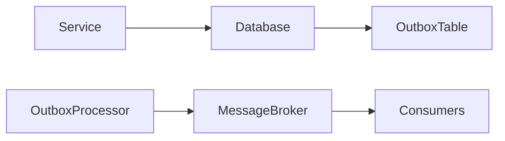
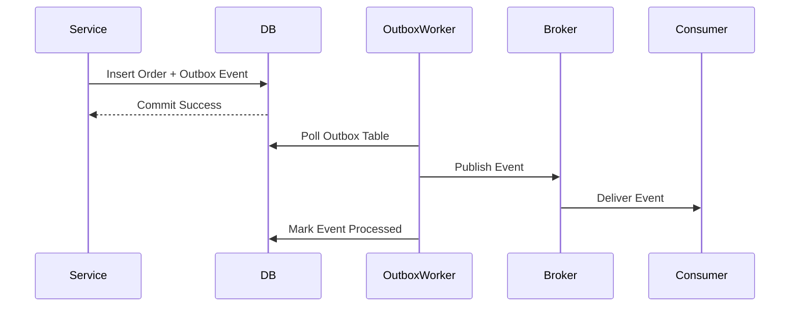
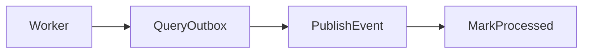
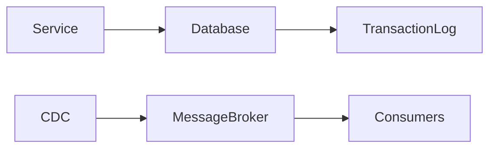
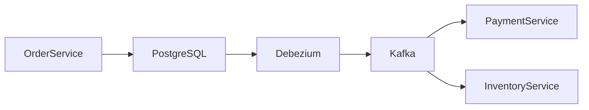
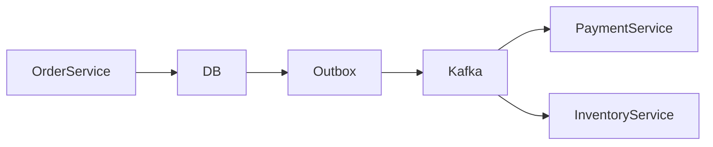

# Outbox Pattern

## Introduction

Modern distributed systems often rely on **event-driven architectures** where services communicate by publishing events to **message brokers** such as queues or streaming systems.

For example:

- An **Order Service** creates an order.
- It then publishes an **OrderCreated event**.
- Other services react to the event:
  - Payment Service
  - Inventory Service
  - Notification Service

However, this introduces a serious reliability problem.

> How do we guarantee that both the **database update** and the **event publish** happen consistently?

This is known as the **Dual Write Problem**.

The **Outbox Pattern** solves this problem by ensuring that **database updates and event publishing are coordinated safely** without distributed transactions.

---

# The Dual Write Problem

Consider a simple flow:

1. Save order to database
2. Publish `OrderCreated` event to message broker

```

Save Order → Publish Event

````

This appears simple but can fail in dangerous ways.

---

## Failure Scenario 1

```text
Database Write = SUCCESS
Event Publish = FAILED
````

Result:

* Order exists in database
* Other services never receive the event

System becomes **inconsistent**.

---

## Failure Scenario 2

```text
Database Write = FAILED
Event Publish = SUCCESS
```

Result:

* Event exists
* No corresponding order in database

Consumers process **invalid events**.

---

# Why Not Use Distributed Transactions?

One might attempt **Two Phase Commit (2PC)** between:

* Database
* Message broker

But this approach has major issues.

| Problem        | Explanation                          |
| -------------- | ------------------------------------ |
| Performance    | Distributed locking slows systems    |
| Scalability    | Does not scale well in microservices |
| Broker Support | Many brokers do not support 2PC      |
| Complexity     | High operational overhead            |

Modern architectures prefer **eventual consistency with reliability mechanisms**.

---

# What is the Outbox Pattern?

The **Outbox Pattern** ensures that:

> Database updates and event messages are stored **in the same database transaction**.

Instead of publishing the event immediately, the system:

1. Writes the business data
2. Writes an event record to an **Outbox table**
3. A background process publishes events from the outbox to the message broker

---

# High-Level Architecture



Components:

| Component           | Role                                 |
| ------------------- | ------------------------------------ |
| Application Service | Writes data and outbox event         |
| Database            | Stores both business data and events |
| Outbox Table        | Temporary storage for events         |
| Outbox Processor    | Reads and publishes events           |
| Message Broker      | Distributes events                   |

---

# Core Idea

Instead of:

```
Write Database
Publish Event
```

We do:

```
Write Database
Write Event To Outbox
COMMIT TRANSACTION
```

Then asynchronously:

```
Outbox → Publish Event → Message Broker
```

---

# Example: Order Creation

When a user places an order:

The service performs a **single transaction**.

```sql
BEGIN TRANSACTION;

INSERT INTO orders(order_id, user_id, status)
VALUES (101, 22, 'CREATED');

INSERT INTO outbox(event_id, event_type, payload, status)
VALUES (501, 'OrderCreated', '{orderId:101}', 'PENDING');

COMMIT;
```

Now both:

* Order
* Event record

are stored **atomically**.

---

# Outbox Table Structure

Example schema:

| Column       | Description             |
| ------------ | ----------------------- |
| event_id     | Unique event identifier |
| aggregate_id | Entity ID (order ID)    |
| event_type   | Type of event           |
| payload      | Event data              |
| status       | Pending / Processed     |
| created_at   | Event creation time     |

Example:

```sql
CREATE TABLE outbox (
    event_id UUID PRIMARY KEY,
    aggregate_id VARCHAR,
    event_type VARCHAR,
    payload JSON,
    status VARCHAR,
    created_at TIMESTAMP
);
```

---

# Event Publishing Workflow

The system uses a **background worker**.



---

# Polling Publisher Strategy

The simplest implementation is **polling**.

The outbox processor periodically checks:

```
SELECT * FROM outbox WHERE status = 'PENDING'
```

Then:

1. Publish event
2. Mark event as processed

---

### Polling Flow



---

# Polling Challenges

Polling has drawbacks.

| Issue   | Explanation                        |
| ------- | ---------------------------------- |
| Latency | Events delayed until next poll     |
| DB Load | Frequent queries                   |
| Scaling | Multiple workers need coordination |

---

# Log-Based Outbox (CDC)

A more advanced approach uses **Change Data Capture (CDC)**.

Instead of polling, the system **streams database changes**.

Tools like CDC read the **database transaction log**.

When a new row appears in the outbox table, it immediately publishes the event.

---

# CDC Architecture



---

# Example Technologies

Popular CDC tools:

| Tool          | Description                 |
| ------------- | --------------------------- |
| Debezium      | Streams DB changes to Kafka |
| Maxwell       | MySQL binlog streaming      |
| AWS DMS       | Managed CDC                 |
| Kafka Connect | CDC pipelines               |

---

# Outbox with Kafka

A common architecture:



This removes the need for polling entirely.

---

# Handling Duplicate Events

Event delivery may happen more than once.

Example failure scenario:

1. Event published
2. Worker crashes before marking processed
3. Worker restarts
4. Event published again

This causes **duplicate events**.

---

## Solution: Idempotent Consumers

Consumers must handle duplicates safely.

Example strategy:

```
Store processed event IDs
Ignore duplicates
```

Example table:

| event_id | processed |
| -------- | --------- |
| 501      | true      |

---

# Outbox Event Lifecycle

| Step               | State      |
| ------------------ | ---------- |
| Event inserted     | PENDING    |
| Worker reads event | PROCESSING |
| Event published    | PROCESSED  |

---

# Message Ordering

Sometimes event order matters.

Example:

```
OrderCreated
OrderPaid
OrderShipped
```

If events arrive out of order, system logic may break.

Solutions:

* Partition by **aggregate ID**
* Maintain **event sequence numbers**

---

# Outbox Pattern in Microservices

Typical architecture:



Each service can maintain its **own outbox table**.

---

# Advantages of Outbox Pattern

| Advantage                   | Explanation                          |
| --------------------------- | ------------------------------------ |
| Data consistency            | DB write and event stored atomically |
| No distributed transactions | Simpler architecture                 |
| Reliability                 | Events never lost                    |
| Scalability                 | Works well with message brokers      |

---

# Limitations

| Limitation           | Explanation               |
| -------------------- | ------------------------- |
| Increased complexity | Additional components     |
| Duplicate events     | Must handle idempotency   |
| Outbox table growth  | Requires cleanup strategy |

---

# Cleaning the Outbox Table

Outbox tables can grow rapidly.

Common cleanup strategies:

| Strategy                | Description          |
| ----------------------- | -------------------- |
| Delete processed events | Periodic cleanup     |
| Archive events          | Move to cold storage |
| TTL expiration          | Remove old entries   |

Example cleanup job:

```sql
DELETE FROM outbox
WHERE status='PROCESSED'
AND created_at < NOW() - INTERVAL '7 days';
```

---

# Real-World Systems Using Outbox

The Outbox Pattern is widely used in large distributed systems.

Companies operating massive microservice architectures often implement similar patterns, including systems at:

* Uber
* Netflix
* Amazon

These systems handle **millions of events per second**, making reliable event delivery critical.

---

# Outbox vs Direct Event Publishing

| Approach                      | Reliability             |
| ----------------------------- | ----------------------- |
| Direct publish after DB write | Risk of lost events     |
| Publish before DB write       | Risk of invalid events  |
| Outbox pattern                | Reliable and consistent |

---

# Best Practices

### Use Idempotent Consumers

Ensure duplicate events do not cause side effects.

---

### Monitor Outbox Lag

Track:

```
Current time - event creation time
```

Large lag indicates processing issues.

---

### Use Partitioning

Partition outbox by entity type or date to scale reads.

---

### Combine with CDC

CDC provides **low-latency streaming** without polling overhead.

---

# Summary

The **Outbox Pattern** is a powerful solution for reliable event publishing in distributed systems.

It works by:

1. Writing events to an **outbox table within the same database transaction**
2. Using a **background processor or CDC tool** to publish events to a message broker

This guarantees that:

* Events are **never lost**
* Data and events remain **consistent**
* Systems remain **scalable and loosely coupled**

In modern microservice architectures, the Outbox Pattern is often used together with:

* **Event-driven architecture**
* **Change Data Capture**
* **Streaming platforms**

to create highly reliable **event pipelines across distributed services**.