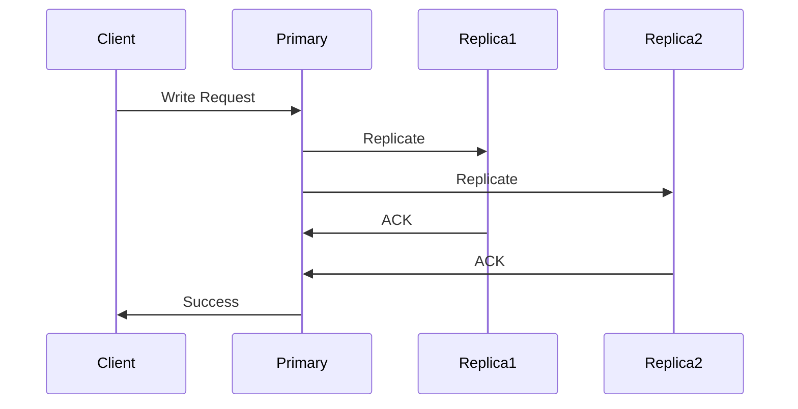
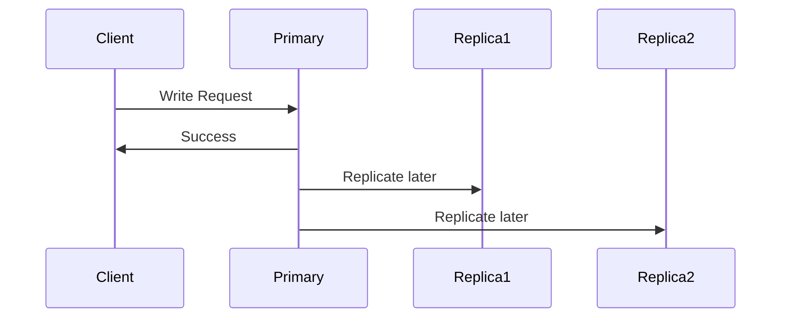
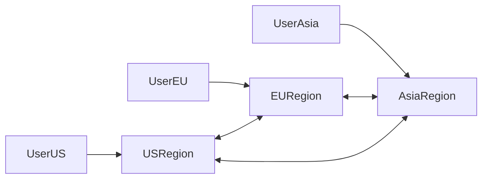
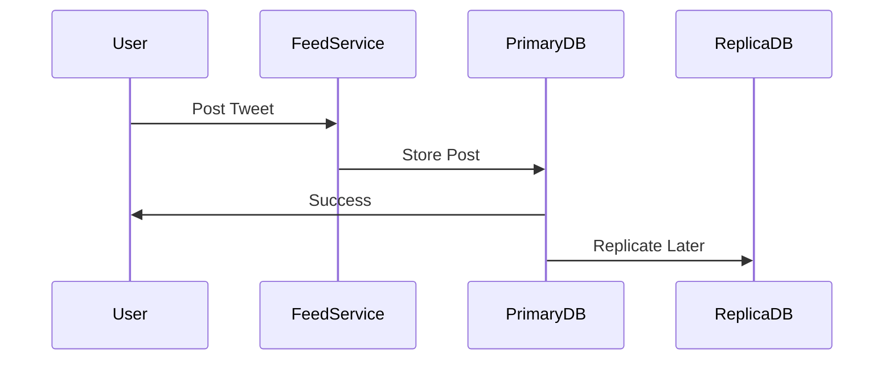

# PACELC Theorem

## Introduction

Distributed systems are built from **multiple machines communicating over a network**.  
These machines cooperate to store data, process requests, and provide services.

However, distributed systems must constantly deal with trade-offs between:

- **Consistency**
- **Availability**
- **Latency**

Many engineers learn about the **:contentReference[oaicite:0]{index=0}**, which states that during a network partition a system must choose between **Consistency (C)** and **Availability (A)**.

But CAP only addresses **what happens during network failures**.

The **:contentReference[oaicite:1]{index=1}**, proposed by **:contentReference[oaicite:2]{index=2}**, extends CAP and explains a more realistic truth:

> Even when there is **no partition**, distributed systems still face trade-offs.

PACELC provides a more **complete model of distributed system design**.

---

# The Core Idea of PACELC

PACELC expands CAP using the following rule:

```

If Partition (P) happens → choose between Availability (A) and Consistency (C)

Else (E) → choose between Latency (L) and Consistency (C)

```

Which can be summarized as:

```

P → A or C
E → L or C

````

---

# Understanding the Name PACELC

| Letter | Meaning |
|------|--------|
| P | Partition |
| A | Availability |
| C | Consistency |
| E | Else (normal operation) |
| L | Latency |
| C | Consistency |

PACELC therefore describes **two different trade-offs**:

| Scenario | Trade-off |
|--------|-----------|
| Partition occurs | Availability vs Consistency |
| No partition | Latency vs Consistency |

---

# Why CAP Was Not Enough

CAP focuses on **rare failure scenarios**.

But in reality:

- Systems spend **most of their time without partitions**
- Latency matters significantly for user experience

For example:

A global system might replicate data across:

- US
- Europe
- Asia

Even when the network works perfectly:

- Cross-region communication adds latency
- Waiting for consistency slows responses

PACELC explains this real-world behavior.

---

# Visualizing PACELC

```mermaid
flowchart TB

Start[Request Arrives]

Start --> PartitionCheck{Network Partition?}

PartitionCheck -->|Yes| CAPChoice[Choose Consistency or Availability]

PartitionCheck -->|No| LatencyChoice[Choose Latency or Consistency]
````

This model captures **both failure scenarios and normal operation trade-offs**.

---

# Recap: What is a Network Partition?

A **network partition** occurs when nodes cannot communicate.

Example:

```mermaid
flowchart LR

NodeA ---X--- NodeB
```

Even though both nodes are alive:

* The network prevents communication.

This forces systems to decide:

* Should we **serve stale data** (Availability)?
* Or **reject requests** (Consistency)?

---

# Consistency in Distributed Systems

Consistency means:

> All nodes see the same data at the same time.

Example:

User updates profile name.

```
User: Change name to "Alex"
```

Consistency guarantees:

```
All servers immediately see "Alex"
```

Without consistency:

```
Server 1 → Alex
Server 2 → Old Name
```

---

# Availability in Distributed Systems

Availability means:

> The system always returns a response.

Even if some nodes are unavailable.

Example:

```
User requests data
System always responds
```

But the data **may not be the most recent version**.

---

# Latency in Distributed Systems

Latency is the **time required to respond to a request**.

In distributed systems:

Latency often increases due to:

* Cross-region communication
* Replication coordination
* Consensus protocols

High latency degrades user experience.

---

# PACELC Trade-offs Explained

PACELC identifies **two separate decision points**.

---

# Case 1: During Partition (P)

If a network partition occurs:

```
Choose between:

Consistency OR Availability
```

---

## Option 1: Choose Consistency (PC)

System refuses requests if consistency cannot be guaranteed.

Example behavior:

```
Write request received
Replication cannot reach all nodes
Request rejected
```

Result:

* Data remains consistent
* Some requests fail

---

## Option 2: Choose Availability (PA)

System continues serving requests.

Example:

```
Node A accepts write
Node B cannot see update yet
```

Result:

* System stays available
* Data becomes temporarily inconsistent

---

# Case 2: Else (No Partition)

Even when the system is healthy, a second trade-off exists.

```
Latency OR Consistency
```

---

## Option 1: Choose Consistency (EC)

System waits for all replicas before responding.



Result:

* Strong consistency
* Higher latency

---

## Option 2: Choose Low Latency (EL)

System responds immediately.

Replication happens asynchronously.



Result:

* Fast responses
* Temporary inconsistency

---

# PACELC Categories of Systems

Distributed systems can be categorized based on PACELC behavior.

| System Type | Partition Behavior           | Normal Operation        |
| ----------- | ---------------------------- | ----------------------- |
| PA/EL       | Availability prioritized     | Low latency prioritized |
| PA/EC       | Availability prioritized     | Strong consistency      |
| PC/EC       | Strong consistency           | Strong consistency      |
| PC/EL       | Consistency during partition | Low latency normally    |

---

# Real-World Database Examples

Many modern distributed databases follow PACELC trade-offs.

---

## PA / EL Systems

Prioritize availability and low latency.

Example:

* **Apache Cassandra**
* **Amazon DynamoDB**

Behavior:

| Scenario  | Behavior                |
| --------- | ----------------------- |
| Partition | Stay available          |
| Normal    | Return fastest response |

These systems provide **eventual consistency**.

---

## PC / EC Systems

Prioritize strong consistency.

Example:

* **Google Spanner**

Behavior:

| Scenario  | Behavior                  |
| --------- | ------------------------- |
| Partition | Reject requests           |
| Normal    | Ensure strong consistency |

These systems use **distributed consensus protocols**.

---

## PA / EC Systems

Example:

* **MongoDB** (depending on configuration)

They remain available but often coordinate replicas for stronger consistency.

---

# PACELC in Global Architectures

Consider a globally distributed system.



Ensuring strong consistency across regions means:

* Waiting for cross-region replication
* Increased latency

PACELC explains why many systems choose **eventual consistency**.

---

# Real Example: Social Media Feed

When posting on a social media platform:

1. User posts content.
2. System writes to primary server.
3. Replication occurs asynchronously.



This design prioritizes:

```
Latency over consistency
```

Meaning the system is **PA/EL**.

---

# Why PACELC Matters in High Level Design

PACELC helps architects answer key questions:

| Question                                   | Design Decision             |
| ------------------------------------------ | --------------------------- |
| Should we reject requests during failures? | Consistency vs Availability |
| Should we wait for all replicas?           | Latency vs Consistency      |
| Can users tolerate stale data?             | Eventual consistency        |

These decisions shape system architecture.

---

# Design Decisions Influenced by PACELC

Architects must choose strategies such as:

| Strategy                 | Purpose                         |
| ------------------------ | ------------------------------- |
| Quorum reads/writes      | Balance consistency and latency |
| Leader-based replication | Maintain strong consistency     |
| Eventual consistency     | Improve availability            |
| Read replicas            | Reduce latency                  |

---

# Summary

The **PACELC theorem** extends the **CAP theorem** by explaining trade-offs both during failures and normal operation.

It states:

```
If Partition → choose Availability or Consistency
Else → choose Latency or Consistency
```

This means distributed systems must constantly balance:

* **Consistency**
* **Availability**
* **Latency**

PACELC helps engineers understand the design decisions behind modern distributed databases and large-scale platforms.

Understanding PACELC is crucial when designing scalable systems because every architecture must ultimately decide:

```
How much consistency are we willing to sacrifice for speed and availability?
```
