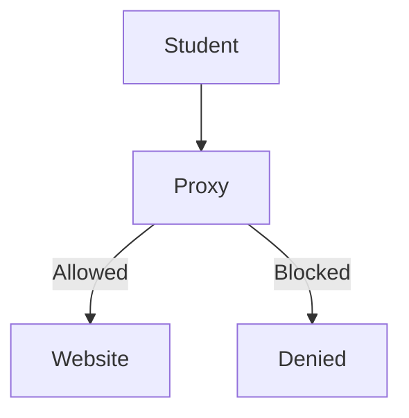
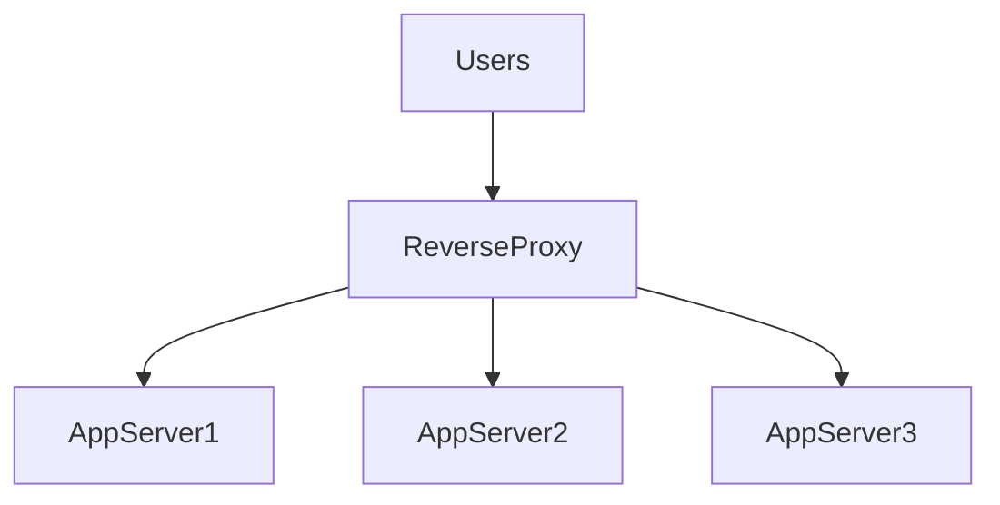
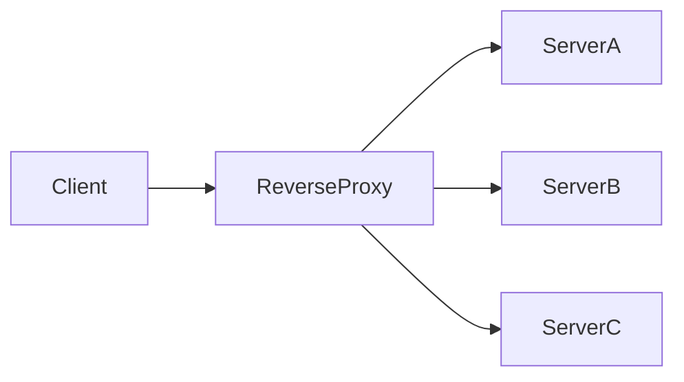
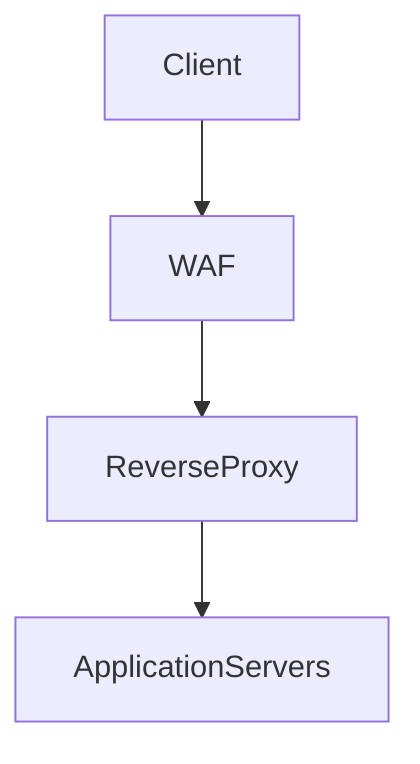
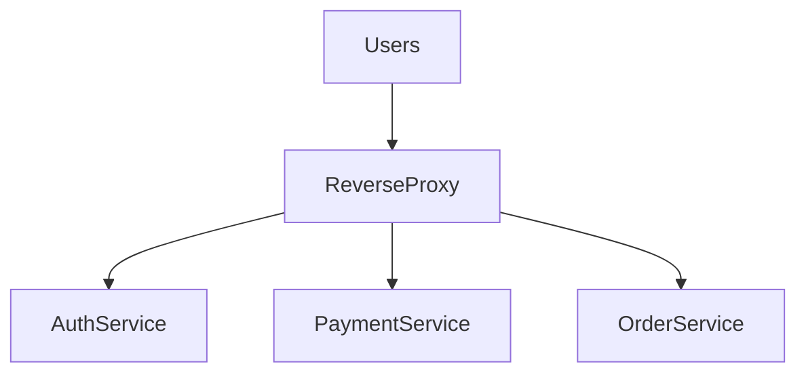
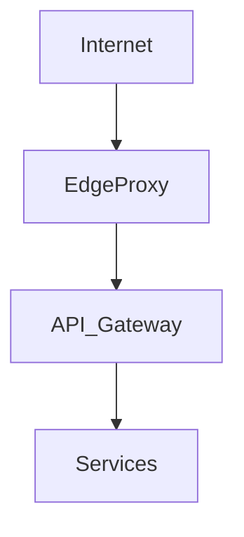
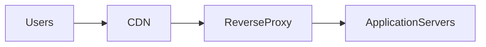

# Proxy and Reverse Proxy

## Introduction

Modern distributed systems rarely allow clients to communicate directly with backend servers.

Instead, an **intermediary layer** is introduced between clients and servers.

This intermediary is called a **Proxy**.

Proxies serve many purposes:

- security
- caching
- request filtering
- anonymity
- load balancing
- traffic control

There are two primary types of proxies:

1. **Forward Proxy**
2. **Reverse Proxy**

Understanding the difference between them is fundamental for **high level system design**.

---

# Real World Analogy

Imagine a **corporate office building**.

Visitors do not walk directly into internal offices.

Instead, they first interact with a **reception desk**.

The receptionist:

- verifies identity
- decides where the visitor should go
- blocks unauthorized access
- sometimes handles requests directly

A proxy acts similarly:

- it **sits between two parties**
- controls communication
- forwards requests when appropriate

---

# What is a Proxy?

A **proxy server** is an intermediary that forwards requests from clients to servers.

```

Client → Proxy → Server

```

The proxy hides the **client's identity from the server**.

---

# Forward Proxy

## Definition

A **Forward Proxy** sits **between the client and the internet**.

It represents the **client side**.

---

## Architecture

```mermaid
flowchart LR

Client --> ForwardProxy
ForwardProxy --> InternetServer
InternetServer --> ForwardProxy
ForwardProxy --> Client
````

---

## Request Flow

1. Client sends request to proxy
2. Proxy forwards request to destination server
3. Server responds to proxy
4. Proxy sends response back to client

---

## Key Property

The server sees the **proxy as the client**, not the real user.

---

# Example Scenario

A company wants to control employee internet access.

Employees must route internet traffic through a **corporate proxy**.

```mermaid
flowchart LR

Employee --> CorporateProxy
CorporateProxy --> Internet
```

The proxy can:

* block websites
* log activity
* enforce security policies

---

# Forward Proxy Features

| Feature        | Explanation                       |
| -------------- | --------------------------------- |
| anonymity      | hides client identity             |
| access control | blocks certain sites              |
| caching        | store frequently accessed content |
| monitoring     | track user activity               |

---

# Example: Content Filtering

A school network blocks social media websites.



If the student tries accessing restricted sites:

```
Access Denied
```

---

# What is a Reverse Proxy?

A **Reverse Proxy** sits **in front of servers**.

It represents the **server side**.

---

# Architecture

```mermaid
flowchart LR

Client --> ReverseProxy
ReverseProxy --> BackendServer1
ReverseProxy --> BackendServer2
ReverseProxy --> BackendServer3
````

Clients believe they are communicating directly with the server.

In reality, they are communicating with the **reverse proxy**.

---

# Key Property

The client **does not know which backend server handles the request**.

---

# Reverse Proxy Request Flow

```mermaid
sequenceDiagram

participant Client
participant ReverseProxy
participant Server

Client->>ReverseProxy: HTTP Request
ReverseProxy->>Server: Forward Request
Server-->>ReverseProxy: Response
ReverseProxy-->>Client: Response
```

---

# Why Reverse Proxies Are Used

Reverse proxies are extremely important in large-scale systems.

| Use Case        | Description                            |
| --------------- | -------------------------------------- |
| load balancing  | distribute traffic across servers      |
| caching         | store responses to reduce backend load |
| SSL termination | handle HTTPS encryption                |
| security        | hide internal servers                  |
| compression     | reduce bandwidth                       |

---

# Reverse Proxy vs Forward Proxy

| Feature          | Forward Proxy            | Reverse Proxy           |
| ---------------- | ------------------------ | ----------------------- |
| Represents       | client                   | server                  |
| Client awareness | client knows proxy       | client unaware          |
| Server awareness | server unaware of client | server unaware of proxy |
| Use cases        | anonymity, filtering     | load balancing, caching |

---

# Example System Architecture

Large scale applications place reverse proxies in front of microservices.



The proxy distributes traffic across servers.

---

# Load Balancing with Reverse Proxy

Reverse proxies often implement **load balancing algorithms**.

Example algorithms:

| Algorithm         | Explanation                       |
| ----------------- | --------------------------------- |
| Round Robin       | distribute requests sequentially  |
| Least Connections | send traffic to least busy server |
| IP Hash           | same user routed to same server   |

---

## Example Load Balancing Flow



Each incoming request is routed to an available server.

---

# Caching with Reverse Proxy

Reverse proxies can store frequently requested responses.

Example:

```
GET /images/logo.png
```

If cached:

```
Response served directly by proxy
```

No request reaches the backend server.

---

# Caching Architecture

```mermaid
flowchart TD

Client --> ReverseProxy

ReverseProxy -->|Cache Hit| Response
ReverseProxy -->|Cache Miss| BackendServer
BackendServer --> ReverseProxy
````

---

# SSL Termination

Handling HTTPS encryption is computationally expensive.

Instead of every backend server handling SSL:

A reverse proxy performs **SSL termination**.

---

## Architecture

```mermaid
flowchart LR

Client --> HTTPS
HTTPS --> ReverseProxy

ReverseProxy --> HTTP

ReverseProxy --> BackendServers
```

Steps:

1. Client sends HTTPS request
2. Proxy decrypts traffic
3. Proxy forwards plain HTTP to backend

This reduces CPU load on application servers.

---

# Security Benefits

Reverse proxies improve security in several ways.

| Security Feature  | Benefit                                  |
| ----------------- | ---------------------------------------- |
| hide backend IPs  | attackers cannot access servers directly |
| request filtering | block malicious requests                 |
| rate limiting     | prevent abuse                            |
| DDoS mitigation   | absorb traffic spikes                    |

---

# Web Application Firewall (WAF)

Many reverse proxies integrate **Web Application Firewalls**.

WAF detects:

* SQL injection
* cross-site scripting
* malicious bots

Example architecture:



---

# Reverse Proxy in Microservices

Microservice architectures rely heavily on reverse proxies.

Example:



The proxy routes traffic to the appropriate service.

---

# Edge Proxy vs Internal Proxy

Large systems often deploy multiple proxy layers.

| Type           | Location                  |
| -------------- | ------------------------- |
| Edge Proxy     | entry point from internet |
| Internal Proxy | between microservices     |

---

## Multi-layer Architecture



Each layer provides additional control.

---

# Popular Proxy Technologies

Many production systems rely on high-performance proxy servers.

Examples include:

* NGINX — high-performance reverse proxy and web server
* HAProxy — advanced load balancing proxy
* Envoy — modern proxy used in service meshes

These tools are widely used in cloud infrastructure.

---

# Reverse Proxy + CDN

Large platforms combine reverse proxies with **Content Delivery Networks**.

Example architecture:



CDN caches content near users, reducing latency.

---

# Real World Examples

Many large internet platforms rely heavily on reverse proxies.

Examples include infrastructure used by organizations like:

* Netflix streaming platform architecture
* Google global web services infrastructure
* Amazon large-scale cloud platforms

Reverse proxies allow these systems to handle **millions of requests per second**.

---

# Key Advantages

| Advantage   | Explanation             |
| ----------- | ----------------------- |
| scalability | distribute traffic      |
| reliability | isolate failures        |
| security    | hide backend systems    |
| performance | caching and compression |

---

# Summary

Proxy servers act as **intermediaries that manage network traffic**.

Two major types exist:

### Forward Proxy

Represents **clients** and hides their identity.

### Reverse Proxy

Represents **servers** and manages incoming traffic.

In high-level architecture design, reverse proxies are essential because they provide:

* load balancing
* security
* caching
* SSL termination
* traffic control

They serve as the **front door of modern distributed systems**, ensuring that backend services remain scalable, secure, and resilient.