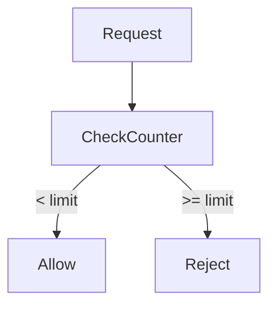
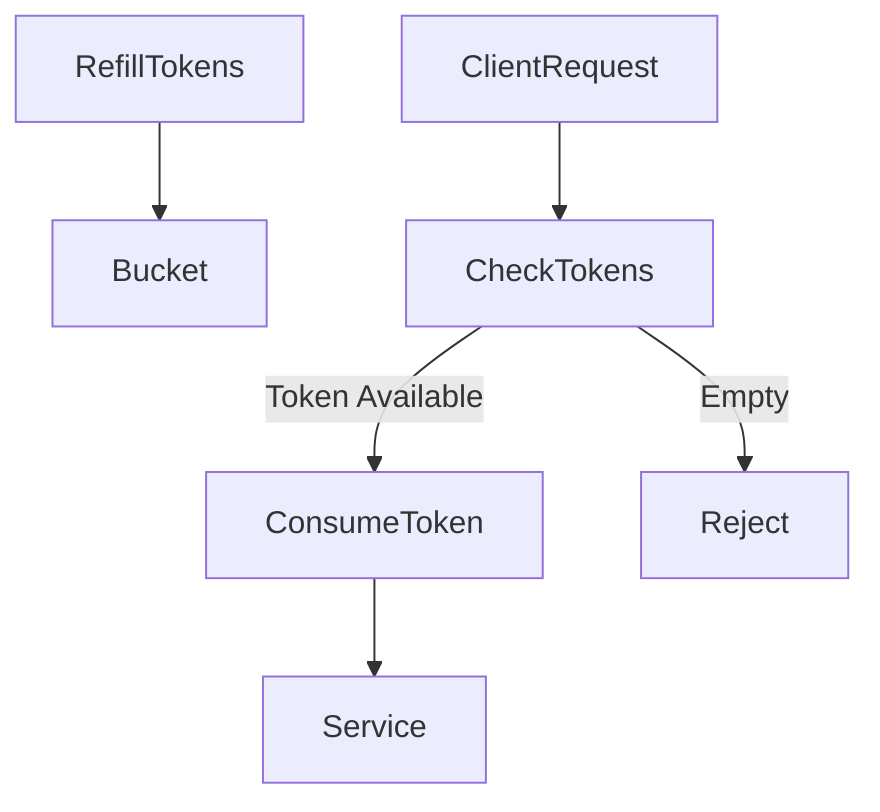
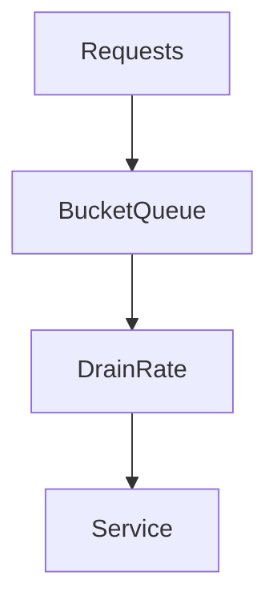
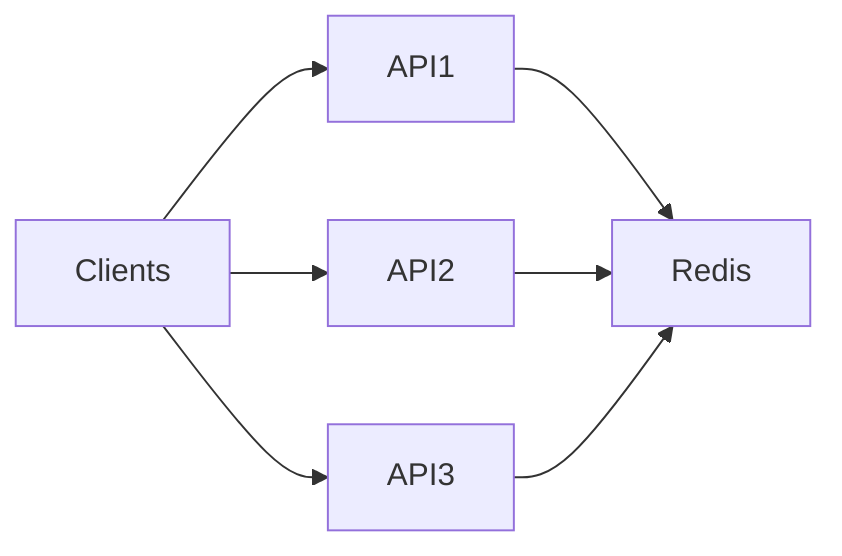
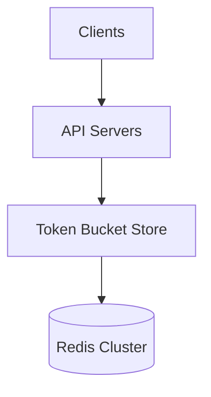
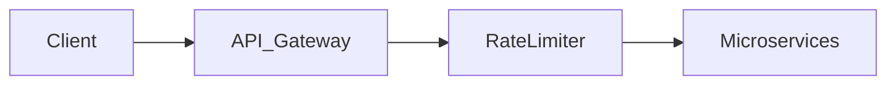
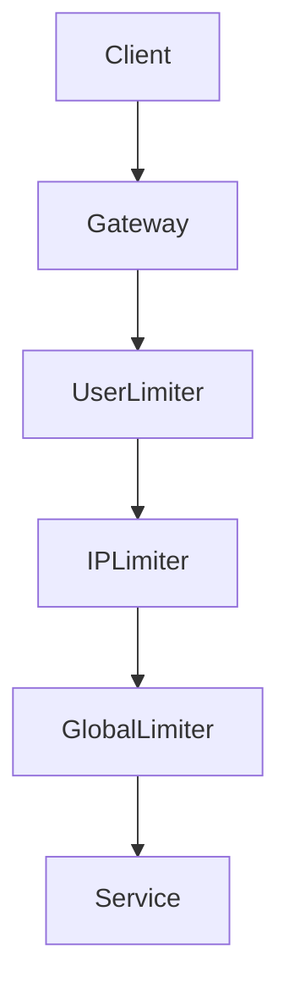

# Rate Limiter

## Introduction

Modern internet systems must handle **millions of requests per second** from users, applications, bots, and automated services.

Without control, this traffic can easily overwhelm servers.

For example:

- A malicious bot sends **100,000 requests per second**
- A misconfigured client repeatedly retries requests
- A viral application suddenly receives **millions of users**

If a system processes all these requests blindly, it can experience:

- CPU exhaustion
- Database overload
- service crashes
- cascading failures

To prevent this, distributed systems use **Rate Limiting**.

> A **Rate Limiter** controls how many requests a client can make within a specific time window.

It acts like a **traffic controller** that ensures no client consumes more resources than allowed.

---

# Real World Analogy

Imagine a **highway toll booth**.

Only a limited number of cars can pass through every minute.

If too many cars arrive simultaneously:

- traffic slows
- vehicles are delayed
- some may be turned away

This ensures the toll system does not collapse under pressure.

A **rate limiter performs the same role for APIs and services**.

---

# Why Rate Limiting is Important

Rate limiting protects systems from several problems.

| Problem | Explanation |
|--------|-------------|
| System overload | Too many requests exhaust resources |
| Abuse and bots | Prevents scraping or automated attacks |
| Fair usage | Ensures all users receive fair access |
| Cost control | Limits expensive operations |
| Stability | Prevents cascading failures |

Many modern APIs enforce strict rate limits.

Example:

```

100 requests per minute per user

```

If a client exceeds the limit, the system returns:

```

HTTP 429 Too Many Requests

````

---

# Where Rate Limiters Are Used

Rate limiting appears across multiple layers of modern architectures.

| Layer | Example |
|------|---------|
| API Gateway | Limit requests per user |
| Load Balancer | Protect backend services |
| Database | Limit query frequency |
| Authentication services | Prevent brute-force login attacks |
| Messaging systems | Control producer/consumer throughput |

---

# Basic Rate Limiting Flow

```mermaid
flowchart TD

Client --> RateLimiter

RateLimiter -->|Allowed| Service
RateLimiter -->|Rejected| Error429
````

Steps:

1. Client sends request
2. Rate limiter checks quota
3. If within limit → request proceeds
4. If exceeded → request rejected

---

# Key Concepts

## 1. Rate Limit

The maximum number of allowed requests.

Example:

```
100 requests per minute
```

---

## 2. Time Window

The duration during which requests are counted.

Examples:

* per second
* per minute
* per hour

---

## 3. Identity

Rate limits must apply to a **specific entity**.

Common identifiers include:

| Identifier | Example     |
| ---------- | ----------- |
| User ID    | user123     |
| API key    | api_abc     |
| IP address | 192.168.1.1 |
| Token      | OAuth token |

---

# Types of Rate Limiting Policies

Different policies apply limits differently.

| Policy            | Description            |
| ----------------- | ---------------------- |
| User-based        | Limit per user         |
| IP-based          | Limit per IP           |
| API key based     | Limit per API consumer |
| Global rate limit | Entire system limit    |

Example:

```
100 requests/minute per user
1000 requests/minute globally
```

---

# Rate Limiting Algorithms

Several algorithms exist to implement rate limiting.

---

# 1. Fixed Window Counter

This is the **simplest rate limiting algorithm**.

### Idea

Divide time into fixed windows.

Example:

```
100 requests per minute
```

Requests are counted within each minute.

---

### Example Timeline

| Time        | Requests       | Allowed |
| ----------- | -------------- | ------- |
| 10:00–10:01 | 100            | yes     |
| 10:01–10:02 | counter resets | yes     |

---

### Flow



---

### Problem

Fixed windows cause **burst traffic at window boundaries**.

Example:

```
100 requests at 10:00:59
100 requests at 10:01:00
```

Total:

```
200 requests in 2 seconds
```

This can overload systems.

---

# 2. Sliding Window Log

Instead of fixed windows, this method stores **timestamps of requests**.

When a new request arrives:

1. Remove timestamps older than the time window
2. Count remaining requests
3. Compare with limit

---

### Example

```
Limit: 5 requests per 10 seconds
```

Stored timestamps:

```
[1s, 3s, 4s, 8s, 9s]
```

If a request arrives at **10 seconds**:

```
1s is removed
Remaining = 4 requests
```

Request is allowed.

---

### Pros

| Advantage | Explanation         |
| --------- | ------------------- |
| Accurate  | No burst problems   |
| Fair      | True rolling window |

---

### Cons

Requires storing many timestamps.

Memory usage grows with traffic.

---

# 3. Sliding Window Counter

An optimized version of sliding window.

Instead of storing timestamps, it tracks:

* current window count
* previous window count

The algorithm calculates a **weighted count**.

---

### Example

If a window is 60 seconds:

```
previous window = 50 requests
current window = 20 requests
```

Weighted calculation determines if request should be allowed.

---

### Advantage

More memory efficient than sliding logs.

---

# 4. Token Bucket Algorithm

The **token bucket** algorithm is widely used in networking.

---

## Concept

A bucket contains **tokens**.

Each request consumes **one token**.

Tokens refill over time.

---

### Example

```
Bucket size = 10
Refill rate = 1 token/sec
```

---

### Flow



---

### Behavior

| Scenario               | Result                         |
| ---------------------- | ------------------------------ |
| burst traffic          | allowed until tokens exhausted |
| sustained high traffic | throttled                      |

Token bucket allows **controlled bursts**.

---

# 5. Leaky Bucket Algorithm

Leaky bucket works like a **water tank with a small hole**.

Water enters at any rate but exits at a constant rate.

---

### Concept

Requests are queued and processed at a fixed rate.

---

### Flow



---

### Behavior

| Feature        | Explanation          |
| -------------- | -------------------- |
| Smooth traffic | output rate constant |
| Queue overflow | requests dropped     |

---

# Algorithm Comparison

| Algorithm       | Burst Support | Accuracy | Memory |
| --------------- | ------------- | -------- | ------ |
| Fixed Window    | Poor          | Low      | Low    |
| Sliding Log     | Excellent     | High     | High   |
| Sliding Counter | Good          | Medium   | Medium |
| Token Bucket    | Excellent     | High     | Low    |
| Leaky Bucket    | Smooth output | Medium   | Low    |

---

# Distributed Rate Limiting

In large systems, services run across **multiple servers**.

Example:

```
10 API servers
```

If each server maintains its own rate counter:

```
Limit bypass occurs
```

Example:

```
100 requests/server × 10 servers = 1000 requests
```

Instead of:

```
100 requests total
```

---

# Distributed Architecture

Rate limit counters must be **shared across servers**.



Shared storage maintains a global counter.

---

# Using Redis for Rate Limiting

A common distributed solution uses **Redis**.

Why Redis?

| Feature           | Benefit               |
| ----------------- | --------------------- |
| In-memory         | extremely fast        |
| atomic operations | safe counters         |
| distributed       | shared across servers |

---

### Example Redis Counter

```
INCR user123:rate
EXPIRE user123:rate 60
```

Meaning:

```
increment request count
expire after 60 seconds
```

---

# Distributed Token Bucket



All servers share token state.

---

# Rate Limiting in API Gateways

API gateways frequently enforce rate limits.

Typical architecture:



Advantages:

* centralized control
* protects backend services
* simplifies implementation

---

# Multi-Level Rate Limiting

Large systems implement **multiple rate limits simultaneously**.

Example:

| Limit    | Value          |
| -------- | -------------- |
| Per user | 100 req/min    |
| Per IP   | 200 req/min    |
| Global   | 10,000 req/min |

---

### Architecture



---

# Handling Rate Limit Violations

When clients exceed limits:

Return HTTP status:

```
429 Too Many Requests
```

Often include headers:

```
X-RateLimit-Limit
X-RateLimit-Remaining
X-RateLimit-Reset
```

These inform clients when they can retry.

---

# Rate Limiting vs Throttling

These concepts are related but slightly different.

| Feature  | Rate Limiting         | Throttling              |
| -------- | --------------------- | ----------------------- |
| Goal     | reject extra requests | slow request processing |
| Behavior | immediate rejection   | delay requests          |
| Example  | API limit             | bandwidth control       |

---

# Real World Systems Using Rate Limiters

Rate limiting is widely used across internet platforms.

Examples include systems operated by organizations such as:

* Stripe APIs limiting payment requests
* GitHub APIs limiting developer queries
* Cloudflare protecting websites from bot traffic

These platforms rely heavily on distributed rate limiting to protect infrastructure.

---

# Common Challenges

Rate limiting is simple conceptually but challenging at scale.

| Challenge            | Explanation                    |
| -------------------- | ------------------------------ |
| Distributed counters | synchronization across servers |
| clock skew           | inaccurate time windows        |
| hot keys             | high traffic for single users  |
| performance          | limiter must be extremely fast |

---

# Best Practices

| Practice                       | Why                          |
| ------------------------------ | ---------------------------- |
| Use token bucket               | supports bursts              |
| Implement distributed counters | consistent limits            |
| add jitter for retries         | prevent synchronized retries |
| monitor rate-limit metrics     | detect abuse                 |
| apply multi-level limits       | protect system globally      |

---

# Summary

Rate limiting is a **fundamental protection mechanism** in modern distributed systems.

It ensures that:

* systems remain stable
* users receive fair access
* infrastructure is protected from abuse

Core ideas include:

* controlling request frequency
* enforcing quotas
* implementing efficient algorithms
* scaling limits across distributed systems

When implemented correctly, a rate limiter acts as a **safety valve** that protects systems from overload while maintaining reliable service for legitimate users.