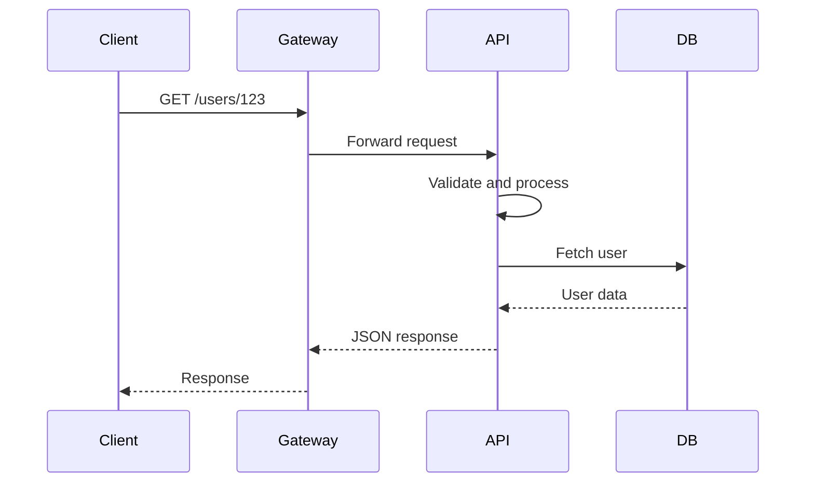

# REST Architecture and Roy Fielding’s 6 Constraints

Before REST became the default style for many web APIs, the web had a serious problem.

It was growing fast, but its architecture needed a way to scale cleanly.

The answer was not a single new technology.  
It was a **set of architectural constraints** that shaped how systems should communicate.

These constraints became known as **REST**.

REST stands for:

```text id="1p3k8a"
Representational State Transfer
````

It is not a library, framework, or protocol.
It is an **architectural style**.

That means REST is a set of rules and design principles for building web systems that are:

* scalable
* simple
* reliable
* maintainable
* easy to evolve

---

# 1. Introduction: The Web's Original Scalability Crisis

In the early days of the World Wide Web, the idea was simple:

* share documents
* link pages together
* make information accessible globally

But success brought scale.

As more users and more services joined the web, the system needed to support:

* many clients at once
* many servers at once
* changing traffic
* reliable responses
* independent growth

This is where Roy Fielding’s work became important.

He helped formalize the architectural constraints that made the web scalable.

### Why this matters

REST is not just an academic idea.
It explains why modern web APIs are designed the way they are.

If you understand REST well, you understand the **logic behind HTTP APIs**.

---

# 2. What REST Really Is

REST is an architectural style based on six constraints.

These constraints act like the rules of a city:

* roads must connect properly
* traffic must flow predictably
* different zones should not interfere too much
* changes should not break the entire city

REST does something similar for web systems.

---

# 3. The Six Foundational Constraints of REST

| Constraint        | Main Purpose                     |
| ----------------- | -------------------------------- |
| Client-Server     | Separate UI from backend logic   |
| Stateless         | Each request is independent      |
| Cacheable         | Allow responses to be reused     |
| Uniform Interface | Standardize communication        |
| Layered System    | Support tiers and intermediaries |
| Code on Demand    | Optional server-sent code        |

Now let us go through each one in detail.

---

# 4. Client-Server: The Great Separation

The first REST constraint is **client-server separation**.

This means the system is split into two sides:

| Side   | Responsibility                      |
| ------ | ----------------------------------- |
| Client | User interface and user interaction |
| Server | Data, business logic, processing    |

## Client

The client is what the user sees and interacts with:

* browser
* mobile app
* desktop app
* frontend dashboard

Its job is to:

* display data
* collect input
* send requests
* render responses

## Server

The server handles:

* business rules
* database operations
* authentication
* data processing
* response generation

---

## Why this separation matters

When client and server are separate, they can evolve independently.

| Benefit                 | Explanation                                             |
| ----------------------- | ------------------------------------------------------- |
| Independent development | Frontend and backend teams can work separately          |
| Easier maintenance      | Changes in UI do not always affect backend              |
| Better scaling          | Each layer can grow in its own way                      |
| Flexible clients        | Same backend can support web, mobile, and other clients |

### Analogy

Think of a restaurant.

| Role           | Real-world equivalent      |
| -------------- | -------------------------- |
| Client         | Customer at the table      |
| Server backend | Kitchen                    |
| Waiter         | API interface between them |

The customer does not need to know how food is cooked.
They only need the menu, the order process, and the final dish.

That is client-server separation.

---

# 5. Stateless: Every Request Is a New Beginning

REST requires **stateless communication**.

This means the server does **not** remember previous client requests.

Every request must contain everything needed to understand it.

## What stateless means

A request should be self-contained.

It should include:

* who the user is
* what they want
* any necessary parameters
* any required token or credentials

The server should not depend on memory from earlier requests.

---

## Example

Request 1:

```json
{
  "userId": "123",
  "page": 1
}
```

Request 2:

```json
{
  "userId": "123",
  "page": 2
}
```

Each request contains enough information to stand on its own.

---

## Why statelessness matters

| Benefit            | Why it helps                              |
| ------------------ | ----------------------------------------- |
| Easy scaling       | Any server can handle any request         |
| Load balancing     | Requests can go to different machines     |
| Better reliability | No need to depend on one server’s memory  |
| Easier recovery    | If one server fails, another can continue |

### Analogy

A stateless server is like a cashier who reads the full order every time.

They do not rely on remembering the last customer’s order.
Each receipt contains all the necessary information.

---

## Stateless vs stateful

| Feature                             | Stateless | Stateful                |
| ----------------------------------- | --------- | ----------------------- |
| Server remembers previous requests? | No        | Yes                     |
| Scalability                         | High      | More difficult          |
| Load balancing                      | Easy      | Harder                  |
| Example                             | REST APIs | Session-based workflows |

---

# 6. Cacheable: Remembering Responses to Go Faster

The cacheable constraint says responses should clearly indicate whether they can be stored and reused.

This allows clients, proxies, and browsers to avoid repeating expensive requests.

---

## What caching does

If a response is cacheable, the client can save it locally and reuse it later.

### Example

A request for public product data may not need to hit the server every time.

```text id="a9r7lm"
/products/42
```

If the response does not change often, it can be cached.

---

## Why caching matters

| Benefit                   | Explanation                     |
| ------------------------- | ------------------------------- |
| Less server load          | Fewer repeated requests         |
| Faster responses          | Cached data is returned quickly |
| Better network efficiency | Less traffic over the wire      |
| Improved user experience  | Pages feel faster               |

### Analogy

Caching is like keeping a frequently used book on your desk instead of walking to the library every time.

---

## Cacheable vs non-cacheable

| Type                   | Example         | Cached?    |
| ---------------------- | --------------- | ---------- |
| Public product list    | `/products`     | Often yes  |
| User-specific profile  | `/me`           | Usually no |
| Sensitive account data | `/bank-account` | No         |

Some data is safe to cache.
Some data must always be fresh.

---

# 7. Uniform Interface: Speaking the Same Language

The uniform interface constraint is one of the most important ideas in REST.

It means all clients and servers should communicate through a **consistent, predictable interface**.

This reduces complexity and makes APIs easier to understand.

---

## The four sub-constraints of uniform interface

| Sub-constraint                               | Meaning                                           |
| -------------------------------------------- | ------------------------------------------------- |
| Resource identification                      | Every resource has a unique URI                   |
| Resource manipulation through representation | Clients modify resources using representations    |
| Self-descriptive messages                    | Requests and responses explain themselves         |
| HATEOAS                                      | Responses include links for next possible actions |

Let us break these down.

---

## 7.1 Resource Identification

Every resource should have a unique identifier.

Usually this is a URI.

### Examples

| Resource       | URI                |
| -------------- | ------------------ |
| User 123       | `/users/123`       |
| Book 10        | `/books/10`        |
| Organization 7 | `/organizations/7` |

This tells the client exactly where a resource lives.

### Analogy

A URI is like a street address.

Without an address, nobody knows where the house is.

---

## 7.2 Resource Manipulation Through Representation

The client works with a **representation** of a resource, not the internal resource itself.

Usually this representation is JSON.

### Example

```json
{
  "id": "123",
  "name": "Asha",
  "role": "admin"
}
```

This JSON is a representation of the user resource.

The client can use it to update or delete the resource without knowing the server’s internal implementation.

### Why this matters

The client does not need to know:

* how the database is structured
* how the object is stored
* what language the backend uses
* what internal services are involved

It only needs the representation.

---

## 7.3 Self-Descriptive Messages

Each request or response should contain enough information for the receiver to understand it.

### Example

```http id="n6v9mz"
Content-Type: application/json
```

This tells the client:

* the data is JSON
* how to parse the response

### Why this matters

Without metadata, the client would not know how to interpret the message.

### Analogy

A package is easier to handle if the box says:

* fragile
* this side up
* handle with care

Self-descriptive messages work the same way.

---

## 7.4 HATEOAS: Hypermedia as the Engine of Application State

HATEOAS is the idea that responses should include links to possible next actions.

This means the client does not have to hardcode every possible path.

### Example response

```json
{
  "id": "123",
  "name": "Asha",
  "links": {
    "update": "/users/123",
    "delete": "/users/123",
    "orders": "/users/123/orders"
  }
}
```

The client can discover what it can do next by reading the response.

---

## Why HATEOAS is useful

| Benefit            | Explanation                                   |
| ------------------ | --------------------------------------------- |
| Flexibility        | API can evolve more easily                    |
| Discoverability    | Clients can navigate dynamically              |
| Lower coupling     | Fewer hardcoded paths                         |
| Better abstraction | Clients depend less on internal API structure |

### Analogy

HATEOAS is like a museum map that shows:

* where you are
* where you can go next
* what rooms are available

You do not need to memorize the whole building.

---

# 8. Layered System: Building with Tiers

A REST system can be built as layers.

Each layer only interacts with the layer immediately below it.

This helps add structure to the system.

---

## Common layers

| Layer           | Example               |
| --------------- | --------------------- |
| Client          | Browser or mobile app |
| Proxy / gateway | API gateway           |
| Load balancer   | Distributes traffic   |
| Backend service | Business logic        |
| Database        | Persistent storage    |

The client may not know whether it is talking directly to the server or through multiple intermediaries.

---

## Why layers matter

| Benefit         | Explanation                                   |
| --------------- | --------------------------------------------- |
| Security        | Add authentication or filtering layers        |
| Scalability     | Add load balancers or caches                  |
| Maintainability | Change one layer without rewriting everything |
| Flexibility     | Insert proxies or gateways as needed          |

### Analogy

A layered system is like shipping a package through multiple stations:

* courier
* sorting center
* customs
* local delivery
* final recipient

You do not need to know every step to make the package arrive.

---

# 9. Code on Demand: An Optional Power-Up

This is the only optional REST constraint.

It allows the server to send executable code to the client.

Most commonly this means JavaScript in browser environments.

---

## What it means

The server can temporarily extend the client’s behavior by sending code that the client runs.

### Example use case

A web app may send a small script to:

* improve interactivity
* add dynamic behavior
* customize a widget
* enhance client-side features

---

## Why this is optional

Not all REST systems use it.

In many APIs, the server only sends data, not code.

| System type           | Uses code on demand? |
| --------------------- | -------------------- |
| Traditional REST API  | Usually no           |
| Browser app           | Sometimes yes        |
| Dynamic widget system | Often yes            |

### Analogy

Code on demand is like asking a contractor to bring a special tool to complete a one-time job.

It is useful, but not always needed.

---

# 10. REST Flow in Practice

Here is a typical REST API interaction.



---

# 11. When in Doubt, Use POST for Custom Actions

Not every API action is a simple CRUD operation.

CRUD means:

* Create
* Read
* Update
* Delete

But many backend operations do not fit neatly into these categories.

Examples:

* archive an organization
* send a welcome email
* approve a workflow
* rotate an API key
* publish a draft
* suspend an account

These are **custom actions**.

---

## Why POST is the right choice

POST is flexible and open-ended.

It is the best HTTP method for non-CRUD operations when the action cannot be represented as a simple resource update.

### Example

```http id="f3n6xv"
POST /organizations/42/archive
```

This clearly says:

* the target resource is organization `42`
* the action is `archive`

### Why this is better than forcing PATCH or PUT

| Method | Best for                         | Why                     |
| ------ | -------------------------------- | ----------------------- |
| GET    | Read-only retrieval              | Should not change state |
| POST   | Custom or non-idempotent actions | Flexible and open-ended |
| PUT    | Replace a full resource          | Strong semantic meaning |
| PATCH  | Partial update                   | Best for field edits    |
| DELETE | Remove a resource                | Clear intent            |

If the operation is not a normal field update, use POST.

---

## More examples of custom POST actions

```http id="m9b2ux"
POST /users/123/reset-password
POST /orders/9001/cancel
POST /projects/88/publish
POST /teams/5/invite
```

These express intent clearly.

---

# 12. The Best APIs Start with UI Designs, Not Database Schemas

A strong API should be designed from the user experience outward, not from the database inward.

This is a very important principle.

---

## Why UI-first design is better

UI designs show:

* what users see
* what actions they take
* what data they need
* what shape the response should have

If you start with the database, you may build an API that is technically clean but awkward for users.

If you start with the UI, you create an API that matches real usage.

---

## Example workflow

| Step | What to look at        |
| ---- | ---------------------- |
| 1    | UI wireframes in Figma |
| 2    | User interactions      |
| 3    | Required data fields   |
| 4    | Needed actions         |
| 5    | API endpoints          |
| 6    | Database mapping       |

### Analogy

Designing from UI first is like planning a house from the rooms people will actually live in.

You begin with:

* kitchen
* bedroom
* bathroom
* hallway

Then you plan the plumbing and wiring behind the walls.

That produces a better house than starting with pipes first.

---

## Why this matters for backend engineers

When you look at UI mockups, you understand:

* what the frontend needs
* what the user is trying to do
* what data should be returned
* what operations should exist

That helps you design APIs that are practical and consumer-friendly.

---

# 13. REST and Resource Thinking

REST encourages you to think in terms of **resources**.

A resource is something meaningful in your system:

* user
* post
* order
* comment
* organization
* invoice

Each resource should have:

* a clear name
* a stable URI
* predictable actions

### Examples

| Resource     | Endpoint              |
| ------------ | --------------------- |
| User         | `/users`              |
| Single user  | `/users/{id}`         |
| Organization | `/organizations/{id}` |
| User posts   | `/users/{id}/posts`   |

---

# 14. Good REST Design Principles

| Principle                    | Good practice                       |
| ---------------------------- | ----------------------------------- |
| Use nouns for resources      | `/users`, `/orders`, `/books`       |
| Use HTTP methods correctly   | GET, POST, PUT, PATCH, DELETE       |
| Keep URLs predictable        | Avoid confusing path structures     |
| Return useful status codes   | 200, 201, 400, 401, 403, 404        |
| Keep responses consistent    | Same shape across endpoints         |
| Avoid unnecessary complexity | Simpler APIs are easier to maintain |

---

# 15. Common Beginner Mistakes

| Mistake                            | Why it is bad                          |
| ---------------------------------- | -------------------------------------- |
| Using verbs in URLs unnecessarily  | Makes endpoints less resource-oriented |
| Misusing GET for state changes     | Breaks HTTP semantics                  |
| Using PATCH for custom actions     | Blurs meaning                          |
| Ignoring caching                   | Misses performance benefits            |
| Building stateful REST APIs        | Hurts scalability                      |
| Hardcoding client paths everywhere | Makes APIs harder to evolve            |
| Designing from the database first  | Often produces awkward APIs            |

---

# 16. Practical REST Example in JavaScript

```javascript
app.get("/users/:id", async (req, res) => {
  const user = await userService.getUserById(req.params.id);

  if (!user) {
    return res.status(404).json({
      message: "User not found",
    });
  }

  return res.status(200).json({
    data: {
      id: user.id,
      name: user.name,
      email: user.email,
      links: {
        update: `/users/${user.id}`,
        delete: `/users/${user.id}`,
      },
    },
  });
});
```

This example demonstrates:

* a clear resource URI
* a standard GET request
* a JSON representation
* hypermedia-style links
* proper HTTP status usage

---

# 17. Summary of the Six Constraints

| Constraint        | What it solves                    |
| ----------------- | --------------------------------- |
| Client-Server     | Separation of UI and backend      |
| Stateless         | Scalability and reliability       |
| Cacheable         | Performance and efficiency        |
| Uniform Interface | Consistency and simplicity        |
| Layered System    | Security and modularity           |
| Code on Demand    | Optional dynamic client extension |

---

# 18. Final Takeaways

REST is not just a naming style for endpoints.
It is a way of designing web systems so they scale gracefully.

Its six constraints give structure to the web:

* separate client and server
* make requests stateless
* enable caching
* use a uniform interface
* support layered architectures
* optionally send code when needed

And when a request does not fit normal CRUD semantics, **POST is usually the right choice** for custom actions.

Finally, the best APIs are often designed by starting with the **UI**, because the UI reveals how people actually use the system.

That is what makes REST such a powerful foundation for modern backend architecture.
