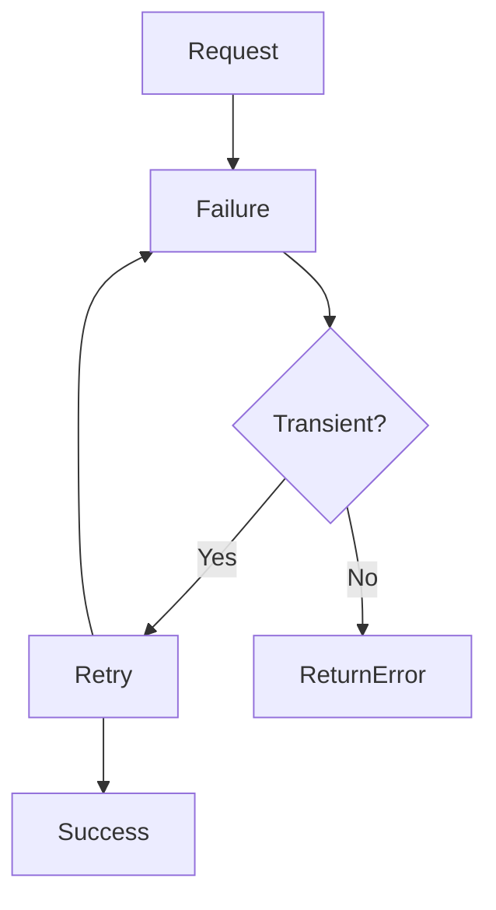
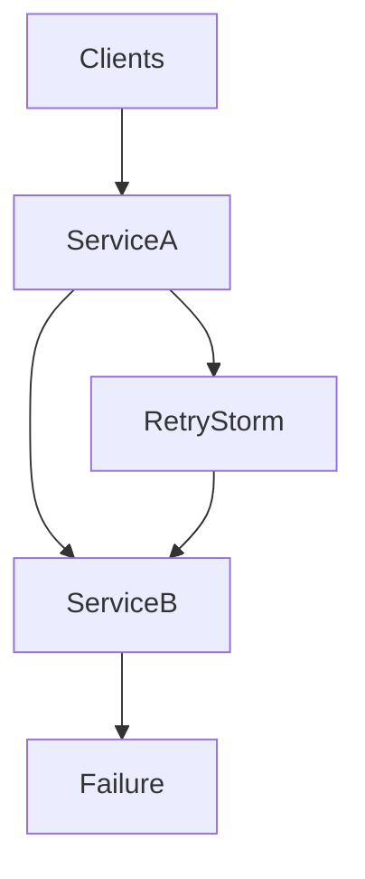
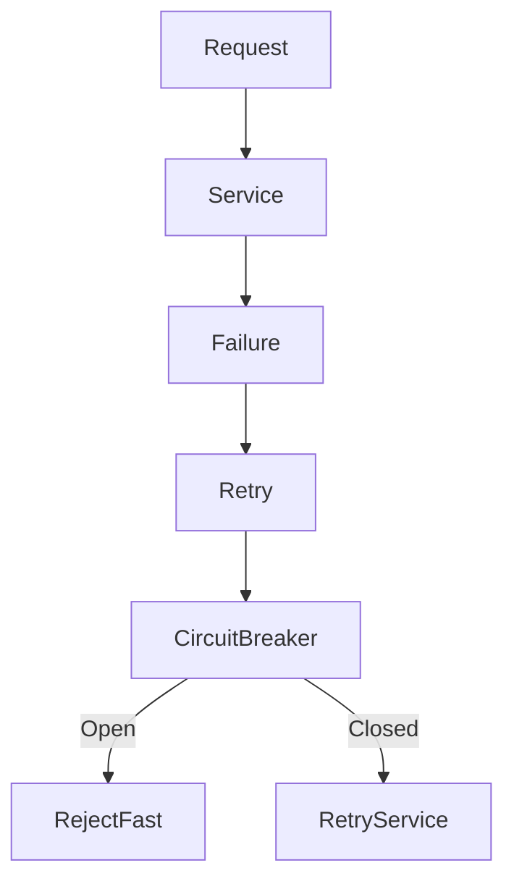
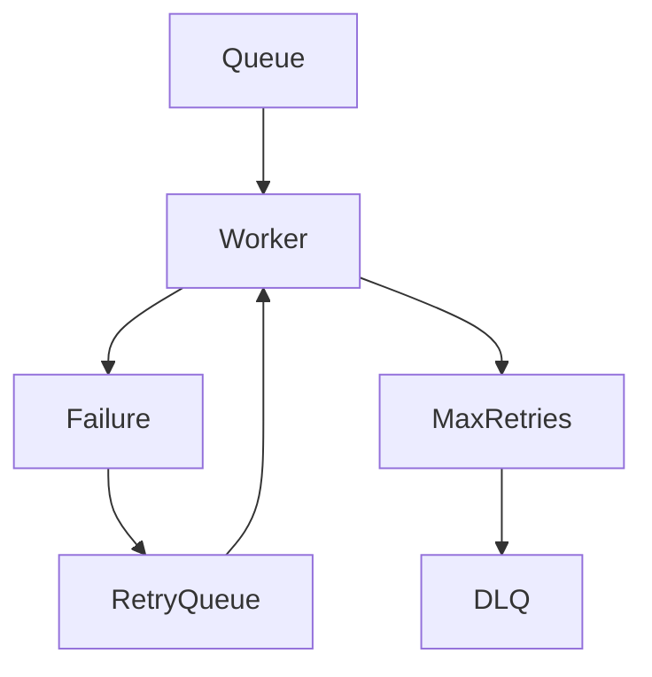

# Retry Pattern

## Introduction: The “Call Again Later” Problem

Imagine calling a customer support center.

You call once, but the line is busy.

What do most people do?

They **try again after some time**.

If it still fails, they **retry again later**.

Eventually:

- The call goes through
- The service becomes available
- The problem resolves itself

This simple human behavior represents a powerful engineering principle in distributed systems called the **Retry Pattern**.

In modern distributed systems:

- Networks fail
- Services temporarily crash
- Databases get overloaded
- Connections time out

However, many of these failures are **temporary (transient)** rather than permanent.

Instead of immediately failing the request, systems can **retry the operation** after a delay.

This greatly increases system reliability.

---

# What is the Retry Pattern?

The **Retry Pattern** is a fault-tolerance mechanism where a system **automatically retries a failed operation after a delay**, assuming the failure might be temporary.

Instead of:

```

Request → Failure → Return Error

```

We do:

```

Request → Failure → Retry → Retry → Success

````

The goal is to **increase the probability of success when failures are temporary**.

---

# Core Idea

Many failures in distributed systems are **transient**.

Examples:

| Failure Type | Cause | Duration |
|---|---|---|
| Network timeout | Temporary packet loss | milliseconds |
| Service overload | CPU spike | seconds |
| Database connection limit | Too many clients | seconds |
| Container restart | Rolling deployment | seconds |
| DNS resolution delay | Cache miss | milliseconds |

If we retry the request **after a short delay**, the system may have recovered.

---

# Basic Retry Flow

```mermaid
sequenceDiagram
participant Client
participant Service

Client->>Service: Request

Service-->>Client: Failure

Client->>Service: Retry #1
Service-->>Client: Failure

Client->>Service: Retry #2
Service-->>Client: Success
````

The request eventually succeeds.

---

# Why Retries Are Important in Distributed Systems

Modern architectures rely on **many microservices communicating over networks**.

A single user request might involve:

```
API Gateway
 → Auth Service
 → User Service
 → Payment Service
 → Inventory Service
 → Database
```

Each network hop introduces potential failure.

Without retries:

```
Temporary glitch → user request fails
```

With retries:

```
Temporary glitch → retry → success
```

Retries significantly **increase system resilience**.

---

# Types of Failures

Understanding failure types is critical before implementing retries.

---

# 1. Transient Failures

Temporary failures that **resolve automatically**.

Examples:

* Temporary network hiccup
* Service restarting
* Short-term CPU spike
* Temporary database lock

Retries work **very well** for these failures.

---

# 2. Persistent Failures

Failures that **will not resolve quickly**.

Examples:

* Database crashed
* Misconfigured service
* Invalid request data
* Missing resource

Retries **do not help** here.

In fact, retries can make things worse.

---

# Retry Decision Logic



---

# Where Retry Pattern is Used

Retry mechanisms appear across almost every distributed system component.

| Component      | Example                   |
| -------------- | ------------------------- |
| HTTP clients   | Retry failed API calls    |
| Message queues | Retry message processing  |
| Databases      | Retry failed transactions |
| Service meshes | Automatic request retry   |
| SDK libraries  | AWS/GCP API retries       |

---

# Retry Strategies

Not all retries are equal.

Poor retry strategies can **crash entire systems**.

---

# 1. Immediate Retry

The simplest approach:

```
Retry instantly after failure
```

### Example

```javascript
async function fetchData() {
  try {
    return await apiCall();
  } catch (e) {
    return await apiCall(); // immediate retry
  }
}
```

---

### Problem

If a service is overloaded:

```
Retry instantly → increases load → system collapses
```

Immediate retries often cause **retry storms**.

---

# 2. Fixed Delay Retry

Retry after a constant delay.

Example:

```
Retry every 2 seconds
```

### Example

```javascript
async function retryWithDelay(fn, retries, delay) {
  for (let i = 0; i < retries; i++) {
    try {
      return await fn();
    } catch (err) {
      await new Promise(r => setTimeout(r, delay));
    }
  }
  throw new Error("All retries failed");
}
```

---

### Problem

If thousands of clients retry with the same delay:

```
Retry synchronization
```

All requests retry **at the same time**.

This recreates the **thundering herd effect**.

---

# 3. Exponential Backoff

This is the **industry standard retry strategy**.

Each retry waits **progressively longer**.

Example:

```
Retry 1 → 1 second
Retry 2 → 2 seconds
Retry 3 → 4 seconds
Retry 4 → 8 seconds
Retry 5 → 16 seconds
```

---

### Formula

```
delay = base * 2^retry_attempt
```

---

### Example Implementation

```javascript
async function retryWithBackoff(fn, retries) {
  for (let i = 0; i < retries; i++) {
    try {
      return await fn();
    } catch (e) {
      const delay = Math.pow(2, i) * 1000;
      await new Promise(r => setTimeout(r, delay));
    }
  }
}
```

---

### Benefits

| Benefit               | Explanation         |
| --------------------- | ------------------- |
| Reduces pressure      | Slows retry rate    |
| Allows recovery       | Gives systems time  |
| Prevents retry storms | Requests spread out |

---

# Adding Jitter (Critical Improvement)

Even exponential backoff can cause **synchronized retries**.

Solution: **Jitter**.

Add randomness to delay.

---

### Example

```
Retry 1 → 1.2 sec
Retry 2 → 2.7 sec
Retry 3 → 4.1 sec
Retry 4 → 8.6 sec
```

---

### Implementation

```javascript
function getDelay(base, attempt) {
  const exponential = base * Math.pow(2, attempt);
  const jitter = Math.random() * 1000;
  return exponential + jitter;
}
```

---

### Why Jitter Works

It spreads retries across time.


This prevents synchronized request spikes.

---

# Retry Limits

Retries must always have **maximum limits**.

Example:

```
Retry 5 times maximum
```

Without limits:

```
Infinite retries → resource exhaustion
```

---

### Retry Policy Example

| Parameter     | Value               |
| ------------- | ------------------- |
| Max retries   | 5                   |
| Initial delay | 1s                  |
| Strategy      | Exponential backoff |
| Jitter        | Enabled             |

---

# Idempotency: Critical Requirement for Retries

Retries can cause **duplicate operations**.

Example:

User submits payment request.

```
Payment request sent
Network failure
Client retries
```

Now the server may receive **two payment requests**.

---

# Example Problem

```
Charge credit card twice
```

This is catastrophic.

---

# Solution: Idempotent Operations

An operation is **idempotent** if repeating it produces the same result.

Example:

```
PUT /users/123
```

Updating a resource repeatedly produces the same state.

---

### Idempotency Keys

Payment APIs often use:

```
Idempotency-Key: abc123
```

If server receives duplicate requests:

```
Same key → ignore duplicate
```

---

# Retry Storms

Retries themselves can cause system collapse.

---

## Scenario

Service A depends on Service B.

Service B fails.

Service A retries aggressively.

Thousands of clients retry simultaneously.

---



Now Service B gets **10x traffic**.

The system becomes completely overloaded.

---

# Retry + Circuit Breaker

Retries should be combined with **Circuit Breaker Pattern**.

---

### Combined Flow



If a service is failing consistently:

```
Circuit opens → stop retries
```

This protects the system.

---

# Retry in Message Queues

Retries are heavily used in **asynchronous systems**.

Example:

Worker processing a message fails.

---


---

### Retry Queue

Messages that fail are moved to a **retry queue**.

Retry after delay.

If still failing:

```
Dead Letter Queue
```

---

# Dead Letter Queue (DLQ)

When retries exceed limits:

```
Message → DLQ
```

DLQ stores problematic messages.

Engineers inspect them later.

---



---

# Retry in Service Mesh

Modern infrastructure platforms handle retries automatically.

Examples:

* Envoy
* Istio
* Linkerd

These systems implement:

* automatic retries
* backoff
* circuit breakers

---

### Service Mesh Architecture


The **sidecar proxy** performs retries automatically.

Application code remains simple.

---

# Real World Examples

---

# Amazon

Amazon APIs implement:

```
Exponential backoff + jitter
```

for all client retries.

This prevents **large scale retry storms**.

---

# Google Cloud

Google SDKs automatically retry:

* 5xx errors
* network failures
* timeouts

---

# Stripe Payments

Stripe uses **idempotency keys** for safe retries.

This prevents duplicate payments.

---

# Best Practices

| Practice                      | Why                          |
| ----------------------------- | ---------------------------- |
| Use exponential backoff       | Avoid retry storms           |
| Add jitter                    | Prevent synchronization      |
| Limit retry count             | Avoid infinite retries       |
| Ensure idempotency            | Prevent duplicate operations |
| Combine with circuit breakers | Protect failing services     |
| Monitor retry metrics         | Detect failures early        |

---

# When NOT to Retry

Retries should **not** be used for:

| Error                  | Reason               |
| ---------------------- | -------------------- |
| Invalid request        | Will always fail     |
| Authentication failure | Requires user action |
| Resource not found     | Retry useless        |
| Data validation error  | Bug in client        |

Retry only when **failure may recover automatically**.

---

# Key Takeaways

The **Retry Pattern** is a fundamental resilience strategy in distributed systems.

---

### Core Idea

Failures often resolve automatically.

Retries allow systems to **recover from temporary issues**.

---

### Key Components

| Concept             | Purpose                       |
| ------------------- | ----------------------------- |
| Exponential backoff | Prevent overload              |
| Jitter              | Avoid synchronized retries    |
| Retry limits        | Prevent infinite loops        |
| Idempotency         | Safe repeated operations      |
| DLQ                 | Handle unrecoverable failures |

---

# Final Analogy

Imagine knocking on a door.

If nobody answers:

* You **wait a bit**
* Knock again
* Wait longer
* Try again

Eventually:

* The person opens the door
* Or you give up

That simple behavior is exactly how the **Retry Pattern** works in distributed systems.

It transforms fragile systems into **resilient, self-recovering architectures**.
