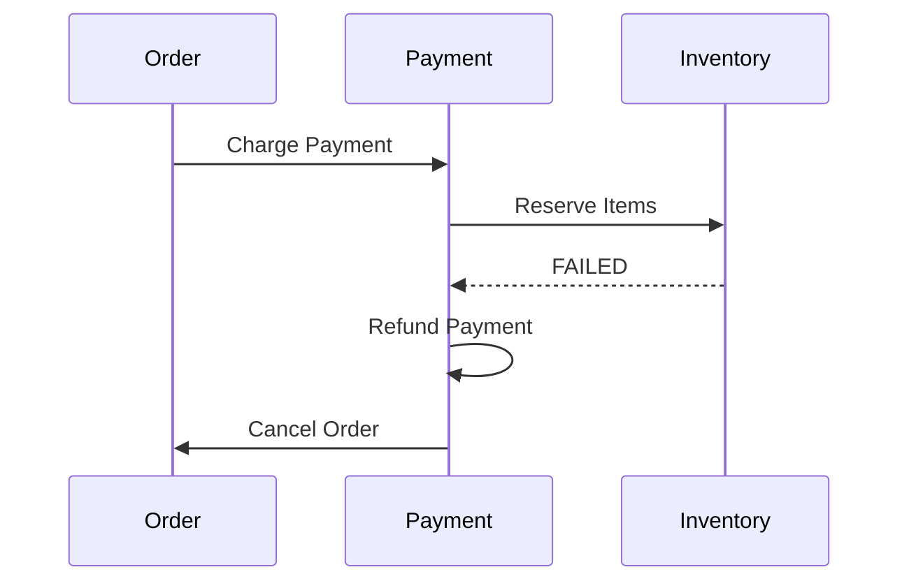
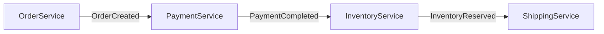
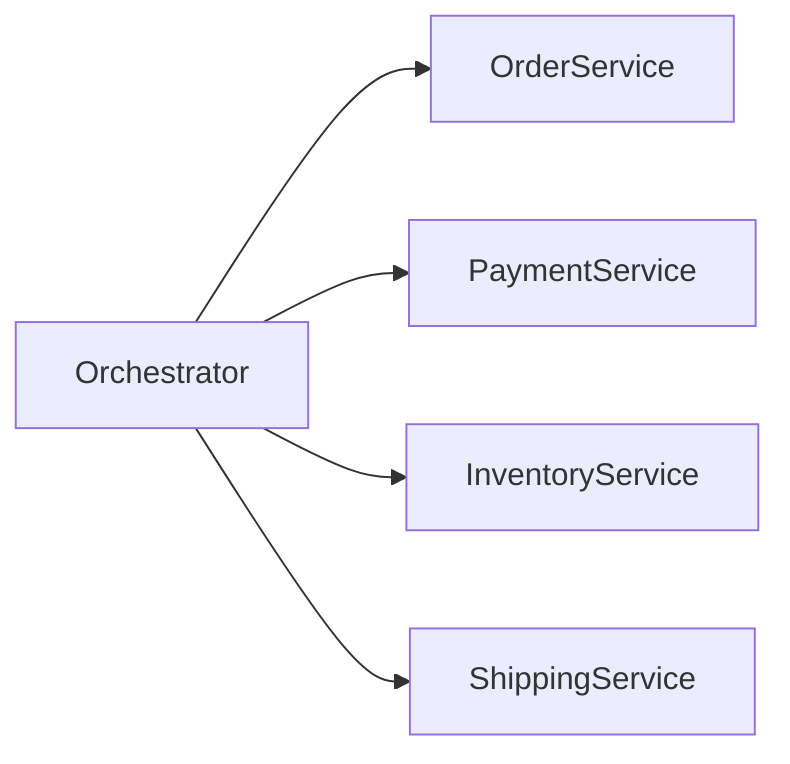
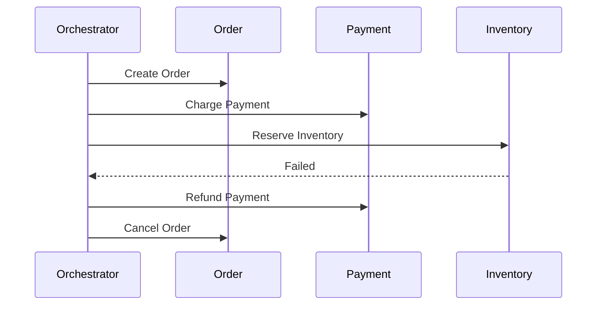
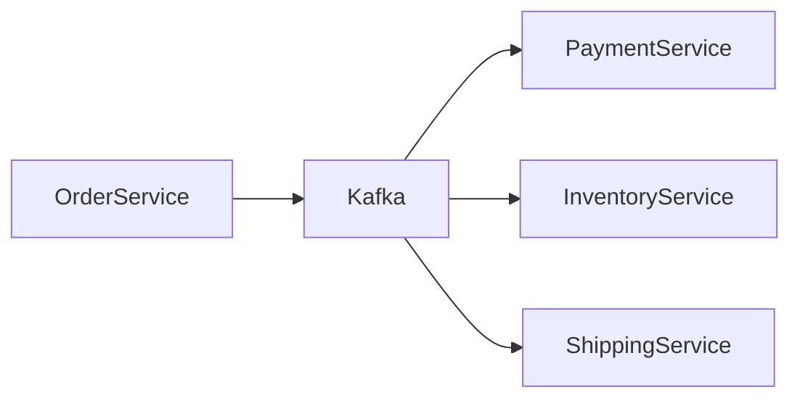

# Saga Pattern

Modern distributed systems often consist of **multiple microservices**, each owning its **own database**. While this architecture improves scalability and autonomy, it introduces a major challenge:

> **How do we maintain data consistency across multiple services when a business transaction spans several of them?**

Traditional monolithic systems solved this problem using **ACID database transactions**. However, in microservice architectures, **distributed ACID transactions are usually avoided** because they introduce tight coupling, poor scalability, and performance bottlenecks.

The **Saga Pattern** provides a solution by breaking large distributed transactions into **a sequence of smaller local transactions** coordinated across services.

---

# The Problem: Distributed Transactions

Consider an **e-commerce order placement workflow**.

Placing an order may involve several services:

| Service | Responsibility |
|------|------|
| Order Service | Create order record |
| Payment Service | Charge customer |
| Inventory Service | Reserve items |
| Shipping Service | Prepare shipment |

Each service has its **own database**.

If we attempt a traditional distributed transaction:

1. Order created
2. Payment charged
3. Inventory reserved
4. Shipping scheduled

But suppose **inventory reservation fails**.

Now the system must:

- Cancel payment
- Cancel order

Without proper coordination, the system can easily end up in **inconsistent states**.

---

# What is the Saga Pattern?

The **Saga Pattern** manages distributed transactions by breaking them into a sequence of **independent local transactions**.

Each step:

1. Executes a local transaction.
2. Publishes an event or calls the next service.
3. If something fails later, **compensating transactions undo the previous steps**.

A **Saga = sequence of local transactions + compensating transactions**

---

# Core Idea

Instead of:

```

Global Transaction

```

We perform:

```

Local Transaction 1
Local Transaction 2
Local Transaction 3
Local Transaction 4

```

If a failure occurs:

```

Compensation Transaction 3
Compensation Transaction 2
Compensation Transaction 1

````

---

# High-Level Architecture

```mermaid
flowchart LR
    Client --> OrderService
    OrderService --> PaymentService
    PaymentService --> InventoryService
    InventoryService --> ShippingService
````

Each service commits its **own database transaction**.

---

# Order Processing Example

Let’s illustrate a typical Saga workflow.

### Step-by-step

| Step | Service           | Action           |
| ---- | ----------------- | ---------------- |
| 1    | Order Service     | Create Order     |
| 2    | Payment Service   | Charge Payment   |
| 3    | Inventory Service | Reserve Items    |
| 4    | Shipping Service  | Arrange Shipment |

If step 3 fails:

| Compensation Step | Action |
| ----------------- | ------ |
| Cancel Payment    |        |
| Cancel Order      |        |

---

# Saga Execution Flow

```mermaid
sequenceDiagram
    participant Client
    participant Order
    participant Payment
    participant Inventory
    participant Shipping

    Client->>Order: Create Order
    Order->>Payment: Process Payment
    Payment->>Inventory: Reserve Inventory
    Inventory->>Shipping: Create Shipment
    Shipping-->>Order: Order Completed
```

---

# Failure Scenario

Suppose **Inventory Service fails**.



This process restores the system to a **consistent state**.

---

# Two Types of Saga Patterns

There are **two major approaches**.

| Pattern       | Control Style       |
| ------------- | ------------------- |
| Choreography  | Event-based         |
| Orchestration | Central coordinator |

---

# Saga Choreography

In **choreography**, services communicate using **events**.

There is **no central controller**.

Each service listens for events and reacts.

---

## Example Flow

1. Order Service creates order
2. Order Service emits **OrderCreated**
3. Payment Service listens to event
4. Payment Service processes payment
5. Payment Service emits **PaymentCompleted**
6. Inventory Service listens and reserves inventory

---

### Event Flow



---

## Advantages

* No central bottleneck
* Services loosely coupled
* Highly scalable
* Event-driven architecture

---

## Disadvantages

* Hard to track full transaction
* Complex debugging
* Event dependency chains
* Risk of circular dependencies

---

# Saga Orchestration

In orchestration, a **central coordinator** manages the workflow.

The orchestrator tells each service **what to do next**.

---

## Architecture



---

## Flow

1. Orchestrator creates order
2. Orchestrator calls payment service
3. Orchestrator calls inventory service
4. Orchestrator calls shipping service

If something fails:

The orchestrator triggers **compensation steps**.

---

### Orchestrated Saga Flow



---

# Compensation Transactions

A **compensation transaction** reverses a previously completed step.

Example:

| Original Transaction | Compensation      |
| -------------------- | ----------------- |
| Charge Payment       | Refund Payment    |
| Reserve Inventory    | Release Inventory |
| Create Shipment      | Cancel Shipment   |
| Create Order         | Cancel Order      |

Important rule:

> Compensation must be **idempotent**.

Meaning:

Running it **multiple times should not break the system**.

---

# Data Consistency in Saga

Saga provides:

**Eventual Consistency**

Instead of strict atomicity, the system ensures that:

> Eventually all services reach a consistent state.

Temporary inconsistencies may occur during execution.

---

# Handling Failures

Distributed systems fail frequently:

* Network failures
* Service crashes
* Message delays
* Duplicate events

Saga systems must handle these carefully.

---

## Failure Handling Strategies

### Retry Mechanism

Retry failed operations.

Example:

```
Retry payment up to 3 times
```

---

### Dead Letter Queues

Failed events are sent to a queue for manual inspection.

---

### Idempotency

Operations must be safe to run multiple times.

Example:

```
Reserve inventory request with same orderId should not double reserve.
```

---

# Saga Data Tracking

Systems often track saga state in a **Saga Log or State Store**.

Example table:

| SagaID | Step      | Status    |
| ------ | --------- | --------- |
| 1023   | Payment   | Completed |
| 1023   | Inventory | Failed    |

---

# Real-World Example: Online Order System

Real order flow:

```
Place Order
 → Payment
 → Inventory Reservation
 → Shipment Creation
 → Notification
```

If shipping fails:

```
Cancel Shipment
Release Inventory
Refund Payment
Cancel Order
```

This ensures the user **never pays for an order that cannot ship**.

---

# Saga vs Two-Phase Commit

| Feature          | Saga         | Two Phase Commit     |
| ---------------- | ------------ | -------------------- |
| Consistency      | Eventual     | Strong               |
| Scalability      | High         | Low                  |
| Performance      | High         | Slow                 |
| Coupling         | Loose        | Tight                |
| Failure Handling | Compensation | Transaction rollback |

2PC is rarely used in modern microservices due to **blocking and coordination overhead**.

---

# Common Implementation Technologies

Saga is often implemented using **message brokers** and **event streams**.

Examples:

| Technology    | Usage                  |
| ------------- | ---------------------- |
| Apache Kafka  | Event streaming        |
| RabbitMQ      | Messaging              |
| Apache Pulsar | Event-driven workflows |
| Temporal      | Workflow orchestration |
| Camunda       | Process orchestration  |

---

# Saga in Event-Driven Systems

Saga works very well with **Event-Driven Architecture**.



Each service reacts to events asynchronously.

---

# Challenges of Saga

While powerful, the pattern introduces complexity.

### Increased Complexity

Distributed workflows are harder to design.

### Event Ordering

Messages may arrive out of order.

### Debugging Difficulty

Tracing multi-service transactions is difficult.

### Data Visibility

Temporary inconsistencies can occur.

---

# Best Practices

### Design Idempotent APIs

Avoid duplicate side effects.

---

### Keep Steps Small

Each transaction should be **simple and independent**.

---

### Implement Strong Monitoring

Track:

* Saga states
* Failure rates
* Retry loops

---

### Use Unique Transaction IDs

Every saga must have a **unique ID** for traceability.

---

# Real Systems Using Saga

Many large-scale distributed systems use Saga-like workflows.

Examples include large-scale architectures from companies such as:

* Uber
* Netflix
* Amazon

These companies operate **hundreds of microservices**, making traditional distributed transactions impractical.

Saga allows them to coordinate **complex workflows across services without global locks**.

---

# Summary

The **Saga Pattern** is a fundamental technique for managing **distributed transactions in microservices architectures**.

Instead of relying on heavy distributed database transactions, it uses:

* **Local transactions**
* **Event-driven workflows**
* **Compensation mechanisms**

This approach enables systems to achieve:

* Scalability
* Fault tolerance
* Loose coupling

while still maintaining **eventual data consistency across services**.

As microservices and distributed systems continue to grow in complexity, Saga has become one of the **most important patterns for coordinating multi-service workflows at scale**.