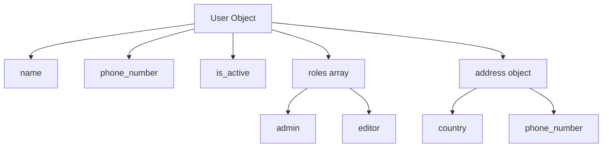
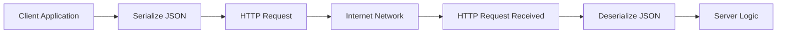
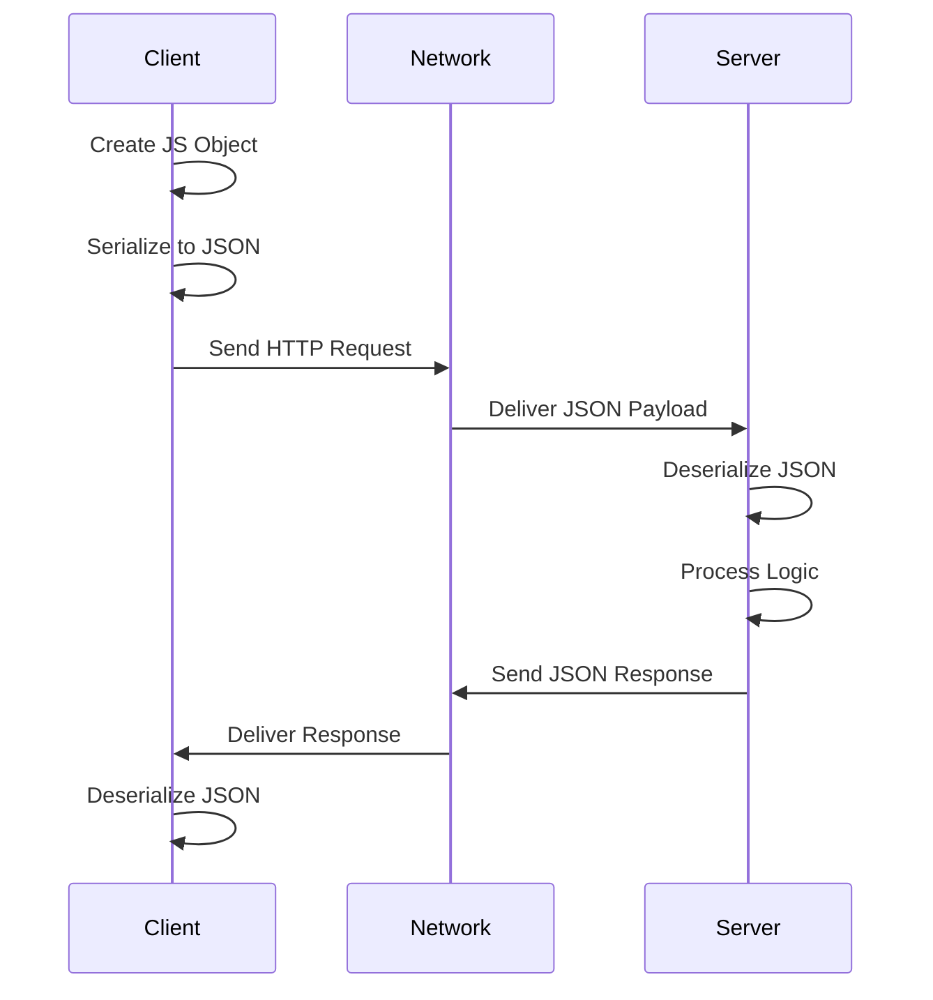

# Serialization, Deserialization & JSON

## Introduction: The Communication Problem

Imagine trying to have a conversation where:

* One person speaks **JavaScript**
* The other speaks **Rust**

Even if both are brilliant engineers, the conversation fails because their **languages, grammar, and structure are completely different**.

This is exactly the problem that occurs on the internet.

A **client application** (browser, mobile app, frontend) and a **server application** (backend service) often use **different programming languages**.

For example:

| System         | Language   | Data Structure |
| -------------- | ---------- | -------------- |
| Browser client | JavaScript | Objects        |
| Backend server | Rust       | Structs        |
| Mobile app     | Kotlin     | Data classes   |
| Python service | Python     | Dictionaries   |

These data structures are **not directly compatible**.

### Example

A JavaScript object:

```javascript
const user = {
  name: "Sriniously",
  age: 21
};
```

A Rust server expects something like:

```rust
struct User {
  name: String,
  age: u32
}
```

These two formats **cannot be sent directly across the network**.

Why?

Because the network only understands **raw data (strings / bytes)**.

So how do applications communicate?

They must agree on a **language-independent format**.

---

# The Solution: A Universal Translator

To solve the communication problem, systems use a **common data format**.

This format acts like a **universal translator** between different programming languages.

Two important processes make this possible:

| Process         | Meaning                                |
| --------------- | -------------------------------------- |
| Serialization   | Convert native data → universal format |
| Deserialization | Convert universal format → native data |

---

## Serialization

Serialization is the process of converting a **native program object** into a **transportable format**.

### Real-World Analogy

Think of **sending a package internationally**.

You cannot send:

* your house
* your furniture
* your kitchen

Instead, you **pack items into a standardized shipping box**.

Serialization does the same thing.

```
Application Object → Packaged Format → Sent Across Network
```

### Example

JavaScript object → JSON string

```javascript
const user = {
  name: "Sriniously",
  age: 21
};

const json = JSON.stringify(user);

console.log(json);
```

Output:

```json
{"name":"Sriniously","age":21}
```

The object has now been **serialized** into JSON.

---

## Deserialization

Deserialization is the reverse process.

It converts the **serialized format back into a usable program object**.

### Analogy

Receiving a package:

```
Package arrives → Open box → Use items
```

### Example

```javascript
const json = '{"name":"Sriniously","age":21}';

const user = JSON.parse(json);

console.log(user.name);
```

Output

```
Sriniously
```

Now the program can **work with the data normally**.

---

## Core Definition

> **Serialization and deserialization are techniques for converting data to and from a common format so that systems written in different languages can communicate.**

This concept is **foundational to backend engineering**.

Without it:

* APIs wouldn't exist
* microservices couldn't talk
* browsers couldn't load data
* mobile apps couldn't fetch information

---

# JSON: The Internet's Lingua Franca

The most common serialization format used on the web is **JSON**.

JSON stands for:

```
JavaScript Object Notation
```

Despite its name, JSON is **not limited to JavaScript**.

Nearly every programming language supports JSON.

| Language   | JSON Support  |
| ---------- | ------------- |
| JavaScript | Built-in      |
| Python     | json module   |
| Rust       | serde_json    |
| Java       | Jackson       |
| Go         | encoding/json |

---

## Why JSON Became So Popular

### 1. Human Readable

JSON is plain text.

Example:

```json
{
  "name": "Sriniously",
  "role": "admin"
}
```

A developer can instantly understand it.

---

### 2. Easy Debugging

You can inspect API responses easily in:

* browser devtools
* Postman
* curl
* logs

---

### 3. Lightweight

JSON has minimal structure compared to older formats like XML.

Example comparison:

#### JSON

```json
{
  "name": "Sriniously"
}
```

#### XML

```xml
<user>
  <name>Sriniously</name>
</user>
```

JSON is **shorter and simpler**.

---

# Text vs Binary Serialization Formats

Serialization formats fall into two main categories.

| Type       | Examples                    | Human Readable | Performance |
| ---------- | --------------------------- | -------------- | ----------- |
| Text-based | JSON, XML, YAML             | Yes            | Moderate    |
| Binary     | Protobuf, Avro, MessagePack | No             | Very Fast   |

---

## Text Formats

Best for:

* REST APIs
* debugging
* logs
* configuration

Examples:

* JSON
* YAML
* XML

---

## Binary Formats

Best for:

* microservices
* internal RPC communication
* high performance systems

Examples:

* Protocol Buffers
* gRPC
* MessagePack

Binary formats are **smaller and faster**, but **hard for humans to read**.

---

# The Anatomy of a JSON Message

Let's examine a JSON object.

```json
{
  "name": "Sriniously",
  "phone_number": 123456,
  "is_active": true,
  "roles": ["admin", "editor"],
  "address": {
    "country": "India",
    "phone_number": 987654
  }
}
```

---

## Rule 1: JSON Object Structure

A JSON object starts and ends with curly braces.

```
{
  key: value
}
```

Example:

```json
{
  "name": "Sriniously"
}
```

---

## Rule 2: Keys Must Be Strings

All keys must be **double-quoted strings**.

Correct:

```json
{
  "name": "Sriniously"
}
```

Incorrect:

```json
{
  name: "Sriniously"
}
```

---

## Rule 3: Valid JSON Value Types

JSON supports **six data types**.

| Type    | Example                  |
| ------- | ------------------------ |
| String  | `"India"`                |
| Number  | `42`, `3.14`             |
| Boolean | `true`, `false`          |
| Null    | `null`                   |
| Array   | `["admin","editor"]`     |
| Object  | `{ "country": "India" }` |

---

### JSON Strings

```json
{
  "name": "Sriniously"
}
```

---

### JSON Numbers

```json
{
  "age": 21
}
```

---

### JSON Booleans

```json
{
  "is_active": true
}
```

---

### JSON Arrays

```json
{
  "roles": ["admin", "editor"]
}
```

Arrays represent **ordered lists**.

---

### Nested Objects

JSON allows hierarchical data.

```json
{
  "address": {
    "country": "India",
    "city": "Varanasi"
  }
}
```

This allows representing **complex relationships**.

---

# Visualizing JSON Structure



This diagram shows how JSON data can represent **nested structures**.

---

# Real API Conversation: Request → Response

Let's walk through a real backend scenario.

A client wants to **add a new book**.

Endpoint:

```
POST /api/books
```

---

# Step 1: Client Creates Data

The frontend application prepares a JavaScript object.

```javascript
const book = {
  title: "Designing APIs",
  author: "Jane Doe",
  price: 29.99
};
```

---

# Step 2: Serialization

Before sending the request, the object must be converted into JSON.

```javascript
const payload = JSON.stringify(book);
```

Result:

```json
{
  "title": "Designing APIs",
  "author": "Jane Doe",
  "price": 29.99
}
```

---

# Step 3: HTTP Request

The JSON is placed inside the request body.

```javascript
fetch("/api/books", {
  method: "POST",
  headers: {
    "Content-Type": "application/json"
  },
  body: JSON.stringify(book)
});
```

---

# Step 4: Network Transmission

The data travels across the network.

As a backend engineer, you usually **ignore lower network layers**.

Your focus is the **application layer**.

### Simplified Network Model



---

# Step 5: Server Deserialization

The backend receives the JSON request body.

Example (Node.js backend):

```javascript
app.post("/api/books", (req, res) => {
  const book = req.body;

  console.log(book.title);

  res.json({
    success: true
  });
});
```

The JSON is **deserialized into a native object**.

---

# Step 6: Server Response

The server sends back JSON.

```javascript
res.json({
  message: "Book created",
  id: 123
});
```

Response:

```json
{
  "message": "Book created",
  "id": 123
}
```

---

# Step 7: Client Deserializes Response

```javascript
const response = await fetch("/api/books");

const data = await response.json();

console.log(data.message);
```

Now the frontend updates the UI.

---

# Complete Request Lifecycle



---

# Where JSON Is Used Beyond APIs

JSON is everywhere in modern software.

| Use Case            | Example           |
| ------------------- | ----------------- |
| REST APIs           | API responses     |
| Configuration files | package.json      |
| Logging systems     | structured logs   |
| Databases           | MongoDB documents |
| Message queues      | event payloads    |

Example configuration:

```json
{
  "name": "my-project",
  "version": "1.0.0"
}
```

---

# Why Serialization Is a Foundational Backend Skill

Serialization and deserialization are **core building blocks of distributed systems**.

They enable:

* browser ↔ server communication
* microservice communication
* mobile apps calling APIs
* event systems
* message queues
* data storage

Without serialization:

```
No APIs
No web services
No distributed systems
```

---

# Key Takeaways

| Concept         | Meaning                           |
| --------------- | --------------------------------- |
| Serialization   | Convert object → transport format |
| Deserialization | Convert format → object           |
| JSON            | Most common API format            |
| Text formats    | Human readable                    |
| Binary formats  | Faster but not readable           |

---

# Final Insight

Serialization acts as the **universal translator of the internet**.

It allows systems written in:

* JavaScript
* Rust
* Python
* Go
* Java

to **communicate seamlessly**.

Every API request you send, every webpage you load, and every mobile app request you make relies on the invisible but powerful processes of **serialization and deserialization**.

Understanding this concept is one of the **first steps toward mastering backend system design**.
