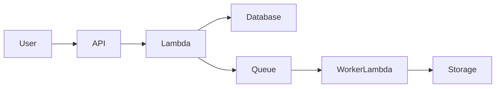
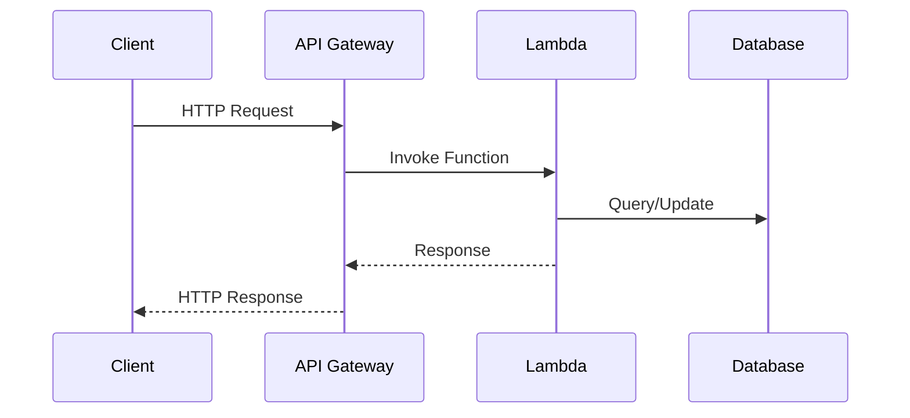
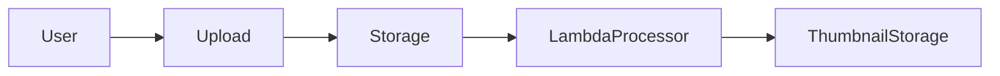
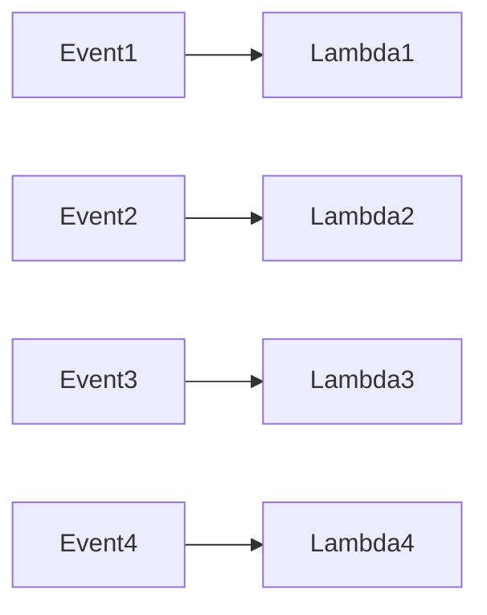
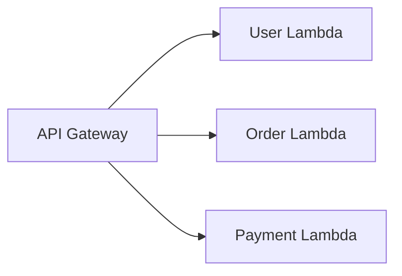
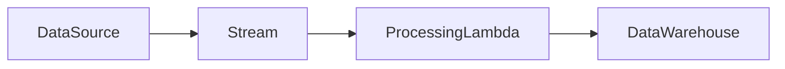

# Serverless-First Architecture

## Introduction

Traditional backend systems are usually built using **long-running servers**:

- Virtual Machines
- Container clusters
- Dedicated application servers

These systems require:

- Infrastructure management
- Capacity planning
- Scaling configuration
- Idle resource costs

A newer approach called **Serverless Architecture** removes the need to manage servers entirely.

Instead of deploying applications as long-running services, developers deploy **small functions that execute only when triggered by events**.

This model is commonly called **Function as a Service (FaaS)**.

Major cloud providers offer serverless platforms such as:

- AWS Lambda  
- Google Cloud Functions  
- Azure Functions  

These platforms automatically handle:

- Infrastructure
- Scaling
- Load balancing
- Fault tolerance

The **Serverless-First** philosophy means:

> Design your system primarily around event-driven serverless functions instead of persistent servers.

---

# What is Serverless?

Despite the name, **servers still exist**.

The difference is that developers **do not manage them**.

The cloud provider automatically handles:

- Provisioning
- Scaling
- Patching
- Networking
- Availability

Developers focus only on **writing business logic**.

---

# What is Function as a Service (FaaS)?

FaaS allows developers to deploy **small stateless functions** that run in response to events.

Example function:

```javascript
export const handler = async (event) => {
    const order = JSON.parse(event.body)

    return {
        statusCode: 200,
        body: JSON.stringify({
            message: `Order ${order.id} received`
        })
    }
}
````

This function runs only when an event occurs.

---

# Key Characteristics of Serverless

| Feature                | Explanation                   |
| ---------------------- | ----------------------------- |
| Event-driven           | Functions triggered by events |
| Stateless              | No persistent local state     |
| Auto-scaling           | Platform scales automatically |
| Pay-per-use            | Charged only when executed    |
| Managed infrastructure | No server management          |

---

# Serverless-First Philosophy

Traditional architecture:

```
Servers → APIs → Databases
```

Serverless-first architecture:

```
Events → Functions → Services
```

The system becomes **event-driven rather than request-driven**.

---

# Event-Driven Serverless Architecture



In this model:

* APIs trigger functions
* Events trigger background processing
* Functions interact with databases and services

---

# Common Event Sources

Serverless functions can be triggered by many types of events.

| Event Source     | Example               |
| ---------------- | --------------------- |
| HTTP requests    | API Gateway           |
| File uploads     | Object storage events |
| Queue messages   | Message queues        |
| Database changes | CDC events            |
| Scheduled tasks  | Cron triggers         |
| IoT devices      | Device telemetry      |

Example architecture:


---

# API-Based Serverless

A common architecture uses **API gateways**.

Example request flow:



API gateways provide:

* Authentication
* Rate limiting
* Routing
* Monitoring

Popular gateway services include:

* Amazon API Gateway
* Cloudflare Workers

---

# Event Processing Architecture

Serverless excels in **asynchronous processing**.

Example: image processing pipeline.



Workflow:

1. User uploads image
2. Storage triggers event
3. Function processes image
4. Thumbnail stored

---

# Serverless Scaling Model

One of the biggest advantages is **automatic scaling**.

Traditional server scaling:

```
Provision Servers → Monitor Load → Add Instances
```

Serverless scaling:

```
Event arrives → Platform spawns function instance
```

---

## Scaling Example



Each event can trigger a **separate function instance**.

This allows massive parallelism.

---

# Concurrency Model

Serverless platforms scale by increasing **concurrent function executions**.

Example:

| Requests | Function Instances |
| -------- | ------------------ |
| 10       | 10                 |
| 100      | 100                |
| 1000     | 1000               |

This allows sudden traffic spikes to be handled automatically.

---

# Cost Model

Traditional servers run continuously.

Example:

```
24 hours × server cost
```

Serverless charges only when code runs.

Cost typically depends on:

| Factor             | Description          |
| ------------------ | -------------------- |
| Invocation count   | Number of executions |
| Execution duration | Function runtime     |
| Memory allocation  | Resource usage       |

---

## Example Cost Comparison

| Architecture      | Cost Model                |
| ----------------- | ------------------------- |
| VM server         | Pay for uptime            |
| Container cluster | Pay for reserved capacity |
| Serverless        | Pay per execution         |

For low-traffic systems, serverless can be **dramatically cheaper**.

---

# Cold Start Problem

A major challenge in serverless systems is **cold starts**.

When a function runs after inactivity:

1. Platform provisions container
2. Loads runtime
3. Loads code

This causes latency.

---

## Cold Start Flow


Cold start latency may range from **100 ms to several seconds**.

---

# Mitigation Strategies

| Strategy                    | Explanation              |
| --------------------------- | ------------------------ |
| Warm instances              | Keep functions active    |
| Provisioned concurrency     | Pre-initialize functions |
| Lightweight runtimes        | Faster startup           |
| Smaller deployment packages | Reduced load time        |

---

# Stateless Design

Serverless functions must be **stateless**.

Why?

Function instances can be:

* Created
* Destroyed
* Reused

State should be stored externally.

Example external systems:

| System         | Purpose            |
| -------------- | ------------------ |
| Database       | Persistent storage |
| Cache          | Fast reads         |
| Object storage | Files              |
| Message queue  | Async tasks        |

---

# Serverless Microservices

Serverless architectures can also implement **microservices**.

Each service can be represented by a **set of functions**.



Each function handles a specific domain.

---

# Serverless Data Pipelines

Serverless is ideal for **data processing pipelines**.

Example event flow:



Use cases include:

* Log processing
* ETL pipelines
* IoT analytics

---

# Observability Challenges

Debugging serverless systems can be difficult.

Problems include:

* Short-lived functions
* Distributed execution
* High concurrency

Monitoring typically involves:

| Tool    | Purpose              |
| ------- | -------------------- |
| Logs    | Debug execution      |
| Metrics | Performance tracking |
| Tracing | Request flow         |

Platforms provide observability services like:

* AWS CloudWatch

---

# Limitations of Serverless

Despite its advantages, serverless has limitations.

| Limitation            | Explanation                       |
| --------------------- | --------------------------------- |
| Cold start latency    | Slower first execution            |
| Execution time limits | Functions cannot run indefinitely |
| Vendor lock-in        | Platform-specific features        |
| Debugging complexity  | Distributed tracing required      |

---

# Ideal Use Cases

Serverless works best for workloads that are:

| Use Case         | Example               |
| ---------------- | --------------------- |
| Event processing | Queue consumers       |
| APIs             | Lightweight REST APIs |
| Data pipelines   | Log processing        |
| Scheduled jobs   | Cron tasks            |
| Image processing | Upload pipelines      |

---

# Real-World Architectures

Many large-scale companies use serverless patterns internally, including architectures inspired by systems used at:

* Netflix
* Airbnb
* Amazon

These organizations leverage serverless for:

* event processing
* backend APIs
* analytics pipelines

---

# Best Practices

### Design for Events

Prefer asynchronous workflows.

---

### Keep Functions Small

Functions should focus on **single responsibilities**.

---

### Use Queues for Reliability

Queues prevent request loss during spikes.

---

### Monitor Concurrency

Track function usage and limits.

---

### Use Infrastructure as Code

Serverless infrastructure should be versioned and automated.

---

# Summary

Serverless-First architecture represents a major shift in backend system design.

Instead of managing infrastructure, developers deploy **event-driven functions** that automatically scale based on demand.

Key benefits include:

* Automatic scaling
* Pay-per-use pricing
* Reduced infrastructure management
* Rapid development

When designed correctly, serverless systems can handle **massive workloads efficiently** while keeping operational complexity low.

As cloud-native architectures continue evolving, the **Serverless-First approach is becoming a core paradigm for building modern distributed systems**.