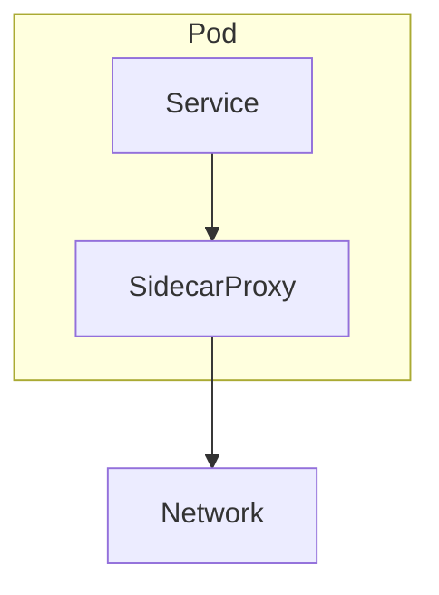
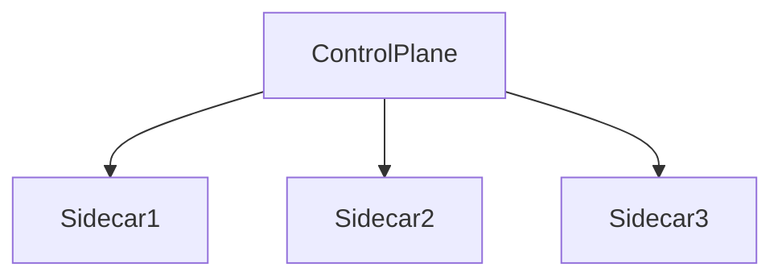
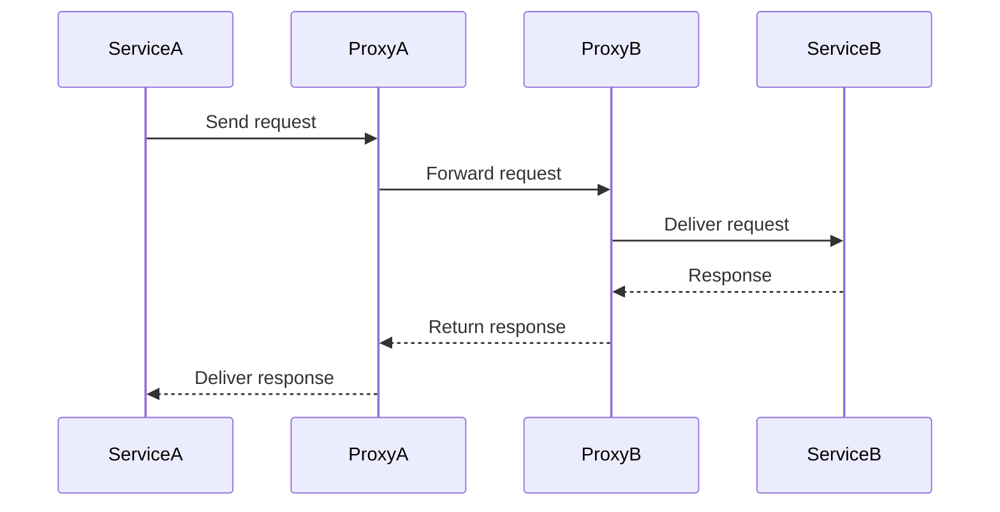
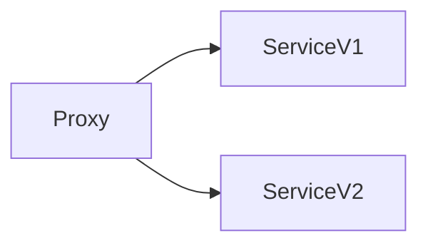
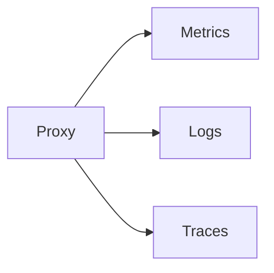
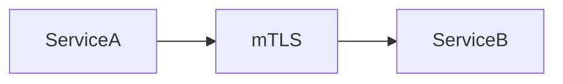
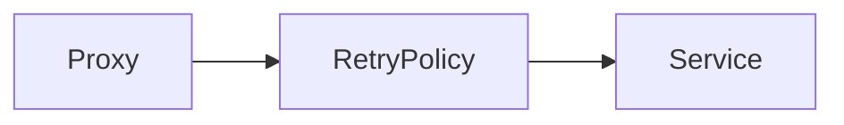
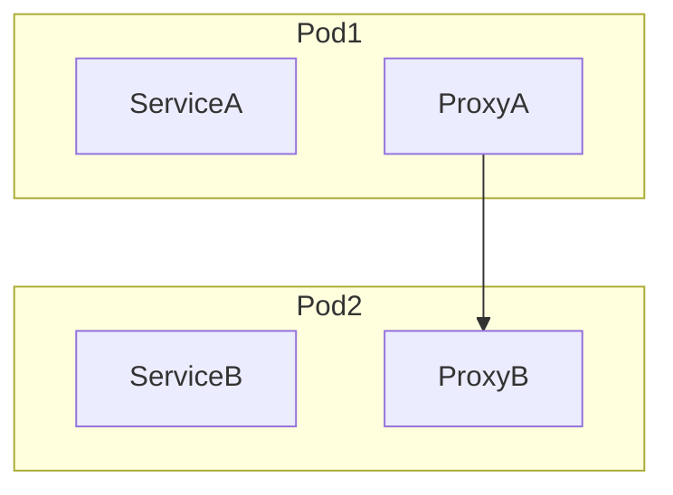
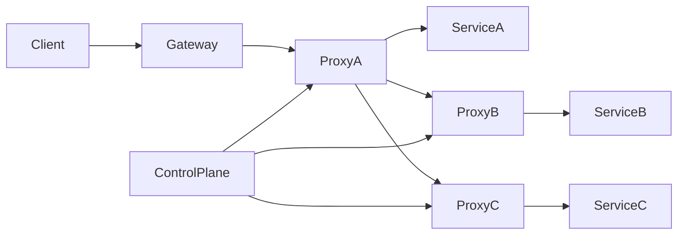

# Service Mesh

As modern systems evolve toward **microservices architectures**, applications become composed of **dozens or even hundreds of small services** communicating over the network.

Managing this communication becomes extremely complex.

Problems arise such as:

- service discovery
- retries
- load balancing
- encryption
- observability
- failure handling
- traffic routing

Embedding these capabilities inside every service leads to **duplicate logic, inconsistent implementations, and difficult maintenance**.

To solve this, modern distributed systems use a **Service Mesh**.

> A **Service Mesh** is an infrastructure layer that manages **service-to-service communication** in a distributed system.

Instead of services implementing networking concerns themselves, the service mesh **moves those responsibilities into dedicated infrastructure components**.

---

# Why Service Mesh Exists

In early microservices systems, services handled networking logic directly.

Example responsibilities inside services:

- retry policies
- TLS encryption
- circuit breakers
- request tracing
- service discovery

This created major problems.

| Problem | Explanation |
|------|-------------|
| Code duplication | Every service implements networking logic |
| Language dependency | Each language needs its own libraries |
| Difficult debugging | Hard to trace distributed requests |
| Inconsistent policies | Different teams implement differently |

A service mesh solves this by **separating application logic from network communication logic**.

---

# High-Level Architecture

A service mesh typically consists of two main layers:

1. **Data Plane**
2. **Control Plane**

```mermaid
flowchart LR
    ServiceA --> SidecarA
    SidecarA --> SidecarB
    SidecarB --> ServiceB

    ControlPlane --> SidecarA
    ControlPlane --> SidecarB
````

Explanation:

| Component       | Role                           |
| --------------- | ------------------------------ |
| Sidecar proxies | Handle service communication   |
| Control plane   | Configures and manages proxies |

---

# Data Plane

The **data plane** handles the actual network traffic between services.

Each service runs alongside a **sidecar proxy**.

```mermaid
flowchart LR
    Client --> SidecarA
    SidecarA --> SidecarB
    SidecarB --> ServiceB
```

Key idea:

* **Services never communicate directly**
* All communication flows through sidecar proxies

Responsibilities of sidecars:

* load balancing
* retries
* circuit breaking
* encryption
* traffic routing
* metrics collection

---

# Sidecar Proxy Pattern

A **sidecar** is a helper container running alongside the application container.



Advantages:

* application remains simple
* networking logic becomes centralized
* consistent behavior across services

A popular proxy used in service meshes is **Envoy**.

---

# Control Plane

The **control plane** configures and manages all sidecar proxies.

Responsibilities include:

| Function           | Description                  |
| ------------------ | ---------------------------- |
| Service discovery  | Tracks available services    |
| Configuration      | Pushes routing rules         |
| Security policies  | Manages certificates         |
| Traffic management | Controls routing and retries |



The control plane ensures all proxies follow consistent policies.

---

# Service Mesh Request Flow

When one service calls another:

1. Request leaves the service.
2. It goes to the **local sidecar proxy**.
3. Proxy applies policies.
4. Request is forwarded to destination sidecar.
5. Destination proxy sends request to service.



---

# Key Features of Service Mesh

Service meshes provide multiple capabilities.

---

# Traffic Management

Service mesh allows advanced traffic routing between services.

Example capabilities:

* load balancing
* canary deployments
* traffic splitting
* request retries



Traffic splitting example:

| Version | Traffic |
| ------- | ------- |
| v1      | 90%     |
| v2      | 10%     |

This allows safe rollout of new versions.

---

# Observability

Understanding distributed systems requires deep visibility.

Service mesh automatically collects:

* request metrics
* latency
* error rates
* distributed traces



These metrics help operators understand **system health and performance**.

---

# Security

Service meshes enable **secure communication between services**.

Features include:

| Feature               | Description                      |
| --------------------- | -------------------------------- |
| mTLS                  | mutual TLS encryption            |
| Identity verification | services authenticate each other |
| Policy enforcement    | restrict service access          |



This ensures **encrypted service-to-service communication**.

---

# Resilience

Service meshes improve system reliability by handling failures gracefully.

Resilience features include:

* circuit breakers
* retries
* timeout policies
* fault injection



This prevents cascading failures.

---

# Service Mesh in Kubernetes

Service meshes are commonly deployed in container orchestration environments like **Kubernetes**.

In Kubernetes:

* each pod gets a **sidecar proxy**
* mesh control plane manages configuration



The orchestration platform handles service discovery and deployment.

---

# Popular Service Mesh Implementations

Several open-source service mesh technologies exist.

| Service Mesh   | Description                    |
| -------------- | ------------------------------ |
| Istio          | Feature-rich service mesh      |
| Linkerd        | Lightweight service mesh       |
| Consul Connect | Service mesh built into Consul |

Many cloud providers also offer managed service mesh solutions.

---

# Example Architecture

Below is an example of a microservices system using a service mesh.



This architecture enables:

* centralized control
* secure communication
* traffic observability

---

# Benefits of Service Mesh

Service mesh provides multiple architectural advantages.

| Benefit                | Explanation                              |
| ---------------------- | ---------------------------------------- |
| Centralized networking | networking logic moved to infrastructure |
| Improved observability | built-in tracing and metrics             |
| Strong security        | automatic mTLS                           |
| Traffic control        | fine-grained routing                     |
| Resilience             | automatic retries and circuit breakers   |

---

# Challenges and Trade-offs

Service meshes also introduce complexity.

| Challenge              | Explanation                        |
| ---------------------- | ---------------------------------- |
| Operational complexity | additional infrastructure layer    |
| Resource overhead      | sidecar proxies consume CPU/memory |
| Learning curve         | requires operational expertise     |

Organizations adopt service meshes when systems reach **significant microservice scale**.

---

# Real-World Use Cases

Large-scale distributed systems use service meshes to manage complex service communication.

Example scenarios:

| System Type         | Use Case                             |
| ------------------- | ------------------------------------ |
| Streaming platforms | manage hundreds of services          |
| E-commerce systems  | secure payment service communication |
| Cloud platforms     | manage internal service networking   |

Large platforms such as Netflix-style microservice architectures rely heavily on **advanced traffic management and observability**.

---

# Summary

A **Service Mesh** is an infrastructure layer that manages **service-to-service communication** in distributed systems.

Key components include:

* **Sidecar proxies** that intercept network traffic
* **Control plane** that manages policies and configuration

Service meshes provide capabilities such as:

* traffic routing
* observability
* security
* resilience

By moving networking concerns out of application code, service meshes make large-scale microservices systems **more reliable, observable, and secure**.