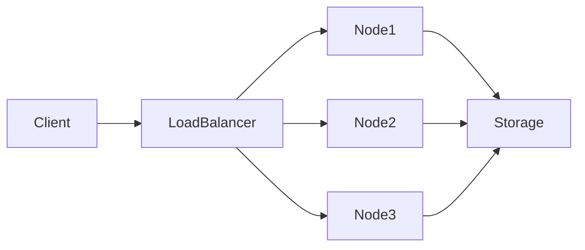
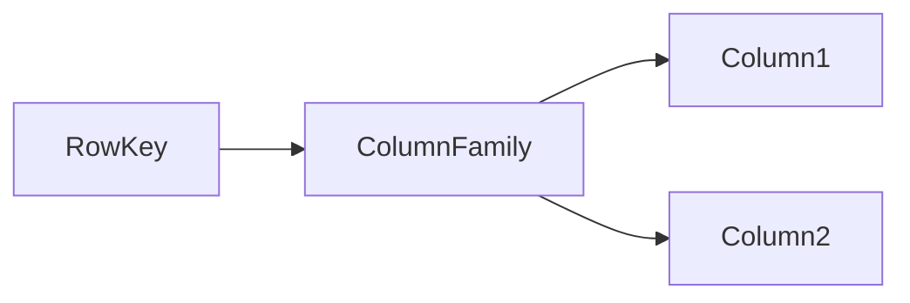
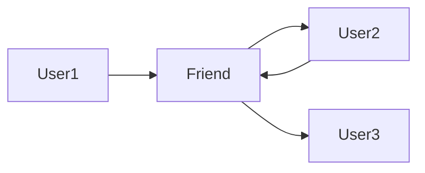
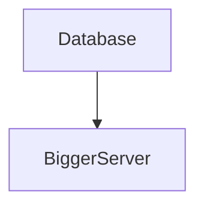
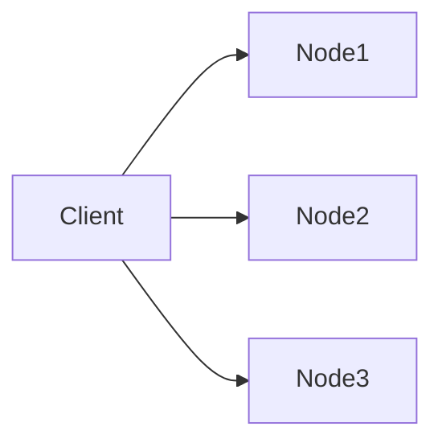
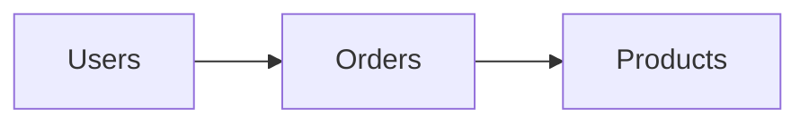
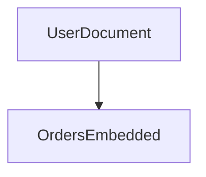
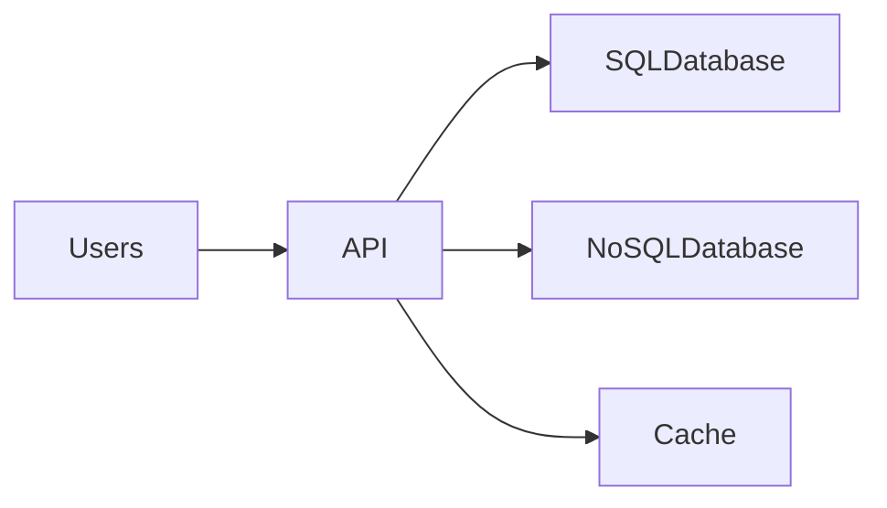

# SQL vs NoSQL Databases

Modern systems store and process enormous amounts of data. Choosing the right database architecture is critical for **performance, scalability, and maintainability**.

Two major categories dominate modern data storage systems:

- **SQL Databases (Relational Databases)**
- **NoSQL Databases (Non-relational Databases)**

Both approaches solve different problems and are used in different system architectures.

> SQL databases emphasize **structured data, strong consistency, and relational modeling**, while NoSQL databases focus on **flexibility, scalability, and distributed architecture**.

---

# Historical Context

Relational databases have been around since the 1970s, based on the **relational model introduced by** :contentReference[oaicite:0]{index=0}.

As internet-scale systems grew, companies like :contentReference[oaicite:1]{index=1} and :contentReference[oaicite:2]{index=2} faced scalability challenges with traditional relational databases.

This led to the development of **NoSQL systems**, optimized for:

- horizontal scaling
- distributed storage
- flexible data models

---

# What is SQL?

SQL stands for **Structured Query Language**.

SQL databases organize data into **tables with predefined schemas**.

Example SQL table:

| id | name | email |
|----|------|------|
| 1 | Alice | alice@email.com |
| 2 | Bob | bob@email.com |

Popular SQL databases include:

- :contentReference[oaicite:3]{index=3}
- :contentReference[oaicite:4]{index=4}
- :contentReference[oaicite:5]{index=5}
- :contentReference[oaicite:6]{index=6}

---

# SQL Database Architecture

Relational databases follow a **structured relational model**.

```mermaid
flowchart TD
    Client --> QueryParser
    QueryParser --> QueryOptimizer
    QueryOptimizer --> ExecutionEngine
    ExecutionEngine --> StorageEngine
    StorageEngine --> Tables
    StorageEngine --> Indexes
````

Key components:

| Component        | Role                         |
| ---------------- | ---------------------------- |
| Query parser     | Validates SQL syntax         |
| Query optimizer  | Chooses efficient query plan |
| Execution engine | Executes query operations    |
| Storage engine   | Handles disk storage         |

---

# Example SQL Query

```sql
SELECT name, email
FROM users
WHERE id = 10;
```

The database:

1. parses the query
2. checks indexes
3. retrieves the requested rows

---

# What is NoSQL?

NoSQL stands for **Not Only SQL**.

Unlike relational databases, NoSQL systems allow **flexible schemas and distributed scaling**.

Instead of rigid tables, NoSQL databases support various data models.

Popular NoSQL systems include:

* MongoDB
* Apache Cassandra
* Redis
* Amazon DynamoDB

---

# NoSQL Architecture

Most NoSQL systems are designed for **horizontal scaling across distributed nodes**.



Data is partitioned across multiple servers.

This architecture enables **massive scalability**.

---

# Types of NoSQL Databases

NoSQL is a broad category that includes several data models.

---

## Key-Value Databases

Data is stored as simple **key-value pairs**.

Example:

```json
"user:1001" : {
  "name": "Alice",
  "email": "alice@email.com"
}
```

Use cases:

* caching
* session storage
* configuration data

Example system:

* Redis

---

## Document Databases

Data is stored as flexible documents (usually JSON).

Example document:

```json
{
  "id": 1001,
  "name": "Alice",
  "email": "alice@email.com",
  "orders": [101, 102, 103]
}
```

Use cases:

* user profiles
* content management systems

Example:

* MongoDB

---

## Column-Family Databases

Data is stored in **column families** rather than rows.



Used for:

* analytics
* large-scale logging
* time-series data

Example:

* Apache Cassandra

---

## Graph Databases

Designed to store **relationships between entities**.



Used for:

* social networks
* recommendation systems

Example:

* Neo4j

---

# SQL vs NoSQL Comparison

| Feature        | SQL               | NoSQL              |
| -------------- | ----------------- | ------------------ |
| Data model     | Relational tables | Flexible models    |
| Schema         | Fixed schema      | Dynamic schema     |
| Scalability    | Vertical scaling  | Horizontal scaling |
| Transactions   | Strong ACID       | Often BASE         |
| Query language | SQL               | Varies by database |
| Joins          | Supported         | Often avoided      |

---

# ACID vs BASE

SQL and NoSQL differ in consistency models.

---

## ACID Properties

ACID ensures reliable transactions.

| Property    | Meaning                        |
| ----------- | ------------------------------ |
| Atomicity   | All operations succeed or fail |
| Consistency | Data remains valid             |
| Isolation   | Transactions don't interfere   |
| Durability  | Data persists after commit     |

Relational databases strongly support ACID.

---

## BASE Model

NoSQL systems often use BASE.

| Property              | Meaning                        |
| --------------------- | ------------------------------ |
| Basically Available   | System remains available       |
| Soft State            | Data may temporarily change    |
| Eventually Consistent | Consistency achieved over time |

BASE prioritizes **availability and scalability**.

---

# Scaling Strategies

Scaling is one of the main differences between SQL and NoSQL systems.

---

## SQL Scaling

Relational databases typically scale **vertically**.



Upgrade server resources:

* more CPU
* more memory
* faster storage

Limitations:

* expensive
* hardware limits

---

## NoSQL Scaling

NoSQL systems scale **horizontally**.



Advantages:

* unlimited scaling
* distributed data
* fault tolerance

---

# Data Modeling Differences

SQL requires **normalized schemas**.

Example:



Data is split across multiple tables.

NoSQL often uses **denormalized documents**.



This improves read performance.

---

# Real-World System Examples

Different companies use different database architectures.

| Platform | Database Approach                 |
| -------- | --------------------------------- |
| Facebook | MySQL + distributed caching       |
| Netflix  | Cassandra-based infrastructure    |
| Amazon   | DynamoDB for large-scale services |
| Uber     | Mix of SQL and NoSQL              |

Most modern systems use **polyglot persistence**, combining multiple databases.

---

# Hybrid Architecture Example

Large systems often combine SQL and NoSQL.



Typical pattern:

| Component     | Database Type   |
| ------------- | --------------- |
| Transactions  | SQL             |
| User sessions | NoSQL           |
| Caching       | In-memory store |
| Analytics     | Column database |

---

# Trade-offs

Choosing between SQL and NoSQL involves trade-offs.

| Factor          | SQL Strength | NoSQL Strength |
| --------------- | ------------ | -------------- |
| Data integrity  | Strong       | Moderate       |
| Complex queries | Excellent    | Limited        |
| Flexibility     | Low          | High           |
| Scalability     | Moderate     | Excellent      |

---

# When to Use SQL

SQL databases are ideal when:

* strong data consistency is required
* complex joins are necessary
* structured schema is stable
* financial transactions are involved

Examples:

* banking systems
* payment platforms
* inventory management

---

# When to Use NoSQL

NoSQL databases work best when:

* data structure changes frequently
* massive scalability is required
* distributed architecture is needed
* extremely high throughput is required

Examples:

* social networks
* IoT data platforms
* recommendation systems

---

# Summary

SQL and NoSQL databases serve different architectural needs.

SQL databases provide:

* structured relational models
* strong transactional guarantees
* powerful querying capabilities

NoSQL databases provide:

* flexible schemas
* horizontal scalability
* distributed system resilience

Modern large-scale systems often combine both approaches, selecting the right database technology depending on **workload characteristics, scalability needs, and consistency requirements**.