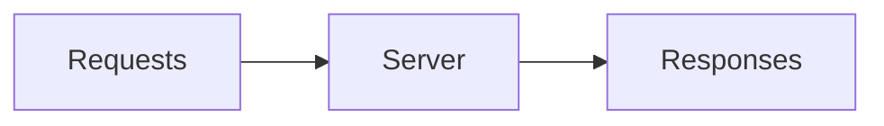
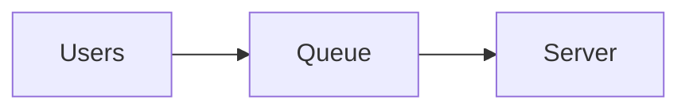
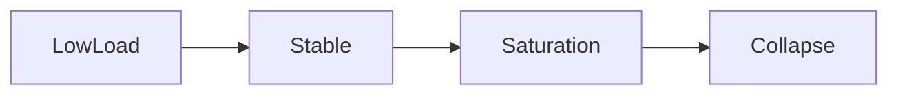
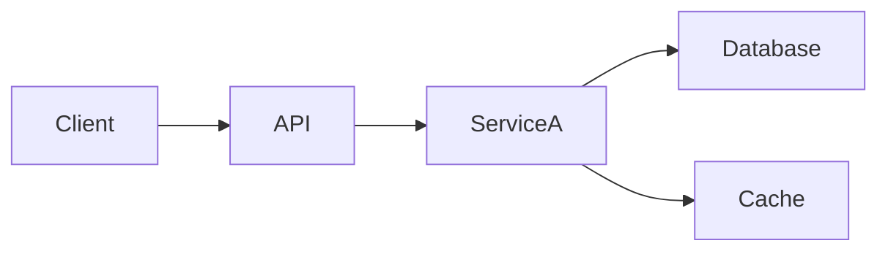
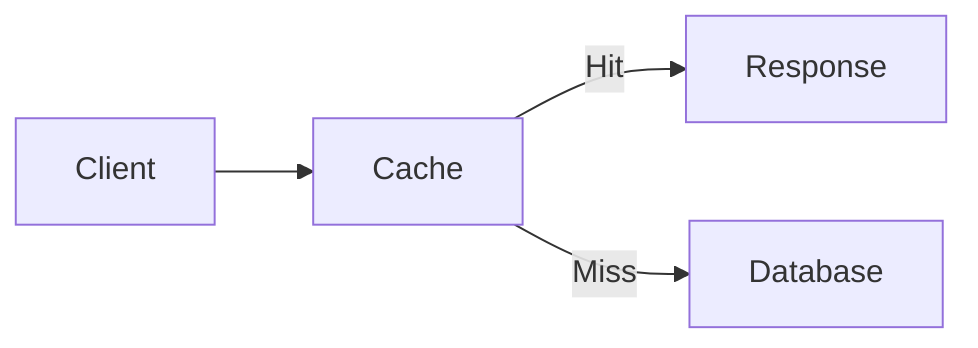
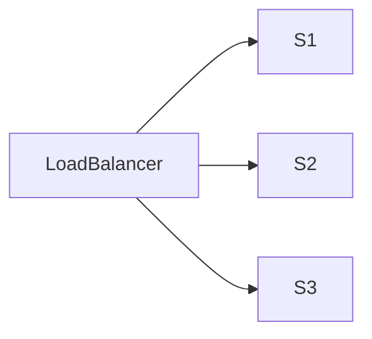
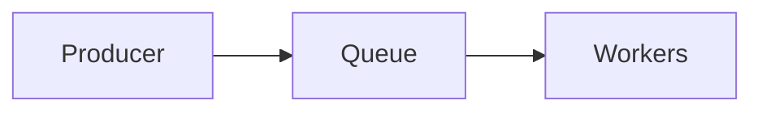
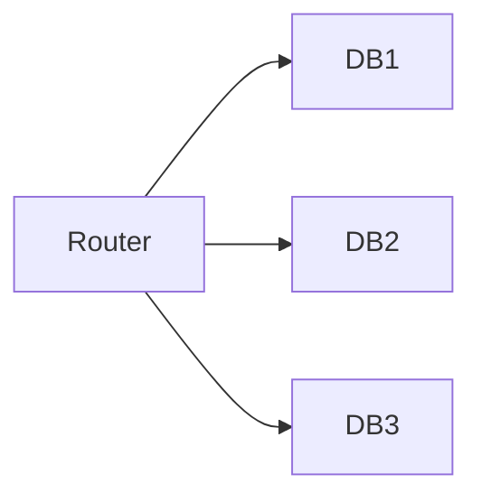

# Throughput and Latency

## Introduction: The Highway Analogy

Imagine a **highway system** connecting two cities.

Two important metrics describe the performance of this highway:

1. **How many cars pass through per hour**
2. **How long each car takes to travel**

These correspond to two fundamental system design metrics:

| Metric | Meaning |
|------|--------|
| **Throughput** | Number of requests processed per unit time |
| **Latency** | Time taken to process a single request |

These two metrics are central to **distributed systems**, **backend services**, **databases**, and **high-scale applications**.

Every system architect constantly tries to answer:

- Can the system handle **more requests per second?**
- Can the system respond **faster to each request?**

Understanding the relationship between **throughput and latency** is essential for designing scalable systems.

---

# What is Latency?

Latency measures:

> **The time taken for a single request to travel through the system and produce a response.**

In simpler terms:

```

Latency = Response Time

```

---

## Example

A user opens a webpage.

Timeline:

```

User clicks button → request sent → server processes → response returned

```

If this entire process takes:

```

200 ms

````

Then the **latency = 200 milliseconds**.

---

## Latency Diagram

```mermaid
sequenceDiagram

participant User
participant Server
participant Database

User->>Server: Request
Server->>Database: Query
Database-->>Server: Data
Server-->>User: Response
````

Total time taken from the first request to the final response is **latency**.

---

# Components of Latency

Latency is composed of several smaller delays.

| Component             | Description                                |
| --------------------- | ------------------------------------------ |
| Network latency       | Time for data to travel across the network |
| Queue latency         | Time request waits in queue                |
| Processing latency    | Time server spends computing               |
| Disk latency          | Time reading/writing storage               |
| Serialization latency | Time converting data formats               |

Total latency:

```
Total Latency =
Network + Queue + Processing + Disk + Serialization
```

---

# Types of Latency

In distributed systems we measure several types.

---

## Network Latency

Time taken for packets to travel between nodes.

Example:

```
India → US data center ≈ 200 ms
```

---

## Disk Latency

Time taken to read/write from storage.

Typical values:

| Storage | Latency    |
| ------- | ---------- |
| HDD     | 5–10 ms    |
| SSD     | 100–500 μs |
| RAM     | ~100 ns    |

---

## Queue Latency

When systems are overloaded, requests wait in a queue.

Example:

```
1000 requests arrive
Server can process only 100 at a time
900 requests wait
```

Waiting time contributes to latency.

---

# Latency Percentiles

Latency is rarely measured by average alone.

Instead we use **percentiles**.

| Metric | Meaning                                   |
| ------ | ----------------------------------------- |
| P50    | 50% of requests complete within this time |
| P90    | 90% of requests complete within this time |
| P95    | 95% of requests complete within this time |
| P99    | 99% of requests complete within this time |

Example:

| Percentile | Latency |
| ---------- | ------- |
| P50        | 120 ms  |
| P95        | 300 ms  |
| P99        | 900 ms  |

This means **1% of requests are very slow**.

These are called **tail latencies**.

---

# What is Throughput?

Throughput measures:

> **The number of requests processed per unit time.**

Typical units:

| Unit             | Meaning           |
| ---------------- | ----------------- |
| Requests/sec     | API systems       |
| Transactions/sec | Databases         |
| Messages/sec     | Messaging systems |
| MB/sec           | Data pipelines    |

---

## Example

If a server processes:

```
10,000 requests per second
```

Then:

```
Throughput = 10,000 RPS
```

---

# Throughput Visualization



The faster the system processes requests, the higher the throughput.

---

# Throughput vs Latency

These two metrics are related but **not identical**.

| Metric     | Focus                     |
| ---------- | ------------------------- |
| Latency    | Speed of a single request |
| Throughput | Total work done per time  |

---

# Example Comparison

### Scenario A

```
1 request processed in 1 second
```

Latency:

```
1 second
```

Throughput:

```
1 request/sec
```

---

### Scenario B

```
100 requests processed in 1 second
```

Latency:

```
100 ms each
```

Throughput:

```
100 requests/sec
```

---

# Key Insight

Increasing throughput sometimes **increases latency**.

Why?

Because more requests create queues.

---

# The Queue Effect



If request arrival rate exceeds processing capacity:

```
Queue grows
```

Then:

```
Latency increases
```

---

# Little's Law

A fundamental principle in system performance.

**Little's Law:**

```
L = λ × W
```

Where:

| Symbol | Meaning                      |
| ------ | ---------------------------- |
| L      | Number of requests in system |
| λ      | Throughput                   |
| W      | Latency                      |

---

## Example

If:

```
Throughput = 100 requests/sec
Latency = 2 seconds
```

Then:

```
Requests in system = 200
```

This shows how **throughput and latency directly influence each other**.

---

# Throughput-Latency Curve

Systems behave differently depending on load.



---

## Phase 1 — Low Load

System has plenty of capacity.

```
Low latency
Low throughput
```

---

## Phase 2 — Optimal Throughput

System runs efficiently.

```
High throughput
Acceptable latency
```

---

## Phase 3 — Saturation

System becomes overloaded.

```
Queues increase
Latency spikes
```

---

## Phase 4 — Collapse

System fails.

```
Timeouts
Dropped requests
```

---

# Real Example: Web Server

Suppose a server can process:

```
1000 requests/sec
```

If traffic increases:

| Traffic  | Latency |
| -------- | ------- |
| 200 RPS  | 50 ms   |
| 500 RPS  | 80 ms   |
| 800 RPS  | 150 ms  |
| 1000 RPS | 300 ms  |
| 1200 RPS | 2000 ms |

Latency increases dramatically once capacity is exceeded.

---

# Latency in Distributed Systems

Distributed architectures introduce extra latency sources.



Each network hop adds latency.

Total latency becomes:

```
Sum of all service latencies
```

---

# Tail Latency Problem

Large systems experience **tail latency amplification**.

Example:

```
A request requires 10 microservices
```

If each service has:

```
P99 latency = 100 ms
```

Then the total request may take:

```
~1000 ms
```

This is called **latency compounding**.

---

# Throughput Bottlenecks

Throughput is limited by the **slowest component**.

Common bottlenecks include:

| Bottleneck   | Description         |
| ------------ | ------------------- |
| CPU          | Heavy computation   |
| Disk         | Slow storage        |
| Network      | Limited bandwidth   |
| Database     | Lock contention     |
| Thread pools | Limited concurrency |

---

# Strategies to Improve Latency

---

## 1. Caching

Use distributed caches such as **Redis** or **Memcached**.



Cache reduces database latency.

---

## 2. CDN

Static content delivered from edge servers using **Cloudflare** or **Akamai**.

This reduces geographic latency.

---

## 3. Reduce Network Hops

Avoid unnecessary microservices.

Each service call adds latency.

---

## 4. Data Locality

Store data near computation.

Example:

```
Same data center
```

instead of:

```
Cross-region calls
```

---

# Strategies to Improve Throughput

---

## 1. Horizontal Scaling

Add more servers.



---

## 2. Asynchronous Processing

Use message queues like **Apache Kafka** or **RabbitMQ**.



Workers process tasks concurrently.

---

## 3. Batch Processing

Instead of processing items individually:

```
process 100 items together
```

This improves throughput.

---

## 4. Sharding

Split data across multiple databases.



---

# Throughput vs Latency Trade-offs

System architects must decide priorities.

| System Type         | Priority        |
| ------------------- | --------------- |
| Trading systems     | Low latency     |
| Analytics systems   | High throughput |
| Streaming platforms | High throughput |
| Search engines      | Balanced        |

---

# Real-World Examples

---

# Video Streaming Platforms

Platforms like **Netflix** prioritize throughput.

They must stream **petabytes of data per day**.

---

# Search Engines

**Google** prioritizes low latency.

Search results must appear in:

```
< 200 ms
```

---

# Messaging Systems

Systems like **WhatsApp** must balance both.

Messages must:

* arrive quickly
* support billions of users

---

# Monitoring Throughput and Latency

Production systems continuously track metrics.

Common tools include:

| Tool           | Purpose                |
| -------------- | ---------------------- |
| **Prometheus** | Metrics collection     |
| **Grafana**    | Visualization          |
| **Datadog**    | Observability          |
| **New Relic**  | Performance monitoring |

These systems track:

* request rate
* latency percentiles
* error rates
* CPU usage

---

# Key Takeaways

---

# Latency

Latency measures:

```
Time required for a single request
```

Important for:

* user experience
* real-time systems

---

# Throughput

Throughput measures:

```
Total work completed per unit time
```

Important for:

* scalability
* high traffic systems

---

# Core Relationship

Throughput and latency are interconnected:

```
Higher throughput → potential queues → higher latency
```

---

# Final Insight

Great system design requires balancing:

* **Speed (Latency)**
* **Capacity (Throughput)**

Optimizing only one often harms the other.

The most scalable systems carefully balance both — using caching, sharding, load balancing, and distributed processing to achieve **high throughput with acceptable latency**.