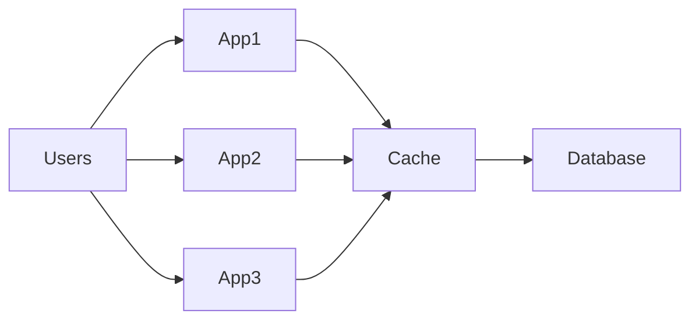
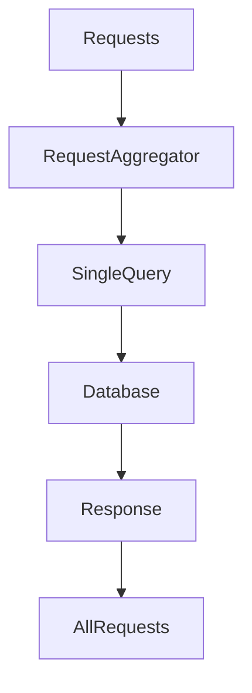
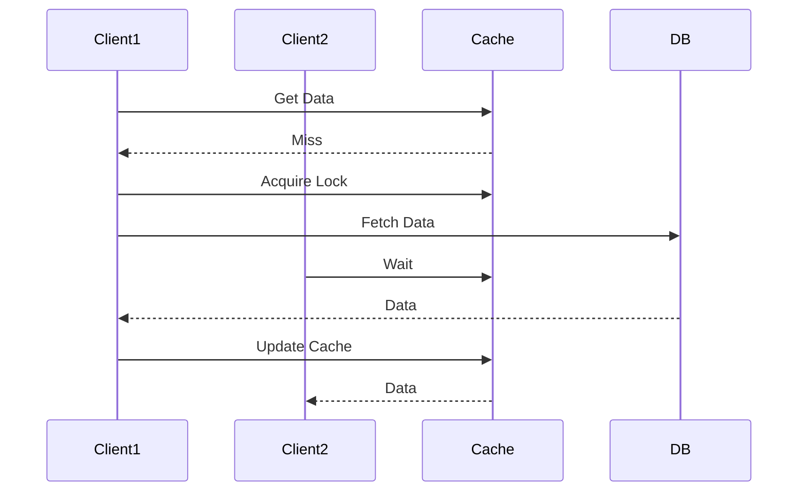
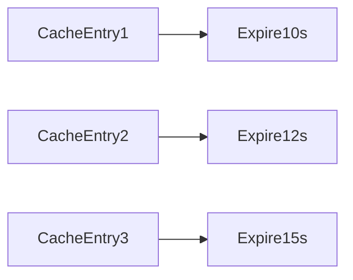
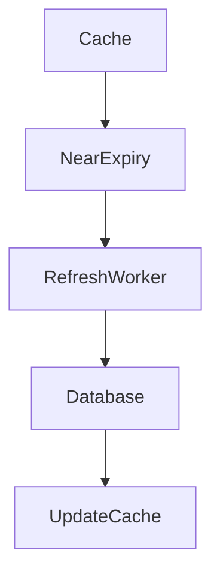
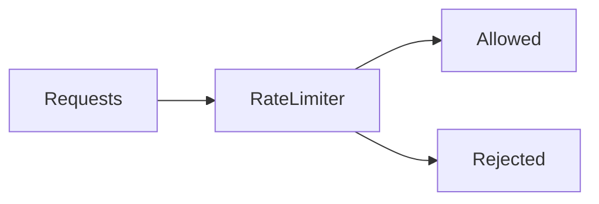
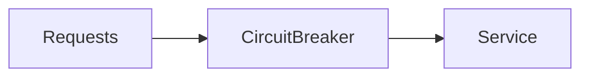
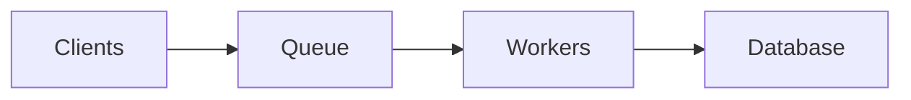
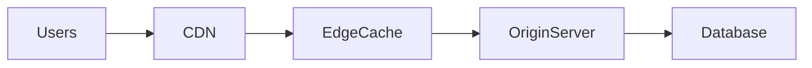

# Thundering Herd Effect

In large-scale distributed systems, a common failure scenario occurs when **many clients or processes simultaneously attempt to access the same resource after a trigger event**.

This phenomenon is known as the **Thundering Herd Effect**.

> The Thundering Herd Effect occurs when a large number of processes or requests wake up simultaneously and compete for the same resource, causing massive spikes in system load and potential system failure.

It often happens when:

- a **cached item expires**
- a **service becomes available after downtime**
- a **lock is released**
- a **popular resource suddenly becomes available**

The sudden surge of requests overwhelms backend systems like databases, APIs, or storage services.

---

# Real-World Analogy

Imagine a **concert hall with one exit door**.

When the concert ends:

- thousands of people rush toward the exit at the same time
- congestion occurs
- movement slows down drastically

This is similar to how requests flood a backend service in the thundering herd problem.

```mermaid
flowchart TD
    Crowd --> Door
    Crowd --> Door
    Crowd --> Door
    Crowd --> Door
    Door --> Exit
````

Only one small doorway exists for a massive crowd.

---

# Where the Thundering Herd Effect Happens

This problem appears frequently in distributed systems.

Common scenarios include:

| Scenario          | Description                               |
| ----------------- | ----------------------------------------- |
| Cache expiration  | Many requests fetch the same data from DB |
| Service recovery  | All clients reconnect simultaneously      |
| Lock release      | Waiting processes resume together         |
| Scheduled jobs    | Cron tasks start at the same time         |
| Rate limits reset | API requests spike immediately            |

Large-scale systems like Amazon and Netflix design systems specifically to avoid this behavior.

---

# Example Scenario: Cache Expiration

Consider a distributed system with a cache storing **popular product data**.

When the cache entry expires:

1. Thousands of users request the same product.
2. All requests miss the cache.
3. Every request queries the database.

```mermaid
sequenceDiagram
    participant Users
    participant App
    participant Cache
    participant DB

    Users->>App: Request Product
    App->>Cache: Check Cache
    Cache-->>App: Miss
    App->>DB: Query Product
    DB-->>App: Return Data
```

If **10,000 users request simultaneously**, the database receives **10,000 queries**.

This spike can overload the system.

---

# Thundering Herd in Distributed Systems

In large-scale architectures, the problem becomes severe because:

* systems operate with **millions of users**
* many services share the same backend
* caches may expire simultaneously across nodes



When the cache misses, **all application nodes query the database simultaneously**.

---

# System Impact

The thundering herd effect can cause multiple problems.

| Impact             | Description                   |
| ------------------ | ----------------------------- |
| Database overload  | Too many simultaneous queries |
| Increased latency  | Requests queue up             |
| Cascading failures | Downstream services fail      |
| System instability | Services repeatedly crash     |

In extreme cases, this may lead to **complete system outages**.

---

# Detecting the Problem

Typical symptoms include:

| Metric                     | Indicator           |
| -------------------------- | ------------------- |
| Sudden spike in DB queries | cache expiration    |
| CPU spikes                 | service overload    |
| Increased latency          | resource contention |
| Error rate increase        | system saturation   |

Monitoring tools like:

* Prometheus
* Grafana

help identify such spikes quickly.

---

# Strategies to Prevent Thundering Herd

Several architectural techniques help mitigate this problem.

---

# 1. Request Coalescing

Instead of allowing many requests to fetch the same data, the system ensures **only one request queries the backend**.

Other requests wait for the result.



Benefits:

* drastically reduces backend load
* prevents duplicate work

---

# 2. Cache Locking

When a cache miss occurs, the first request **acquires a lock**.

Other requests wait until the cache is updated.



This prevents multiple simultaneous DB queries.

---

# 3. Staggered Cache Expiration

If all cache entries expire simultaneously, large spikes occur.

Instead, systems use **randomized expiration times**.



This spreads load across time.

---

# 4. Background Cache Refresh

Caches can refresh data **before expiration**.



Users never see cache misses.

---

# 5. Rate Limiting

Systems can limit the number of requests allowed within a time window.



This protects backend services during spikes.

API gateways often implement rate limiting.

---

# 6. Circuit Breakers

If a backend service becomes overloaded, requests are temporarily blocked.



When the service fails repeatedly, the circuit breaker **opens** and prevents further requests.

---

# 7. Queue-Based Load Smoothing

Instead of directly hitting the database, requests can go through a queue.



This smooths sudden spikes into manageable workloads.

Distributed queues such as Apache Kafka help absorb traffic bursts.

---

# Example: Large-Scale Video Platform

Imagine millions of users accessing trending videos on a platform like YouTube.

If the cache for a trending video expires:

* millions of requests hit the origin servers
* servers may collapse under load

Instead, systems use:

* multi-layer caches
* background refresh
* request deduplication



The CDN absorbs most traffic and prevents backend overload.

---

# Cache Stampede vs Thundering Herd

These two problems are related but slightly different.

| Concept         | Meaning                                     |
| --------------- | ------------------------------------------- |
| Thundering Herd | Many processes wake simultaneously          |
| Cache Stampede  | Many requests hit database after cache miss |

Cache stampede is a **specific type** of thundering herd.

---

# Best Practices

To prevent thundering herd scenarios:

* use distributed caching
* randomize cache TTL
* implement request deduplication
* add rate limiting
* use queue-based buffering
* apply circuit breakers
* refresh cache proactively

---

# Summary

The **Thundering Herd Effect** is a critical scalability problem in distributed systems.

It occurs when many requests simultaneously compete for the same resource, leading to:

* backend overload
* increased latency
* cascading system failures

Effective system design mitigates this through techniques such as:

* request coalescing
* cache locking
* randomized expiration
* rate limiting
* queue-based buffering

By carefully designing these mechanisms, modern distributed systems can remain **stable and responsive even under massive traffic spikes**.


