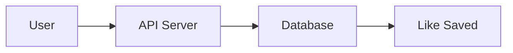
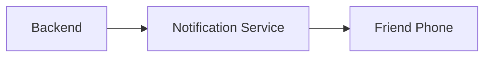
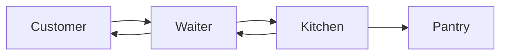
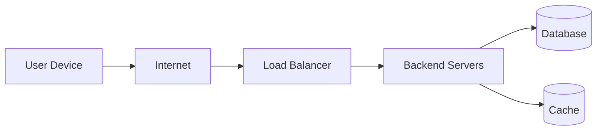
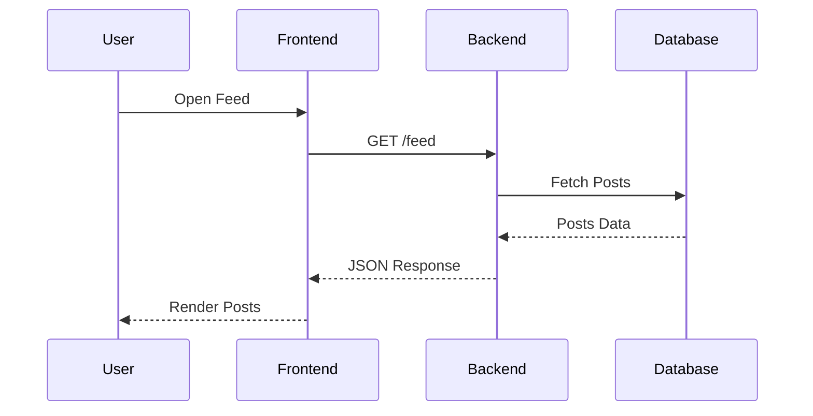
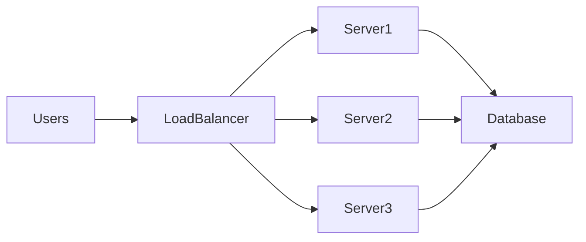

# What is a Backend Server?

When you use an app like Instagram, Uber, or YouTube, everything feels instant.

You tap a button, something happens.

But behind that simple interaction is an invisible system doing most of the work.

That invisible system is called the **Backend**.

The **backend server** is the part of an application responsible for:

- storing data
- processing logic
- connecting users
- enforcing security
- coordinating communication between systems

In short:

> The backend is the **brain of an application**.

The frontend is what users see.

The backend is what **makes everything actually work**.

---

# The Story of a Single "Like"

Let’s understand backend servers through a simple everyday example.

Imagine you like a friend’s Instagram post.

You tap the ❤️ button.

Almost instantly, your friend receives a notification.

This feels simple, but many things happen behind the scenes.

---

## Step-by-Step Breakdown

### 1. Request Sent

Your phone sends a request to Instagram's backend server.

```mermaid
sequenceDiagram
User->>Frontend App: Tap "Like"
Frontend App->>Backend Server: POST /like
````

Your app does **not** store the like.

Instead it sends a **network request** to a backend server somewhere in a data center.

---

### 2. Request Processed

The backend receives the request and verifies information.

It checks:

* Who is the user?
* Which post was liked?
* Is the user authenticated?

```mermaid
sequenceDiagram
Frontend->>Backend: Like Post
Backend->>Auth Service: Verify User
Auth Service-->>Backend: User Valid
```

---

### 3. Data Saved

The backend stores the like in a database.



Now the like becomes **permanent data**.

Even if the app closes, the information remains.

---

### 4. Friend Identified

The backend identifies who owns the post.

```
Post ID → Owner ID → Friend
```

This lookup happens inside the database.

---

### 5. Notification Triggered

Finally, the backend sends a notification to your friend.



Your friend now receives:

> "Your friend liked your photo."

All this happens in **milliseconds**.

---

# The Core Responsibility of a Backend

If we simplify backend development into one word, it would be:

> **Data**

Every backend exists primarily to manage data.

There are three fundamental operations.

---

## Core Backend Data Operations

| Operation       | What It Means                 | Example                         |
| --------------- | ----------------------------- | ------------------------------- |
| Persisting Data | Saving data permanently       | Saving a like, post, or comment |
| Fetching Data   | Retrieving stored data        | Loading your Instagram feed     |
| Receiving Data  | Accepting new data from users | Uploading a photo               |

---

### Example: Fetching User Feed

```ts
const posts = await client.get<Post[]>('/feed');
```

Backend:

1. Receives request
2. Queries database
3. Returns posts

---

### Example: Uploading Content

```ts
const post = await client.post<Post>('/posts', {
  caption: "Sunset 🌅",
  image: file
});
```

Backend:

1. Receives image
2. Stores file
3. Saves metadata
4. Returns new post

---

# Why Not Do Everything on the Frontend?

This is a common beginner question.

Why not just run everything in the browser?

Because browsers are intentionally **restricted environments**.

They run inside something called a **sandbox**.

A sandbox protects users from malicious code.

But it also limits what frontend code can do.

---

# Frontend vs Backend Comparison

| Capability         | Frontend (Browser)       | Backend (Server)     |
| ------------------ | ------------------------ | -------------------- |
| File System Access | Restricted               | Full access          |
| Database Access    | Unsafe & impractical     | Designed for it      |
| Heavy Computation  | Limited by device        | Powerful servers     |
| External API Calls | Restricted by CORS       | Fully allowed        |
| Security           | Visible code             | Hidden logic         |
| Scalability        | Depends on user's device | Can scale infinitely |

---

# Real World Analogy

Imagine a **restaurant**.

| Component | Real World Role  |
| --------- | ---------------- |
| Frontend  | Waiter           |
| Backend   | Kitchen          |
| Database  | Pantry / storage |
| API       | Order system     |

Flow:



Explanation:

1. Customer places order
2. Waiter sends order to kitchen
3. Kitchen prepares meal
4. Pantry stores ingredients
5. Food delivered back to customer

Users never see the kitchen.

But without it, the restaurant cannot function.

---

# Where Backend Servers Live

Backend servers run in **data centers** or **cloud platforms**.

Examples include:

* AWS
* Google Cloud
* Azure
* Vercel
* DigitalOcean

A typical architecture looks like this:



---

# Typical Responsibilities of a Backend

A real backend server does many things.

| Responsibility | Description                        |
| -------------- | ---------------------------------- |
| Authentication | Verify user identity               |
| Authorization  | Control access permissions         |
| Data Storage   | Save and retrieve information      |
| Business Logic | Implement app rules                |
| Notifications  | Send emails or push alerts         |
| API Handling   | Process frontend requests          |
| Integrations   | Communicate with external services |

---

# Example Backend Request Lifecycle

Let's follow a typical request.

User opens a feed.



Steps:

1. User performs an action
2. Frontend sends request
3. Backend processes logic
4. Database returns data
5. Backend sends response
6. Frontend displays UI

---

# What Technologies Are Used in Backends?

Backends can be built with many technologies.

| Layer            | Examples                        |
| ---------------- | ------------------------------- |
| Backend Language | Node.js, Python, Go, Java       |
| Frameworks       | Express, NestJS, Django, Spring |
| Databases        | PostgreSQL, MongoDB, MySQL      |
| Cache            | Redis                           |
| Message Queues   | Kafka, RabbitMQ                 |
| Infrastructure   | Docker, Kubernetes              |

---

# Scaling: Why Backend Servers Matter

When apps grow, backend systems must scale.

Example: Instagram

Millions of users liking posts simultaneously.

Backend architecture handles this by:



Multiple servers share workload.

This ensures the app remains fast.

---

# Best Practices in Backend Design

| Practice                  | Why It Matters                 |
| ------------------------- | ------------------------------ |
| Keep frontend lightweight | Offload heavy logic to backend |
| Validate all user input   | Prevent security issues        |
| Use authentication        | Protect user accounts          |
| Store data reliably       | Prevent data loss              |
| Design scalable APIs      | Handle millions of users       |

---

# Common Beginner Misconceptions

| Myth                      | Reality                           |
| ------------------------- | --------------------------------- |
| Backend is only databases | It includes logic, APIs, security |
| Frontend does everything  | Frontend only displays UI         |
| Backend is optional       | Required for almost all real apps |
| Backend only stores data  | It also processes interactions    |

---

# When Is Backend Not Needed?

Some simple applications can run without a backend.

Examples:

* Static websites
* Portfolio pages
* Landing pages
* Documentation sites

But the moment you need:

* user accounts
* comments
* data storage
* payments
* real-time communication

You need a backend.

---

# Summary

A backend server is the **central system that powers modern applications**.

It is responsible for:

* storing data
* processing user actions
* enforcing security
* connecting users
* scaling applications

Frontend applications provide the interface.

Backend servers provide the **intelligence and infrastructure**.

Understanding this separation is the **first step toward mastering backend development and system design**.

---

# What To Learn Next

After understanding backend fundamentals, the next concepts to explore are:

1. **APIs**
2. **HTTP and REST**
3. **Databases**
4. **Authentication**
5. **Server Architecture**
6. **Caching**
7. **Load Balancing**
8. **Microservices**

Each of these builds on the idea of the backend being the **central coordinator of data and logic in modern applications**.